Lab version:	15.0.26020.0

Last updated:	1/19/2017

## Overview

In this lab, you will learn how to use the new Team Foundation Build
    in order to build, test, and deploy your applications. This new
    scriptable build system is both web-based and cross-platform, and
    Microsoft recommends using it instead of the XAML build system
    whenever feasible. Although we won’t demonstrate all of the
    cross-platform possibilities in this lab, it is important to point
    out that you can also build for iOS, Android, Java (using Ant,
    Maven, or Gradle), and Linux.

## Pre-requisites

In order to complete this lab, you will need the Visual Studio 2017
    virtual machine provided by Microsoft. For more information on
    acquiring and using this virtual machine, please see [this blog
    post](http://aka.ms/almvm).

## Exercise 1: Build Agent Pools and Queues

In this exercise, you will learn how to create and configure build
    agent pools and queues in order to support the new agents in Team
    Foundation Build 2017 (formerly referred to as Build vNext). This
    new scriptable build system is web-based and cross-platform, and is
    recommended for all new and existing builds going forward.

### Task 1: Build Hub in TFS Web Access

1.  Log in as **Deniz Ercoskun** (VSALM\\Deniz). All user passwords are
    **P2ssw0rd**.

2.  Let’s say that the Fabrikam Fiber team has been building their web
    applications using XAML build system, but that they are ready to
    move to the new scriptable TFS build system that was made available
    in 2015. Since they have been relying on a standard build template,
    the transition to the new build system should be
    relatively straightforward.

3.  Let’s get started by touring the **Build** hub in the web portal.
    Launch **Internet Explorer** from the taskbar and click **TFS FF
    Portal** from the favorites bar at the top.

    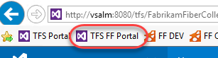

4.  Select the **Build & Release** tab.

    

5.  Select the **XAML** tab to view the project’s XAML
    build definitions. Here you can see the existing **Nightly
    Fabrikam (Dev)** XAML build definition that is currently used by the
    team to validate the development branch.

    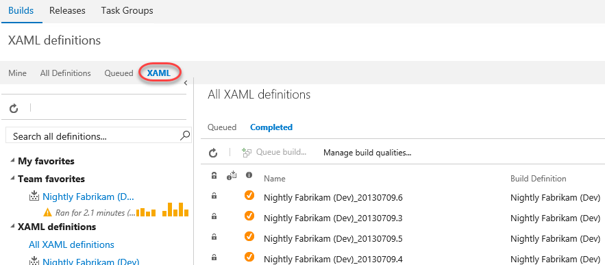

6.  We’ll return to this view shortly once we are ready to translate the
    existing XAML build to the new system, but first we need to
    configure the infrastructure necessary for the new build system.

### Task 2: Creating an Agent Pool

1.  The first thing that we need to do is to setup an agent pool for
    the project. This pool can contain both Windows and
    cross-platform agents.

2.  Hover over the **gear** icon in the navigation bar and select
    **Agent Queues**.

    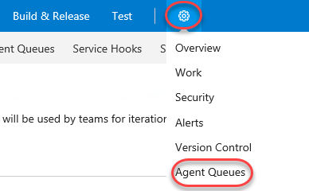

3.  Click **Manage pools** to view all available agent pools. This will
    open a new tab.

    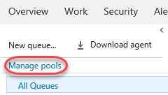

4.  There is already an agent pool named “**default**” with a single
    agent as shown here.

    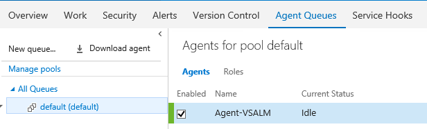

5.  Select the **Roles** tab to view pool security. This view allows
    account-level **Agent Pool Administrators** to create new agent
    pools and even manage each agent pool individually.

    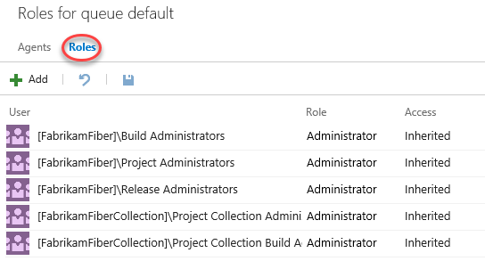

6.  Select the **default** pool’s dropdown and select **Delete** to
    delete the pool and its agents. Confirm the delete when asked.
    You’ll go through the process of adding these back later on.

    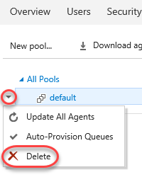

### Task 3: Creating a Build Queue

1.  Before we continue with the installation of an agent, let’s also
    ensure that we set up our team project collection with a build
    **queue** that points to the default agent pool. Since queues are
    scoped to your team project collection, you can share them across
    build definitions and team projects.

2.  This diagram from the MSDN documentation helps to illustrate the
    relationship between pools, queues, team project collections, and
    build definitions. Note that you can also install multiple agents on
    a single machine.

    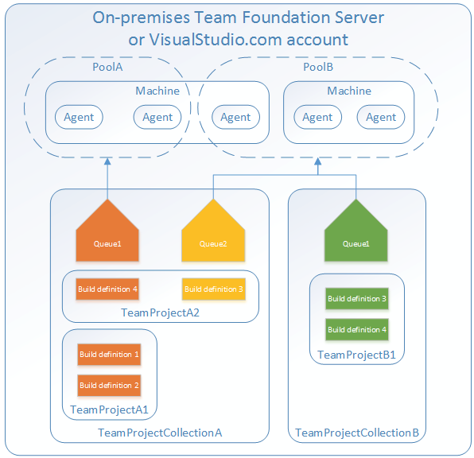

3.  Switch the scope of the portal to the web team project by selecting
    it from the navigation dropdown.

    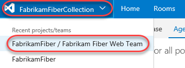

4.  Select the **Agent Queues** tab and click **Download agent**.

    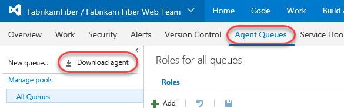

5.  Click **Download** and save the target to disk in a
    convenient place. Then close the agent download dialog. This
    download may take a few minutes, so you can continue to the
    next step.

    

6.  Click **New queue** to create a new queue.

    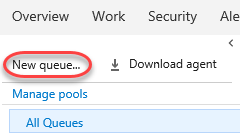

7.  Enter a **pool name** of “**default**” and click **OK**.

    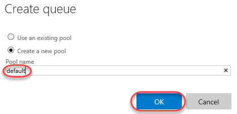

8.  It is also possible to configure collection-level build settings.
    From the gear dropdown, select **Collection settings**.

    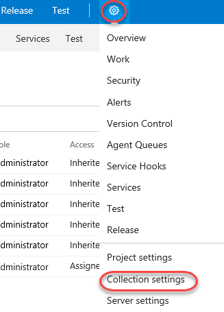

9.  Select the **Build and Release** tab. From here, you can specify the
    default and maximum settings for how long the system retains
    completed builds. The default retention policy is set at 10 days,
    with the maximum at 30 days. This means that regardless of what is
    set on the individual build definition all builds that have not been
    marked to "Retain indefinitely" will be deleted 30 days after
    they complete.

    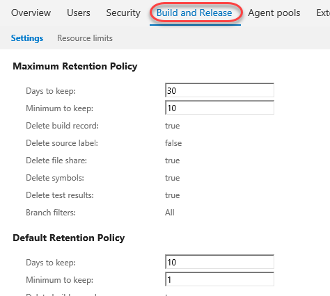

### Task 4: Installing and Configuring an Agent

1.  Wait for the agent download to finish if it has not already. Unzip
    it to c:\\agent when complete.

    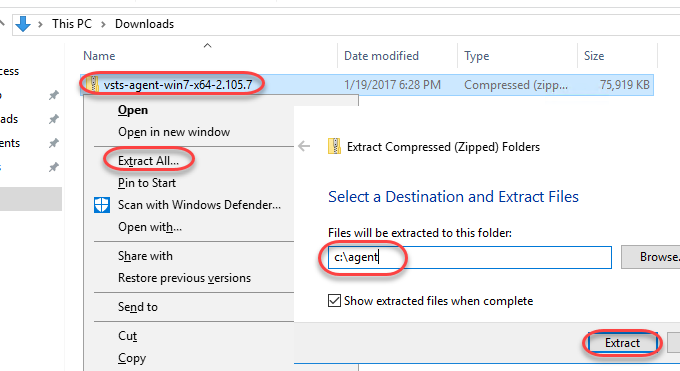

2.  Launch an instance of **Command Prompt as Administrator**. One way
    to do this is to hold down **Ctrl+Shift** and then click the
    **Command Prompt** icon in the taskbar.

3.  Change to the unzipped agent directory.

    **cd c:\\agent**

4.  Execute the agent configuration script.

    config.cmd

5.  Enter the server URL “<http://vsalm:8080/tfs>”.

6.  Press **Enter** for Integrated authentication.

7.  Press **Enter** to use the default agent pool of “default”.

8.  Press **Enter** to use the default agent name of “VSALM”.

9.  Press **Enter** to use the default path proposed for the agent work
    folder “c:\\agent\\\_work”.

10. When asked if you want to install as a Windows Service, type **“Y”**
    and then press **Enter**. Note that you could also configure the
    agent to run in interactive mode, which you may want to do if you
    were planning to execute coded UI tests.

11. Press **Enter** to run as network service, rather than providing a
    specific user account.

12. After a few moments, the script should complete with the successful
    installation and configuration of the new agent.

    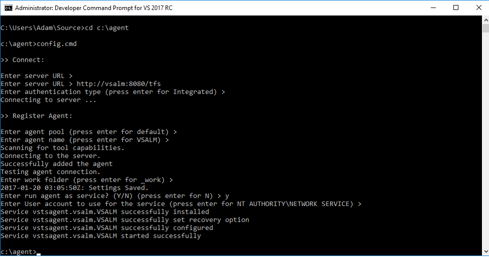

    **Note:** You weren’t prompted for credentials in this case, but
    under normal circumstances when installing on a remote machine you
    would be asked to sign in as an agent pool administrator. These
    credentials are only used once during the configuration process.

13. Return to **Internet Explorer** and select the **Agent pools** tab
    to see the new

    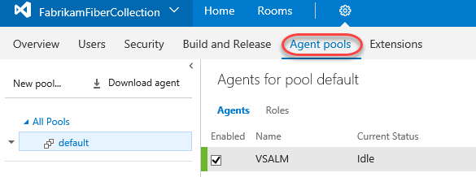

14. While we are here, select the **Capabilities** tab to take note of
    the System Capabilities list shown for the agent. System
    capabilities are name/value pairs that you can use to ensure that
    your build definition is only run by build agents that meet
    specified criteria. Environment variables automatically appear in
    the list. Some additional capabilities (such as .NET Frameworks) are
    also added automatically. You can also add your own capabilities to
    the list based on additional requirements for your builds. Later,
    when a build is queued, the system sends the job only to agents that
    have the capabilities demanded by the build definition.

    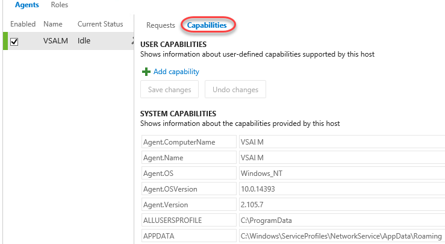

## Exercise 2: Build Definitions

In this exercise, you will learn how to create a basic build
    definition from one of the provided templates and then queue the
    build for execution.

### Task 1: Creating a Basic Build Definition from Template

1.  Now it is time to create a new build definition for the Fabrikam
    Fiber team. Navigate to the web team’s section of the portal using
    the project dropdown.

    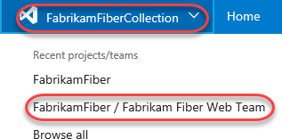

2.  Select the **Build & Release** tab and click **New definition** to
    create a new build definition.

    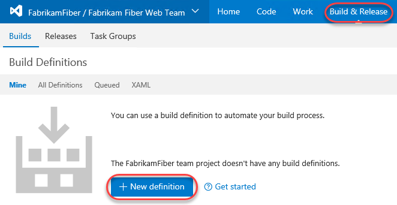

3.  The **Definition Templates** dialog lists a few different build
    templates that you can start with in order to build and test using
    Visual Studio, Xamarin, and Xcode. Alternatively, you can also
    simply start with an empty definition and add in the tasks that
    you need.

    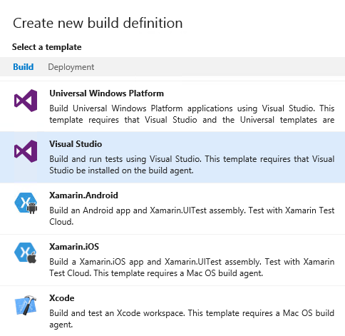

4.  Click the **Deployment** tab and note that templates are also
    provided that help accelerate deployment to Azure.

    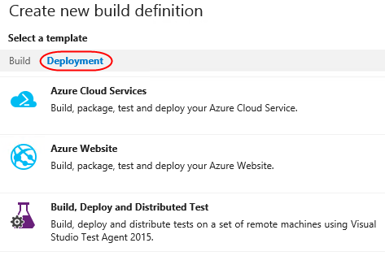

5.  Return to the **Build** tab, select the **Visual Studio** template,
    and then click **Next**.

    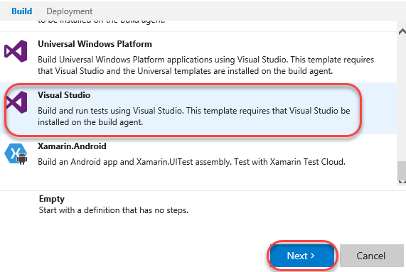

6.  Select **FabrikamFiber Team project** as the **Repository source**
    and click **Create** to create the build definition.

    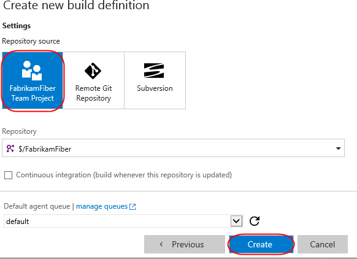

7.  The new build definition is initially set up with build steps that
    initiate a NuGet restore, a Visual Studio build, a test pass,
    publication of symbols for archival, a copy of the files to a
    staging location, and finally a publish of the build output to a
    drop location. These steps are all defined on the **Build** tab.

    **Note:** The build engine and tasks are both extensible, and are
    designed to be cross platform. In the event that you need a task
    that isn’t offered out of the box, you can create your own using the
    open source activities found on GitHub
    [here](https://github.com/Microsoft/vso-agent-tasks). This is also a
    good location to dig into if you would like to learn more about how
    the existing tasks work.

    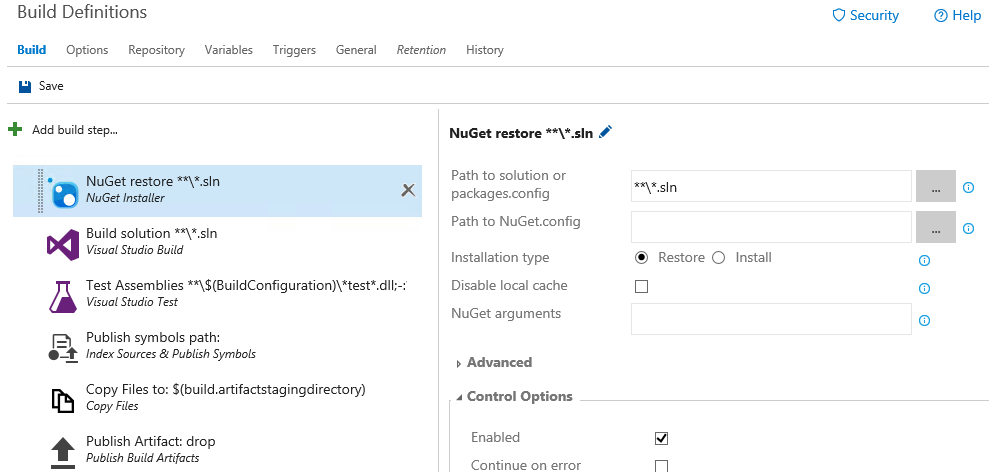

8.  Before we take a closer look at the configuration of the individual
    build steps, let’s take a look at a few of the key configuration
    options for the build definition itself, which are shown as tabs
    across the top. Click the **Options** tab.

    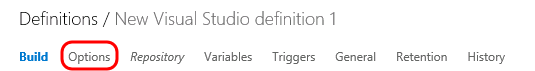

9.  The **Options** tab provides the MultiConfiguration option than can
    be enabled to build multiple configurations for multiple platforms.
    Select the **MultiConfiguration** option to enable it.

10. For **Multipliers**, enter “**BuildPlatform, BuildConfiguration**”
    in order to take into account these variables during the build.

    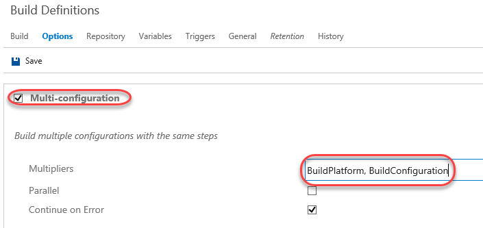

11. Enabling the **Parallel** option would allow you to distribute the
    jobs (one from each combination of values from Multipliers) to
    multiple agents in parallel (if available). However, since we only
    have one agent installed, we won’t be able to parallelize the
    build here.

12. Select the **Variables** tab. This list shows variables that will be
    available to all build steps (tasks). There are a number of
    predefined variables that can be used by tasks during the build, all
    listed [here](http://go.microsoft.com/fwlink/?LinkId=550988), as
    well as any additional variables that can be added in this view. By
    default, both **BuildConfiguration** and **BuildPlatform** are
    already defined here (we just referenced these in our configuration
    of Multipliers prior).

    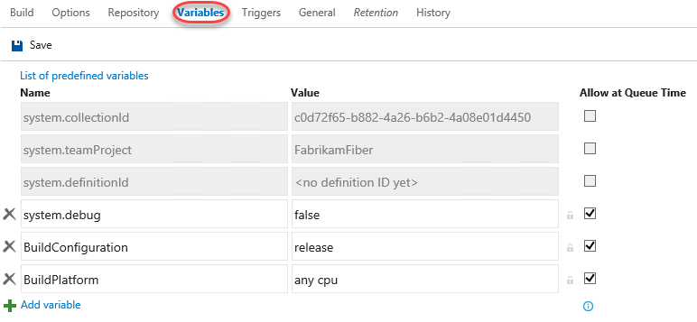

13. Although we will not do so for the purposes of this demo, you could
    modify BuildConfiguration to be “debug, release” in order to build
    both versions.

    **Note:** Using variables is a great way to specify secrets as well.
    If you were to add in a variable to contain a password, for example,
    you could click the Secret button just to the right of the Value
    column (lock icon) to prevent it from being displayed here.

14. Click the **Repository** tab. This is where you specify the source
    repository for build. In this case, **Team Foundation Version
    Control** is already selected for Repository Type and
    **FabrikamFiber** is selected as Repository Name. Of course, it is
    certainly possible to build from any Git repo as well. Set **Clean**
    to **true** so that the files are cleaned each pass.

    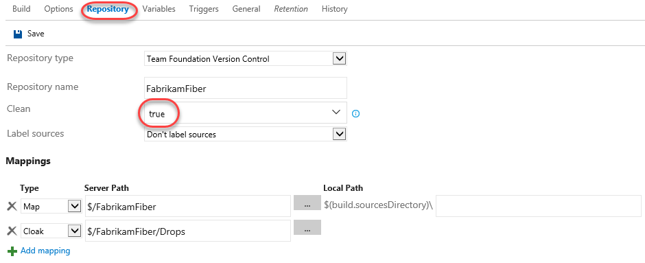

15. You can also configure mappings in order to pull down just the
    subset of code necessary in order to build. Click the **ellipses**
    button to the right of the first default mapping currently
    configured as “$/FabrikamFiber”.

    

16. In this case, we would just like to build the Dev branch of the
    code, so select the **Dev** branch node and then click **OK**.

    

17. Modify the second default mapping manually (of type Cloak) to be
    **“$/FabrikamFiber/Dev/Drops**”.

    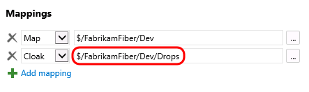

18. Select the **Triggers** tab. Although we will not use them in this
    definition, this is where you can configure continuous integration
    or schedule the build.

    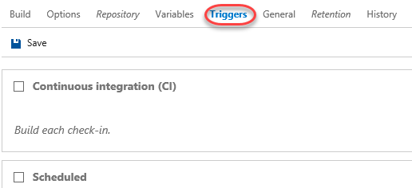

19. Select the **General** tab. This is where you configure the default
    queue to use, build number format, build timeout, and other
    general settings. This is also where you can specify demands for
    specific agent capabilities. By default, we have demands already in
    place to ensure that MSBuild, Visual Studio, and VSTest capabilities
    are defined for the agent.

    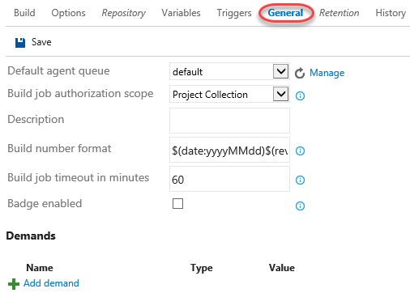

20. Select the **Build** tab. The first build step restores any NuGet
    packages that might be out of date. There are a variety of options
    for configuring this, such as the ability to disable the
    local cache. Leave these options as defaults.

    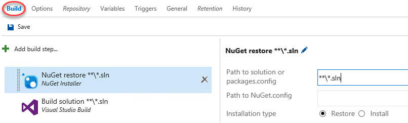

21. The second build step defined by this template is for **Build
    solution**. By default, it is configured to build all solution files
    in all subfolders, use the platform specified by the BuildPlatform
    variable, and use the configuration specified by the
    BuildConfiguration variable. Ensure **Visual Studio 2017** is
    selected as the **Visual Studio Version**.

    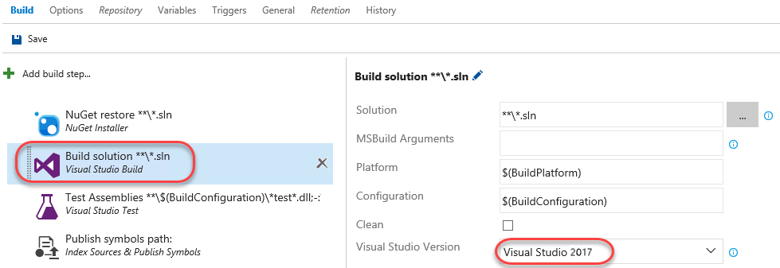

22. The third build step is **Test Assemblies**. We will mostly use
    default options here to test assemblies with “\*Fabrikam\*test” in
    the name. Update the **Test Assembly** field to
    **“\*\*\\$(BuildConfiguration)\\\*Fabrikam\*test\*.dll;-:\*\*\\obj\\\*\*”**.
    Note that this is really just inserting “\*Fabrikam”
    before “\*test”.

    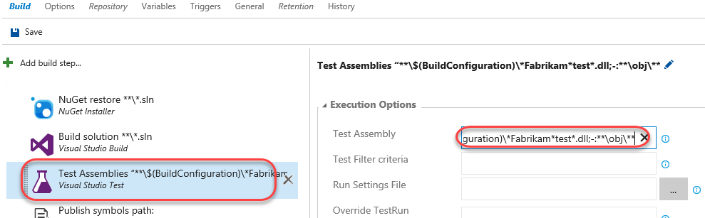

23. Expand the **Advanced Execution Options** section and note the
    additional options, such as the ability to specify a specific
    version of VSTest or paths to custom test adapters.

    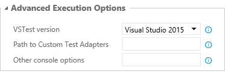

24. Before we move on to the next build step, select the **Continue on
    Error** option (from the Control Options section) so that subsequent
    steps will be executed even if some tests fail. The reason that we
    are doing this is because this virtual machine has some tests that
    are setup to fail for demonstration purposes.

    

25. Select the next build step named **Publish symbols path**. This is
    where you can specify a path to a symbol store share, although we
    will not do so at this time.

    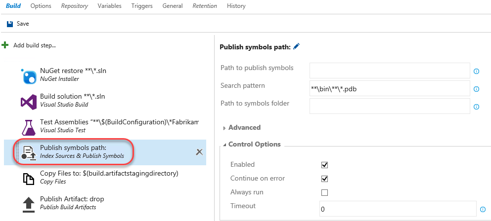

26. The fifth build step is **Copy Files** and places a copy of the
    build into a staging directory.

    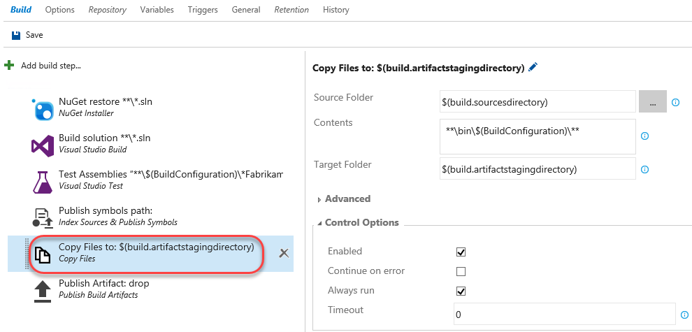

27. Select the final build step named **Publish Artifact**. This step
    will take the build output from the bin folder, zip it up into a
    build artifact named “drop”, and then upload it to the TFS server.

    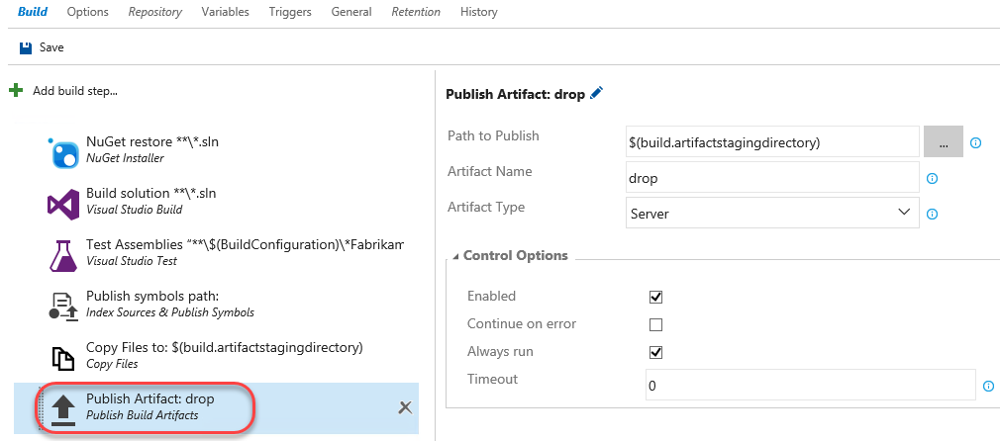

28. Click **Save**. Name the new build definition “**Fabrikam
    Development Build**” and click **OK**.

    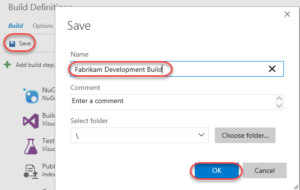

### Task 2: Queuing and Executing a Build

1.  Click **Queue new build**.

    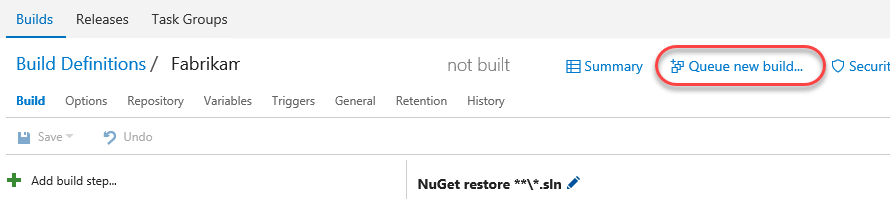

2.  Note that the **Queue Build** dialog allows you to configure the
    queue, optionally select a shelveset, variable values, and demands.
    Use the defaults presented by clicking **OK**.

    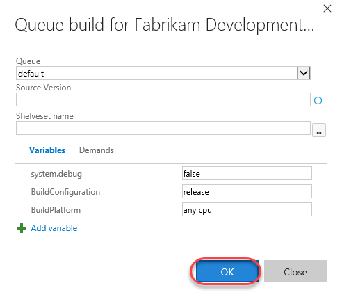

3.  Note that once the build starts, you can monitor the real-time build
    status in the live console view. As the Test step proceeds, you will
    see some red error text as there are some tests in this project that
    are designed to fail for demonstration purposes. At the end of the
    build you should see the message in orange displaying “Build
    Partially succeeded”. Note that you may need to refresh the browser
    if the build hasn’t started yet.

    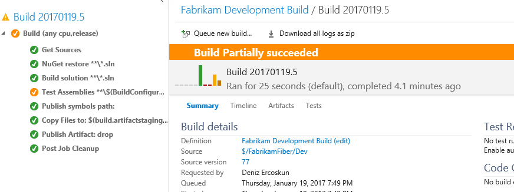

## Exercise 3: Build and Test Result Analysis

In this exercise, you will examine the build results and also see
    how to view the results from the tests that were executed as part of
    the build.

### Task 1: Analyzing Build and Test Results

1.  Select the **Logs** tab from the build results.

    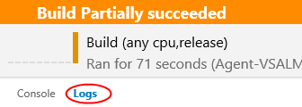

2.  Note that the scrollbar has a section that is highlighted red
    towards the bottom. If you scroll to this region of the log, you
    will see messages related to the failed tests.

    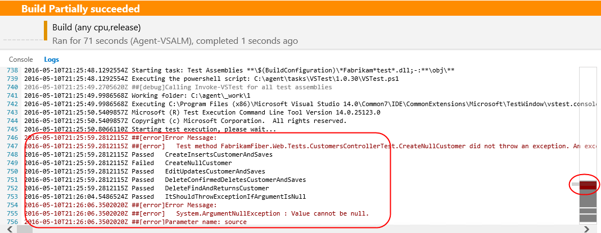

3.  In the left-hand pane showing the build number (and build node with
    build steps/status), click the root node to view the overall build
    summary view.

    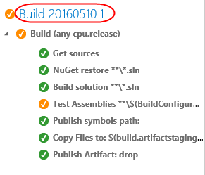

4.  Here you can see top-level information about the build including
    associated definition, source branch, who requested it,
    and timestamps. It also shows that the VSTest test run failed.

    

5.  To further investigate and analyze the test run results, select the
    **Tests** tab. Here you can see the details about the test run,
    build platform and flavor, test environment used, attachments, and
    some charts showing outcome.

    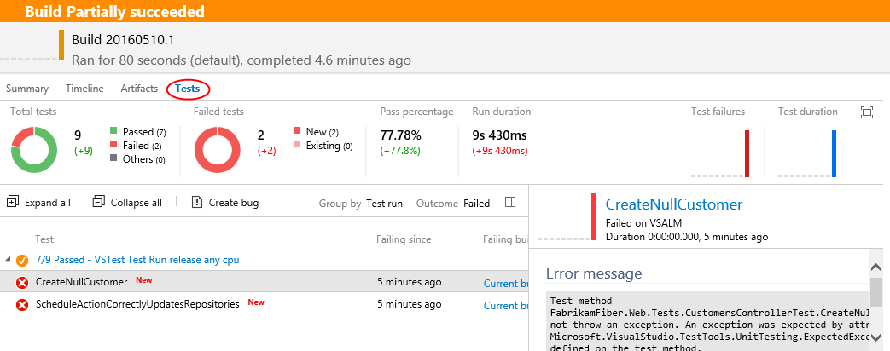

6.  Select the **Timeline** tab, which shows the overall steps from the
    build and how long they took to complete. It also shows the agent
    used, so you may be able to use this to see if there is good reason
    to scale out the agent pool in order to parallelize the build.

    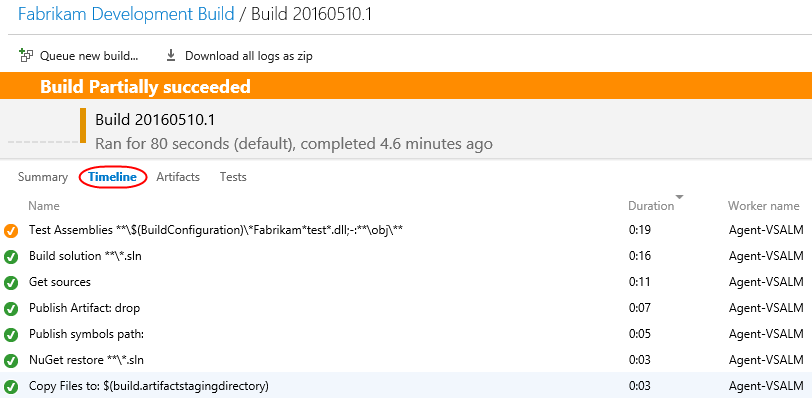

7.  Select the **Artifacts** tab. This is where you can download or
    explore the artifact containing the build output.

    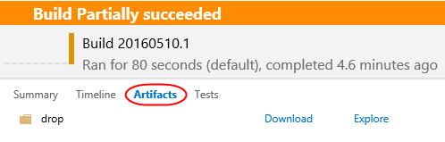

## Exercise 4: Continuous Integration and Deployment

In this exercise, you will learn how to modify a build to support
    continuous integration. In addition, you will also learn about some
    of the deployment options available.

### Task 1: Cloning a Build Definition

1.  Now let’s create a similar build definition, but this time include a
    step to deploy the Fabrikam Fiber website. Imagine that this build
    definition will be part of a continuous integration scenario.

2.  Return to the main Build view by selecting the **Builds** tab.

    

3.  Select the **Ellipses** drop-down just to the right of the
    **Fabrikam Development Build** definition to load the associated
    context menu. Note the options that allow us to create a new build
    definition using the current one as a starting point: **Clone** and
    **Save as a Template**. If we wanted to share this build definition
    as a template with the rest of our team, we could do so here and it
    would show up as a Custom template when creating a new definition.
    In this case, click **Clone** to create a copy of the
    current definition.

    
  

### Task 2: Adding a Deployment Step and Defining Machine Group

1.  Click **Add build step**.

    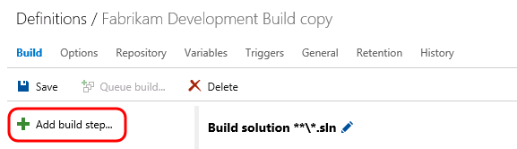

2.  Select the **Deploy** tab and check out the available options that
    range from Azure Web Site deployment to PowerShell execution and
    file copy. For simplicity, let’s deploy to the local machine using
    the **Windows Machine File Copy** step, so click **Add**. Then
    **Close** the dialog.

    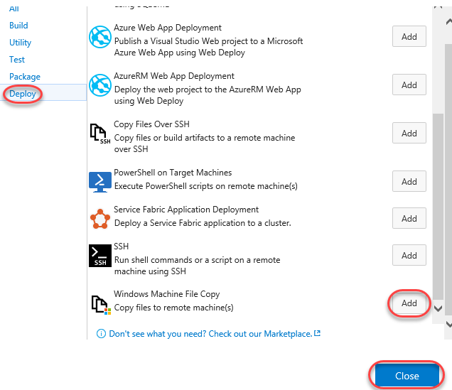

3.  Select the new **Windows Machine File Copy** step.

    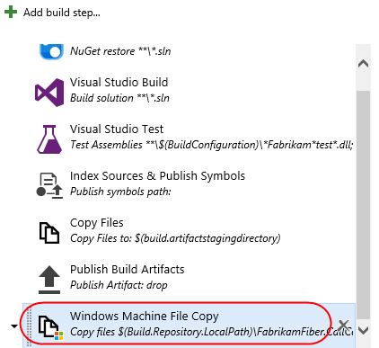

4.  Set the **Source** property to be the following:

    **$(Build.Repository.LocalPath)\\FabrikamFiber.CallCenter\\FabrikamFiber.Web**

5.  Set **Machines** to **“vsalm”**.

6.  For the purposes of this demo, we will continue to work within this
    virtual machine, so enter credentials for **vsalm\\administrator**
    (password is **P2ssw0rd**).

7.  Now we need to specify the target copy location on the
    destination machine. Enter “**c:\\inetpub\\FabrikamFiber.Web**” to
    the right of the **Destination Folder** field.

8.  Select the **Clean Target** option under **Advanced Options** so
    that the copy location will be cleaned before each deployment.

    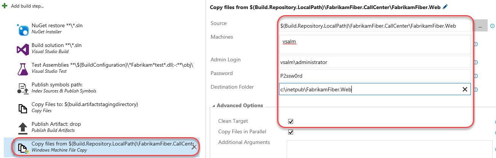

### Task 3: Configuring Continuous Integration

1.  Now let’s get the continuous integration functionality hooked up.
    Select the **Triggers** tab and check the **Continuous
    integration** option.

    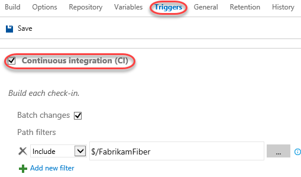

2.  You can add filters to include or exclude certain source paths.
    Click the **ellipses** button to the right of the default include
    path that is currently set to “$/FabrikamFiber”.

    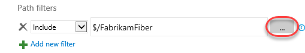

3.  In the **Select Path** window, expand and
    select $/FabrikamFiber/Dev/FabrikamFiber.CallCenter/FabrikamFiber.Web”.
    Click **OK**.

    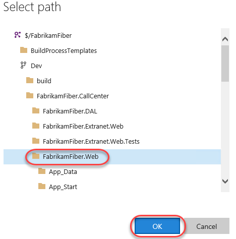

4.  There is also an option here to trigger the build on a set schedule.
    For example, we could set this build up to run every evening
    if desired.

5.  Click **Save**. Name the new build “**Fabrikam Development CI
    Build**” and then click **OK**.

    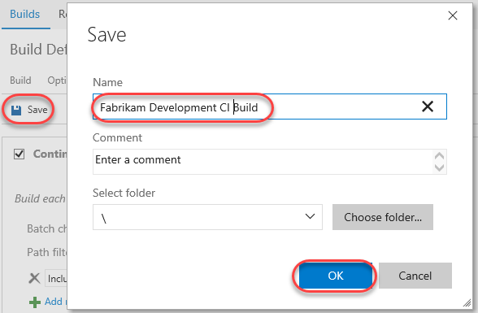

### Task 4: Triggering a Continuous Integration Build

1.  In a new browser window or tab, navigate to the **Code** tab.

    

2.  Open
    **$/FabrikamFiber/Dev/FabrikamFiber.CallCenter/FabrikamFiber.Web/readme.txt**
    by entering the path into the **Path** field and pressing **Enter**.
    Alternatively, you can use the tree navigation on the left. Click
    **Edit** to enter edit mode.

    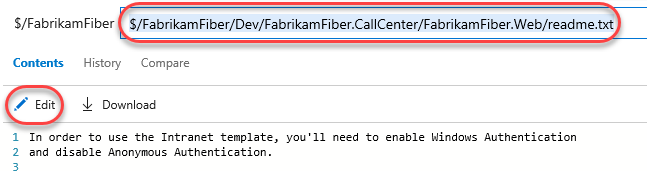

3.  Make any change to the file and click **Save**.

    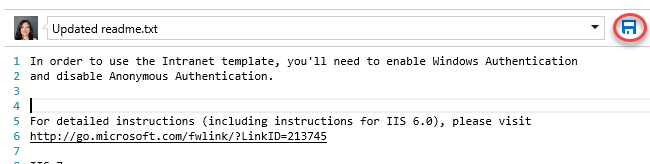

4.  Select the **Build & Release** tab and open the **Fabrikam
    Development CI Build** by clicking it.

    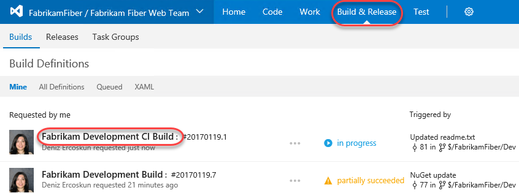

5.  Here you can review the build results.

    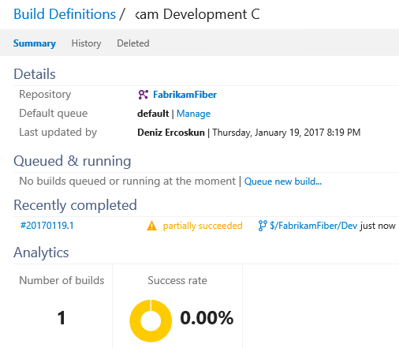

## Exercise 5: Scale out Testing using Machine Groups

In this exercise, you will learn how to scale out your testing needs
    by making use of machine groups and test agents running on
    other machines.

**Note:** This step is optional because it needs to download and
    install a test agent installer (approx. 130 MB) over the Internet,
    and therefore it will take a few minutes to complete.

### Task 1: Modifying Build to use External Test Agents

1.  Let’s say that we would like to modify our CI build to perform
    testing on dedicated testing hardware using a test agent. Click
    **Edit** to open the build definition.

    

2.  **Delete** the existing **Test Assemblies** step, as we will replace
    this shortly.

    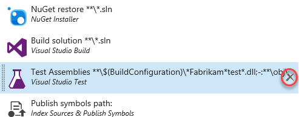

3.  Click the **Add Build Step** button.

    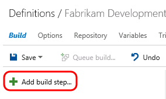

4.  First, we need to ensure that a test agent will be installed on our
    test machine(s). From the **Test** tab, click the **Add** button for
    the **Visual Studio Test Agent Deployment** task.

    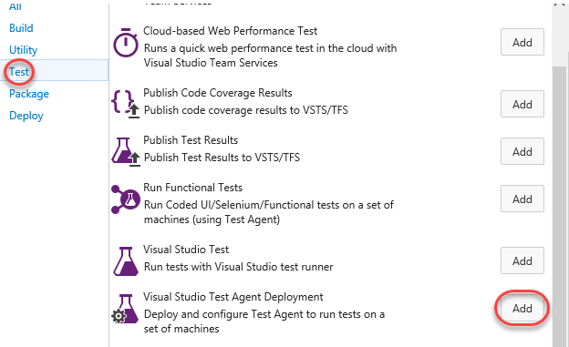

5.  Next, we need to specify the tests to run. Click the **Add** button
    for the **Run Functional Tests** task and click **Close**.

    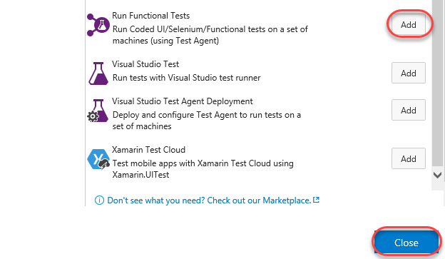

6.  Select the **Visual Studio Test Agent Deployment** step. Enter
    **“VSALM**” as the **Machine** and set the credentials as
    **VSALM\\Administrator** and **P2ssw0rd**. Also set the **Protocol**
    to **HTTP**.

    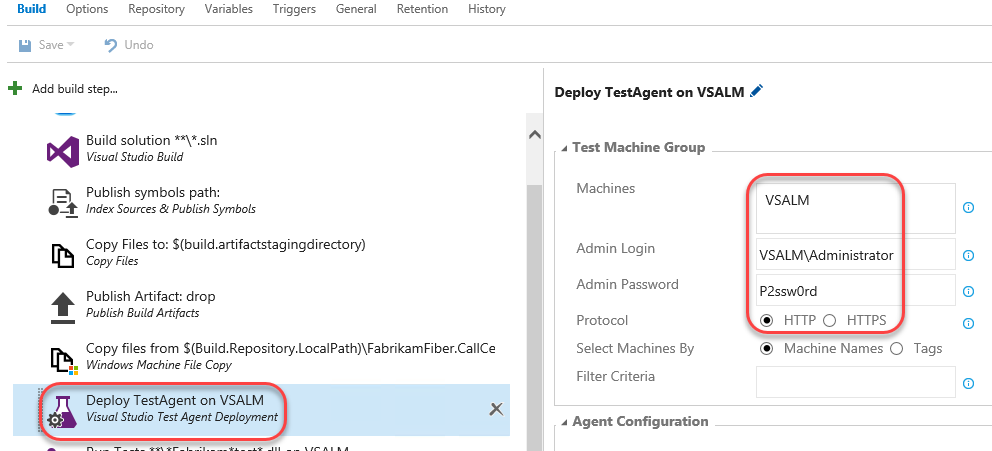

7.  Locate the **Agent Configuration** section and set the credentials
    as **VSALM\\Administrator** and **P2ssw0rd**.

    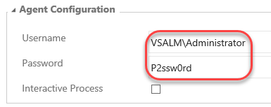

8.  Select the **Run Functional Tests** step.

9.  Set **Machines** to “**VSALM**” and set **Test Drop Location** to
    “**$(Build.Repository.LocalPath)**”.

    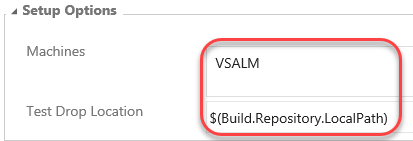

10. Under **Execution Options**, set **Test Assembly** to
    **“\*\*\\\*Fabrikam\*test\*.dll”**. Note that this is really just
    inserting “\*Fabrikam” before
    “\*test”.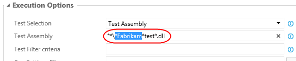

11. Although we will not do so in this demo, note that there are a
    number of other test settings that can be specified here such as
    platform, configuration, run settings file, test configurations, and
    so on.

12. Select the **Continue on Error** option from the **Control
    Options** section.

    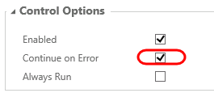

13. Since we are making some major changes to an existing build
    definition, perhaps it would be best to save it as a draft until we
    can validate that it is functioning as expected. Click the **Save**
    drop-down and then select the **Save as Draft** option.

    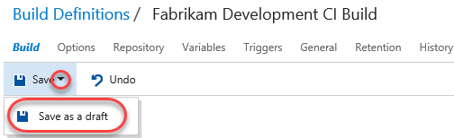

### Task 2: Testing and Saving Modified Build Draft

1.  Click **Queue Build**.

    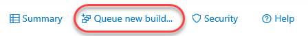

2.  Click **OK** to use the default options.

    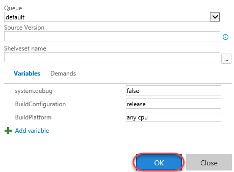

3.  Grab a coffee and watch the build proceed. Depending upon the speed
    of your Internet connection and hardware setup, it will take a few
    minutes to download and install the test agent. Note that this
    initial setup only happens once per machine from the machine group,
    and that subsequent build runs will check for an existing test agent
    install and use it if possible.

    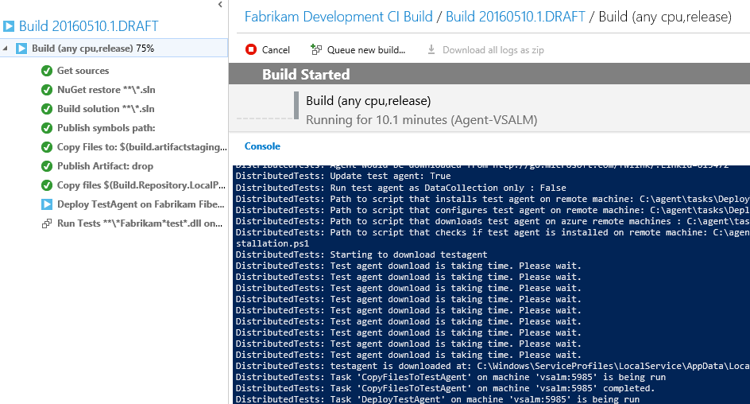

4.  The build should partially succeed in the end, again due to some
    failing tests.

    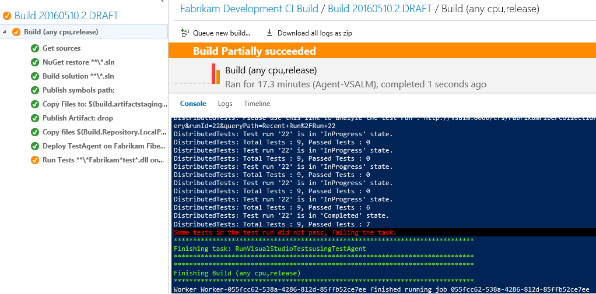

5.  Let’s say that we are satisfied with this draft build definition.
    Return to the build definition page by clicking **Fabrikam
    Development CI Build**.

    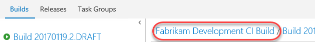

6.  Click **Edit**.

    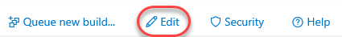

7.  Click **Publish Draft**.

    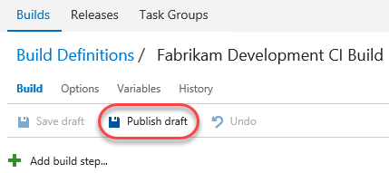

8.  In the **Publish Draft** dialog, click **OK**.

    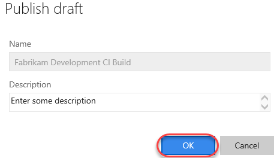

9.  Changes to the build definition can be viewed on the
    **History** tab. Note that the changes that we just applied show up
    at the top of the list. Select the first change in the list and then
    click the **Diff** button to see changes.

    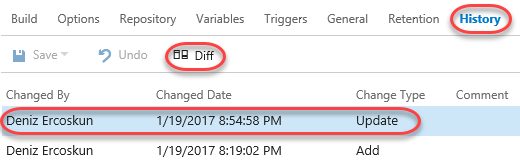

10. The diff view should look something like the following screenshot.

    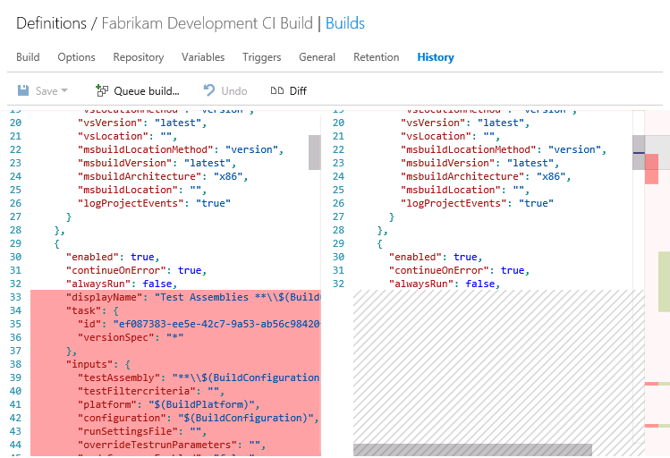

### Task 3: Reviewing build load

1.  From the **Gear** dropdown menu, select **Agent Queues**.

    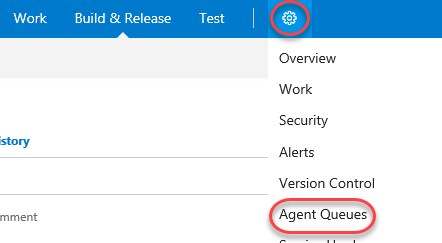

2.  Here you can get a unified view of all the builds processed
    per pool. In the event that you need to perform capacity planning,
    these details can help you understand how each pool is handling
    their current load across all serviced queues and build definitions.

    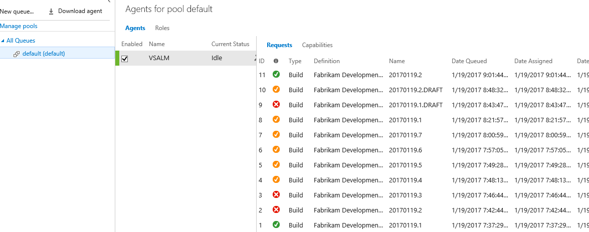
