<div class="rw-ui-container"></div>

## Overview

In this lab, you will learn how to use the Team Foundation Build in order to build, test, and deploy your applications. This scriptable build system is both web-based and cross-platform, while also providing a modern interface for visualizing sophisticated workflows. Although we won't demonstrate all of the cross-platform possibilities in this lab, it is important to point out that you can also build for iOS, Android, Java (using Ant, Maven, or Gradle), and Linux.

## Prerequisites

In order to complete this lab you will need the Visual Studio 2017 virtual machine provided by Microsoft. Click the button below to launch the virtual machine on the Microsoft Hands-on-Labs portal.

<a href="https://www.microsoft.com/handsonlabs/SelfPacedLabs/?storyId=external://content-private/content/external/Microsoft-Virtual-Labs/DT00167" class="launch-hol" role="button" target="_blank"><span class="lab-details">Launch the virtual machine</span></a>

Alternatively, you can download the virtual machine from [here](../almvmdownload/)

## About the Fabrikam Fiber Scenario

This set of hands-on-labs uses a fictional company, Fabrikam Fiber, as a backdrop to the scenarios you are learning about. Fabrikam Fiber provides cable television and related services to the United States. They are growing rapidly and have embraced Windows Azure to scale their customer-facing web site directly to end-users to allow them to self-service tickets and track technicians. They also use an on-premises ASP.NET MVC application for their customer service representatives to administer customer orders.

In this set of hands-on labs, you will take part in a number of scenarios that involve the development and testing team at Fabrikam Fiber. The team, which consists of 8-10 people has decided to use Visual Studio application lifecycle management tools to manage their source code, run their builds, test their web sites, and plan and track the project.

## Exercise 1: Build Agent Pools and Queues

In this exercise, you will learn how to create and configure build agent pools and queues in order to support the new agents in Team Foundation Build 2018. This new scriptable build system is web-based and cross-platform, and is recommended for all new and existing builds going forward.

### Task 1: Touring the Build Hub in TFS Web Access

1. Log in as **Deniz Ercoskun (VSALM\Deniz)**. All user passwords are **P2ssw0rd**.

1. Let's get started by touring the **Build** hub in the web portal. Launch **Internet Explorer** from the taskbar and click **TFS FF Portal** from the favorites bar at the top.

    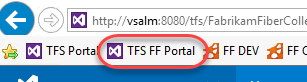

1. Select the **Build and Release** tab. This view provides a dashboard to access all available builds for the project.

    

1. We'll return to this view shortly once we are ready to create a new build, but first we need to configure the infrastructure necessary for the new build system.

### Task 2: Creating an Agent Pool

1. The first thing that we need to do is to setup an agent pool for the project. This pool can contain both Windows and cross-platform agents.

1. Hover over the **gear** icon in the navigation bar and select **Agent Queues**.

    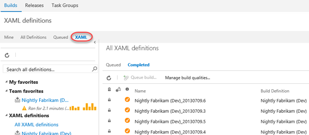

1. There is already an agent queue named **"default"** with a single agent as shown here.

    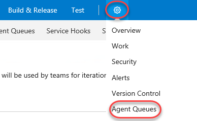

1. Click **Manage pools** to view all available agent pools. This will open a new tab.

    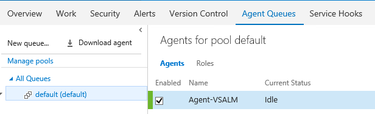

1. Select the **default** pool's dropdown and select **Delete** to delete the pool and its agents. Confirm the delete when asked. You'll go through the process of adding these back later on.

    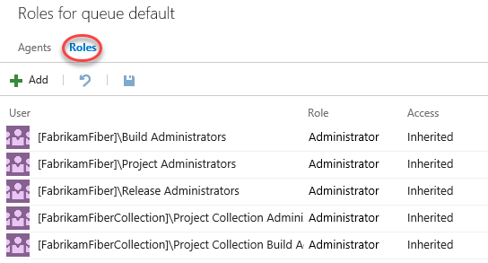

1. Close the pool management tab. This should leave you with a single queue management tab.

### Task 3: Creating a Build Queue

1. Before we continue with the installation of an agent, let's also ensure that we set up our team project collection with a build **queue** that points to the default agent pool. Since queues are scoped to your team project collection, you can share them across build definitions and team projects.

1. This diagram from the MSDN documentation helps to illustrate the relationship between pools, queues, team project collections, and build definitions. Note that you can also install multiple agents on a single machine.

    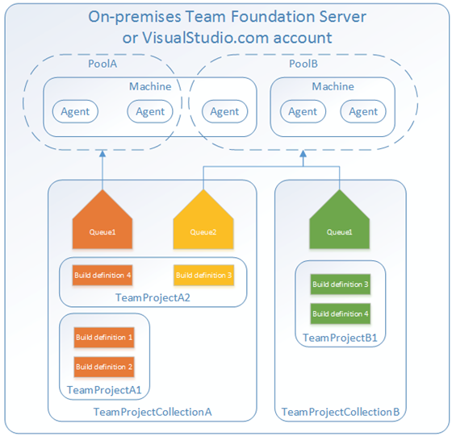

1. Click **Download agent**.

    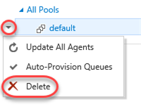

1. Click **Download** and save the target to disk in a convenient place. Then close the agent download dialog. This download may take a few minutes, so you can continue to the next step.

    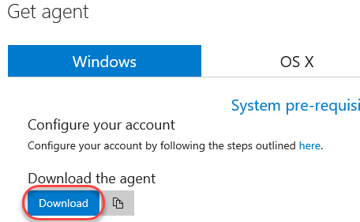

1. Close the current tab **(Roles for all pools)** to return to the original tab **(Agents for pool default)**.

1. Click **New queue** to create a new queue.

    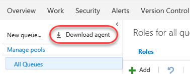

1. Enter a **Pool name** of "**default**" and click **OK**.

    

1. It is also possible to configure collection-level build settings. From the gear dropdown, select **Collection settings**.

    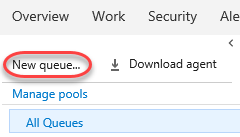

1. Select the **Build and Release** tab. From here, you can specify the default and maximum settings for how long the system retains completed builds. The default retention policy is set at 10 days, with the maximum at 30 days. This means that regardless of what is set on the individual build definition all builds that have not been marked to "Retain indefinitely" will be deleted 30 days after they complete.

   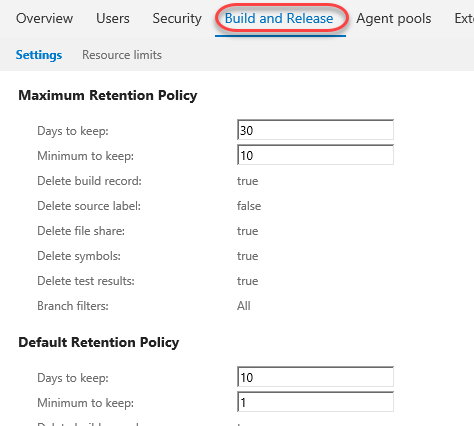

### Task 4: Installing and Configuring an Agent

1. Wait for the agent download to finish if it has not already. Unzip it to **c:\agent** when complete.

    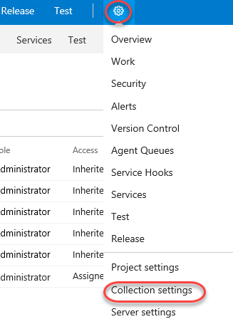

1. Launch an instance of **Command Prompt** as **Administrator** from the taskbar.

1. Change to the unzipped agent directory.

    ```cmd
    cd c:\agent
    ```
1. Execute the agent configuration script.

    ```cmd
    config.cmd
    ```
1. Enter the server URL "[http://vsalm:8080/tfs](http://vsalm:8080/tfs)".

1. Press **Enter** for **Integrated** authentication.

1. Press **Enter** to use the default agent pool of "default".

1. Press **Enter** to use the default agent name of "VSALM".

1. Press **Enter** to use the default path proposed for the agent work folder "c:\agent\_work".

1. When asked if you want to install as a Windows Service, type **"Y"** and then press **Enter**. Note that you could also configure the agent to run in interactive mode, which you may want to do if you were planning to execute coded UI tests.

1. Press **Enter** to run as network service, rather than providing a specific user account.

1. After a few moments, the script should complete with the successful installation and configuration of the new agent.

    

    > **Note:** You weren't prompted for credentials in this case, but under normal circumstances when installing on a remote machine you would be asked to sign in as an agent pool administrator. These credentials are only used once during the configuration process.

1. Return to **Internet Explorer** and navigate to the **Agent Pools** tab.

    

1. You will now see the new **default** queue.

    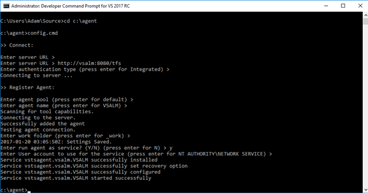

1. Select the **Capabilities** tab to take note of the System Capabilities list shown for the agent. System capabilities are name/value pairs that you can use to ensure that your build definition is only run by build agents that meet specified criteria. Environment variables automatically appear in the list. Some additional capabilities (such as .NET Frameworks) are also added automatically. You can also add your own capabilities to the list based on additional requirements for your builds. Later, when a build is queued, the system sends the job only to agents that have the capabilities demanded by the build definition.

   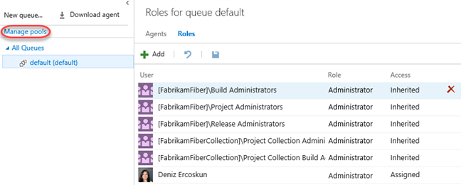

## Exercise 2: Build Definitions

In this exercise, you will learn how to create a basic build definition from one of the provided templates and then queue the build for execution.

### Task 1: Creating a basic build definition from a template

1. Now it is time to create a new build definition for the Fabrikam Fiber team. Navigate to the **TFS FF Portal** using the shortcut.

    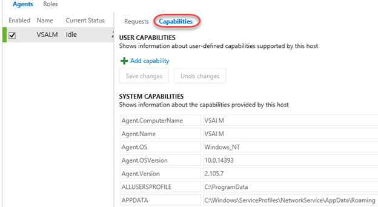

1. Navigate to the web team's section of the portal using the project dropdown.

    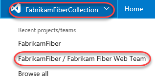

1. From the navigation, select the **Build and Release \| Builds**.

    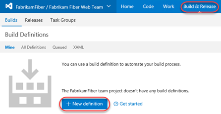

1. Click **New definition** to create a new build definition.

    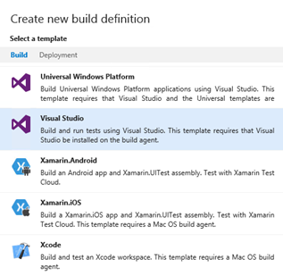

1. There are many different build templates that you can start with in order to build, test, and deploy using Visual Studio, Xamarin, Xcode, and more. Alternatively, you can also simply start with an empty definition and add in the tasks that you need. In this case, select the **ASP.NET** option and click **Apply**.

    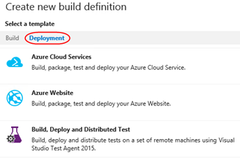

1. Update the name of the build to **"Fabrikam Development Build"**.

    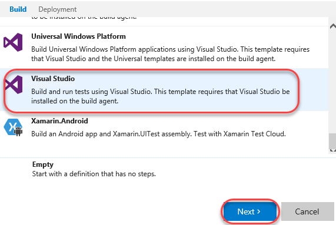

1. Select the **default** queue to use as the **Agent queue**.

    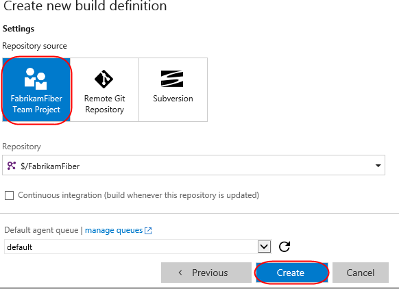

1. Locate the **Parameters** section and click the **Browse** button next to **Path to solution**.

    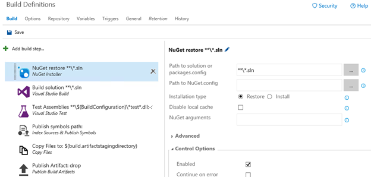

1. Locate the **FabrikamFiber.CallCenter.sln** solution under the **Dev** branch and click **OK**.

    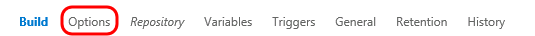

1. The new build definition is initially set up with build steps that initiate a NuGet restore, a Visual Studio build, a test pass, publication of symbols for archival, a copy of the files to a staging location, and finally a publish of the build output to a drop location. These steps are all defined on the **Build** tab.

    > **Note:** The build engine and tasks are both extensible, and are designed to be cross platform. In the event that you need a task that isn't offered out of the box, you can create your own using the open source activities found on GitHub [here](https://github.com/Microsoft/vso-agent-tasks). This is also a good location to dig into if you would like to learn more about how the existing tasks work.

    

1. Before we take a closer look at the configuration of the individual build steps, let's take a look at a few of the key configuration options for the build definition itself, which are shown as tabs across the top. Click the **Variables** tab.

    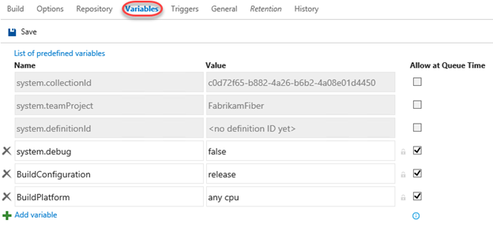

1. This list shows variables that will be available to all build steps (tasks). There are a number of predefined variables that can be used by tasks during the build, all listed [here](http://go.microsoft.com/fwlink/?LinkId=550988), as well as any additional variables that can be added in this view. By default, both **BuildConfiguration** and **BuildPlatform** are already defined.

    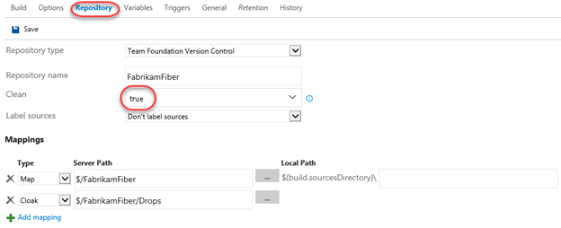

1. Although we will not do so for the purposes of this lab, you could modify **BuildConfiguration** to be **"debug, release"** in order to build both versions.

    > **Note:** Using variables is a great way to specify secrets as well. If you were to add in a variable to contain a password, for example, you could click the Secret button just to the right of the Value column (lock icon) to prevent it from being displayed here.

1. Select the **Triggers** tab. Although we will not use them in this definition, this is where you can configure continuous integration or schedule the build.

    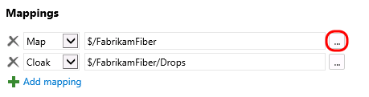

1. Select the **Triggers** tab.

    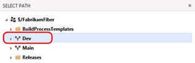

1. This is where you configure the build number format, build timeout, and other general settings. This is also where you can specify demands for specific agent capabilities. By default, we have demands already in place to ensure that MSBuild, Visual Studio, and VSTest capabilities are defined for the agent.

    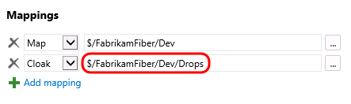

1. Select the **Retention** tab. This tab enables you to configure how long builds are retained for.

    

1. There is also the **History** tab where you can review build history (there isn't any yet).

1. Return to the **Tasks** tab.

    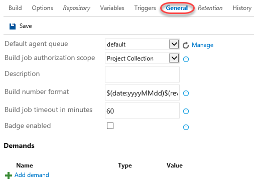

1. Select the first task, **Get sources**.

    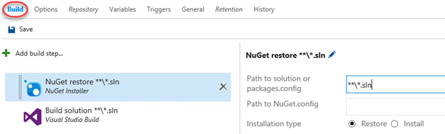

1. This task defines how the source is acquired for building. You set this earlier using one of the master process options, but we can tweak the workspace mappings by adding **"/Dev"** into the server paths.

    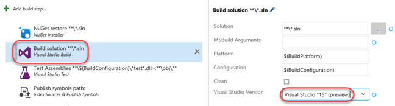

1. The next two tasks install the specified version of NuGet and use it to restore packages, respectively.

    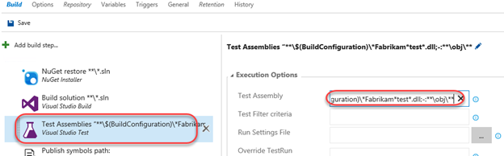

1. Select the **Build solution** task.

    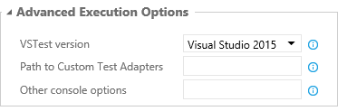

1. This task is responsible for running the actual build. There are a lot of options to configure, but we'll only change the **Visual Studio Version** to specify **Visual Studio 2017**.

    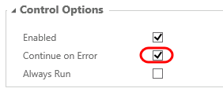

1. Select the **Test Assemblies** task.

    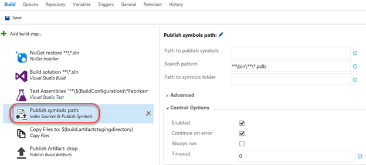

1. We will mostly use default options here to test assemblies with "*Fabrikam*test" in the name. Update the **Test Assemblies** field to **"**\$(BuildConfiguration)\*Fabrikam*test*.dll"**. Note that this is really just inserting "*Fabrikam" before "*test". Leave the second line, which tells the system to ignore anything in an **obj** directory.

    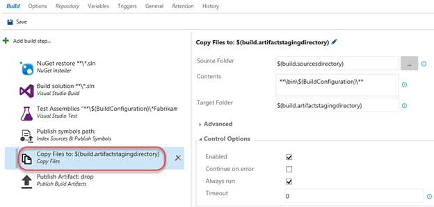

1. Locate the **Execution options** section and update **Test platform version** to specify **Visual Studio 2017**.

    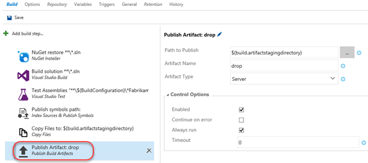

1. Before we move on to the next build step, select the **Continue on Error** option (from the **Control Options** section) so that subsequent steps will be executed even if some tests fail. The reason that we are doing this is because this virtual machine has some tests that are setup to fail for demonstration purposes.

    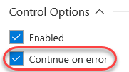

1. There is also a **Run this task** option that allows you to specify conditions under which this task is run. By default, tasks run only when all previous tasks have succeeded (a build is stopped if anything fails). However, you can change that behavior for any task if you prefer that task to run under different conditions. You can even specify custom conditions using a functional syntax. Learn more about this in [the documentation](https://docs.microsoft.com/en-us/vsts/build-release/concepts/process/conditions).

    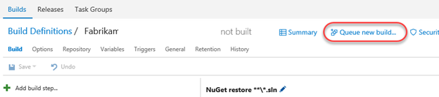

1. Select the next build step named **Publish symbols path**. This is where you can specify a path to a symbol store share, although we will not do so at this time.

    

1. Select the final build step named **Publish Artifact**. This step will take the build output from the bin folder, zip it up into a build artifact named "drop", and then upload it to the TFS server.

    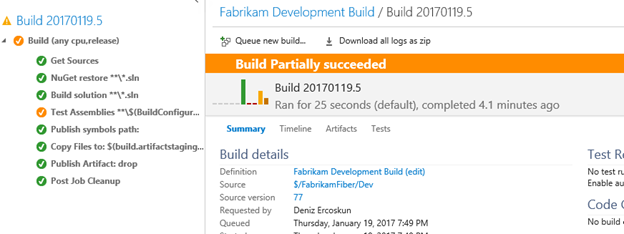

1. Note that you can easily rearrange build tasks by dragging and dropping them as desired. If you try this now, be sure to return to them to their correct place in this workflow.

    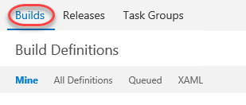

1. It's also very easy to add additional tasks to the build. Select **Add Task**.

    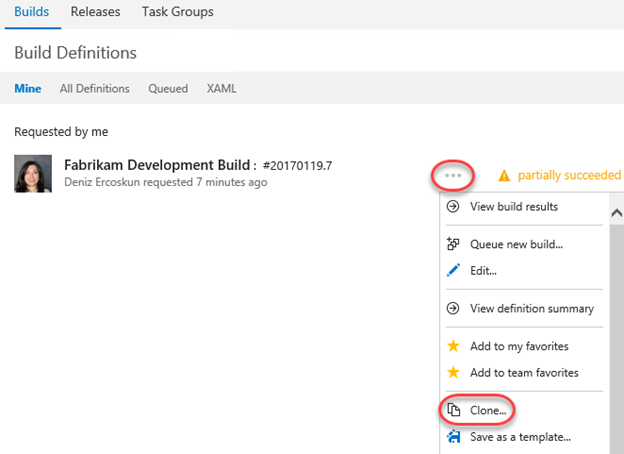

1. There are tons of available tasks across a variety of categories.

    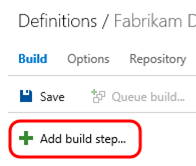

1. Click **Save & queue \| Save**. Click **Save** in the dialog to accept the defaults.

    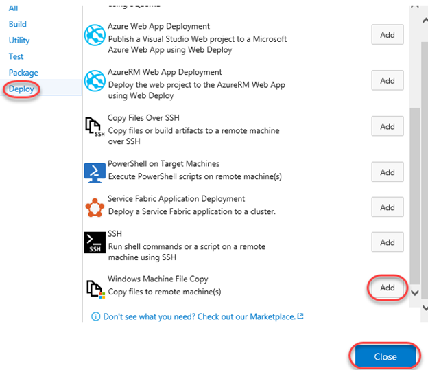

1. Name the new build definition "**Fabrikam Development Build**" and click **OK**.

   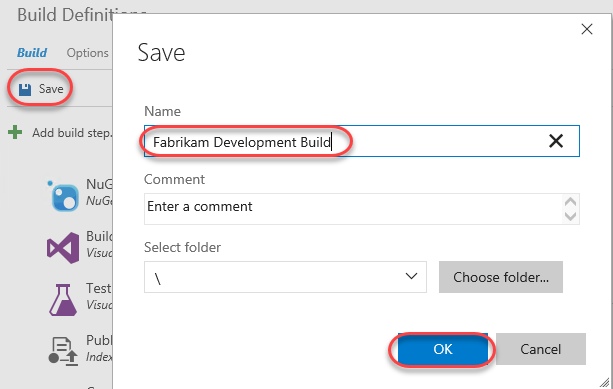

### Task 2: Queuing and Executing a Build

1. Click **Queue**.

    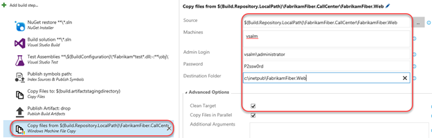

1. Note that the **Queue Build** dialog allows you to configure the queue, optionally select a shelveset, variable values, and demands. Use the defaults presented by clicking **Queue**.

    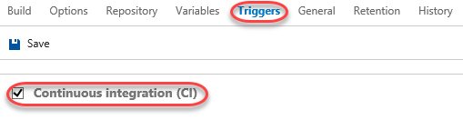

1. Note that once the build starts, you can monitor the real-time build status in the live console view. Click the build number to track it.

    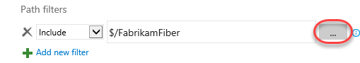

1. The console provides a streaming view into the steps each task takes during its turn in the build.

    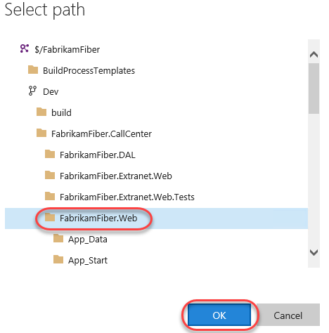

1. As the Test step proceeds, you will see some red error text as there are some tests in this project that are designed to fail for demonstration purposes. At the end of the build you should see the message in orange displaying "Build Partially succeeded". Note that you may need to refresh the browser if the build hasn't started yet.

    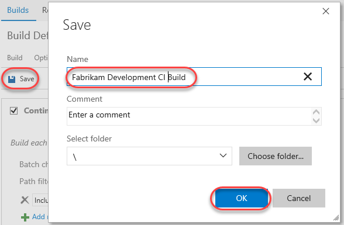

1. Once the build has completed, click the root build number in the tree view to see an overview of the build.

    

## Exercise 3: Continuous Integration and Deployment

In this exercise, you will learn how to modify a build to support continuous integration. In addition, you will also learn about some of the deployment options available.

### Task 1: Cloning a Build Definition

1. Now let's create a similar build definition, but this time include a step to deploy the Fabrikam Fiber website. Imagine that this build definition will be part of a continuous integration scenario.

1. Return to the main Build view by selecting the **Builds** tab.

    

1. Select the **Ellipses** drop-down just to the right of the **Fabrikam Development Build** definition to load the associated context menu. Note the options that allow us to create a new build definition using the current one as a starting point: **Clone** and **Save as a Template**. If we wanted to share this build definition as a template with the rest of our team, we could do so here and it would show up as a Custom template when creating a new definition. In this case, click **Clone** to create a copy of the current definition.

    

### Task 2: Adding a Deployment Step and Defining Machine Group

1. Update the name of the build to **"Fabrikam Development CI Build"**.

    

1. Click **Add Task**.

    

1. Select the **Deploy** tab and check out the available options that range from Azure Web Site deployment to PowerShell execution and file copy. For simplicity, let's deploy to the local machine using **Windows Machine File Copy**, so click its **Add**.

    

1. Select the new Windows Machine File Copy step.

    

1. Set the **Source** property to be the following:

    ```cmd
    $(Build.Repository.LocalPath)\FabrikamFiber.CallCenter\FabrikamFiber.Web
    ```
1. Set **Machines** to **"vsalm"**.

1. For the purposes of this demo, we will continue to work within this virtual machine, so enter credentials for **vsalm\administrator** (password is **P2ssw0rd**).

1. Now we need to specify the target copy location on the destination machine. Enter **"c:\inetpub\FabrikamFiber.Web"** to the right of the **Destination Folder** field.

    

1. Select the **Clean Target** option under **Advanced Options** so that the copy location will be cleaned before each deployment.

    

### Task 3: Configuring Continuous Integration

1. Now let's get the continuous integration functionality hooked up. Select the **Triggers** tab and **enable** the **Continuous integration** option.

    

1. You can add filters to include or exclude certain source paths. Click the **ellipses** button to the right of the default include path that is currently set to "$/FabrikamFiber".

    

1. Use the **Path specification** dropdown to expand and select **$/FabrikamFiber/Dev/FabrikamFiber.CallCenter/FabrikamFiber.Web**.

    

1. There is also an option here to trigger the build on a gated check-in or set schedule. For example, we could set this build up to run every evening if desired.

1. Click **Save & queue \| Save**. Click **Save** in the dialog to accept the defaults.

    

### Task 4: Triggering a Continuous Integration Build

1. Navigate to the **Code** hub via its navigation tab.

    

1. Open **$/FabrikamFiber/Dev/FabrikamFiber.CallCenter/FabrikamFiber.Web/readme.txt** by entering the path into the **Path** field and pressing **Enter**. Alternatively, you can use the tree navigation on the left. Click **Edit** to enter edit mode.

    

1. Make any change to the file (like adding a new line) and click **Check in**. Click **Check in** in the dialog to check in with the default comment.

    

1. Return to the **Build and Release** tab and open the new **Fabrikam Development CI Build** by clicking its build number.

    

1. Here you can review the build results.

    
