## Overview

The Code Analysis feature of Visual Studio performs static code
    analysis to help developers identify potential design,
    globalization, interoperability, performance, security, and a host
    of other categories of potential problems. Code Analysis can be run
    manually at any time from within the Visual Studio IDE, or even
    setup to automatically run as part of a Team Build or check-in
    policy for Team Foundation Server.

In this lab, you will be introduced to Code Analysis, how to
    configure rules sets to use, and finally how to suppress specific
    rules at a project and source code level.

## Pre-requisites

In order to complete this lab you will need the Visual Studio 2017
    virtual machine provided by Microsoft. For more information on
    acquiring and using this virtual machine, please see [this blog
    post](http://aka.ms/almvm).

## Exercises

This hands-on lab includes the following exercises:

* Introduction to Code Analysis

* Supressing Code Analysis Warnings

Estimated time to complete this lab: **30 minutes**.

### Exercise 1: Introduction to Code Analysis

In this exercise, you will learn about the Code Analysis features in
    Visual Studio 2017 by configuring the rule set used, performing code
    analysis on a sample project, and **addressing** some of the
    warnings that are raised.

1.  Log in as **Sachin Raj** (VSALM\\Sachin). All user passwords are
    **P2ssw0rd**.

2.  Launch **Visual Studio 2017** from the taskbar and open **Team
    Explorer**. You should now be connected to the FabrikamFiber
    team project. If you are not automatically connected to the
    FabrikamFiber project, click the **Connect to Team Projects**
    button ()
    to do so.

3.  In **Team Explorer – Home**, click **Source Control Explorer**.

    

4.  Locate the **Dev** branch and open **FabrikamFiber.CallCenter.sln**.

    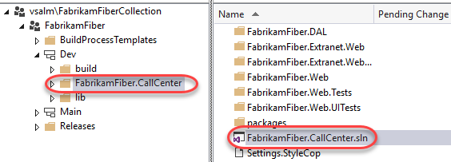

5.  Rebuild the solution (**Build | Rebuild Solution** from the
    main menu). This step may take a few minutes to complete.

6.  In **Solution Explorer**, right-click the **FabrikamFiber.Web**
    project node and select **Properties**.

7.  Select the **Code Analysis** tab in the project properties window.

    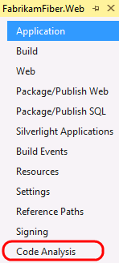

**Note:** The Code Analysis tab allows you to choose from sets of
    rules rather than picking and choosing from one flat list of rules.

8.  The currently selected Rule Set is “**Microsoft All Rules**”, which
    provides a comprehensive set of rules. As you can see, there are
    other rule sets to choose from based upon your needs.

    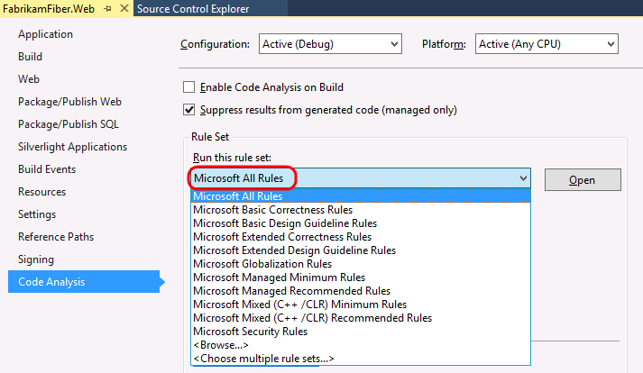

**Note:** If you are interested in learning how to create custom
    rule sets, please see
    [this](http://msdn.microsoft.com/en-us/library/dd264974.aspx)
    MSDN documentation.

9.  In Solution Explorer, right-click the **FabrikamFiber.Web** project
    node and select **Analyze** | **Run Code Analysis** from the context
    menu that appears. This might take a few minutes to complete.

    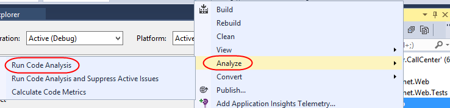

10. The Code Analysis feature runs through static code analysis rules as
    defined by Microsoft and displays the results in the Code
    Analysis window. Scroll through the list of results and read a few
    of them.

    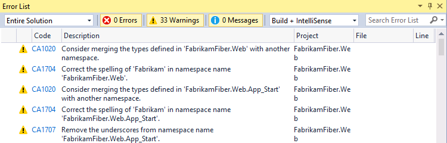

**Note:** Depending on the version of FabrikamFiber that you are
    running, you may see more or less results than depicted
    in screenshots.

Code Analysis rules can also be configured to show up as errors
    if desired.

11. The warnings produced by Code Analysis provide a wealth of
    information including a unique ID (such as CA2000 in screenshot
    above), a description of the problem or suggested fix, and the file
    location of the offending code.

12. The **Error List** window contains a search box where you can filter
    code analysis results on warning number, text in the title or
    message of the warning, as well as filename or function name.

13. Type “CA1804” into the search box.

    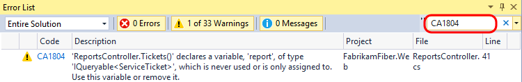

14. **Double-click** the result shown in the Error List window to load
    the specified location in the code editor.

    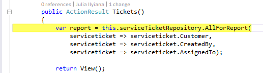

15. Perform the code fix necessary to resolve the warning. For CA1804,
    we are told that we should remove unused locals. Resolve the warning
    by removing the declaration of the “var report =” variable.

    

16. Run the code analysis once again to verify that the warning
    disappears as expected. There should be one less warning
    than before.

### Exercise 2: Suppressing Code Analysis Warnings

In this exercise, you will learn how to suppress Code Analysis
    warnings at the project and source level.

1.  Clear the search box in the **Error List** window.

2.  In the **Error List** window, select the first three warnings by
    clicking the first, holding the **Shift** key, and clicking
    the third. Imagine that we do not want to address the selected
    issues and no longer want them to appear when Code
    Analysis executes.

3.  **Right-click** the selected warnings and select **Suppress | In
    Suppression File** from the context menu. This will add assembly
    level metadata to a project level **GlobalSuppressions.cs** file.

    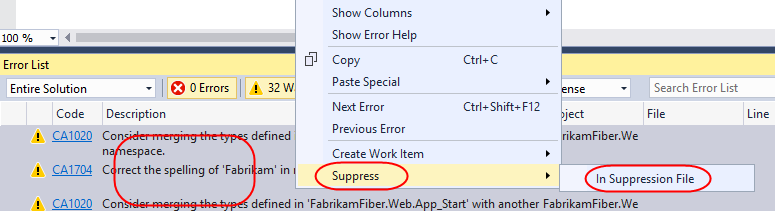

4.  Open the newly created **GlobalSuppressions.cs** file from the
    **FabrikamFiber.Web** project in **Solution Explorer** to view the
    added code.

    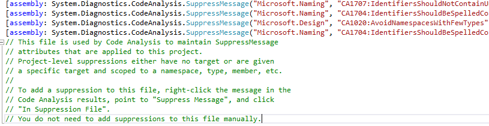

5.  Return to the **Error List** window and locate a CA1704 warning that
    suggests correcting the parameter name “serviceticket”. Double-click
    it to load the associated source.

6.  **Right-click** the “serviceticket” parameter and select **Rename…**
    from the context menu.

    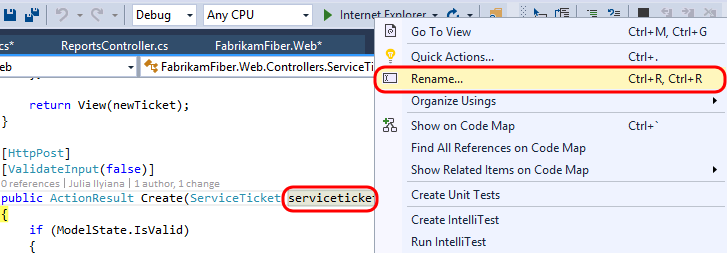

7.  In the Rename window, change “serviceticket” to “serviceTicket”
    (capital “T”) and select the **Apply** button. The code analysis
    engine will parse this as two correctly spelled words using
    camel casing.

    

8.  Select another Code Analysis warning of your choice and then
    double-click it to view the source. Imagine that we want to suppress
    this specific rule, but this time we only want it applied to the
    associated source file. **Right-click** on the warning and select
    **Suppress Message(s) | In Source** from the context menu
    that appears.

    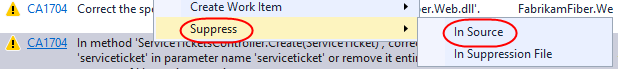

9.  This applies a **SuppressMessage** attribute to the method.

    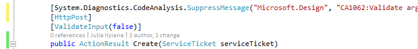

10. Run the code analysis once again for **FabrikamFiber.Web** and note
    that there are fewer warnings listed.

11. At this point, there are additional Code Analysis warnings that we
    could address, but imagine that we simply want to relax the rules
    for now. Right-click the **FabrikamFiber.CallCenter** solution node
    in **Solution Explorer** and select **Properties**.

12. Change the **Rule Set** for the **FabrikamFiber.Web** project from
    ‘**Microsoft All Rules**’ to ‘**Microsoft Managed Minimum
    Rules**’ option. Select **OK** to close the window.

    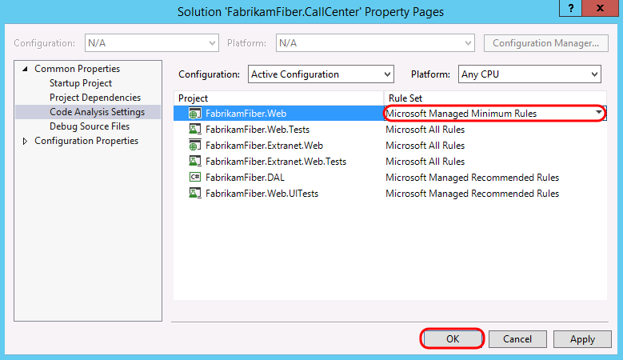

13. Run the code analysis once again for FabrikamFiber.Web and note that
    there are even fewer warnings listed. The warnings that appear as
    the result of using this rule set are more likely to be problematic
    during runtime.

