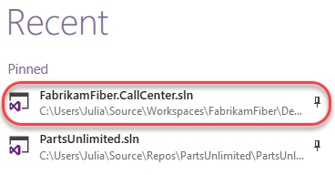
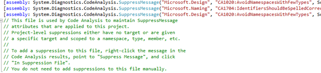
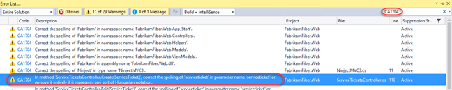
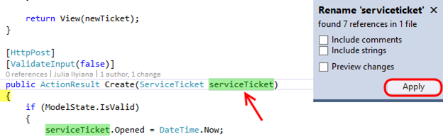
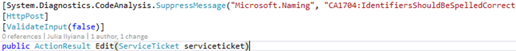

Lab version:15.0.26228.0

Last updated:3/1/2017

## Overview ##

The Code Analysis feature of Visual Studio performs static code analysis to help developers identify potential design, globalization, interoperability, performance, security, and a host of other categories of potential problems. Code Analysis can be run manually at any time from within the Visual Studio IDE, or even setup to automatically run as part of a Team Build or check-in policy for Team Foundation Server.

In this lab, you will be introduced to Code Analysis, how to configure rules sets to use, and finally how to suppress specific rules at a project and source code level.

## Pre-requisites ##

In order to complete this lab you will need the Visual Studio 2017 virtual machine provided by Microsoft. For more information on acquiring and using this virtual machine, please see [this blog post](http://aka.ms/almvm).

## Exercise 1: Introduction to Code Analysis ##

### Task 1: Working with Code Analysis ###

1. In this exercise, you will learn about the Code Analysis features in Visual Studio 2017 by configuring the rule set used, performing code analysis on a sample project, and **addressing** some of the warnings that are raised.

1. Log in as **Sachin Raj (VSALM\Sachin)**. All user passwords are **P2ssw0rd**.

1. Launch **Visual Studio 2017** from the taskbar.

1. From the **Start Page**, click **FabrikamFiber.CallCenter.sln** to open it.

   

1. Select **Build \| Rebuild Solution** from the main menu to build the solution.

1. In **Solution Explorer**, right-click the **FabrikamFiber.Web** project node and select **Properties**.

   

1. Select the **Code Analysis** tab in the project properties window.

    

    > **Note:** The Code Analysis tab allows you to choose from sets of rules rather than picking and choosing from one flat list of rules.

1. The currently selected Rule Set is **Microsoft All Rules**, which provides a comprehensive set of rules. As you can see, there are other rule sets to choose from based upon your needs.

    

    > **Note:** If you are interested in learning how to create custom rule sets, please see [this](http://msdn.microsoft.com/en-us/library/dd264974.aspx) MSDN documentation.

1. In **Solution Explorer**, right-click the **FabrikamFiber.Web** project node and select **Analyze** \| **Run Code Analysis**.

   

1. The Code Analysis feature runs through static code analysis rules as defined by Microsoft and displays the results in the Code Analysis window. Scroll through the list of results and read a few of them.

    

    > **Note:** Depending on the version of FabrikamFiber that you are running, you may see more or less results than depicted in screenshots.

1. Code Analysis rules can also be configured to show up as errors if desired. The warnings produced by Code Analysis provide a wealth of information including a unique ID (such as **CA1020** in the screenshot above), a description of the problem or suggested fix, and the file location of the offending code.

1. The **Error List** window contains a search box where you can filter code analysis results on warning number, text in the title or message of the warning, as well as filename or function name.

1. Enter **“CA1804”** into the search box.

   

1. **Double-click** the result shown in the **Error List** window to load the specified location in the code editor.

   

1. Now we will perform the code fix necessary to resolve the warning. For **CA1804**, we are told that we should remove unused locals. Resolve the warning by removing the declaration of the **“var report =”** variable.

   

1. Run the code analysis once again to verify that the warning disappears as expected. There should be one less warning than before.

### Task 2: Suppressing Code Analysis Warnings ###

1. In this exercise, you will learn how to suppress Code Analysis warnings at the project and source level.

1. Clear the search box in the **Error List** window.

1. In the **Error List** window, select the first three warnings by clicking the first, holding the **Shift** key, and clicking the third. Imagine that we do not want to address the selected issues and no longer want them to appear when Code Analysis executes.

1. **Right-click** the selected warnings and select **Suppress \| In Suppression File** from the context menu. This will add assembly level metadata to a project level **GlobalSuppressions.cs** file.

   

1. Open the newly created **GlobalSuppressions.cs** file from the **FabrikamFiber.Web** project in **Solution Explorer** to view the added code.

   

1. Return to the **Error List** window and locate a **CA1704** warning (use the search) that suggests correcting the parameter name **“serviceticket”** for the method **Create**. Double-click it to load the associated source.

   

1. **Right-click** the **“serviceticket”** parameter and select **Rename…** from the context menu.

   

1. Change **“serviceticket”** to **“serviceTicket”** (capital “T”) and select the **Apply** button. The code analysis engine will now parse this as two correctly spelled words using camel casing.

   

1. In the **Error List**, Double-click the **CA1704** warning for **Edit** to view the source. Suppose that we want to suppress this specific rule, but this time we only want it applied to the associated source file. **Right-click** the warning in the **Error List** and select **Suppress | In Source**.

   

1. This applies a **SuppressMessage** attribute to the method.

   

1. Run the code analysis once again for **FabrikamFiber.Web** and note that there are fewer warnings listed.

1. At this point, there are additional Code Analysis warnings that we could address, but imagine that we simply want to relax the rules for now. Right-click the **FabrikamFiber.CallCenter** solution node in **Solution Explorer** and select **Properties**.

1. Change the **Rule Set** for the **FabrikamFiber.Web** project from ‘**Microsoft All Rules**’ to ‘**Microsoft Managed Minimum Rules**’ option. Select **OK** to close the window.

   

1. Run the code analysis once again for **FabrikamFiber.Web** and note that there are even fewer warnings listed. The warnings that appear as the result of using this rule set are more likely to be problematic during runtime.

