## Overview

Many developers still rely on traditional or live debugging techniques.
These are limited in that they only account for your application’s
current state with limited data about past events. This forces the
developer to either guess what happened based on current state or to
attempt to recreate these events by re-running the app. Developers then
rely on breakpoints to try to capture some of the errors that might
appear because of unknown events, but sometimes even a breakpoint won’t
be able to expose the issue.

IntelliTrace expands this traditional debugging experience by recording
specific events and data at these points in time. This lets you see what
happened in your application without restarting it, especially if you
step past where the bug is. IntelliTrace enables you to seek to a large
number of execution points—that occurred in the past—and drill into any
of them by comparing variables, call stacks, etc. This makes it much
easier to pinpoint the causes of issues without having to restart the
application in an attempt to reproduce the problem. IntelliTrace
automatically collects various events in your application (e.g. ASP.NET,
ADO.NET, etc), which enables you to view the historical state of the
application at those points in time.

In order to complete this lab you will need the Visual Studio 2017
virtual machine provided by Microsoft. For more information on acquiring
and using this virtual machine, please see [this blog
post](http://aka.ms/almvm).

## Exercise 1: Debugging with IntelliTrace

In this scenario the business owner has asked us to determine why we are
seeing a drop in the sales of particular items from the past few days.
We know that the last deployment extended the functionality of the
search capabilities of this site. With that hunch in place, we’ll start
the investigation there.

### Task 1: Using IntelliTrace to collect data from production

1.  Log in as **Sachin Raj (VSALM\\Sachin)**. All user passwords are
    **P2ssw0rd**.

2.  Launch **PowerShell** from the taskbar.

3.  Enter the following command to change to the IntelliTrace directory.

    * cd \\intellitrace

4.  Enter the following command to import the IntelliTrace cmdlets.

    * Import-Module .\\Microsoft.VisualStudio.IntelliTrace.PowerShell.dll

5.  Enter the following command to begin the collection. Note that it
    should all be one line.

    * Start-IntelliTraceCollection -ApplicationPool PartsUnlimited
    -CollectionPlan .\\collection\_plan.ASP.NET.trace.xml -OutputPath
    C:\\LogFileLocation

6.  Confirm the action by entering **“Y”**. This will start
    IntelliTrace, which gathers diagnostic logs on the
    **PartsUnlimited**. We specified the **trace.xml** collection plan
    which will give us a verbose log and have a slightly heavier impact
    on performance (hence we only want to run this for short periods).
    For a lighter log, we could have used the **default.xml**
    collection plan.

7.  Leave PowerShell open and launch **Internet Explorer** from
    the taskbar. Use the **Parts Unlimited** shortcut to navigate to the
    site we’re debugging. Note that it’s hosted locally in IIS on this
    VM, even though the URL is “www.partsunlimited.com”.

    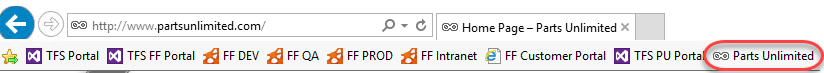

8.  Now we're going to simulate some activity on the website ourselves.
    Often, you can just let normal usage drive the IntelliTrace
    collection, but we're going to have to simulate it here. By the way,
    attaching the IntelliTrace collector to the app pool recycles it,
    which is why the first load takes a bit longer than usual. Start off
    by searching for the singular **“battery”**. There should be
    some results.

    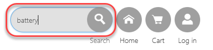

9.  Search again for the plural **“batteries”**. There should be
    some results.

10. Search again for the singular **“jumper lead”**. There should be at
    least one result.

11. Search again for the plural **“jumper leads”**. Note that there are
    no results, which seems to be a bug.

    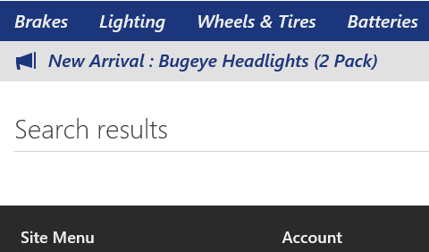

12. Close the browser.

13. Return to PowerShell and enter the following command to stop
    the collection. Confirm the stop when requested.

    * Stop-IntelliTraceCollection -ApplicationPool PartsUnlimited

### Task 2: Historical debugging

1.  Open **Windows Explorer** and navigate to **C:\\LogFileLocation**.
    Double-click the **iTrace** file to open it in **Visual Studio
    2017**. This file contains all of the IntelliTrace recordings from
    our session.

    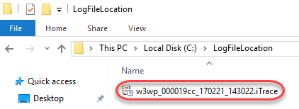

2.  Since this IntelliTrace session isn’t associated with an active
    solution, you’ll need to temporarily disable the **Just My Code**
    feature to get the full experience. From the main menu select
    **Tools | Options**.

3.  In the left tree view, locate **Debugging | General** and uncheck
    the **Enable Just My Code** option in the right panel. Click **OK**
    to apply.

    

4.  Minimize **Exception Data** and expand **Web Requests**.

    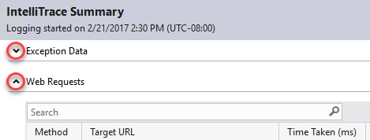

5.  Select the search request for “jumper leads” and click **Request
    Details**.

    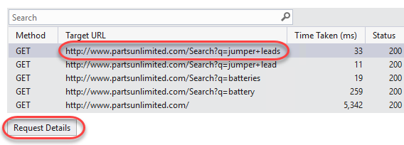

6.  We can see there are some exceptions being thrown, even though the
    site didn't report an error. This is a really hard scenario to debug
    if we don't have IntelliTrace since it's an intermittent issue (the
    search worked for **“batteries”** but not for **“jumper leads”**).
    We can see that the exception is a
    **System.ArgumentOutOfRangeException**. Select the first instance of
    this exception in the list and click **Debug This Event**.

    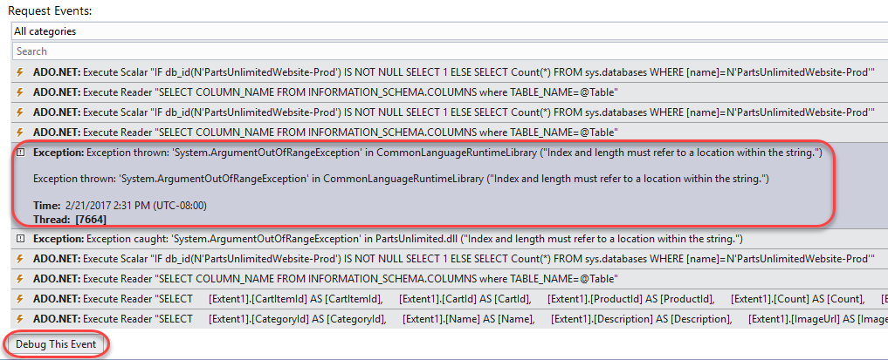

7.  At this point it may look like we're debugging, but we’re actually
    looking at historical data captured in production. By clicking
    **Debug**, we are taken to the exact line of code that caused
    the exception. We can view the **Call Stack** and **Locals**, and
    even see what value variables had at this point in the log.

    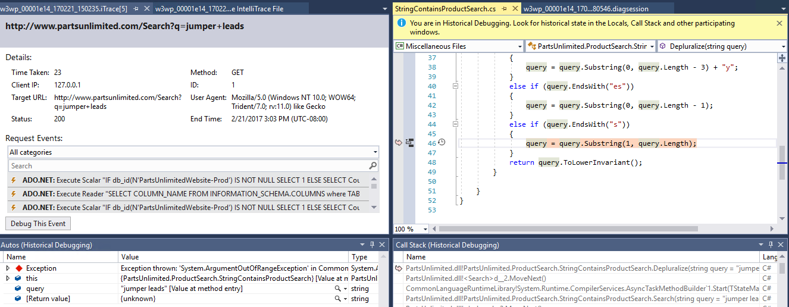

8.  Mouse over the **query** parameter to get the full debugging
    experience, including insight as to the value of the variable at the
    time of the exception.

    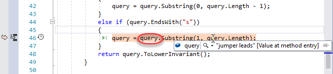

9.  In order to better visualize the path that led to this exception,
    right-click the line of code and select **Code Map | Show Call Stack
    on Code Map**.

    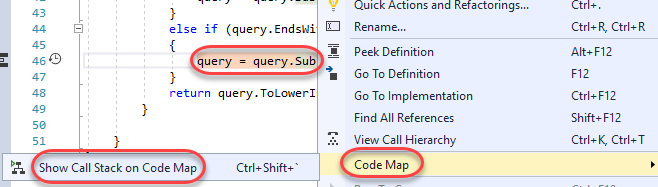

10. Locate the **Depluralize** method, which is highlighted as the
    location of the call stack, as well as the location of
    the exception.

    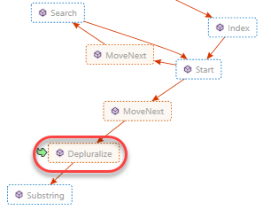

11. We can now tell that the issue here is that we’re indexing past the
    end of the query in our call to **Substring**. This could have been
    a lot harder to find without IntelliSense.

12. Select **Debugging \| Stop Debugging** to end the debug session.

13. Select **File | Close Solution** to close all files. Do not
    save any.

### Task 3: IntelliTrace inside Visual Studio 2017 (“F5” IntelliTrace)
------------------------------------------------------------------

1.  Select **File | Start Page** to open the **Visual Studio Start
    Page**.

2.  Open the **PartsUnlimited** project.

    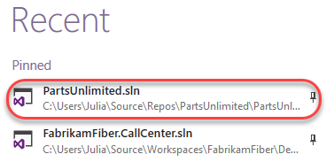

3.  Select **Tools \| Options**.

4.  Select the **IntelliTrace | General** section and select the option
    for **IntelliTrace events and call information**. Click **OK**.

    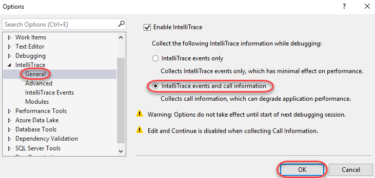

5.  Press **F5** to start debugging.

6.  Once the site loads, search for **“jumper leads”** as before. As
    expected, there should be no results.

    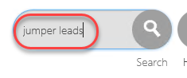

7.  Switch to **Visual Studio**.

8.  Locate the **Diagnostic Tools** window. Note that in the **Summary**
    tab (new in Visual Studio 2017), there are some exceptions that
    occurred in the application. You can review the corresponding red
    diamonds in the **Events** track if you locate the relative time at
    which they occurred. Click **Show Events**.

    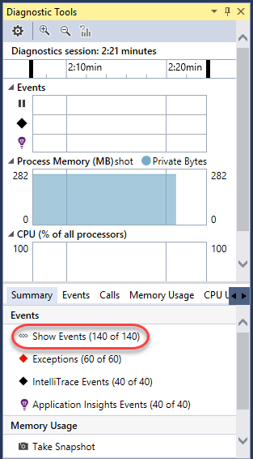

9.  There are many events collected, but we’re primarily interested in
    the exceptions, so use the **Filter** to deselect all other options.

    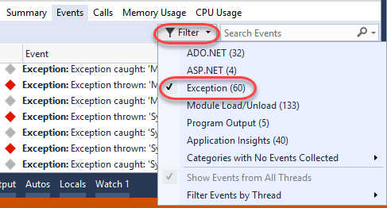

10. Double-click the first **ArgumentOutOfRangeException**. This should
    be the same exception we were working with earlier.

    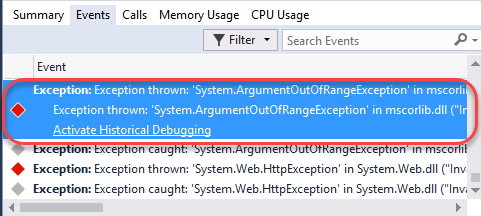

11. If so, it will bring us to the same line. At this point you could
    optionally export an **iTrace** file for this session that you could
    share with others via **Debug | IntelliTrace | Save IntelliTrace
    Session**. This makes it very easy to share the exact circumstances
    under which an issue occurred so that the developer can easily track
    it down.

    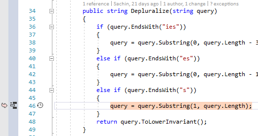

12. Select **Debug \| Stop Debugging** to end the debug session.

13. Update the offending line of code by adding **“- 1”** to the end of
    **query.Length.**

    * query = query.Substring(1, query.Length - 1);

14. Press **F5** to build and run the project to confirm the fix.

15. Search for **“jumper leads”** and confirm there is at least
    one result.

