<div class="rw-ui-container"></div>

## Overview

In this lab, you'll learn about some of the features in Visual Studio 2017 and Team Foundation Server 2018 that enable collaboration experiences for development teams including Lightweight Code Comments and CodeLens. In addition, each project in Team Foundation Server (TFS) now supports its own Wiki. This enables you to conveniently write pages that help your team members and other users understand, use, and contribute to your project.

## Prerequisites

In order to complete this lab you will need the Visual Studio 2017 virtual machine provided by Microsoft. Click the button below to launch the virtual machine on the Microsoft Hands-on-Labs portal.

<a href="https://labondemand.com/AuthenticatedLaunch/38296?providerId=4" class="launch-hol" role="button" target="_blank"><span class="lab-details">Launch the virtual machine</span></a>

Alternatively, you can download the virtual machine from [here](../almvmdownload/)

## Exercise 1: Wiki collaboration with Team Foundation Server 2018

### Task 1: Creating and editing a project wiki

1. Launch a new instance of **Internet Explorer** from the taskbar.

1. Click the **TFS PU Portal** shortcut to navigate to the PartsUnlimited TFS portal.

    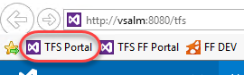

1. Use the navigation link to get to the **Wiki** hub.

    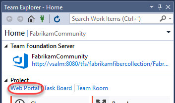

1. Since this project does not yet have its Wiki configured, click **Create Wiki** to set one up. When you create your first Wiki, TFS will provision a git repository that will store all your pages and artifacts.

    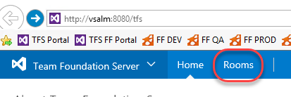

1. Enter **"Home"** as the title of the first Wiki page. Enter some body content, such as **"Welcome to *our* project!"**. TFS Wikis support Markdown, and you can learn more [here](https://docs.microsoft.com/en-us/vsts/collaborate/markdown-guidance). Click **Save**.

    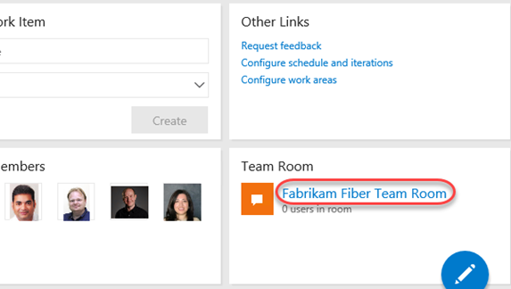

1. Every time you save a wiki page you will be asked for a commit comment. Leave the default message and click **Save**.

    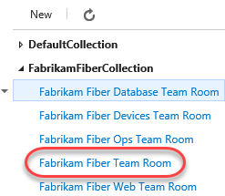

1. Your first wiki page is now available for everyone to see.

    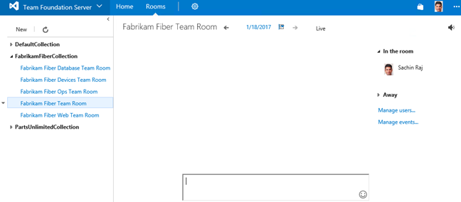

1. By default, all members of the **Contributors** group can edit README files and Wiki pages. **Stakeholders** can read files and revisions, but cannot edit anything. Select **More \| Wiki security** to review permissions.

    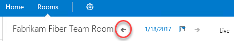

1. Since the Wiki is stored as a Git repo, the permissions are set against the repo and passed through the user experience. Close the dialog when satisfied.

    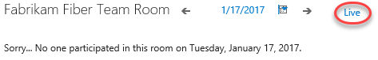

1. Locate the **Pages** panel on the right side of the window. It lists all of your wiki pages, which is just the one at this time. You can easily add and manage pages here. From the dropdown menu for the **Home** page, select **Add sub-page**.

    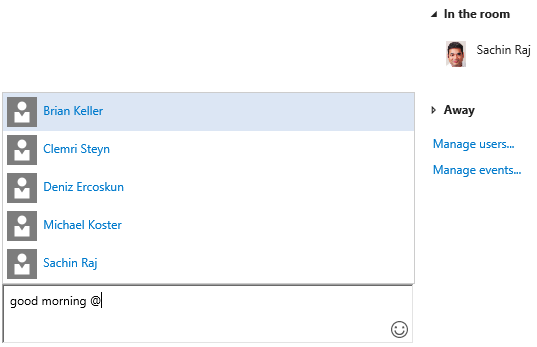

1. Set the title of this new page to **"Getting started"** and type some body content. Click **Save** and confirm the commit.

    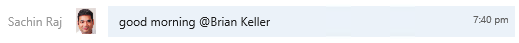

1. Now add a sub-page to the **Getting started** page.

    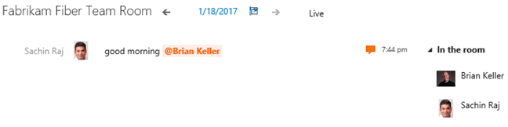

1. Set the title for this page to be **"Development environment"**. Add a list of system requirements that includes **Windows Server 2016**, **Team Foundation Server 2017**, and **Visual Studio 2017**. Click **Save** and confirm.

    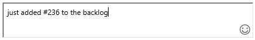

1. Click **Edit page** to make a quick update.

    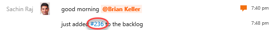

1. Change the reference from TFS 2017 to TFS 2018 and click **Save**.

    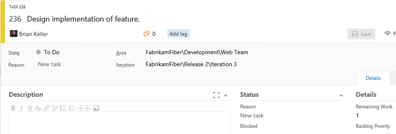

1. This time, provide a more descriptive message explaining the change and click **Save**.

    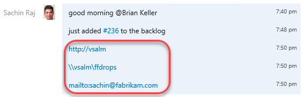

1. Click **Revisions** to see a list of changes committed for this page.

    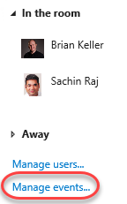

1. Click the most recent revision.

    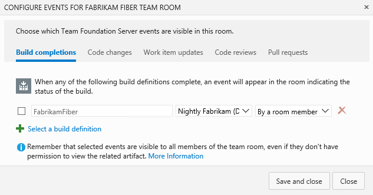

1. TFS provides a diff view so that you can easily see what was changed. You also have the option to **revert** to this version with a single button click.

    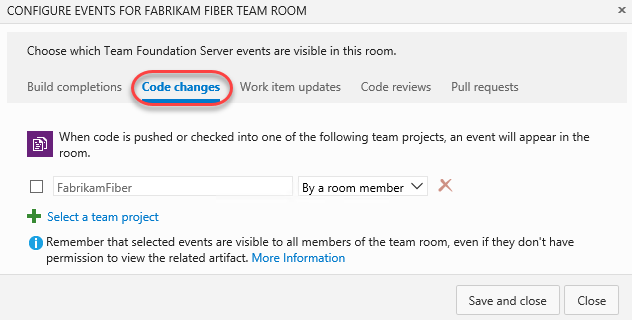

1. Return to the wiki home using the **Wiki** navigation at the top.

    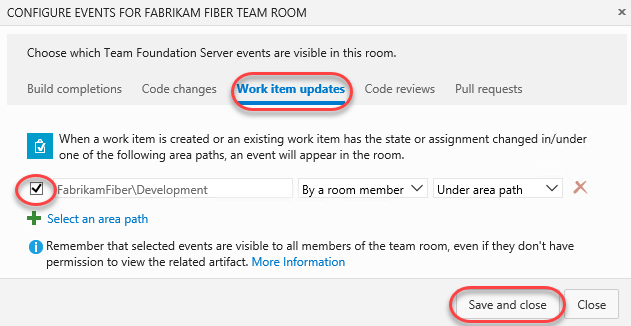

1. You can easily rearrange the order of the pages using the tree view on the right. Drag the **Getting started** page slightly up until a green line appears under the **Home** page. This indicates that you want to make these pages peers.

    

1. Since the page is being re-parented, you'll need to confirm the move. This kind of move will break links you will have manually added to other pages (none at this point), so you'll need to click **Move** to confirm.

    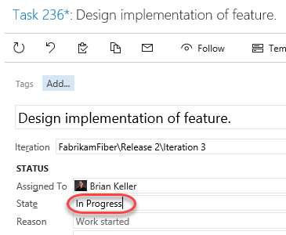

1. Sometimes wikis can get pretty big, so it's important to be able to find specific pages. Type **"env"** to filter the pages down to just those whose titles include that text.

    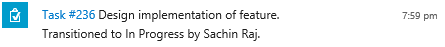

### Task 2: Working with the Wiki offline

1. Sometimes you may want to work against the wiki without being connected via browser. Fortunately, your TFS Wiki is backed by a Git repo, so you could clone it and edit it just like any other Git project whether you're online or not.

1. Select **More \| Clone wiki** to view the clone URL.

    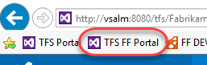

1. Click the **Copy** button to copy the URL to the clipboard.

    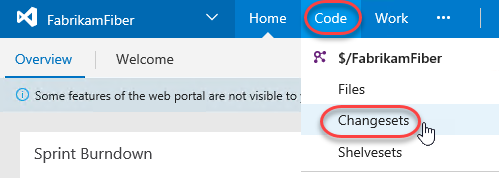

1. Launch a new instance of Visual Studio from the taskbar.

1. From **Team Explorer**, click the **Manage Connections** button.

    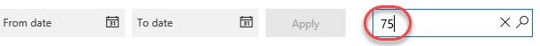

1. Locate the **Local Git Repositories** section and paste the remote URL in. Click **Clone**.

    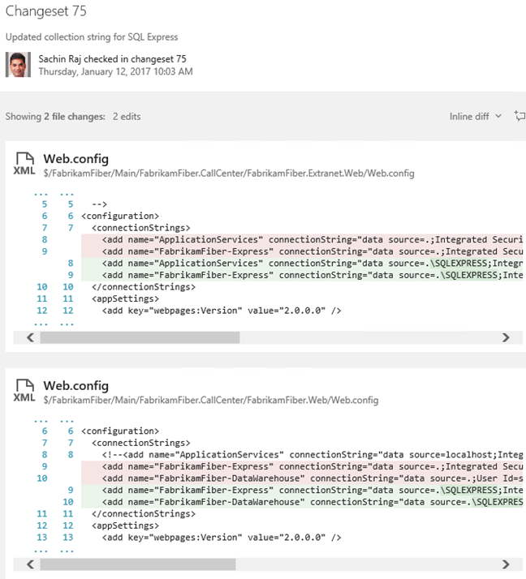

1. Select **File \| Open \| Folder** and open the path the repo was cloned to (should be **C:\Users\Julia\Source\Repos\PartsUnlimited.wiki**). You could alternatively do your editing in any other environment or even Notepad. It's all Markdown and Git at this point.

1. The Wiki file structure is pretty straightforward. Markdown files (.md) contain content for each page at that path. If you want sub-pages, then create a folder with the same name of that file (without the .md), such as **Getting-started** as shown in the screenshot below. Every folder also requires a **.order** file to specify the order of the pages. If you have any attachments for your wiki, they are stored in a **.attachments** folder in the root directory.

    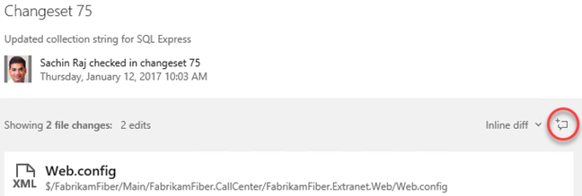

1. Start off by adding a new file. To keep things simple, just copy and paste **Home.md**.

    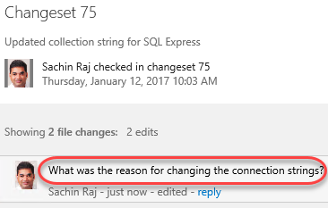

1. Rename the copied file to **Team-bios.md**.

    

1. Add some content to the file using our favorite Markdown syntax.

    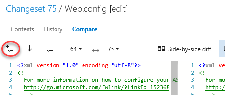

1. Open the **.order** file from the root of the repo. This is the top-level order.

    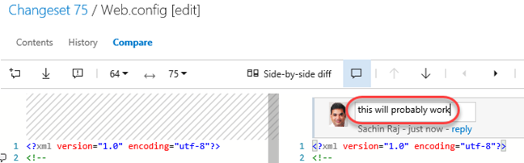

1. Note that the format of this file is straightforward-just put the file names (without .md) in the order you want them to appear in the wiki. Add **Team-bios** as the second line.

    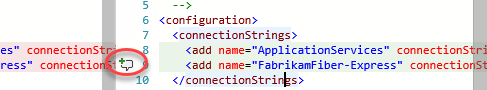

1. There is also a **.order** file in **Getting-started**, but that's just for .md files in that folder. We won't change that here.

    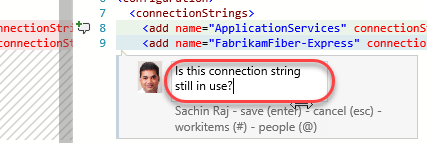

1. Right-click the folder root and select **Go To Git Changes**.

    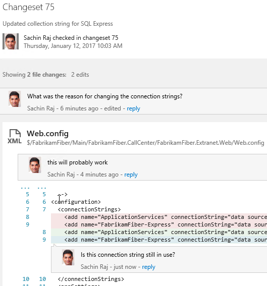

1. Visual Studio will have added some additional files to the folder, so right-click the **.vs** folder and select **Ignore these local items**. This will update **.gitignore** for you.

    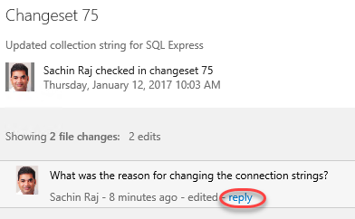

1. Set a message of "**Added team bios"** and select **Commit All \| Commit All and Sync**. Choose to save all files when prompted.

    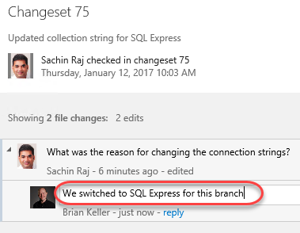

1. Once the sync has completed, return to the browser and refresh the page. Your new team bios page will appear in the navigation, so select it to view the content.

    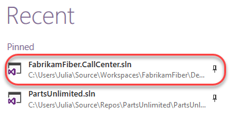

## Exercise 2: Working with CodeLens and Lightweight Code Comments

### Task 1: Working with CodeLens

1. Launch **Visual Studio 2017** from the taskbar.

1. From the **Start Page**, open **FabrikamFiber.CallCenter.sln**.

    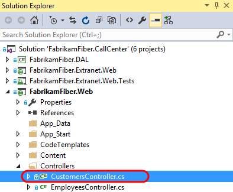

1. In **Solution Explorer**, open **FabrikamFiber.Web\Controllers\CustomersController.cs**.

    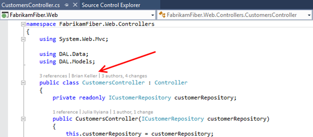

1. Select **Build \| Rebuild Solution**.

1. After loading **CustomersController.cs** in the code editor, note that both the class and its methods show a single line of indicators. These indicators are meant to provide developers a heads-up-display of sorts - with information about how the code is being used, tested, and changed.

    > **Note:** CodeLens is available for managed code only.

    

1. Scroll down to locate the **Create** method that takes a **Customer** object as a parameter, and then click the **references** indicator. This shows other code references to this method.

    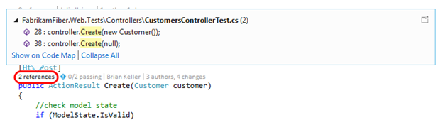

    > **Note:** You can also hold down the **Alt** key and press the number key shown above each indicator as a shortcut.

1. **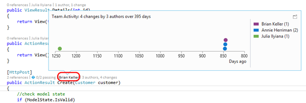**

1. If you were to double-click on one of the references, you would be taken to the specified location in code. Press **Esc** instead.

1. Click the **Timeline** indicator above the same **Create** method as before. Note that before clicking it, you can see who made the most recent change.

    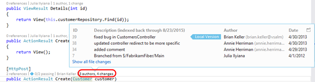

1. Click the **Authors & Changes** indicator to view all authors, changeset descriptions, and dates.

    

1. **Right-click** one of the rows shown for the expanded **Changes** indicator. Note that you can choose to view the diff, view the changeset details, track the changset, get this version, or even send email to the author.

    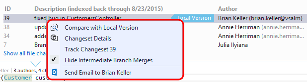

1. Press the **Escape** key.

1. Click the **Tested By** indicator shown above the Create method. This lens currently shows that associated tests have not been executed.

    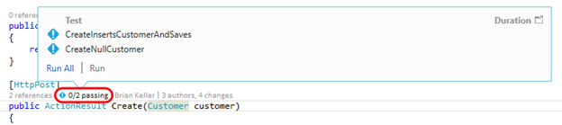

1. Click **Run All** to execute the tests.

    

1. It appears that one of the tests failed, so click the **Tested By** indicator once again to see which test is causing a problem.

    

1. Let's take a look at the test itself to determine if the fix needs to happen there or in the Create method being tested. **Double-click** the **CreateNullCustomer** test to navigate to its definition.

    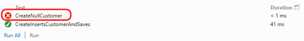

1. After looking at the **CreateNullCustomer** test, we can see that it is expecting an **ArgumentNullException** to be thrown when the Create method is called with a null parameter. Note that there is also a **Test Status** indicator shown next to the test method itself.

    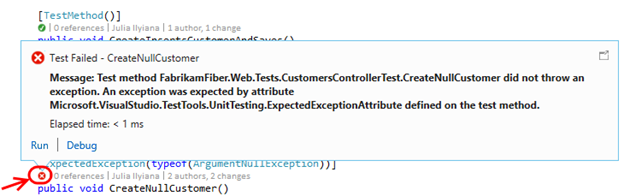

1. Select the indicator showing the failed **CreateNullCustomer** test to see additional summary information.

    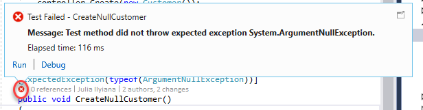

1. Throwing this exception seems like a reasonable expectation, so let's go ahead and make the fix in the Create method. Return to **CustomersController.cs** and add the following code to the beginning of the Create method that takes a Customer parameter.

    ```c#
    if (customer == null)
    {
        throw new System.ArgumentNullException("customer");
    }
    ```
    

1. With the fix in place, click the **Tested By** indicator, single-click on the **CreateNullCustomer** test, and then click **Run** to re-run just the failed test.

    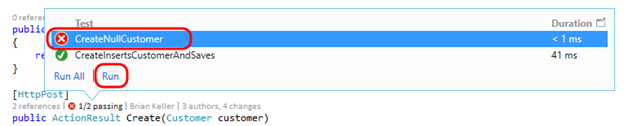

1. All tests that reference the Create method now pass.

    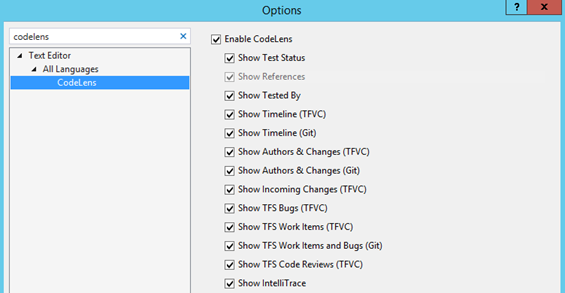

    > **Note:** With all tests passing, nothing stands out visually in the CodeLens indicator line. This demonstrates one of the goals of CodeLens - to provide useful information without getting in the way or being distracting. Nevertheless the feature can be customized or even turned off in **Tools \| Options** if desired.

    

1. As a final note, CodeLens also supports a number of indicators for Git repositories also. This provides author, change and work item indicators that work very similarly to their Team Foundation Version Control counterparts. Unlike the CodeLens support for TFVC, CodeLens for Git is computed solely on the client side. This means that you can use the feature for any Git repository whether it is local, cloned from TFS Git, cloned from GitHub or another Git source.

### Task 2: Working With Lightweight Code Comments

1. Log in as **Sachin Raj (VSALM\Sachin)**. All user passwords are **P2ssw0rd**.

1. Launch **Internet Explorer** from the taskbar and click the **TFS FF Portal** button from the favorites bar at the top.

    

1. Select **Code \| Changesets**.

    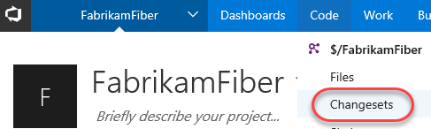

1. Load changeset 75 by entering "**75**" into the changeset search box and pressing **Enter**.

    

1. This changeset contains two file edits, with the changes highlighted in the diff viewer.

    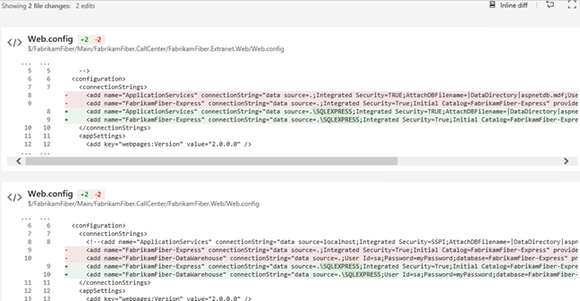

1. Click the **Add Comment** button to add a comment to the changeset.

    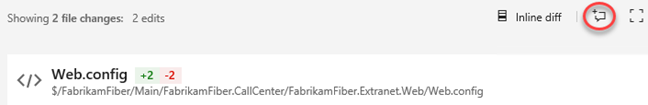

1. Enter a comment such as **"What was the reason for changing the connection strings?"** and click **Comment**.

    

1. To comment on a specific file, click the first **Web.config** link to load that specific edit.

    

1. Move the mouse cursor over the lines of the file and note that an **Add Comment** button appears in the margin. Click that button while holding the mouse cursor over one of the lines to add a line comment of your choice.

    

    > **Note:** You can even highlight parts of a sentence and comment on them if desired.

1. Create a new Remote Desktop session to this machine (**vsalm**) and log in as **Clemri** (password is **P2ssw0rd**).

1. Navigate to **changeset 75** in the Fabrikam Fiber web portal as before. Note that you can see the comments left by Sachin.

    

1. Use the comment boxes to reply to Sachin's questions.

    

1. Close the RDP session to return to Sachin's account.

1. Navigate back to changeset 75 to see the comment reply.

    
