Lab version:	15.0.26020.0

Last updated:	2/22/2017

## Overview

<a href="http://editorconfig.org/">EditorConfig</a> is an open source file format
that helps developers configure and enforce formatting and code style
conventions to achieve consistent, more readable codebases. EditorConfig
files are easily checked into source control and are applied at
repository and project levels. EditorConfig conventions override their
equivalents in your personal settings, such that the conventions of the
codebase take precedence over the individual developer. The simplicity
and universality of EditorConfig make it an attractive choice for
team-based code style settings in Visual Studio 2017.

## Prerequisites

In order to complete this lab you will need the Visual Studio 2017
virtual machine provided by Microsoft. For more information on acquiring
and using this virtual machine, please see [this blog
post](http://aka.ms/almvm).

## Exercise 1: Working with EditorConfig

### Task 1: Creating an EditorConfig file

1.  Log in as **Sachin Raj (VSALM\\Sachin)**. All user passwords are
    **P2ssw0rd**.

2.  Launch **Visual Studio** from the taskbar.

3.  Open **PartsUnlimited.sln** from the **Start Page**.

    

4.  **EditorConfig** files are just ordinary text files that can be
    added to the project and managed through source control. In
    **Solution Explorer**, right-click **src** and select **Add | New
    Item**.

    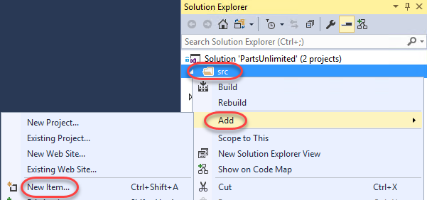

5.  Select the **General** category and the **Text File** template.
    Enter the name **.editorconfig** and click **Add**.

    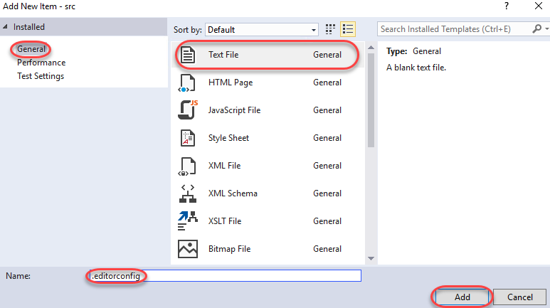

6.  When managing a file in the editor, Visual Studio will look for an
    **.editorconfig** file in the same folder (and recursive
    parent directories) to override configured settings in the IDE.
    Settings set in the directory closest to the file being edited
    take precedence. However, you can cut off the parent directory
    search by setting a **root** marker in the to-most
    **.editorconfig** file. This will be ours, so add the following line
    to the newly created **.editorconfig**.

    * root = true

7.  EditorConfig files are separated into sections based on patterns
    that match the files they apply to. For example, a filter like
    **“\[\*.cs,\*.js,code.ts\]”** would apply to any C\# or JavaScript
    file, and files with the exact name **code.ts**. You may have as
    many sections as needed. For the purposes of this lab, we will just
    work with C\# files, so add the following line to **.editorconfig**.

    * \[\*.cs\]

8.  One of the most common uses of EditorConfig files is to enforce how
    indents are handled in code. Add these two lines to the file to
    specify that every indentation should cover two characters and that
    the indentations should only use spaces.

    *  indent\_style = space

        indent\_size = 2

9.  At this time, Visual Studio requires you to reopen the solution for
    changes to **.editorconfig** files to be applied. From the menu,
    select **File | Close Solution** and save all files when asked.

10. Select **File | Recent Projects and Solutions |
    …\\PartsUnlimited.sln** to reopen the solution.

11. From **Solution Explorer**, open
    **src\\PartsUnlimited\\Controllers\\AccountController.cs**.

    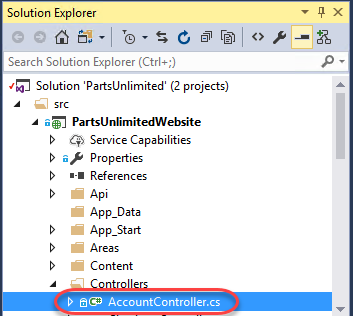

12. Take a close look at the formatting of the file, especially at
    the indentation. You can use the cursor to count the spaces before
    the **\[Authorize\]** attribute. The file was previously saved with
    the default four spaces per indentation, and the new EditorConfig
    settings won’t be applied until you explicitly format the file.

    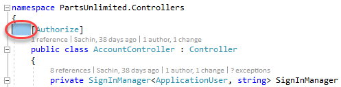

13. Press **Ctrl+K** followed by **Ctrl+D**. This is a shortcut that
    will format the document according to the configured styles. Note
    that you could alternatively do this from the menu via **Edit |
    Advanced | Format Document**.

14. Count the indentation now used before the attribute. It should be
    only two spaces.

    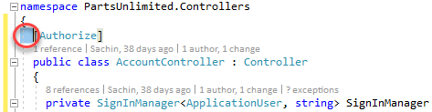

15. Let’s suppose that the team has decided that the **Controllers**
    directory needs some special settings for C\# code. To help enforce
    this, you can add an **.editorconfig** file to the folder. In
    **Solution Explorer**, right-click the **Controllers** folder and
    select **Add | New Item**.

    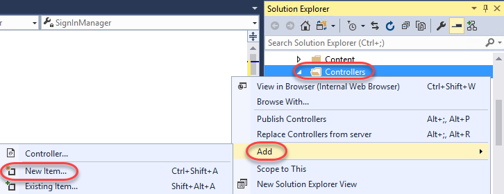

16. Select the **Visual C\#** category and **Text File** template. Set
    the **Name** to **“.editorconfig”** and click **Add**.

    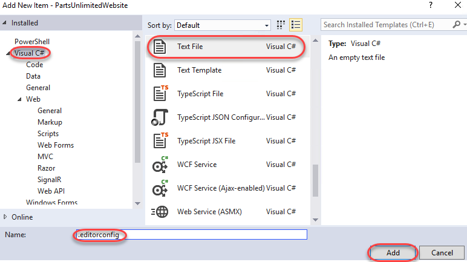

17. For this folder we’ll override some of the existing settings by
    setting the indents to use tabs and cover eight characters. We’ll
    also set the size of tabs to four characters, which means each
    indentation will require two tabs. Add the lines below to the new
    **.editorconfig** file.

    *  \[\*.cs\]

        indent\_style = tab

        indent\_size = 8

        tab\_size = 4

18. Reopen the **PartsUnlimited** solution in Visual Studio using the
    approach from earlier.

19. Reopen **AccountController.cs** and press **Ctrl+K** followed by
    **Ctrl+D** to apply the formatting.

20. Take a close look at the indentation before the
    **\[Authorize\]** attribute. Note that it’s now using exactly
    two tabs. This is because we configured each tab to cover four
    spaces and total size for each indent to cover eight spaces. As a
    result, those two four-space tabs cover the required eight spaces.

    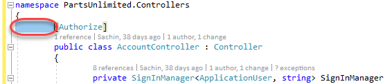

21. We can also configure the editor to automatically trim whitespace
    from the end of lines. While this isn’t necessarily a huge issue for
    C\# code, it is an important consideration for some other types
    of files.

    * trim\_trailing\_whitespace = true

22. Reload the **PartsUnlimited** solution as before.

23. Return to **AccountController.cs**.

24. Add some spaces after the **\[Authorize\]** attribute.

    

25. Apply formatting via **Ctrl+K, Ctrl+D** and confirm the extra
    whitespace has been removed.

### Task 2: EditorConfig extensions for .NET code style

1.  In addition to some native EditorConfig properties, Visual Studio
    extends the standard to support many key elements from **.NET Code
    Style**. For example, the setting
    csharp\_new\_line\_before\_open\_brace can enforce whether braces
    whether or not braces are put on their own lines. Add the following
    line to **.editorconfig** to change the default behavior such that
    braces are always appended to the end of the line before them.

    * csharp\_new\_line\_before\_open\_brace = none

2.  Reload the **PartsUnlimited** solution as before.

3.  Return to **AccountController.cs**.

4.  Press **Ctrl+K** followed by **Ctrl+D** to apply the formatting.
    Note that the braces are now on the same lines as the code
    before them.

    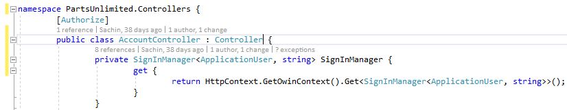

5.  You can also use settings to specify how rules are applied to code
    in the editor. For example, the setting
    dotnet\_style\_predefined\_type\_for\_locals\_parameters\_members
    can be used to enforce whether native types (such as **string**)
    should be preferred over wrapped types (such as **System.String**).
    Add the following line to **.editorconfig**.

    * dotnet\_style\_predefined\_type\_for\_locals\_parameters\_members
        = true:error

6.  Reload the **PartsUnlimited** solution as before.

7.  Return to **AccountController.cs**.

8.  Add the following code just inside the **SignInManager get** method.

    1.  System.String s = "test";

9.  Note that Visual Studio puts a red squiggle beneath the
    **System.String** since the rule identifies it as an error.
    Alternatively, you could have indicated that it should be handled as
    a **warning** (green squiggle), a **suggestion** (gray dots), or as
    **none** (ignore). Mouse over the offending code to read the error.

    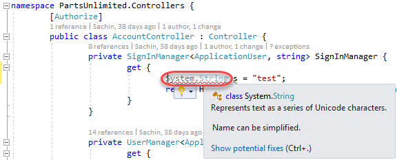

10. Press **Ctrl+Shift+B** to build the project. Note that while the
    build succeeds, the rule does raise an error in the **Error List**.

    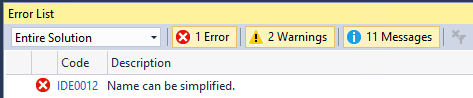

11. Click on the offending line of code in the editor and press
    **Ctrl+.** (period) to invoke the **Quick Action** options. Press
    **Enter** to accept the default suggestion of changing
    **System.String** to **string**.

    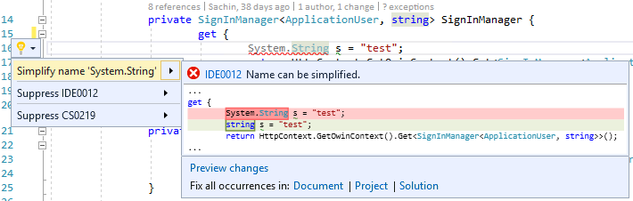

12. Press **Ctrl+Shift+B** to build the project. There should be no
    errors now. For a more complete list of extensions you can use,
    please see [this
    file](https://github.com/dotnet/roslyn/blob/master/.editorconfig).

