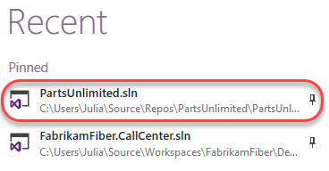
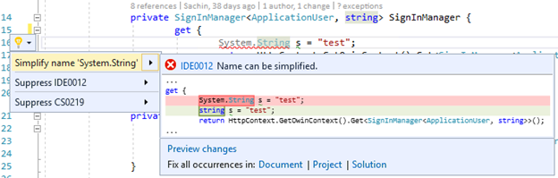

<div class="rw-ui-container"></div>

## Overview

[EditorConfig](http://editorconfig.org/) is an open source file format that helps developers configure and enforce formatting and code style conventions to achieve consistent, more readable codebases. EditorConfig files are easily checked into source control and are applied at repository and project levels. EditorConfig conventions override their equivalents in your personal settings, such that the conventions of the codebase take precedence over the individual developer. The simplicity and universality of EditorConfig make it an attractive choice for team-based code style settings in Visual Studio 2017.

## Prerequisites

In order to complete this lab you will need the Visual Studio 2017 virtual machine provided by Microsoft. Click the button below to launch the virtual machine on the Microsoft Hands-on-Labs portal.

<a href="https://labondemand.com/AuthenticatedLaunch/38318?providerId=4" class="launch-hol" role="button" target="_blank"><span class="lab-details">Launch the virtual machine</span></a>

Alternatively, you can download the virtual machine from [here](../almvmdownload/)

## Exercise 1: Working with EditorConfig

### Task 1: Creating an EditorConfig file

1. Log in as **Sachin Raj (VSALM\Sachin)**. All user passwords are **P2ssw0rd**.

1. Launch **Visual Studio** from the taskbar.

1. Open **PartsUnlimited.sln** from the **Start Page**.

    

1. **EditorConfig** files are just ordinary text files that can be added to the project and managed through source control. In **Solution Explorer**, right-click **src** and select **Add \| New Item**.

    

1. Select the **General** category and the **Text File** template. Enter the name **.editorconfig** and click **Add**.

    

1. When managing a file in the editor, Visual Studio will look for an **.editorconfig** file in the same folder (and recursive parent directories) to override configured settings in the IDE. Settings set in the directory closest to the file being edited take precedence. However, you can cut off the parent directory search by setting a **root** marker in the to-most **.editorconfig** file. This will be ours, so add the following line to the newly created **.editorconfig**.

    ```cmd
    root = true
    ```
1. EditorConfig files are separated into sections based on patterns that match the files they apply to. For example, a filter like **"[*.cs,*.js,code.ts]"** would apply to any C# or JavaScript file, and files with the exact name **code.ts**. You may have as many sections as needed. For the purposes of this lab, we will just work with C# files, so add the following line to **.editorconfig**.

    ```cmd
    [*.cs]
    ```
1. One of the most common uses of EditorConfig files is to enforce how indents are handled in code. Add these two lines to the file to specify that every indentation should cover two characters and that the indentations should only use spaces.

    ```cmd
    indent_style = space
    indent_size = 2
    ```
1. Press **Ctrl+S** to save the file.

1. From **Solution Explorer**, open **src\PartsUnlimited\Controllers\AccountController.cs**.

    

1. Take a close look at the formatting of the file, especially at the indentation. You can use the cursor to count the spaces before the **[Authorize]** attribute. The file was previously saved with the default four spaces per indentation, and the new EditorConfig settings won't be applied until you explicitly format the file.

    

1. Press **Ctrl+K** followed by **Ctrl+D**. This is a shortcut that will format the document according to the configured styles. Note that you could alternatively do this from the menu via **Edit \| Advanced \| Format Document**.

1. Count the indentation now used before the attribute. It should be only two spaces.

    

1. Let's suppose that the team has decided that the **Controllers** directory needs some special settings for C# code. To help enforce this, you can add an **.editorconfig** file to the folder. In **Solution Explorer**, right-click the **Controllers** folder and select **Add \| New Item**.

    

1. Select the **Visual C#** category and **Text File** template. Set the **Name** to **".editorconfig"** and click **Add**.

    

1. For this folder we'll override some of the existing settings by setting the indents to use tabs and cover eight characters. We'll also set the width of tabs to four characters, which means each indentation will require two tabs. Add the lines below to the new **.editorconfig** file.

    ```cmd
    [*.cs]
    indent_style = tab
    indent_size = 8
    tab_width = 4
    ```
1. Save **.editorconfig**. Close and reopen **AccountController.cs**. Press **Ctrl+K** followed by **Ctrl+D** to apply the new formatting.

1. Take a close look at the indentation before the **[Authorize]** attribute. Note that it's now using exactly two tabs. This is because we configured each tab to cover four spaces and total size for each indent to cover eight spaces. As a result, those two four-space tabs cover the required eight spaces.

    

1. We can also configure the editor to automatically trim whitespace from the end of lines. While this isn't necessarily a huge issue for C# code, it is an important consideration for some other types of files.

    ```cmd
    trim_trailing_whitespace = true
    ```
1. Save **.editorconfig**. Close and reopen **AccountController.cs**. Press **Ctrl+K** followed by **Ctrl+D** to apply the new formatting.

1. Add some spaces after the **[Authorize]** attribute.

    

1. Apply formatting via **Ctrl+K, Ctrl+D** and confirm the extra whitespace has been removed.

### Task 2: EditorConfig extensions for .NET code style

1. In addition to some native EditorConfig properties, Visual Studio extends the standard to support many key elements from **.NET Code Style**. For example, the setting csharp_new_line_before_open_brace can enforce whether braces whether or not braces are put on their own lines. Add the following line to **.editorconfig** to change the default behavior such that braces are always appended to the end of the line before them.

    ```cmd
    csharp_new_line_before_open_brace = none
    ```
1. Save **.editorconfig**. Close and reopen **AccountController.cs**. Press **Ctrl+K** followed by **Ctrl+D** to apply the new formatting.

1. The braces should now be on the same lines as the code before them.

    

1. You can also use settings to specify how rules are applied to code in the editor. For example, the setting **dotnet_style_predefined_type_for_locals_parameters_members** can be used to enforce whether native types (such as **string**) should be preferred over wrapped types (such as **System.String**). Add the following line to **.editorconfig**.

    ```cmd
    dotnet_style_predefined_type_for_locals_parameters_members = true:error
    ```
1. Save **.editorconfig**. Close and reopen **AccountController.cs**. Press **Ctrl+K** followed by **Ctrl+D** to apply the new formatting.

1. Add the following code just inside the **SignInManager get** method.

    ```cmd
    System.String s = "test";
    ```
1. Note that Visual Studio puts a red squiggle beneath the **System.String** since the rule identifies it as an error. Alternatively, you could have indicated that it should be handled as a **warning** (green squiggle), a **suggestion** (gray dots), or as **none** (ignore). Mouse over the offending code to read the error.

    

1. Press **Ctrl+Shift+B** to build the project. Note that while the build succeeds, the rule does raise an error in the **Error List**.

    

1. Click on the offending line of code in the editor and press **Ctrl+.** (period) to invoke the **Quick Action** options. Press **Enter** to accept the default suggestion of changing **System.String** to **string**.

    

1. Press **Ctrl+Shift+B** to build the project. There should be no errors now. For a more complete list of extensions you can use, please see [this file](https://github.com/dotnet/roslyn/blob/master/.editorconfig).
