Lab version: 15.0.26020.0

Last updated: 1/30/2017

## Overview

In this lab, you will learn about the exploratory testing and feedback management capabilities provided in the Test & Feedback extension. 
You will learn about how exploratory testing (also called XT, or agile testing) has become a first-class experience in the toolset. 
This allows a tester to more flexibly test the underlying software without relying solely on formal est cases. 
You’ll also learn about how you can manage the process of eliciting and managing the customer feedback lifecycle.

### Prerequisites

In order to complete this lab you will need the Visual Studio 2017 virtual machine provided by Microsoft. For more information on
acquiring and using this virtual machine, please see [this blog post](http://aka.ms/almvm).

### About the Fabrikam Fiber Scenario

This set of hands-on-labs uses a fictional company, Fabrikam Fiber, as a backdrop to the scenarios you are learning about. Fabrikam Fiber provides cable television and related services to the 
United States. They are growing rapidly and have embraced Windows Azure to scale their customer-facing web site directly to end-users to allow them to self-service tickets and track technicians. They
also use an on-premises ASP.NET MVC application for their customer service representatives to administer customer orders.

In this set of hands-on labs, you will take part in a number of scenarios that involve the development and testing team at 
Fabrikam Fiber. The team, which consists of 8-10 people has decided to use Visual Studio application lifecycle management tools to
manage their source code, run their builds, test their web sites, and plan and track the project.

    Estimated time to complete this lab: **30 minutes**.

## Exercise 1: Exploratory Testing

### Task 1: Installing the Chrome Extension

1.  Log in as **Deniz** (VSALM\\Deniz). All
    user passwords are **P2ssw0rd**.

2.  Install **Google Chrome** from <http://google.com/chrome>. This lab
    requires Chrome to be used as the browser.

3.  Launch **Chrome** from the taskbar.

4.  Navigate to the **Visual Studio Marketplace** at
    <http://marketplace.visualstudio.com>.

5.  Select the **Visual Studio Team Services** tab. Search for
    “**feedback**” and click the **Test & Feedback** extension.

    

6.  Click on **Install** button on the details page.

    

7.  Click **Install** for the Chrome extension.

    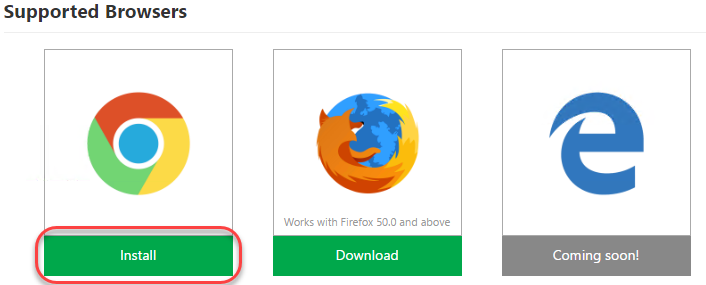

8.  In the **Chrome Web Store**, click **Add to Chrome**.

    

9.  Confirm the installation when asked.

    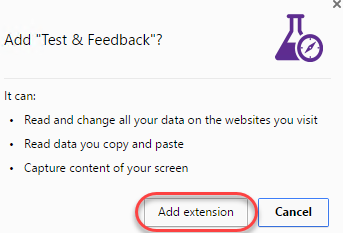

10. To open the extension, click the extension icon that will appear on
    the right of the address bar. Select the **Connection
    Settings** tab. Enter “**vsalm**” as the **Server URL** and click
    **Next**.

    

11. The extension can be used in two modes: **Connected** and
    **Standalone** mode. If you have Team Foundation Server (TFS)
    connection or a Visual Studio Team Services (VSTS) account, select
    Connected mode. Standalone mode is for users who don’t have TFS (or
    VSTS account) and want to use the extension to file bugs and share
    the report with their team.

12. After connecting to TFS, you will need to select the team you want
    these efforts associated with. Select the
    **FabrikamFiberCollection** and type **“web”** to search for the
    web team. Select the **Fabrikam Fiber Web Team** when available. Now
    all of your work item creation and searching will be scoped to the
    area path this team belongs to (**“Development”**). Click **Save**
    to continue.

    

### Task 2: Exploratory Testing with the Chrome Extension

1.  To start an exploratory testing session, click the **Start session**
    button from the extension toolbar.

    

2.  Navigate to <http://intranet.fabrikam.com>.

3.  Click the first dashboard ticket to view it.

    

4.  Click the **Escalate** button to attempt to escalate the ticket.
    This will lead to a 404 page, which is a bug.

    

5.  Click the **Exploratory Testing** icon button and click the
    **Capture screenshot** button.

    

6.  Select a section of the screen and change the name of the screenshot
    to something more descriptive. Note that there are a variety of
    drawing tools available to really help you get your point across.
    Click the **Blur area** button.

    

7.  Highlight a section of the screenshot, which will be blurred out to
    become illegible. This makes it easy to report bugs and create other
    work items without risking sensitive information. Click the **Save
    screenshot** button to add it to the current session’s timeline.

    

8.  Click the **Add note** button to start a note. Type in something
    insightful and click **Save** to save the note to the
    session’s timeline.

    

9.  You can also record screen video to capture flaky issues like
    flickering, abnormal behavior of the web application etc. that are
    difficult to capture using screenshots alone. To record your screen
    click the **Record screen** button and click **Start recording**.

    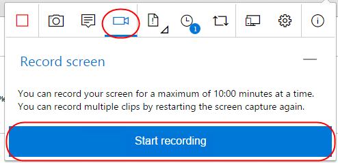

10. Select the appropriate screen you want to record from the
    **Application Window** tab. In this case, select the 404 page and
    click **Share**. The recording for the screen selected has started.

    

11. Slowly highlight part of the page. This task doesn’t need to be
    critically accurate, but is rather just something to produce video
    to review later on.

    

12. Click the **Stop recording** button on the extension to stop
    recording the screen. The screen recording gets saved.

    

13. Click on the **View session timeline** button. You can see that all
    the content – screenshots, notes and videos you’ve captured are
    available in the current session’s timeline. You can open the
    screenshots, read your notes or play the video from here.

    

### Task 3: Creating Bugs with the Chrome Extension

1.  Click the **Create bug** icon button followed by the expanded
    **Create bug** text button.

    

2.  Enter **“Escalate ticket results in 404”** as the name of the bug.
    All the screenshots and videos captured earlier are already a part
    of the bug. In addition to this the image action log (user actions)
    has also been inserted for you so that it’s easy for others to
    easily reproduce the issue. Click **Save** to save the bug to TFS.

    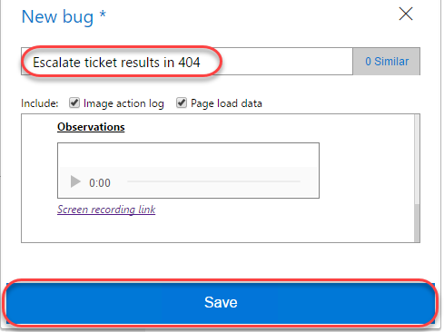

3.  Another great feature of this extension is its ability to view
    similar bugs and thus reduce redundant issues. Let’s say you were
    another tester who happened to find this same bug and weren’t aware
    that it was already logged. Click the **Create bug** icon button
    followed by the expended **Create bug** text button again to start a
    new bug form.

    

4.  As you type the title **“404 escalate**” for the bug you will notice
    that the extension has detected that there is already another bug in
    the backlog with a similar title. Click 1 **similar** to view the
    similar bug.

    

5.  This bug appears to be the same as the one we were about to file, so
    select it and click **Edit** to edit the existing bug rather than to
    file a new bug.

    

6.  At this time the current repro steps are added to the image
    action log. In practice, you would now review the existing repro
    steps to determine if you located this bug using a different method,
    in which case you would update the contents to indicate that your
    method is an alternative repro. Click **Save** to save the bug.

    

7.  Click the **View session timeline** icon button and click the last
    created **Bug** link to open it.

    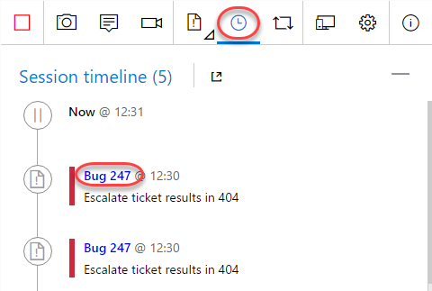

8.  Now back on the TFS site, you can update the bug as needed, such as
    by assigning it to someone or adjusting the severity.

    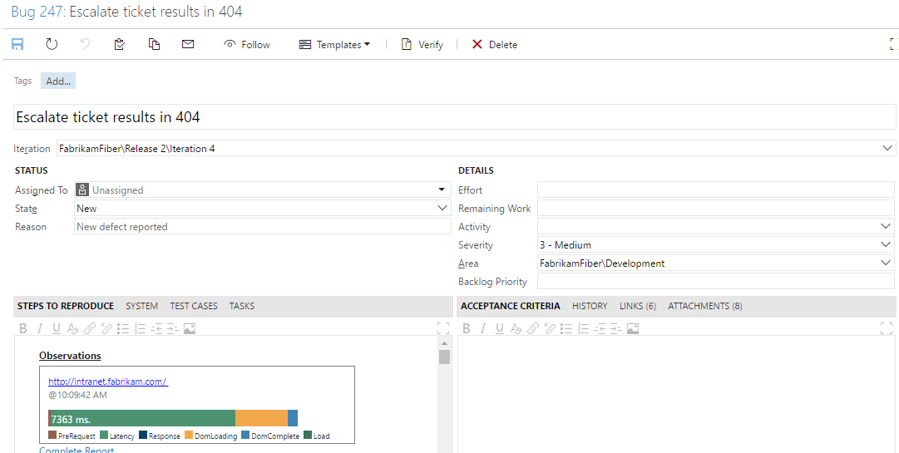

9.  In Chrome, end the testing session by clicking the **Stop
    Session** button.

    

10. Close Chrome.

## Exercise 2: Eliciting and Managing Feedback

1.  In this exercise, you will learn about managing the feedback
    lifecycle in TFS. During the course of software development, it is
    important to capture feedback from project stakeholders (end-users,
    product owners, and so on) to ensure that the progress the team is
    making is on track to meet the requirements that the stakeholders
    have in mind. It enables the capture of audio, video, screenshots,
    and other attachments to be linked to Team Foundation Server
    feedback work items.

### Task 1: Creating Feedback Requests

1.  In Chrome, navigate to <http://vsalm:8080/tfs>.

2.  Navigate to the **FabrikamFiber** project via the navigation
    dropdown in the top left corner.

    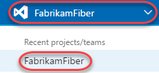

3.  Select **Work | Backlogs**.

    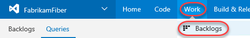

4.  For our purposes in this lab, let’s assume that we would like to get
    some feedback on the Fabrikam Fiber intranet portal’s ability to
    edit customer records. Enter a **Title** of “**Improve customer edit
    experience**” and click **Add** to create a new backlog item.

    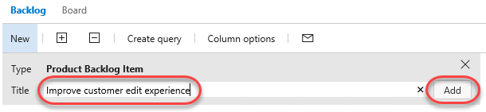

5.  Double-click the newly created work item.

    

6.  Click **Request feedback** to elicit feedback on this work item.

    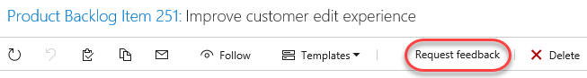

7.  In the Request Feedback dialog, select **Lan Kaim** as the
    stakeholder to request feedback from. Note that Lan is assigned to
    the **Stakeholder** access level in TFS, so providing feedback via
    this feature is something they can uniquely offer. Optionally add
    more color to the subject or body and click **Send**.

    

    1.  **Note:** You can add as many feedback items as you want by
        clicking on the ‘**Request feedback**’ link.

8.  Press **Esc** to close the work item.

    1.  

### Task 2: Using the Feedback Client

1.  Open a remote desktop session to **VSALM** and log in as **Lan
    Kaim (VSALM\\Lan)**. All user passwords are **P2ssw0rd**. Using
    remote desktop will allow you to easily switch between users within
    the VM without having to sign in each time.

2.  Launch **Chrome** and install the **Test & Feedback** extension
    as before. Configure with the same server (“vsalm”) and team
    (“Fabrikam Fiber Web Team”).

3.  Now let’s simulate Lan receiving the email and starting a feedback
    session from that. Open an explorer window and navigate to the
    ***c:\\inetpub\\mailroot\\drop*** folder. Find the most recent email
    message and double-click to open it in **Outlook**. You may need to
    wait for a minute for the email message to show up.

    1.  **Note:** The VM that you are using for this lab does not have a
        full email server running on it. Therefore, we will simulate
        sending and receiving email with this extra step.

        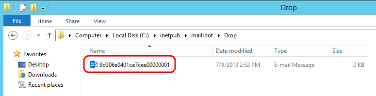

4.  The email provides the high-level details and easy access to the
    feedback experience. Click **Provide feedback**. If asked to select
    a browser, choose **Chrome**.

    

5.  Click the extension button to expand it.

    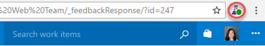

6.  The **Work Items** tab will be selected and scoped in to the
    feedback item.

    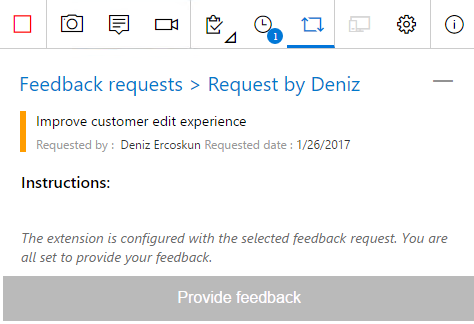

7.  Navigate to <http://intranet.fabrikam.com>.

8.  Follow the instructions provided by selecting the **Customers** link
    to navigate to the Customers page.

    

9.  Next, select the **Edit** link for one of the listed customers.

    

10. Customer records contain phone numbers, and the users of the
    Fabrikam Fiber intranet portal commonly need to update these phone
    numbers for customers who are calling about their service. Here we
    can see that the edit screen does not allow us to update that
    customer field.

    

11. Expand the feedback extension and select the **Notes** tab. Enter
    “**We need to provide a way to update customer phone numbers.**”
    Click **Save**.

    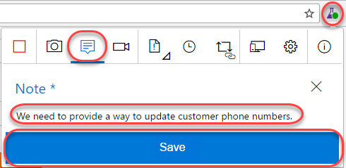

12. Attach a screenshot by clicking the **Screenshot** button.

    

13. Enter “**Need phone number**” and click the **Confirm** button.

    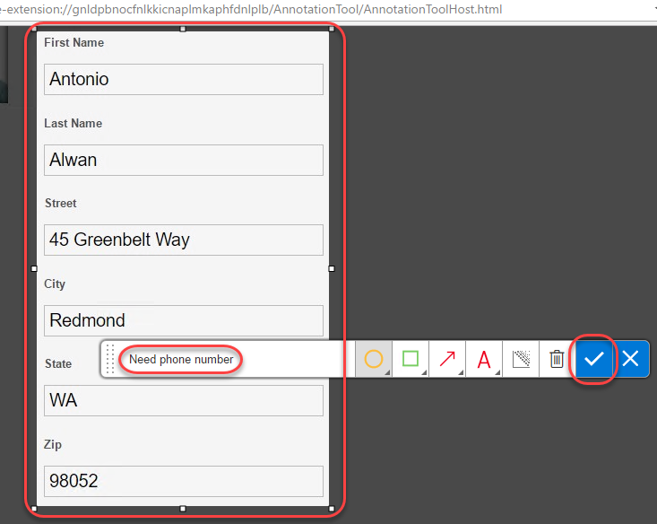

14. Select the **Provide feedback** tab and click **Provide feedback**.

    

15. Enter “**Will be good with phone number**” and set the ratings to
    five stars. Click **Save**.

    

16. Select the **Feedback requests** tab and click the **Complete
    feedback request** button that appears when you hover. This will
    also end the feedback session.

    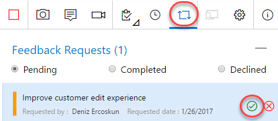

    1.  

### Task 3: Collecting and Acting on Feedback

1.  Return to the **Deniz** account by minimizing the RDP window.

2.  Navigate to the **Home** page, and then click the blue
    **Feedback** tile.

    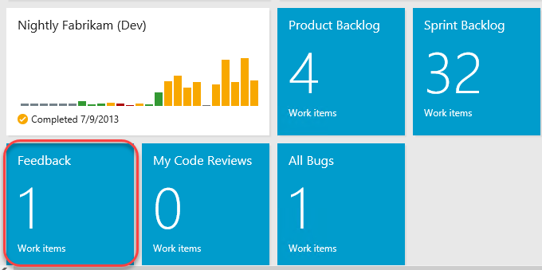

3.  Locate the Feedback Response that was just created. Double-click it
    to open.

    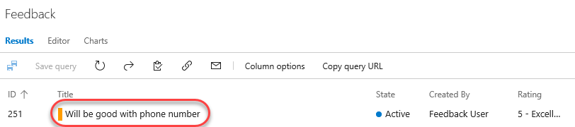

4.  The **Notes** tab is selected by default so that you can see the
    direct feedback.

    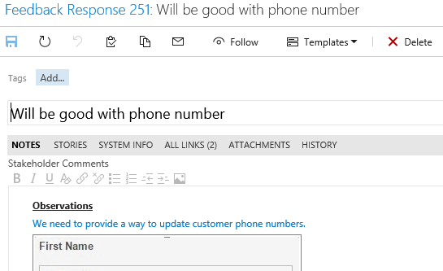

5.  Finally, select the **All Links** tab and note that this Feedback
    Response work item is a child of the original Feedback Request work
    item that was emailed.

    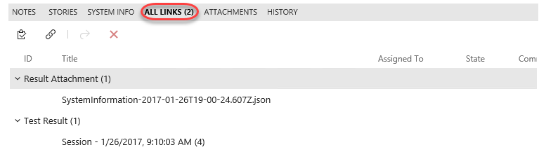

6.  Based on the feedback received, the team can then create additional
    work items as necessary in order to act upon the feedback. Select
    the **New Linked Work Item** button.

    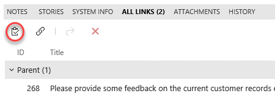

7.  Go with the default work item type of **Bug**, and provide a title
    such as “**No customer phone number field for updates.**” Select the
    **OK** button.

    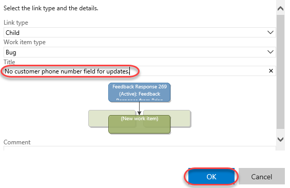

8.  Click **Save and Close** and note the individual that is assigned to
    the bug will have the associated feedback context linked to it
    for reference.

