

## Overview

In this lab, you will learn about the exploratory testing and feedback management capabilities provided in the Test & Feedback extension. You will learn about how exploratory testing (also called XT, or agile testing) has become a first-class experience in the toolset. This allows a tester to more flexibly test the underlying software without relying solely on formal test cases. You'll also learn about how you can manage the process of eliciting and managing the customer feedback lifecycle.

## Prerequisites

In order to complete this lab you will need the Visual Studio 2017 virtual machine provided by Microsoft. Click the button below to launch the virtual machine on the Microsoft Hands-on-Labs portal.

<a href="https://labondemand.com/AuthenticatedLaunch/38302?providerId=4" class="launch-hol" role="button" target="_blank">Launch the virtual machine</a>

Alternatively, you can download the virtual machine from [here](../almvmdownload/)

# About the Fabrikam Fiber Scenario

This set of hands-on-labs uses a fictional company, Fabrikam Fiber, as a backdrop to the scenarios you are learning about. Fabrikam Fiber provides cable television and related services to the United States. They are growing rapidly and have embraced Windows Azure to scale their customer-facing web site directly to end-users to allow them to self-service tickets and track technicians. They also use an on-premises ASP.NET MVC application for their customer service representatives to administer customer orders.

In this set of hands-on labs, you will take part in a number of scenarios that involve the development and testing team at Fabrikam Fiber. The team, which consists of 8-10 people has decided to use Visual Studio application lifecycle management tools to manage their source code, run their builds, test their web sites, and plan and track the project.

## Exercise 1: Exploratory Testing

### Task 1: Installing the Chrome Extension

1. Log in as **Deniz Ercoskun (VSALM\Deniz)**. All user passwords are **P2ssw0rd**.

1. Install **Google Chrome** from [http://google.com/chrome](http://google.com/chrome). This lab requires Chrome to be used as the browser.

1. Launch **Chrome** from the taskbar.

1. Navigate to the **Visual Studio Marketplace** at [http://marketplace.visualstudio.com](http://marketplace.visualstudio.com/).

1. Select the **Visual Studio Team Services** tab. Search for "**feedback**" and click the **Test & Feedback** extension.

    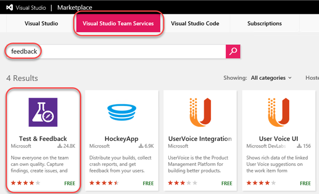

1. Click on **Install** button on the details page.

    

1. Click **Install** for the Chrome extension.

    

1. In the **Chrome Web Store**, click **Add to Chrome**.

    

1. Confirm the installation when asked.

    

1. To open the extension, click the extension icon that will appear on the right of the address bar. Select the **Connection Settings** tab. Enter "**vsalm**" as the **Server URL** and click **Next**.

    

1. The extension can be used in two modes: **Connected** and **Standalone** mode. If you have Team Foundation Server (TFS) connection or a Visual Studio Team Services (VSTS) account, select Connected mode. Standalone mode is for users who don't have TFS (or VSTS account) and want to use the extension to file bugs and share the report with their team.

1. After connecting to TFS, you will need to select the team you want these efforts associated with. Select the **FabrikamFiberCollection** and type **"web"** to search for the web team. Select the **Fabrikam Fiber Web Team** when available. Now all of your work item creation and searching will be scoped to the area path this team belongs to (**"Development"**). Click **Save** to continue.

   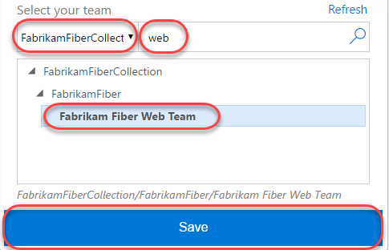

### Task 2: Exploratory Testing with the Chrome Extension

1. To start an exploratory testing session, click the **Start session** button from the extension toolbar.

    

1. Navigate to [http://intranet.fabrikam.com](http://intranet.fabrikam.com/).

1. Click the first dashboard ticket to view it.

    

1. Click the **Escalate** button to attempt to escalate the ticket. This will lead to a 404 page, which is a bug.

    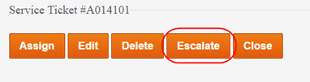

1. Click the **Exploratory Testing** icon button and click the **Capture screenshot** button.

    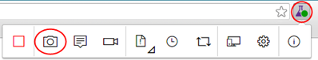

1. Select a section of the screen and change the name of the screenshot to something more descriptive. Note that there are a variety of drawing tools available to really help you get your point across. Click the **Blur area** button.

    

1. Highlight a section of the screenshot, which will be blurred out to become illegible. This makes it easy to report bugs and create other work items without risking sensitive information. Click the **Save screenshot** button to add it to the current session's timeline.

    

1. Click the **Add note** button to start a note. Type in something insightful and click **Save** to save the note to the session's timeline.

    

1. You can also record screen video to capture flaky issues like flickering, abnormal behavior of the web application etc. that are difficult to capture using screenshots alone. To record your screen click the **Record screen** button and click **Start recording**.

    

1. Select the appropriate screen you want to record from the **Application Window** tab. In this case, select the 404 page and click **Share**. The recording for the screen selected has started.

    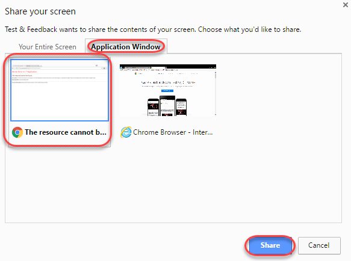

1. Slowly highlight part of the page. This task doesn't need to be critically accurate, but is rather just something to produce video to review later on.

    

1. Click the **Stop recording** button on the extension to stop recording the screen. The screen recording gets saved.

    

1. Click on the **View session timeline** button. You can see that all the content - screenshots, notes and videos you've captured are available in the current session's timeline. You can open the screenshots, read your notes or play the video from here.

   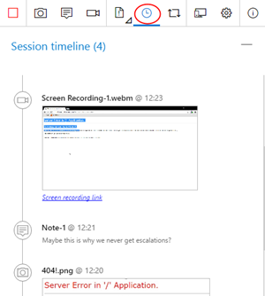

### Task 3: Creating Bugs with the Chrome Extension

1. Click the **Create bug** icon button followed by the expanded **Create bug** text button.

    

1. Enter **"Escalate ticket results in 404"** as the name of the bug. All the screenshots and videos captured earlier are already a part of the bug. In addition to this the image action log (user actions) has also been inserted for you so that it's easy for others to easily reproduce the issue. Click **Save** to save the bug to TFS.

    

1. Another great feature of this extension is its ability to view similar bugs and thus reduce redundant issues. Let's say you were another tester who happened to find this same bug and weren't aware that it was already logged. Click the **Create bug** icon button followed by the expended **Create bug** text button again to start a new bug form.

    

1. As you type the title **"404 escalate**" for the bug you will notice that the extension has detected that there is already another bug in the backlog with a similar title. Click 1 **similar** to view the similar bug.

    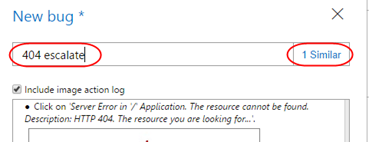

1. This bug appears to be the same as the one we were about to file, so select it and click **Edit** to edit the existing bug rather than to file a new bug.

    

1. At this time the current repro steps are added to the image action log. In practice, you would now review the existing repro steps to determine if you located this bug using a different method, in which case you would update the contents to indicate that your method is an alternative repro. Click **Save** to save the bug.

    

1. Click the **View session timeline** icon button and click the last created **Bug** link to open it.

    

1. Now back on the TFS site, you can update the bug as needed, such as by assigning it to someone or adjusting the severity.

    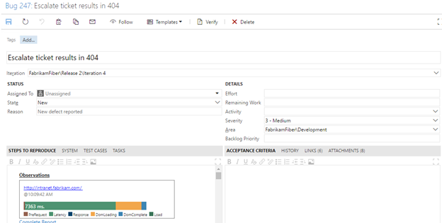

1. In Chrome, end the testing session by clicking the **Stop Session** button.

    

## Exercise 2: Eliciting and Managing Feedback

In this exercise, you will learn about managing the feedback lifecycle in TFS. During the course of software development, it is important to capture feedback from project stakeholders (end-users, product owners, and so on) to ensure that the progress the team is making is on track to meet the requirements that the stakeholders have in mind. It enables the capture of audio, video, screenshots, and other attachments to be linked to Team Foundation Server feedback work items.

### Task 1: Creating Feedback Requests

1. Mouse over the **Fabrikam Fiber** project and select **Work**.

    

1. Select **Work \| Backlogs** from the navigation menu.

    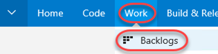

1. For our purposes in this lab, let's assume that we would like to get some feedback on the Fabrikam Fiber intranet portal's ability to edit customer records. Enter a **Title** of **"Improve customer edit experience"** and click **Add** to create a new backlog item.

    

1. Click the newly created work item to open it.

    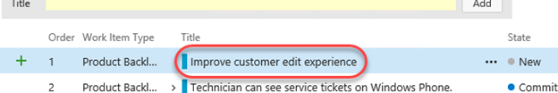

1. Expand the extended menu and click **Request feedback** to elicit feedback on this work item.

    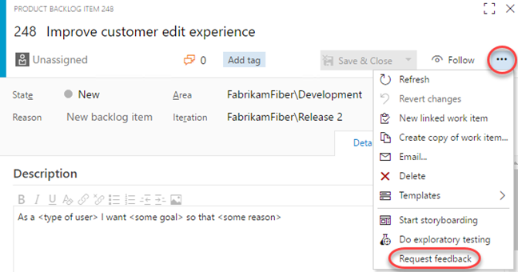

1. In the Request Feedback dialog, select **Lan Kaim** as the stakeholder to request feedback from. Note that Lan is assigned to the **Stakeholder** access level in TFS, so providing feedback via this feature is something they can uniquely offer. Optionally add more color to the subject or body and click **Send**.

    

    > **Note:** You can add as many feedback items as you want by clicking on the '**Request feedback**' link.

1. Press **Esc** to close the work item.

### Task 2: Using the Feedback Client

1. Open a remote desktop session to **VSALM** and log in as **Lan Kaim (VSALM\Lan)**. All user passwords are **P2ssw0rd**. Using remote desktop will allow you to easily switch between users within the VM without having to sign in each time.

1. Launch **Chrome** and install the **Test & Feedback** extension as before. Configure with the same server ("vsalm") and team ("Fabrikam Fiber Web Team").

1. Now let's simulate Lan receiving the email and starting a feedback session from that. Open an explorer window and navigate to the _**c:\inetpub\mailroot\drop**_ folder. Find the most recent email message and double-click to open it in **Outlook**. You may need to wait for a minute for the email message to show up.

    > **Note:** The VM that you are using for this lab does not have a full email server running on it. Therefore, we will simulate sending and receiving email with this extra step.

    

1. The email provides the high-level details and easy access to the feedback experience. Click **Provide feedback**. If asked to select a browser, choose **Chrome**.

    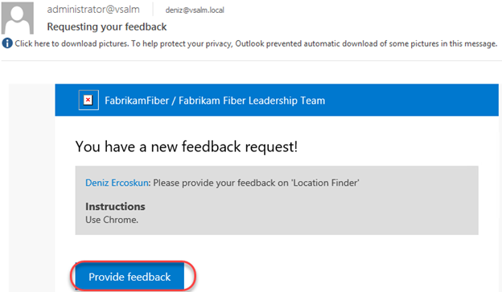

1. Click the extension button to expand it.

    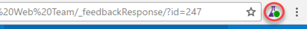

1. The **Work Items** tab will be selected and scoped in to the feedback item.

    

1. Navigate to [http://intranet.fabrikam.com](http://intranet.fabrikam.com/).

1. Follow the instructions provided by selecting the **Customers** link to navigate to the Customers page.

    

1. Next, click an **Edit** link for one of the listed customers.

    

1. Customer records contain phone numbers, and the users of the Fabrikam Fiber intranet portal commonly need to update these phone numbers for customers who are calling about their service. Here we can see that the edit screen does not allow us to update that customer field.

    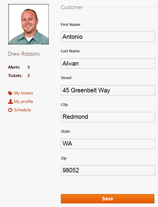

1. Expand the feedback extension and select the **Notes** tab. Enter "**We need to provide a way to update customer phone numbers.**" Click **Save**.

    

1. Attach a screenshot by clicking the **Screenshot** button.

    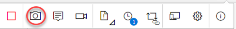

1. Enter "**Need phone number**" and click the **Confirm** button.

    

1. Select the **Provide feedback** tab and click **Provide feedback**.

    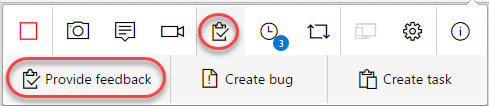

1. Enter "**Will be good with phone number**" and set the ratings to five stars. Click **Save**.

    

1. Select the **Feedback requests** tab and click the **Complete feedback request** button that appears when you hover. This will also end the feedback session.

    

### Task 3: Collecting and Acting on Feedback

1. Return to the **Deniz** account by minimizing the RDP window.

1. Select **Dashboards \| Overview** from the navigation menu.

    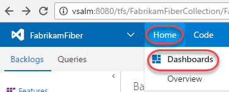

1. Click the blue **Feedback** tile, which should indicate that one feedback request has been completed.

    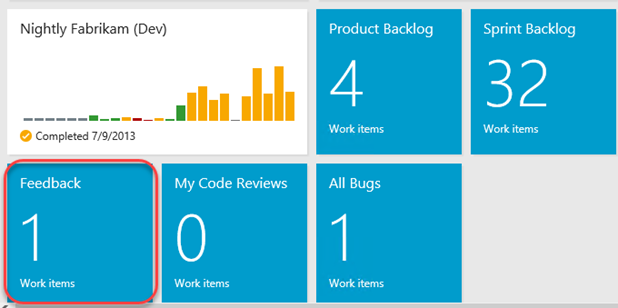

1. Locate the Feedback Response that was just created. Double-click it to open.

    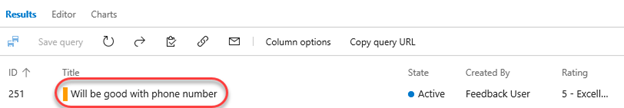

1. The feedback response includes the **Stakeholder Comments** section where you can scroll through and review the notes and recordings from the session. It also includes a **System Info** section with details on the client used to provide feedback.

    

1. Select the **Links** tab and note that this feedback response is automatically a child of the original backlog item it was created from.

    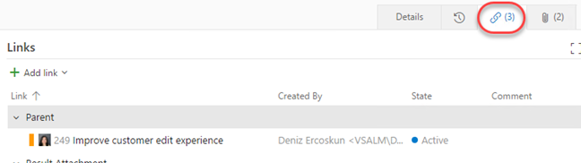

1. Based on the feedback received, the team can then create additional work items as necessary in order to act upon the feedback. Select **Add link \| New item**.

    

1. Go with the default work item type of **Bug**, and provide a title such as "**No customer phone number field for updates.**" Select the **OK** button.

    

1. Click **Save and Close** and note that the new bug is associated with the feedback item as a child.

    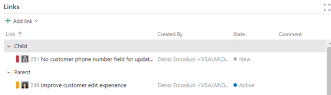
