

## Overview

In this lab, you'll learn about Git support in Team Foundation Server 2018 and Visual Studio 2017. Git is a distributed version control system with repositories that live both locally (such as on a developer's machine) and hosted on Team Foundation Server. And if you have any doubt about the scalability of Git, rest assured that TFS support for Git Virtual File System ([GVFS](http://www.gvfs.io/)) empowers you to virtually unlimited scale. Just ask the Windows team-they use it to manage over 300GB across 3.5 million files.

## Prerequisites

In order to complete this lab you will need the Visual Studio 2017 virtual machine provided by Microsoft. Click the button below to launch the virtual machine on the Microsoft Hands-on-Labs portal.

<a href="https://labondemand.com/AuthenticatedLaunch/38303?providerId=4" class="launch-hol" role="button" target="_blank">Launch the virtual machine</a>

Alternatively, you can download the virtual machine from [here](../almvmdownload/)

# About the Fabrikam Fiber Scenario

This set of hands-on-labs uses a fictional company, Fabrikam Fiber, as a backdrop to the scenarios you are learning about. Fabrikam Fiber provides cable television and related services to the United States. They are growing rapidly and have embraced Windows Azure to scale their customer-facing web site directly to end-users to allow them to self-service tickets and track technicians. They also use an on-premises ASP.NET MVC application for their customer service representatives to administer customer orders.

In this set of hands-on labs, you will take part in a number of scenarios that involve the development and testing team at Fabrikam Fiber. The team, which consists of 8-10 people has decided to use Visual Studio application lifecycle management tools to manage their source code, run their builds, test their web sites, and plan and track the project.

## Exercise 1: Getting started with Git

In this exercise, you will learn how to create, clone, and push commits to a Git repository in Team Foundation Server.

### Task 1: Creating a Git repository

1. Log in as **Sachin Raj (VSALM\Sachin)**. All user passwords are **P2ssw0rd**.

1. Launch **Visual Studio 2017** from the taskbar and open **Team Explorer**. You should now be connected to the **FabrikamFiber** team project. If you are not automatically connected to the **FabrikamFiber** project, click the **Manage Connections** and then double-click the **FabrikamFiber** project to do so.

    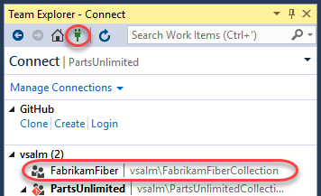

1. There are a few reasons why Fabrikam Fiber might want to use Git as their source control option within Team Foundation Server. One reason could be that they are collaborating with developers using a tool such as Xcode, which supports the Git protocol natively. Another reason could be that they have developers working offline (such as during a commute) who want to commit code locally when they are offline and check this code into Team Foundation Server when they get into the office. Microsoft now offers teams the ability to utilize Git without sacrificing the integrated application lifecycle management capabilities offered by Team Foundation Server. Visual Studio 2017 also provides developers with a great experience for working with any Git repository - whether it's hosted by Team Foundation Server, a local repository, or another Git provider.

1. From the **Home** dropdown menu, select **Projects and My Teams \| New Team Project**.

    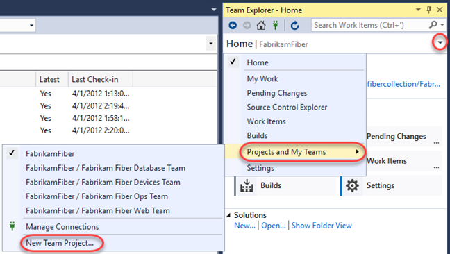

1. Name the new project **"FabrikamCommunity"** and click **Next**.

    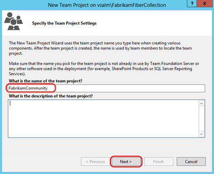

1. Select the **Scrum** process template and click **Next** to continue.

    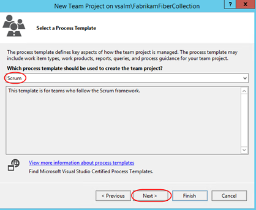

1. Select the **Git** version control system and then click **Finish**.

    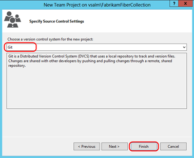

1. After the new Git team project has been created, click **Close** to return to Visual Studio.

### Task 2: Cloning a Git repository

1. In **Team Explorer**, click **Clone this repository**.

    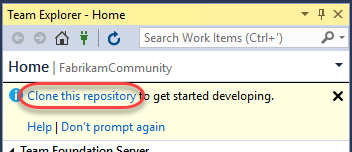

1. Accept the default endpoint and repository location and then click **Clone**.

    

1. Click the **Manage Connections** button and double-click **FabrikamCommunity** to connect to the new team project.

    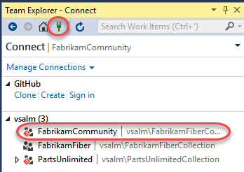

### Task 3: Committing code and linking to work items

1. In **Team Explorer**, click the **Home** button, followed by **Settings**.

    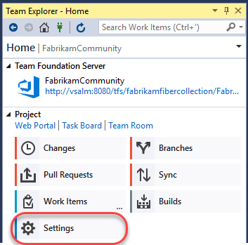

1. Click **Global Settings** under **Git**.

    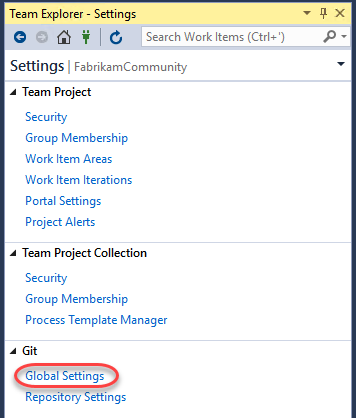

1. Enter an email address for Sachin Raj (**sachin@vsalm.local**) and then click **Update**.

    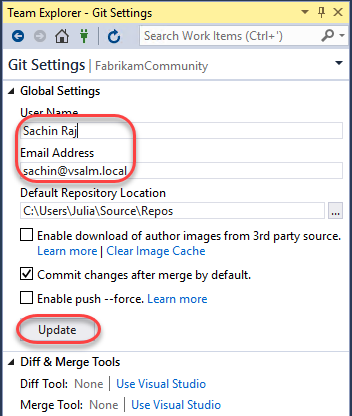

1. Click the **Home** button in **Team Explorer**.

    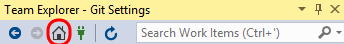

1. Create a new work item for the product backlog by selecting **Team \| New Work Item \| Product Backlog Item** from the main menu. This will launch the **New Product Backlog Item** form in TFS via your browser.

1. Enter a title of **"Create new web site"** and then click the **Save** button. Take note of the **ID** once the work item is saved.

    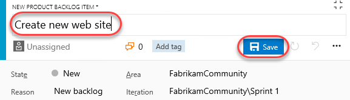

1. Return to Visual Studio. In **Team Explorer**, click **New...** underneath the **Solutions** section.

    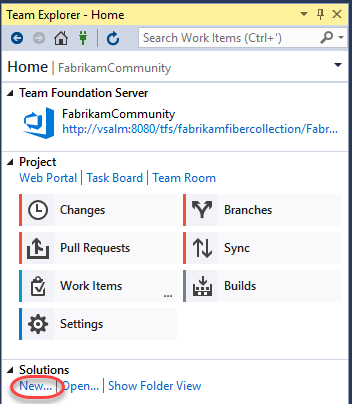

1. In the **New Project** window, select the **Visual C# \| Web \| ASP.NET Web Application** template and click **OK**.

    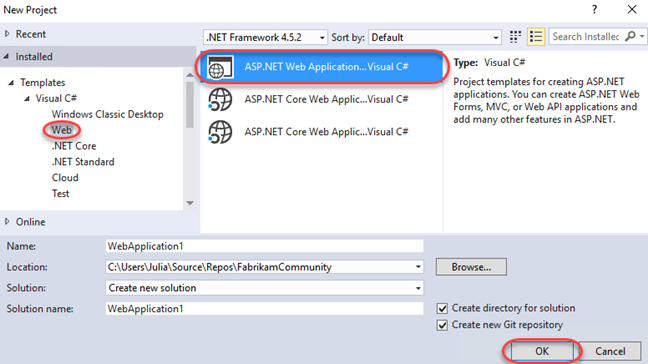

1. Select the **MVC** template and click **OK**.

    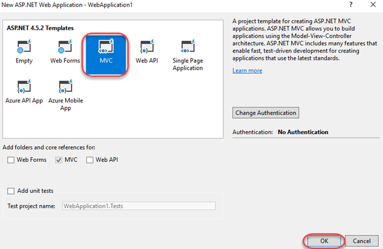

1. Once the project has finished creating, click **Changes** in **Team Explorer** to see the list of files to commit.

    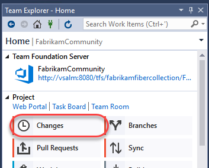

1. Scroll down the list of included changes to the end and note that .gitattributes and .gitignore files were automatically added to the project. The **.gitattributes** file contains various settings to control Git behavior whereas the **.gitignore** file specifies patterns and extensions to ignore when detecting changes.

    

1. If you'd like to exclude a specific file (or type of file based on extension), you can right-click it here and select one of the options. This will update **.gitignore** for you. Don't do that now.

    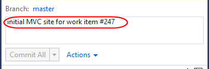

1. Enter a commit message of **"initial MVC site for work item #247"**. Typing **"#"** followed by the work item ID will automatically link the commit to the work item when pushed to the server. If the Product Backlog Item that you saved has a different ID, use that number instead.

    

1. Commit the changes by clicking **Commit All**.

    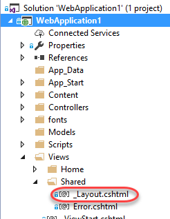

1. Let's make a small change to the web site. In **Solution Explorer**, open **_Layout.cshtml** from the **Views\Shared** folder.

    

1. Modify the end of the page title **"My ASP.NET Application"** to **"Community"** (around line **6**).

    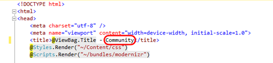

1. In **Team Explorer**, enter a commit message and then click **Commit All**. **Save** changes to files when prompted.

    

### Task 4: Synchronizing commits with the server

1. Navigate to the commits view by clicking **Sync**.

    

1. The **Synchronization** view in **Team Explorer** shows both incoming and outgoing commits. However, since this project has not yet been published to source control, you only need to click **push**.

    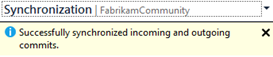

    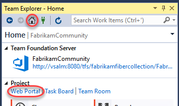

1. Finally, let's take a quick peek at what these commits look like in the web portal. In **Team Explorer**, click **Web Portal**.

    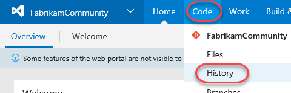

1. From the **Code** dropdown in the web portal, select **Commits**.

    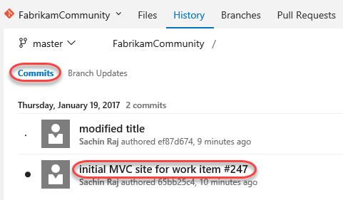

1. Click the first (bottom) commit.

    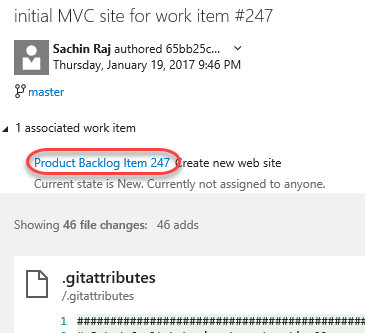

1. Note that one work item has been linked to the commit based on the ID tag in the comment. Click it to expand and then select the **"Create new web site"** work item to view it in a new tab.

    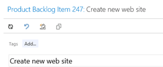

1. Close the work item tab when satisfied.

1. Click Sachin's name and click the **Pushed on** link.

    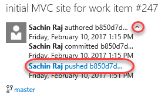

1. Although this version happens to be the latest, you would be able to explore or download the version at this particular commit by clicking one of the links.

    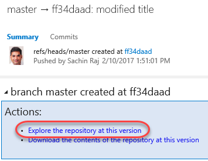

### Task 5: Tagging a release

1. While it may not seem like much, the product team has decided that this version of the site is exactly what's needed for v1.0. In order to mark it as such, navigate to the **Tags** tab and click **Create Tag**.

    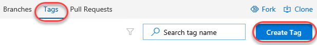

1. Enter a **name** of **"v1.0"** and a **Description** of **"First release!"**. Click **Create**.

    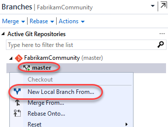

1. You have now tagged the project at this release. You could tag commits for a variety of reasons, and TFS offers the flexibility to edit and delete them, as well as manage their permissions.

    

## Exercise 2: Git forking, branching, and merging

In this exercise, you will learn about Git forking, branching, and merging support in Visual Studio. In general, forking and branching are often used to help switch development contexts and to isolate risk. For example, a core project team might use Git forks to allow people from outside the team to contribute to the project without allowing them direct commit access. Since a Git fork is a server-side copy of the project, the experience is the same, except that it provides a layer of manageability for the owner. Git branching is a similar concept that allows someone to work within a project without committing to the master branch. For teams of 2-5, it is recommended that you use only branches (and not forks) for most scenarios. Creating a Git branch is a lightweight (and therefore fast) operation, as you are simply creating a new reference to an existing commit. This is very different from a Git fork or Team Foundation Version Control (TFVC) branching where the entire source tree needs to be duplicated server-side. We will also take a quick look at the merging support for Git projects.

### Task 1: Forking a repository

1. From the navigation bar, click **Fork**. This fork will be intended for people outside the team to contribute changes to the project. For example, if someone wants to offer a bug fix, they would push it to a branch on this fork and request a pull. Someone from the team (Sachin, in this case) will monitor the pull requests and manage changes back through merges until they get to the primary project.

    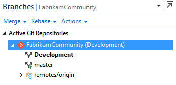

1. Set the **Repository name** to **"FabrikamCommunity.External.fork"** and click **Fork**. Note that you could specify to include all branches, although only the **default branch** is usually forked.

    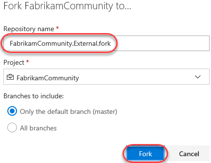

1. Click **Clone** and click **Clone in Visual Studio**. This will speed up the process of getting a copy of the code into your development environment.

    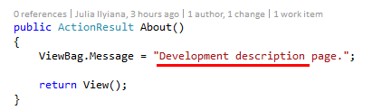

1. Click **Allow** to allow Visual Studio to read the clone file.

    

1. Click **Clone** to clone the repo.

    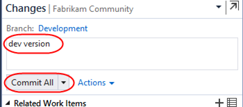

1. After cloning has completed, locate **WebApplication1.sln** in **Solution Explorer** and double-click to open it. Note that while it's virtually identical to the solution committed to Git earlier, it's an entirely separate copy that's associated with a completely different repo.

    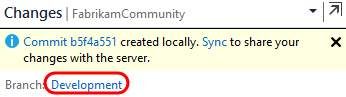

### Task 2: Branching code

1. In **Team Explorer**, click **Branches**.

    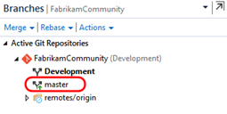

1. Let's say that we would like to create a new branch to do some development work on the web site. Right-click the **master** branch node and select **New Local Branch From**.

    

1. Set the name to **"users/sachin/about"** and click **Create Branch**. Note that the name uses a branching naming convention so that **"sachin/about"** will be treated as a subsection of **"users"**.

    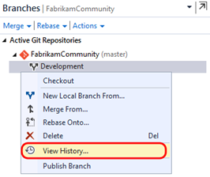

1. Double-click the **about** branch to make it the active branch.

    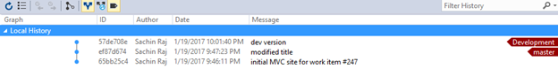

1. In **Solution Explorer**, open the **HomeController.cs** file from the **Controllers** folder.

    

1. Modify the **About** method as shown in the following screenshot.

    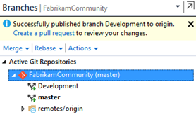

1. Right-click somewhere in the whitespace of the editor and select **Source Control \| Commit**.

    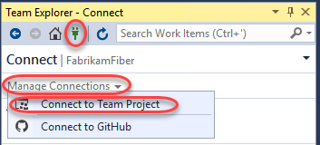

1. In **Team Explorer**, enter a commit message of "**Sachin version**" and click **Commit All**. Save the changes when prompted.

    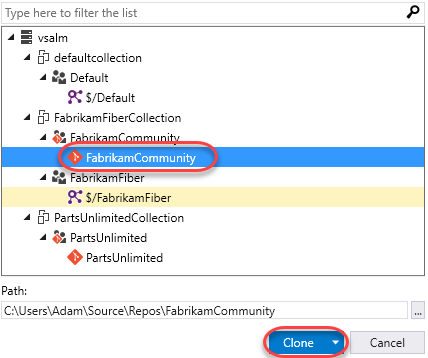

1. At this point, the changes have been committed locally. Navigate to the **Branches** view.

    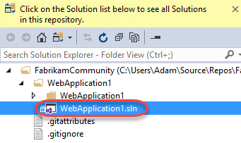

1. Double-click the **Master** branch and note that original version of the **HomeController.cs** file is shown in the code editor window.

    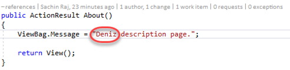

    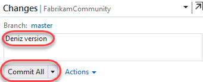

1. You don't have to publish the branch to the server yet if you want to continue working locally. As you saw in the previous exercise, you can continue to work locally and add additional commits to the new branch. In **Team Explorer**, right-click the **about** branch and select **View History**.

    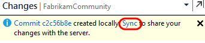

    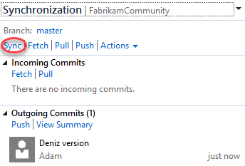

1. When you are ready, you can delete the branch, merge it back into your master branch, or push it to the server-side repository so that teammates can access it. Let's go ahead and publish the branch by right-clicking the **about** branch and selecting the **Push Branch** option.

    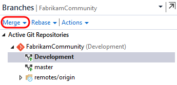

1. Open a **Remote Desktop** session to **VSALM**. Connect using user **Clemri Steyn (VSALM\Clemri)**. All user passwords are **P2ssw0rd**.

1. Launch **Internet Explorer** from the taskbar.

1. From the project dropdown, select **FabrikamFiberCollection**.

    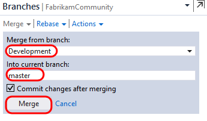

1. Mouse over the **FabrikamCommunity** team and select **Code**.

    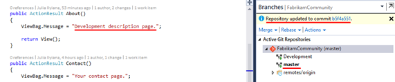

1. From the **FabrikamCommunity** repo dropdown, select **FabrikamCommunity.External.fork**.

    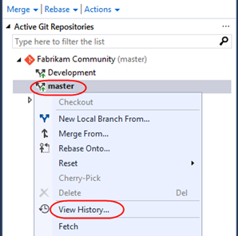

1. Click the **Clone** button and follow the workflow from earlier to clone the project in Visual Studio.

    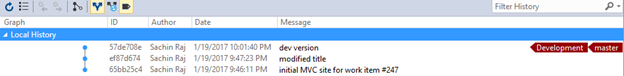

1. From **Solution Explorer**, double-click the **WebApplication1.sln** solution to open it.

    

1. Modify the same **HomeController.cs** file that Sachin did, but this time change the text to be something different. Ordinarily Clemri would make this change in a branch like Sachin did, but for the purposes of this lab he will check directly into the **master** branch.

    

1. As before, right-click within the whitespace of the code editor and select **Source Control \| Commit**.

1. In **Team Explorer**, enter a commit message of "**Clemri version**" and then click **Commit All**. Save changes when prompted. Note that Clemri has committed changes to the master branch.

    

1. Click **Sync** from the commit response.

    

1. Click **Sync** to execute the actual sync.

    

1. Switch users back to **Sachin** by minimizing the remote desktop session.

### Task 3: Merging changes in a repository

1. From Sachin's perspective, he has so far created a local branch based off the master, made a change to a file, and then published that branch. He would then like to go ahead and merge his **about** branch back into the **master** branch.

1. In **Team Explorer**, double-click the **master** branch to make it active.

    

1. Expand the **Merge** option.

    

1. Select the **about** branch as the source and click **Merge**.

    

1. Note that the **master** repository is currently selected and that **HomeController.cs** shows the **about** version of the text. The merge was performed locally by updating the **master** branch to point to the latest commit of the **about** branch.

    

1. Right-click the **master** branch in **Team Explorer** and select the **View History...** option.

    

1. The history view now provides a visualization of how the current code came to be by the various branches and commits involved.

    

1. Still unaware of Clemri's change pushed directly to the **master** branch earlier, Sachin will now attempt to push his commit. Navigate to the **Sync** view in **Team Explorer** via the navigation dropdown.

    

1. Click **Sync** to attempt a pull and a push with the server.

    

    > **Note:** If you see a popup notifying that an open file has been changed externally, click **Yes** as this is expected.

1. Visual Studio reports that we can't push our commit yet due to a conflict. Click **Resolve the conflicts**.

    

1. In the **Resolve Conflicts** view, select **HomeController.cs** from the **Conflicts** section and click **Merge**.

    

1. The **Merge** window used for Git conflict resolution is very similar to the one used with Team Foundation Version Control. Go ahead and assume that Sachin's change is correct, so check the box shown in the top right pane.

    

1. Click **Accept Merge**.

    

1. Click **Commit Merge**.

    

1. In the **Changes** view, note that conflicts have been resolved but the changes still need to be committed. Enter a message and then click the **Commit All** dropdown and select **Commit All and Sync**.

    

1. Navigate to the **Home** view in **Team Explorer** and click **Web Portal**.

    

1. Select the **Code \| Commits** from the navigation.

    

1. Here we can see a full list of our commits so far, along with a handy visualization of the branches and commits.

    

1. Select the **Branches** tab to view all branches published to the repository.

    

### Task 4: Managing repo security and permissions

1. Now let's take a quick peek at managing security and permissions for Git repositories hosted in Team Foundation Server. From the **Repositories** dropdown select **Manage Repositories**.

    

1. The first thing to note is that you can easily create additional Git repositories within the same team project.

    

1. Select the **FabrikamCommunity.External.fork** repository node. You can manage repository level security here for your users and security groups.

    

1. Select the **Master** branch node. Security level settings that affect only the currently selected branch can be made here, providing fine-grained control for your repository if needed.

    

### Task 5: Managing branch policies

1. When you want people on your team to review code in a Git team project, you can use a pull request to review and merge the code. Pull requests enable developers working in topic branches to get feedback on their changes from other developers prior to submitting the code into the master branch. Any developer participating in the review can see the code changes, leave comments in the code, and give a "thumbs up" approval if they're satisfied with those changes.

1. Although it is possible to utilize pull requests without any further configuration, let's take a quick look at how to setup branch policies. Select the **Branch Policies** tab.

    

1. Since there could be issues from anyone committing directly to the **master** branch (like Clemri did earlier), Sachin has decided to put some policies in place to prevent certain problems. Check **Protect this branch** to get started.

    

1. Check the option to **Require a minimum number of reviewers** and set the minimum number of reviewers to **"1"**. Also check **Allow users to approve their own changes** (to keep things simple in this lab).

    

    > **Note:** It is also possible to configure branch policy such that a build is triggered whenever updates are made to the master branch. You can even have the merge fail when the build fails. This is useful for teams looking to adopt continuous integration.

1. There are also options to check or (or even require) work item linking, comment resolution, and specific merge strategies.

    

1. You can make use of branch policies that effectively put in a gate that helps prevent inadvertent or low quality commits by automatically initiating a build, or by requiring code reviews by certain individuals. For example, you can use **Build validation** to block pull requests if the pull request changes don't build.

    

1. It is also possible to require specific reviewers for specific portions of your code base. For example, let's say that Sachin now needs to sign off on all changes made to the ASP.NET MVC controllers. Click **Add automatic reviewers**.

    

1. Add **Sachin** as a **Reviewer** and set **Paths** to cover everything in the **Controllers** folder at **"/WebApplication1/WebApplication1/Controllers/*"**. Click **Save**.

    

1. Click **Save Changes** to update the master branch policies. Close the administration browser tab.

    

### Task 6: Reviewing code and merging using pull requests

1. Switch back to the **Clemri** RDP session.

1. Click **Sync** to ensure that the local copy of **master** matches what's on the server. If you have **HomeController.cs** open in the editor, you may be prompted to reload it. It will reflect Sachin's merged changes.

    

1. Now let's say that Clemri is working on the project and needs to update some of the controller code. To do this, he will first create a topic branch based on **master**. Navigate to **Branches** in **Team Explorer**. Right-click the **master** branch and select **New Local Branch From**...

    

1. For the branch name, use something like **"users/clemri/controllerupdate".** Use the default option to **Checkout branch**. Click **Create Branch**.

    

1. As before, the new branch will appear using the folder structure you specified. This can make dealing with many branches much easier, especially when using multiple levels of categorization.

    

1. Locate the **users/sachin/about** branch under **remotes/origin**. Although we know that these changes were already merged into the local **master** branch we're working with, it would be very easy to pick specific commits from another branch to pull into the code here. Right-click the **about** branch to expose some additional branch management options. Note that you have the option to **cherry-pick** commits to apply to the current branch (but don't do it now). Press **Esc** to dismiss the context menu.

    

1. Update the **About** method from **HomeController.cs** with the new message **"Clemri's enhanced description page."**

    

1. In **Team Explorer**, provide a commit message and then click **Commit All**. Save the changes when prompted.

    

1. In the **Branches** view of **Team Explorer**, right-click the topic branch and select **Push Branch**.

    

1. After successfully publishing the branch, click **Create a pull request**. This will open the pull request on the portal via your browser.

    

1. Make sure the **FabrikamCommunity.External.fork** branch is selected and click **Create** to create a pull request with the default options. Note that you could optionally add additional users to review or associate work items if desired.

    

1. After the pull request is created, the pull request view shows what merge is proposed, the provided description, and a set of tabs listing associated files and commits. You can also see the required policies and reviewers.

    

1. To demonstrate the branch policy in action, let's say Clemri attempts to complete the pull request by himself. Select **Set auto-complete \| Complete**.

    

1. Despite the reminder about policy violations, click **Complete merge** anyway to see what happens.

    

1. As expected, Clemri is notified that the request first needs to be approved by at least one reviewer first.

    

1. Click **Approve**, followed by **Complete**, and then **Complete Merge** in the dialog.

    

1. Note that although we've fulfilled the reviewer quantity, we didn't fulfill the requirement for **Sachin** to approve any changes to the controllers.

    

1. At this point in the workflow, **Sachin** needs to be notified of this pull request through some communication channel, whether that is in person, through Skype, through team room notification, or via TFS pull request alert. For the purposes of this short exercise, however, we will just skip to Sachin checking pull requests for this project.

1. Switch users back to **Sachin** by minimizing the RDP window.

1. In the web portal, navigate to **Code \| Pull Requests**.

    

1. Select the link provided on the pull request from Clemri.

    

1. Sachin can now review all of the files and commits associated with the pull request and make a decision. It is also possible for Sachin to have a conversation with Clemri (and perhaps other reviewers) in order to help make the decision, or perhaps even request additional work be performed before the pull request will be approved.

1. Let's assume that Sachin is ready to approve the request as-is. There are a couple ways to do this. Click **Set auto-complete**.

    

1. The automatic completion feature enables you to approve pull request for automatic completion before all policies have been applied. For example, if a successful build is required before the PR can be completed, this step enables that to happen automatically after all policies have succeeded. You can also specify whether to delete the branch after merging and/or if you want to **squash changes**. Selecting the option to squash changes will merge all commits from the target branch into a single commit in order to help keep things a little tidier.

    

1. In this case, we won't use automatic completion, so click **Cancel**.

    

1. Before approving, provide some positive feedback to **Clemri**, such as **"This looks **good**. Way to go @<VSALM\Clemri> :-)"** and click **Comment**. Note that you can use markdown and emojis, as well as @ reference other users. You can also use # references for work items, such as "#47". As you type, there is a live preview below so that you can see exactly what will show up.

    

1. Select **Approve \| Approve**.

    

1. Now that all policies have been fulfilled, click **Complete** and **Complete merge** to finish the process.

    

1. Switch users back to **Clemri** by bringing up the RDP window.

1. Thanks to live updates, the pull request should already show the comment and that it was approved.

    
