Lab version: 15.0.26020.0

Last updated: 1/18/2017

## Overview

IntelliTest explores your .NET code to generate test data and a
    suite of unit tests. For every statement in the code, a test input
    is generated that will execute that statement. A case analysis is
    performed for every conditional branch in the code. For example, if
    statements, assertions, and all operations that can throw exceptions
    are analyzed. This analysis is used to generate test data for a
    parameterized unit test for each of your methods, creating unit
    tests with high code coverage.

    When you run IntelliTest, you can easily see which tests are failing
    and add any necessary code to fix them. You can select which of the
    generated tests to save into a test project to provide a
    regression suite. As you change your code, rerun IntelliTest to keep
    the generated tests in sync with your code changes.

## Pre-requisites

In order to complete this lab you will need the Visual Studio 2017
    virtual machine provided by Microsoft. For more information on
    acquiring and using this virtual machine, please see [this blog
    post](http://aka.ms/almvm).


## Exercise 1: Introduction to IntelliTest

In practical terms, white box unit test development includes an
iterative workflow informed by code coverage - write a unit test, see
what parts of the code are not covered by the test, write more tests to
cover those parts, repeat until all of the code is covered. This
workflow is similar to what we would use while working with IntelliTest,
as you will see in this exercise.

### Task 1: Running IntelliTest


1.  Log in as **Deniz Ercoskun** (VSALM\\Deniz). All user passwords are
    **P2ssw0rd.**

2.  Open an **Explorer** window and then open **PokerLeagueManager.sln**
    in Visual Studio from c:\\samples\\pokerleaguemanager\\src. This
    application tracks stats for a weekly poker league. It has table
    that has the stats on each player (Games Played, Total Winnings,
    Total Profit, and so on).

    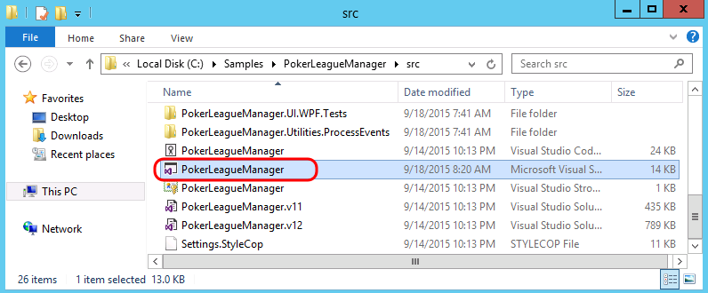

3.  In **Solution Explorer**, search for
    **GetPlayerStatisticsHandler.cs** in the search box and then
    **open** the associated file in the code editor.

    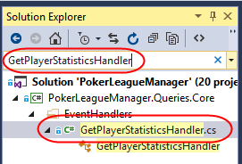

4.  Scroll down and locate the **Handle** method that takes a
    **GameDeletedEvent** parameter. When a Game is deleted, this method
    is responsible for updating the stats of the affected players. As
    with most real-world code, this code interacts with other objects
    and layers. Our goal with this demonstration is to enable
    IntelliTest reach 100% code coverage on the Handle method.

5.  **Right-click** somewhere within the **Handle** method and then
    select **IntelliTest | Run IntelliTest**.

    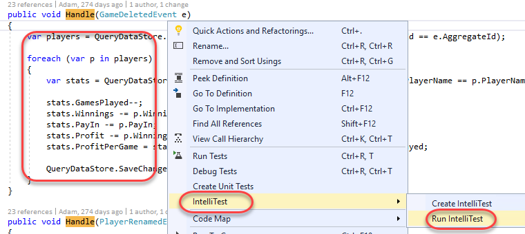


### Task 2: Understanding IntelliTest Warnings


1.  After IntelliTest runs, only two tests are generated and there is
    low coverage of the code (6/42 blocks). In addition, there are 5
    warnings reported.

    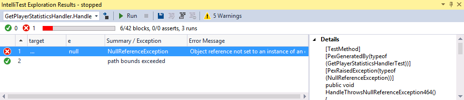

2.  Click on the **Warnings** button.

    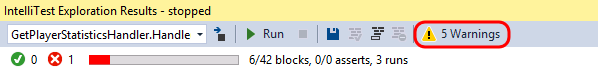

3.  The first warning is a Runtime Warning, and it indicates that
    IntelliTest has discovered, and will use,
    “**PokerLeagueManager.Queries.Core.QueryDataStore**” as
    **IQueryDataStore**. Browsing through the code, we can discover that
    IQueryDataStore is the type returned by the *getter *from the
    QueryDataStore property on the base class BaseHandler. In order to
    unit test this method, a concrete instantiation of this type
    is required. However, this may not be the type that you want to use
    for testing.

    

4.  Select the **Object Creation** warning category. IntelliTest has
    also discovered publicly accessible APIs though which to instantiate
    QueryDataStore (in this case that happens to be the
    public constructor). The APIs need to be publicly accessible because
    IntelliTest needs to actually call them to instantiate the type.

    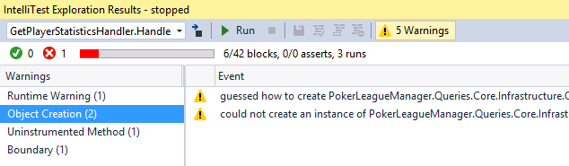

5.  Select the first **Object Creation** warning. This warning alerts us
    about the APIs that it discovered. If we prefer, those calls could
    be persisted as a Factory method by clicking the Fix button,
    although we will not do so now.

    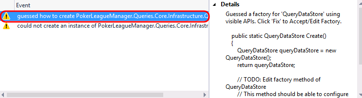

6.  Select the second **Object Creation** warning. This warning alerts
    us that IntelliTest was not automatically able to instantiate the
    object and indicates that we have some more work to do in order to
    get this working.

    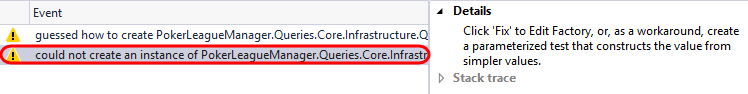

7.  Next, select the **Uninstrumented Method** warning category followed
    by the only warning from the list.

    

8.  It turns out that the **QueryDataStore** constructor ends up calling
    into some, as of yet, uninstrumented code, which you can see if you
    take a quick look through the provided stack trace.

    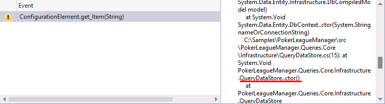

9.  This information is important to note, because IntelliTest works by
    [instrumenting code and monitoring
    execution](http://blogs.msdn.com/b/visualstudioalm/archive/2014/12/11/smart-unit-tests-a-mental-model.aspx).
    However, it does not instrument the entire universe of code for two
    reasons, 1) it cannot know *a priori* what comprises that universe
    of code and 2) that would make the system very slow. Therefore, that
    is why we see this “uninstrumented method” warning.

10. Select the **Boundary** warning category followed by the only
    warning from the list.

    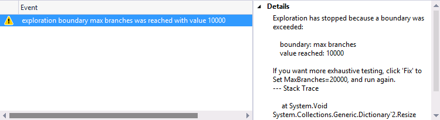

11. When the number of branches in the code path that IntelliTest is
    exploring is large, it can trip an internal boundary that has been
    configured for fast interactive performance. Hence, it raises a
    warning and stops the exploration.

### Task 3: Providing Mock Implementations


1.  To proceed further, we need to answer that first question: *is that
    the type you want to use?* To unit test the method, we need to
    provide a *mock *implementation of IQueryDataStore. Browsing through
    the solution, we can discover a **FakeQueryDataStore**. Let’s tell
    IntelliTest to use that (instead of the QueryDataStore that
    it discovered).

2.  To start assisting IntelliTest like this, we first need to setup the
    Parameterized Unit Test (PUT). Click the **Warnings** button once
    again to toggle it off.

    

3.  Select the two tests and then click the **Save** button.

    

4.  IntelliTest will generate a new project named
    **PokerLeagueManager.Queries.Core.Tests**, with the generated
    Parameterized Unit Test found in
    **GetPlayerStatisticsHandlerTest.cs**.

    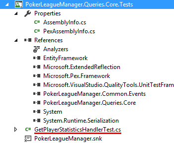

5.  In **Solution Explorer**, expand
    **GetPlayerStatisticsHandlerTest.cs** and **delete** the generated
    unit test file ending with **.g.cs**.

    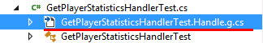

6.  In the test project, right-click the **References** node and select
    **Add Reference**.

7.  In the **Reference Manager** window, select the **Projects** node
    and then add a reference to **PokerLeagueManager.Common.Tests**.
    Click **OK**.

    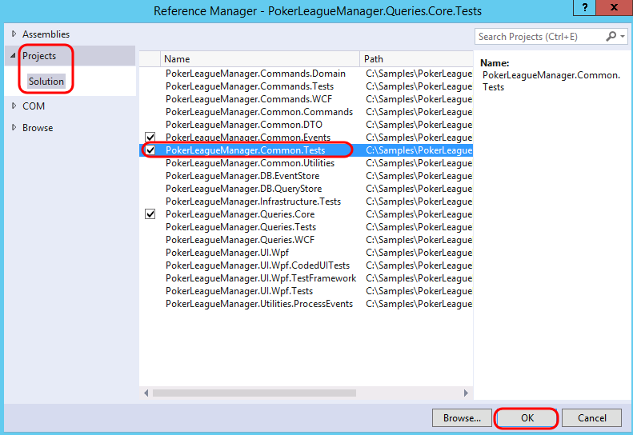

8.  Open **GetPlayerStatisticsHandlerTest.cs** in the code editor.

9.  Add the following **using** statements to the top of the file:

    ```
    // C\#

        using Microsoft.Pex.Framework.Using;

        using PokerLeagueManager.Common.Tests;
    ```

10. To specify that IntelliTest should use **FakeQueryDataStore**, add
    the following attribute to the Handle method:

    > C\#

        \[PexUseType(typeof(FakeQueryDataStore))\]

11. In the **IntelliTest Exploration Results** window, click the
    **Run** button.

    

12. Once the IntelliTest run completes, note that the bounds exceeded
    warning is gone.

    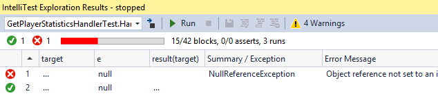


### Task 4: Focusing on ‘Just my Code’


1.  Click the **Warnings** button.

2.  The **Object Creation** warning now shows that IntelliTest has
    discovered how to instantiate **FakeQueryDataStore**. The Details
    alert us about the APIs it can use to instantiate it, and if we
    prefer, we can persist this as a factory method.

    

3.  Select the **Uninstrumented Method** category and note the
    warnings shown. These indicate that IntelliTest has ended up calling
    into uninstrumented code once again. If you inspect the stack trace
    associated with these warnings, it is possible to see that the calls
    where execution transitions into uninstrumented code is at the
    constructor and GetData&lt;T&gt; methods.

4.  Since we are not testing the mock, let us suppress these
    uninstrumented method warnings. Select one of the warnings and then
    click the **Supress** button.

    

5.  From **Solution Explorer**, Open **PexAssemblyInfo.cs** from the
    test project and note the added assembly attribute,
    **PexSupressUninstrumentedMethodFromType**.

    

6.  **Run** IntelliTest once again and verify that only the object
    creation warning remains.

### Task 5: Modifying the Parameterized Unit Test to Increase Code Coverage


1.  In order to exercise the code-under-test further, we need to modify
    the parameterized unit test method in order to return data from
    calls to the GetData method. In the PUT, the ‘target’ is the object
    that contains data to be returned by calls to GetData&lt;T&gt;. More
    specifically, T is either a LookupGamePlayersDto array or a
    GetPlayerStatisticsDto array. Our task now is to fill up
    FakeQueryDataStore with concrete instances of these types.

1.  Since IntelliTest can synthesize data values, we will add this to
    the PUT’s signature. We want two instances of
    **LookupGamePlayersDto**, and one instance of
    **GetPlayerStatisticsDto**. Further, we want to associate the
    statistics for the first player.

2.  Add a reference to **PokerLeagueManager.Common.DTO** in the test
    project by right-clicking **References** and selecting
    **Add Reference.**

3.  Add the following Using statements to the top of
    **GetPlayerStatisticsHandlerTest.cs**:

    ```
    // C\#

        using PokerLeagueManager.Common.DTO;

        using PokerLeagueManager.Common.DTO.DataTransferObjects.Lookups;
    ```

4.  Modify the signature of the PUT method by adding the following
    parameters:

    ```
    // C\#

        LookupGamePlayersDto\[\] lookupGamePlayers,

        GetPlayerStatisticsDto\[\] getPlayerStatistics
    ```

5.  The signature of the PUT method should now look like the
    following screenshot.

    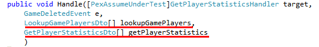

6.  We should also add in some additional hints to IntelliTest about the
    assumptions we would like to make about the input parameters. Insert
    the following code snippet to the **beginning** of the PUT:

    ```
    // C\#

        // assume

        PexAssume.IsNotNull(lookupGamePlayers);

        PexAssume.IsTrue(lookupGamePlayers.Length == 2);

        PexAssume.IsNotNull(lookupGamePlayers\[0\]);

        PexAssume.IsNotNull(lookupGamePlayers\[1\]);

        PexAssume.IsNotNull(getPlayerStatistics);

        PexAssume.IsTrue(getPlayerStatistics.Length == 1);

        PexAssume.IsNotNull(getPlayerStatistics\[0\]);

        PexAssume.IsTrue(lookupGamePlayers\[0\].PlayerName ==
        getPlayerStatistics\[0\].PlayerName);
    ```

7.  Next, we will prime the target with these steps (add this code just
    after the previous code that you inserted):

    ```
    // C\#

        // arrange

        foreach (var lookupGamePlayer in lookupGamePlayers)

        {

        target.QueryDataStore.Insert&lt;LookupGamePlayersDto&gt;(lookupGamePlayer);

        }

        target.QueryDataStore.Insert&lt;GetPlayerStatisticsDto&gt;(getPlayerStatistics\[0\]);
    ```

8.  The next step is to exercise the code under test, but the code to do
    that is already in place:

    > C\#

        target.Handle(e);

9.  Add a using statement to the top of the file to System.Linq.

    > C\#

        using System.Linq;

10. At the very end of the PUT, we simply query for the statistics and
    then assert the observed value of its fields. Add the following
    snippet to the very end of the PUT:

    ```
    // C\#

        // assert

        var playerStats =
        target.QueryDataStore.GetData&lt;GetPlayerStatisticsDto&gt;().Single();

        PexObserve.ValueAtEndOfTest("playerStats", playerStats);
    ```

11. **Delete** the **.g.cs** file once again, since we changed the
    signature of the PUT.

12. **Run** IntelliTest and note that we now have full code coverage
    (52/52 blocks), with three passing tests, four failing tests, and a
    number of warnings.

    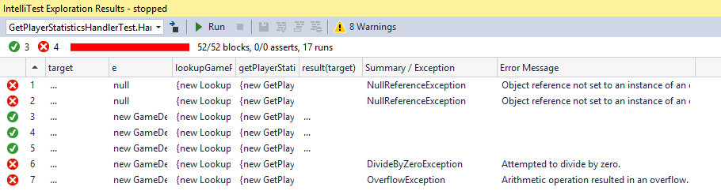

13. Take a quick look at the warnings, and note that none is related to
    the code-under-test. Therefore, go ahead and **Suppress** all of
    the warnings. You’ll need to do this for each category.

14. **Run** IntelliTest and verify that the warnings are gone.

15. Two of the tests fail because they uncover a
    **NullReferenceException** when the ‘**e**’ parameter is **null**.

    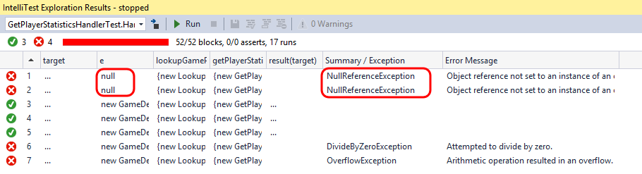

16. One of the tests uncovers a potential **DivideByZeroException**.
    This will happen if stats.GamesPlayed has a value of ‘1’. In this
    case, the statement stats.GamesPlayed-- will make it ‘0’, and
    subsequently stats.Profit / stats.GamesPlayed will raise
    the exception.

    

17. To see where in code the **DivideByZeroException** was thrown,
    select the test in the **IntelliTest Exploration Results** window,
    expand the **Stack Trace** on the right-hand side, and then
    double-click on the first line shown.

    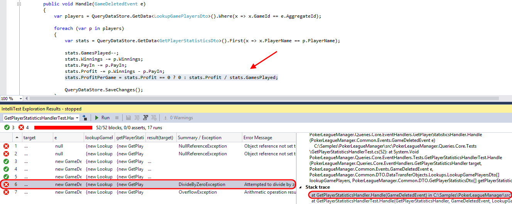

18. Another test uncovered an **OverflowException**.

19. Select the failed test in the **IntelliTest Exploration Results**
    window and take a moment to scroll through the **Details** section.
    This shows the specific test and parameters that were used against
    the code-under-test in order to generate the exception.

    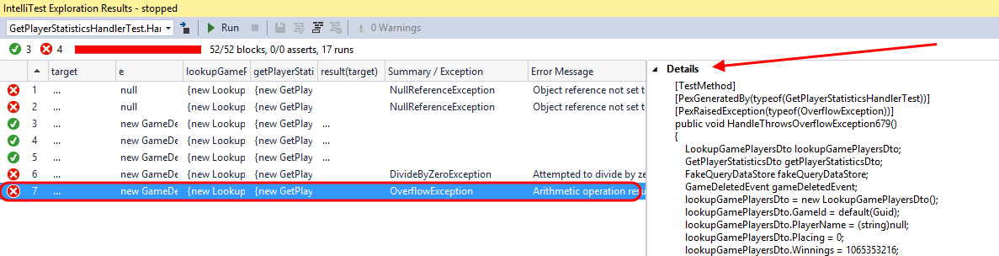

20. This shows that IntelliTest has generated tests that uncovered
    previously unknown errors in the code. If we were to add additional
    assertions about the expected behavior of the code-under-test, then
    it would generate tests for validating that as well.

    >Note: For additional reading on IntelliTest including
        capabilities, limitations, please see the [IntelliTest Reference
        Manual](https://marketing.visualstudio.com/DefaultCollection/DTMS/ALM/_backlogs/taskboard/OneVS/Sprint%2097?_a=requirements)


