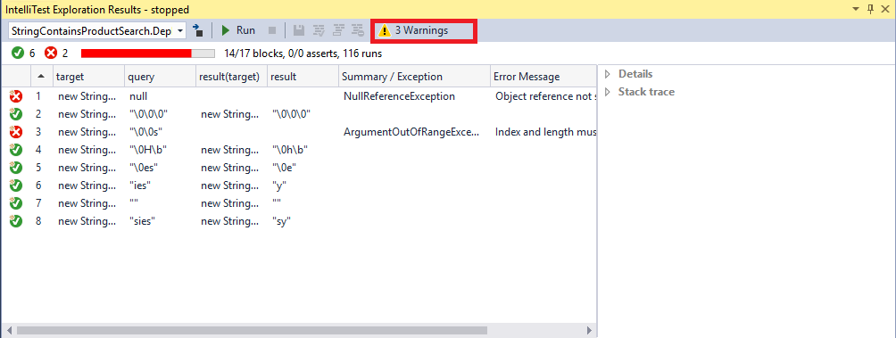
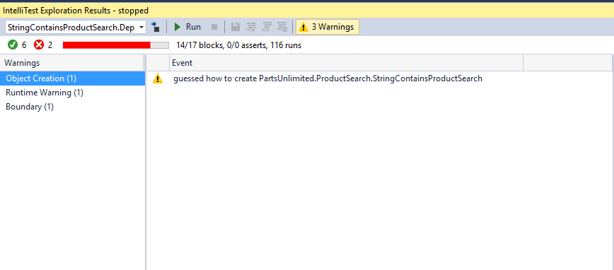
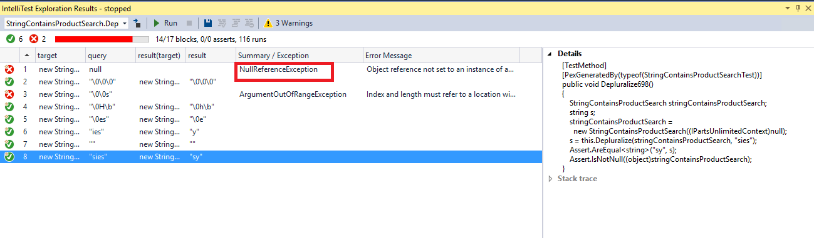
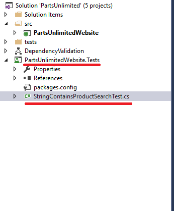
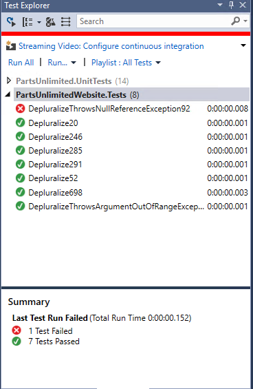

Lab version: 15.0.26020.0

Last updated: 1/18/2017

## Overview

**[IntelliTest](https://msdn.microsoft.com/en-IN/library/dn823749.aspx)** explores your **.NET code** to generate test data and a suite of unit tests. For every statement in the code, a test input is generated that will execute that statement.
A case analysis is performed for every conditional branch in the code. For example, **if statements, assertions, and all operations** that can throw exceptions are analyzed. This 
analysis is used to generate test data for a parameterized unit test for each of your methods, creating unit tests with high code coverage.

When you run IntelliTest, you can easily see which tests are failing and add any necessary code to fix them. You can select which of the generated tests to save into a test project to provide a regression suite. As you change your code, rerun IntelliTest to keep the generated tests in sync with your code changes.

## Pre-requisites

- Visual Studio 2017 (download [here](https://www.visualstudio.com/vs/visual-studio-2017-rc/))

- Download the Parts Unlimited project [here](https://github.com/Microsoft/PartsUnlimited/tree/aspnet45)

### Task 1: Running IntelliTest

1. Download and extract the zip file

2. Open the solution in **Visual Studio 2017**

3. Scroll down to the **ProductSearch \| Depluralize** method from **StringContainsProductSearch.cs** file. This method is responsible to return singular form of a string value. For example: if you search using a keyword **Batteries**, it returns Battery.

 
4. Right Click within the method **Depluralize** and then select **IntelliTest \| Run IntelliTest**

   

### Task 2: Understanding IntelliTest warnings

1. After **IntelliTest** runs, **8 tests** are generated with a **code coverage (14/17 blocks)**. In addition, there are **3 warnings** reported.

   

2. Click on **warnings** button.

   

3. Select the **Object Creation** warning category. IntelliTest has also discovered publicly accessible APIs. The APIs need to be publicly accessible because IntelliTest needs to actually call them to instantiate the type. 

   

4. Select the **Runtime** warning category from the list.

   

   This warning indicates that IntelliTest has discovered and will use **PartsUnlimited.Models.PartsUnlimitedContext** as **IPartsUnlimitedContext**.

   This information is important to note, because IntelliTest works by [instrumenting code and monitoring execution](https://blogs.msdn.microsoft.com/visualstudioalm/2014/12/11/smart-unit-tests-a-mental-model/). However, it does not instrument the entire universe of code for two reasons,
  
   - It cannot know a **priori** what comprises that universe of code and
   - That would make the system very slow

5. Select the **Boundary warning** category from the list.

   

   When the number of branches in the code path that IntelliTest is exploring is large, it can trip an internal boundary that has been  configured for fast interactive performance. Hence, it raises a warning and stops the exploration.

6. If you see the **IntelliTestExplorationResults** window, we have **8 tests** out of which **2** of them are failing. The **1st** test is failing because we are passing a string query which is null and hence we have **NullReferenceException**.
    
   

   Right click and **allow** the test.

7. In the 3rd test, you can see we have **ArgumentOutOfRangeException**. It seems the **Intellitrace**  has picked up the same exception that we found in the **ITracefile** from our **[Intellitrace](/Feature Demos/IntelliTrace/)** Lab.

    

8. Select the tests and click **save** button to save as **Regression Suite**. This creates a **New Project** named **PartsUnlimitedWebsite.Tests** with the generated Parameterized Unit Test found in **StringContainsProductSearchTest.cs**.

   

9. Build the project and you should see a new set of Tests generated in your **Test Explorer**.

    

10. Right click on the generated tests and run manually from your **Test Explorer**. You will see that 2 tests are failing. These were the errors that were produced in our **IntelliTrace** file during our debugging. Glad that the same were reproduced by **Intellitest**.

    

11. Open **StringContainsProductSearch.cs** file and go to **Depluralize ()**. 

    

    Replace the code snippet with **query = query.Substring(0, query.Length - 1)**.

     

12. After the changes, re-run the tests from your **Test Explorer**. You will see that previously failed test(ArgumentOutOfRangeException) is passed now. Although we have 1 more failed test (NullReferenceException).

    

13. Re-run the **IntelliTest** so that we have all the Tests passed as we had **allowed** NullReferenceException in our **step 6.**

    

14. Re-build the solution, so that you should see all the tests passing in your **Test Explorer**. We now have a 100% code coverage.

    
 

