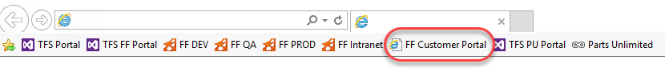
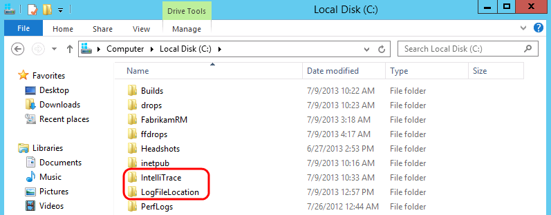
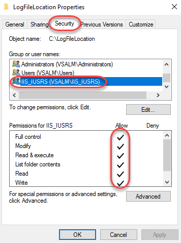
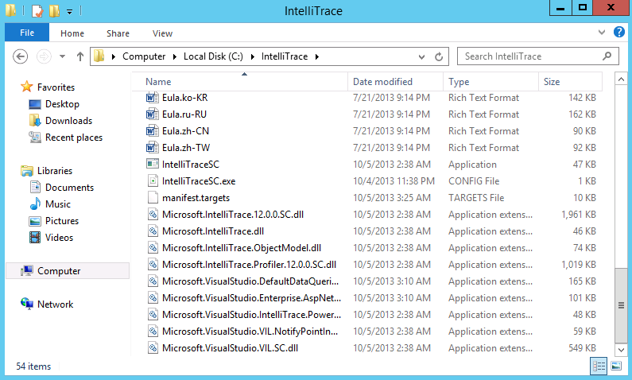
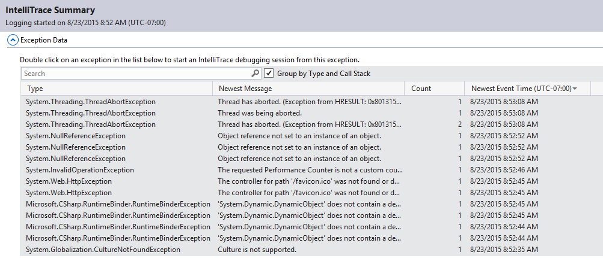
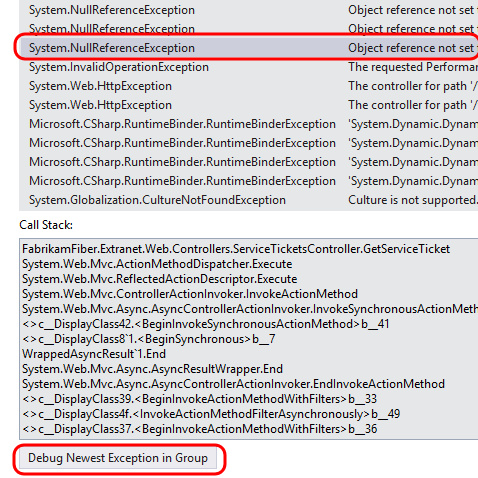
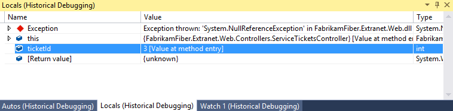

Lab version: 15.0.26020.0

Last updated: 1/23/2017

## Overview

IntelliTrace – first released in Visual Studio 2010 – changed the
    game for debugging by allowing developers to step “back in time” to
    see how an application got into its current state. By exposing
    events such as file and registry access, exceptions, and method
    calls, an IntelliTrace file can provide a detailed view into
    application behavior. In this lab, you will learn how Visual Studio
    2017 extends the capabilities of IntelliTrace beyond the development
    and testing organizations by providing IT administrators with the
    ability to capture IntelliTrace files running from
    production servers. These files can then be analyzed by developers
    to help diagnose production issues.

**Note:** This virtual machine has been pre-configured to archive
    source and symbols for the builds you are working with. This ensures
    that the files you get back from an IntelliTrace session can be
    correctly matched to a particular build. In order to best take
    advantage of IntelliTrace for your software applications, you should
    review [this blog
    post](http://www.edsquared.com/2011/02/12/Source+Server+And+Symbol+Server+Support+In+TFS+2010.aspx)
    which goes into more detail and provides instructions for
    enabling this.

## Pre-requisites

In order to complete this lab you will need the Visual Studio 2017
virtual machine provided by Microsoft. For more information on acquiring
and using this virtual machine, please see [this blog
post](http://aka.ms/almvm).


## Exercises

This hands-on lab includes the following exercises:

* Using IntelliTrace in Production

* Debugging with IntelliTrace Files from Production

Estimated time to complete this lab: **60 minutes**.

## Exercise 1: Using IntelliTrace in Production

In this exercise, you will learn how to deploy and use IntelliTrace
    in production to capture trace information for an
    ASP.NET application.

### Task 1: Discovering a Bug in Production**

1.  Log in as **Brian Keller** (VSALM\\Brian). All user passwords are
    **P2ssw0rd**.

2.  Launch **Internet Explorer** and click on the **FF Customer Portal**
    button in the favorites bar to load the customer portal for Fabrikam
    Fiber Support (<http://www.fabrikam.com>).

    

3.  Select a few of the service tickets from the **My Tickets** section
    of the page to view their details until you come across one that
    indicates that an error occurred retrieving data from the server.
    This information is ultimately pulled from a database, but there
    could be a number of reasons for the general error message itself.

    

4.  **Close** Internet Explorer.

5.  Typically, the first step in determining the root cause of an error
    like this would be to check logs and perhaps a stack trace
    for details. If that does not provide enough information, and the
    error is not easily reproduced in a development environment the
    development team may end up taking a long time to determine the root
    cause and fix the problem. Installing Visual Studio or other
    debugging tools in a production environment may not be an option.
  

### Task 2: Setting Up For IntelliTrace Data Collection in Production

1.  Now let’s look at how to deploy and use IntelliTrace in a production
    environment to collect historical debugging data. Open a Windows
    Explorer window and navigate to the root of the C: drive. Note that
    there are two folders here that were created ahead of time for our
    use in this lab, **c:\\IntelliTrace** is where the standalone
    IntelliTrace files are placed and **c:\\LogFileLocation** is where
    the IntelliTrace files will be written to later on in this lab.

    


2.  In the **Explorer** window, right-click on the **LogFileLocation**
    folder and select **Properties** to open the **Properties** window.
    We need to make sure that the IIS application pool has permission to
    use the **LogFileLocation** folder.

3.  Select the **Security** tab and then scroll down the existing list
    of groups and user names to find **IIS\_IUSRS.** Permissions were
    added ahead of time in this VM, but in a production environment, you
    would need to make sure to perform this step yourself.

    

4.  Press the **Escape** key to close the Properties window.

5.  IntelliTrace can be deployed to a production environment simply by
    performing an xcopy of the contents found in the **IntelliTrace
    Collector for Visual Studio 2017** package.

    **Note:** You can find the **IntelliTraceCollection.cab** package
    within your installation of Visual Studio Enterprise 2017 at
    %programfiles(x86)%\\Microsoft
    Visual Studio\\2017\\Enterprise\\Common7\\IDE\\CommonExtensions\\Microsoft\\IntelliTrace.
    Additional setup instructions, which were performed ahead of time on
    the virtual machine can be found
    [here](https://msdn.microsoft.com/en-us/library/vstudio/hh398365(v=vs.140).aspx)
    on MSDN.

    

````
**Note:** For the purpose of this lab, the production system is the same as our development system, but that will not normally be
          the case.
````

### Task 3: Initiating IntelliTrace Collection and Repro

1.  Now we will start IntelliTrace so that we can gather some diagnostic
    data from the web application. You have two options here, you can
    follow steps **2** through **17** or you can run the
    *StartIntelliTraceDemo.cmd* file found within the **Scripts** folder
    on the **Desktop** (run as administrator) and skip ahead to step
    **18**.

2.  Open a **PowerShell** window from the taskbar by right-clicking its
    icon and selecting **Run as Administrator**.

    

3.  Type the following command to import the IntelliTrace PowerShell
    module:

    **Import-Module
    c:\\IntelliTrace\\Microsoft.VisualStudio.IntelliTrace.PowerShell.dll**

4.  To see the commands provided by IntelliTrace use the following
    PowerShell command:

    **Get-Command \*IntelliTrace\***

    

    **Note:** Commands are provided to start and stop an IntelliTrace
    collection as well as to make checkpoints during collection.

5.  To get help for any of the PowerShell IntelliTrace commands, type
    something like the following:

    **Get-Help Start-IntelliTraceCollection**

    **Note:** You may be prompted to download and install the help
    files, so if you don’t want to wait for this to complete simply skip
    this step and move on.

    

    **Note:** The REMARKS section from the help listing describes how
    you can get more detailed examples of command usage.


6.  We are now ready to start IntelliTrace collection. Type the
    following PowerShell command on a single line to start collecting
    data from the *FabrikamFiber.Extranet.Web IIS* application pool and
    store the resulting .iTrace log files in the folder we
    previously created.

    **Start-IntelliTraceCollection "FabrikamFiber.Extranet.Web"
    c:\\IntelliTrace\\collection\_plan.ASP.NET.trace.xml
    c:\\LogFileLocation**

    **Note:** You can hand-edit the collection plan file if you want to
    make changes.

7.  When asked to confirm, type “**Y**” and then press the **Enter** key
    to continue.

    

    **Note**: If you see an error related to the app pool not having a
    writable user environment key, go ahead and try the same command
    again to start the collection.

8.  Launch **Internet Explorer** and click on the **FF Customer Portal**
    button in the favorites bar to load
    [http://www.fabrikam.com](http://www.fabrikam.com/).

9.  IntelliTrace is now set up to gather the debugging data specified in
    the collection plan configuration file. Select the service tickets
    to reproduce the error that we saw before. As soon as you see the
    error, **close** Internet Explorer.

    

10. Now we will stop the IntelliTrace collection to return the
    production server into its normal state. You have two options here;
    you can follow steps **11** through **13** or you can run the
    *StopIntelliTraceDemo.cmd* file found within the **Scripts** folder
    on the **Desktop** (run as administrator) and skip ahead to step
    **14**.

11. Return to the PowerShell window and type the following command to
    get the current collection status.

    **Get-IntelliTraceCollectionStatus -ApplicationPool
    "FabrikamFiber.Extranet.Web"**

    

12. Type the following command to stop gathering IntelliTrace data for
    the *FabrikamFiber.Extranet.Web* application pool. Confirm the
    action when prompted.

    **Stop-IntelliTraceCollection "FabrikamFiber.Extranet.Web"**

    **Note:** As an alternative to stopping an IntelliTrace collection,
    it is also possible to get a copy of the current log by using the
    *Checkpoint-IntelliTraceCollection* command. This allows you to look
    at the data you have captured so far while continuing to collect
    additional data.


13. When asked to confirm, type “**Y**” and then press the **Enter** key
    to continue.

    


14. In a real-world scenario, it is at this point that the IntelliTrace
    file would be sent to a developer or tester for a more
    detailed look.

## Exercise 2: Debugging with IntelliTrace Files from Production

In this exercise, you will see how we can use the IntelliTrace file
    that was generated on a production server to aid in debugging the
    error that we saw in the previous exercise.


1.  Returning to our scenario, let’s assume that we have already taken
    this IntelliTrace file and transferred it to a development machine
    that has Visual Studio Enterprise 2017 installed. **Double-click**
    the IntelliTrace file from **C:\\LogFileLocation** to load it in
    Visual Studio.

    

2.  After opening the **IntelliTrace Summary** window, locate the
    **Exception Data** section. Here you can see a grid showing all
    exceptions that occurred. By default, they are sorted by most recent
    event time to the oldest.

    

3.  Select the last **System.NullReferenceException** found in the list
    (technically the first one that was thrown) and then select the
    **Debug Newest Exception in Group** button to start an IntelliTrace
    debugging session.

    

4.  Since this IntelliTrace session isn’t associated with an active
    solution, you’ll need to temporarily disable the **Just My Code**
    feature to get the full experience. From the main menu select
    **Tools | Options**.

5.  In the left tree view, locate **Debugging | General** and uncheck
    the **Enable Just My Code** option in the right panel. Click **OK**
    to apply.

    

6.  After the IntelliTrace file loads, you will see that you are in
    Historical Debugging mode where you can examine the historical state
    of Locals, Call Stack, and events collected during
    IntelliTrace session.

    

7.  In the **Locals** window, note that there was a
    **NullReferenceException** event in the GetServiceTicket controller
    method, and that this was associated with **ticketId** value **3**.
    At this point we could file a bug in Team Foundation Server and
    attach the IntelliTrace file to help the development team make the
    appropriate fix.

    

8.  There is also a diagnostic session data window open in the
    right-hand tab group (.**diagsession**). Select it to activate it.

    

9.  All of the recorded diagnostic events are shown here. The one that
    we are currently viewing is the NullReferenceException when it was
    first thrown. This view can help us put the error into context with
    other events that were occurring just prior to the exception. For
    example, perhaps there was a problem with the SQL query that
    was used. In that scenario we could get the query that was used
    simply by viewing the previous event.

    

