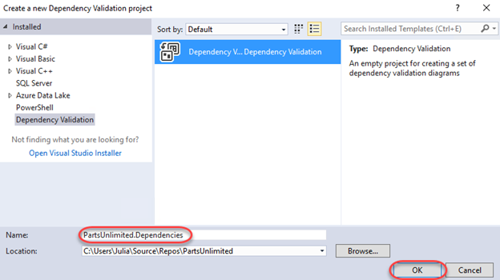
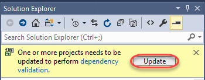
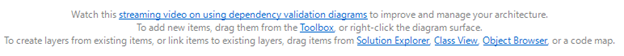
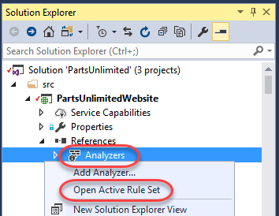

## Overview

Visual Studio 2017 enables teams to validate architectural dependencies in their solutions using the [Layer Designer](https://msdn.microsoft.com/en-us/library/dd465141.aspx), which first shipped in Visual Studio 2010. This feature helps ensure that developers respect the architectural constraints of the application as they edit their code. It has been re-written in Visual Studio 2017 to use Roslyn analyzers for a more robust, reliable experience. Developers now get real-time design feedback in the editor so they can immediately stop introducing architectural flaws. "Layer" diagrams have also been renamed "dependency validation" diagrams to make it clearer what they are for.

## Related Resources

See this [blog post](https://blogs.msdn.microsoft.com/visualstudioalm/2016/11/30/live-dependency-validation-in-visual-studio-2017/) for a detailed discussion comparing the live dependency validation experience with the past.

## Prerequisites

In order to complete this lab you will need the Visual Studio 2017 virtual machine provided by Microsoft. Click the button below to launch the virtual machine on the Microsoft Hands-on-Labs portal.

<a href="https://labondemand.com/AuthenticatedLaunch/38308?providerId=4" class="launch-hol" role="button" target="_blank">Launch the virtual machine</a>

Alternatively, you can download the virtual machine from [here](../almvmdownload/)

## Exercise 1: Real Time Dependency Validation in Visual Studio 2017

### Task 1: Creating a dependency diagram

1. Log in as **Sachin Raj (VSALM\Sachin)**. All user passwords are **P2ssw0rd**.

1. Launch **Visual Studio** from the taskbar.

1. Load the **PartsUnlimited** solution.

    

1. Press **Ctrl+Shift+B** to rebuild the solution.

1. Select **Architecture \| New Dependency Validation Diagram** from the main menu.

1. Enter a **Name** of **"PartsUnlimited.Dependencies"** and click **OK**.

    

1. If asked to update projects to support dependency validation, click **Update**.

    

1. Note that the new project has been added to the solution. Double-click **DependencyValidation1.layerdiagram** to open it.

    

1. There are a lot of ways to add layers to the diagram, including from the **Solution Explorer**, **Class View**, and **Object Browser**.

    

1. In this case, we're going to automatically generate a code map and then use that to codify our architecture via the diagram. Select **Architecture \| Generate Code Map for Solution**. This code map will pull in everything it can about the project and represent it in a diagram so we can easily walk through the de facto dependencies and relationships each component (class, etc) has.

1. Expand the **PartsUnlimited.dll** component to see the namespaces it contains.

    

1. It gets a little messy at this point because we have lots of relationships and dependencies mapped across and within the project and its tests. Use **Ctrl+Click** to select **PartsUnlimited.Controllers**, **PartsUnlimited.ViewModels**, and **PartsUnlimited.ProductSearch**. Press **Ctrl+C** to copy them.

    

1. Switch back to the layer diagram and press **Ctrl+V** to paste the three components from the last step. You may want to rearrange them as shown below to make their relationships easier to understand. Put simply, the controllers namespace depends on the product search and viewmodel namespaces. While these relationships existed before and may have been unofficial while the project was being developed, putting them into the layer diagram makes them official architectural law moving forward.

    

1. It's important to understand that the rules only exist for layers that exist on the diagram. For example, the **Controllers** namespace can reference the **ProductSearch** or **ViewModels** namespaces because their relationships are explicitly defined. At the same time, those two namespaces may not reference anything from the **Controllers** namespace because the dependency is directional (there are bidirectional dependencies available if two-way references are desired). **ProductSearch** and **ViewModels** may also not reference each other because they do not have an explicit dependency in the diagram. However, a namespace like **PartsUnlimited.Utils** is not used in the layer diagram and therefore is not enforced by the dependency validation engine. It may reference anything and anything may reference it. However, if it were added to the diagram, then all of its dependencies with every other layer in the diagram would be enforced.

    

1. Press **Ctrl+S** to save the diagram.

### Task 2: Live dependency validation

1. Now it's time to break some rules. Press **Ctrl+Shift+B** to rebuild the solution. It should build as expected because we haven't violated any policy...yet.

1. In **Solution Explorer**, search for **"string"** and open **StringContainsProductSearch**. This class is a member of the **PartsUnlimited.ProductSearch** namespace, and therefore is not allowed to reference anything from **PartsUnlimited.ViewModels**.

    

1. Locate the **Search** method. It currently returns a **Task<IEnumerable<Product>>**. Change it to return a **Task<IEnumerable<ViewModels.ProductViewModel>>**.

    

1. While this change introduces other errors as well, the key thing to focus on here is that the editor immediately provides a red squiggle indicating that this reference is not allowed based on its defined relationships. This live dependency validation provides immediate feedback to enforce architectural practices so that developers can feel confident that they're following the project rules.

    

1. And even if the developer were to ignore the red squiggle, they would still be unable to build the solution due to error-level enforcement of the policy.

    

1. However, you can customize exactly how dependency rule violations are treated. In **Solution Explorer**, clear the search box.

    

1. Under **References**, right-click **Analyzers** and select **Open Active Rule Set**.

    

1. Expand the **Microsoft.DependencyValidation.Analyzers** rule set and note how you could change the violation behavior from an **Error** to a **Warning** (or whatever you prefer). There is great flexibility in managing dependency validation.

    