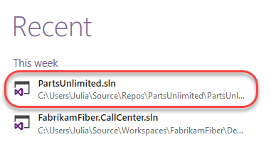
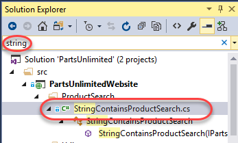
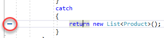
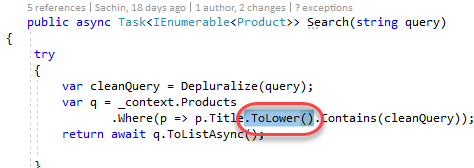
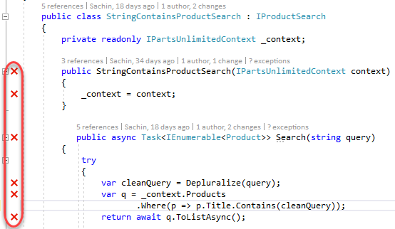
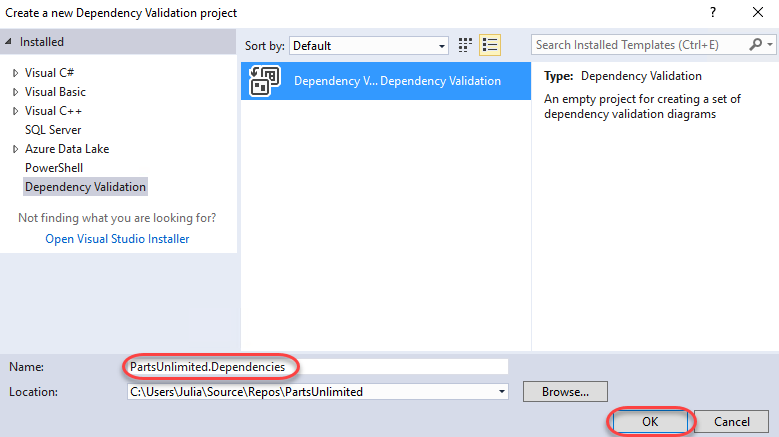

Lab version: 15.0.26020.0

Last updated: 2/19/2017

## Overview

Live Unit Testing is a new feature introduced in Visual Studio 2017. It
visualizes unit test results and code coverage live in the editor
alongside your code and updates while you are coding. It works with C\#
and VB projects for the .NET framework and supports three test
frameworks: MSTest, xUnit, and NUnit. Live Unit Testing makes it easy to
maintain quality and test coverage during rapid development and takes
your productivity to a whole new level. Imagine fixing a bug in a code
base in which you may not be completely familiar with. With Live Unit
Testing, you can know right away—as you are making edits to fix the
bug—that you did not break another part of the system. Getting this
feedback as you type will help you feel confident that your effort is
delivering the results you expect.

Visual Studio also enables teams to validate architectural dependencies
in their solutions using the <a href="https://msdn.microsoft.com/en-us/library/dd465141.aspx"/>Layer
Designer</a>, which
first shipped in Visual Studio 2010. This feature helps ensure that
developers respect the architectural constraints of the application as
they edit their code. It has been re-written in Visual Studio 2017 to
use Roslyn analyzers for a more robust, reliable experience. Developers
now get real-time design feedback in the editor so they can immediately
stop introducing architectural flaws. “Layer” diagrams have also been
renamed “dependency validation” diagrams to make it clearer what they
are for.

## Related Resources

See this <a href="https://blogs.msdn.microsoft.com/visualstudio/2016/11/18/live-unit-testing-visual-studio-2017-rc/" />blog
post</a>
for more information on live unit testing.

See this <a href="https://blogs.msdn.microsoft.com/visualstudioalm/2016/11/30/live-dependency-validation-in-visual-studio-2017/" />blog
post</a>
for a detailed discussion comparing the new live dependency validation
experience with the past.

## Prerequisites

In order to complete this lab you will need the Visual Studio 2017
virtual machine provided by Microsoft. For more information on acquiring
and using this virtual machine, please see <a href="http://aka.ms/almvm" />this blog
post</a>

## Exercise 1: Live Unit Testing in Visual Studio 2017

Live Unit Testing is a service that watches your codebase for changes.
As you edit files, it automatically detects which tests are impacted and
runs those tests in the background. The results are provided immediately
so that you can get feedback on how your changes affect the overall
codebase quality. It also indicates which lines of code have no test
coverage so that you can think about testability as you develop.

### Task 1: Live unit testing

1.  Log in as **Sachin Raj (VSALM\\Sachin)**. All user passwords are
    **P2ssw0rd**.

2.  Launch **Visual Studio 2017** from the taskbar.

3.  Open the **PartsUnlimited** solution from the **Start Page**.

    

4.  In **Solution Explorer**, search for **“string”** and double click
    **StringContainsProductSearch.cs** to open it.

    

5.  This class already has some tests written and is currently in pretty
    good shape. However, suppose you were planning to make some changes
    and wanted to get an understanding of the quality of the code before
    you begin. Rather than running all tests, you can now simply enable
    live unit testing and let it illustrate the coverage.

6.  Select **Test | Live Unit Testing | Start** to start live
    unit testing. After a moment you will see glyphs appear in the left
    margin of the editor. There are three types of glyphs that indicate
    that all tests for a line pass (a green check), at least one test
    fails (a red X), or that the line is not tested (a blue line). In
    this case, you can see that the code in the constructor and
    beginning of **Search** pass their tests.

    

7.  Looking further down, it’s clear that the exception case for this
    method is not tested, which is something you should think about
    adding later on.

    

8.  Now let’s experiment with a change to the code. Delete the
    .**ToLower()** call in **Search**.

    

9.  The live unit testing service will immediately detect the change in
    code and re-run the tests (note the clock element is added to
    the glyphs). You don’t even need to save the file.

    

10. Since the change above broke some tests, the glyphs are changed to
    reflect which lines of code are now part of failing tests. It’s
    important to note that these glyphs don’t indicate that the error
    occurred on their respective lines, but rather that those lines are
    executed by tests that ultimately fail.

    

11. Pres **Ctrl+Z** to undo the changes made earlier. You may need to
    press it multiple times to restore the **.ToLower()** from above.
    The glyphs should all return to passing.

    

