

## Overview

In this lab, you will learn about how the unit testing engine in Visual Studio is extensible and opens the door for 3rd party unit testing adapters such as NUnit and xUnit.net. In addition, you will see some of the improvements made to code coverage support. You will also learn about how the code clone capability goes hand-in-hand with delivering high quality software by helping you identify blocks of semantically similar code which may be candidates for common bug fixes or refactoring.

## Prerequisites

In order to complete this lab you will need the Visual Studio 2017 virtual machine provided by Microsoft. Click the button below to launch the virtual machine on the Microsoft Hands-on-Labs portal.

<a href="https://labondemand.com/AuthenticatedLaunch/38309?providerId=4" class="launch-hol" role="button" target="_blank">Launch the virtual machine</a>

Alternatively, you can download the virtual machine from [here](../almvmdownload/)

## About the Fabrikam Fiber Scenario

This set of hands-on-labs uses a fictional company, Fabrikam Fiber, as a backdrop to the scenarios you are learning about. Fabrikam Fiber provides cable television and related services to the United States. They are growing rapidly and have embraced Windows Azure to scale their customer-facing web site directly to end-users to allow them to self-service tickets and track technicians. They also use an on-premises ASP.NET MVC application for their customer service representatives to administer customer orders.

In this set of hands-on labs, you will take part in a number of scenarios that involve the development and testing team at Fabrikam Fiber. The team, which consists of 8-10 people has decided to use Visual Studio application lifecycle management tools to manage their source code, run their builds, test their web sites, and plan and track the project.

## Exercise 1: Code Quality Tools

### Task 1: Unit Testing

In this task, you will learn about the unit testing story in Visual Studio 2017.

1. Log in as **Sachin Raj (VSALM\Sachin)**. All user passwords are **P2ssw0rd**.

1. Launch **Visual Studio 2017** from the taskbar and open **FabrikamFiber.CallCenter.sln** from the **Start Page**.

    

1. Select **Build \| Build Solution**.

1. Open the **Test Explorer** window from **Test \| Windows \| Test Explorer**. Note that discovered tests are initially set to the **Not Run** state.

    

1. Click **Run All** to execute all discovered unit tests.

    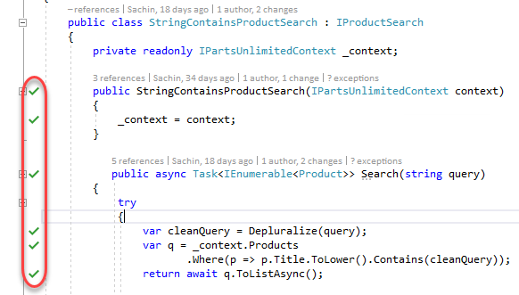

    > **Note:** Visual Studio also provides **Continuous Test Runner** functionality that can be enabled with the **Test \| Test Settings \| Run Tests After Build** option. With this option selected, tests will always run after builds.

1. Expand the **Passed Tests** group (if necessary) and **double-click** the test with the name **CreateInsertsCustomerAndSaves** to open the source code.

    

1. In the **CustomersControllerTest.cs** file that opens, note that the test method uses the expected **TestMethod** attribute used by **MSTest** to mark unit tests.

    

    > **Note:** The test status indicator just above the method definition is a CodeLens indicator. It tells us that the last run was a success. You can learn more about the CodeLens feature in the "Collaboration Experiences for Development Teams using Team Foundation Server" lab.

1. In the **Search** box at the top of the **Test Explorer** window, type "**index**" and note the available search filters.

    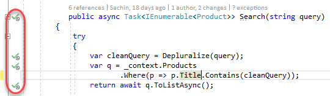

1. In the search results, **double-click** the only test listed with the name **IndexReturnsNonNullView** to open the source code.

    

1. In the **HomeControllerTest.cs** file that opens, you can see that the **IndexReturnsNonNullView** test actually uses the **XUnit** testing framework. Both the xUnit framework and the test runner that integrates with **Test Explorer** can be added to a project via NuGet.

    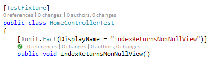

1. Click the **X** button to clear the current search box in Test Explorer.

    

1. Note that results are grouped by test outcome by default, with execution times listed.

    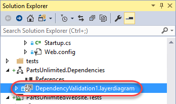

1. Test execution performance has been given some additional attention in recent versions. Take note of the execution times and then select the **Run...** button followed by the **Repeat Last Run** option. Note the difference in execution time.

    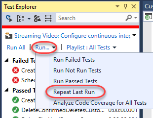

    > **Note:** The execution times that you see will be different from those shown in the screenshots. The first time you run unit tests they will execute more slowly than on subsequent runs as the tests and testing engine are being loaded for the first time.

    

1. **Single-click** the failed test named "**ScheduleActionCorrectlyUpdatesRepositories**" to view a summary of test results.

    

    > **Note:** You can also right-click on test results and use the **Copy** command to copy details to the clipboard. This would be useful when sending an email, for example.

1. The summary view of the failed test run shows that an **ArgumentNullException** exception occurred during the test run and even provides the stack track at the time of the exception. Note that we can follow links to go directly to the source code for the test or to points within the stack trace. **Click** the **source link** to go to the source code for the test method.

    

    

1. Find the line of code that is commented out and un-comment it. Assume that this is the root cause for the failed test.

    

1. Press **Ctrl+S** to save your changes.

1. **Right-click** the failed test in **Test Explorer** and select **Run Selected Tests** to make sure that the problem is fixed.

    

1. Up until now, we've walked through the process of manually running tests to find bugs. While this approach does work, there's an even better option that will save you a ton of time: **Live Unit Testing**. Live unit testing continually runs your unit tests in the background as you edit code, providing real-time feedback on how changes impact the quality of the overall codebase.

1. Select **Test \| Live Unit Testing \| Start** to enable it. After it builds and runs the tests in the background, you'll see some new glyphs alongside the code.

    

1. There are three glyphs. A green check indicates that the code is covered by at least one test, and that all tests covering it currently pass. A red X indicates that the line of code is covered by at least one failing test. A blue line indicates that the code is not tested.

1. Re-comment the line of code with "get_All" that you uncommented earlier to fix the bug. The live unit testing will silently run its tests and indicate that your code now fails at least one of its tests. Note that you don't need to do anything-not even save the file-for the tests to run and update the indicators. If you look further down in the test you can even see that the test fails at the **AssignSchedule** call and stops running, so the final three lines aren't even tested anymore.

    

1. Uncomment the line once again to fix the bug.

### Task 2: Unit Test Organization

1. So far, we have seen how to run all discovered tests, search for specific tests, and view tests by their outcome. Now let's take a look at a few other ways that you can organize and navigate them to make unit testing easier. To start with, there are a number of useful grouping options. **Right-click** somewhere within the **Test Explorer** window and select **Group By \| Class**.

    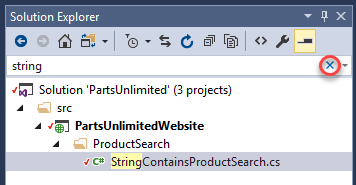

1. Assuming that tests are well organized within descriptive class names, this can make it much easier to select and run tests. For example, you could select just the tests from the **CustomersControllerTest** class and run them.

    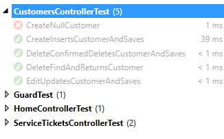

1. **Right-click** somewhere within the Test Explorer window and select **Group By \| Project**.

    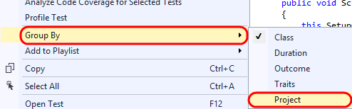

1. Grouping tests by project would obviously be useful for navigating and running tests at the project level.

    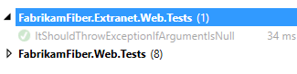

1. You can also use traits in your test code to provide custom grouping. Let's say that we want to group all coded UI tests together. Open **CodedUITest1.cs** from the **FabrikamFiber.Web.UITests** project.

    

1. Un-comment the **CodedUITest** attribute from the top of the CodedUITest1 class definition.

    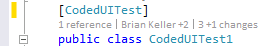

1. Add the **TestCategory** attribute to the CodedUITestMethod1 method with a category of "**UI**".

    

1. Build the solution by pressing **Ctrl+Shift+B**.

1. **Right-click** within **Test Explorer** and select **Group By | Traits**.

1. With the coded UI tests categorized appropriately, it is now easy to select and run just the UI tests if desired.

    

1. You can also create sets of tests called **playlists**. This provides custom grouping without the need to modify your unit testing code. **Right-click** the _**CodedUITestMethod1**_ test and select **Add to Playlist \| New Playlist**.

    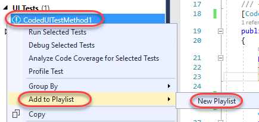

1. Enter "**UI Tests**" for the playlist file name and then click **Save**.

    

1. Select the **Playlist** drop-down and then select the "**UI Tests**" playlist.

    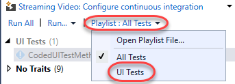

1. With just the "UI Tests" playlist selected, you will only see those specific tests shown in Test Explorer, making it much easier to focus on a particular selection of tests.

    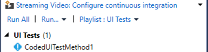

1. Test playlists are simple XML files that define the individual tests to include. For example, here is what the "UI Tests" XML looks like (loaded in Visual Studio editor).

    

1. Playlists can be shared with team members via a team website, emailed, and even added to source control if desired. To load a playlist file, you would select the **Playlist** drop-down and then select the **Open Playlist File** option. You do not need to do this for this lab.

    

### Task 3: Code Coverage

In this task, you will learn about code coverage features that make it easier to use and integrate into the development cycle.

1. Return to **CodedUITest1.cs** and comment out the **CodedUITest** attribute on the class. We won't be using that test for this part of the lab.

    

1. In **Test Explorer**, Return to the default playlist that includes all tests by selecting the **Playlist** drop-down and then selecting the **All Tests** option.

    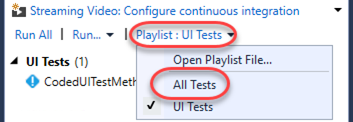

1. To analyze code coverage for all tests, select the **Run** drop-down and then select the **Analyze Code Coverage for All Tests** option. This will initiate the process of building, testing, and gathering code coverage results.

    

1. You can view the results in the **Code Coverage Results** windows to get an idea of the Covered/Not Covered statistics for all of the tests. In the screenshot below, note that coverage is measured in blocks of code by default, where a block is code with exactly one entry and exit point. There will be two sets of code coverage results produced from the last run. If the **Not Covered** is 100%, use the dropdown to select the other code coverage results.

    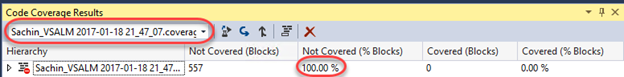

    **Note**: If you would like to see the results in terms of lines, you can do that by right-clicking in the Code Coverage Results window and selecting the Add/Remove Columns option.

1. Expand the root node of the code coverage result to view the coverage broken down by assembly. By default, we see all assemblies that are loaded during the test run (and for which a .pdb file is available).

    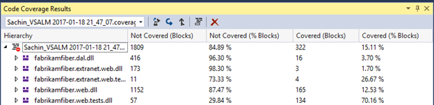

    > **Note:** You can customize control over which assemblies are selected for code coverage analysis by writing a .runsettings file. For more information, see the MSDN article [Customizing Code Coverage Analysis](http://msdn.microsoft.com/en-us/library/jj159530.aspx).

1. Expand the **fabrikamfiber.web.dll** node to view the coverage broken down by namespace. This allows us to see that, although we do have some test coverage of the controller classes, the test team has a lot of work to do in order to provide coverage to the other namespaces.

    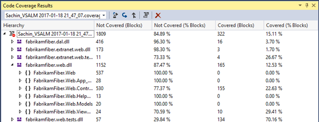

1. Expand the **FabrikamFiber.Web.Controllers** namespace node to view the coverage broken down by class. This shows that the **HomeController** class is covered well and that the **EmployeesController** currently has no coverage.

    

1. Finally, let's drill down into the class nodes to see coverage down to the method level by expanding the **CustomersController** class node.

    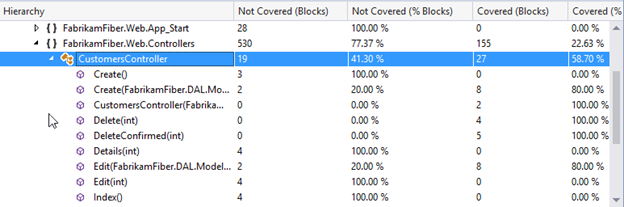

1. **Double-click** the **Create(FabrikamFiber.DAL.Models.Customer)** constructor to navigate to the source code to visualize the block coverage.

    

1. In the editor window for **SourceController.cs**, you can see that the code highlighted blue represents the block that was covered by tests whereas the red represents the block that was not covered.

    

1. It is also possible to get code coverage for a specific selection of tests. In **Test Explorer**, right-click **CreateInsertsCustomerAndSaves** and select **Analyze Code Coverage for Selected Tests**.

    

1. Once test execution completes for the selected test, expand the code coverage node and note that only the assemblies loaded during test execution are shown with statistics.

    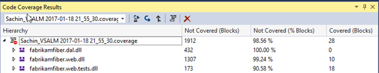

1. It is also easy to navigate between different code coverage results by using the drop-down in the **Code Coverage Results** window. Go ahead and select the first code coverage results file.

    

1. Let's say that we want to use these code coverage results in a report or simply share them externally. To do that, click on the **Export Results** button.

    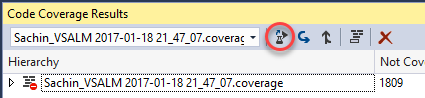

1. In the **Save Coverage Data as XML** window, you could save the code coverage data to an XML file, but for the purposes of this lab, go ahead and simply **Cancel** out of the dialog and continue on to the next exercise.

    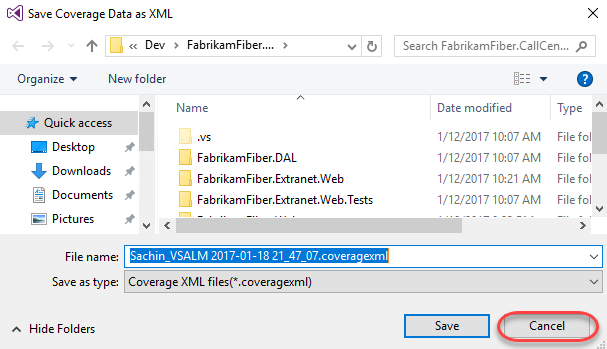

### Task 4: Code Clone Analysis

In this exercise, you will learn about the Code Clone analysis feature that looks for semantically similar code using a heuristic search technique, rather than simply searching for exact matches.

1. Select **Analyze \| Analyze Solution for Code Clones** from the main menu in Visual Studio.

1. Once the analysis is complete, the **Code Clone Analysis Results** window will show clone candidates grouped by match strength. Expand the **Strong Match** group to expose the two files that had a strong match.

    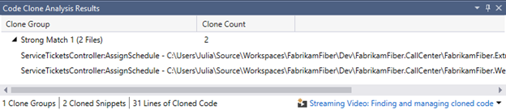

1. Each line shows the class and method, specific file, and lines that were determined to be strong matches. If you **mouse over** each match, a snippet of code gives you quick glance at some of the matching code.

    

1. **Double-click** on each match to open them in code editor windows, and then **right-click** on the title tab for one of them and select **New Horizontal Tab Group** from the context menu.

    

1. Scroll through the code to locate the **AssignSchedule** method for each file and note that it is identical except for the last line that calls the **RedirectToAction** method. This indicates that this method is a good candidate for refactoring. This kind of broad search is particularly useful when looking for code that can be refactored for easier maintenance in the future.

    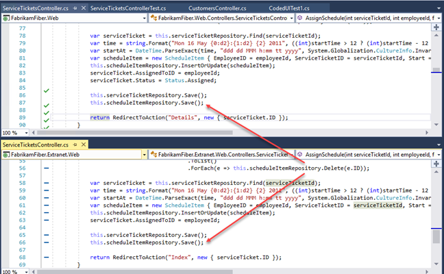

1. Select **Window \| Close All Documents** from the main menu to clear up some screen real estate space.

1. You can also narrow the focus of the search for code clones if desired. In **Solution Explorer**, navigate to **Controllers** folder of the **FabrikamFiber.Web** project and open **CustomersController.cs** in the code editor.

    

1. Scroll down to the **Create** method that takes a **Customer** parameter and select the three lines of code within the first "if" statement. **Right-click** the selected lines of code and then select the **Find Matching Clones in Solution** option from the context menu.

    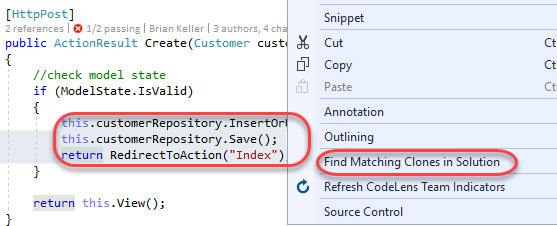

1. After the search is complete, the **Code Clone Search Results** window shows snippet matches of varying strength.

    

1. **Expand** all of the clone groups to expose the discovered matches, including the original clone group. You may want to increase the size of the Code Clone Search Results window so that you can see all matches at a glance.

    

1. Hold the mouse cursor over the original code snippet to remind ourselves what the code clones are being compared to.

    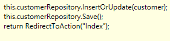

1. Hold the mouse cursor over the **Exact Match** result and note that the Edit method uses exactly the same code as the code from the Create method.

1. Hold the mouse cursor over the **Strong Match** result and note that the only difference is that the first line is a call to a Delete method.

    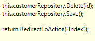

1. Hold the mouse cursor over the first **Medium** **Match** result and note that the snippet is similar to the original, but now we are working with an entirely different object (now **employeeRepository**).

    

1. In summary, there are three main scenarios where the identification of code clones may be useful to developers:

1. Identification of candidates for code refactoring

1. Bug fixes or enhancements are made in code and the developer wants to see if there are other similar locations that should be updated

1. As a learning tool for a new developer starting work on a new team project, e.g. the developer adds code to update a customer record and wants to see if there are practices used by the rest of the codebase such as using a Try... Catch block
