Lab version: 15.0.26020.0

Last updated: 1/31/2017

## Overview

In this lab, you will be introduced to the <a href="https://www.visualstudio.com/en-us/docs/test/performance-testing/getting-started/getting-started-with-performance-testing"/>Web performance and Load
testing capabilities </a>
provided in Visual Studio Enterprise 2017. You will walk through a
scenario using a fictional online storefront where your goal is to model
and analyze its performance with a number of simultaneous users. This
will involve the definition of web performance tests that represent
users browsing and ordering products, the definition of a load test
based on the web performance tests, and finally the analysis of the load
test results.

In order to complete this lab you will need the Visual Studio 2017
virtual machine provided by Microsoft. For more information on acquiring
and using this virtual machine, please see [this blog
post](http://aka.ms/almvm).

## Task 1: Recording web tests

1.  Log in as **Sachin Raj (VSALM\\Sachin)**. All user passwords are
    **P2ssw0rd**.

2.  Launch **Visual Studio 2017** from the taskbar.

3.  Open the **PartsUnlimited** solution from the **Start Page**.

    

4.  Launch **Visual Studio 2017** from the taskbar.

5.  In **Solution Explorer**, right-click the solution node and select
    **Add | New Project**.

    

6.  Select the **Visual C\# | Test** category and the **Web Performance
    and Load Test Project** template. Enter a **Name** of
    **“PULWebTest”** and click **OK**.

    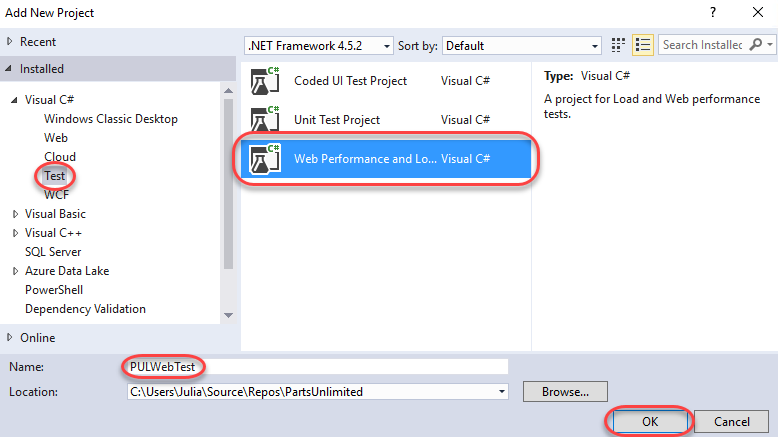

7.  Once the project has been created, the default (and empty)
    **WebTest1.webtest** file will be opened. Click the **Add
    Recording** button to begin a recording session.

    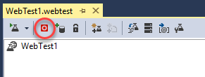

8.  In the browser, click the **Parts Unlimited** shortcut to load the
    main site. Note that each navigation you perform will be recorded so
    that it can be played back later as part of an automated test.

    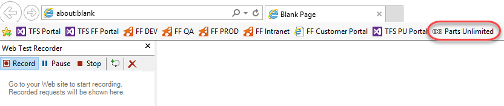

9.  Click the **Lighting** tab.

    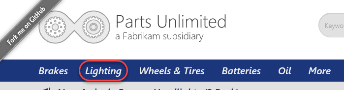

10. Click the **Bugeye Headlights** product.

    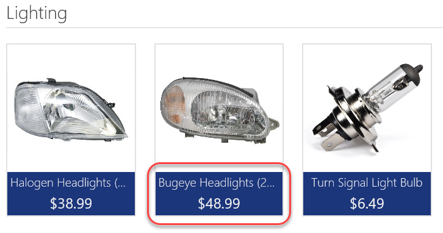

11. Continue browsing the site to generate more traffic, if desired.
    However, do not log in or add anything to your cart. When ready to
    move on, click **Stop** in the **Web Test Recorder**.

    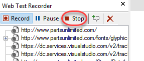

12. After stopping the recording session, Visual Studio will analyze the
    recorded traffic to attempt to identify dynamic parameters that can
    be abstracted for dynamic configuration later on.

    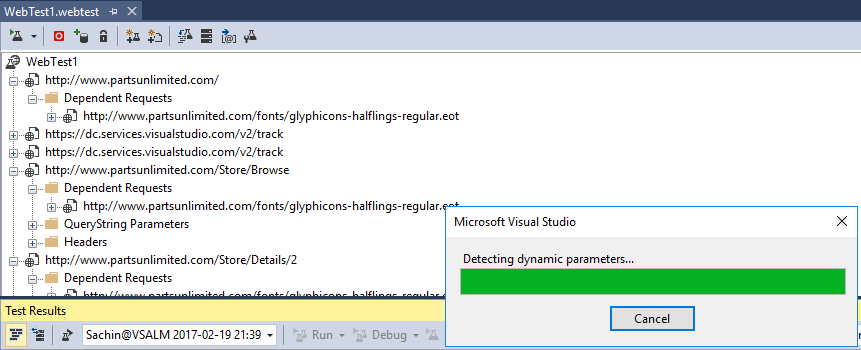

13. An initial test will also be run. Since the browsing was basic, it
    should easily pass. Double-click the successful run to load
    its details.

    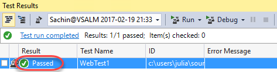

14. Select different requests throughout the test run to see details on
    how it performed, how large the payloads were, and so on. You can
    also dig into the specific HTTP requests and responses.

    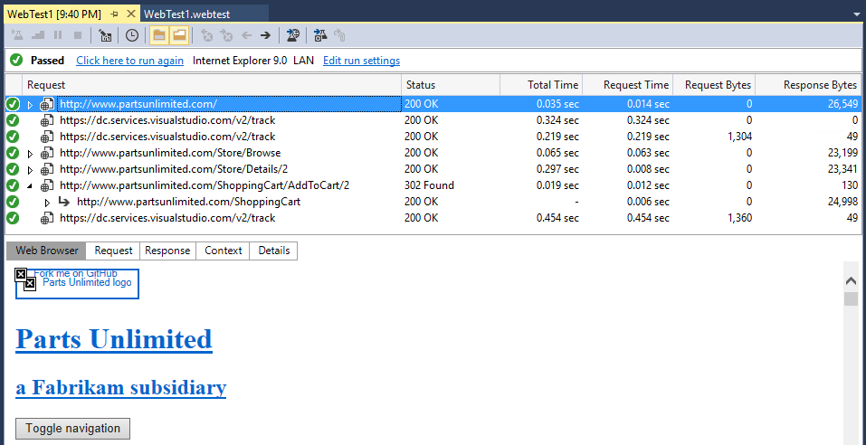

15. Close the test results.

## Task 2: Working with web tests

1.  From **Solution Explorer**, open **WebTest1.webtest** if it’s not
    already open.

    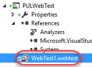

2.  Locate the step that navigates to **/Store/Browse** and expand
    **QueryString Parameters**. Note that the parameters have been
    extracted so that you can easily swap in different values to test
    with other values.

    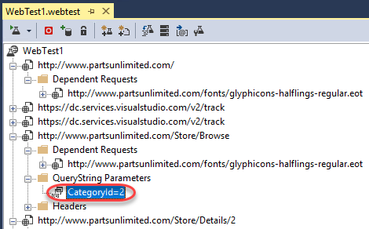

3.  In **Solution Explorer**, rename **WebTest1.webtest** to
    **Browsing.webtest**.

    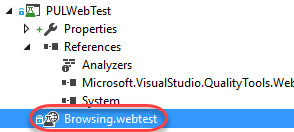

4.  In **Browsing.webtest**, click the **Set Request Details** button.

    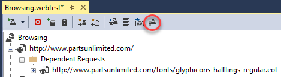

5.  This dialog enables you to configure the **Think Time** to use for
    each step. **Think Time** simulates the time an end user would stop
    to read the current page, think about their next action, etc. Here
    you can manually set how much time to use for each step, as well as
    to set goals for response time on each navigation. Click **Cancel**.

    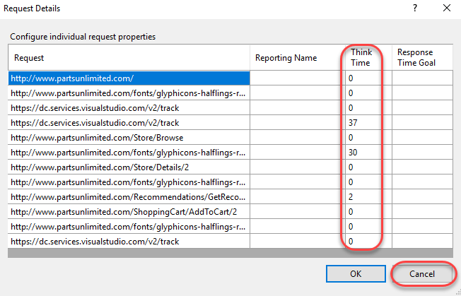

## Task 3: Recording sophisticated tests

1.  Now let’s add a more sophisticated test that involves completing
    a purchase. In **Solution Explorer**, right-click the **PULWebTest**
    project and select **Add | Web Performance Test**.

    

2.  Navigate to the Parts Unlimited site via the browser shortcut.

    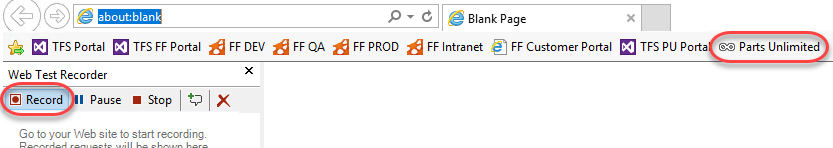

3.  Click **Log in**.

    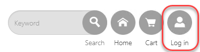

4.  Enter the email **admin@test.com** and password **P@ssw0rd**. Click
    **Login**.

    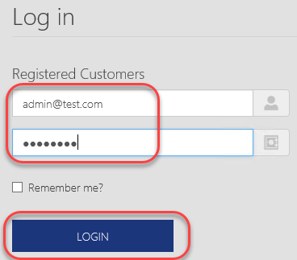

5.  Click the **Batteries** tab.

    

6.  Click the **12-Volt Calcium Battery**.

    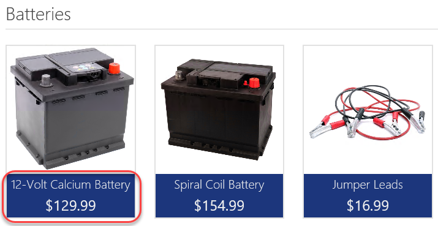

7.  Click **Add to Cart**.

    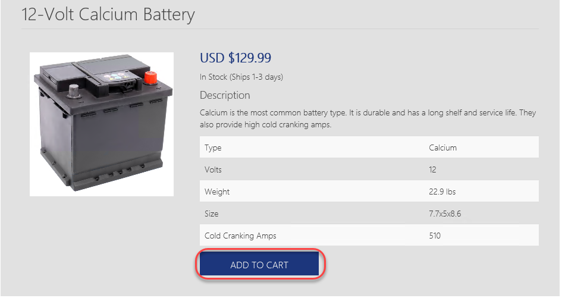

8.  Click **Checkout**.

    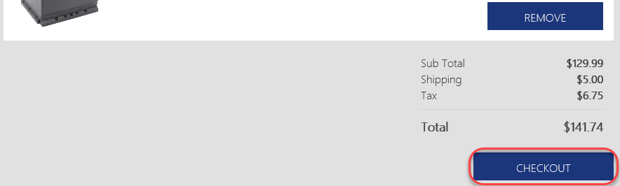

9.  Enter shipping information (details are not important) and be sure
    to use the Promo Code **FREE**. Click **Submit Order**.

    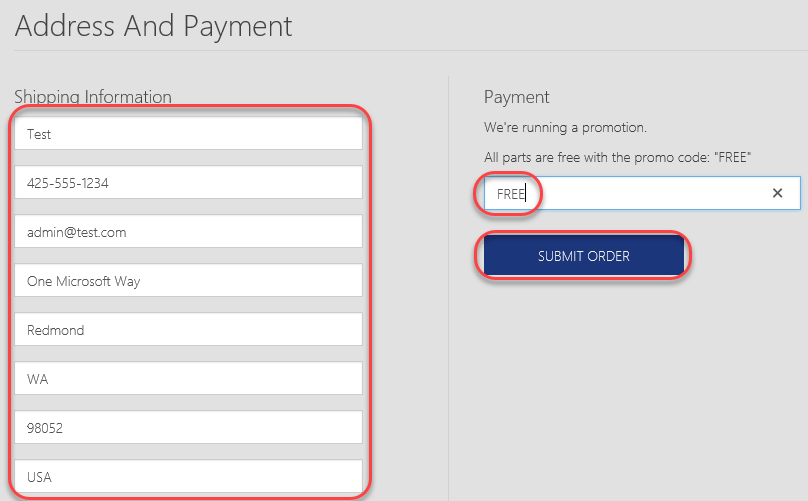

10. On the checkout page, click **view your order** to review the
    order details.

    

11. The details should all match what you entered earlier.

    

12. Click **Stop** in the **Web Test Recorder** to continue.

    

13. In **Solution Explorer**, rename **WebTest1.webtest** to
    **Buying.webtest**.

    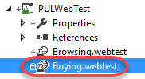

## Task 4: Viewing web test result details

1.  As before, Visual Studio will process the recorded steps and then
    attempt to execute the test. However, note that it failed this time.
    Double-click the failed test run to view it.

    

2.  Locate the failed step click it. It should be the redirect that
    occurs immediately after the order is submitted. Click the
    **Details** tab to confirm.

    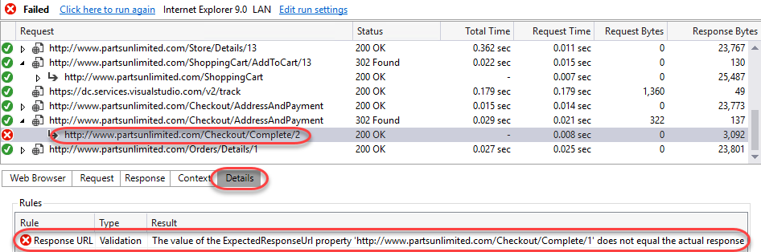

3.  This failure makes sense. In our original test, we checked out and
    received an order number embedded in the redirect URL. However,
    since the next test run would presumably result in a different order
    number, the redirect received would have a different URL from the
    one expected. Right-click the failed step and select **Go to Web
    Test** to review that step in the process.

    

4.  Depending on your test goals, you might want to have the test to
    dynamically accept the order number returned and track it throughout
    the remainder of the test. However, for the purposes of this lab we
    will simply delete that step to avoid the failure. Right-click the
    step and select **Delete**.

    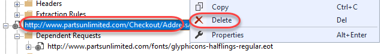

5.  Click the **Run Test** button again to confirm the test passes now.

    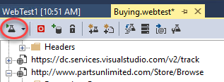

6.  The test should pass as expected.

    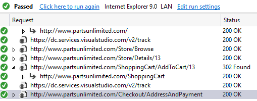

7.  Return to **Buying.webtest** and click the **Set Request
    Details** button.

    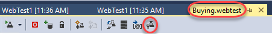

8.  Since we’re going to use this test as part of a load testing run,
    let’s update the **Think Time** columns with some realistic numbers.
    Try to have the whole run use around 30 seconds of total think time.
    For example, you may want the obvious navigations to each have 5
    seconds of think time while all the other requests have 0. Click
    **OK** when done.

    

## Task 5: Adding a load test

1.  Now that we have two tests that cover common scenarios, let’s use
    them as part of a load test to see how the system might perform with
    a variety of simultaneous users. In **Solution Explorer**,
    right-click the **PULWebTest** project and select **Add | Load
    Test**.

    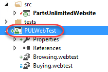

2.  There are two options for load testing: **cloud-based** and
    **on-premises**. The cloud-based load testing hosted by **Visual
    Studio Test Services** offers a massively scalable environment to
    truly stress test your system. However, in this scenario we’re going
    to select **On-premise Load Test** to contain testing entirely
    within the VM. Click **Next**.

    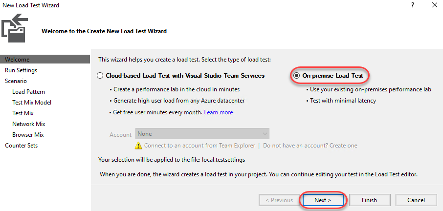

3.  The **Run Settings** enable you to indicate whether you’d like to
    run the test for a specified duration or if you’d like to run for a
    certain number of iterations. In this scenario, select **Load test
    duration** and set the **Run duration** to **1** minute. You can
    also configure a variety of details for testing, such as the
    **Sampling rate** for collecting data. Keep this at **15** seconds.
    Click **Next**.

    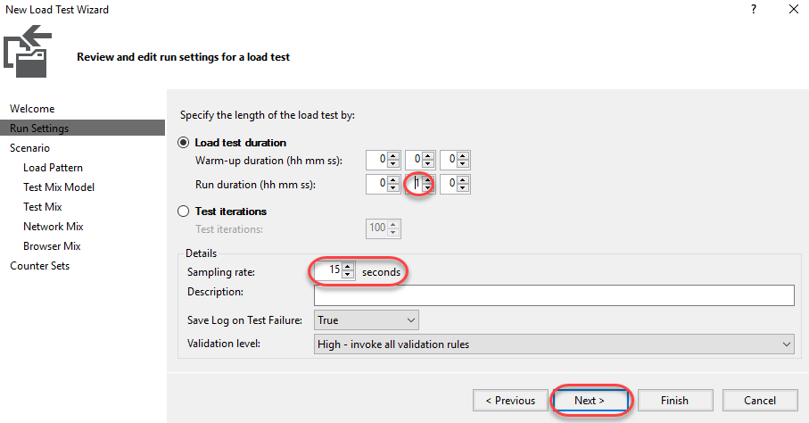

4.  Enter the name **“BrowseAndOrderProduct”** and click **Next**. Note
    that you could optionally configure how think times are applied.
    Although we entered explicit think times earlier, we can use the
    default option to add a degree of randomness (normally distributed
    based on the recorded times) so that each set of requests isn’t
    exactly the same. Click **Next**.

    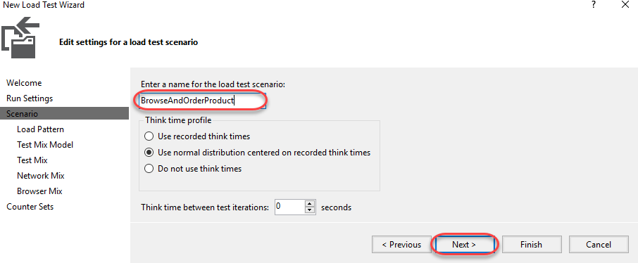

5.  We’ll keep things simple by have a **Constant Load** of **5** users.
    However, there are scenarios where you might prefer to have the
    users scale up over the course of the test to simulate
    growing traffic. Click **Next**.

    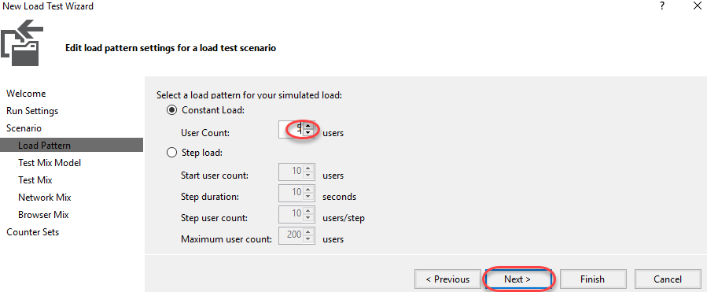

6.  Since the users will vary across tests, you can select an algorithm
    for modeling how they vary. For example, if they are **Based on the
    total number of tests**, this allows you to specify the percentages
    that each test will be run. This is particularly useful when dealing
    with a scenario where you find that 1 out of every 4 users who
    browse the site end up buying something. In that case, you would
    want a mix of 75% “browsers” and 25% “browse & buyers”. Click
    **Next**.

    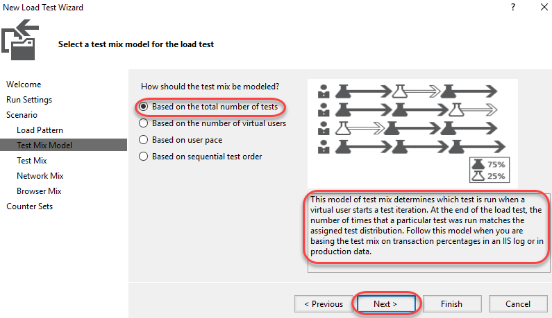

7.  Click **Add** to select tests to add to the mix.

    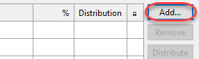

8.  Select the **Browsing** and **Buying** tests and add them to
    the mix. Click **OK**.

    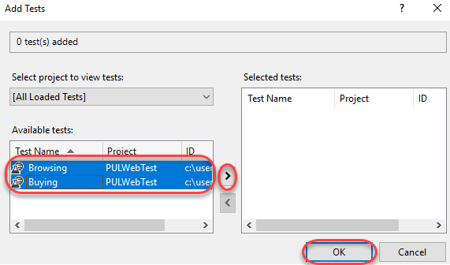

9.  Set the relative percentages to **75** and **25**. Click **Next**.

    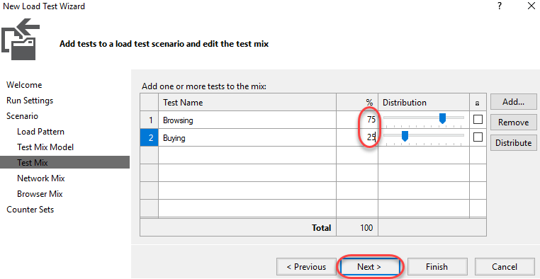

10. As with the tests, you can configure the network type mix to use
    when testing. Select **LAN** for all and click **Next**.

    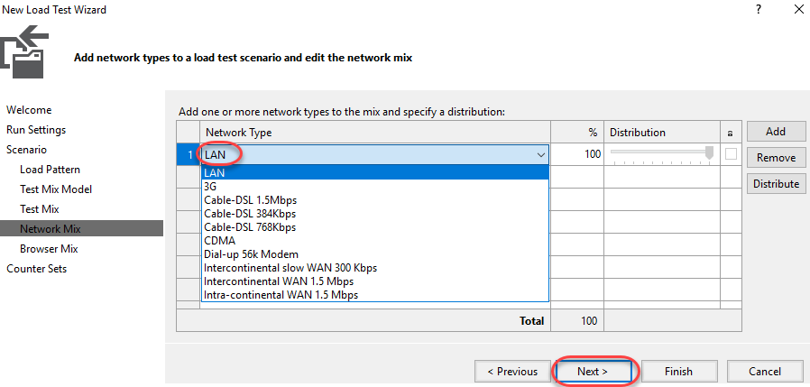

11. As with network types, you can also specify the mix of browsers.
    Select **Internet Explorer 9.0** for all and click **Next**.

    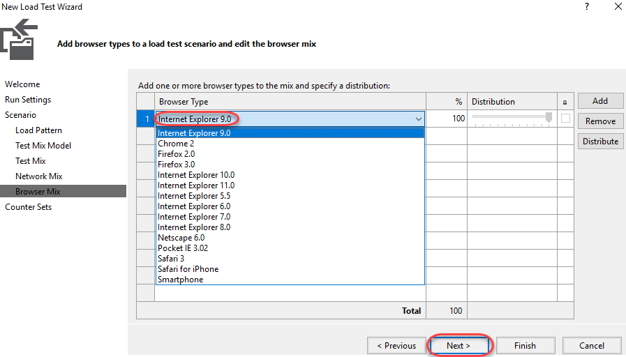

12. As part of the load testing you can collect performance counters.
    Click **Add Computer** to add a computer to the test.

    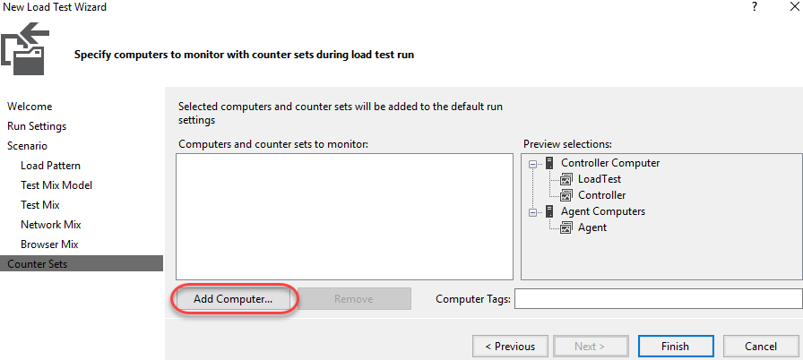

13. Set the name of the computer to **ALMVM** (this VM) and check
    **ASP.NET** and **SQL**. Click **Finish**.

    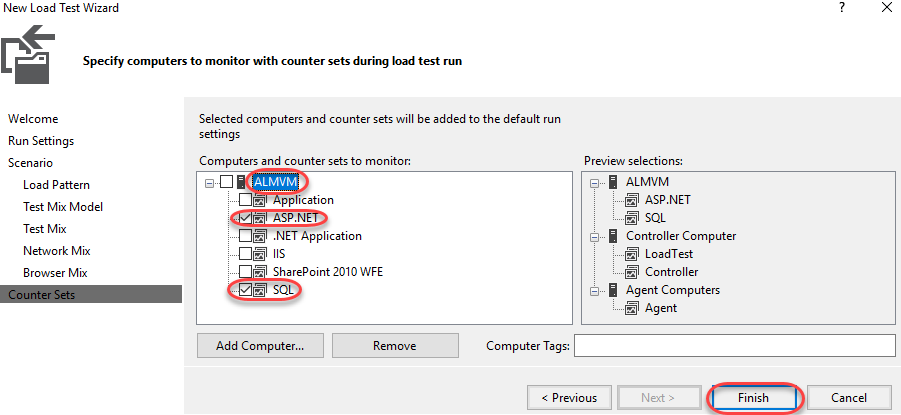

14. In **Solution Explorer**, double-click **Local.testsettings** under
    **Solution Items** to open it.

    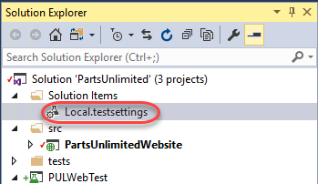

15. The **General** tab provides a place for you to update basic info
    about the test, such as whether it should be run locally or in VSTS.

    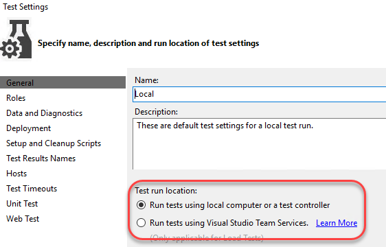

16. Select the **Data and Diagnostics** tab to view the
    available adapters. Options include those for **ASP.NET**, **Event
    Log**, **IntelliTrace**, **Network Emulation**, and more. No
    adapters are selected by default because many of them have a
    significant impact on the machines under test and can generate a
    large amount of data to be stored over the course of long
    load tests.

    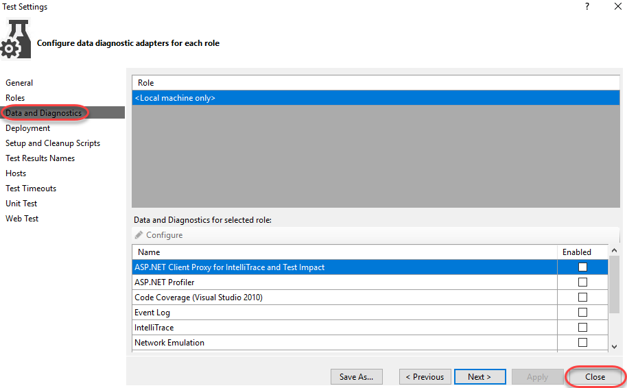

## Task 6: Configuring the test controller

1.  **LoadTest1.loadtest** should already be open. Click the **Manage
    Test Controllers** button.

    

2.  No connection string will be set yet, so click the **Browse** button
    to specify one.

    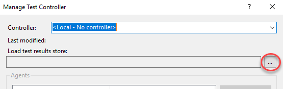

3.  The default settings are fine, so click **OK** to save.

    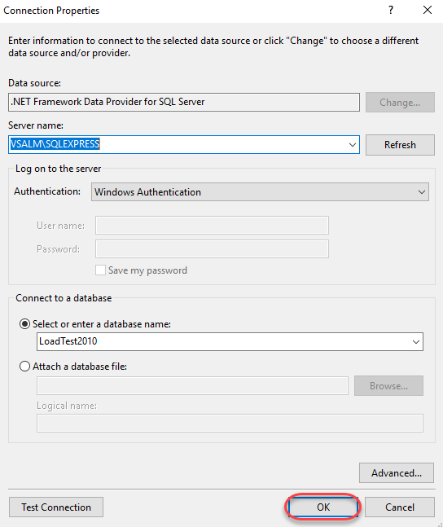

4.  Press **Esc** to close the **Manage Test Controller** dialog.

## Task 7: Executing, monitoring, and reviewing load tests

1.  Click the **Run Load Test** button to begin a load test.

    

2.  The test will run for one minute, as configured. By default, you
    should see four panels showing some key statistics, with some key
    performance counters listed below that. Data is sampled every 15
    seconds based on our configuration from earlier.

    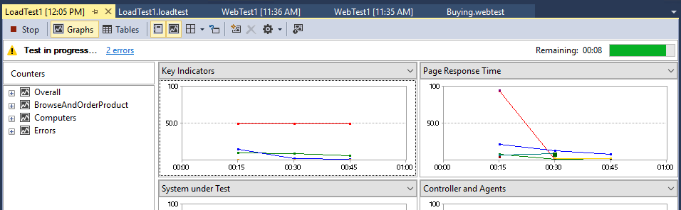

3.  After the load test run finishes, it will automatically switch to
    the **Summary** view. The **Summary** view shows overall aggregate
    values and other key information about the test. Note that the
    hyperlinks to specific pages open up even more details in the
    **Tables** view.

    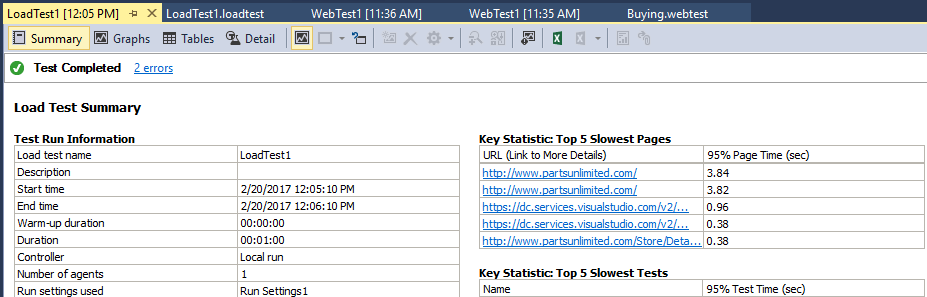

4.  Select the **Graphs** view and change the layout to use **Two
    Horizontal Panels**. The views are very flexible.

    

5.  By default, the top graph will show **Key Indicators** and the
    bottom graph will show **Page Response Time**. These are two very
    important sets of data for any web application.

    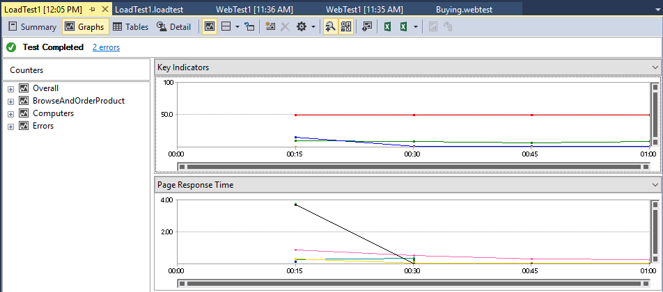

6.  Click one of the **Key Indicator** graph lines or data points and
    select it. This will also highlight the counter that it is
    associated with the below graphs. The red line from the screenshot
    below represents the **User Load** at different points during the
    load test.

    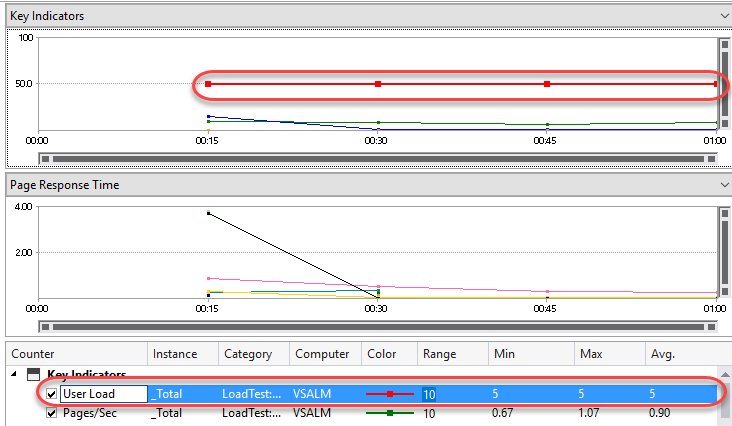

7.  Click the **Pages/Sec** row from the **Key Indicators** section of
    the counter grid to highlight it in the graph. In the screenshot
    shown below we can see that the average number of pages per second
    over the duration of the test was **1.18** (this may vary for you).

    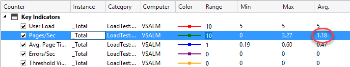

## Task 8: Generating and viewing load test trend reports

1.  Even though the initial load test may result in some numbers that
    don’t seem to provide a wealth of information it does provide a good
    baseline and allow us to make relative measures between test runs to
    help measure performance impacts of code changes. For example, if we
    had seen a relatively high level of batch requests per second during
    our initial load tests, perhaps that could be addressed by adding in
    some additional caching, and then re-testing to make sure that the
    request per second goes down.

2.  Return to **LoadTest1.loadtest** and click the **Run Load Test**
    button to run the load test again. Now there will be at least two
    test results to work with so that we can see how to perform some
    trend analysis. Feel free to run it a few times if you’d like lots
    of trend data.

    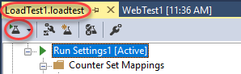

3.  When the final load test is complete, click the **Create Excel
    Report** button from the toolbar to load **Excel**.

    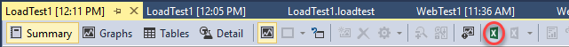

4.  Click **Next**.

    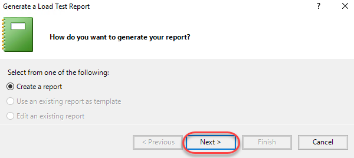

5.  Select **Trend** and click **Next**.

    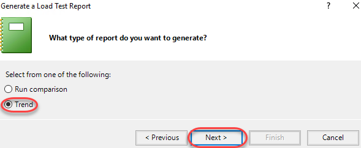

6.  Set the **Report Name** to **“LoadTestTrend”** and click **Next**.

    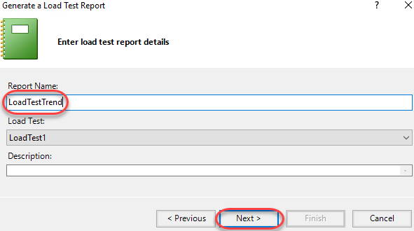

7.  Select all available runs.

    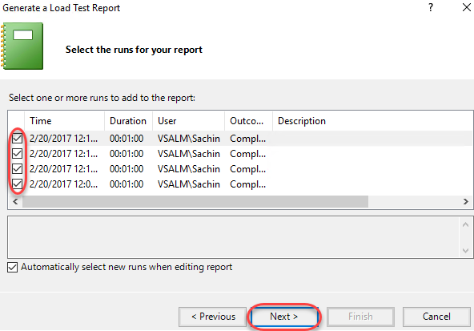

8.  Keep the default performance counters selected and click **Finish**.

    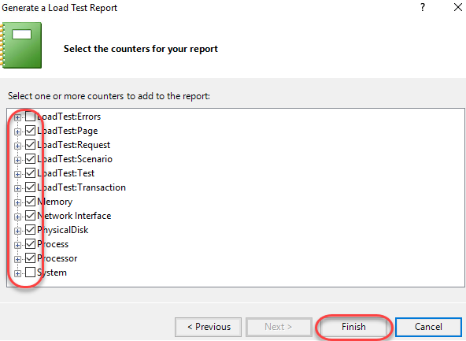

9.  Excel will now generate a thorough report based on the results from
    the various test runs.

    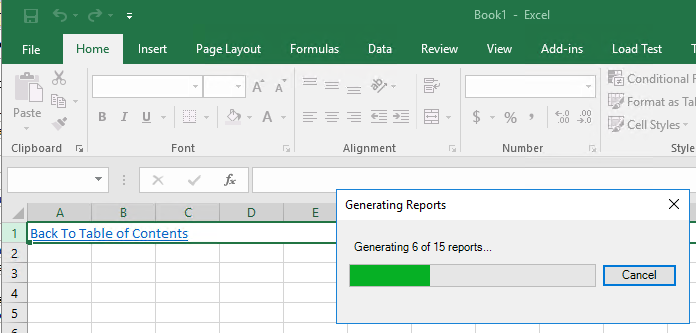

10. Click **Avg. Page Time** to view those results.

    

11. Your report will vary based on the test results and number of tests.
    However, you can easily see how this would be very useful when
    analyzing how changes in the solution impacted performance. You
    would very easily be able to track a performance regression to a
    time (and build).

    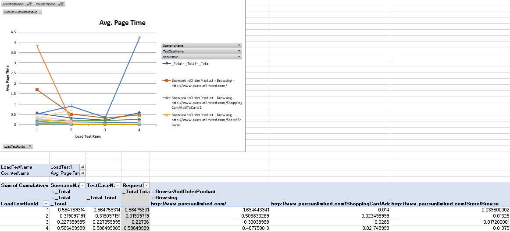

