

## Overview

In this lab, you will be introduced to the [Web performance and Load testing capabilities](https://www.visualstudio.com/en-us/docs/test/performance-testing/getting-started/getting-started-with-performance-testing) provided in Visual Studio Enterprise 2017. You will walk through a scenario using a fictional online storefront where your goal is to model and analyze its performance with a number of simultaneous users. This will involve the definition of web performance tests that represent users browsing and ordering products, the definition of a load test based on the web performance tests, and finally the analysis of the load test results.

## Prerequisites

In order to complete this lab you will need the Visual Studio 2017 virtual machine provided by Microsoft. Click the button below to launch the virtual machine on the Microsoft Hands-on-Labs portal.

<a href="https://www.microsoft.com/handsonlabs/SelfPacedLabs?storyId=external%3A%2F%2Fcontent-private%2Fcontent%2Fexternal%2FMicrosoft-Virtual-Labs%2FDT00177" class="launch-hol" role="button" target="_blank">Launch the virtual machine</a>

Alternatively, you can download the virtual machine from [here](../almvmdownload/)

## Exercise 1: Web Application Load and Performance Testing with Visual Studio 2017

### Task 1: Recording web tests

1. Log in as **Sachin Raj (VSALM\Sachin)**. All user passwords are **P2ssw0rd**.

1. Launch **Visual Studio 2017** from the taskbar.

1. Open the **PartsUnlimited** solution from the **Start Page**.

    

1. In **Solution Explorer**, right-click the solution node and select **Add \| New Project**.

    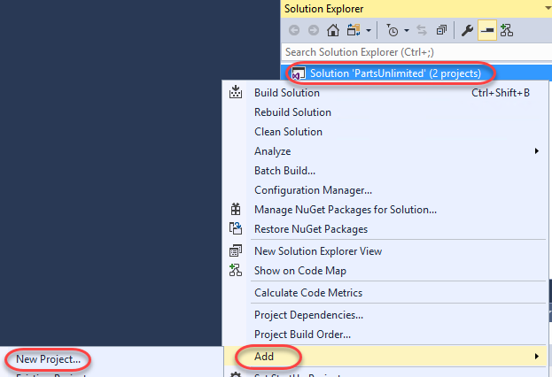

1. Select the **Visual C# \| Test** category and the **Web Performance and Load Test Project** template. Enter a **Name** of **"PULWebTest"** and click **OK**.

    

1. Once the project has been created, the default (and empty) **WebTest1.webtest** file will be opened. Click the **Add Recording** button to begin a recording session.

    

1. In the browser, click the **Parts Unlimited** shortcut to load the main site. Note that each navigation you perform will be recorded so that it can be played back later as part of an automated test.

    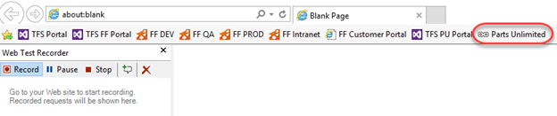

1. Click the **Lighting** tab.

    

1. Click the **Bugeye Headlights** product.

    

1. Continue browsing the site to generate more traffic, if desired. However, do not log in or add anything to your cart. When ready to move on, click **Stop** in the **Web Test Recorder**.

    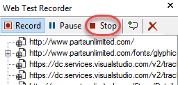

1. After stopping the recording session, Visual Studio will analyze the recorded traffic to attempt to identify dynamic parameters that can be abstracted for dynamic configuration later on.

    

1. An initial test will also be run. Since the browsing was basic, it should easily pass. Double-click the successful run to load its details.

    

1. Select different requests throughout the test run to see details on how it performed, how large the payloads were, and so on. You can also dig into the specific HTTP requests and responses.

    

1. Close the test results.

### Task 2: Working with web tests

1. From **Solution Explorer**, open **WebTest1.webtest** if it's not already open.

    

1. Locate the step that navigates to **/Store/Browse** and expand **QueryString Parameters**. Note that the parameters have been extracted so that you can easily swap in different values to test with other values.

    

1. In **Solution Explorer**, rename **WebTest1.webtest** to **Browsing.webtest**.

    

1. In **Browsing.webtest**, click the **Set Request Details** button.

    

1. This dialog enables you to configure the **Think Time** to use for each step. **Think Time** simulates the time an end user would stop to read the current page, think about their next action, etc. Here you can manually set how much time to use for each step, as well as to set goals for response time on each navigation. Click **Cancel**.

   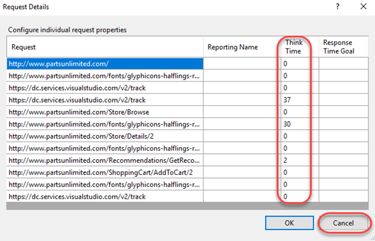

### Task 3: Recording sophisticated tests

1. Now let's add a more sophisticated test that involves completing a purchase. In **Solution Explorer**, right-click the **PULWebTest** project and select **Add \| Web Performance Test**.

    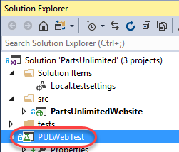

1. Navigate to the Parts Unlimited site via the browser shortcut.

    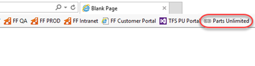

1. Click **Log in**.

    

1. Enter the email **admin@test.com** and password **P@ssw0rd**. Click **Login**.

    

1. Click the **Batteries** tab.

    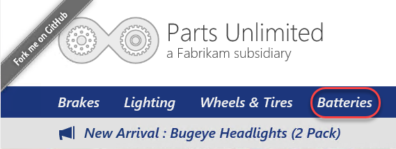

1. Click the **12-Volt Calcium Battery**.

    

1. Click **Add to Cart**.

    

1. Click **Checkout**.

    

1. Enter shipping information (details are not important) and be sure to use the Promo Code **FREE**. Click **Submit Order**.

    

1. On the checkout page, click **view your order** to review the order details.

    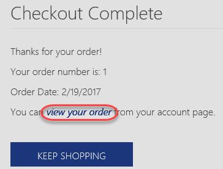

1. The details should all match what you entered earlier.

    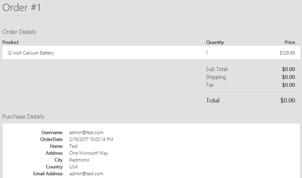

1. Click **Stop** in the **Web Test Recorder** to continue.

    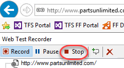

1. In **Solution Explorer**, rename **WebTest1.webtest** to **Buying.webtest**.

   

### Task 4: Viewing web test result details

1. As before, Visual Studio will process the recorded steps and then attempt to execute the test. However, note that it failed this time. Double-click the failed test run to view it.

    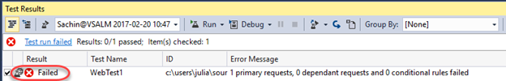

1. Locate the failed step click it. It should be the redirect that occurs immediately after the order is submitted. Click the **Details** tab to confirm.

    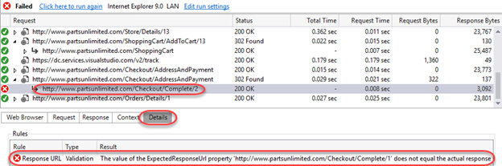

1. This failure makes sense. In our original test, we checked out and received an order number embedded in the redirect URL. However, since the next test run would presumably result in a different order number, the redirect received would have a different URL from the one expected. Right-click the failed step and select **Go to Web Test** to review that step in the process.

    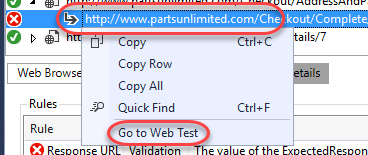

1. Depending on your test goals, you might want to have the test to dynamically accept the order number returned and track it throughout the remainder of the test. However, for the purposes of this lab we will simply delete that step to avoid the failure. Right-click the step and select **Delete**.

    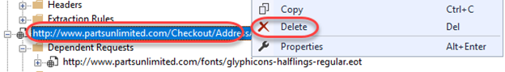

1. Click the **Run Test** button again to confirm the test passes now.

    

1. The test should pass as expected.

    

1. Return to **Buying.webtest** and click the **Set Request Details** button.

    

1. Since we're going to use this test as part of a load testing run, let's update the **Think Time** columns with some realistic numbers. Try to have the whole run use around 30 seconds of total think time. For example, you may want the obvious navigations to each have 5 seconds of think time while all the other requests have 0. Click **OK** when done.

   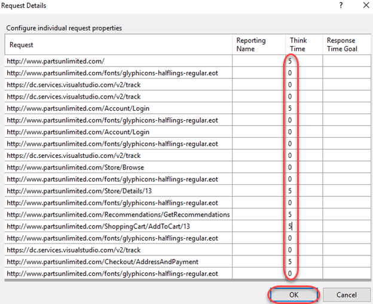

### Task 5: Adding a load test

1. Now that we have two tests that cover common scenarios, let's use them as part of a load test to see how the system might perform with a variety of simultaneous users. In **Solution Explorer**, right-click the **PULWebTest** project and select **Add \| Load Test**.

    

1. There are two options for load testing: **cloud-based** and **on-premises**. The cloud-based load testing hosted by **Visual Studio Test Services** offers a massively scalable environment to truly stress test your system. However, in this scenario we're going to select **On-premise Load Test** to contain testing entirely within the VM. Click **Next**.

    

1. The **Run Settings** enable you to indicate whether you'd like to run the test for a specified duration or if you'd like to run for a certain number of iterations. In this scenario, select **Load test duration** and set the **Run duration** to **1** minute. You can also configure a variety of details for testing, such as the **Sampling rate** for collecting data. Keep this at **15** seconds. Click **Next**.

    

1. Enter the name **"BrowseAndOrderProduct"** and click **Next**. Note that you could optionally configure how think times are applied. Although we entered explicit think times earlier, we can use the default option to add a degree of randomness (normally distributed based on the recorded times) so that each set of requests isn't exactly the same. Click **Next**.

    

1. We'll keep things simple by have a **Constant Load** of **5** users. However, there are scenarios where you might prefer to have the users scale up over the course of the test to simulate growing traffic. Click **Next**.

    

1. Since the users will vary across tests, you can select an algorithm for modeling how they vary. For example, if they are **Based on the total number of tests**, this allows you to specify the percentages that each test will be run. This is particularly useful when dealing with a scenario where you find that 1 out of every 4 users who browse the site end up buying something. In that case, you would want a mix of 75% "browsers" and 25% "browse & buyers". Click **Next**.

    

1. Click **Add** to select tests to add to the mix.

    

1. Select the **Browsing** and **Buying** tests and add them to the mix. Click **OK**.

    

1. Set the relative percentages to **75** and **25**. Click **Next**.

    

1. As with the tests, you can configure the network type mix to use when testing. Select **LAN** for all and click **Next**.

    

1. As with network types, you can also specify the mix of browsers. Select **Internet Explorer 9.0** for all and click **Next**.

    

1. As part of the load testing you can collect performance counters. Click **Add Computer** to add a computer to the test.

    

1. Set the name of the computer to **ALMVM** (this VM) and check **ASP.NET** and **SQL**. Click **Finish**.

    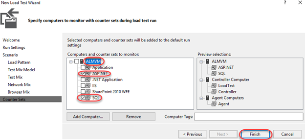

1. In **Solution Explorer**, double-click **Local.testsettings** under **Solution Items** to open it.

    

1. The **General** tab provides a place for you to update basic info about the test, such as whether it should be run locally or in VSTS.

    

1. Select the **Data and Diagnostics** tab to view the available adapters. Options include those for **ASP.NET**, **Event Log**, **IntelliTrace**, **Network Emulation**, and more. No adapters are selected by default because many of them have a significant impact on the machines under test and can generate a large amount of data to be stored over the course of long load tests.

   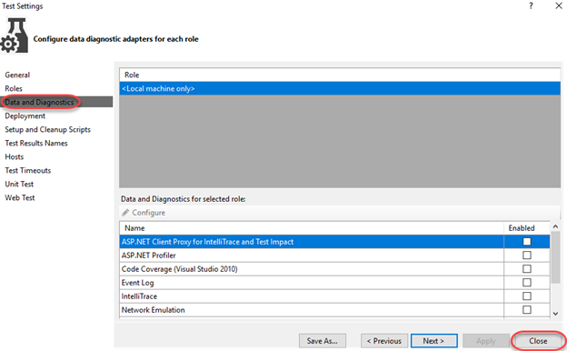

### Task 6: Configuring the test controller

1. **LoadTest1.loadtest** should already be open. Click the **Manage Test Controllers** button.

    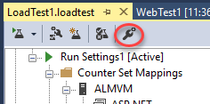

1. No connection string will be set yet, so click the **Browse** button to specify one.

    

1. The default settings are fine, so click **OK** to save.

    

1. Press **Esc** to close the **Manage Test Controller** dialog.

### Task 7: Executing, monitoring, and reviewing load tests

1. Click the **Run Load Test** button to begin a load test.

    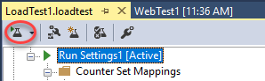

1. The test will run for one minute, as configured. By default, you should see four panels showing some key statistics, with some key performance counters listed below that. Data is sampled every 15 seconds based on our configuration from earlier.

    

1. After the load test run finishes, it will automatically switch to the **Summary** view. The **Summary** view shows overall aggregate values and other key information about the test. Note that the hyperlinks to specific pages open up even more details in the **Tables** view.

    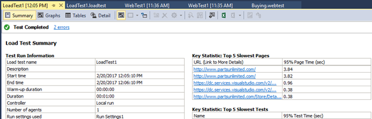

1. Select the **Graphs** view and change the layout to use **Two Horizontal Panels**. The views are very flexible.

    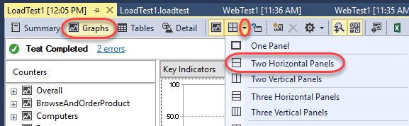

1. By default, the top graph will show **Key Indicators** and the bottom graph will show **Page Response Time**. These are two very important sets of data for any web application.

    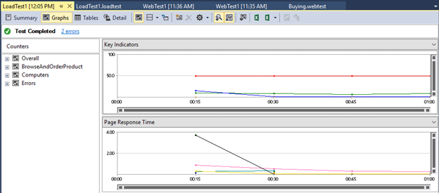

1. Click one of the **Key Indicator** graph lines or data points and select it. This will also highlight the counter that it is associated with the below graphs. The red line from the screenshot below represents the **User Load** at different points during the load test.

    

1. Click the **Pages/Sec** row from the **Key Indicators** section of the counter grid to highlight it in the graph. In the screenshot shown below we can see that the average number of pages per second over the duration of the test was **1.18** (this may vary for you).

   

### Task 8: Generating and viewing load test trend reports

1. Even though the initial load test may result in some numbers that don't seem to provide a wealth of information it does provide a good baseline and allow us to make relative measures between test runs to help measure performance impacts of code changes. For example, if we had seen a relatively high level of batch requests per second during our initial load tests, perhaps that could be addressed by adding in some additional caching, and then re-testing to make sure that the request per second goes down.

1. Return to **LoadTest1.loadtest** and click the **Run Load Test** button to run the load test again. Now there will be at least two test results to work with so that we can see how to perform some trend analysis. Feel free to run it a few times if you'd like lots of trend data.

    

1. When the final load test is complete, click the **Create Excel Report** button from the toolbar to load **Excel**.

    

1. Click **Next**.

    

1. Select **Trend** and click **Next**.

    

1. Set the **Report Name** to **"LoadTestTrend"** and click **Next**.

    

1. Select all available runs.

    

1. Keep the default performance counters selected and click **Finish**.

    

1. Excel will now generate a thorough report based on the results from the various test runs.

    

1. Click **Avg. Page Time** to view those results.

    

1. Your report will vary based on the test results and number of tests. However, you can easily see how this would be very useful when analyzing how changes in the solution impacted performance. You would very easily be able to track a performance regression to a time (and build).

    
