

## Overview

In this lab, you will learn how to use Microsoft Team Foundation Server 2018 to manage your project's testing lifecycle. This project will guide you through creating test plans designed efficiently validate your software milestones. You will also create and execute manual tests that can be consistently reproduced over the course of each release.

## Prerequisites

In order to complete this lab you will need the Visual Studio 2017 virtual machine provided by Microsoft. Click the button below to launch the virtual machine on the Microsoft Hands-on-Labs portal.

<a href="https://labondemand.com/AuthenticatedLaunch/38315?providerId=4" class="launch-hol" role="button" target="_blank">Launch the virtual machine</a>

Alternatively, you can download the virtual machine from [here](../almvmdownload/)

## About the Parts Unlimited Scenario

This set of hands-on-labs uses a fictional company, Parts Unlimited, as a backdrop to the scenarios you are learning about. Parts Unlimited sells automotive products. They are growing rapidly and have embraced Windows Azure to scale their customer-facing web site directly to end-users to allow them to manage their catalog and inventory.

In this set of hands-on labs, you will take part in a number of scenarios that involve the development and testing team at Parts Unlimited. The team, which consists of 8-10 people has decided to use Visual Studio application lifecycle management tools to manage their source code, run their builds, test their web sites, and plan and track the project.

## Exercise 1: Managing Test Plans, Suites, and Cases

In this exercise, you will learn how to create and manage test plans, test suites, and test cases.

### Task 1: Understanding Test Plans, Suites, and Cases

1. Log in as **Sachin Raj (VSALM\Sachin)**. All user passwords are **P2ssw0rd**.

1. Launch **Internet Explorer** from the taskbar. It should bring you to [http://vsalm:8080/tfs](http://vsalm:8080/tfs).

1. Use the top navigation dropdown to select the **PartsUnlimited** project.

    

1. Select **Test** to open the **Test Hub**. The test hub provides a central place for all test planning, execution, and analysis.

    

1. In general, every major milestone in a project should have its own **test plan**. Within each test plan are **test suites**, which are collections of **test cases** (and optionally other test suites) designed to validate a work item, such as a feature implementation or bug fix. Each test case is designed to confirm a specific behavior and may belong to one or more test suites. The Parts Unlimited project has multiple milestones (v1.0, v2.0, and v2.1), and each has its own test plan. Confirm the test plan for the current milestone (**v2.1**) is selected.

    

1. Expand the **Regression tests** suite and select the suite of tests for the bug **New products do not show up on site**. This suite of tests focuses on that work item, which happens to be a bug.

    

1. On the right side you can see that this test suite has two test cases designed to confirm expected behavior of the bug fix. Double-click the **Administrator can create product** test case.

    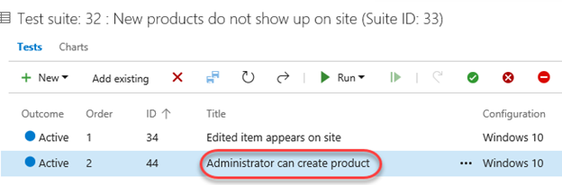

1. This dialog provides all the info you need on this test case. Locate the **Related Work** panel and note that this test case is linked two other work items. The first (red) is a bug and the second (blue) is a user story. Click the user story to view it.

    

1. In the user story view, note that both the bug and test case are linked in the **Related Work** panel. Press **Esc** to close the user story and return to the test case.

    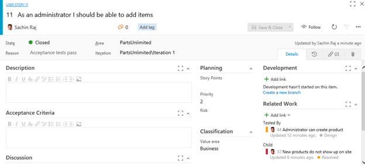

1. Back in the test case dialog, click the related bug to view it.

    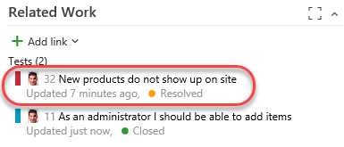

1. As expected, the user story is present in the **Related Work** section. It really is easy to navigate through any kind of work item and asset to understand the relationships and dependencies present in a given project. You can also see that there are two separate test cases in use to verify the behavior of this bug, which are the test cases we saw in the panel earlier. Press **Esc** to close the bug. Press **Esc** again to close the test case and return to the test suite view.

    

### Task 2: Managing Tests

1. Sometimes a set of test cases should be run in a specific order to maximize efficiency. Click **Order tests** to specify the order these test cases should be run.

    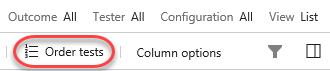

1. The two test cases here are designed to test for a regression against a bug fixed earlier. In that bug, items that were added or edited were no longer visible on the site. While both of these test cases could be run separately to confirm the behavior, it probably makes more sense to run the test case that creates a new item first so that the second case (which involves editing an existing item) can just use that item again. This may not be the right approach for other scenarios, but we'll use it for this lab. Drag and drop the second test case above the first and click **Done**.

    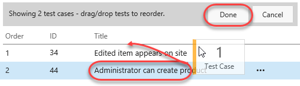

1. You can now see that the **Order** has been updated and that the list is now sorted by it.

    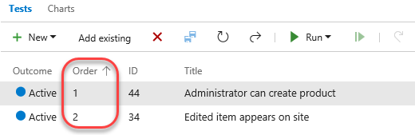

1. Another significant aspect of testing has to do with the environment each test is run in. For this web app, the browser and operating system are key considerations. Right now all the tests only use one configuration: Windows 10.

    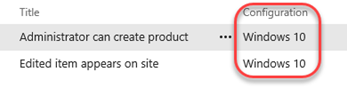

1. Now let's suppose the test team has acquired an iPad Pro and wants to add it into the test matrix. It's really easy to register this environment as a new configuration so that test cases can specify it. Select the **Configurations** tab.

    

1. Note that there are three existing configurations for **Windows 10**, **iPhone 7**, and **Android 4**. Each test configuration includes a name and a description, as well as a set of customizable **Configuration variables**. This project has two configuration variables for **Browser** and **Operating System**. You can easily add more and/or edit the available entries for each. However, since these variables fit for our iPad Pro scenario, we can just use them as-is. Click the **Add** dropdown and select **New test configuration**.

    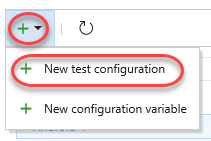

1. Set the **Name** to **"iPad Pro"**.

    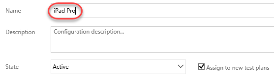

1. Click **Add configuration variable** twice and set the **Browser** to **Safari** and **Operating System** to **iOS 10**.

    

1. Click **Save** to save the new configuration.

    

1. Return to the **Test Plans** tab.

    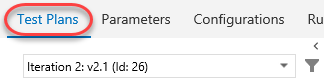

1. Click the dropdown next to the test suite we've been working with so far and select **Assign configurations to test suite**.

    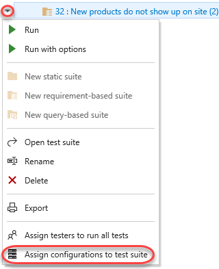

1. Check the **iPad Pro** option and click **Save**.

    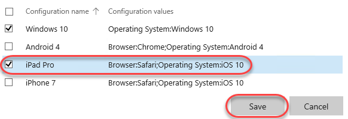

1. Notice that each test case has been duplicated with an additional configuration for **iPad Pro**. Now each environment can be tested and tracked separately.

    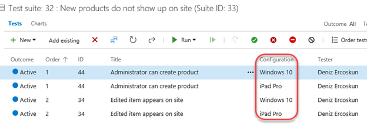

### Task 3: Authoring Tests

1. Expand the dropdown next to the **v2.1** test plan and select **New static suite.** A **static suite** of test cases is a suite where the cases have been manually assigned. You can also create suites based on common requirements (**requirement-based suite**) or a query of test cases and/or work items (**query-based suite**).

    

1. Set the name of the new suite to **"Authentication tests"**. These tests will all focus on functionality related to user authentication. Remember that you can easily share test cases across suites, so there's minimal redundancy when having a lot of overlapping suites.

    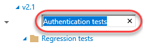

1. Expand the dropdown next to the newly created suite and select **New requirement-based suite**.

    

1. You could customize the query used to specify which requirements are retrieved, but just leave the defaults and click **Run query**. Locate and select the three user stories related to registering, logging in, and logging out. Click **Create suites** to create a test suite for each user story.

    

1. Select the second user story that focuses on users being able to log in.

    

1. While you can create test cases one at a time, it's sometimes easier to use a grid layout to quickly add many test cases. In the test cases panel, select **New \| New test case using grid**.

    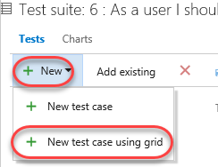

1. Enter a few test cases and click the **Save All** button. The **Title** will be the eventual title of the test case. **Step Action** will be the first (and possibly only) step of the test. If that step has an expected result, you can specify it as **Step Expected Result**.

    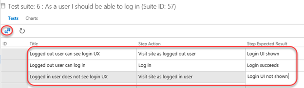

1. You can optionally continue to add and edit work items in the grid view. When satisfied, return back to the list view by clicking the **View: Grid** toggle.

    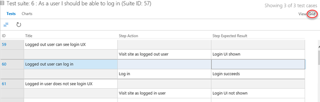

1. The list view shows the same data, but in a different view.

    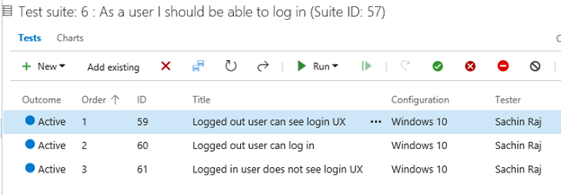

1. Another option to create suites is via work item query. Expand the dropdown next to the **Authentication tests** suite and select **new query-based suite**.

    

1. Let's say you wanted to create a set of test suites based on bugs in the Web site area of the project. Change the **Work Item Type** to **Microsoft.BugCategory** (to search bugs) and change the **Area Path** to **PartsUnlimited\Web site**. Click **Run query**. You now have a list of bugs that you can select to create suites from, if you choose.

    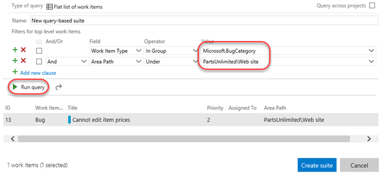

1. Press **Esc** to close the dialog.

## Exercise 2: Authoring, Running, and Analyzing Manual Tests

In this exercise, you will learn how to create a manual test plan and populate it with steps. The plan can later be run to confirm the expected behavior of your software. In this lab, we're going to focus on creating a new manual test case and running it.

### Task 1: Installing the Test & Feedback Extension

1. Install **Google Chrome** from [http://google.com/chrome](http://google.com/chrome). The rest of this exercise will use Chrome as its browser.

1. Navigate to the **Visual Studio Marketplace** at [http://marketplace.visualstudio.com](http://marketplace.visualstudio.com/).

1. Select the **Visual Studio Team Services** tab. Search for "**feedback**" and click the **Test & Feedback** extension.

    

1. Click on **Install** button on the details page.

    

1. Click **Install** for the Chrome extension.

    

1. In the **Chrome Web Store**, click **Add to Chrome**.

    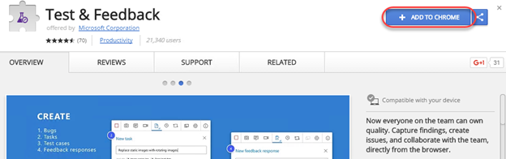

1. Confirm the installation when asked.

    

1. To open the extension, click the extension icon that will appear on the right of the address bar. Select the **Connection Settings** tab. Enter "**vsalm**" as the **Server URL** and click **Next**.

    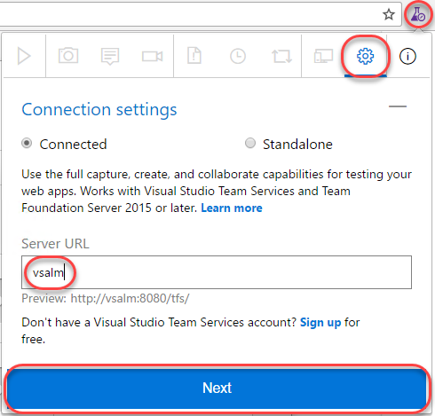

1. The extension can be used in two modes: **Connected** and **Standalone** mode. If you have Team Foundation Server (TFS) connection or a Visual Studio Team Services (VSTS) account, select Connected mode. Standalone mode is for users who don't have TFS (or VSTS account) and want to use the extension to file bugs and share the report with their team.

1. After connecting to TFS, you will need to select the team you want these efforts associated with. Select the **PartsUnlimitedCollection** and select the **PartsUnlimited Team** at the end of the chain. Click **Save** to continue.

    

### Task 2: Authoring a Manual Test Plan

1. In Chrome, navigate to [http://vsalm:8080/tfs](http://vsalm:8080/tfs).

1. From the navigation dropdown, select the **PartsUnlimited** project.

    

1. As before, navigate to the **Test Hub**.

    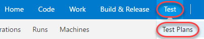

1. Expand the dropdown next to the **v2.1** test plan and select **New static suite**.

    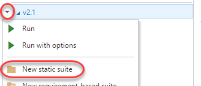

1. Name the new suite **"End-to-end tests"** and press **Enter**.

    

1. From the **Tests** tab, select **New \| New test case** to create a new test case.

    

1. In the **Title** box, type "**Confirm that order number appears after successful order**" as the name of the new test case.

    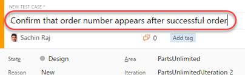

1. At this point, we're ready to add steps to this manual test. Each step includes an **Action**, which describes the action the tester needs to perform. Optionally, a step can include an **Expected Result**, which describes the expected result of the given action. In the **Steps** panel, create a step for each of the following **Actions**, only one of which has an **Expected Result**.

   |Action|Expected Result|
    --- | ---
   |Open http://www.partsunlimited.com||
   |Click Brakes||
   |Click Disk and Pad Combo||
   |Click Add to Cart||
   |Click Checkout||
   |Enter @Email, @Password||
   |Enter @Name, @Phone, @Email, @Address, @City, @State, @PostalCode, @Country, @Promo||
   |Click Submit Order||
   |Confirm order page has order #|Order # should appear on order confirmation page|
   |Log out||
   |Close browser||
   **Note:** If you end up with an extra empty step, delete it.

1. At this point, the **Steps** panel should look similar to the following:

    

1. Note the "Enter @Email, @Password" and "Enter @Name, @Phone, @Email, @Address, @City, @State, @PostalCode, @Country, @Promo" steps. In these steps, we used the **@** sign to indicate that there were iteration-specific variables to be used during the manual test pass. We can define which variables to use by scrolling down to the **Parameter Values** section of this form and entering them for each iteration. Note that you may need to use the scroll bar on the far right side of the test case dialog to view this section.

    

1. Use the following table to set up values for two iterations.

   |Fields|Iteration 1|Iteration 2|
   --- | --- | ---
   |Email|admin@test.com|sachin@test.com|
   |Password|P@ssw0rd|P@ssw0rd|
   |Name|Admin User|Sachin Raj|
   |Phone|425-555-1234|555-555-5555|
   |Address|One Microsoft Way|Two Tailspin Trail|
   |City|Redmond|Springfield|
   |State|WA|IL|
   |PostalCode|98052|11135|
   |Country|USA|USA|
   |Promo|FREE|FREE|

1. The **Parameter Values** section should now look like this. Note that you can enter as many iterations as you need to fully test the breadth of the scenario.

    

1. Click **Save & Close** to save the test case.

    

### Task 3: Running a Manual Test Plan

1. In this task, you will learn how to run the manual test plan that we created earlier. Note that the process for triggering an automated test run follows a similar workflow. You can learn more about that in the [documentation](https://docs.microsoft.com/en-us/vsts/build-release/test/run-automated-tests-from-test-hub).

1. Return to **IE. R**ight-click the test case created earlier and select **Run with options** to begin a manual test run.

    

1. There are a few options that you can use to customize each test run. The first option is to select a **Runner**, which will be the browser in this scenario. Next, you may have the option to specify which kinds of **data to collect**. Finally, you may optionally specify which build is being tested to make it easier to associate the results with the build they were from. Click the **Browse** button to select a build.

    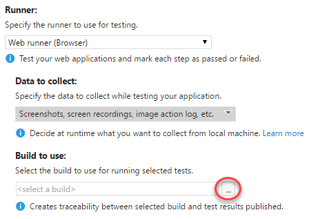

1. Click **Find** to search builds. Using the default settings returns all builds.

    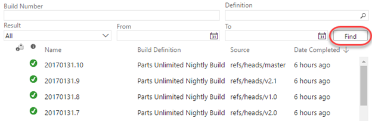

1. Press **Esc** to dismiss the **Find Builds** window without selecting a build.

1. Click **OK** to continue.

    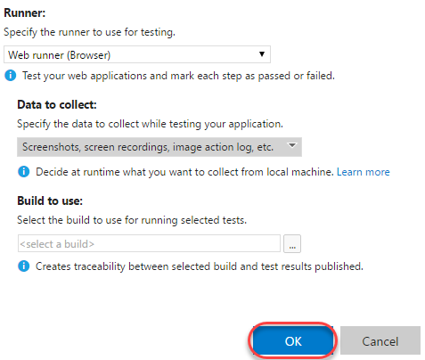

1. If the **Test Runner** window does not appear, check to see if it was blocked by the pop-up blocker. If so, click the **Pop-up blocker** button, select **Always allow pop-ups...**, and then click **Done**. You can then launch the test run again with success.

    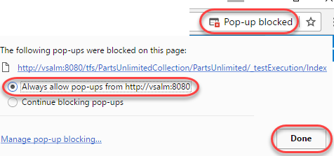

1. In the **Test Runner** window, expand the **Test 1 of 1: Iteration 1** dropdown. Note that there are two iterations: one for each set of parameters specified in the test case. In the first iteration, the [admin@test.com](mailto:admin@test.com) account is used. In the second, [sachin@test.com](mailto:sachin@test.com) will be used.

    

1. The first step in the test is to open [www.partsunlimited.com](http://www.partsunlimited.com/). To do this, open a new window in Chrome. If you're working on a large screen, it may be easier to resize the new window to fit next to the **Test Runner** window. Otherwise you can just switch back and forth.

    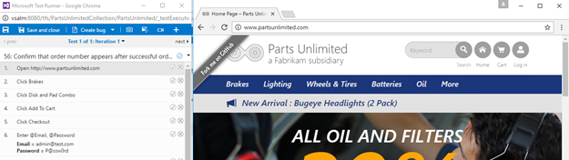

    > **Note:** The [www.partsunlimited.com](http://www.partsunlimited.com/) URL is hardcoded in the hosts file to point at a website on the local VM. As a result, you must use this full domain when testing.

1. Once the site loads, return to the **Test Runner** and click the **Pass test step** button.

    

1. The next step is to click the **Brakes** menu item.

    

1. Then click the **Disk and Pad Combo** product.

    

1. The next step is to click **Add to cart**.

    

1. On the next page, click **Checkout**.

    

1. Log in using the credentials specified in the next step.

    

1. Fill out the shipping information and add the promo code. Click **Submit Order**.

    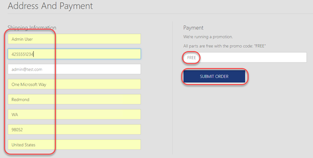

1. Confirm the order number is shown on the confirmation page. Be sure to pass this step as it is the only one with an expected result.

    

1. The last steps are to log out via **Profile \| Log off** and to close the browser window.

    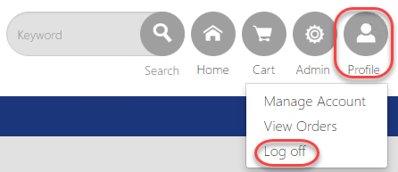

1. Move to the next iteration by clicking **next** in the **Test Runner**. This will load the next set of parameters.

    

1. Follow the test case steps until you reach the login step. This will fail because there isn't a [sachin@test.com](mailto:sachin@test.com) account.

    

1. The **Test Runner** provides three valuable ways to record media from a test run. The first option is to take screenshots. The second is to capture each user action in an image action log. The final is to record the screen as a video. Select the failed step and click the first option to take a screenshot. From the dropdown, select the **Log in** window the tests are being run in.

    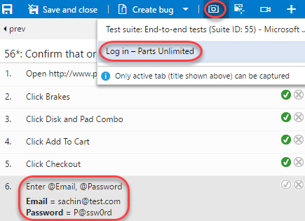

1. Crop the screen down to show the login form and error message. Specify the name **"No Sachin account"** and click the **Confirm** button.

    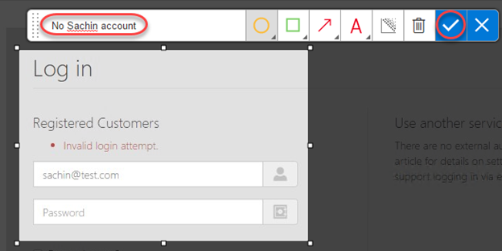

1. Right-click the failed step and select **Add comment**.

    

1. Enter a comment of **"Sachin account does not exist"** and fail the test using the **Fail test step** button.

    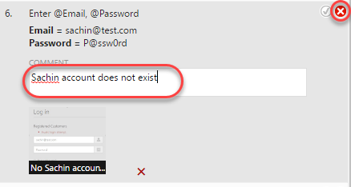

1. Click **Create bug** to log a new bug.

    

1. Enter the bug title of **"Sachin test account does not exist"** and click **Save & Close** to log the bug.

    

1. Since the test cannot be completed due to a bug not directly related to the functionality being tested, expand the **Mark test case result** dropdown and select **Block test**. Click **Save and close** to save the test run.

    

1. Close the test browser windows.

### Task 4: Analyzing Manual Test Results

1. In this task, you will learn how to review the results of a manual test run.

1. Return to the browser window hosting the **Test Hub**. Select the **Runs** tab and double-click the most recent test run to open it.

    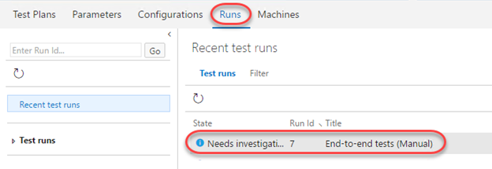

1. The **Run summary** tab provides an overview of the test run, as well as high-level details on the results of all tests included as part of the run.

    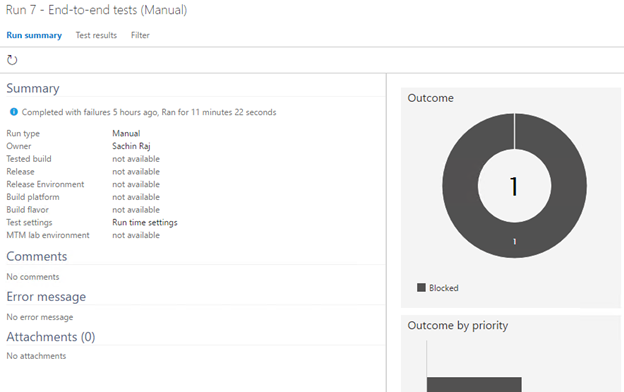

1. Select the **Test results** tab. This tab lists the results of each individual test case included in the run along with their results. Since there was only one test case included here, double-click it to open.

    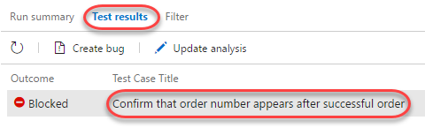

1. You can review all details for this particular test case run from here.

    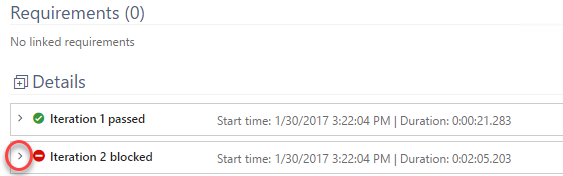

1. Scroll to the bottom to locate the iterations. Expand the second iteration.

    

1. Review the results of each step in this iteration, as well as the failed login step, which shows the screenshot attached during the test run.

    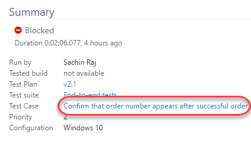

### Task 5: Creating Shared Steps

1. In this task, you will learn how to create shared steps. A shared step combines multiple steps that are commonly performed in sequence into a single logical step, which can be shared across tests. If the process defined by the shared steps ever changes in the future, you can update the shared step in one place and it will be reflected in all tests that reference it.

1. Click the test case link in the **Summary** section.

    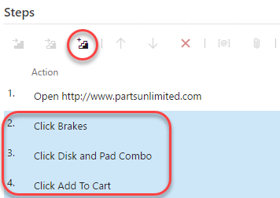

1. Double-click the case to open it in the test case editor.

    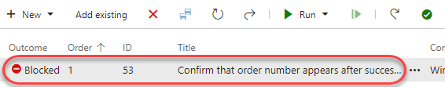

1. Select steps 2-4 (use **Shift+Click**) and click the **Create shared steps** button.

    

1. Set the name of these shared steps to **"Add Disk and Pad Combo to cart"** and click **Create**.

    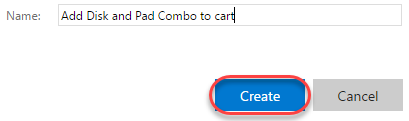

1. Now you can see the previous steps replaced with the shared steps. Double-click the shared steps to open.

    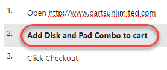

1. If necessary, you can revisit these steps later on to update them for new requirements.

    

1. Press **Esc** to close the **Shared Steps** dialog.

1. Click **Save & Close** to save the test case.

    
