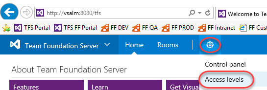
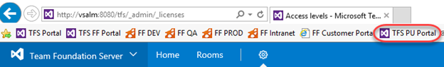
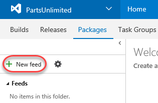
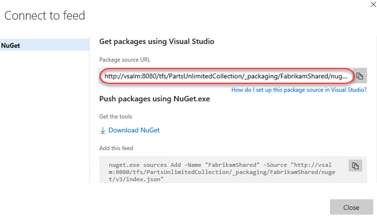
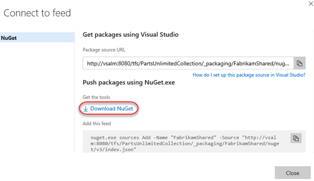
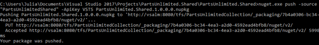
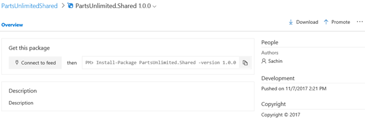
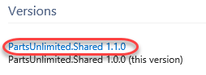
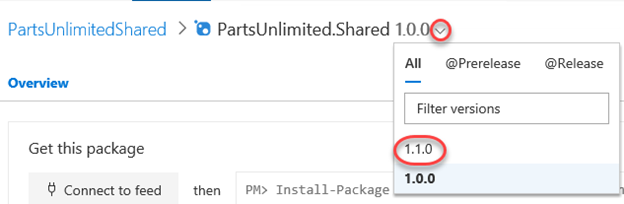

<div class="rw-ui-container"></div>

# Overview

Package Management is an extension that makes it easy to discover, install, and publish NuGet, npm, and Maven packages in Team Foundation Server. It's deeply integrated with other hubs like Build so that package management can become a seamless part of your existing workflows.

## Prerequisites

In order to complete this lab you will need the Visual Studio 2017 virtual machine provided by Microsoft. Click the button below to launch the virtual machine on the Microsoft Hands-on-Labs portal.

<a href="https://labondemand.com/AuthenticatedLaunch/38313?providerId=4" class="launch-hol" role="button" target="_blank"><span class="lab-details">Launch the virtual machine</span></a>

Alternatively, you can download the virtual machine from [here](../almvmdownload/)

## Exercise 1: Working with the package management service

### Task 1: Configuring the service

1. Log in as **Sachin Raj (VSALM\Sachin)**. All user passwords are **P2ssw0rd**.

1. Launch **Internet Explorer** from the taskbar.

1. From the **Settings Gear** menu, select **Server settings**.

    

1. Select the **Access levels** tab.

    

1. The **Package Management** service comes with Team Foundation Server. It is licensed per-user, although Visual Studio Enterprise licenses include access. In this case, our demo users are all licensed with Visual Studio Enterprise, although they are not yet assigned that access level. We will start that process now by selecting the **VS Enterprise** tab.

    

1. Click **Add**.

    

1. Add **Sachin Raj** as a licensed user and click **Save changes**.

    

1. Now that Sachin (the current user) is licensed, the package management functionality will appear in his TFS experience. Click the **TFS PU Portal** shortcut to navigate to the **PartsUnlimited** project.

    

1. From the **Build & Release** menu, select **Packages**. This option is new now that Sachin is licensed to use package management.

    

1. There are no feeds by default.

### Task 2: Creating and connecting to a feed

1. Click **New feed**. This feed will be a collection of NuGet packages available to users within the organization and will sit alongside the public NuGet feed as a peer. The scenario in this lab will focus on the workflow for using with the package management service, so the actual architectural and development decisions are purely illustrative.

    

1. This feed will include common functionality that can be shared across projects in this organization. Set the name to **"PartsUnlimitedShared"** and click **Create**. Leave the default security options.

    

1. Any user who wants to connect to this NuGet feed must configure their environment. Click **Connect to feed**.

    

1. Copy the **Package source URL**. This is the only thing Visual Studio and NuGet need to start taking advantage of the new feed. Leave the dialog open in the browser.

    

1. Launch **Visual Studio** from the taskbar.

1. Select **Tools \| NuGet Package Manager \| Package Manager Settings**.

1. Locate the **Package Sources** section and click the **Add** button to add a new package source.

    

1. Set the **Name** to **"PartsUnlimitedShared"** and paste the **Source** URL copied earlier. Click **Update** followed by **OK**. Visual Studio is now connected to the new feed.

    

### Task 3: Creating and publishing a NuGet package

1. From the main menu of **Visual Studio**, select **File \| New \| Project**. We will now create a shared assembly that will be published as a NuGet package so that other teams can integrate it and stay up to date without having to work directly with the project source.

1. From the **Visual C#** section, select the **Class Library** template and set the **Name** to **"PartsUnlimited.Shared"**. Click **OK** to create the project.

    

1. In **Solution Explorer**, delete **Class1.cs**.

    

1. Right-click the project node and select **Properties**.

    

1. Set the **Target framework** to **.NET Framework 4.5.1** and click **Yes** to confirm the change.

    

1. Press **Ctrl+Shift+B** to build the project. In the next task we'll use **NuGet.exe** to generate a NuGet package directly from the built project, but it requires the project to be built first.

1. Return to the browser and click **Download NuGet**. Save it to the desktop folder for convenience.

    

1. Return to **Visual Studio**. From **Solution Explorer**, right-click the **PartsUnlimited.Shared** project node and select **Open Folder in File Explorer**.

    

1. Move the downloaded **nuget.exe** into this folder so that it's a peer to the **.csproj** file.

    

1. In the same **Windows Explorer** window, select **File \| Open command prompt**.

    

1. Execute the line below to create a **.nupkg** file from the project. Note that this is a quick shortcut to package the NuGet bits together for deployment. NuGet is very customizable and offers a lot of great flexibility for providing detailed information for consumers. You can learn more over on the [NuGet package creation page](https://docs.microsoft.com/en-us/nuget/create-packages/overview-and-workflowhttps:/docs.microsoft.com/en-us/nuget/create-packages/overview-and-workflow).

    ```cmd
    nuget.exe pack PartsUnlimited.Shared.csproj
    ```
1. NuGet builds a minimal package based on the information it is able to pull from the project. For example, note that the name is **PartsUnlimited.Shared.1.0.0.nupkg**. That version number was pulled from the assembly.

    

1. Return to **Visual Studio**. From **Solution Explorer**, open **Properties\AssemblyInfo.cs**.

    

1. The **AssemblyVersion** attribute specifies the version number to build into the assembly. Each NuGet release requires a unique version number, so if we continue to use this method for creating packages, we will need to remember to increment this before building.

    

1. Return to the **command prompt** and execute the following command (it should be on one line). Note that you need to provide an "API Key", which can be any non-empty string. We're using **"VSTS"** here.

    ```cmd
    nuget.exe push -source "PartsUnlimitedShared" -ApiKey VSTS PartsUnlimited.Shared.1.0.0.nupkg
    ```
1. The command should succeed after a few seconds.

    

1. Return to the browser window open to TFS and **refresh** the window. You should now see the organization's NuGet package is published in the feed. Click it to view the details.

    

1. The details have been imported and are now ready for others to consume.

    

### Task 4: Importing a NuGet package

1. Open a new instance of **Visual Studio** from the taskbar. We will now add a reference to the **PartsUnlimited.Shared** NuGet package to an existing project.

1. From the **Start Page**, open **PartsUnlimited.sln**. This is the primary project for the PartsUnlimited team.

    

1. In **Solution Explorer**, right-click the **References** node under the **PartsUnlimitedWebsite** project and select **Manage NuGet Packages**.

    

1. Click the **Browse** tab and change the **Package source** to **PartsUnlimitedShared**. The only package will be the one we just added, so click **Install** to add it to the project.

    

1. Confirm the add by clicking **OK**.

    

1. Press **Ctrl+Shift+B** to build the project. It should succeed. The NuGet package doesn't add any value yet, but at least we know it's there.

### Task 5: Updating a NuGet package

1. Switch to the instance of **Visual Studio** that has the **PartsUnlimited.Shared** project open (the NuGet source project).

1. In **Solution Explorer**, right-click the **PartsUnlimited.Shared** project node and select **Add \| New Item**.

    

1. Select the **Class** template and enter the **Name "TaxService.cs"**. Click **Add** to add the class. We can pretend that tax calculation will be consolidated into this shared class and managed centrally so that other teams can simply work with the NuGet package.

    

1. Replace the code in the new file with the code below. For now it will just hardcode a 10% rate.

    ```c#
    namespace PartsUnlimited.Shared
    {
        public class TaxService
        {
            static public decimal CalculateTax(decimal taxable, string postalCode)
            {
                return taxable * (decimal).1;
            }
        }
    }
    ```
1. Since we're updating the assembly (and package), return to **AssemblyInfo.cs** and update the **AssemblyVersion** to **1.1.0.0**.

    

1. Press **Ctrl+Shift+B** to build the project.

1. Return to the **command prompt** and execute the following line to repackage the NuGet package. Note that the new package will have the updated version number.

    ```cmd
    nuget.exe pack PartsUnlimited.Shared.csproj
    ```
1. Execute the following line to publish the updated package. Note that the version number has changed to reflect the new package.

    ```cmd
    nuget.exe push -source "PartsUnlimitedShared" -ApiKey VSTS PartsUnlimited.Shared.1.1.0.nupkg
    ```
1. Return to the browser window open to **TFS** and refresh the page. You will still be looking at the 1.0.0 version of the package, but you can change that by selecting the **1.1.0** version from the dropdown.

    

1. Switch back to the instance of **Visual Studio** open to the main **PartsUnlimited** project (with **PartsUnlimitedWebsite**).

1. From **Solution Explorer**, open **PartsUnlimitedWebsite\Utils\DefaultShippingTaxCalculator.cs**.

    

1. Locate the call to **CalculateTax** around line **20** and add the qualifier **"PartsUnlimited.Shared.TaxService"** to the beginning. The original code called a method internal to this class, so the code we're adding to the beginning of the line is redirecting it to code from our NuGet assembly. However, since this project hasn't updated the NuGet package yet, it's still referencing 1.0.0.0 and doesn't have these new changes available, so the code will not build.

    

1. In **Solution Explorer**, right-click the **References** node and select **Manage NuGet Packages**.

    

1. NuGet is aware of our update, so click the **Updates** tab to view the details. Click **Update** to bring down the new version. If the **Updates** tab hasn't yet updated, you can still update the package from the **Browse** tab.

    

1. Click **OK** to approve the update.

1. **Press** **F5** to build and run the site. It should work as expected.
