Lab version: 15.0.26020.0

Last updated: 2/24/2017


## Overview

Package Management is an extension that makes it easy to discover,
install, and publish NuGet and npm packages in Team Foundation Server.
It's deeply integrated with other hubs like Build so that package
management can become a seamless part of your existing workflows.

## Pre-requisites

In order to complete this lab you will need the Visual Studio 2017
virtual machine provided by Microsoft. For more information on acquiring
and using this virtual machine, please see [this blog
post](http://aka.ms/almvm).

## Exercise 1: Working with the package management service


### Task 1: Configuring the service


1.  Log in as **Sachin Raj (VSALM\\Sachin)**. All user passwords are
    **P2ssw0rd**.

2.  Launch **Internet Explorer** from the taskbar.

3.  From the **Settings Gear** menu, select **Access levels**.

    

4.  The **Package Management** service comes with Team
    Foundation Server. It is licensed per-user, although Visual Studio
    Enterprise licenses include access. In this case, our demo users are
    all licensed with Visual Studio Enterprise, although they are not
    yet assigned that access level. We will start that process now by
    selecting the **VS Enterprise** tab.

    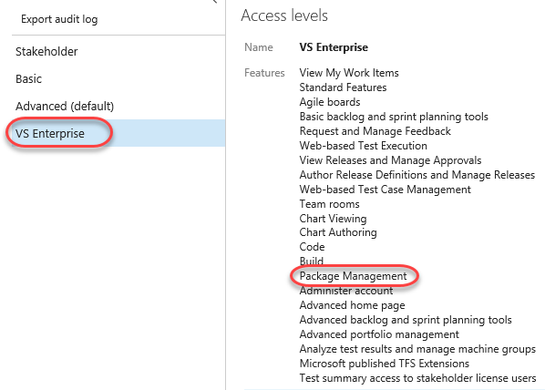

5.  Click **Add**.

    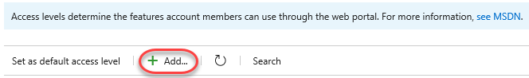

6.  Add **Sachin Raj** as a licensed user and click **Save changes**.

    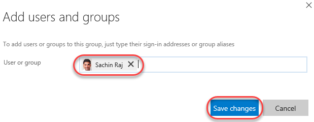

7.  Now that Sachin (the current user) is licensed, the package
    management functionality will appear in his TFS experience. Click
    the **TFS PU Portal** shortcut to navigate to the
    **PartsUnlimited** project.

    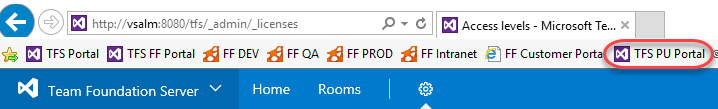

8.  From the **Build & Release** menu, select **Packages**. This option
    is new now that Sachin is licensed to use package management.

    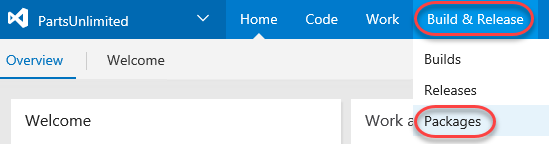

9.  There are no feeds by default.

    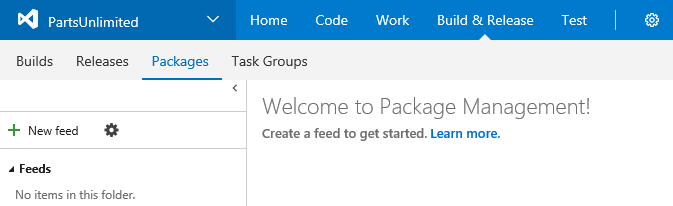

### Task 2: Creating and connecting to a feed


1.  Click **New feed**. This feed will be a collection of NuGet packages
    available to users within the organization and will sit alongside
    the public NuGet feed as a peer. The scenario in this lab will focus
    on the workflow for using with the package management service, so
    the actual architectural and development decisions are
    purely illustrative.

    

2.  This feed will include common functionality that can be shared
    across projects in this organization. Set the name to
    **“PartsUnlimitedShared”** and click **Create**. Leave the default
    security options.

    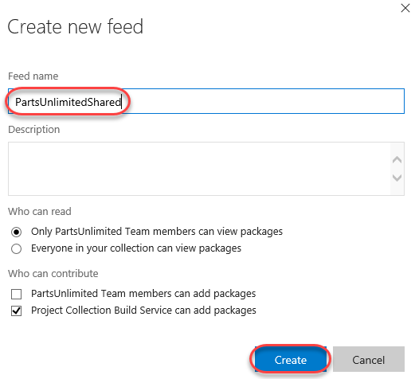

3.  Any user who wants to connect to this NuGet feed must configure
    their environment. Click **Connect to feed**.

    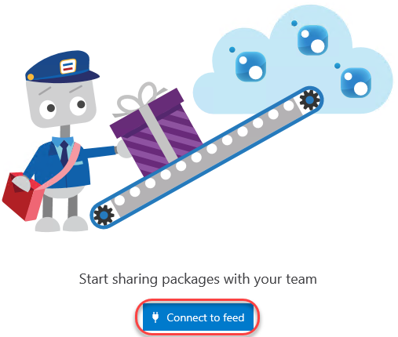

4.  Copy the **Package source URL**. This is the only thing Visual
    Studio and NuGet need to start taking advantage of the new feed.
    Leave the dialog open in the browser.

    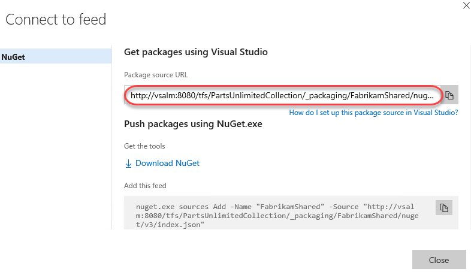

5.  Launch **Visual Studio** from the taskbar.

6.  Select **Tools \| NuGet Package Manager \| Package Manager Settings**.

7.  Locate the **Package Sources** section and click the **Add** button
    to add a new package source.

    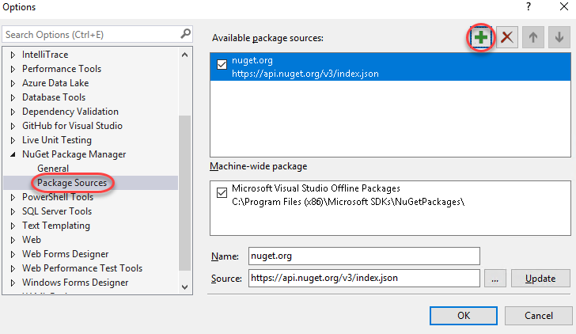

8.  Set the **Name** to **“PartsUnlimitedShared”** and paste the
    **Source** URL copied earlier. Click **Update** followed by **OK**.
    Visual Studio is now connected to the new feed.

    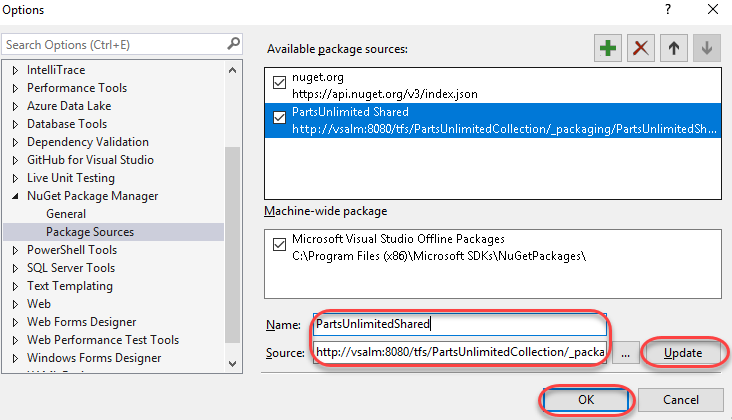

### Task 3: Creating and publishing a NuGet package


1.  From the main menu of **Visual Studio**, select **File | New |
    Project**. We will now create a shared assembly that will be
    published as a NuGet package so that other teams can integrate it
    and stay up to date without having to work directly with the
    project source.

2.  From the **Visual C\#** section, select the **Class Library**
    template and set the **Name** to **“PartsUnlimited.Shared”**. Click
    **OK** to create the project.

    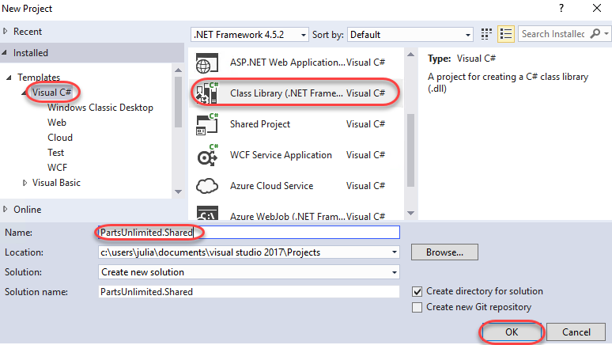

3.  In **Solution Explorer**, delete **Class1.cs**.

    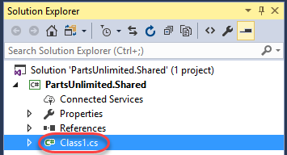

4.  Press **Ctrl+Shift+B** to build the project. In the next task we’ll
    use **NuGet.exe** to generate a NuGet package directly from the
    built project, but it requires the project to be built first.

5.  Return to the browser and click **Download NuGet**. Save it to the
    desktop folder for convenience.

    

6.  Return to **Visual Studio**. From **Solution Explorer**, right-click
    the **PartsUnlimited.Shared** project node and select **Open Folder
    in File Explorer**.

    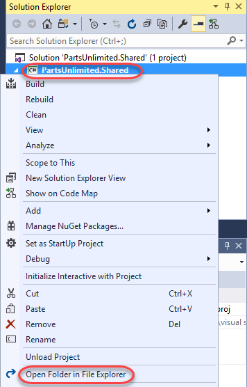

7.  Move the downloaded **nuget.exe** into this folder so that it’s a
    peer to the **.csproj** file.

    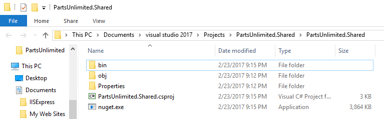

8.  In the same **Windows Explorer** window, select **File | Open
    command prompt**.

    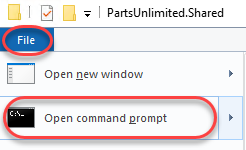

9.  Execute the line below to create a **.nupkg** file from the project.
    Note that this is a quick shortcut to package the NuGet bits
    together for deployment. NuGet is very customizable and offers a lot
    of great flexibility for providing detailed information
    for consumers. You can learn more over on the [NuGet package
    creation
    page](https://docs.microsoft.com/en-us/nuget/create-packages/overview-and-workflowhttps:/docs.microsoft.com/en-us/nuget/create-packages/overview-and-workflow).

    1.  nuget.exe pack PartsUnlimited.Shared.csproj

10. NuGet builds a minimal package based on the information it is able
    to pull from the project. For example, note that the name is
    **PartsUnlimited.Shared.1.0.0.0.nupkg**. That version number was
    pulled from the assembly.

    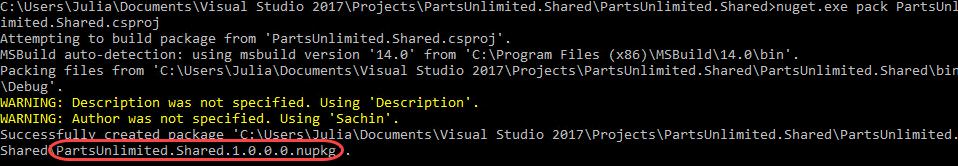

11. Return to **Visual Studio**. From **Solution Explorer**, open
    **Properties\\AssemblyInfo.cs**.

    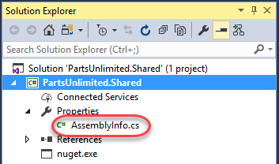

12. The **AssemblyVersion** attribute specifies the version number to
    build into the assembly. Each NuGet release requires a unique
    version number, so if we continue to use this method for creating
    packages, we will need to remember to increment this
    before building.

    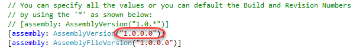

13. Return to the **command prompt** and execute the following command
    (it should be on one line). Note that you need to provide an “API
    Key”, which can be any non-empty string. We’re using
    **“VSTS”** here.

    - nuget.exe push -source "PartsUnlimitedShared" -ApiKey VSTS
        PartsUnlimited.Shared.1.0.0.0.nupkg

14. The command should succeed after a few seconds.

    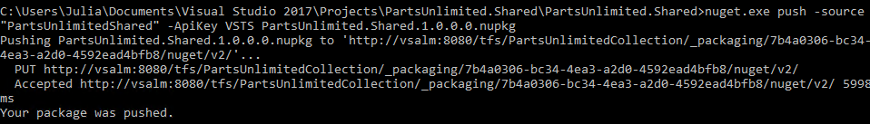

15. Return to the browser window open to TFS and **refresh** the window.
    You should now see the organization’s NuGet package is published in
    the feed.

    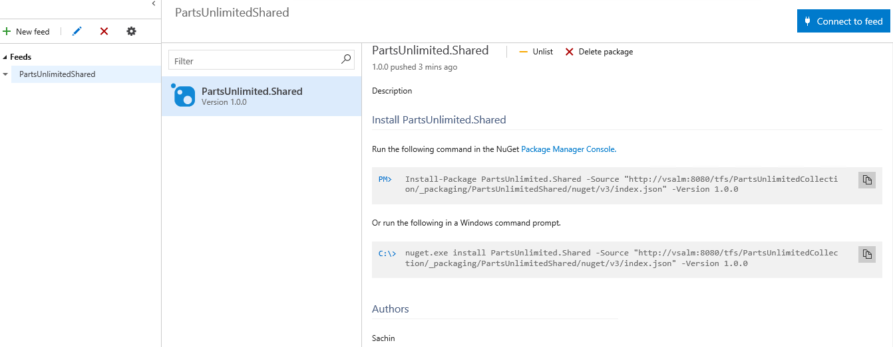

### Task 4: Importing a NuGet package

1.  Open a new instance of **Visual Studio** from the taskbar. We will
    now add a reference to the **PartsUnlimited.Shared** NuGet package
    to an existing project.

2.  From the **Start Page**, open **PartsUnlimited.sln**. This is the
    primary project for the PartsUnlimited team.

    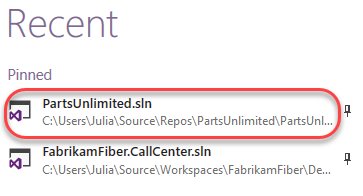

3.  In **Solution Explorer**, right-click the **References** node under
    the **PartsUnlimitedWebsite** project and select **Manage NuGet
    Packages**.

    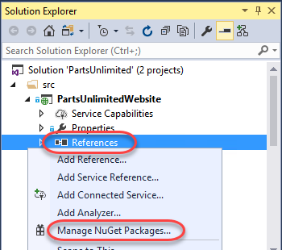

4.  Click the **Browse** tab and change the **Package source** to
    **PartsUnlimitedShared**. The only package will be the one we just
    added, so click **Install** to add it to the project.

    

5.  Confirm the add by clicking **OK**.

    

6.  Press **Ctrl+Shift+B** to build the project. It should succeed. The
    NuGet package doesn’t add any value yet, but at least we know
    it’s there.

### Task 5: Updating a NuGet package

1.  Switch to the instance of **Visual Studio** that has the
    **PartsUnlimited.Shared** project open (the NuGet source project).

2.  In **Solution Explorer**, right-click the **PartsUnlimited.Shared**
    project node and select **Add | New Item**.

    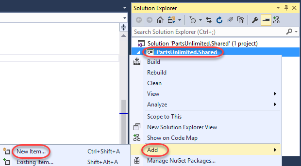

3.  Select the **Class** template and enter the **Name
    “TaxService.cs”**. Click **Add** to add the class. We can pretend
    that tax calculation will be consolidated into this shared class and
    managed centrally so that other teams can simply work with the
    NuGet package.

    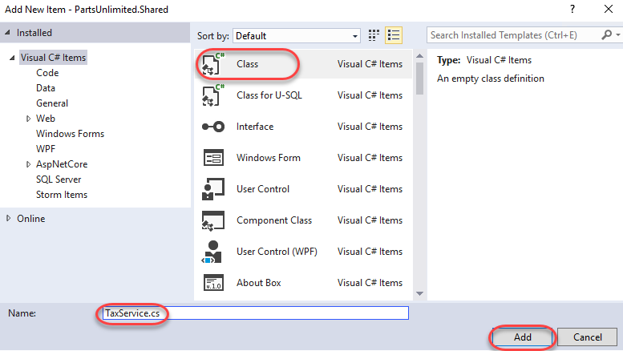

4.  Replace the code in the new file with the code below. For now it
    will just hardcode a 10% rate.

    ```
      // C\#

        namespace PartsUnlimited.Shared

        {

        public class TaxService

        {

        static public decimal CalculateTax(decimal taxable,
        string postalCode)

        {

        return taxable \* (decimal).1;

        }

        }

        }
    ```

5.  Since we’re updating the assembly (and package), return to
    **AssemblyInfo.cs** and update the **AssemblyVersion** to
    **1.1.0.0**.

    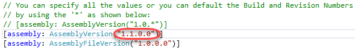

6.  Press **Ctrl+Shift+B** to build the project.

7.  Return to the **command prompt** and execute the following line to
    repackage the NuGet package. Note that the new package will have the
    updated version number.

    - nuget.exe pack PartsUnlimited.Shared.csproj

8.  Execute the following line to publish the updated package. Note that
    the version number has changed to reflect the new package.

    - nuget.exe push -source "PartsUnlimitedShared" -ApiKey VSTS
        PartsUnlimited.Shared.1.1.0.0.nupkg

9.  Return to the browser window open to **TFS** and refresh the page.
    You will still be looking at the 1.0.0.0 version of the package, but
    you can change that by clicking the new link to **1.1.0.0**.

    

10. Switch back to the instance of **Visual Studio** open to the main
    **PartsUnlimited** project (with **PartsUnlimitedWebsite**).

11. From **Solution Explorer**, open
    **PartsUnlimitedWebsite\\Utils\\DefaultShippingTaxCalculator.cs**.

    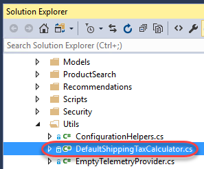

12. Locate the call to **CalculateTax** around line **20** and add the
    qualifier **”PartsUnlimited.Shared.TaxService”** to the beginning.
    The original code called a method internal to this class, so the
    code we’re adding to the beginning of the line is redirecting it to
    code from our NuGet assembly. However, since this project hasn’t
    updated the NuGet package yet, it’s still referencing 1.0.0.0 and
    doesn’t have these new changes available, so the code will
    not build.

    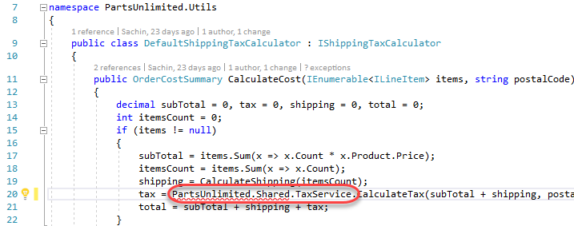

13. In **Solution Explorer**, right-click the **References** node and
    select **Manage NuGet Packages**.

    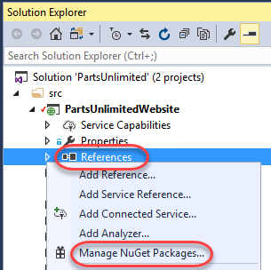

14. NuGet is aware of our update, so click the **Updates** tab to view
    the details. Click **Update** to bring down the new version.

    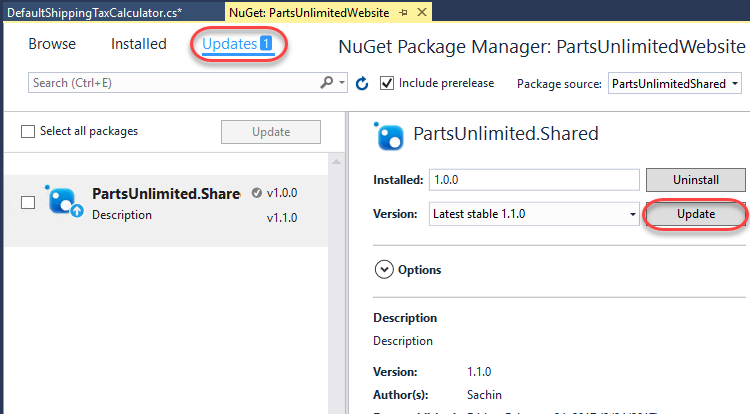

15. Click **OK** to approve the update.

16. **Press** **F5** to build and run the site. It should work
    as expected.


