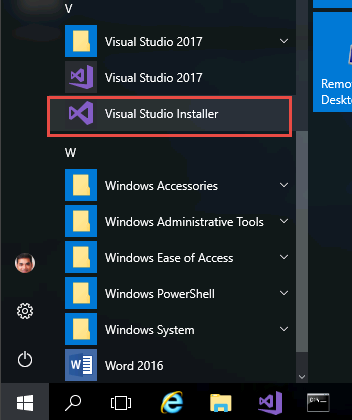
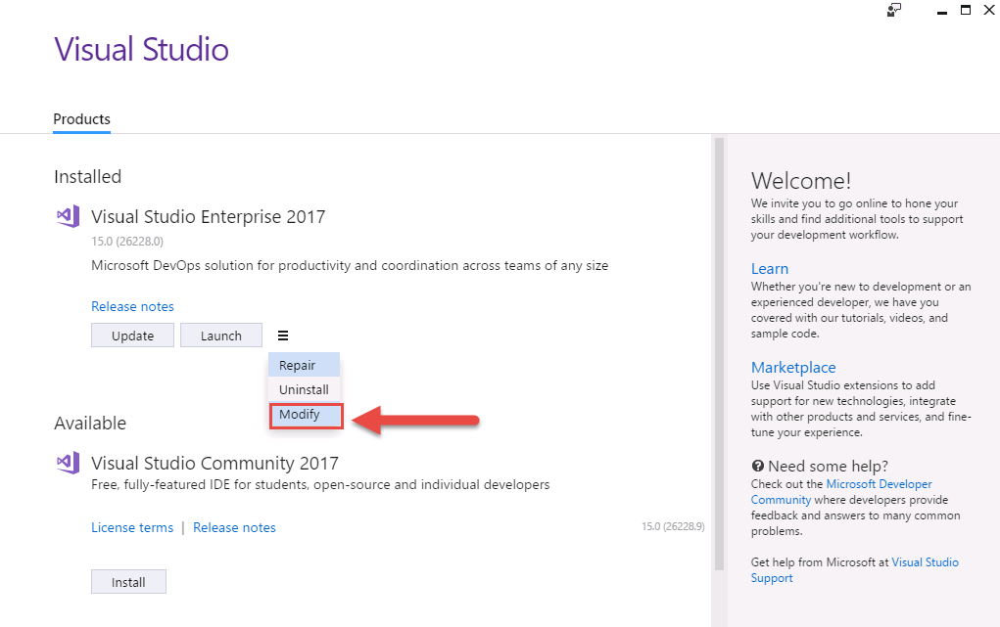
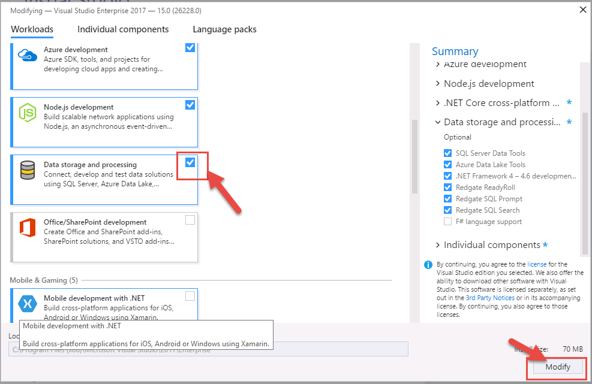
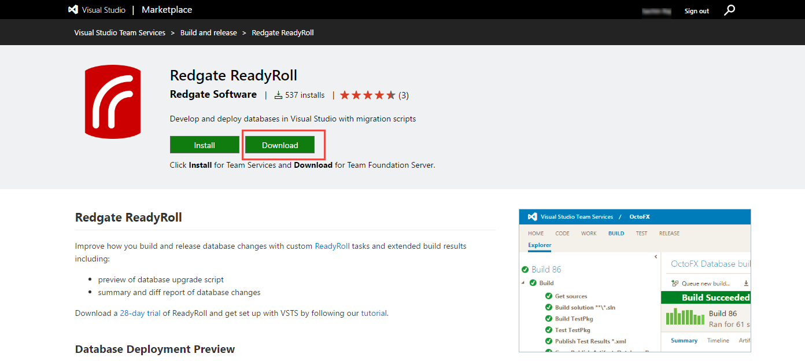
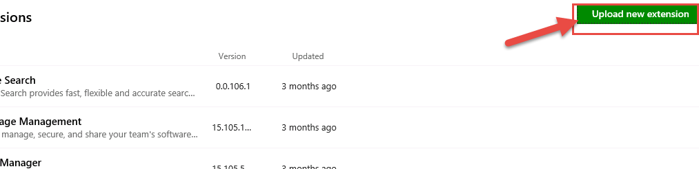
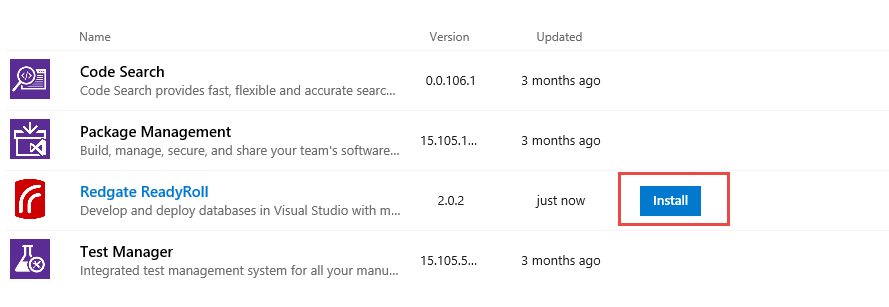
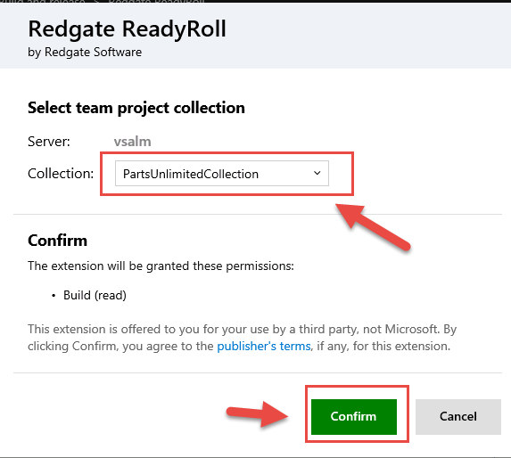

# Installing Redgate Data Tools for Visual Studio Enterprise 2017

1. Launch **Visual Studio Installer** from the Start menu.

    

1. The installer will prompt for an update. Select **Update**. Once the update is complete, it will launch the Installer Window. Select ***Modify*** under Visual Studio Enterprise 2017

    

1.	Select the check box next to **Data Storage and Processing** to add the components relating to this workload. Click the **Modify** button to complete the installation

    

Wait for the installer to finish and launch Visual Studio. You will now find **Redgate Data Tools** for Visual Studio Enterprise 2017 installed and available.

# Installing ReadyRoll extension for Team Foundation Server

In order to use the **ReadyRoll** tasks in your build and release defintions, you will need to install the extension from the [Marketplace](https://marketplace.visualstudio.com/)

1. Open a browser and navigate to the ReadyRoll extension page on the Visual Studio Marketplace - [https://marketplace.visualstudio.com/items?itemName=redgatesoftware.redgate-readyroll](https://marketplace.visualstudio.com/items?itemName=redgatesoftware.redgate-readyroll)

1. Select the **Download** button to download and save the vsix file

    

1. Navigate to [http://vsalm:8080/tfs/_gallery/manage](http://vsalm:8080/tfs/_gallery/manage) to access the **Manage Extension** page in TFS. Select the **Upload new extension** button to add the downloaded ReadyRoll extension

        

1. Locate the extension file you downloaded and select **Open**

       

1. Once the extension upload is complete, select the **Install** button next to the ReadyRoll extension

    

1. You will need to specify the Team Project Collection to which you want to install the extension. Select **PartsUnlimitedCollection** from the *Collection* dropdown and select **Confirm**

    

1. You can now start using the ReadyRoll extension in the **PartsUnlimitedCollection** team project collection.
