<div class="rw-ui-container"></div>

## Overview

In this lab, you will learn about the release management features available in Visual Studio 2017 and its suite of release and deployment tools that automate the deployment of applications across the desktop, server, and the cloud. The release management features of Visual Studio 2017 help development and operations teams integrate with Team Foundation Server to configure and automate complex deployments of their automated builds to target environments more easily. Development teams can also model their release processes and track approvals, sign-offs, and visualize their release status.

## Prerequisites

In order to complete this lab you will need the Visual Studio 2017 virtual machine provided by Microsoft. Click the button below to launch the virtual machine on the Microsoft Hands-on-Labs portal.

<a href="https://labondemand.com/AuthenticatedLaunch/38301?providerId=4" class="launch-hol" role="button" target="_blank"><span class="lab-details">Launch the virtual machine</span></a>

Alternatively, you can download the virtual machine from [here](../almvmdownload/)

This lab also requires the latest version of **SQL Server Management Studio (SSMS)** in order to ensure compatibility with Azure. You can check for updates by launching SSMS and selecting **Tools \| Check for Updates**.

## About the Fabrikam Fiber Scenario

This set of hands-on-labs uses a fictional company, Fabrikam Fiber, as a backdrop to the scenarios you are learning about. Fabrikam Fiber provides cable television and related services to the United States. They are growing rapidly and have embraced Windows Azure to scale their customer-facing web site directly to end-users to allow them to self-service tickets and track technicians. They also use an on-premises ASP.NET MVC application for their customer service representatives to administer customer orders.

In this set of hands-on labs, you will take part in a number of scenarios that involve the development and testing team at Fabrikam Fiber. The team, which consists of 8-10 people has decided to use Visual Studio application lifecycle management tools to manage their source code, run their builds, test their web sites, and plan and track the project.

## Prerequisite Exercise

This lab requires a build agent to be installed and configured. These steps are covered in the first exercise of the **Introduction to Team Foundation Build** lab. Complete those steps first (required only once) and then continue here.

## Exercise 1: Continuous Release Management

In this exercise, you will use the release management features of Team Foundation Server to produce an automated deployment solution. This exercise will take an existing enterprise application and automate its deployment to the development team's testing environment after each source check-in.

### Task 1: Configuring a continuous build

1. Log in as **Sachin Raj (VSALM\Sachin)**. All user passwords are **P2ssw0rd**.

1. Open **Internet Explorer**.

1. Navigate to the **TFS FF Portal** using the bookmark at the top of the browser.

    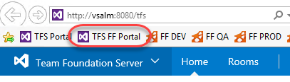

1. Select the **Code** tab.

    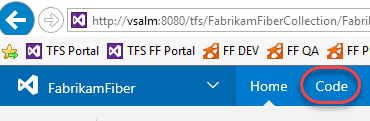

1. You can easily edit files on the server and check them in from the browser, which is great for scenarios where you only need to make minor tweaks. You'll come back to this tab in future steps, so leave it open as you move forward.

1. Right-click the **Build and Release \| Builds** tab and select **Open in new tab** to view builds. You're going to move back and forth between parts of TFS, so keeping these separate tabs open will make things easier as you go along. After the tab opens, switch to it.

    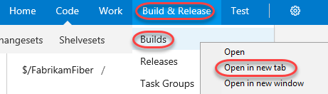

1. Click **New definition** to create a new build definition.

    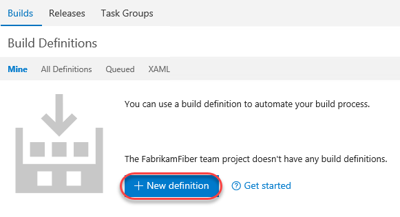

1. Select the **ASP.NET** template and click **Apply**.

    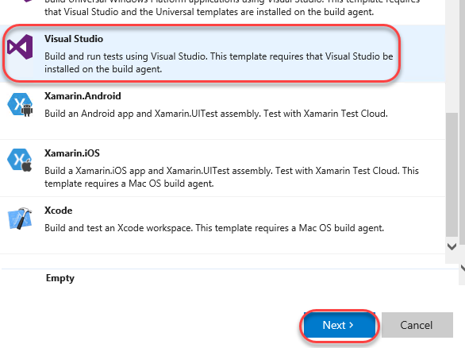

1. Set the build **Name** to **"Fabrikam Development CI"** and select the **default** agent queue.

    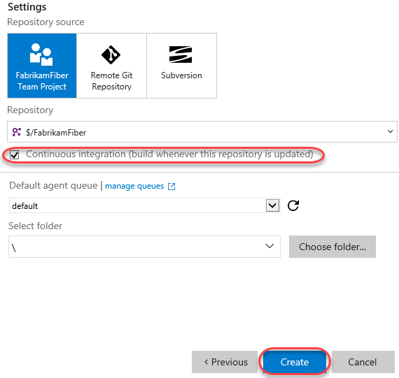

1. Select the **Get sources** task.

    

1. Update the **Workspace mappings** so that they use the **Dev** branch.

    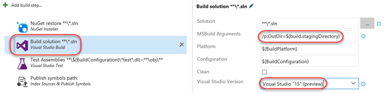

1. Select the **Build solution** task.

    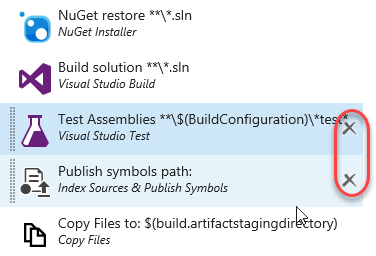

1. Select **Visual Studio 2017** as the **Visual Studio Version** and set the **MSBuild Arguments** to the text below.

    ```cmd
    /p:OutDir=$(build.stagingDirectory)
    ```
    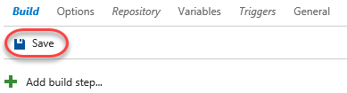

1. Select the **Test Assemblies** and **Publish symbols path** tasks and right-click to select **Remove selected tasks**.

    

1. Select the **Triggers** task and **enable** **Continuous Integration**.

    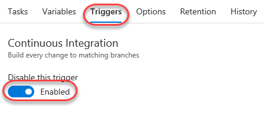

1. Select  **Save & queue \| Save**. Accept the defaults in the save dialog.

    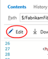

1. Return to the browser tab opened to the **Code** hub.

1. Navigate to the path below to open a shared layout file used to present a consistent look and feel for the site.

    ```cmd
    $/FabrikamFiber/Dev/FabrikamFiber.CallCenter/FabrikamFiber.Web/Views/Shared/_Layout.cshtml
    ```
    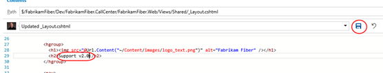

1. Click **Edit** to enable editing directly in the browser.

    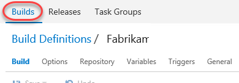

1. Locate the **"Support"** text within a **H2** tag (around line **29**). Change it to **"Support v2.0"**.

    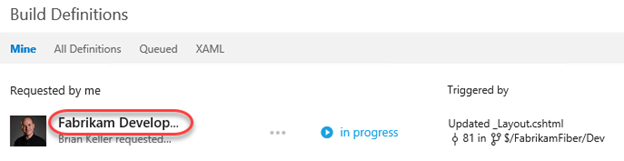

1. Click **Check in** to check in the change (accept the default comment). This check-in will invoke a build now that continuous integration builds have been enabled.

    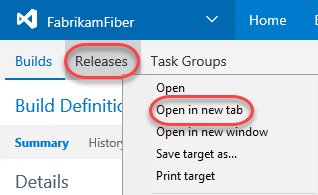

1. Switch back to the browser tab with the builds. Select the **Builds** tab.

    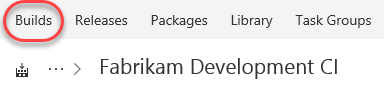

1. There should now be a build in progress. Click it to review the progress.

    

1. You don't need to wait for the build to complete to move on to the next step.

### Task 2: Creating a continuous release

1. Now that there is an automatic build that occurs when changes are checked in, it's time to set up a continuous release so that this new build can make its way out to stakeholders. Right-click the **Release** tab and select **Open in new tab**. You should now have three tabs open: **Code**, **Build**, and **Release**. Switch to the **Release** tab.

    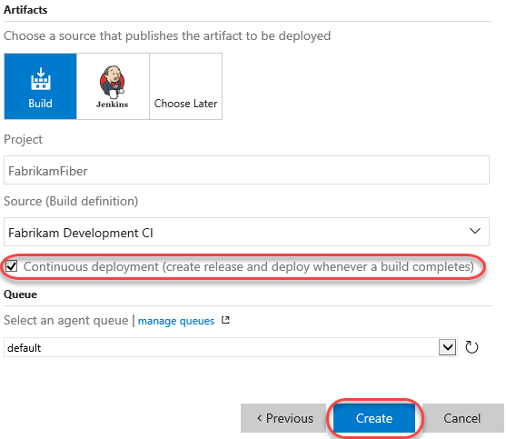

1. To create your first release, click **New definition**.

    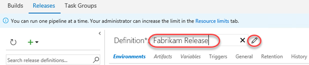

1. There are a lot of templates you can begin with to quickly get your release up and running. However, we'll start off with a simple scenario and build it from scratch. Click **Empty process**.

    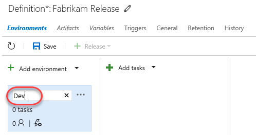

1. Start off by setting the name to **"Fabrikam Release"**.

    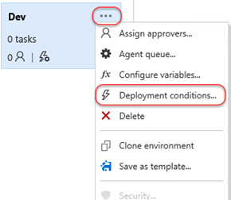

1. This release will manage the results of a build and push them out to the team's development environment. Set the **Environment name** to **"Dev"**.

    

1. Click **Add artifact** to specify something to be deployed.

    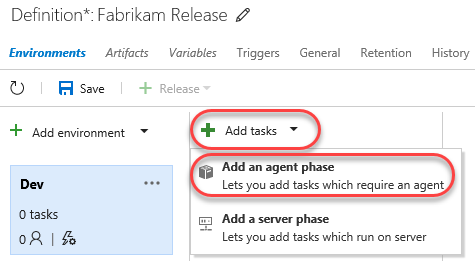

1. Select the **Fabrikam Development CI** build as the **Source** of this artifact and click **Add**.

    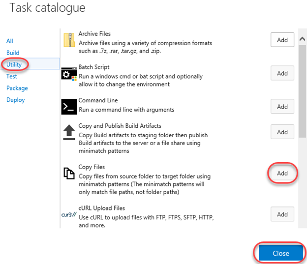

1. On the newly defined artifact, click the **Continuous deployment trigger** button. Note that this button (along with several others) are provided directly on the pipeline visualization so that they offer clearer in-context functionality.

    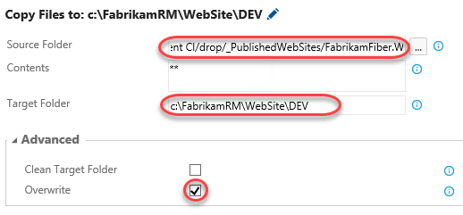

1. Use the option to **Enable** the trigger. This will automate this release each time that build completes.

    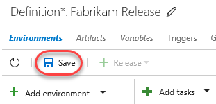

1. Click the **Pre-deployment conditions** button on the **Dev** environment.

    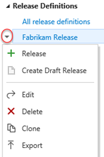

1. Ensure **After release** is selected. If you have a scenario where you would only want this release to be pushed manually, you can set that here.

    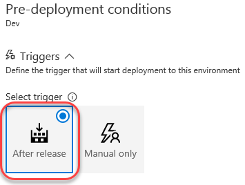

1. Now that the basic settings of the environment have been defined, it's time to configure exactly how a release is deployed. This is done through a series of **Tasks** that involve any process you need to get the job done. The "Dev" environment is pretty straightforward since it just involves copying files from the build directory to a directory configured to be used by IIS (which happens to be on the same machine in this lab scenario). Select the **Tasks** tab and click the **Add a task to this phase** button next to the only **Agent phase**.

    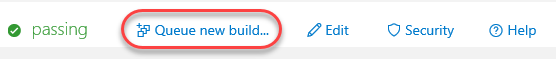

1. Under the **Utility** tab, click **Add** from **Copy Files** to add one of those tasks to the workflow. Note that you could add a variety of tasks to the process, so the view doesn't close after you hit **Add**. Be sure to just add it once.

    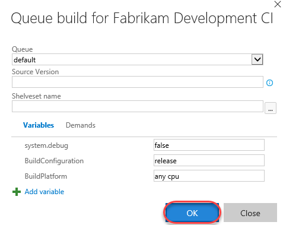

1. Select the **Copy Files** task.

    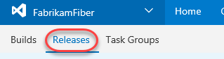

1. There are three key settings for the **Copy Files** task. First, set **Source Folder** to the path below (this is a single line).

    ```cmd
    $(System.DefaultWorkingDirectory)/Fabrikam Development CI/drop/_PublishedWebSites/FabrikamFiber.Web
    ```
1. Next, set **Target Folder** to the path below.

    ```cmd
    c:\FabrikamRM\WebSite\DEV
    ```
1. Finally, expand **Advanced** and check **Overwrite** to indicate that it's okay to overwrite existing files at the destination.

    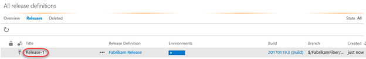

1. Now that this process has been configured, click **Save**. Optionally leave a comment.

    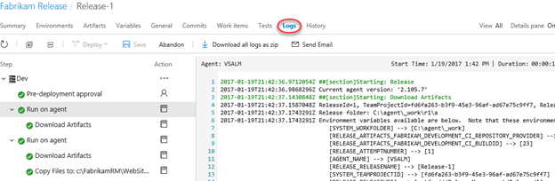

1. Once saved, this release definition will appear in the **Release Definitions** list and offer you easy access to configuration functionality, which includes the ability to clone the definition, as well as to export it for import elsewhere (including as part of an extension). Select the **Releases** tab and locate the dropdown for the newly created release definition.

    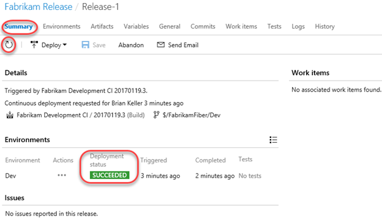

1. Open a new browser tab and navigate to the Fabrikam Fiber Dev site. Note that the "Support" text is still just "Support" because the most recent changes were checked in and built, but not deployed.

    

1. Switch to the browser tab open to the builds page (probably the second one).

1. From the previous build, select **Queue new build**. Note that you could make another change to the source and check it in, but this process cuts to the chase.

    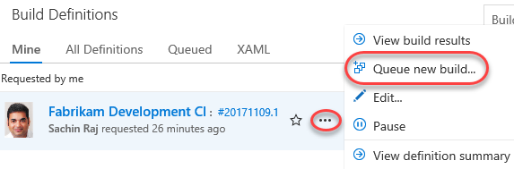

1. Accept the defaults and click **Queue**.

1. If a new browser tab opens to the current build, close it.

1. Switch to browser tab open to the releases.

1. If there are no releases in the view, refresh the browser every few seconds (or press the **Refresh** button in the UI). The build should complete pretty quickly and kick off the new release. When it appears, note that there is a single grey bar under **Environments**. This represents the **Dev** environment, which hasn't begun yet. If the bar is blue, then that means the deployment is in progress. Green means it succeeded and red means it failed. Double-click the release to view the details.

    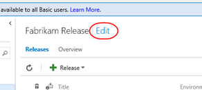

1. There are many options for reviewing the release. Most of these are already familiar since you just went through the process of setting them up. But if you consider a scenario where there are many different releases occurring at the same time, it's very useful to have easy access to all the settings and details used to define a release. Click the **Logs** tab to watch the process unfold.

    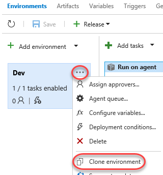

1. Return to the **Summary** tab and refresh the view using the inline **Refresh** button until the deployment succeeds.

    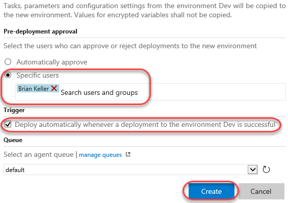

1. Return to the Fabrikam Fiber Dev browser tab and refresh it to confirm the changes have been deployed.

    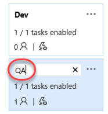

## Exercise 2: Gated Releases

While automated releases are great, sometimes you want to gate their progress by requiring user approval. In this exercise, you will add a second environment to the release process for QA and user acceptance testing. In this scenario, you will allow the release to reach the QA site, but only if it successfully deploys to Dev. Once it's available on QA, it won't be considered "success" until approved manually. Note that it's just as easy to also (or alternatively) have this human approval gate prior to the deployment.

### Task 1: Adding a QA environment

1. Return to the tab with all the releases (probably the third).

1. Click the release name to return to its overview.

    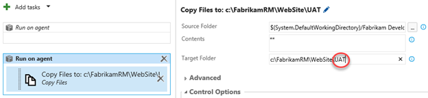

1. Click **Edit** to enter edit mode.

    

1. Under the **Dev** environment, click the **Clone** button. Your **QA** environment is the same as **Dev**, except that it's copied to a different output folder. Using this clone technique saves a lot of configuration time.

    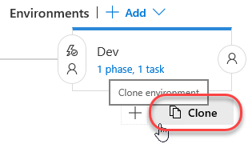

1. The new environment is added as a target after the original **Dev**. Note how easy it is to visualize the release pipeline. If the new environment were changed to have a trigger based on a different source, it would be updated in the visualization to make it easy to understand.

    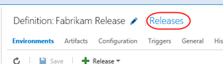

1. Set the name of the new environment to **"QA"**.

    

1. Click the **Pre-deployment conditions** button for the **QA** environment.

    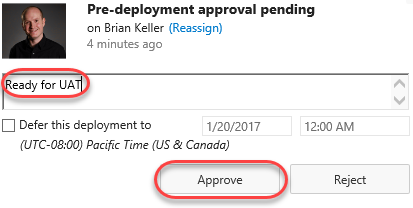

1. Ensure the **After environment** option is the selected trigger. This will automatically kick off this release once the **Dev** release succeeds. Alternatively, you could configure this as using a build completion or manual activation.

    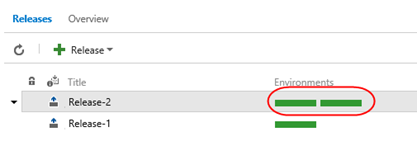

1. In the **Pre-deployment approvers** section, specify **Sachin** as the user who can approve deployments to this environment. They will be notified when a release is pending and can approve directly. Note that there is also a field for **Timeout in minutes** that specifies how long a release can be pending before it is automatically rejected by the server. The 0 default means 30 days.

    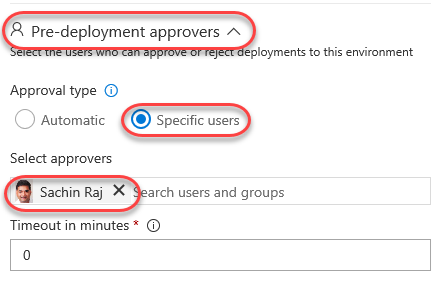

1. Mouse over the **Tasks** tab and select **QA** to edit tasks associated with that environment.

    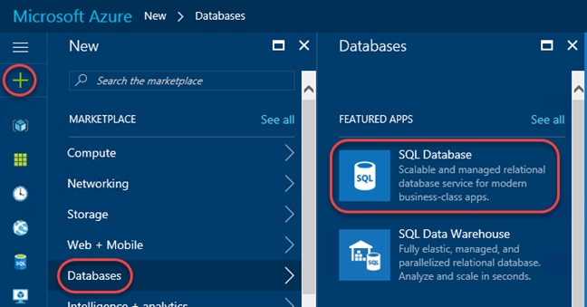

1. In the **Copy Files** task, change the final destination folder from "DEV" to "UAT" (short for "User Acceptance Testing"). Be sure you're editing the **Target Folder** field and not just the **Display name**.

    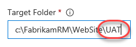

1. **Save** the release as before. Now that there's some history, you can select the **History** tab and compare (or revert to) previous versions. Don't revert now.

    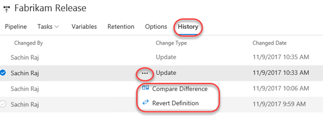

1. Open a new browser tab and navigate to the Fabrikam Fiber QA site. Note that it still has the original support text.

    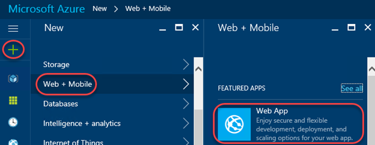

1. Return to the browser tab open to the code view in TFS (probably the first one) and repeat the editing process to change the "Support v2.0" text to "Support v3.0". Save and check in the change as before. This will kick off the build, which will hand off to the release to Dev, which will hand off to QA.

1. Return to the releases tab to view release history.

    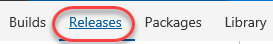

1. Note now that there are two release bars indicating status. Depending on how quickly you get here, these colors may vary by how far the release workflow has progressed. Refresh the data until you see the "awaiting approval" icon shown below. Click it when shown.

    

1. Enter an optional message and click **Approve**.

    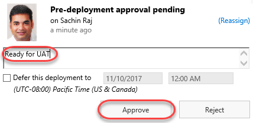

1. Refresh the results until both bars are green, which will indicate that both environment releases succeeded.

    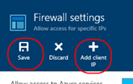

1. Return to the FF QA site (probably the last tab) and confirm the "v3.0" made it through.

    

## Exercise 3: Releasing To Azure

The release management tools are incredibly flexible. Not only can you automate virtually anything, you can even leverage some of the higher-lever tasks to easily perform complex processes, such as deploying to an Azure web site.

### Task 1: Creating an Azure Web site and database

1. Create an Azure account at [http://azure.com](http://azure.com/) if you don't already have one.

1. In a new browser tab, navigate to [https://portal.azure.com](https://portal.azure.com/).

1. Click **New** and search for **"sql"**. Select **SQL Database** and click **Create**.

    

1. Enter **"fabrikam"** as the **Database name**. Select a subscription (it doesn't matter which one, but use the same one for all steps in this lab). Select **Create new** for **Resource group** and enter **"fabrikam"** as the name. Make sure **Select source** is set to **Blank database** and click **Configure required settings**.

    

1. Click **Create a new server**.

1. Enter a unique name for **Server name**, such as by including your name. Enter an admin username and password you can remember. Note that "P2ssw0rd" meets the password requirements. Click **Select** to select these options.

    

1. Click **Create** on the first blade to create the database and server. It'll take some time to complete, but you can move on to the next step while it works in the background.

1. Click **New** and search for **"web"**. Select **Web App** and click **Create**.

    

1. For **App name**, enter a unique name, such as by using your name as part. Select the same **Subscription** and **Resource group** as before. If required to create an **App Service plan**, accept the defaults. Click **Create** to create.

    

1. Click the **Resource groups** tab from the left menu. Locate and click the **fabrikam** group created earlier.

    

1. Click the SQL Server (not the database) and click **Show firewall settings** in the new blade. There are two SQL icons, and the server is the one with the gear. The database is the one without.

    

1. You need to allow your current IP address to access the database, so click **Add client IP** (which will default to your current IP) and then click **Save**. No other external IPs will be allowed to connect to your database unless you explicitly let them. Close this blade.

    

1. From the **Resources** group, click your SQL database (not the server). In the new blade, click **Show database connection strings**.

    

1. This will provide you with a list of connection strings based on platform. Copy the **ADO.NET** string to your clipboard so you can configure your new web site to use it. Close this blade.

    

1. Open a new instance of **Notepad** and paste the connection string into it. This will make it easier to edit and retrieve later on in case anything happens to the clipboard copy.

1. Click the **Overview** tab to return to the database's dashboard.

    

1. On the **fabrikam** database blade, click **Delete** and then confirm the deletion. You'll publish an existing database using **SQL Server Management Studio** later on.

    

1. In the **Resources** panel, click the web app created earlier. It's the one with the globe icon by itself. In the rightmost blade that opens, click **Application settings**. Note that if the web app isn't available yet, you can refresh the view by clicking the **fabrikam** link under **Resource group** in the database blade.

    

1. On this blade you can configure settings for your app, such as connection strings. Locate the **Connection strings** section and add a new entry with the key **"FabrikamFiber-Express"** and the value pasted from the clipboard. You'll need to locate the "{your_username}" and "{your_password}" sections and replace them (including braces) with the actual SQL credentials entered earlier. Press **Enter** to complete.

    ```cmd
    Server=tcp:fabrikam-johndoe.database.windows.net,1433;Initial Catalog=fabrikam;Persist Security Info=False;User ID={your_username};Password={your_password};MultipleActiveResultSets=False;Encrypt=True;TrustServerCertificate=False;Connection Timeout=30;
    ```
    

1. Click **Save** from the toolbar to commit.

    

1. By now the SQL database should be available for use. Open the latest version of **SQL Server Management Studio**.

    

1. By default, the settings are in place for the local SQL server that hosts the database you want to set up in the cloud. Click **Connect** to connect.

    

1. Right-click the **FabrikamFiber-Express** database and select **Tasks \| Deploy Database to Microsoft Azure SQL Database**.

    

1. On the **Introduction** page of the wizard, click **Next**.

1. Click **Connect** to set up the SQL Azure database connection.

    

1. In the **Connect to Server** dialog, enter the connection details for your SQL Azure database. For example, if your database name was "fabrikam-johndoe", then the **Server name** is "fabrikam-johndoe.database.windows.net". Click **Connect** when done. Note that if you plan to copy/paste any of this into the dialog you'll want to first paste the current clipboard contents (the SQL script) into Notepad for temporary safekeeping.

    

1. Set **New database name** to **"fabrikam"** and click **Next**.

    

1. Click **Finish** on the final page of the wizard to deploy the database.

    

### Task 2: Configuring the build to produce a Web Deploy package

1. Return to the browser tabs open to the builds section of the portal.

1. From the build options menu, select **Edit**.

    

1. Select the **Build Solution** step and add the following arguments after the existing arguments. Be sure to include a space before adding the new arguments.

    ```cmd
    /p:DeployOnBuild=true /p:WebPublishMethod=Package /p:PackageAsSingleFile=true /p:SkipInvalidConfigurations=true
    ```
    

1. **Save** the build definition.

### Task 3: Creating a release environment for Azure

1. Return to the **Releases** tab.

1. Click one of the release definitions to edit it.

    

1. Select **Add \| New environment**.

    

1. Select the **Empty process** option to get started.

    

1. Set the **Environment name** to **"Prod-Azure"**.

    

1. Notice that the new environment defaults to pointing to the artifacts, whereas we really want it to come after a successful QA deployment. Click the **Pre-deployment conditions** button to fix this.

    

1. Select the **After environment** trigger and select the **QA** environment.

    

1. Now the release pipeline clearly shows the order of releases we want.

    

1. Similar to the QA environment, we also want Sachin to be the **Pre-deployment approver**.

    

1. In addition, we want Sachin to sign off on the release after it's been deployed. Click the **Post-deployment approvers** button.

    

1. Configure Sachin as the approver like before.

    

1. Since we started with an empty template, we'll need to add a task that handles deploying the build to Azure. Select **Tasks \| Prod-Azure**.

    

1. Click the **Add task** button for the **Agent phase**.

    

1. From the **Deploy** category, select the **Azure App Service: Classic** task and click **Add**. Note that while this task is deprecated and not intended for broad use, it's a simple way for us to push a build out that doesn't require much additional configuration. Consider using the Resource Manager model for production systems.

    

1. Select the new task.

    

1. The next step is to link your Azure subscription to TFS so that the deployment can be automated. Click **Manage**.

    

1. Select **New Service Endpoint \| Azure Classic**.

    

1. Select **Certificate Based** and click the **publish settings file** option at the bottom. This will open a link to download an Azure publish settings file that contains the details needed to complete this form.

    

1. When prompted by the browser, select **Save As**, change the name to "creds.txt", and save it to the desktop for easy access. Note that the browser may ask you to log in first.

1. Open "creds.txt" using notepad. It's XML, but you'll be able to parse out what you need by hand.

1. Locate the three key fields needed to configure the Azure connection. Note that if you have multiple Azure subscriptions, you'll need to make sure you're working with the one used to create the SQL server and web site earlier.

    

1. Set the **Connection** name to **"Fabrikam Azure"** and configure the remaining details using the data from **creds.txt**. Note that **Management Certificate** is all on the same line, despite the appearance with word wrapping. Click **Verify connection** to confirm and **OK** to continue.

    

1. After the connection has been created, you can close this tab.

1. Return to the releases tab. Click the **Refresh** button next to the subscription dropdown. This will enable you to select the **Azure Subscription** connection you just created. Select the **Web App Location** used during creation and manually type in the **Web App Name** of the Azure web site.

    

1. Set the **Web Deploy Package** to the path below. Note that you could also specify additional arguments, such as a connection string, as part of this workflow if required.

    ```cmd
    $(System.DefaultWorkingDirectory)/Fabrikam Development CI/drop/_PublishedWebsites/FabrikamFiber.Web_Package/FabrikamFiber.Web.zip
    ```
    

1. **Save** the release definition.

### Task 4: Checking in a change to kick off the release workflow

1. Return to the code browser tab and locate the path below.

    ```cmd
    $/FabrikamFiber/Dev/FabrikamFiber.CallCenter/FabrikamFiber.Web/Global.asax.cs
    ```
1. Click the **Edit** button and comment out the **Database.SetInitializer** call in **Application_Start**. This won't work properly in Azure, so it needs to be commented out. It doesn't matter since the DB was already set up manually.

    

1. **Check in** the change.

1. Return to the releases tab in the browser and click **View releases**.

    

1. If the new release process doesn't show up within a minute, refresh the window or use the refresh button. Approve the first two requests to begin the Azure deployment. You'll know the bits have been deployed to production when you're asked for the post-release signoff.

    

1. Open a browser tab to the Azure site to confirm the deployment worked as expected. For example, if you named your site **fabrikam-johndoe**, then the URL would be [http://fabrikam-johndoe.azurewebsites.net](http://fabrikam-johndoe.azurewebsites.net/).

    

1. Return to the releases tab and approve the release by clicking the icon, optionally entering a message, and clicking **Approve.**

    

1. Now everyone can easily see that the most recent release made it all the way through the release pipeline and is live in the cloud.

    

### Task 5: Deploying to Azure from Visual Studio

1. While all of the automation available in **Team Foundation Server** provides a great "continuous integration, continuous deployment" (CICD) experience, sometimes you may still want to manually deploy a build directly from Visual Studio. And thanks to tight integration between Visual Studio and Azure, it's really easy to do.

1. Open a new instance of **Visual Studio** from the taskbar.

1. Open **FabrikamFiber.CallCenter.sln** from the **Start Page**.

    

1. We'll continue using the support version number as our change example. From **Solution Explorer**, open **FabrikamFiber.Web\Views\Shared\_Layout.cshtml**.

    

1. Locate the **h2** tag with the support version and increment it to **v4.0**.

    

1. In **Solution Explorer**, right-click the **FabrikamFiber.Web** project and select **Publish**.

    

1. Since this is the first time this project is being published to Azure, we will need to set up a publish profile. Click **Create new profile**.

    

1. Select **Microsoft Azure App Service** and **Select Existing**. Click **OK**.

    

1. Since there is not yet an account associated with this instance of **Visual Studio**, click **Add an account** from the dropdown.

    

1. Sign in using the Microsoft account your Azure subscription is associated with.

1. Select the **App Service** created earlier and click **OK**.

    

1. Once the publish profile has been created, click **Publish**.

    

1. You can review the publish progress in the **Web Publish Activity** pane at the bottom if **Visual Studio**. It should complete quickly since the one file being pushed is small.

    

1. Upon completion, the integrated browser will open to the public URL. Note the new version number, which confirms the deployment was successful.

   

### Task 6: Working with deployment slots

1. Azure App Services offer **deployment slots**, which are parallel targets for application deployment. The most common scenario for using a deployment slot is to have a staging environment for your application to run against productions services, but without replacing the current production application. If the staging deployment passes review, it can immediately be "swapped" in as the production slot with the click of a button. As an additional benefit, the swap can be quickly reversed in the event an issue is uncovered with the new build.

1. Return to the browser window open to the Azure portal.

1. Select the **Resource groups** tab from the left menu. Locate and click the **fabrikam** group created earlier.

    

1. Click the **App Service**.

    

1. Select the **Deployment slots** tab and click **Add Slot**. Note that the **production** slot is considered a "default" slot and is not shown as a separate slot in the user experience.

    

1. Enter a **Name** of **"staging"** and select the **Configuration Source** that matched your existing deployment (there should be only one). Click **OK** to create the slot.

    

1. Return to **_Layout.cshtml** in **Visual Studio**. Update the version text to **"5.0"**.

    

1. In **Solution Explorer**, right-click the **FabrikamFiber.Web** project and select **Publish**.

    

1. The new slot is treated as a unique deployment target, so we'll need to set up a profile for it. However, your Microsoft and Azure accounts are already configured, so the experience will be even smoother. Click **Create new profile**.

    

1. Select **Microsoft Azure App Service** and **Select Existing**. Click **OK**.

    

1. Drill down to select the **staging** deployment slot and click **OK**.

    

1. You'll notice that the settings are very similar to the **production** slot, except that the text **"staging"** is inserted within various strings. The key place of interest is that the URL differs from the production slot by having **"-staging"** inserted at the end of the lowest subdomain. For example, if your subdomain started with **"fabrikam-johndoe"**, then a slot named **"staging"** would have the domain start with **"fabrikam-johndoe-staging"**. Click **Publish** to deploy.

    

1. Once the deployment finishes you'll see the built-in browser navigate to the staging slot, which can be verified via the support version number.

    

1. However, if you take the **"-staging"** out of the URL and press **Enter**, you'll see that the production site is still on v4.0, as expected.

    

1. Expand the **Server Explorer** from the left side of Visual Studio.

    

1. Drill down into the **Azure** node to review all of the assets accessible from within the IDE. Note the **production** slot is at the default level while the **staging** slot is one level deeper under **Slots**. You can do a lot from this pane, including opening file for editing (and saving back to Azure), reviewing logs, managing **WebJobs**, and more.

    

1. Return to the browser window open to the **Azure portal**. Click **Swap** in the slots blade.

    

1. The default options here are exactly what we want: to swap the production and staging slots. Click **OK**. Note that if your apps rely on **slot-level configuration settings** (such as connection strings or app settings marked "slot"), then the worker processes will be restarted. If you're working under those circumstances and would like to warm up the app before the swap completes, you can select the **Swap with preview** swap type.

    

1. Return to **Visual Studio** and refresh the built-in browser by right-clicking with the document and selecting **Refresh**. Note that you can't **F5** since that would build and run the solution.

    

1. The **production** site should now show the **v5.0** as expected.

    

1. You can also confirm that the **staging** slot is now hosting the former production build of **v4.0**. In the event something bad happened with the v5.0 build, you could simply run the swap again and this running build would be back in production.

    

1. It's important to note that while we deployed to the staging slot using Visual Studio, you could have just as easily set up CICD in TFS to deploy to the staging slot as well. There are even tasks to automate the swapping of slots, so you could set up everything you need in the release definition.
