## Overview

In this lab, you will learn about the release management features
    available in Visual Studio 2017 and its suite of release and
    deployment tools that automate the deployment of applications across
    the desktop, server, and the cloud. The release management features
    of Visual Studio 2017 help development and operations teams
    integrate with Team Foundation Server to configure and automate
    complex deployments of their automated builds to target environments
    more easily. Development teams can also model their release
    processes and track approvals, sign-offs, and visualize their
    release status.

## Pre-requisites

In order to complete this lab you will need the Visual Studio 2017
    virtual machine provided by Microsoft. For more information on
    acquiring and using this virtual machine, please see [this blog
    post](http://aka.ms/ALMVM).

Exercise 1 of the “Introduction to Team Foundation Build” lab is a
    prerequisite for this lab.

## Exercise 1: Continuous Release Management

In this exercise, you will use the release management features of
    Team Foundation Server to produce an automated deployment solution.
    This exercise will take an existing enterprise application and
    automate its deployment to the development team’s testing
    environment after each source check-in.

### Task 1: Configuring a continuous build

1.  Log in as **Brian Keller** (VSALM\\Brian). All user passwords are **P2ssw0rd**.

2.  Open **Internet Explorer**.

3.  Navigate to the **TFS FF Portal** using the bookmark at the top of the browser.

    

4.  Click the **Code** tab.

    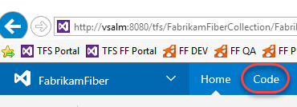

5.  You can easily edit files on the server and check them in from the browser, which is great for scenarios where you only need to make 
    minor tweaks. You’ll come back to this tab in future steps, so
    leave it open as you move forward.

6.  Right-click the **Build & Release | Builds** tab and select **Open
    in new tab** to view builds. You’re going to move back and forth
    between parts of TFS, so keeping these separate tabs open will
    make things easier as you go along. After the tab opens, switch to it.

    

7.  Click **New definition** to create a new build definition.

    

8.  Select the **Visual Studio** template and click **Next**.

    

9.  The default settings are fine here, so just check the box to enable **continuous integration** and click **Create**.

    

10. Select the **Repository** tab and update the **Mappings** so that
    both use the **“$/FabrikamFiber/Dev”** branch.

    

11. Return to the **Build** tab and select the **Visual Studio
    Build** step. Set the **MSBuild Arguments** to the text below.
    Also change the **Visual Studio Version** to **Visual Studio 2017**.

    **/p:OutDir=$(build.stagingDirectory)**

    

12. Remove the **Visual Studio Test** and **Index Sources & Publish
    Symbols** steps from the process.

    

13. Click **Save**.

    

14. Set the **Name** to **“Fabrikam Development CI”** and click **OK**.

    

15. Return to the browser tab opened to the **Code** hub.

16. Navigate to the path below to open a shared layout file used to
    present a consistent look and feel for the site.

    **$/FabrikamFiber/Dev/FabrikamFiber.CallCenter/FabrikamFiber.Web/Views/Shared/\_Layout.cshtml**

    

17. Click **Edit** to enable editing directly in the browser.

    

18. Locate the “Support” text within a **H2** tag (around line 29).
    Change it to “Support v2.0” and click the **Save** icon to check
    in the change. This check-in will invoke a build now that
    continuous integration builds have been enabled.

    

19. Switch back to the browser tab with the builds. Select the **Builds** tab.

    

20. There should now be a build in progress. Click it to review
    the progress.

    

21. You don’t need to wait for the build to complete to move on to the
    next step.

### Task 2: Creating a continuous release

1.  Now that there is an automatic build that occurs when changes are
    checked in, it’s time to set up a continuous release so that this
    new build can make its way out to stakeholders. Right-click the
    **Release** tab and select **Open in new tab**. You should now
    have three tabs open: Code, Build, and Release. Switch to the
    Release tab.

    

2.  To create your first release, click **New definition**.

    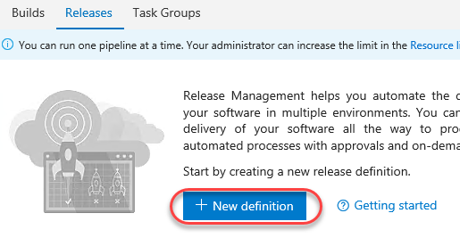

3.  Select the **Empty** definition and click **Next**. You may need to
    scroll down to find it at the bottom.

    

4.  Check **Continuous deployment** and click **Create**. This indicates
    that the release should execute as soon as the build completes.
    Note that a default build definition is selected, which we could
    change if needed. It happens to be the one we want to work
    with here.

    

5.  Click the **Edit** button and change the release name to “Fabrikam
    Release” as the release name. Press **Enter**.

    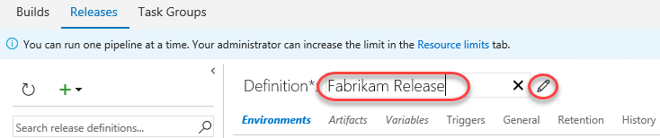

6.  By default, there is one environment, which you will rename “Dev”.
    This will represent the “Dev” environment used by the dev team
    during development.

    

7.  The first thing you need to do with this environment is to indicate
    the conditions under which it will be deployed to. Click the
    ellipses button in the environment box and select **Deployment
    conditions**.

    

8.  Under **Deployment conditions**, note that **After release
    creation** is already selected because this definition was
    configured as continuous. Press **Esc** to close the dialog.

    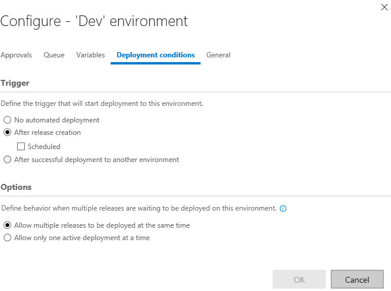

9.  Now that the basic settings of the environment have been defined,
    it’s time to configure exactly how a release is deployed. This is
    done through a series of **Tasks** that involve any process you
    need to get the job done. The “Dev” environment is pretty
    straightforward since it just involves copying files from the
    build directory to a directory configured to be used by IIS (which
    happens to be on the same machine in this lab scenario). Click
    **Add tasks** to select which agent or server tasks you want as
    part of the workflow. Click **Add an agent phase**.

    

10. Under the **Utility** tab, click **Add** from **Copy Files** to add
    one of those tasks to the workflow. Note that you could add a
    variety of tasks to the process, so the dialog doesn’t close after
    you hit **Add**. Instead, just click it once and then click
    **Close** to return to the main view.

    

11. There are three key settings for the **Copy Files** task. First, set
    **Source Folder** to the path below.

    **$(System.DefaultWorkingDirectory)/Fabrikam Development CI/drop/\_PublishedWebSites/FabrikamFiber.Web**

12. Next, set **Target Folder** to the path below.

    **c:\\FabrikamRM\\WebSite\\DEV**

13. Finally, expand **Advanced** and check **Overwrite** to indicate
    that it’s okay to overwrite existing files at the destination.

    

14. Now that this process has been configured, click **Save**.

    

15. Open a new browser tab and navigate to the Fabrikam Fiber Dev site.
    Note that the “Support” text is still just “Support” because the
    most recent changes were checked in and built, but not deployed.

    

16. Switch to the browser tab open to the builds page (probably the
    second one).

17. Click **Queue new build**. Note that you could make another change
    to the source and check it in, but this process cuts to the chase.

    

18. Accept the defaults and click **OK**.

    

19. Switch to browser tab open to the releases.

20. Select the **Releases** tab to view release history.

    

21. If there are no releases in the view, refresh the browser every few
    seconds (or press the **Refresh** button in the UI). The build
    should complete pretty quickly and kick off the new release. When
    it appears, note that there is a single grey bar under
    **Environments**. This represents the **Dev** environment, which
    hasn’t begun yet. If the bar is blue, then that means the
    deployment is in progress. Green means it succeeded and red means
    it failed. Double-click the release to view the details.

    

22. There are many options for reviewing the release. Most of these are
    already familiar since you just went through the process of
    setting them up. But if you consider a scenario where there are
    many different releases occurring at the same time, it’s very
    useful to have easy access to all the settings and details used to
    define a release. Click the **Logs** tab to watch the
    process unfold.

    

23. Return to the **Summary** tab and refresh the view using the inline
    **Refresh** button until the deployment succeeds.

    

24. Return to the Fabrikam Fiber Dev browser tab and refresh it to
    confirm the changes have been deployed.

    

## Exercise 2: Gated Releases

While automated releases are great, sometimes you want to gate their
    progress by requiring user approval. In this exercise, you will
    add a second environment to the release process for QA and user
    acceptance testing. In this scenario, you will allow the release
    to reach the QA site, but only if it successfully deploys to Dev.
    Once it’s available on QA, it won’t be considered “success” until
    approved manually. Note that it’s just as easy to also
    (or alternatively) have this human approval gate prior to
    the deployment.

### Task 1: Adding a QA environment

1.  Return to the tab with all the releases (probably the third).

2.  Click the release name to return to its overview.

    

3.  Click **Edit** to enter edit mode.

    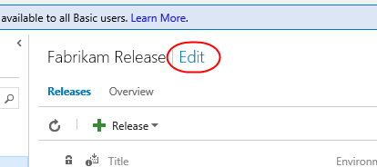

4.  Click the ellipses in the **Dev** environment and select **Clone
    environment**. Your **QA** environment is the same as **Dev**,
    except that it’s copied to a different output folder. Using this
    clone technique saves a lot of configuration time.

    

5.  In the **Add new environment** dialog, select the option to specify
    **Specific users** for pre-deployment approval. Add **Brian
    Keller** as the user. Also ensure the **Deploy automatically** box
    is checked before clicking **Create**. Note that you can also
    configure post-deployment approvers and other common behaviors
    later on.

    

6.  Change the name of the new environment to “QA” and press **Enter**.

    

7.  In the **Copy Files** task, change the final destination folder from
    “DEV” to “UAT” (short for “User Acceptance Testing”).

    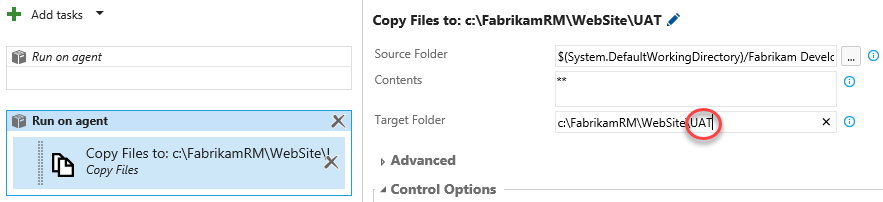

8.  **Save** the release.

    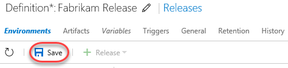

9.  Open a new browser tab and navigate to the Fabrikam Fiber QA site.
    Note that it still has the original support text.

    

10. Return to the browser tab open to the code view in TFS (probably the
    first one) and repeat the editing process to change the “Support
    v2.0” text to “Support v3.0”. Save and check in the change
    as before. This will kick off the build, which will hand off to
    the release to Dev, which will hand off to QA.

11. Return to the releases tab and click the link to view
    release history.

    

12. Note now that there are two release bars indicating status.
    Depending on how quickly you get here, these colors may vary by
    how far the release workflow has progressed. Refresh the data
    until you see the “awaiting approval” icon shown below (next to
    the blue bar). Click it when shown.

    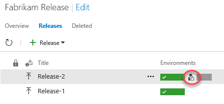

13. Enter an optional message and click **Approve**.

    

14. Refresh the results until both bars are green, which will indicate
    that both environment releases succeeded.

    

15. Return to the FF QA site (probably the last tab) and confirm the
    “v3.0” made it through.

    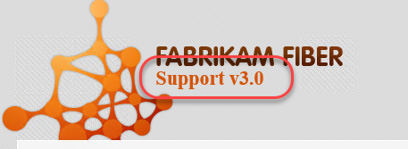

## Exercise 3: Releasing To Azure (optional)

The release management tools are incredibly flexible. Not only can you
automate virtually anything, you can even leverage some of the
higher-lever tasks to easily perform complex processes, such as
deploying to an Azure web site.

### Task 1: Creating an Azure Web site and database

1.  Create an Azure account at <http://azure.com> if you don’t already
    have one.

2.  In a new browser tab, navigate to <https://portal.azure.com>.

3.  Select **+New | Data + Storage | SQL Database (new database)** to
    create a new database.

    

4.  Enter “fabrikam” as the **Database name**. Select a subscription (it
    doesn’t matter which one, but use the same one for all steps in
    this lab). Select **Create new** for **Resource group** and enter
    “fabrikam” as the name. Make sure **Select source** is set to
    **Blank database** and click **Configure required settings**.

    

5.  Click **Create a new server**.

6.  Enter a unique name for **Server name**, such as by including
    your name. Enter a admin username and password you can remember.
    Note that “P2ssw0rd” meets the password requirements. Click
    **Select** to select these options.

    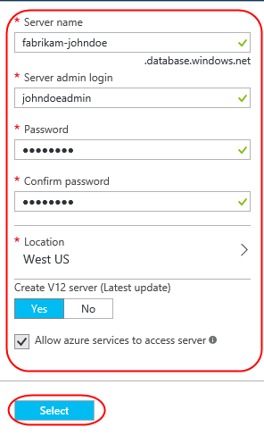

7.  Click **Create** on the first blade to create the database
    > and server. It’ll take some time to complete, but you can move on
    > to the next step while it works in the background.

8.  Select **+New | Web + Mobile | Web App** to create a new Azure
    > web site.

    

9.  For **App name**, enter a unique name, such as by using your name
    as part. Select the same **Subscription** and **Resource group**
    as before. If required to create an **App Service plan**, accept
    the defaults. Click **Create** to create.

    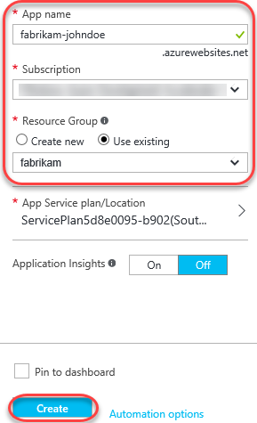

10. Click the **Resource groups** tab from the left menu. Locate and
    click the **fabrikam** group created earlier.

    

11. Click the SQL Server (not the database) and click **Show firewall
    settings** in the new blade. There are two SQL icons, and the
    server is the one with the gear. The database is the one without.

    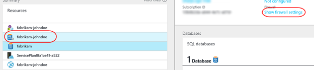

12. You need to allow your current IP address to access the database, so
    click **Add client IP** (which will default to your current IP)
    and then click **Save**. No other external IPs will be allowed to
    connect to your database unless you explicitly let them.

    

13. From the **Resources** group, click your SQL database. In the new
    blade, click **Show database connection strings**.

    

14. This will provide you with a list of connection strings based
    on platform. Copy the **ADO.NET** string to your clipboard so you
    can configure your new web site to use it.

    

15. On the **fabrikam** database blade, click **Delete** and then
    confirm the deletion. You’ll publish an existing database using
    **SQL Server Management Studio** later on to save time.

    

16. In the **Resources** panel, click the web app created earlier. It’s
    the one with the globe icon by itself. In the rightmost blade that
    opens, click **Application settings**. Note that if the web app
    isn’t available yet, you can refresh the view by clicking the
    **fabrikam** link under **Resource group** in the database blade.

    

17. On this blade you can configure settings for your app, such as
    connection strings. Locate the **Connection strings** section and
    add a new entry with the key “FabrikamFiber-Express” and the value
    pasted from the clipboard. You’ll need to locate the
    “{your\_password\_here}” section and replace it (including braces)
    with the actual SQL password entered earlier. Press **Enter**
    to complete.

    **Server=tcp:
    fabrikam-johndoe.database.windows.net,1433;Database=fabrikam;User
    ID=johndoeadmin@fabrikam-johndoe;Password={your\_password\_here};Encrypt=True;TrustServerCertificate=False;Connection
    Timeout=30;**

    

18. Click **Save** from the toolbar to commit.

    

19. By now the SQL database should be available for use. From the
    > **Start Menu**, enter “SQL Server Management Studio” and launch
    > that app.

    

20. By default, the settings are in place for the server that hosts the
    database you want to set up in the cloud. Click **Connect**
    to connect.

    

21. Right-click the **FabrikamFiber-Express** database and select
    **Tasks | Deploy Database to Microsoft Azure SQL Database**.

    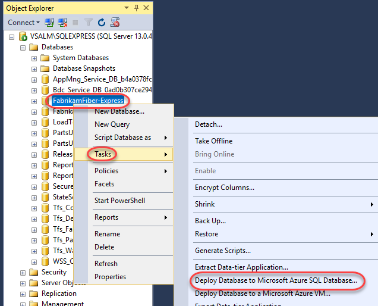

22. On the **Introduction** page of the wizard, click **Next**.

23. Click **Connect** to set up the SQL Azure database connection.

    

24. In the **Connect to Server** dialog, enter the connection details
    for your SQL Azure database. For example, if your database name
    was “fabrikam-johndoe”, then the **Server name**
    is “fabrikam-johndoe.database.windows.net”. Click **Connect**
    when done. Note that if you plan to copy/paste any of this into
    the dialog you’ll want to first paste the current clipboard
    contents (the SQL script) into Notepad for temporary safekeeping.

    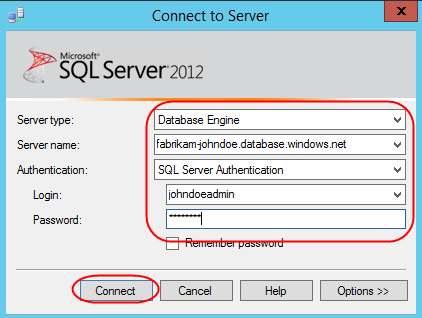

25. Dasads

    

26. Click **Finish** on the final page of the wizard to deploy
    the database.

    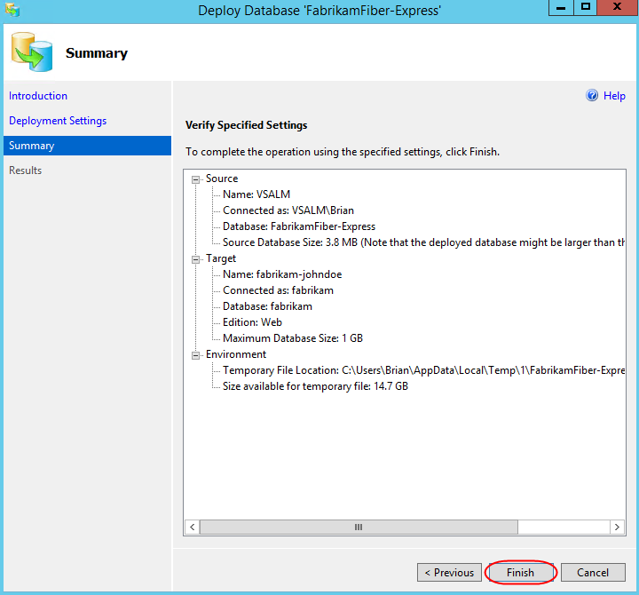

### Task 2: Configuring the build to produce a Web Deploy package

1.  Return to the browser tabs open to the builds section of the portal.

2.  Click **Edit** to edit the build definition.

    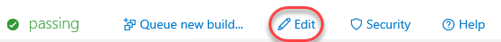

3.  Select the **Visual Studio Build** step and add the following
    arguments after the existing arguments. Be sure to include a space
    before adding the new arguments.

    **/p:DeployOnBuild=true /p:WebPublishMethod=Package
    /p:PackageAsSingleFile=true /p:SkipInvalidConfigurations=true**

    

4.  Click **Save** to save the build definition. It will now produce the
    web deploy zip needed for publication to Azure.

    

### Task 3: Creating a release environment for Azure

1.  Return to the releases tab.

2.  Everything has been set up for releasing to Azure, so you just need
    to add an environment for it. Click the **Edit** link to enter
    edit mode.

    

3.  Select **Add environment | Create new environment**.

    

4.  Select the **Azure Website Deployment** template and click **Next**.

    

5.  Select **Brian Keller** as the pre-deployment approver again and
    click **Create**.

    

6.  Set the name of the new environment to **Prod-Azure** and press
    **Enter**.

    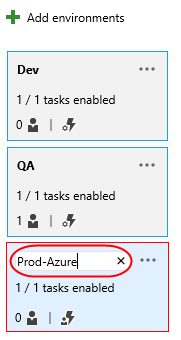

7.  Click the **Ellipses** button for **Prod-Azure** and select **Assign
    approvers**.

    

8.  Add **Brian Keller** as the post-deployment approver and click
    **OK**.

    

9.  Remove the **Visual Studio Test** task from the workflow to keep
    things simple.

    

10. It’s now time to configure the connection to Azure. Click the
    **Manage** link next to the **Azure Subscription** field. This
    will bring you to the Azure connection configuration page.

    

11. Click **New Service Endpoint | Azure Classic**.

    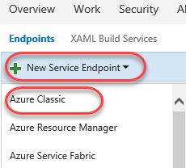

12. Select **Certificate Based** and click the **publish settings file**
    option at the bottom. This will open a link to download a publish
    settings file that contains the details needed to complete
    this form.

    

13. When prompted by the browser, select **Save As**, change the name to
    “creds.txt”, and save it to the desktop for easy access. Note that
    the browser may ask you to log in first.

14. Open “creds.txt” using notepad. It’s XML, but you’ll be able to
    parse out what you need by hand.

15. Locate the three key fields needed to configure the
    Azure connection. Note that if you have multiple Azure
    subscriptions, you’ll need to make sure you’re working with the
    one used to create the SQL server and web site earlier.

    

16. Set the **Connection** name to “Fabrikam Azure” and configure the
    remaining details using the data from creds.txt. Note that
    **Management Certificate** is all on the same line, despite the
    appearance with word wrapping. Click **Verify connection** to
    confirm and **OK** to continue.

    

17. After the connection has been created, you can close this tab.

18. Return to the releases tab. Click the **Refresh** button next to the
    **Manage** link. This will enable you to select the **Azure
    Subscription** connection you just created. Type in the **Web App
    Name** of the Azure web site created earlier and select the **Web
    App Location** used during creation.

    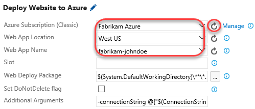

19. Set the **Web Deploy Package** to the path below. Note that you
    could also specify additional arguments, such as a connection
    string, as part of this workflow if required.

    **$(System.DefaultWorkingDirectory)/Fabrikam Development
    CI/drop/\_PublishedWebsites/FabrikamFiber.Web\_Package/FabrikamFiber.Web.zip**

20. Save the release.

    

### Task 4: Checking in a change to kick off the release workflow

1.  Return to the code browser tab and locate the path below.

    **$/FabrikamFiber/Dev/FabrikamFiber.CallCenter/FabrikamFiber.Web/Global.asax.cs**

2.  Click the **Edit** button and comment out the
    **Database.SetInitializer** call in **Application\_Start**. This
    won’t work properly in Azure, so it needs to be commented out. It
    doesn’t matter since the DB was already set up manually.

3.  Save the file to check it in.

    

4.  Return to the releases tab in the browser. If the new release
    process doesn’t show up within a minute, refresh the window or use
    the refresh button. Approve the first two requests to begin the
    Azure deployment. You’ll know the bits have been deployed to
    production when you’re asked for the post-release signoff.

    

5.  Open a browser tab to the Azure site to confirm the deployment
    worked as expected. For example, if you named your site
    fabrikam-johndoe, then the URL would be
    <http://fabrikam-johndoe.azurewebsites.net>.

    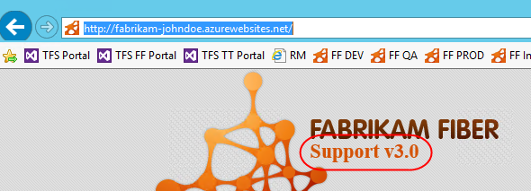

6.  Return to the releases tab and approve the release by clicking the
    icon, optionally entering a message, and clicking **Approve.**

    

7.  Now everyone can easily see that the most recent release made it all
    the way through the release pipeline and is live in the cloud.

    

### Task 5: Deploying to Azure from Visual Studio

1. While all of the automation available in Team Foundation Server provides a great “continuous integration, continuous deployment” (CICD) experience, sometimes you may still want to manually deploy a build directly from Visual Studio. And thanks to tight integration between Visual Studio and Azure,   it’s really easy to do.

2. Open a new instance of Visual Studio from the taskbar.

3. Open FabrikamFiber.CallCenter.sln from the Start Page.

   

4. We’ll continue using the support version number as our change example. In Solution Explorer, double-click FabrikamFiber.Web\Views\Shared\_Layout.cshtml to open it.

   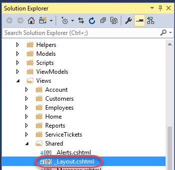

5. Locate the tag with the support version and increment it to v5.0.

   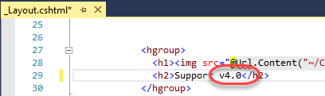

6. In Solution Explorer, right-click the FabrikamFiber.Web project and select Publish.

   

7. Since this is the first time this project is being published to Azure, we will need to set up a publish profile. Select the Profile tab and click Microsoft Azure App Service.

   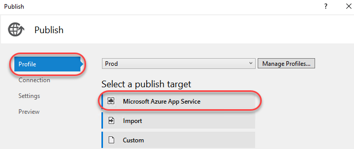

8. Since there is not yet an account associated with this instance of Visual Studio, click Add an account from the dropdown.

   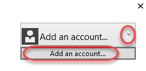

9. Sign in using the Microsoft account your Azure subscription is associated with.

10. Select the App Service created earlier and click OK.

    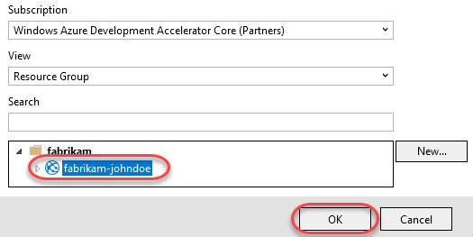

11.	The Connection tab is automatically populated with the deployment information required to push the project out to the right Azure App Service. There’s nothing to tweak here, so click Next.

    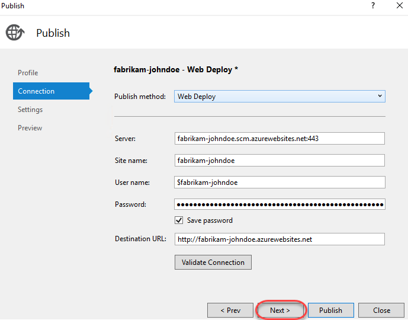

12.	The Settings tab enables you to specify the build configuration you want to deploy, as well as file publication options and settings for databases detected from Web.config. We already configured the connection string earlier, so click Next to continue.

    

13.	The Preview tab enables you to see exactly what will get pushed up to the service. Click Start Preview to see which files have changed.

    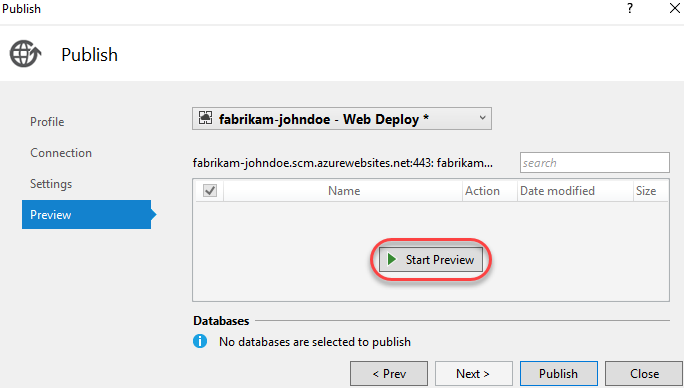

14.	There should be only one file: _Layout.cshtml. Click Publish.

    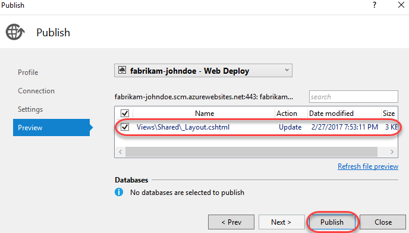

15.	You can review the publish progress in the Web Publish Activity pane at the bottom if Visual Studio. It should complete quickly since the one file being pushed is small.

    

16.	Upon completion, the integrated browser will open to the public URL. Note the new version number, which confirms the deployment was successful.

    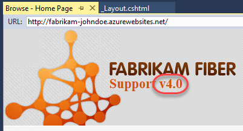

### Task 6: Working with Deployment Slots

1. Azure App Services offer deployment slots, which are parallel targets for application deployment. The most common scenario for using a deployment slot is to have a staging environment for your application to run against productions services, but without replacing the current production              application. If the staging deployment passes review, it can immediately be “swapped” in as the production slot with the click of a button. As an additional benefit, the swap can be quickly reversed in the event an issue is uncovered with the new build.

2. Return to the browser window open to the Azure portal.

3. Select the Resource groups tab from the left menu. Locate and click the fabrikam group created earlier.

   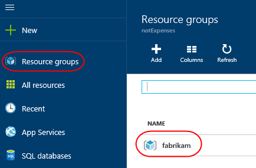

4. Click the App Service.

   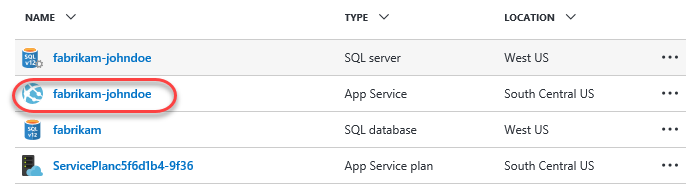

5. Select the Deployment slots tab and click Add Slot. Note that the production slot is considered a “default” slot and is not shown as a separate slot in the user experience.

   

6. Enter a Name of “staging” and select the Configuration Source that matched your existing deployment (there should be only one). Click OK to create the slot.
   
   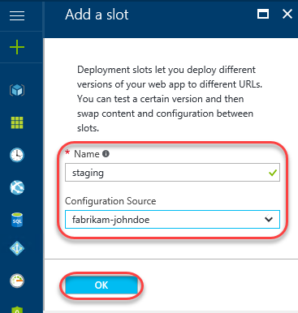

7. Return to _Layout.cshtml in Visual Studio. Update the version text to “5.0”.

   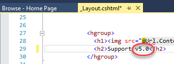

8. In Solution Explorer, right-click the FabrikamFiber.Web project and select Publish.

   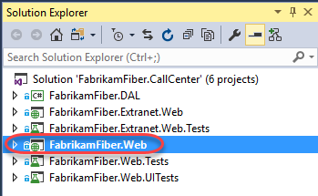

9. The new slot is treated as a unique deployment target, so we’ll need to set up a profile for it. However, your Microsoft and Azure accounts are already configured, so the experience will be even smoother. Select the Profile tab and click Microsoft Azure App Service.

   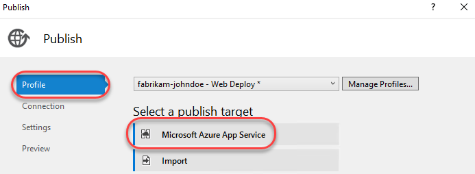

10.	Drill down to select the staging deployment slot and click OK. 

    

11.	On the Connection tab you’ll notice that the settings are very similar to the production slot, except that the text “staging” is inserted within various strings. The key place of interest is that each URL differs from the production slot by having “-staging” inserted at the end of the lowest        subdomain. For example, if your subdomain started with “fabrikam-johndoe”, then a slot named “staging” would have the URL “fabrikam-johndoe-staging”. Click Publish to deploy.

    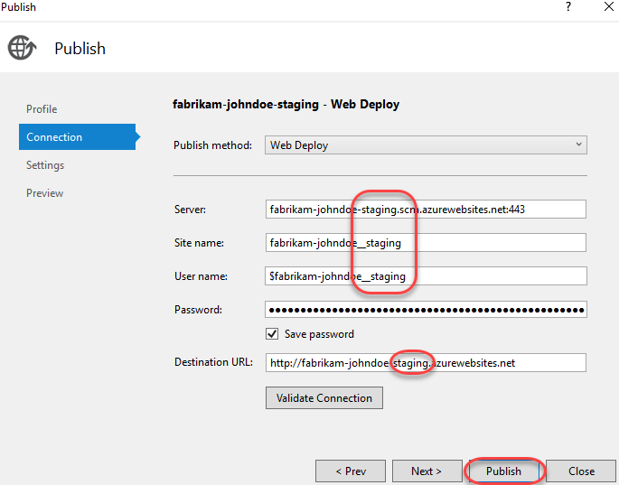

12.	Once the deployment finishes you’ll see the built-in browser navigate to the staging slot, which can be verified via the support version number.

    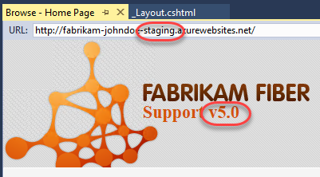

13.	However, if you take the “-staging” out of the URL and press Enter, you’ll see that the production site is still on v4.0, as expected.

    

14.	Expand the Server Explorer from the left side of Visual Studio.

    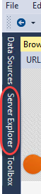

15.	Drill down into the Azure node to review all of the assets accessible from within the IDE. Note the production slot is at the default level while the staging slot is one level deeper under Slots. You can do a lot from this pane, including opening file for editing (and saving back to Azure),         reviewing logs, managing WebJobs, and more.

    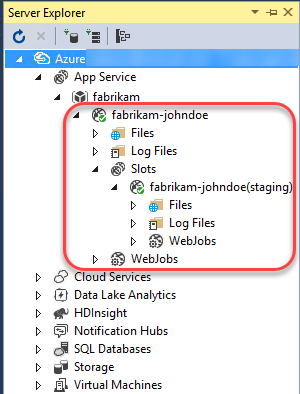

16.	Return to the browser window open to the Azure portal. Click Swap in the slots blade.

    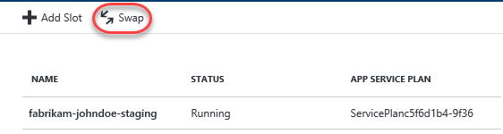

17.	The default options here are exactly what we want: to swap the production and staging slots. Click OK. Note that if your apps rely on slot-level configuration settings (such as connection strings or app settings marked “slot”), then the worker processes will be restarted. If you’re working          under those circumstances and would like to warm up the app before the swap completes, you can select the Swap with preview swap type.

    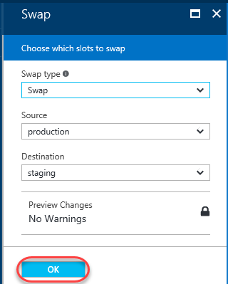

18.	Return to Visual Studio and refresh the built-in browser by right-clicking with the document and selecting Refresh. Note that you can’t F5 since that would build and run the solution.

    

19.	The production site should now show the v5.0 as expected.

    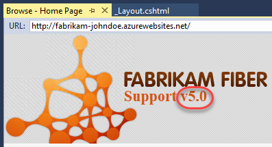

20.	You can also confirm that the staging slot is now hosting the former production build of v4.0. In the event something bad happened with the v5.0 build, you could simply run the swap again and this running build would be back in production.

    

21.	It’s important to note that while we deployed to the staging slot using Visual Studio, you could have just as easily set up CICD in TFS to deploy to the staging slot as well. There are even tasks to automate the swapping of slots, so you could set up everything you need in the release               definition.

    

   
   
