Lab version: 14.0.25123

Last updated: 2/23/2017

## Overview

The Modern Requirements Suite4TFS provides a collaborative platform
    based on ‘a single source of truth’, while automating each phase of
    your requirements lifecycle. The user interface is Microsoft Office
    or, SmartOffice4TFS, ensuring that you, and your new recruits, can
    start enjoying the benefits quickly. You can also use the browser
    based interface, inteGREAT4TFS. Microsoft’s industry leading TFS /
    VSTS is the requirements database, with optional extensions
    supporting your end to end ALM process. Whether you deploy it on
    premises or in the Azure cloud, it provides the security,
    scalability and workflow management clients’ demand; while
    supporting Agile, Waterfall or Hybrid methodologies.

In this lab, you will learn about scrum management using the Modern
    Requirements Suite4TFS modules and augmented by Team Foundation
    Server 2017 and how these tools can help you to quickly track work
    across your entire team.

## Pre-requisites

In order to complete this lab, you will need SmartWord4TFS,
    inteGREAT4TFS and the Visual Studio ALM Virtual Machine 2017  provided
    by Microsoft. For more information about the Modern Requirements
    Suite4TFS products, please visit [this
    URL](http://www.modernrequirements.com/). The information about
    acquiring and using the Visual Studio 2017 virtual machine is
    available [here](http://aka.ms/VS15ALMVM).

> **Important note:** This lab requires you to use the default state of the virtual machine, before any modifications are made to work items or source in TFS. If you followed the “Working With…” instructions, you should have a snapshot/checkpoint of the virtual machine before working with it for the first time. Apply the snapshots/checkpoints before starting this lab.

## Installing SmartWord4TFS

1. Go to the following link :
    <http://www.modernrequirements.com/application-lifecycle-management-virtual-machine/>

2. Please submit the online registration form and click submit to
    download button (refer to the screen shot).

    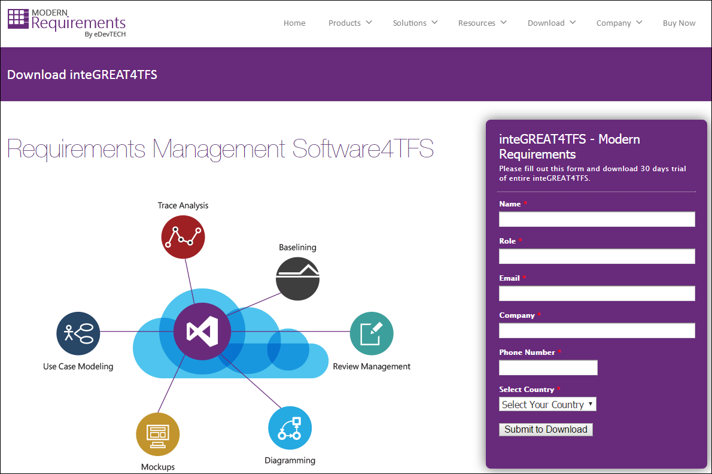

3. You will be navigated to the download page.

4. Click on **SmartWord4TFS web installer (590 KB)**.

    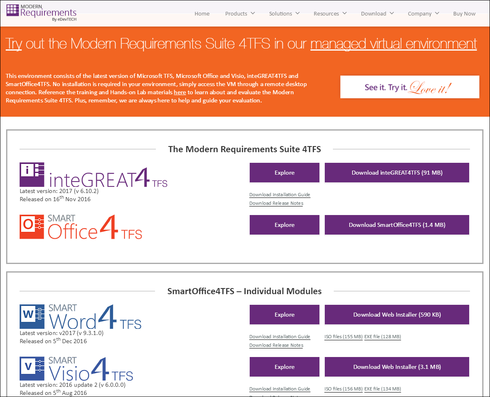

    > For system requirements [inteGREAT4TFS installation
    guide](file:///C:\Users\bsavelson\AppData\Local\Microsoft\Windows\INetCache\Content.Outlook\VG0J8XD1\inteGREAT4TFS%20installation%20guide)
    & [SmartWord4TFS installation
    guide](file:///C:\Users\bsavelson\AppData\Local\Microsoft\Windows\INetCache\Content.Outlook\VG0J8XD1\SmartWord4TFS%20installation%20guide)

5. Once the installer is downloaded click the installer to start the
    installation process.

**Installation Process**

The following screenshot shows the online installer.

1.  Run the **SmartWord4TFS.exe** file

    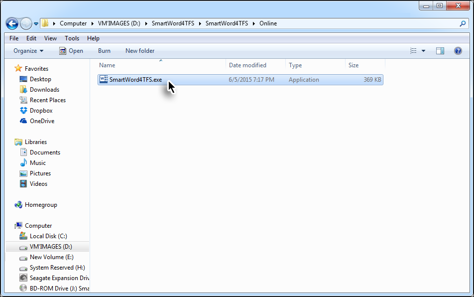

2.  Click the **Next** Button to start the installation process.

    

3.  Read the License Agreement, select **I Agree** option and click the
    **Next** Button.

    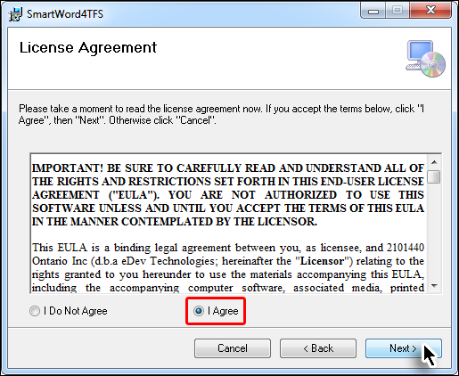

4.  Set the desired installation location and the relevant user accounts
    then click the **Next** Button.

    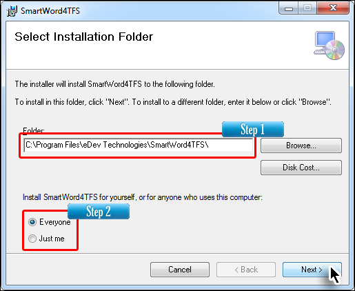

5.  Select the desired mode (**Author** or **Reviewer**) and click the
    **Next** Button.

    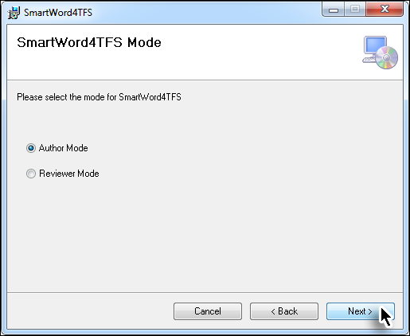

6.  Select if the templates are to be installed and then click
    **Next** Button.

    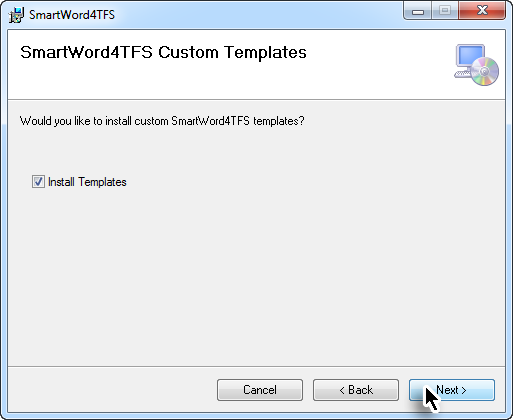

7.  Click the **Next** Button to begin copying the files onto
    your system.

    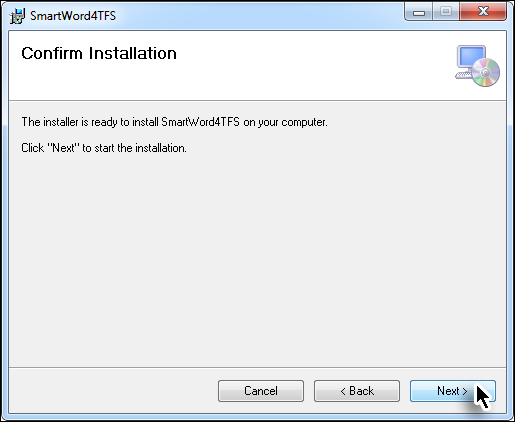

8.  The actual installation starts based on selections done in
    previous steps.

    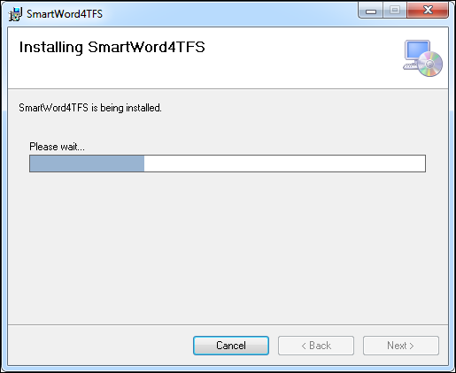

9.  Click on the **Close** Button to complete the installation process.

    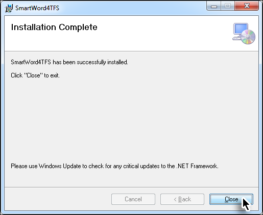

10. The **SmartWord4TFS** Tab (or **SmartWord4TFS Review** Tab if you
    chose to install the **Reviewer Mode**) can now be accessed in
    Microsoft Word.

    

    >The downloaded version provides 30 days trial period for users to evaluate the application.

11. Click the **About** option in Ribbon Bar **Activate** Button (in the
    **About** window)

    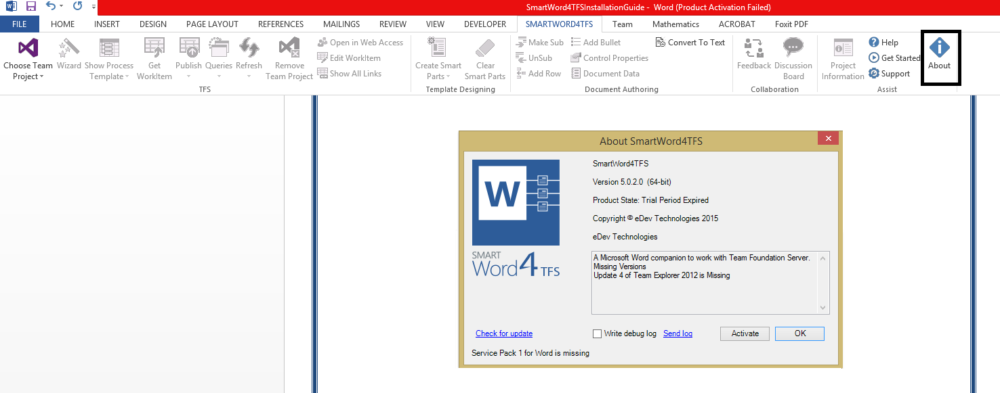

    >After submitting the online registration form you will receive the License key for 6 month duration to the provided email address. This software key is provided for non-production use only.

12. Enter the provided Activation key and click **Activate** button.

    

13. Entering a valid Activation Key activates SmartWord4TFS.

    

**Installation Process for inteGREAT4TFS**

Download the inteGREAT4TFS installer using the same process described above for SmartWord4TFS.

1. Double click the **inteGREAT4TFS 2017.exe** file.

   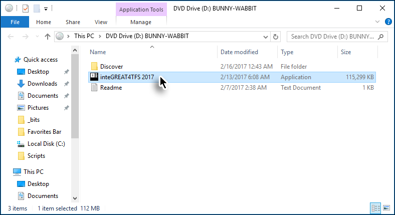

2. Select the terms and conditions agreement check box and then click
    the **Next** Button.

   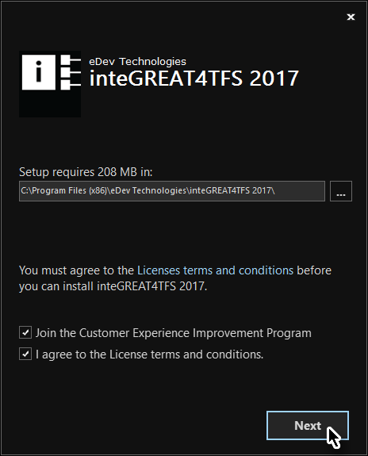

3. Enter the following Windows credentials and then click the **Next** Button.:

   > Username = **Administrator**  
   > Password = **P2ssw0rd**

   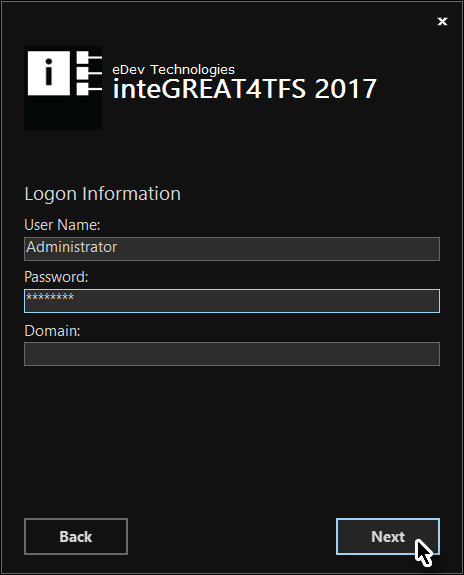

   > Application would be installed, even if incorrect windows
    credentials entered during the installation, however user will not be able to login into the application.

4. Configure **Redis Installation** options\* and click the
    **Install** Button.

   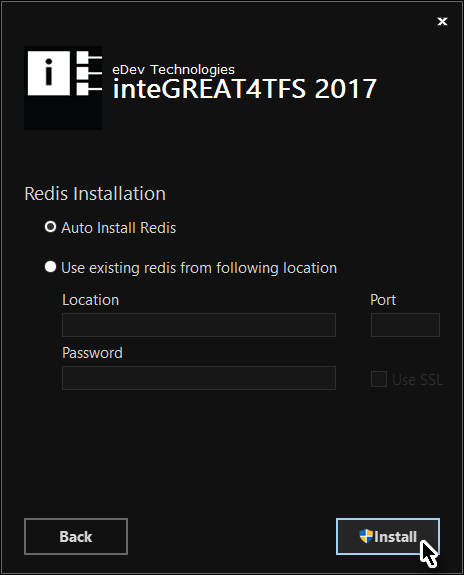

   > **Auto Install Redis** option is the recommended option if Redis is
      not already installed on the VM.
      The relevant files are installed.

   

5. Complete the Installation of **inteGREAT4TFS** by clicking the
    **Finish** Button.

    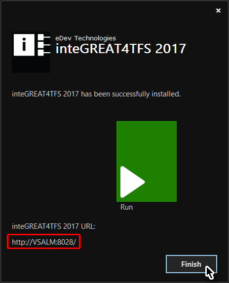

-   Please note down the Service URL (highlighted in the above images).
    This would be helpful later on.

-   This completes the installation process of inteGREAT4TFS. After
    installing all SmartOffice4TFS and inteGREAT4TFS modules we can
    proceed to the following exercises.

## Exercise 1: SmartWord4TFS

The templates created in SmartWord4TFS can be distributed to all
stakeholders enabling them to create and manage Work Items from MS-Word
in relevant Team Projects on the Team Foundation Server.

In this exercise we would use an MS-Word template\* to create new Work
Items and publish these Work Items on the Fabrikam Fiber Team Project.

>Refer to **Appendix A** at the end of this file for instructions to
create the template being used in this exercise.

### Task 1: Document Authoring in SmartWord4TFS

1. Open the Word Template (created using **Appendix A**) by
    double-clicking on it.

   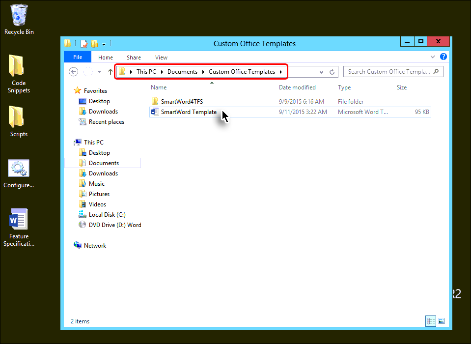

2. The template with empty Work Item Smart Parts is opened. The
    controls that are used to set Individual properties of any work item
    are called **Smart Parts**. These are used to create new Work Items
    so these can be published on the Team Project.

   

3. Click the SMARTWORD4TFS Tab.

   

4. Click the **Choose Team Project** option.

   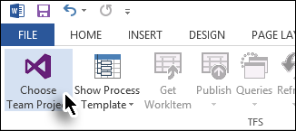

5. Choose **FabrikamFibreCollection** **Fabrikam Fiber** (Team Project)
    click the **Connect** Button.

   

6. Click inside the **Feature Title** smart part.

   

7. Enter a suitable name for the Feature Work Item.

   

   >The ID of a Work Item is automatically given by the connected Team
    Project, when that Work Item is first published on the Team Project therefore we would leave that field for the time being as it would be populated after the Work Item is published.

8. Similarly, enter values in all Smart Parts of the Work Items.

   

9. Click the **Publish** option in the Ribbon Bar.

   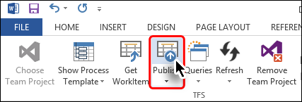

   - There is a subtle difference between **Publish** (shown here) and
    **Publish Selected** (accessed through drop down).

   - **Publish** option publishes all Work Items while **Publish
    Selected** only publishes the Work Item whose smart parts are
    selected by the user.

10. Provide any comments (if desired) and click the **Yes** Button.

    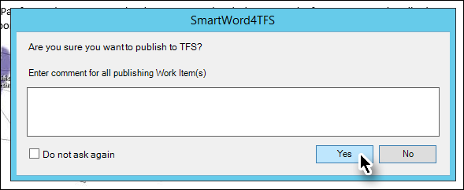

11. The Work Items are published on the Fabrikam Fiber Team Project.

    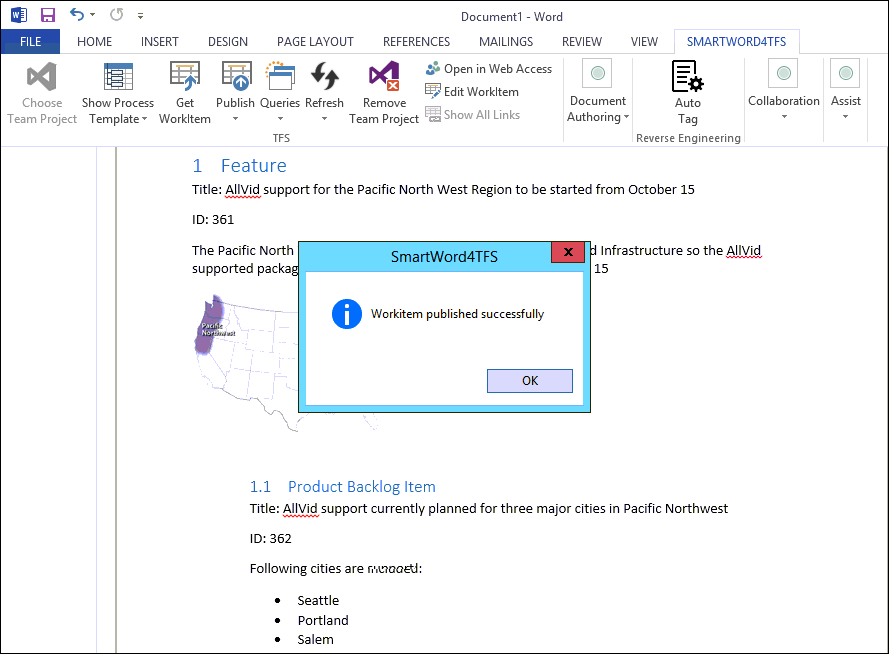

12. Now add values in the Smart Part of the Bug Work Item.

    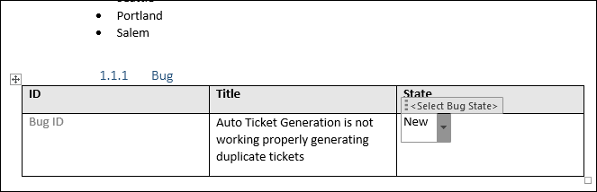

    - At this moment we have run out of Smart Parts. So far we have been
    using the Smart Parts that came with the template. What if we need
    to add more Work Items? To do this we need to **Insert Smart Part.**  
    

13. Click **Document Authoring** **Insert Smart Part** **Product Backlog
    Item** **Bug**

    

14. Add values to the new Bug Smart Parts.

    - We now have two Bug Work Items ready to be published. However, in
    order to elaborate the Publish Selected functionality, we would
    publish only one. This is done by first selecting the Smart Parts of
    the desired Bug Work Item.

    - To select the Smart Parts of the desired Work Item, a user may
    select all of the relevant Smart Parts, partially selecting any one
    Smart Part, or even just placing the cursor in any of the Smart
    Parts of that Work Item would also suffice.

15. Place the cursor inside any of the Smart Parts of the Bug that we
    created in Step 6.

    

16. Click **Publish** **Publish Selected** option in the Ribbon Bar.

    

17. The desired Bug is published on the Fabrikam Fiber Team Project.

    

    - The last step is to check the published Work Items on the
    Team Project.

18. Run **Visual Studio 2017**.

19. Run the **All Bugs** query.

    

    - The Bug Work Item can be seen in the Team Project. Similarly we can
    run relevant queries, to check other Work Items on the Team Project
    that we published before the Bug Work Item.

    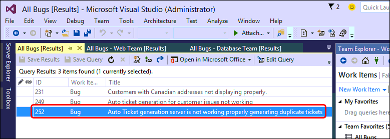

    

    

    - The image depicts SmartWord4TFS’ support of Rich Content Data to be
    published on the Team Project.

### Task 2: Instant Document Reporting with SmartWord4TFS using a Template

You will learn how to update Work Items on the Team Project while staying in Word.

1. Log in as **Julia Ilyiana** (VSALM\\Julia). All user passwords are
    **P2ssw0rd**.

2. Start MS-Word and open the **Product Backlog Item List.dotx** from
    the **Documents** folder.

3. All necessary work to populate the file with Product Backlog Items
    is already in place in the document. The report is generated by a
    single click, as shown in the document.

   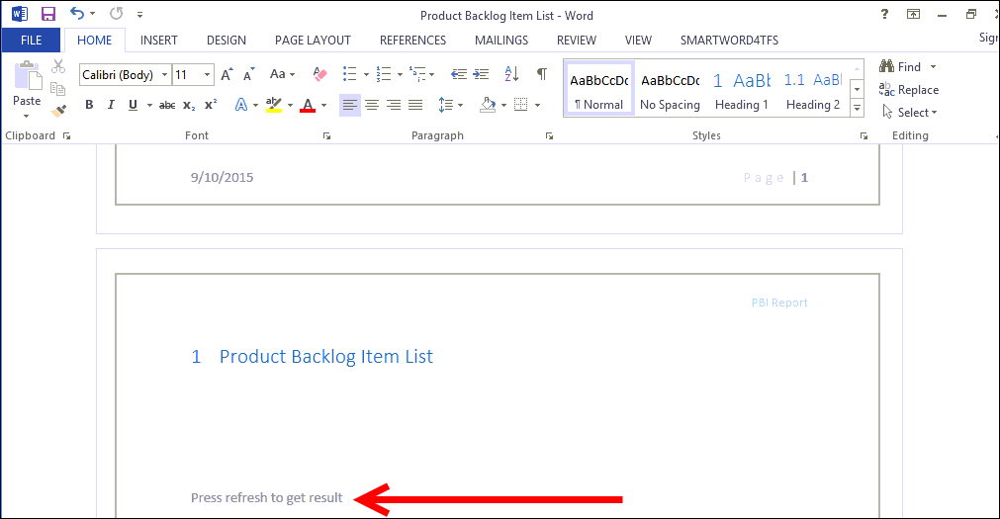

4. Click the SMARTWORD4TFS Tab.

   

5. Click the **Refresh** option.

   

6. Refreshing the document populates it by fetching all the PBIs from
    Fabrikam Fiber Team Project. Similar documents can be created to
    generate reports about desired Work Items. For more details contact
    [Modern Requirements](http://www.modernrequirements.com/contact/).

   

   - Now we will update one of our PBIs and publish the updated Work Item
    on the Team Project.

7. Click inside the last Product Backlog Item and update its
    description as shown in the image.

   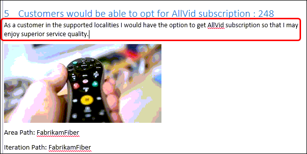

8. Click the **Publish Publish Selected** option.

   

   - This option publishes the updates on our Fabrikam Fiber
    Team Project.

9. Run **Visual Studio 2017**.

10. Run the relevant query and open the PBI that we updated in Word.
    We can see that our PBI has been updated on the Team Project.

    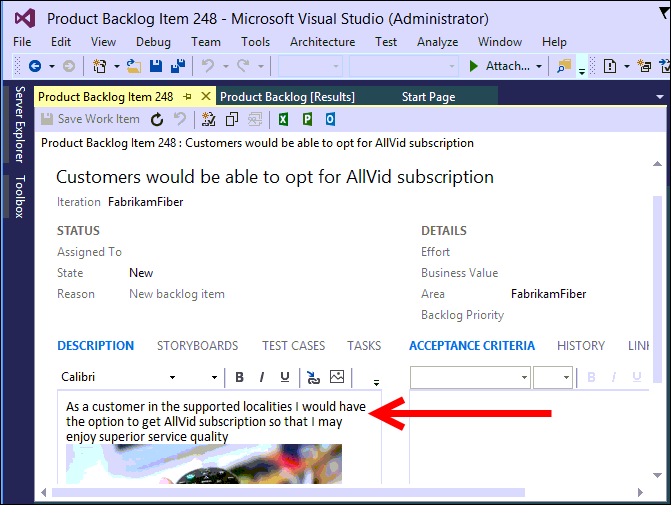

### Task 3: Document Reporting using Queries

In the previous exercise we used a ready-made template to create an
instant report. This exercise explores the query option to create a
report with more freedom in what to include in the report

1. Log in as **Julia Ilyiana** (VSALM\\Julia). All user passwords are
    **P2ssw0rd**.

2. Start MS-Word and create a new document.

3. Format the document as required including header/footer, title page,
    document control information etc.

   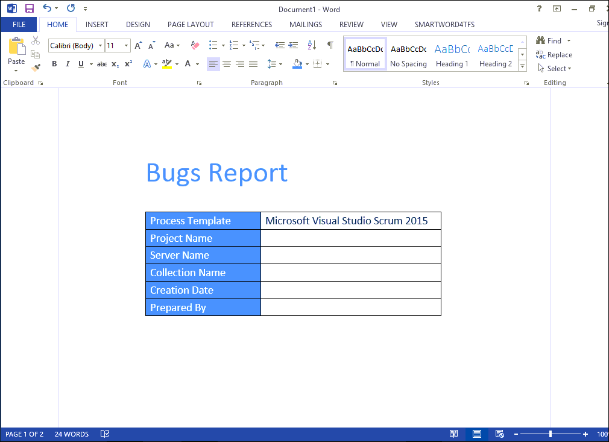

4. Click the **SMARTWORD4TFS** Tab.

   

5. Click the **Choose Team Project** **Team Project** option.

   

6. Choose **FabrikamFibreCollection** **Fabrikam Fiber** (Team Project)
    click the **Connect** Button.

   

7. Click the **Queries** option and select the desired query from the
    drop-down menu.

   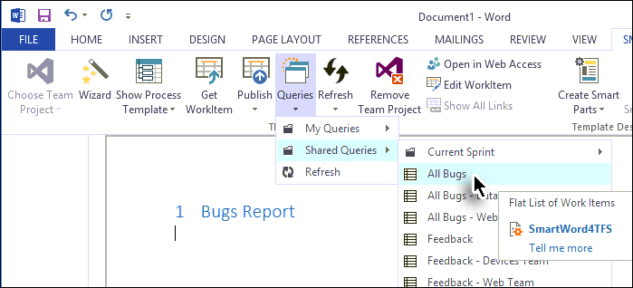

8. The Query Dialogue Box appears with the following information and
    options:

   -  **Query Name** (i.e. the selected Query)

   -  **Query Type** (i.e. Is the query a simple list or a tree)

   -  Work Item Count

   -  **Without smart content** Check Box: If selected the query would be
    inserted as tables with plane text. The values in the table would
    not be smart content.

   -  **Insert at cursor position** Check Box: If selected the query would
    be inserted at the current cursor location, otherwise at the end of
    the document.

   -  **Insert query block only** Check Box: If selected; an empty query
    control is added in the document without any Work Items (refer to
    the image at the bottom of the page). The query control can be
    refreshed later, to be filled with the relevant Work Items. *The
    Template we used in Exercise 2 was created by using this option.  

    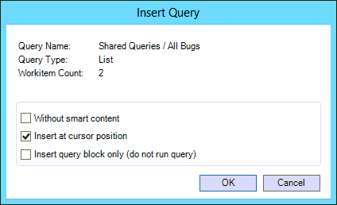

9. Enable only the middle check box while leaving the other two
    checkboxes un-selected. Then click the **OK** Button.

   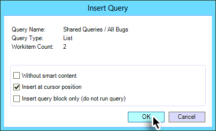

10. The result of the query is added in the document.

    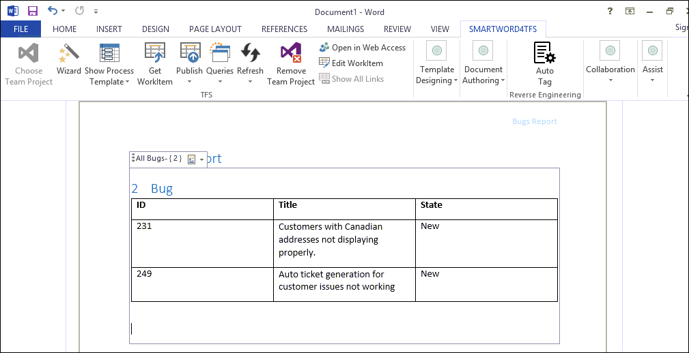

## Appendix A: Designing a SmartWord4TFS Template using Wizard

In this appendix you will learn how to create a new SmartWord4TFS
template from scratch using the Wizard.

- The Wizard makes the template designing process quite easy even for
    novice users. Another way is to create the template using individual
    controls but that is for advanced users and hence not discussed in
    this exercise.

1. Log in as **Julia Ilyiana** (VSALM\\Julia). All user passwords are
    **P2ssw0rd**.

2. Start MS-Word and create a new document.

3. Format the document as required including header/footer, title page,
    document control information etc.

    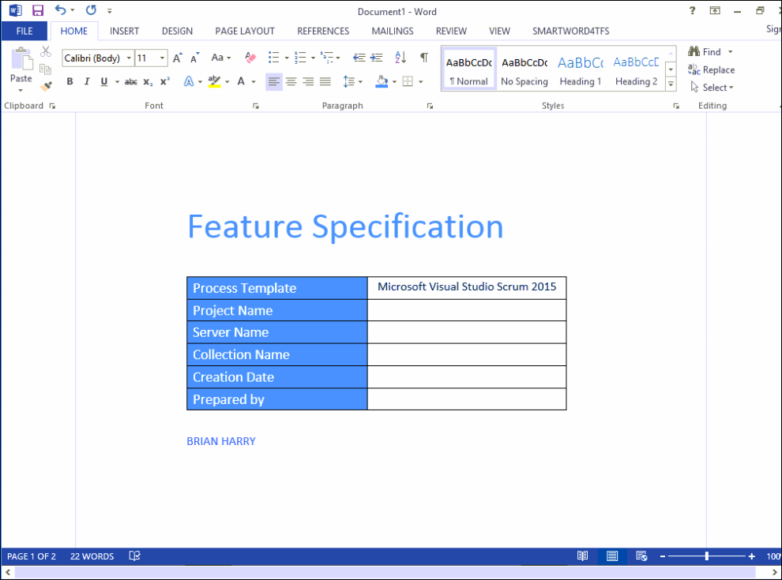

4. Click the **SMARTWORD4TFS** Tab.

    

5. Click the **Choose Team Project** **Team Project** option.

    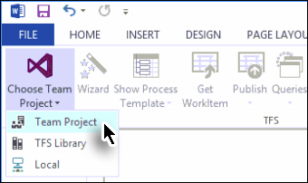

6. Choose **FabrikamFibreCollection** **Fabrikam Fiber** (Team Project)
    click the **Connect** Button.

    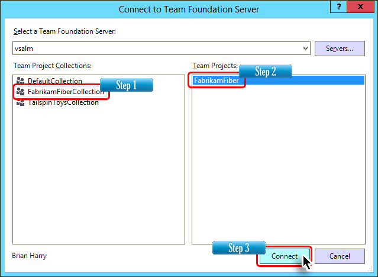

7. Click the **Wizard** option.

    

8. Click the **Create section** Button (at top left of the window).

    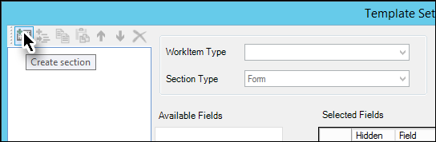

9. Enter a suitable name for the section.

    

   - This section would serve as a root node and would be used to show a
    certain type of Work Item. We could have sub-section(s) to display
    the Work Items in the desired hierarchy.

10. Select the desired Work Item Type.

    

11. Select the desired Section Type, to determine how the Work Item
    would be displayed in the template/document.

    

12. Select the desired field from the available list and include it in
    the Smart Part using the arrow button.

    - Users can select multiple fields by holding down the **Ctrl** key
    and clicking all the desired fields from the list.

    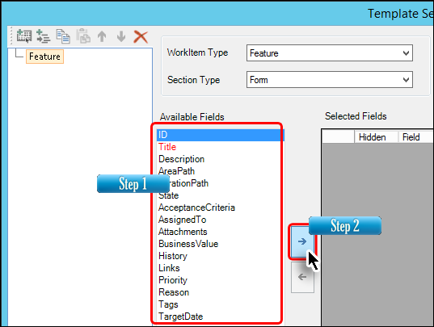

13. Arrange the selected fields in the desired order (using
    arrow buttons) and customize them (if desired).

    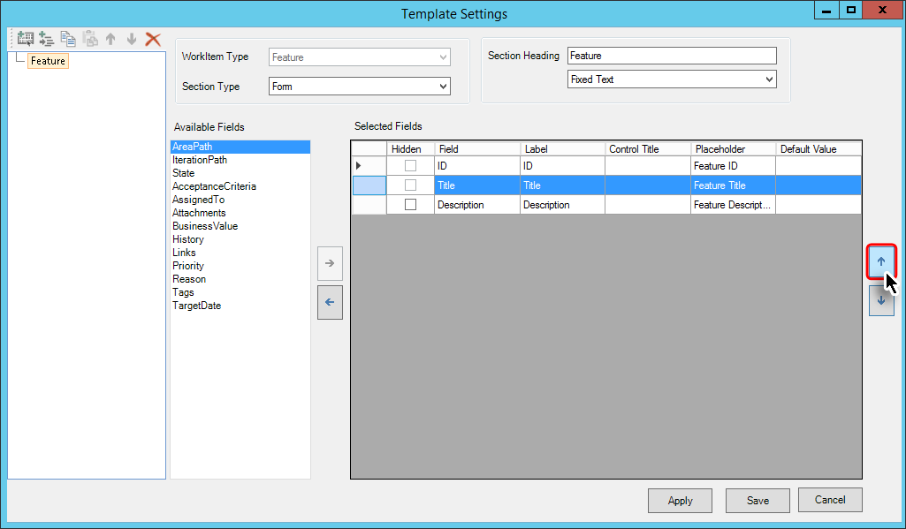

14. Users can make a selected field to be hidden, using the
    relevant checkbox. For the Hidden fields, users have to provide
    corresponding default values. Hidden field do not appear in the Word
    document, however their default values are published automatically
    on TFS (along with other normal fields) when users perform a
    **Publish** command.

    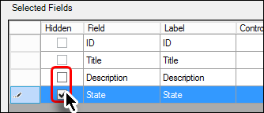

    >**Note** that not every field can be a hidden field. For such fields,
    the relevant check boxes remain disabled as evident from the **ID**
    and **Title** check boxes shown in the above image.

15. Give a heading for the selected fields as you want it to appear in
    the template/document. The Heading could be given using Section
    Heading or selected from the drop down control.

    

    - This completes the formatting of a Work Item node that started with step 9

16. Now click the **Create Sub Section** Button (at top left of
    the window).

    

17. Enter a suitable name (e.g. PBI) for the sub section, as we did for
    the section in step 9.

18. Repeat Step 9 to 14 with the sub section, this time formatting the
    node for **Product Backlog Item**.

    - During the course of creating this guide we have designed the
    template with the following section hierarchy:

    

19. Click the **Apply** Button to save the changes and complete the
    template creation process.

    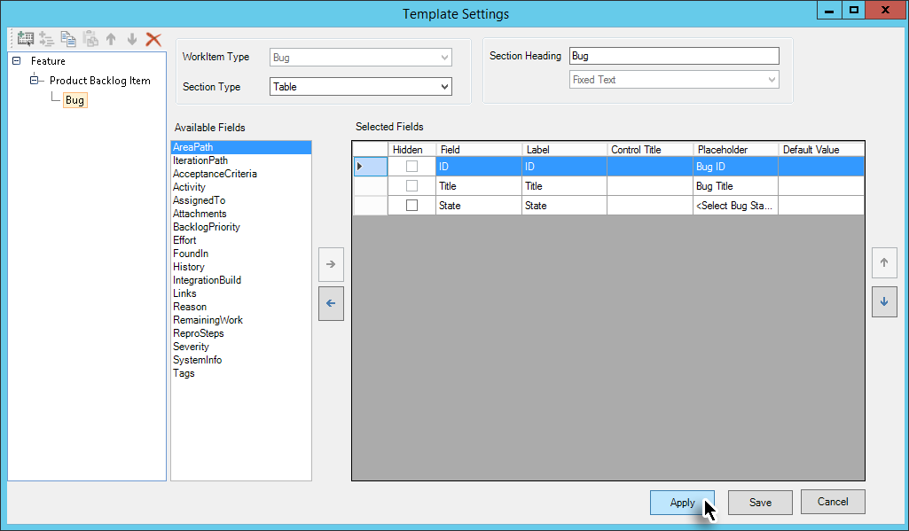

    - This completes the template creation process. The hierarchy of nodes
    becomes visible in the document as shown in the following image. Now
    we only need to save the template.

    

20. Save the document as a template (with .dotx extension) to complete
    the template creation process.

## Exercise 2: Traceability Management with inteGREAT4TFS

In this exercise you will learn how to create an Intersection Matrix
using the Trace Analysis module of inteGREAT4TFS.

inteGREAT4TFS is an online application that complements
    SmartOffice4TFS in managing Team Projects. inteGREAT4TFS consists of
    many distinct modules such as: **Trace Analysis**, **SmartOffice
    Library**, **Simulation, Diagram, Use Case,** **Review** and
    **Baselining**. In this HOL, we would be using the **Trace
    Analysis** module only.

### Task 1: Accessing inteGREAT4TFS and Creating an Intersection Matrix

1. Log in as **Administrator** with the password **P2ssw0rd**.

2. Start Internet Explorer.

3. Access the following URL: **VSALM:8080**
   
   

4. The Login Page for inteGREAT4TFS is displayed in the browser.

   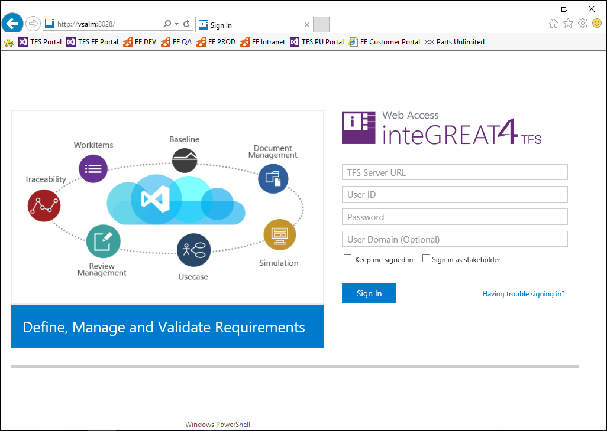

   - Following login details are to be used:

   - TFS Server URL: [**http://VSALM:8080/tfs**](http://VSALM:8080/tfs)

   - User ID: **Administrator**  
      Password: **P2ssw0rd**

5. Enter the login details and click the **Sign In** Button.

   

6. Enter a valid key (if provided) to activate OR use the
    **Trial** option.

   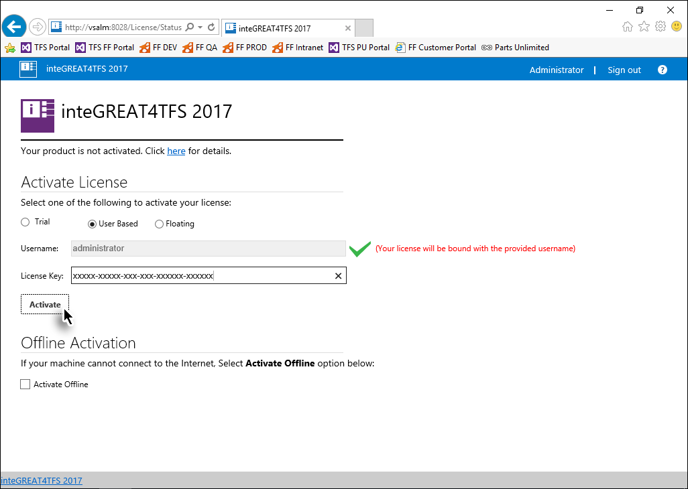

   - Home page is displayed.

7. Click the **Browse** link.

   

8. Expand **FabrikamFibreCollection** node select **Fabrikam Fiber**
    (Team Project) click the **Navigate** Button.

   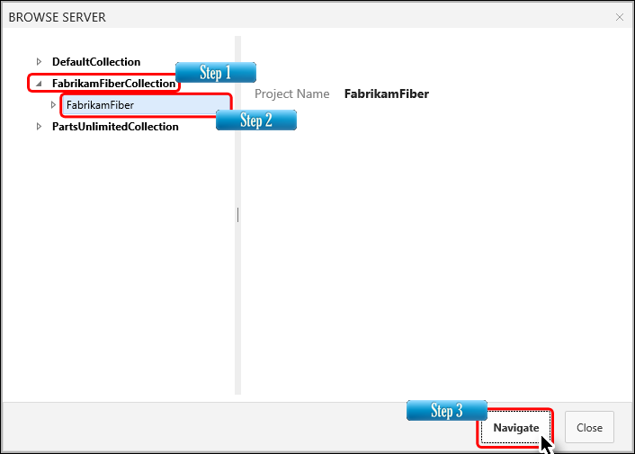

9. Upon successful connection, the Dashboard of the selected Team
    Project (**Fabrikam Fiber**) is displayed.

   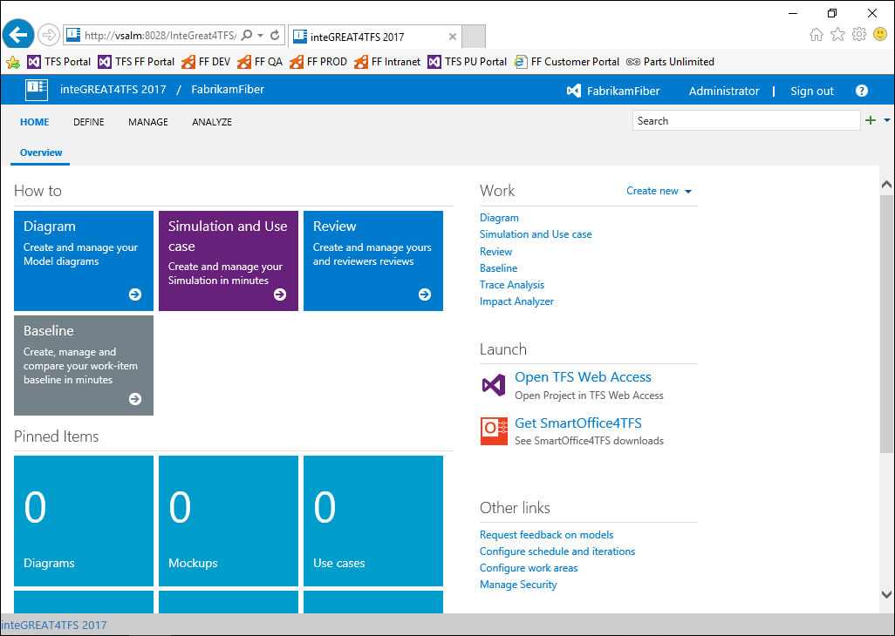

   **Dashboard in inteGREAT4TFS**

   **Dashboard** is the place where the user gets useful information
    about the team project. It also leads the users to the desired
    module in inteGREAT4TFS. Users can select their desired module in a
    number of ways. Since we would be using the **Trace Analysis**
    module in this exercise, we would select it.

10. Select the **Trace Analysis** link from the highlighted links shown
    in the following image.

    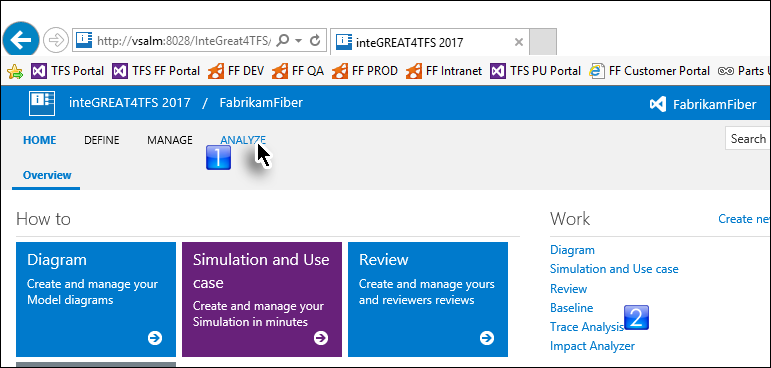

    - The landing page of the Trace Analysis module is displayed.
    Originally it would be empty since we have not created any
    traceability as of yet.

11. Click **New** and then **Traceability** options from the drop down.

    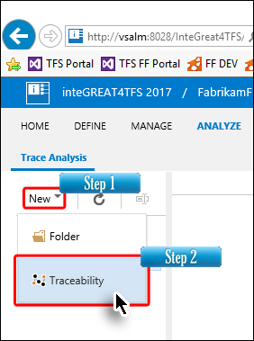

12. Enter a suitable name for the Intersection Matrix and click the
    **OK** Button.

    

13. Clicking the **Next** button takes us to the Editor page where we
    configure the settings to create the Intersection (and also
    the Horizontal) Matrix.

14. The Intersection Matrix can be created as **Work Item Type** or
    **Saved-Query Type**. In this lab we will create the matrix as Work
    Item Type.

15. The Work Item Type gives more control to user enabling him to choose
    the desired Work Item instead of pre-saved queries. In the
    Saved-Query type, users can only select those Work Items for which a
    relevant query exists in the selected Team Project.

16. Set the Area and Iteration Path as **Fabrikam Fiber** (if not
    already selected).

    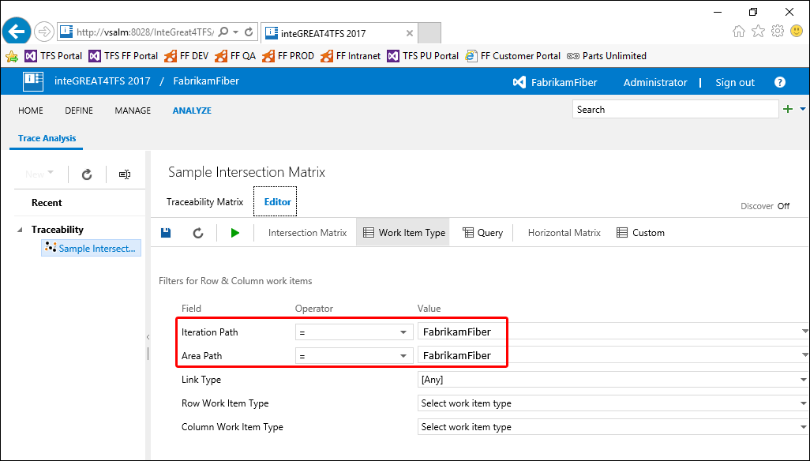

17. Select the desired Link Type.

    

18. Select the desired Row Work Item Type.

    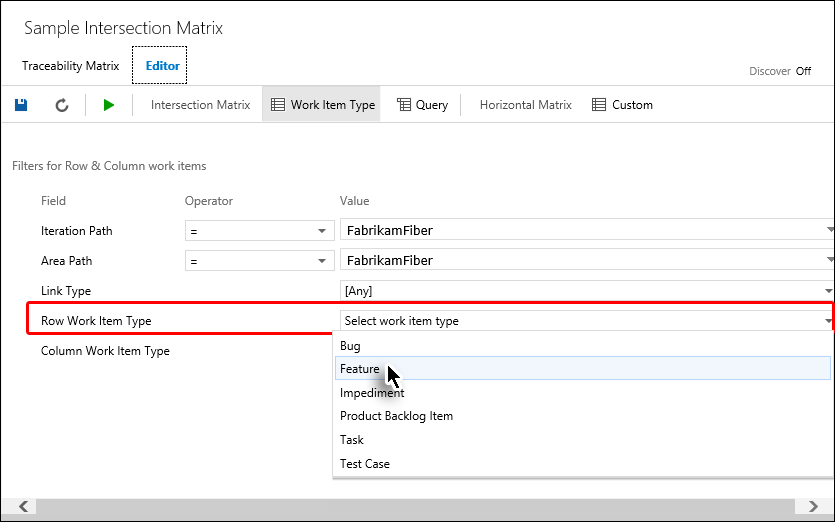

19. Similarly, select the desired Column Work Item Type.

    

20. Now click the **Run Query** option in the Toolbar.

    

21. The Intersection Matrix is generated.

    

22. To view the matrix in full screen mode, click the **Full Screen**
    Button at the top-right side of the matrix.

    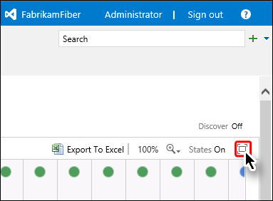

23. The Matrix is displayed in Full Screen Mode. You can also adjust the
    Zoom Ratio to view more information simultaneously.

    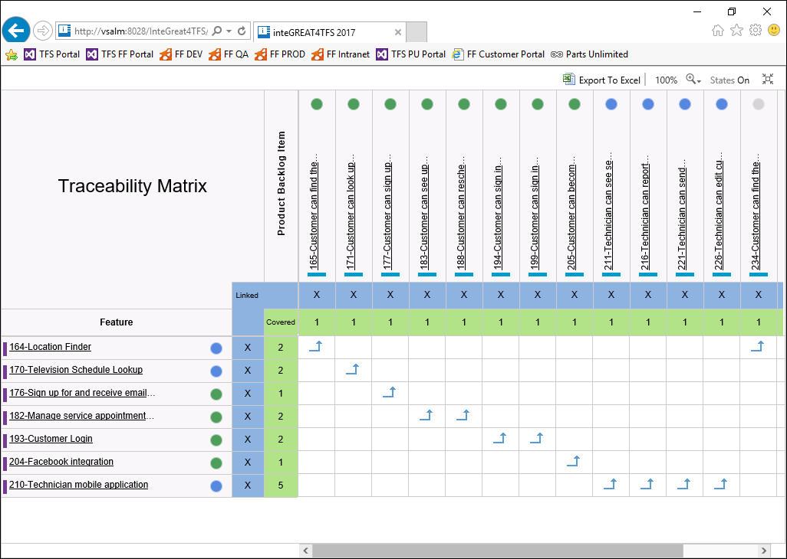

24. To exit from the Full Screen Mode click the same button once again.

    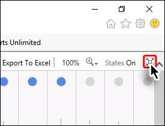

### Task 2: Adding/deleting relationships in Intersection Matrix

In this exercise you will learn how to add or remove relationships in
the Intersection Matrix.

1. The arrows in the intersection cell of the matrix denote that a relation exists between corresponding Work Items of the row
   and column.

   

2. All types of relationships are grouped into three link types. The
    following table sums up the legends used.

   

   

   

**Adding a Relationship**

1. Invoke **Trace Analysis** module from Dashboard.

2. Create / open an Intersection Matrix.

3. Determine the intersection cell for creating a relationship between
    corresponding Work Items.

   

4. Place the mouse over the intersection cell.

   - The cell would show a + sign.

   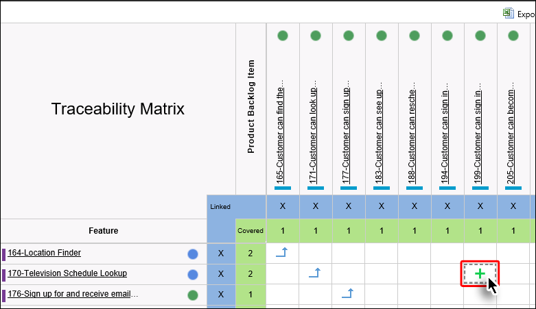

5. Click the + sign.

6. Select the desired type of relationship.

   

7. Click the **OK** Button.

   

8. The relationship is created in the target cell of the
    Intersection Matrix.

   

The relationship does not only show-up in the matrix. It can also be
seen using Web Access or Visual Studio

**Deleting a relationship**

Deleting the relationship is very similar to how we created the relationship.

1. Determine the intersection cell for deleting relationship between
    corresponding Work Items.

2. Place the mouse over the intersection cell.

   - The cell would show a - sign.

    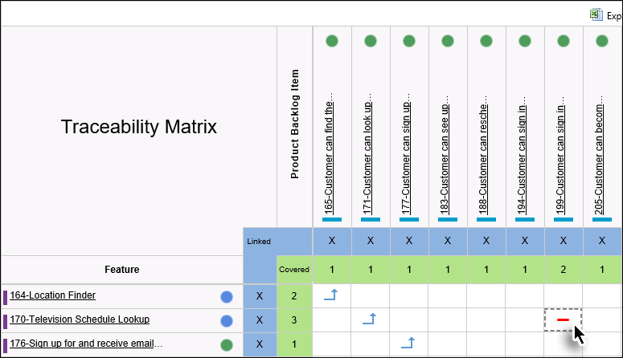

3. Click the - sign.

4. Click the **OK** Button.

    

5. The relationship is deleted.

    

### Task 3: Editing Work Items

In this exercise you will learn how to edit Work Item properties (apart
from link/relationship property that we have already discussed in
previous exercise).

1. Invoke **Trace Analysis** module from Dashboard.

2. Create / open an Intersection Matrix.

3. Now place the mouse over the desired Work Item.

   

4. Click the **Edit** icon in the popup window.

   

5. Edit the desired properties of the Work Item and click the
    **Save** Button.

   

6. Close the popup window.

   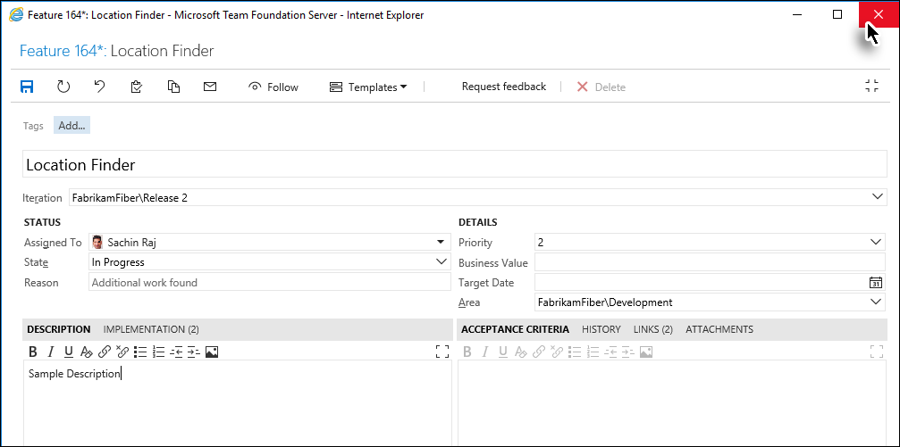

7. The changes to the Work Item are saved.

### Task 4: Creating a Horizontal Matrix

In this exercise you will learn how to create a Horizontal Matrix. 

The Horizontal Matrix shows what are the relations of a particular type of Work Item, and what are the relations of those relations,
and so on (up-till level 3).

1. Invoke **Trace Analysis** module from Dashboard.

2. Click **New** and then **Traceability** options from the drop down.

   

3. Enter a suitable name for the Horizontal Matrix and click the **OK** Button.

   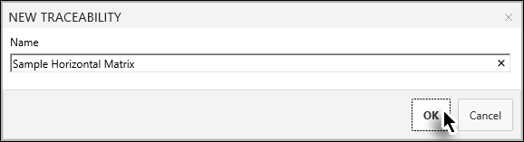

   - Clicking the **Next** button takes us to the Editor page where we configure the settings to create the Horizontal (and also the Intersection) Matrix.

4. Click the **Custom** option.

   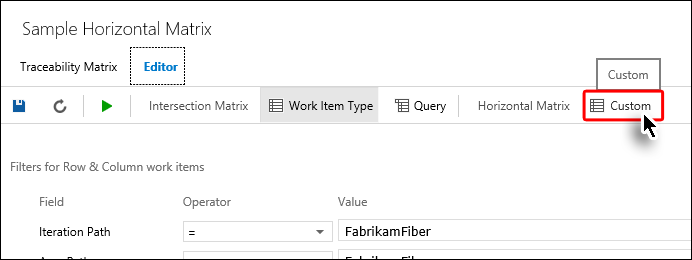

5. Select the desired **Area** and **Iteration Path**.

   

6. Select the relevant Work Item for Column 1.

   

   The Column 1 Work Item tells inteGREAT4TFS to show the list of all the Work Items of the selected type.

   - The Column 2 Work Item tells inteGREAT4TFS to show the list of
    selected type of Work Items that are linked with the Column 1
    Work Items. Similar principle is followed for Colum 3 & 4 Work Items

   - If a Column 1 Work Item has no relation with Column 2 Work Items but
    has a link with Column 3 or 4 Work Item(s) then it is also shown
    bypassing Column 2 Work Item.

   - Selecting Column 1 Work Item is mandatory while all other columns
    are optional.

7. Similarly select the relevant Work Item(s) for additional Columns
    (if desired).

   

8. Click the **Run** Button in the Toolbar.

   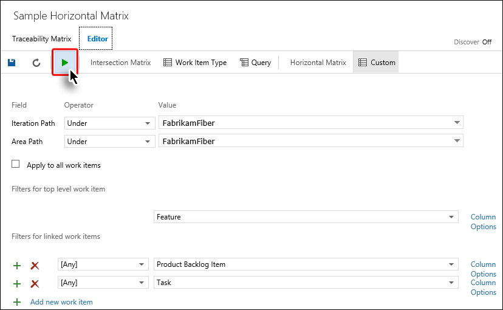

9. The Horizontal Matrix is generated and displayed.

   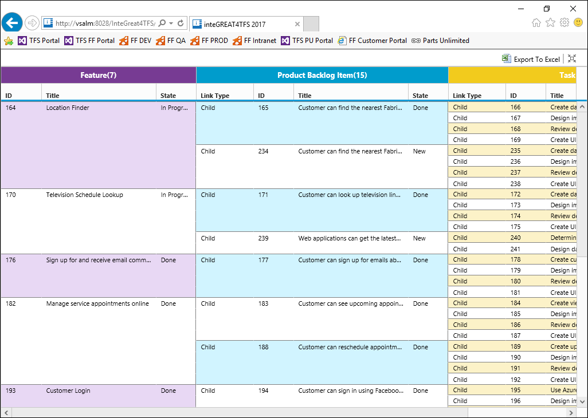

### Task 5: Export to Excel

In this exercise you would learn how to export the desired type of matrix (Intersection or horizontal) to MS-Excel.

1. Invoke **Trace Analysis** module from Dashboard.

2. Create / open the desired type of matrix.

3. Click the **Export To Excel** option in the Mini Toolbar.

   

4. The Excel file is created.

   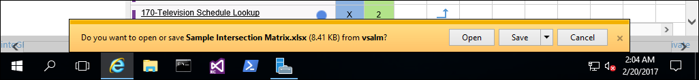

5. The file can now be opened in MS-Excel using **Open** or **Save**
    option as desired.

   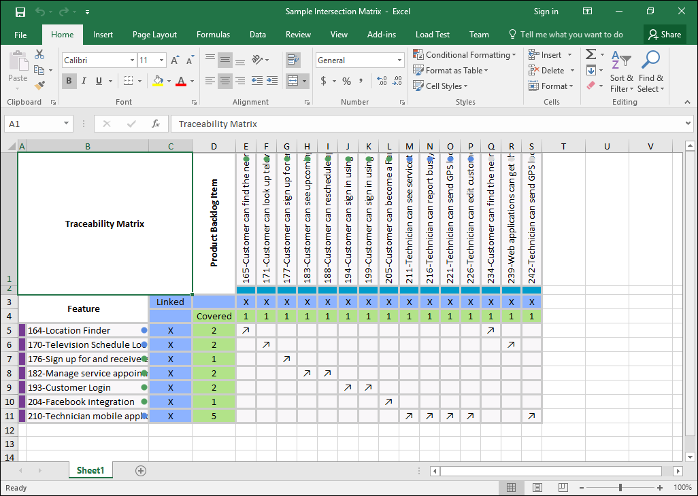

## Exercise 3: Baseline Management with inteGREAT4TFS

In this exercise you will learn how to access inteGREAT4TFS and create a baseline using it.

inteGREAT4TFS is an online application that complements
    SmartOffice4TFS in managing Team Projects. inteGREAT4TFS consists of
    many distinct modules such as: **Trace Analysis**, **SmartOffice
    Library**, **Simulation, Diagram, Use Case,** **Review** and
    **Baselining**. In this hands on lab, we would be using the
    **Baselining** module only.

### Task 1: Accessing inteGREAT4TFS and creating a baseline

1. Log in as **Brian Harry** (VSALM\\Brian). All user passwords are
    **P2ssw0rd**.

2. Start Internet Explorer.

3. Access the following URL: **VSALM:8028**

   

4. The Login Page for inteGREAT4TFS is displayed in the browser.

   

   Following login details are to be used:

   - TFS Server URL: [**http://VSALM:8080/tfs**](http://VSALM:8080/tfs)

   - User ID: **Administrator**  
     Password: **P2ssw0rd**

5. Enter the login details and click the **Sign In** Button.

   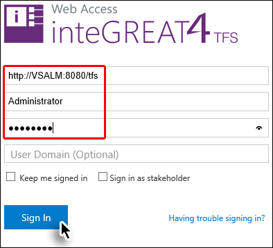

   - Home page is displayed.

6. Click the **Browse** link.

   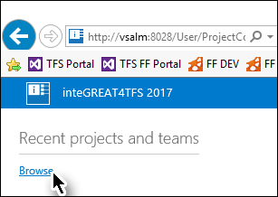

7. Expand **FabrikamFibreCollection** node select **Fabrikam Fiber**
    (Team Project) click the **Navigate** Button.

   

8. Upon successful connection, the Dashboard of the selected Team
    Project (**Fabrikam Fiber**) is displayed.

   

   **Dashboard in inteGREAT4TFS**

   **Dashboard** is the place where **the** user gets useful
    information about the team project. It also leads the users to the
    desired module in inteGREAT4TFS. Users can select their desired
    module in a number of ways. Since we would be using the
    **Baselining** module in this exercise, we would select it.

9. Select the **Baselining** link from the highlighted links shown in
    the following image.
 
   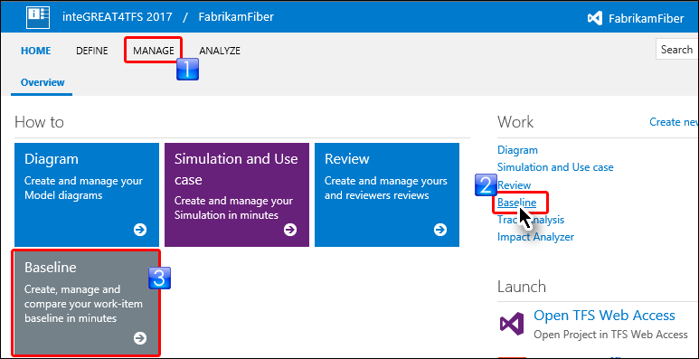

10. In case **Manage** hub is used to invoke the module, user has to
    additionally select the Baseline option afterwards.

    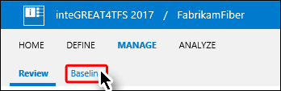

11. The landing page of Baselining module is displayed. Originally it
    would be empty since we have not created any baseline as of yet.

12. Click **New** and then **Baseline** options from the drop down.

    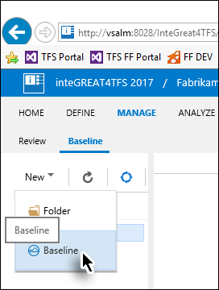

13. Enter a suitable name for the baseline; provide a description and
    click the **Next** Button.

    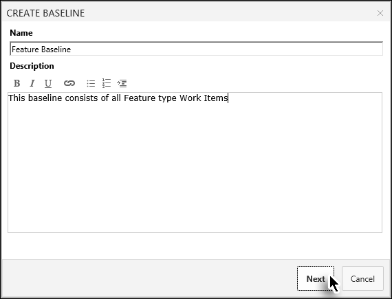

14. Clicking the **Next** button takes us to the query window where we
    have to search for the Work Items that we want to include in
    the baseline. We can search based on saved queries, IDs, full or
    part of the name.

15. Select the desired query and click the **Find** Button.

    

16. Select the desired Work Items from the query result and click the
    Add Work Items Button.

    

17. The Work Items window is closed and the added Work Items are listed
    in a new page. At this moment we have created a list of Work Items
    that are ready to be included in our baseline. However the baseline
    itself has not yet been created. This extra step helps users to
    include additional Work Items, remove unwanted ones, or edit them
    before finalizing the baseline.

18. Click the Save Button.

    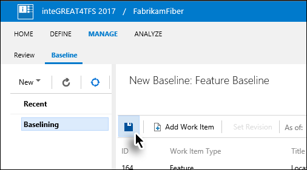

19. The baseline is created

    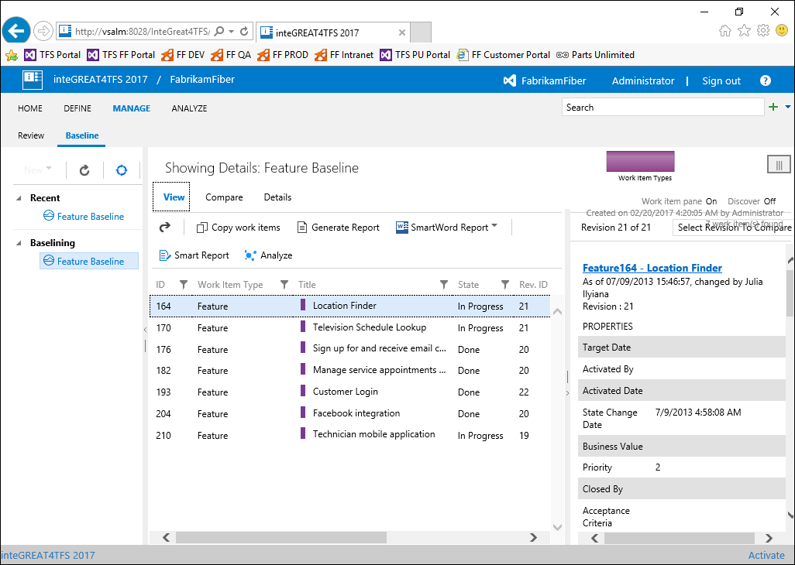

### Task 2: Generating Baseline Reporting

A Baseline Report is created for a particular baseline. It contains details about the Work Item it contains.

1. Invoke the **Baselining** module from Dashboard.

2. Click the desired baseline in the Baseline Explorer Panel under
    Project Baselines.

   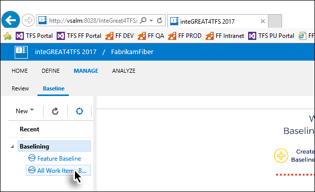

3. Click the **Generate Report** option in the toolbar.

   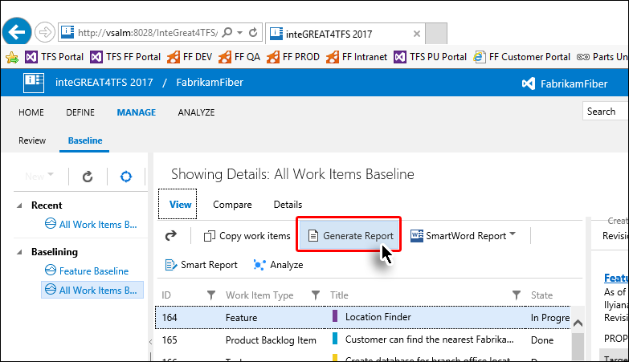

4. The report is generated and can be opened in Microsoft Word.

   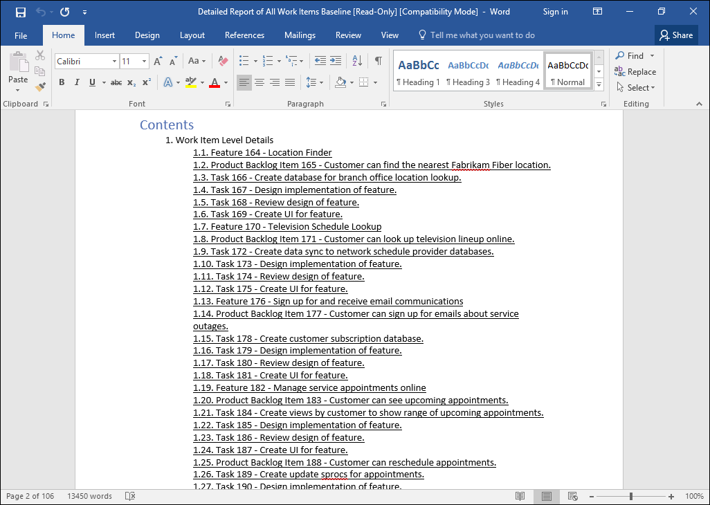

### Task 3: Comparing Baselines

In this exercise you will learn how to compare two baselines and create a difference report.

1. Invoke the **Baselining** module from Dashboard.

2. Open the desired baseline using the Baseline Explorer Panel.

3. Now click the **Compare** Tab (below the baseline’s name in the Main Panel)

   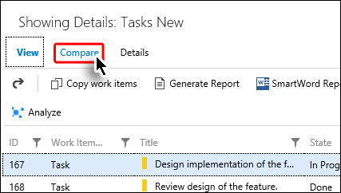

4. Click on the downward arrow in the Main Toolbar.

   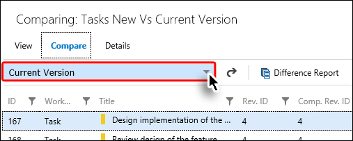

5. Select the desired baseline to compare with the current baseline

   

6. The comparison between two baselines is shown in the Grid. The Work
    Items that were updated are mentioned as Changed in the “**Comp.
    Status”** column (highlighted in the image).

   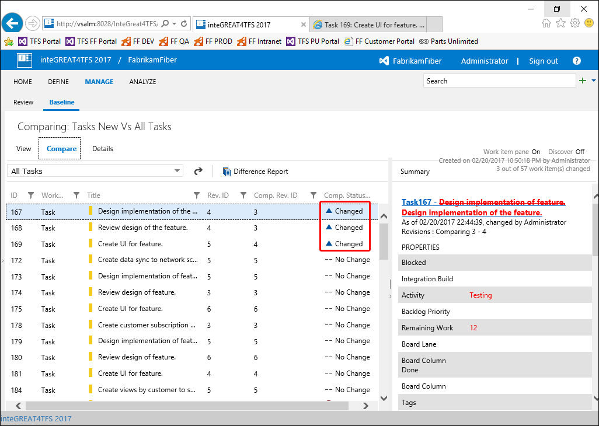

7. The actual updates in the selected Work Items are shown in the
    **Work Item Details Panel** (at the right hand side of the window).
    If the difference is not evident, then click the **Summary** Button
    at the top right of the Work Items Details Pane. This would show
    only the differential values in the pane.

8. To switch to the **Summary Mode** (for easy viewing of updates),
    click the **Summary** option in the **Work Item Details Panel**.

   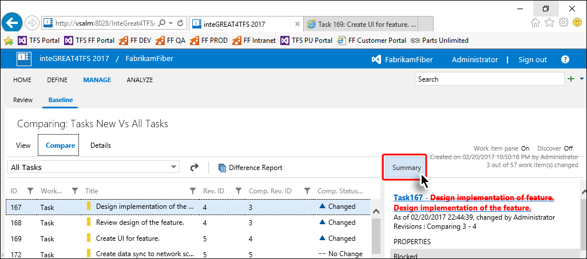

9. The **Work Item Details Panel** now shows only the values that
    were updated.

   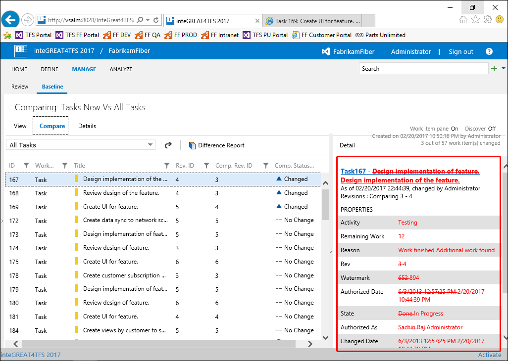

10. Click the **Difference Report** option in the Main Toolbar.

    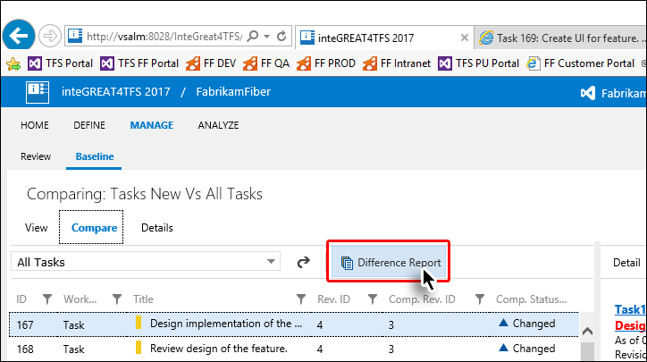

11. Enter required information and click the **Generate** Button.

    

12. The Difference Report is created in MS-Word format. Save or Open the file to complete the process.

    

    

### Task 4: Copying Baselines

In this exercise you will learn how to copy a baseline (or its Work
Items) to create a new baseline. The copied baseline can be pasted into
the same team project or into another project. In both cases the process
is same, with only change in the target team project option.

1. Open the desired baseline.

2. Click the **Copy Work Items** option in the Main Toolbar.

   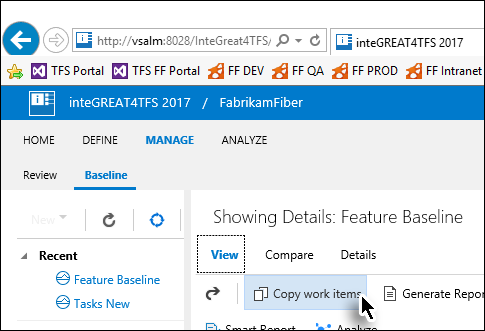

3. The Copy Work Item Window appears. Its options are divided under three sections as marked in the image.

   

4. The Team Project option (in the Target Team Project section) tells where the baseline will be copied. Into the same team project or
   into another one, for example a re-use library project?

   

5. Set the options in the **Team Project** section and then click the
    **Work Items** Tab in the window.

   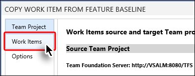

6. Here All Work Items are shown that are in the selected baseline.
    Users can select all Work Items (using **Select All** Button) or
    individually select the desired Work Items (using **Ctrl + click)**.

   

7. Select the desired Work Items and then click the **Options** Tab.

   

8. If we enable the **Create Baseline of copy work item(s)** checkbox
    (marked in the image below) then the baseline is copied as well,
    otherwise only the selected work items are copied.

9. Set desired options and click the **Copy** Button.

   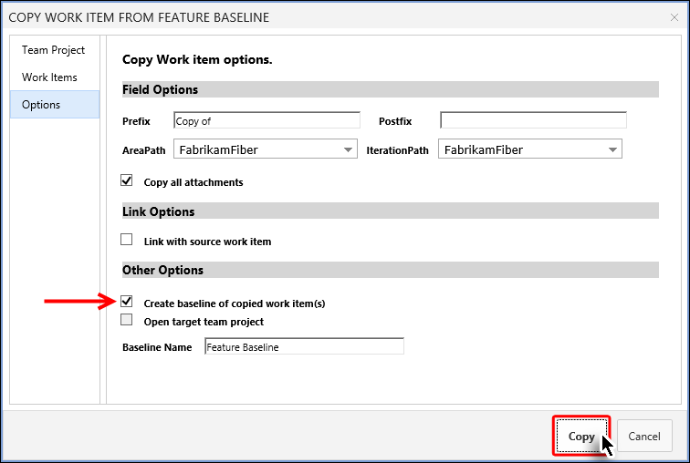

10. A copy of the baseline is created and a message is displayed.

    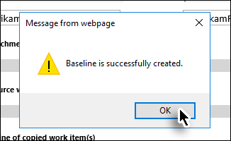

11. The newly created baseline is now accessible through the Baseline
    Explorer Panel.

    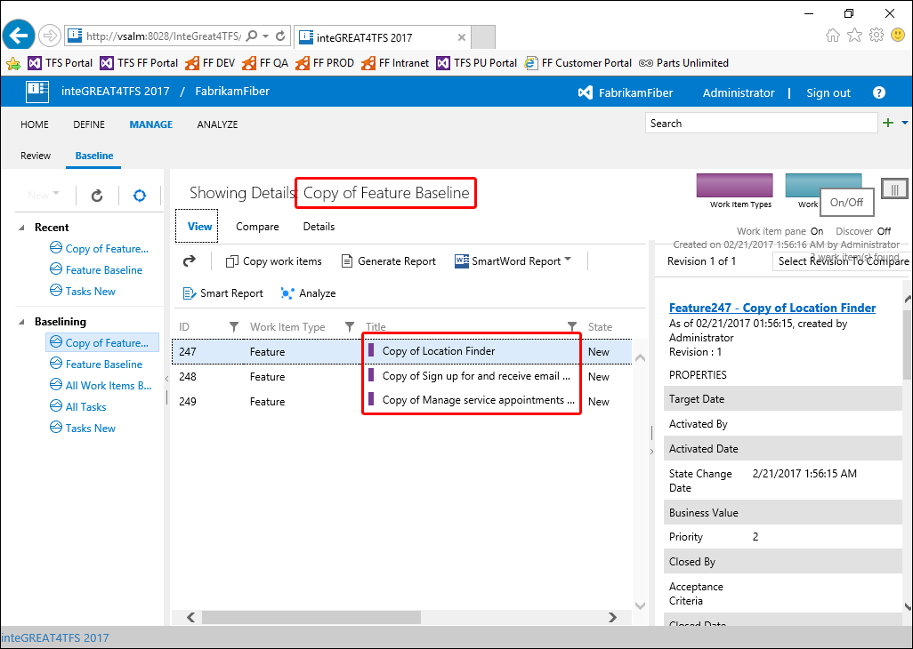

## Exercise 4: Review Management with inteGREAT4TFS

### Task 1: Creating a Review Request

In this exercise you will learn about how to create a Review Request
using the Review Management module of inteGREAT4TFS.

inteGREAT4TFS is an online application that complements
    SmartOffice4TFS in managing Team Projects. inteGREAT4TFS consists of
    many distinct modules such as: **Trace Analysis**, **SmartOffice
    Library**, **Simulation, Diagram, Use Case,** **Review** and
    **Baselining**. In this HOL, we will be using the **Review**
    module only.

1. Using the method described in baseline/traceability HOL, log in as
    **Administrator.**

2. Navigate to the inteGREAT4TFS Dashboard.

   

   **Dashboard in inteGREAT4TFS**

   **Dashboard** is the place where the user gets useful information
    about the team project. It also leads the users to the desired
    module in inteGREAT4TFS. Users can select their desired module in a
    number of ways. Since we will be using the **Review** module in this
    exercise, we will select the Review link that leads to our
    desired module.

3. Select the **Review Management** link from the highlighted links shown in the following image.

   

4. The landing page of the Review Management is displayed. The landing
    page would be empty since neither we have generated any Review
    Requests nor any requests have been assigned to us as of yet.

5. Click **New** and then **Review Request** option from the drop down.

   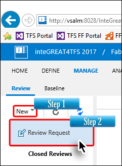

6. The Review Request Popup is displayed. This popup is used to configure all the settings for the Review Requests.

   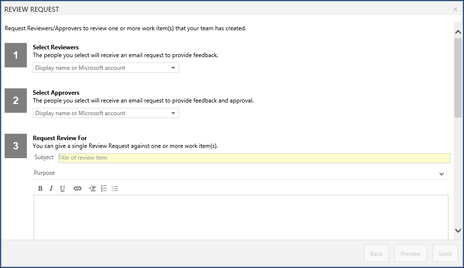

7. Select the Reviewers from the drop-down list.

   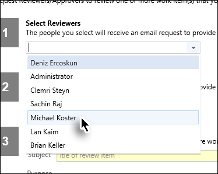

   > You can select more than one reviewer

8. Similarly, select the desired Approvers.

   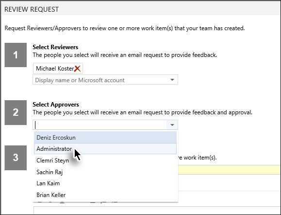

   > **Reviewers** only provide comments while **Approvers** can
    also approve/reject. A particular person can be either selected as a reviewer or an approver.

9. Enter appropriate subject for the review request.

   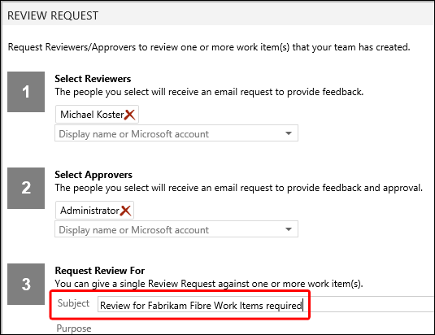

   >The subject of the Review Request becomes the subject of the email that is sent by inteGREAT4TFS to the selected Approvers/Reviewers.

10. Scroll down to get to the other steps in the window.

11. Provide a purpose for the review (if desired). Alternatively
    collapse the section by clicking on the down arrow at far right.

    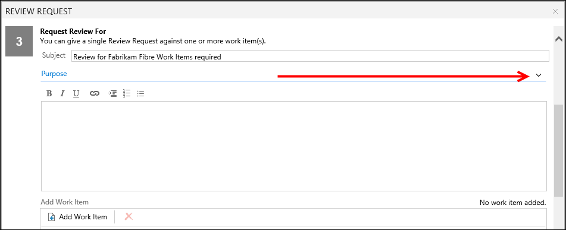

12. Click the Add Work Items button.

    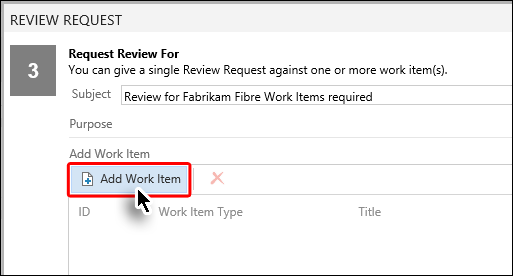

13. Run the relevant query.

    

    >A list of Work Item appears depending upon the query we ran. We can now select the desired ones from the list.

14. Select the desired Work Items (for which the review is desired) and
    click the **Add Work Item** button.

    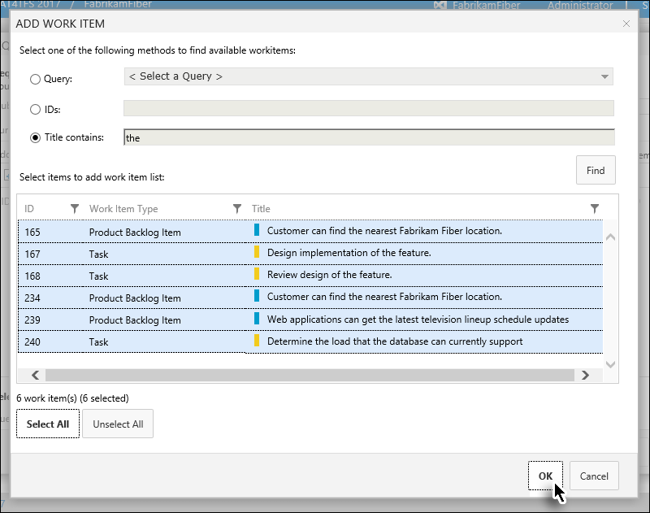

15. Set the Due Date.

    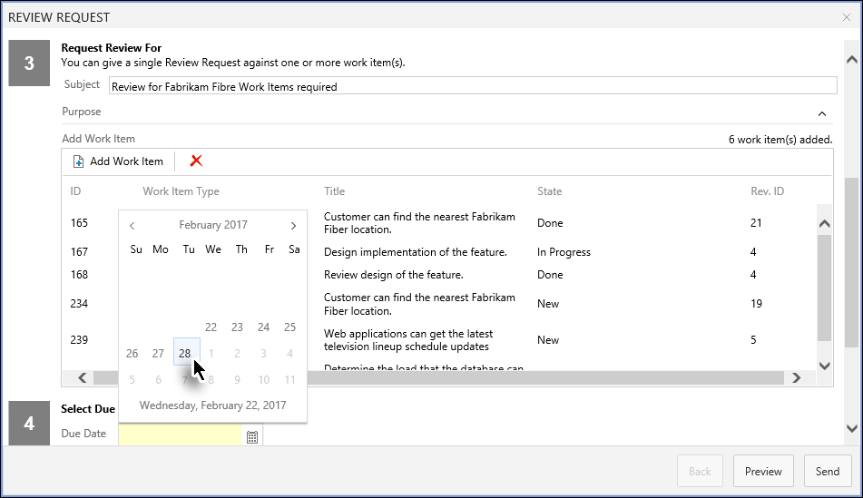

16. To preview the request, click the **Preview** button.

    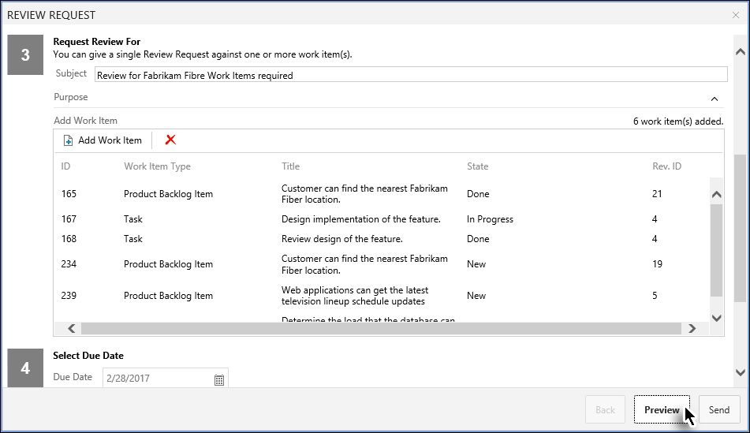

    >The Preview is displayed. In preview, only the text box area
    is editable. All other information such as recipients, Due Date etc.
    are shown in read-only format. If these need to be edited then user
    has to go back and alter the relevant options.

17. Make formatting updates (if desired) and click the Send button.

    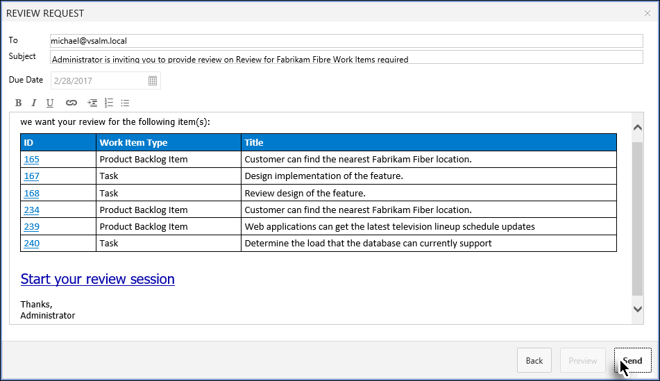

18. The Review Request is created and becomes visible at the module's
    landing page.

    

### Task 2: Responding to the Review Requests

In this exercise you will learn about how to respond to a Review Request
using the Review Management module of inteGREAT4TFS.

1. The Review Requests assigned to a user are arranged under **Assigned to Me** heading in the Folder Explorer.

   

   >The process to respond to the review requests is slightly different
    for Reviewers and for Approvers. The following steps describe the
    process for Approvers. The Reviewers can only give their comments.
    The Accept/Reject options don’t appear in the UI for reviewers.

2. Click the relevant Review Request under the **Reviewed** **Assigned
    To Me** heading in the Folder Explorer.

   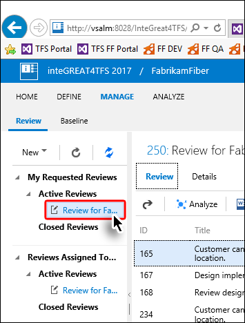

3. Select the Work Item for which the review is to be given.

   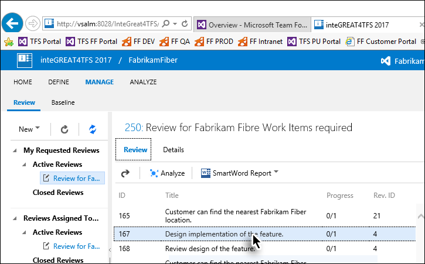

4. Provide a comment (if desired)

   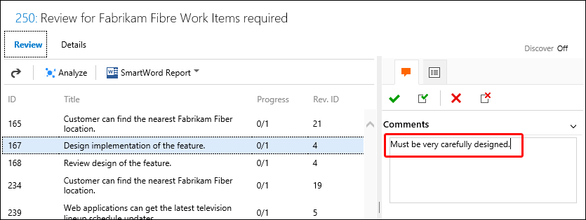

5. Click **Accept** or **Reject** Button.

   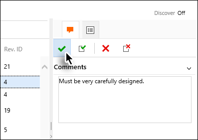

6. The response for the selected Work Item is completed.

   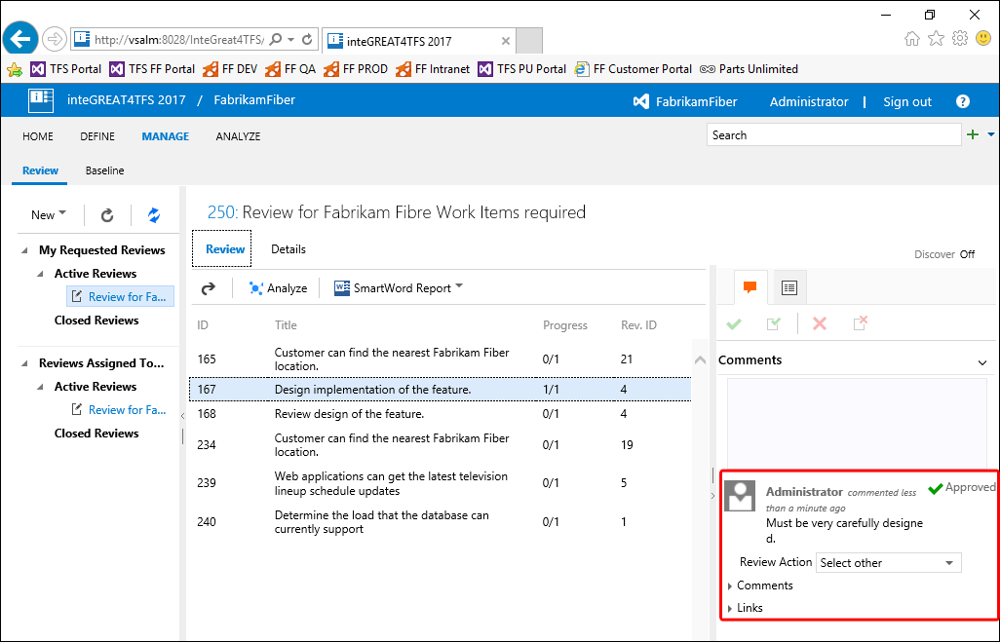

7. Repeat the process with all other Work Items of the Review Request.

   >Giving comment is not mandatory for approvers; however, it is mandatory for stakeholders.

   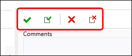

8. If **Accept All** or **Reject All** option is selected instead of
    simple Accept/Reject then the response is finalized for all Work
    Items of the Review Request and the user does not have to repeat the
    whole process for each Work Item as mentioned in last step.
