

## Overview

Modern Requirements Suite4TFS provides a collaborative platform based on “a single source of truth,” while automating each phase of your requirements lifecycle. The user interface is Microsoft Office or Smart Office4TFS, ensuring that you, and your new recruits, can start enjoying the benefits quickly. You can also use the browser-based interface, Modern Requirements4TFS. Microsoft’s industry leading TFS/VSTS is the requirements database, with optional extensions supporting your end-to-end ALM process. Whether you deploy it on premises or in the Azure cloud, it provides the security, scalability and workflow enterprises demand; all while supporting Agile, Waterfall or Hybrid methodologies.

In this lab, you will learn about scrum management using the Modern Requirements Suite4TFS modules, augmented by Team Foundation Server 2018. You will also learn how these tools can help you quickly track work across your entire team.

## Prerequisites

In order to complete this lab, you will need Smart Word4TFS, Modern Requirements4TFS and the Visual Studio 2017 virtual machine provided by Microsoft. For more information about Modern Requirements Suite4TFS products, please visit [this URL](http://www.modernrequirements.com/). The information about acquiring and using the Visual Studio 2017 virtual machine is available [here](https://almvm2017.blob.core.windows.net/2017winterupdatepreview/171116.ALMVM.zip).

The following prerequisites are required to successfully install Smart Office4TFS products:

- Microsoft VM environment for Visual Studio 2017

- Internet should be working within the VM. Refer to **Working with the Visual Studio 2017** ALM Virtual Machine.docx”

>**Important note:** This lab requires you to use the default state of the virtual machine before any modifications are made to work items or source in TFS. If you followed the “Working With…” instructions, you should have a snapshot/checkpoint of the virtual machine before working with it for the first time. Apply the snapshots/checkpoints before starting this lab.

## About the Fabrikam Fiber Scenario

This set of hands-on labs uses a fictional company, Fabrikam Fiber, as a backdrop to the scenarios you are learning about. Fabrikam Fiber provides cable television and related services to the United States. The company is growing rapidly and has embraced Windows Azure to scale its customer-facing website directly to end-users to enable them to manage tickets and track technicians. It also uses an on-premises ASP.NET MVC application for its customer service representatives to administer customer orders.

In this set of hands-on labs, you will take part in a number of scenarios that involve the development and testing team at Fabrikam Fiber. The team, which consists of 8-10 people, has decided to use Visual Studio application lifecycle management tools in conjunction with Smart Excel4TFS.

## Installing Smart Word4TFS

This installation guide demonstrates the installation of Smart Word4TFS using the web installer.

## Installation guidelines

1. Go to [http://www.modernrequirements.com](http://www.modernrequirements.com/) and click the **Download** link at top of the page.

2. Scroll down and click the **Download SmartWord4TFS** link.

   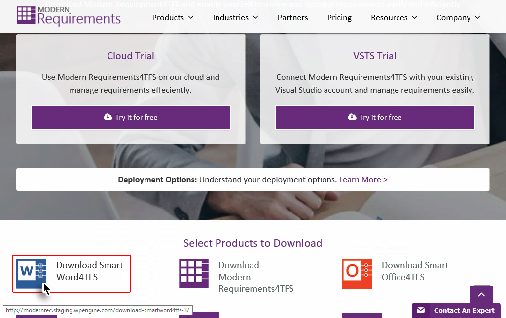

   **Figure 1** Products download page

   The user is taken to the online registration page.

   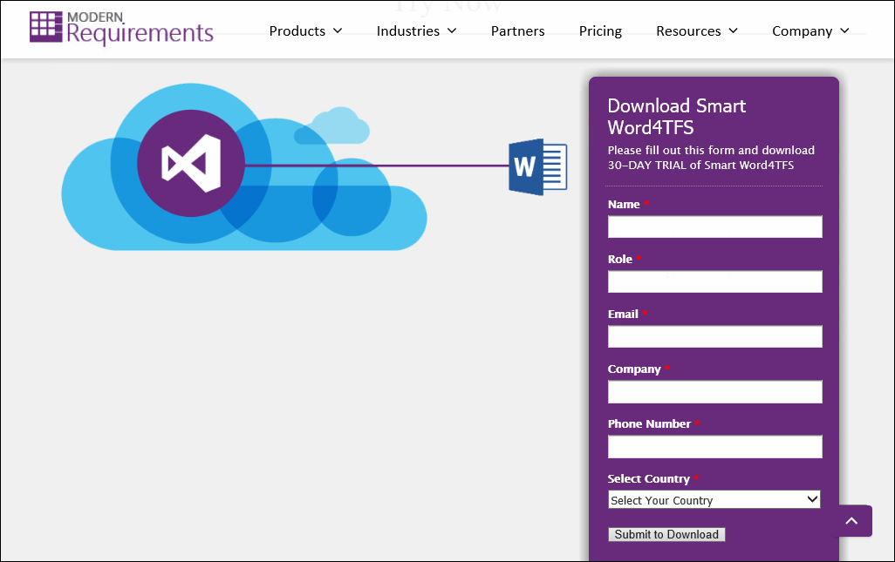

   **Figure 2** Registration page

   Filling out the registration form for downloading Smart Word4TFS:

1. Fill out the online registration form and click the **Submit to Download** button. The user is taken to the download page.

2. Click the **Try it for free** button under **Smart Word4TFS**.

   

   **Figure 3** Download Applications

   Applications download page:

   For system requirements refer to the Modern Requirements4TFS Installation Guide & the Smart Word4TFS Installation Guide
[here](http://modernrec.staging.wpengine.com/download-applications/).

1. Once the installer is downloaded run it to start the installation process.

   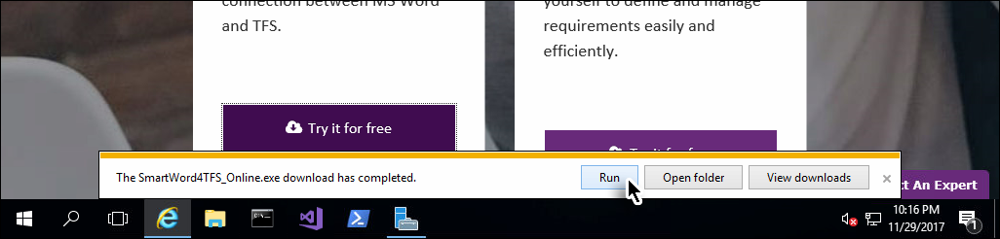

   **Figure 4** Running the Smart Word4TFS installer

## The installation process

1. If the installer was downloaded, but didn’t start imimagestely afterwards, open the relevant folder and run the **SmartWord4TFS\_Online.exe** file. Skip this step if the installer ran imimagestely after downloading.

   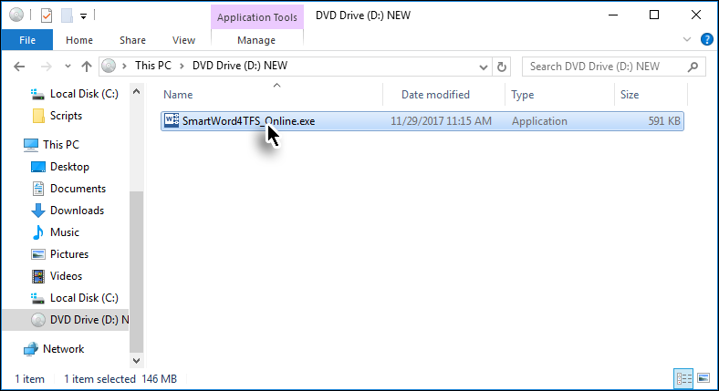

   **Figure 5** Invoking the Smart Word4TFS installer

1. Accept the license agreement for the Microsoft components to proceed.

   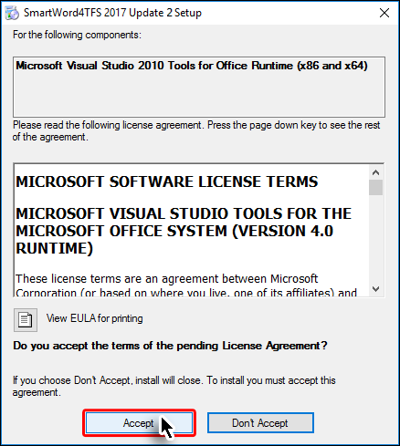

   **Figure 6** Accepting EULA

   The prerequisite software is installed if required.

   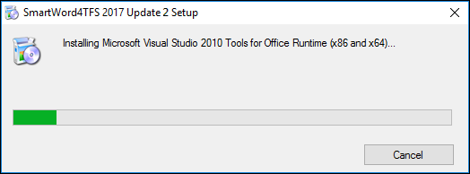

   **Figure 7** Installing the prerequisite components

1. Click **Next**.

   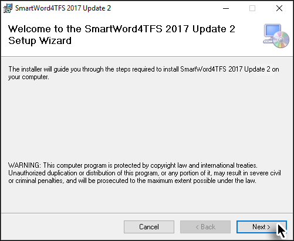

   **Figure 8** Installation Step 1

1. Read the License Agreement, select the **I Agree** option and click **Next**.

   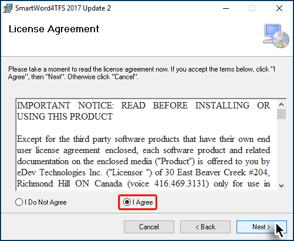

   **Figure 9** Installation Step 2

1. Set the desired installation location and the relevant user accounts, then click **Next**.

   

   **Figure 10** Select Installation Folder Installation Step 3

1. Select the desired mode (**author** or **reviewer**) and click **Next**.

   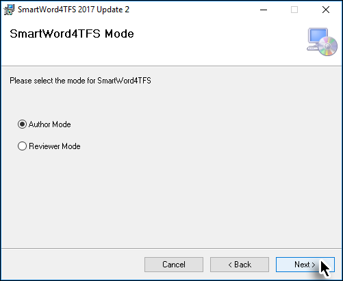

   **Figure 11** Installation Step 4

1. Select if the templates will be installed and then click **Next**.

   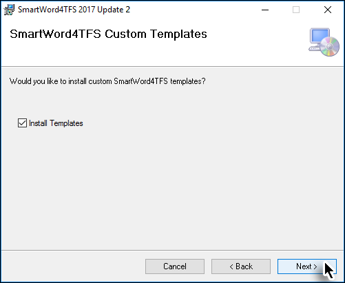

   **Figure 12** Installation Step 5

1. Tick the box if you want to be part of the Customer Experience
program and then click **Next**.

   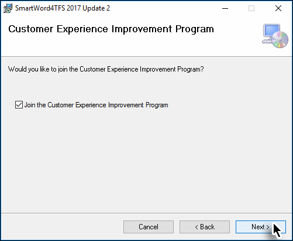

   **Figure 13** Installation Step 6

1. Click **Next** to begin copying the files into your system.

   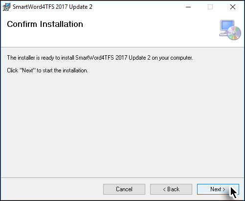

   **Figure 14** Installation Step 7

   The actual installation starts based on the selections made in previous steps.

   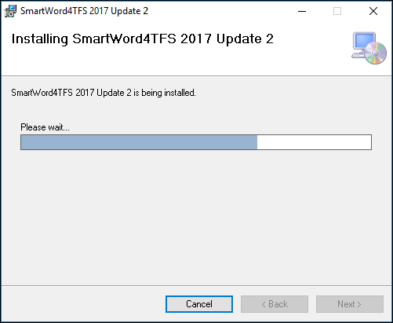

   **Figure 15** Installation Step 7

1. Click **Close** to complete the installation process.

   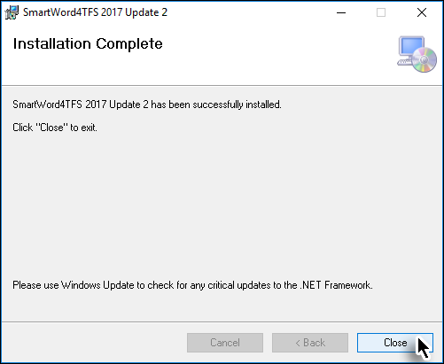

   **Figure 16** Installation Step 8

   The **Smart Word4TFS** tab (or **Smart Word4TFS Review** tab if you chose to install the **Reviewer Mode**) can now be accessed in Microsoft Word.

   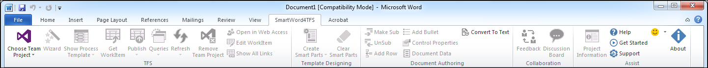

   **Figure 17** Smart Word4TFS tab in MS-Word

   The downloaded version provides a 30-day trial period for users to evaluate the application. MS Word may show the following dialogue box when it’s invoked for the first time after the Smart Word4TFS installation.

11. Click **Install** to continue.

    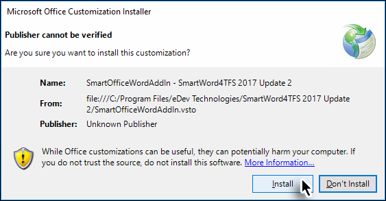

    **Figure 18**Smart Word4TFS tab in MS-Word

12. Click the **About** option in Ribbon Bar.

    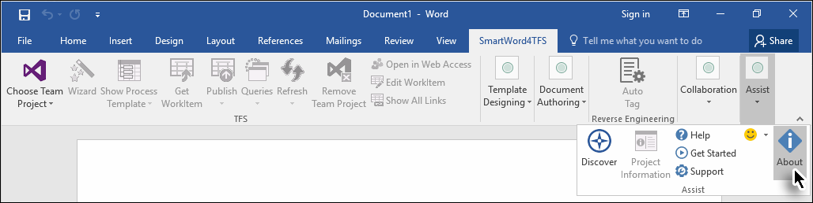

    **Figure 19** The **About** text box showing the **Activate** button

    After submitting the online registration form, you will receive the License key for the duration of six months in the email address provided. **This software key is provided for non-production use only.**

12. Click **Activate** in the **About** window.

    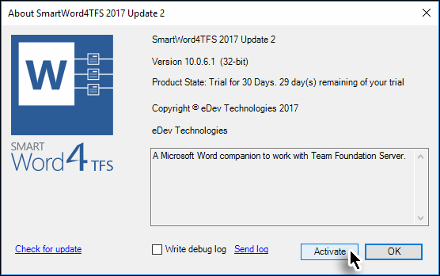

    **Figure 20** The **Activate** button in the **About** window

12. Enter the provided Activation key and click **Activate**.

    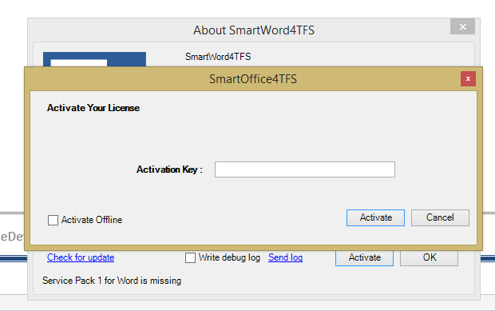

    **Figure 21** The Activation window

    Entering a valid activation key activates Smart Word4TFS.

    The product is activated.

    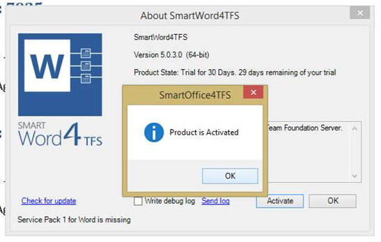

    **Figure 22** Successful activation message

## The installation process for Modern Requirements4TFS

Download the Modern Requirements4TFS installer using the same process described above for Smart Word4TFS. The process may include extracting
files from an archive.

1. Double click the **Modern Requirements4TFS 2018.exe** file.

   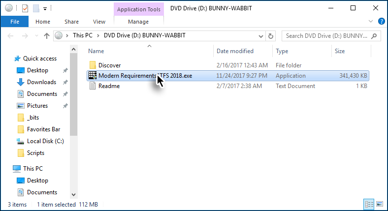

   **Figure 23** Invoking the Modern Requirements4TFS installer

1. Tick the terms and conditions agreement check box and click **Next**.

   

   **Figure 24** Step 1 Modern Requirements4TFS installation

   Select the desired build type and click **Next**. The **Embedded** type is the recommended build. The HOLs here also refer to the embedded type build.

   

   **Figure 25** Step 2 Modern Requirements4TFS installation

1. Enter the following Windows credentials:

   >**Username** = Administrator
    **Password** = P2ssw0rd

   Then click **Next**.

   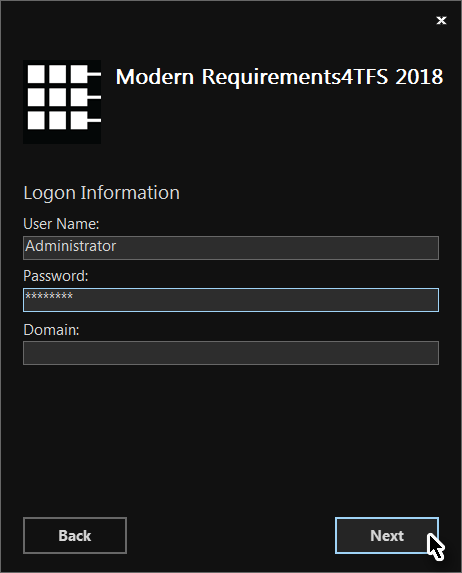

    **Figure 26** Step 3 of installation

    >The application will be installed even if incorrect Windows credentials are entered during the installation, but the user won’t be able to log into the application.

1. Configure the **MongoDb Installation** options and click **Install**.

   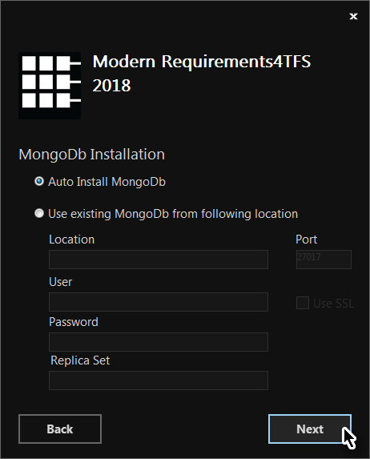

   **Figure 27** Step 4 of installation

   >The **Auto Install MongoDb** option is recommended if MongoDb isn’t already installed on the VM.

1. Similarly configure the **Redis Installation** options and click **Install**.

   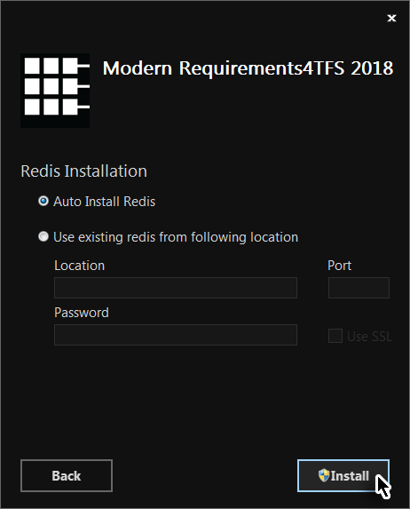

   **Figure 28** Step 5 of installation

   >The **Auto Install Redis** option is recommended if Redis isn’t already installed on the VM.

   The relevant files are installed.

   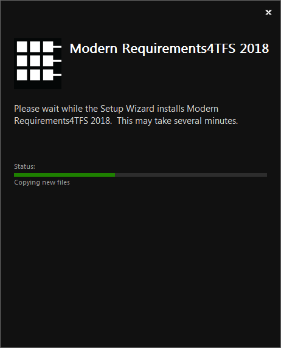

   **Figure 29** Step 6 of installation

1. Complete the installation of **Modern Requirements4TFS** by clicking **Finish**.

   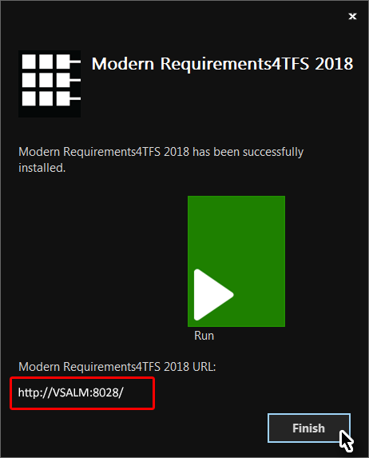

   **Figure 30** Final step of installation

   - Please make a note of the Service URL (highlighted in the images above). This will be helpful later on.

   - This completes the installation process of the Modern
    Requirements4TFS step for the Standalone version. Additional steps for the Embedded version are described below.

    For the Embedded version, the TFS Deployment instruction page is shown in the default browser window. Follow the steps described in the page to retrieve the VSIX file.

    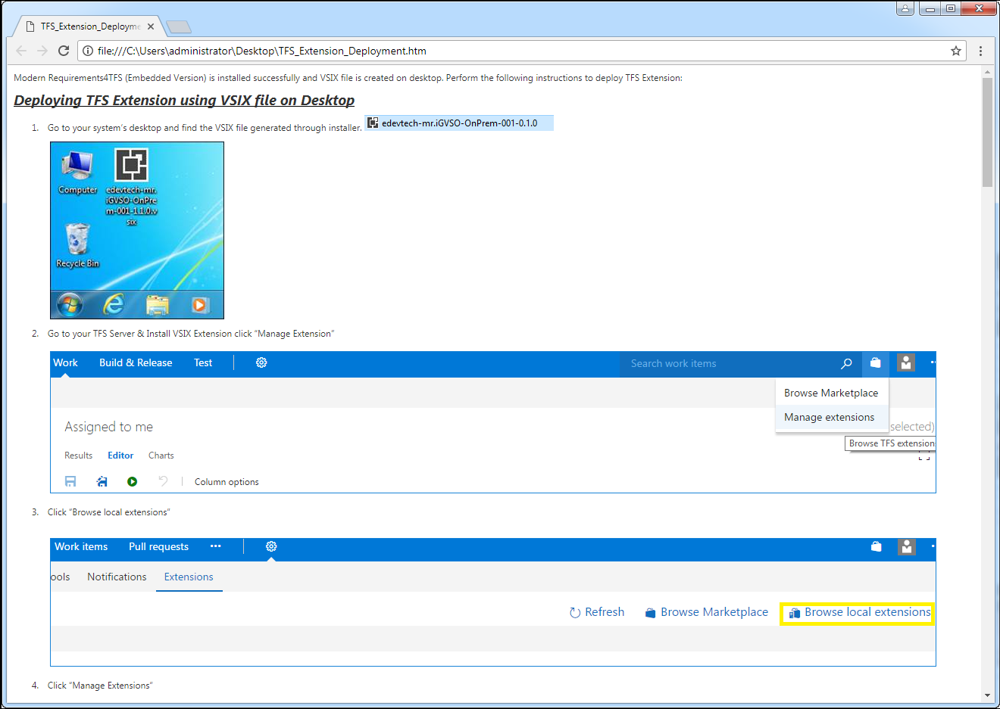

    **Figure 31** Deployment instructions in a browser window

8. Follow the instructions shown to complete the deployment of the TFS Extension and complete the installation process.

    Select FabrikamFibreCollection whenever a collection option appears during the deployment process, as shown in the following image.

    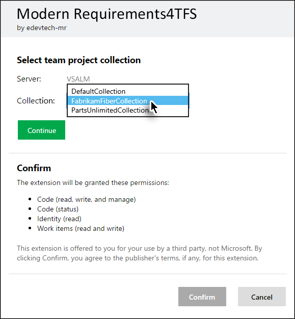

    **Figure 32** Selecting the desired collection for the TFS Extension deployment

    After installing all Smart Office4TFS and Modern Requirements4TFS modules you can proceed to the following exercises.

## Exercise 1: Smart Word4TFS

The templates created in Smart Word4TFS can be distributed to all
stakeholders. This enables them to create and manage work items from MS-Word in relevant team projects on the Team Foundation Server.

In this exercise we will use an MS-Word template\* to create new work items and publish them on the Fabrikam Fiber Team Project.

>Refer to **Appendix A** at the end of this file for instructions to create the template used in this exercise.

### Task 1: Document Authoring in SmartWord4TFS

1. Open the Word template (created using **Appendix A**) by double-clicking it.

   

   **Figure 1** Opening the template

    The template with empty work item smart parts is opened. The
    controls that are used to set individual properties of any work item are called **Smart Parts**. They are used to create new work items so the items can be published on the Team Project.

    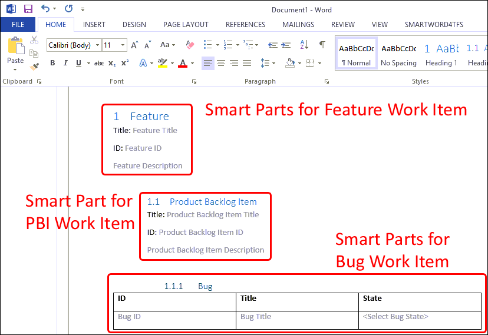

    **Figure 2** Word Template with empty Work Item Smart Parts

1. Open the SMARTWORD4TFS tab.

   

   **Figure 3** Accessing the Smart Word4TFS tab

1. Select the **Choose Team Project** option.

   

   **Figure 4** Initiating the connection process

1. Choose **FabrikamFibreCollection** **Fabrikam Fiber** (Team Project) then click **Connect**.

   

   **Figure 5** Selecting the Team Project

1. Click inside the **Feature Title** smart part.

   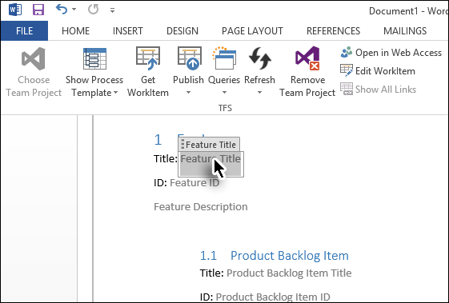

   **Figure 6** Entering values in document

1. Enter a suitable name for the Feature Work Item.

   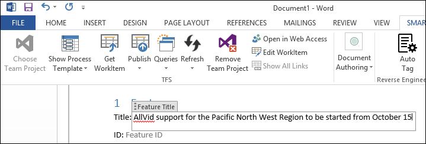

   **Figure 7** Entering values in document

   >The ID of a work item is automatically given by the connected Team Project, when that item is first published on the Team Project. As a result, we will leave that field for the time being as it will be populated after the work item is published.

1. Similarly, enter values in all smart parts of the work items.

   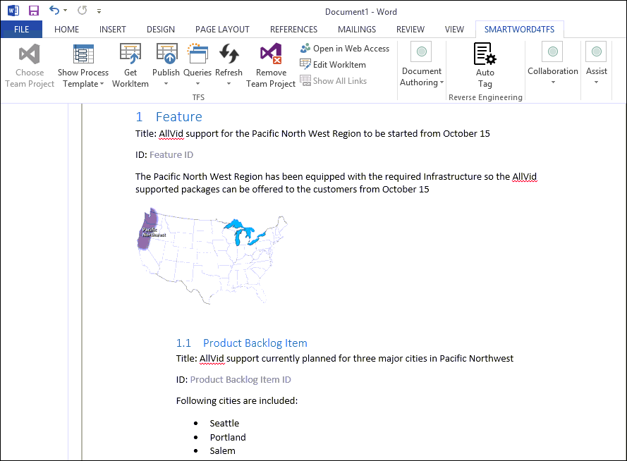

   **Figure 8** Entering values in all smart parts

1. Select the **Publish** option in the ribbon bar.

   

   **Figure 9** Publishing the work item on the Team Project

   - There is a subtle difference between **Publish** (shown here) and **Publish Selected** (accessed through drop down).

   - The **Publish** option publishes all work items while the **Publish Selected** option publishes only the work item whose smart parts have been selected by the user.

1. Provide any comments if desired and click **Yes**.

   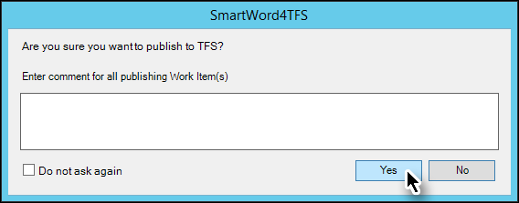

   **Figure 10** Confirming publish

    The work items are published on the Fabrikam Fiber Team Project.

    

    **Figure 11** Document after publishing work items

1. Now add values in the smart part of the bug work item.

   
   
   **Figure 12** Entering values in Bug’s Smart Part

    At this moment we have run out of smart parts. So far we have been using the smart parts that came with the template. What if we need to add more work items? To do this we need to **Insert Smart Part.

1. Click **Document Authoring** **Insert Smart Part** **Product Backlog Item** **Bug**

   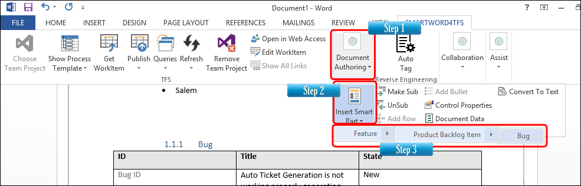

   **Figure 13** Inserting smart parts for creating a new bug work item

1. Add values to the new bug smart parts.

   - We now have two bug work items ready to be published. However, in order to demonstrate the Publish Selected functionality, we will publish only one. This is done first by selecting the smart parts of the desired bug work item.

   - To select the smart parts of the desired work item, the user may select all of the relevant smart parts; partially selecting any one smart part; even placing the cursor in any of the smart parts of that work item would also suffice.

1. Place the cursor inside any of the smart parts of the bug that we created in Step 6.

   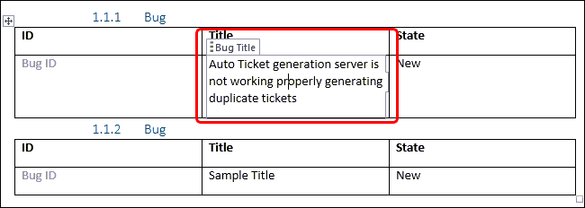

   **Figure 14** Selecting the desired smart part before publishing

1. Click **Publish** **Publish Selected** option in the ribbon bar.

   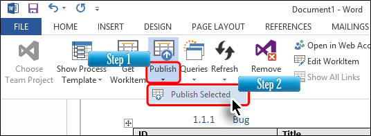

   **Figure 15** Publishing the desired bug between the two that are available

    The desired bug is published on the Fabrikam Fiber Team Project.

    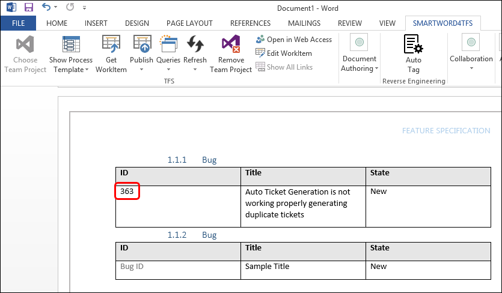

    **Figure 16** Document after publishing the bug work item

    The last step is to check the published work items on the Team Project.

1. Run **Visual Studio 2017**.

2. Run the **All Bugs** query.

   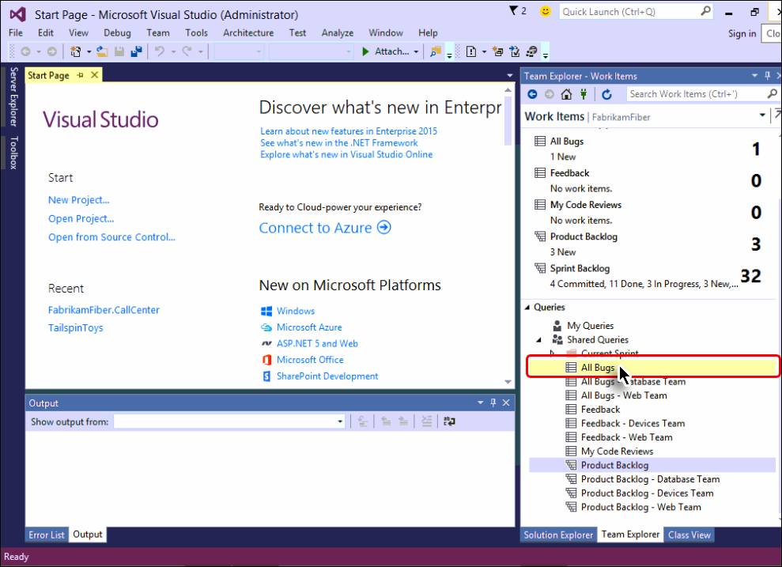

   **Figure 17** Running the All Bugs query in Visual Studio

    The bug work item can be seen in the Team Project. Similarly, we can run relevant queries to check other work items on the Team Project that we published before the bug work item.

   

   **Figure 18** Published bug work item as seen in Visual Studio 2017

   Here is the query view to validate published work items.
   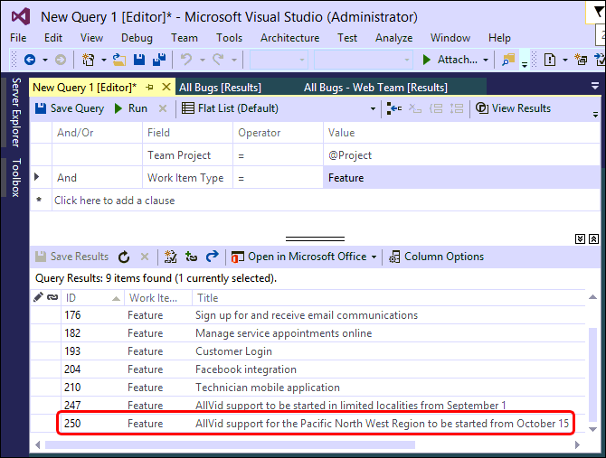

   **Figure 19** Published feature work item as seen in Visual Studio 2017

   Work Item detail window show content of the published work item.

   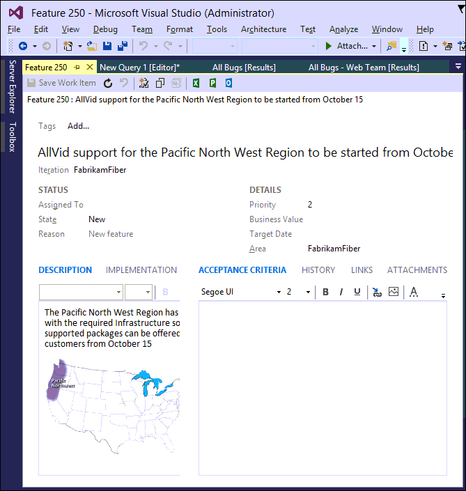

   **Figure 20** Details of the published feature work item

The image depicts Smart Word4TFS’ support of rich content data to be published on the Team Project. This brings us to the end of this exercise.

### Task 2: Instant Document reporting with SmartWord4TFS using a template

In this exercise, you will learn how to create an instant report about Project PBIs using a Smart Word4TFS template. You will also learn how to update work items on the Team Project while staying in Word.

>Reference document that will be referenced below for use

1. Log in as **Administrator**. All user passwords are **P2ssw0rd**.

2. Start MS-Word and open the **Product Backlog Item List.dotx** from the **Documents** folder.

   All the necessary work required to populate the file with Product Backlog Items is already in place in the document. The report is generated by a single click, as shown in the document.

   

   **Figure 21** Document in original state

1. Open the SMARTWORD4TFS tab.

   

   **Figure 22** Opening the Smart Word4TFS tab

1. Click **Refresh**.

   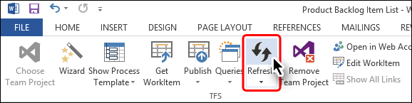

   **Figure 23** Refreshing the document to generate instant report

    Refreshing the document populates it by fetching all the PBIs from the Fabrikam Fiber Team Project. Similar documents can be created to generate reports about desired work items. For more details contact [Modern Requirements](http://www.modernrequirements.com/contact/).

    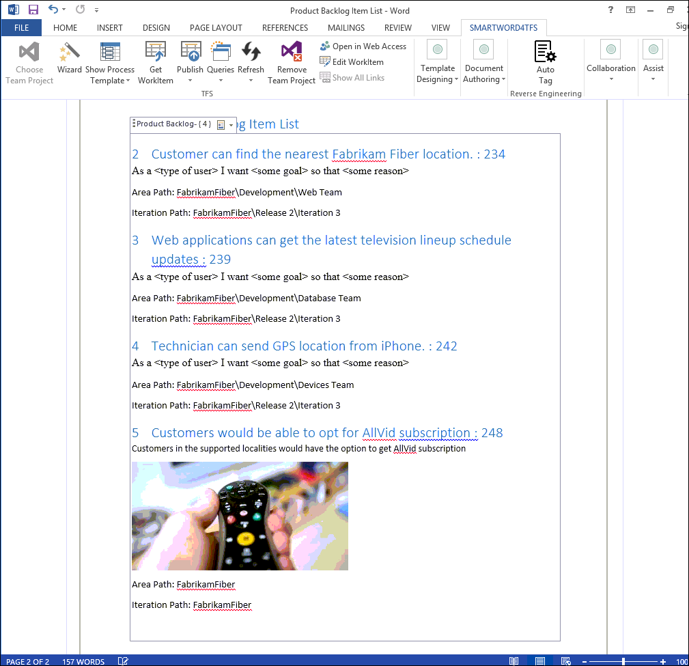

    **Figure 24** Document displaying all PBIs after the Refresh option has been selected

    Now we will update one of our PBIs and publish the updated work item on the Team Project.

5. Click inside the last product backlog item and update its description as shown in the image.

   
   
   **Figure 25** Updating a PBI

5. Click the **Publish Publish Selected** option.

   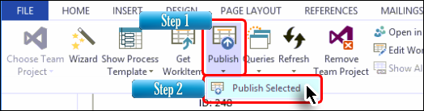

   **Figure 26** Publishing updated PBI on the Team Project

   This option publishes the updates on our Fabrikam Fiber Team Project.

5. Run **Visual Studio 2017**.

6. Run the relevant query and open the PBI that we updated in Word. We can see that our PBI has been updated on the Team Project.

   

   **Figure 27** Updated PBI in Team Project

    This brings us to the end of this exercise.

### Task 3: Document reporting using queries

In the previous exercise we used a ready-made template to create an instant report. This exercise explores the query option to create a report with more freedom to choose what to include in the report.

1. Log in as **Administrator**. All user passwords are **P2ssw0rd**.

2. Start MS-Word and create a new document.

3. Format the document as required including header/footer, title page, document control information, etc.

   

   **Figure 28** Formatting the document

1. Open the **SMARTWORD4TFS** tab.

   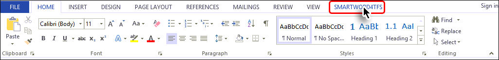

   **Figure 29** Accessing the Smart Word4TFS tab

5. Select the **Choose Team Project** **Team Project** option.

   

   **Figure 30** Initiating the connection process

5. Choose **FabrikamFibreCollection** **Fabrikam Fiber** (Team Project) click **Connect**.

   

   **Figure 31** Selecting the team project

7. Select the **Queries** option and select the desired query from the drop-down menu.

   

   **Figure 32** Selecting the desired query

   The Query Dialogue Box appears with the following information and options:

   - **Query Name** (i.e. the selected Query)

   - **Query Type** (i.e. Is the query a simple list or a tree?)

   - Work item count

   - **Without smart content** checkbox: If selected, the query would be inserted as tables with static content, and the values in the table will not be connected with TFS.

   - **Insert at cursor position** checkbox: If selected, the query would be inserted at the current cursor location. If not, it will be inserted at the end of the document.

   - **Insert query block only** checkbox: If selected, an empty query control will be added in the document without any work items (refer to the image at the bottom of the page). The query control can be refreshed later and filled with the relevant work items. **The template we used in Exercise 2 was created by using this option.**

   

   **Figure 33** Query options

7. Enable only the middle checkbox while leaving the other two checkboxes un-selected. Then click **OK**.

   

   **Figure 34** Finalizing Query options

   The result of the query is added in the document.

   

   **Figure 35** Document after running the query

This brings us to the end of the exercise.

### Appendix A: Designing a Smart Word4TFS template using wizard

In this appendix you will learn how to create a new Smart Word4TFS template from scratch using a wizard.

Wizard makes the template designing process easy even for novice users. Another way is to create the template using individual controls, but that approach is better fitted for advanced users and, therefore, won’t be discussed in this exercise.

1. Log in as **Administrator**. All user passwords are **P2ssw0rd**.

2. Start MS-Word and create a new document.

3. Format the document as required including header/footer, title page, document control information, etc.

   

   **Figure 36** Formatting the document

1. Open the **SMARTWORD4TFS** tab.

   

   **Figure 37** Accessing the Smart Word4TFS tab

5. Open **Choose Team Project** **Team Project** option.

   

   **Figure 38** Initiating the connection process

5. Choose **FabrikamFibreCollection** **Fabrikam Fiber** (Team Project) click **Connect**.

   

   **Figure 39** Selecting the Team Project

5. Select the **Wizard** option.

   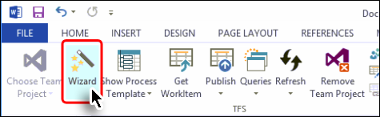

   **Figure 40** Initiating the wizard

5. Click the **Create section** button (at the window’s top left
    corner).

   

   **Figure 41** Section creation in Wizard (Step1)

5. Enter a suitable name for the section.

   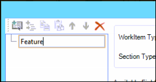

   **Figure 42** Section creation in Wizard (Step2)

    This section will serve as a root node and will be used to show a certain type of work item. We can also have subsection(s) to display the work items in the desired hierarchy.

5. Select the desired work item type.

   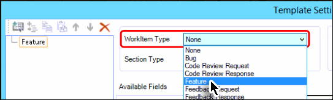

   **Figure 43** Selecting the relevant work item

5. Select the desired Section Type to determine how the work item will be displayed in the template/document.

   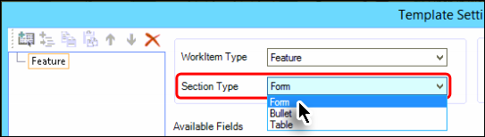

   **Figure 44** Selecting the relevant section type

    Select the desired field from the available list and include it in the smart part using the arrow button. Users can select multiple fields by holding down the **Ctrl** key, and simultaneously clicking all the desired fields from the list.

    

    **Figure 45** Selecting the desired fields

5. Arrange the selected fields in the desired order (using arrow buttons) and customize them if desired.

   

   **Figure 46** Arranging the fields

   Users can make a selected field hidden, using the relevant checkbox. For the hidden fields, users have to provide corresponding default values. Hidden fields don’t appear in the Word document however; their default values are published automatically on TFS (along with other normal fields) when users perform a **Publish** command.

   

   **Figure 47** Hidden field checkboxes

   Note that not every field can be a hidden field. For such fields,the relevant checkboxes remain disabled as evident from the **ID** and **Title** checkboxes shown in the image displayed above.

5. Give a heading for the selected fields as you want it to appear in the template/document. The heading could be given using the Section Heading or selected from the drop-down control.

   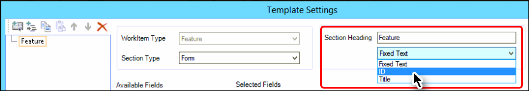

   **Figure 48** Choosing headings for the fields

    This completes the formatting of a work item node that started with Step 9.

5. Click the **Create Sub Section** button.

   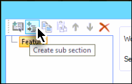

   **Figure 49** Sub section creation in Wizard (Step1)

5. Enter a suitable name (e.g. PBI) for the subsection, as we did for the section in Step 9.

6. Repeat steps 9 to 14 with the subsection, this time formatting the node for **Product Backlog Item**.

   >During the course of creating this guide we have designed a template with the following section hierarchy:

   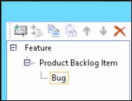

    **Figure 50** Section hierarchy

5. Click **Apply** to save the changes and complete the template creation process.

   

   **Figure 51** Finishing the wizard

    This completes the template creation process. The hierarchy of nodes becomes visible in the document as shown in the following image. Now we only need to save the template.

    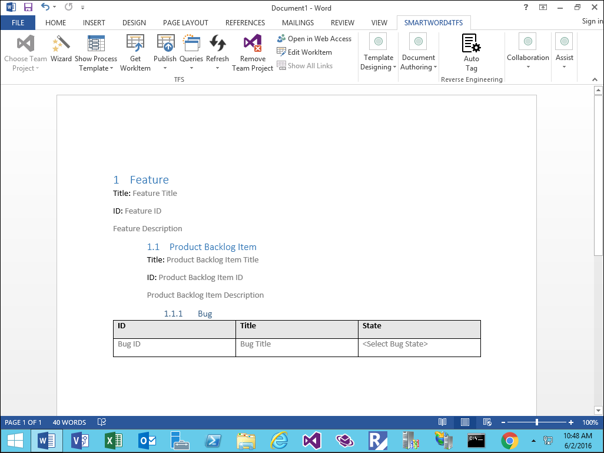

    **Figure 52** Document after completing the wizard

19. Save the document as a template (with .dotx extension) to complete the template creation process.

## Exercise 2: Traceability Management with Modern Requirements4TFS

In this exercise you will learn how to create an Intersection Matrix
using the Trace Analysis module of Modern Requirements4TFS.

-   Modern Requirements4TFS is an online application that complements
    Smart Office4TFS in managing team projects. Modern Requirements4TFS
    consists of many distinct modules such as: Trace Analysis,
    SmartOffice Library, Simulation, Diagram, Use Case, Review and
    Baselining. In this HOL, we will be using the Trace Analysis module
    only.

-   The prime objective of generating a Traceability Matrix is to check
    the relationships that exist between different types of work items.
    If there is no relationship between row and column work items, the
    intersection cells remain empty. Users can create relationships
    directly using TFS by editing properties of work items in use. They
    can also create relationships after the matrix is generated, using
    the Trace Analysis module.

### Task 1: Accessing Modern Requirements 4TFS and creating an Intersection Matrix

1. Log in as **Administrator** with the password **P2ssw0rd**.

2. Start Internet Explorer.

3. Access the following URL: **VSALM:8028**

   

   **Figure 1** Accessing the Modern Requirements4TFS tab

   The Modern Requirements4TFS welcome page is displayed in the browser.

   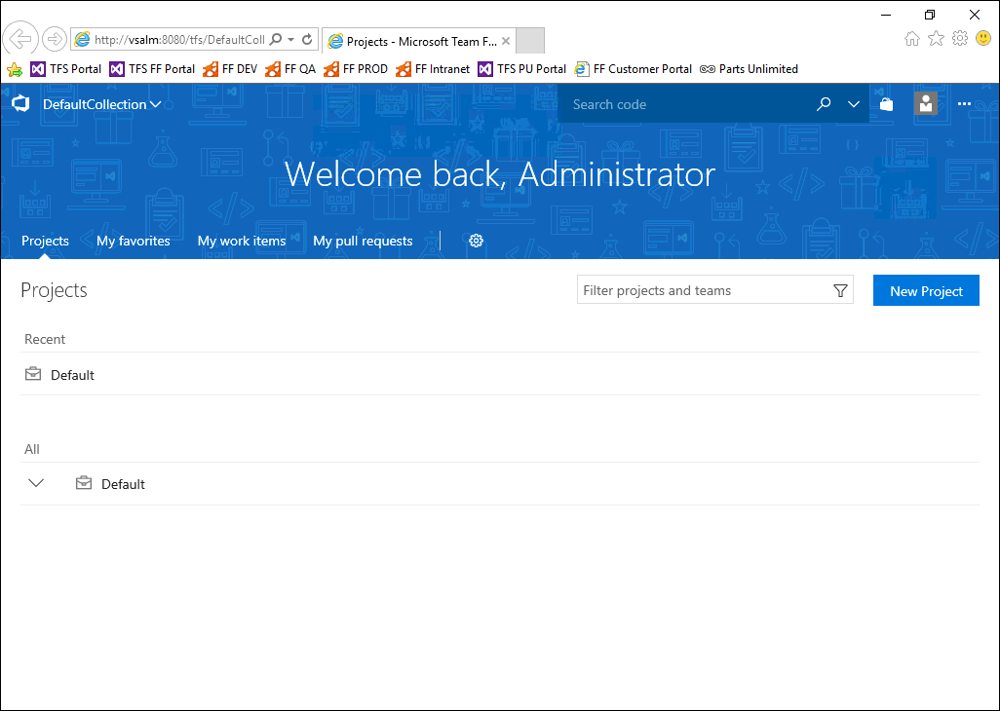

   **Figure 2** The Modern Requirements4TFS welcome page

1. Select **FabrikamFiberCollection**.

   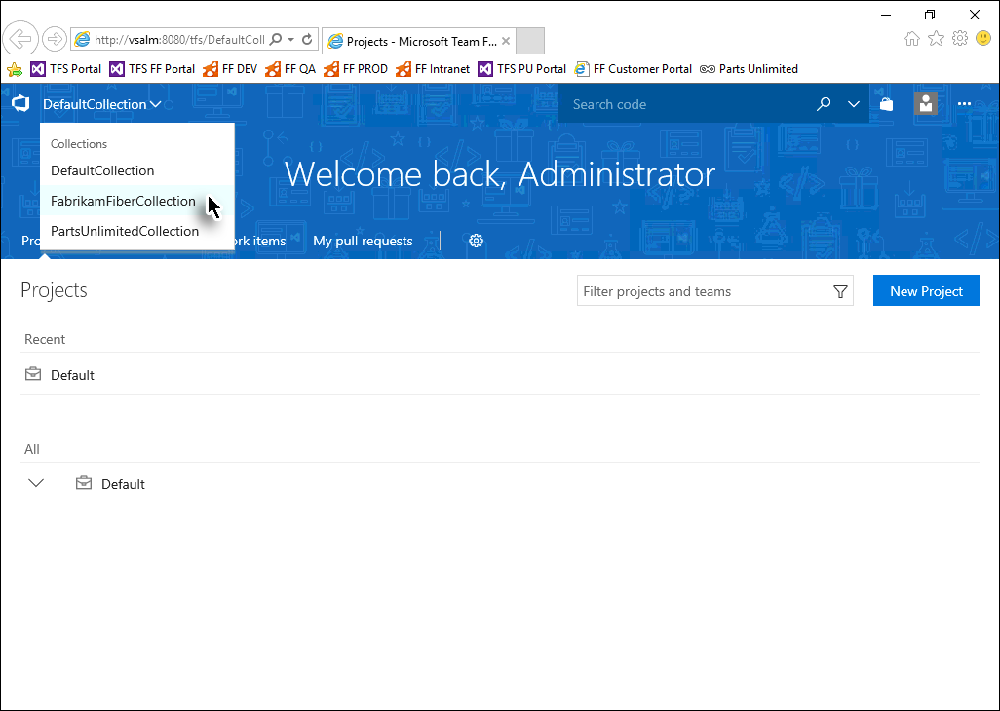

   **Figure 3**[]{#OLE_LINK4 .anchor} Selecting the desired collection

1. Select the **FabrikamFiber** project.

   

   **Figure 4** Selecting the desired project

1. Open the **Work** folder in the toolbar and then select **Trace Analysis** from the drop-down menu.

   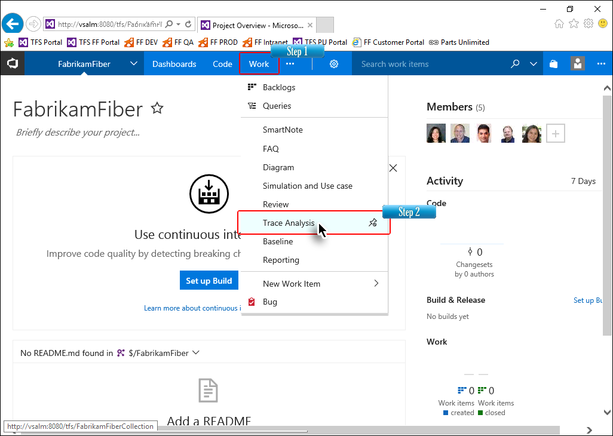

   **Figure 5** Invoking the Trace Analysis module

   The login screen is displayed below.

   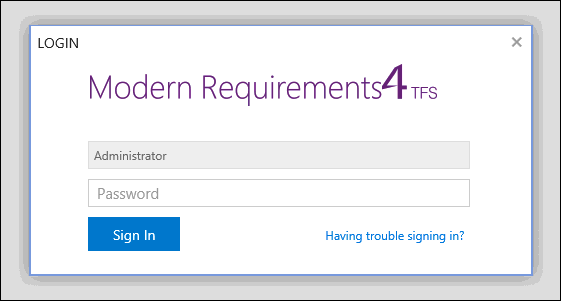

   **Figure 6** The login screen is used to authenticate the user

1. Enter the login details and click **Sign In**. The following login details are to be used whenever required:

   >**User ID**: Administrator
    **Password**: P2ssw0rd

   The Trace Analysis home page is displayed below.

   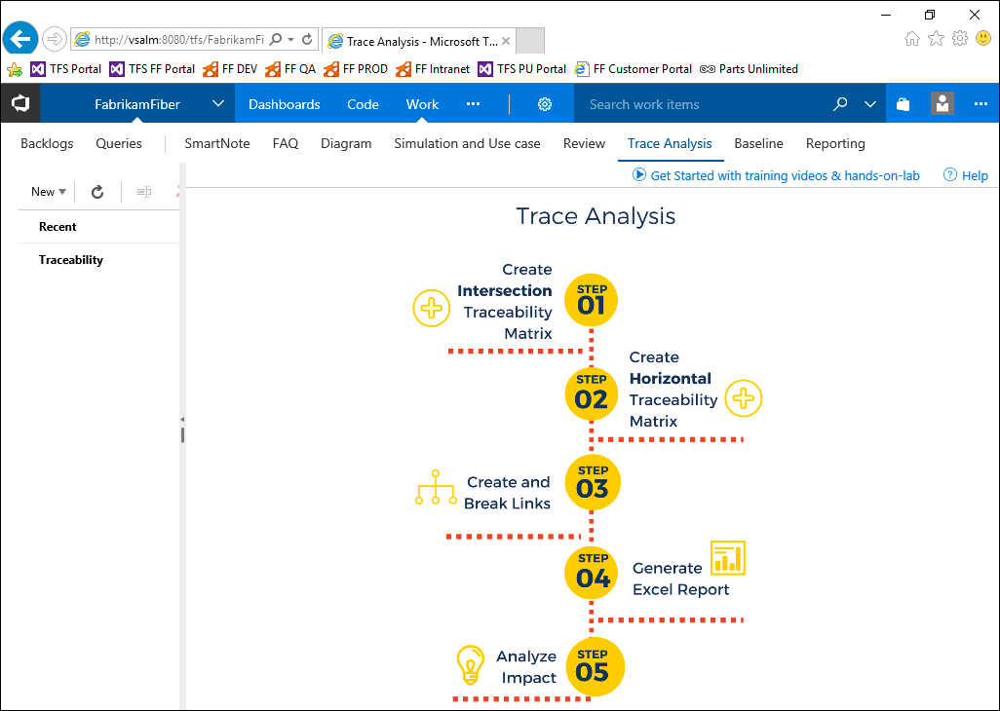

   **Figure 7** The Trace Analysis home page

5. Select the **New** option in the Folder Explorer panel (at left hand side) and then select the **Traceability** option.

   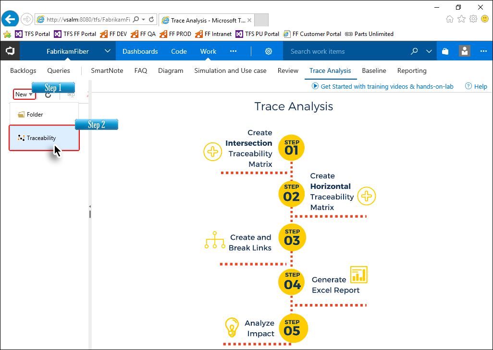

   **Figure 8** Creating the new traceability matrix

5. Enter a suitable name for the Intersection Matrix and click **OK**.

   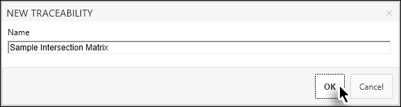

   **Figure 9** Naming the Intersection Matrix

   - Clicking **OK** takes us to the Editor page where we can configure the settings to create the Intersection Matrix, including the Horizontal Matrix.

   - The Intersection Matrix can be created as a work item type or saved-query type. In this lab we will create the matrix as a work item type.

   - The work item type gives more control to users by enabling them to choose the desired work item instead of pre-saved queries. In the saved-query type, users can select only those work items for which a relevant query exists in the selected Team Project.

5. Set the Area and Iteration Path as **Fabrikam Fiber** (if not already selected).

   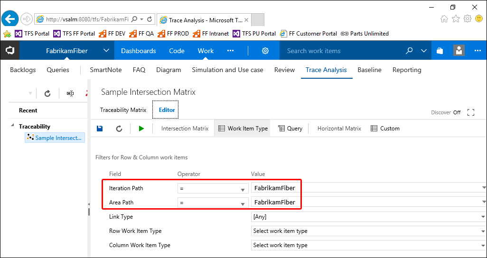

   **Figure 10** Configuring the Area and Iteration Paths for the work item type Interaction Matrix

5. Select the desired Link Type.

   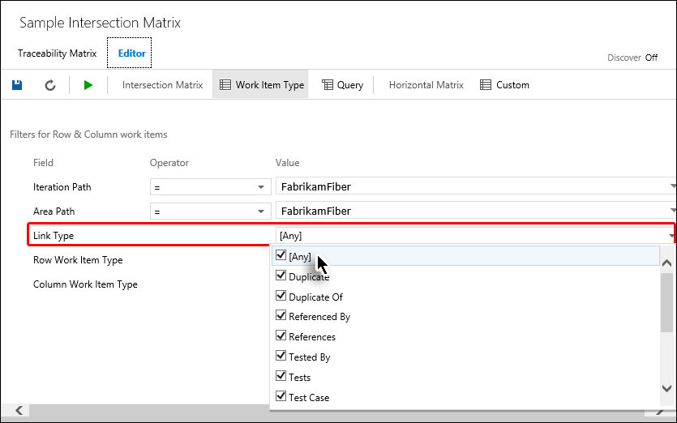

   **Figure 11** Configuring the link type

5. Select the desired Row Work Item Type.

   

   **Figure 12** Configuring the row work item

5. Select the desired Column Work Item Type.

   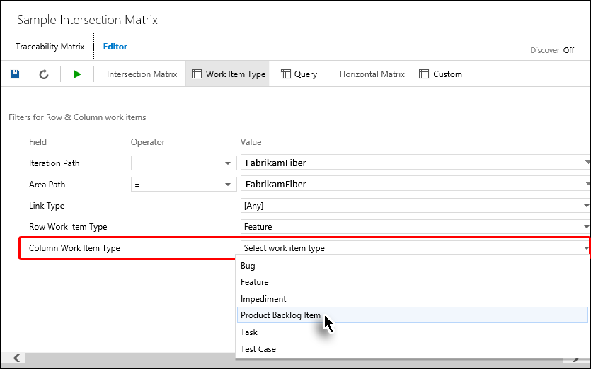

   **Figure 13** Configuring the Column Work Item

5. Now select the **Run Query** option in the toolbar.

   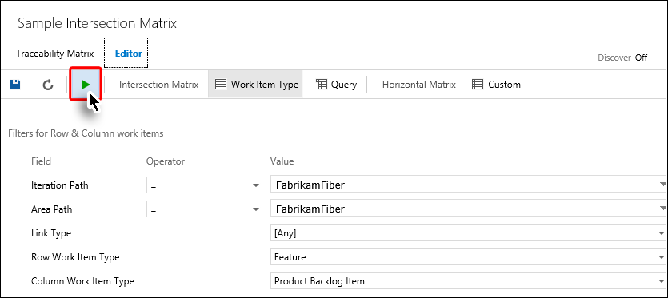

   **Figure 14** Running the query based on the configuration selections made in previous steps

   The Intersection Matrix is generated, as seen in the image below.

   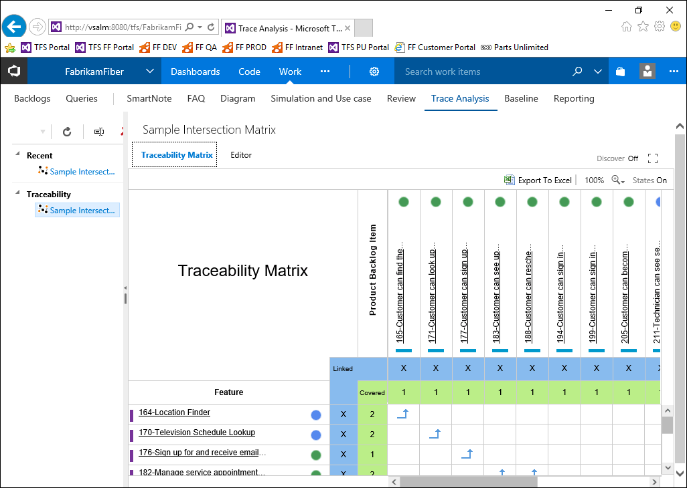

   **Figure 15** The Intersection Matrix just after its creation

5. To view the matrix in full screen mode, click the **Full Screen** button at the top-right side of the matrix.

   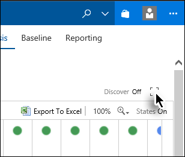

   **Figure 16** Invoking the full screen mode

   The matrix is displayed in full screen mode. You can also adjust the zoom ratio to view more information simultaneously.

   

   **Figure 17** Intersection Matrix in full screen mode

   To exit from full screen mode click the same button once again.

   

   **Figure 18** Invoking regular mode

###  Task 2: Adding/deleting relationships in Intersection Matrix

In this exercise you will learn how to add or remove relationships in the Intersection Matrix.

The arrows in the intersection cell of the matrix indicate that a
relation exists between corresponding work items of the row and column.

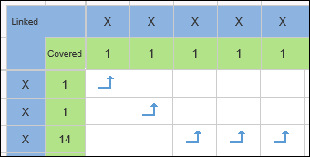

**Figure 19** Arrows in the Intersection Matrix

All types of relationships are grouped into three link types. The
following table sums up the legends used.

<table width="50%">
   <thead>
      <tr>
         <th><b>Icon</b></th>
         <th><b>Relationship Link Type</b></th>
      </tr>
   </thead>
   <tr>
      <td></td>
      <td>Network</td>
   </tr>
   <tr>
      <td></td>
      <td>Dependent</td>
   </tr>
   <tr>
      <td></td>
      <td>Tree</td>
   </tr>
</table>

### Adding a relationship

1. Invoke the **Trace Analysis** module from Dashboard.

2. Create/open an Intersection Matrix.

3. Determine the intersection cell for creating a relationship between corresponding work items.

   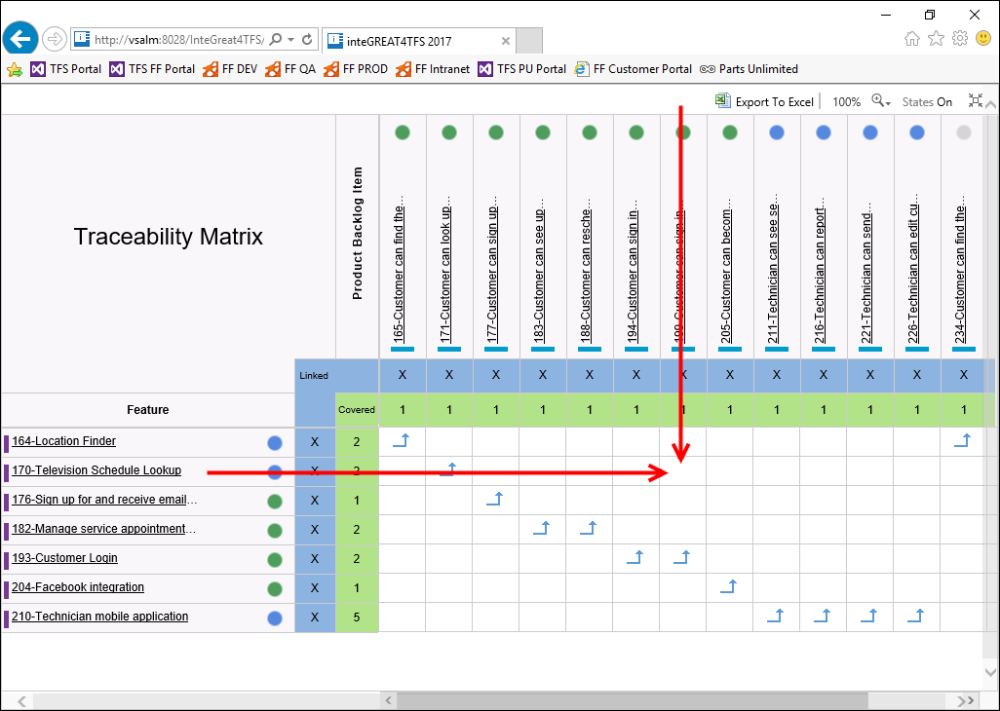

   **Figure 20** The target intersection cell used to create a relationship

1. Place the mouse over the intersection cell, which will show a + sign.

   

   **Figure 21** The + sign in the cell

1. Click the + sign.

2. Select the desired link type.

   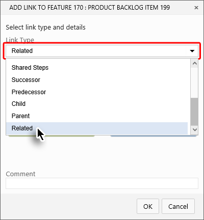

   **Figure 22** Selecting the desired link type

1. Click **OK**.

   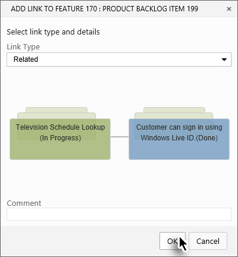

   **Figure 23** Completing the relationship creation process

   The relationship is created in the target cell of the Intersection Matrix.

   

   **Figure 24** The newly created relationship as depicted in the intersection cell of the matrix

   The relationship is not only displayed in the matrix, it can also be seen using Web Access or Visual Studio.

### Deleting a relationship

Deleting a relationship is very similar to the way we created it.

1. Determine the intersection cell for deleting the relationship
    between corresponding work items.

2. Place the mouse over the intersection cell, which will show a - sign.

   

   **Figure 25** The - sign in the cell

1. Click the - sign.

2. Click **OK**.

   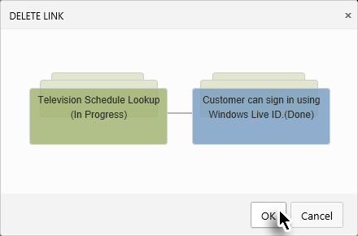

   **Figure 26** Completing the relationship deletion process

   The relationship is deleted.

   

   **Figure 27** The intersection cell after deleting the relationship

   This brings us to the end of this exercise.

### Task 3: Editing work items

In this exercise you will learn how to edit work item properties (apart from the link/relationship property that we have already discussed in the previous exercise).

1. Invoke the **Trace Analysis** module from Dashboard.

2. Create/open an Intersection Matrix.

3. Now place the mouse over the desired work item.

   

   **Figure 28** Invoking the mouse over event for the desired work item

1. Click the **Edit** icon in the popup window.

   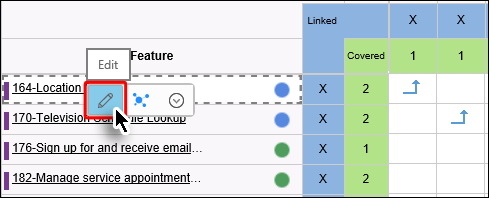

   **Figure 29** Clicking the Edit icon in the popup

1. Edit the desired properties of the work item and click **Save**.

   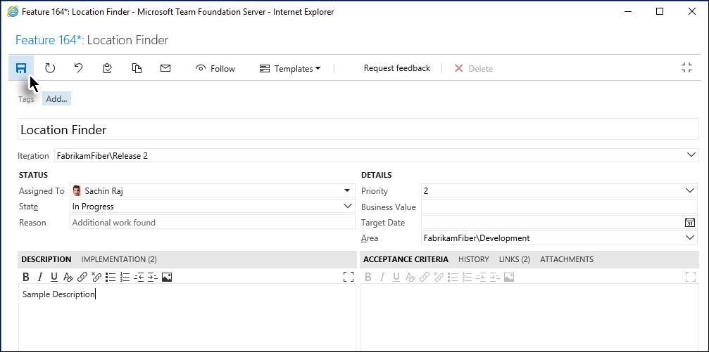

   **Figure 30** The Web Access window where the properties of the selected work item can be edited and saved

1. Close the popup window.

   

   **Figure 31** Completing the work item editing process

The changes to the work item are saved, which brings us to the end of the exercise.

### Task 4: Creating a Horizontal Matrix

In this exercise you will learn how to create a Horizontal Matrix.

The Horizontal Matrix illustrates the relations of a particular work
item type, including the relations of those relations, and so on (up to level 3)

1. Invoke the **Trace Analysis** module from Dashboard.

2. Click **New** followed by selecting the **Traceability** option from the drop-down menu.

   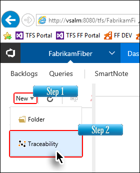

   **Figure 32** Initiating the matrix creation process

3. Enter a suitable name for the Horizontal Matrix and click **OK**.

   

   **Figure 33** Naming the Horizontal Matrix

   Clicking **Next** takes us to the Editor page where we configure the settings to create the Horizontal Matrix as well as the Intersection Matrix.

1. Open the **Custom** option.

   

   **Figure 34** Clicking the Custom option to invoke the settings for creating the Horizontal Matrix

1. Select the desired **Area** and **Iteration Path**.

   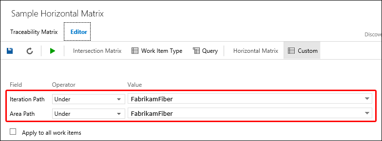

   **Figure 35** Configuring the Area and Iteration Paths

1. Select the relevant work item for Column 1.

   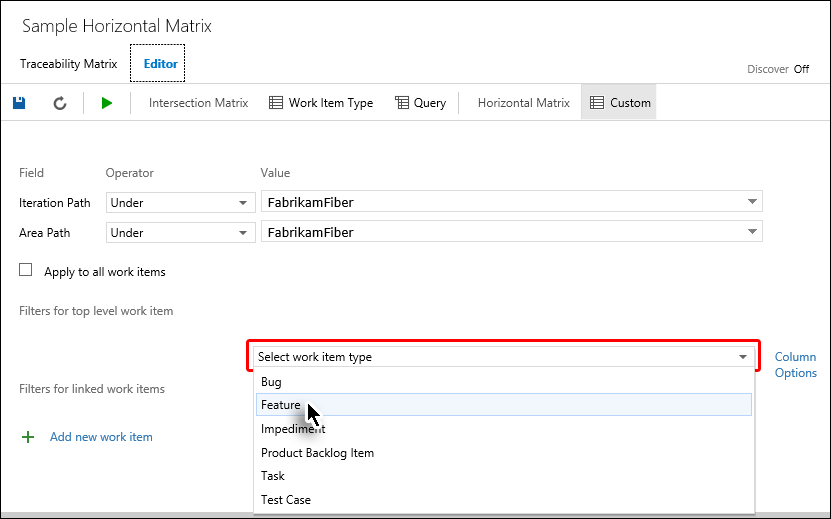

   **Figure 36** Selecting the Column 1 work item

1. The Column 1 work item tells Modern Requirements4TFS to show the list of all work items of the selected type

2. The Column 2 work item tells Modern Requirements4TFS to show the list of work items of the selected type that are linked with the Column 1 work items. A similar principle is followed for the columns 3 & 4 work items.

3. If a Column 1 work item has no relation with the Column 2 work items but has a link with the Column 3 or 4 work item(s), then it’s also shown bypassing the Column 2 work item.

4. Selecting the Column 1 work item is mandatory while all other
columns are optional.

1. Similarly, select the relevant work item(s) for additional columns if desired.

   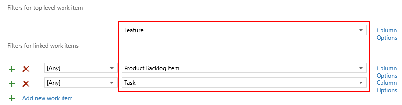

   **Figure 37** Selecting the columns 2 and 3 work items

1. Click the **Run** button in the toolbar.

   

   **Figure 38** Completing the Horizontal Matrix creation process

   The Horizontal Matrix is generated and displayed.

   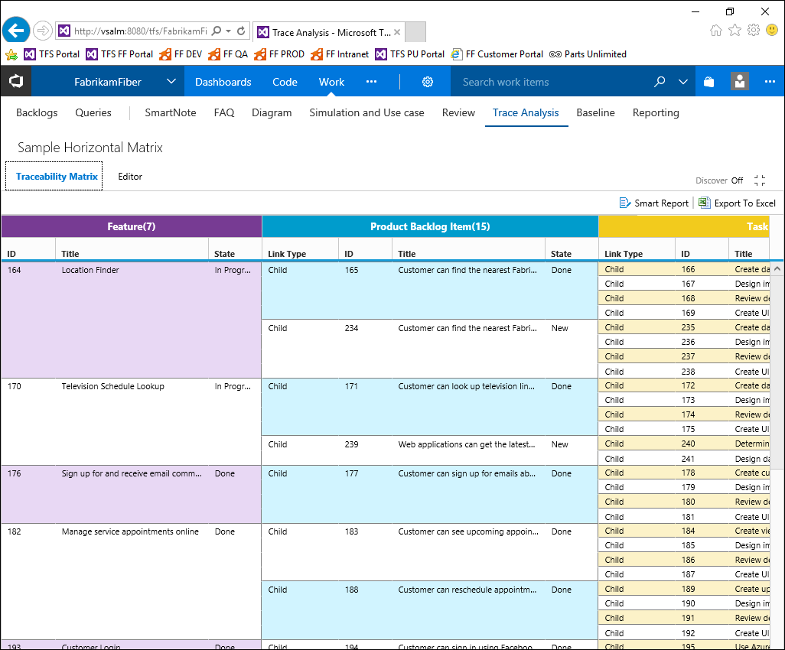

   **Figure 39** The Horizontal Matrix after generation

This brings us to the end of this exercise.

### Task 5: Export to Excel

In this exercise you will learn how to export the desired type of matrix (intersection or horizontal) to MS-Excel.

1. Invoke the **Trace Analysis** module from Dashboard.

2. Create/open the desired type of matrix.

3. Select the **Export To Excel** option in the mini toolbar.

   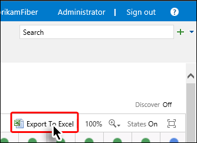

   **Figure 40** Clicking the Export to Excel option

   The Excel file is created.

   

   **Figure 41** The notification of the recently created Excel file
   
   The file can now be opened in MS-Excel using the **Open** or **Save** options as desired.

   

   **Figure 41** The exported file as it appears in MS-Excel

This brings us to the end of this exercise.

## Exercise 3: Baseline Management with Modern Requirements4TFS

### Task 1: Accessing Modern Requirements 4TFS and creating a baseline

In this exercise, you will learn how to access Modern Requirements4TFS and create a baseline.

Modern Requirements4TFS is an online application that complements Smart Office4TFS in managing team projects. Modern Requirements4TFS consists of many distinct modules including: **Trace Analysis**, **SmartOffice Library**, **Simulation, Diagram, Use Case,** **Review** and **Baselining**. In this hands-on lab, we will be using the **Baselining** module only.

1. Log in as **Administrator** with the password **P2ssw0rd**.

2. Start Internet Explorer.

3. Access the following URL: **VSALM:8028**

   

   **Figure 1** Accessing Modern Requirements4TFS tab

    The Modern Requirements4TFS welcome page is displayed in the
    browser.

    

    **Figure 2** The Modern Requirements4TFS welcome page

1. Select the **FabrikamFiberCollection**.

   

   **Figure 3** Selecting the desired collection

1. Select the **FabrikamFiber** project.

   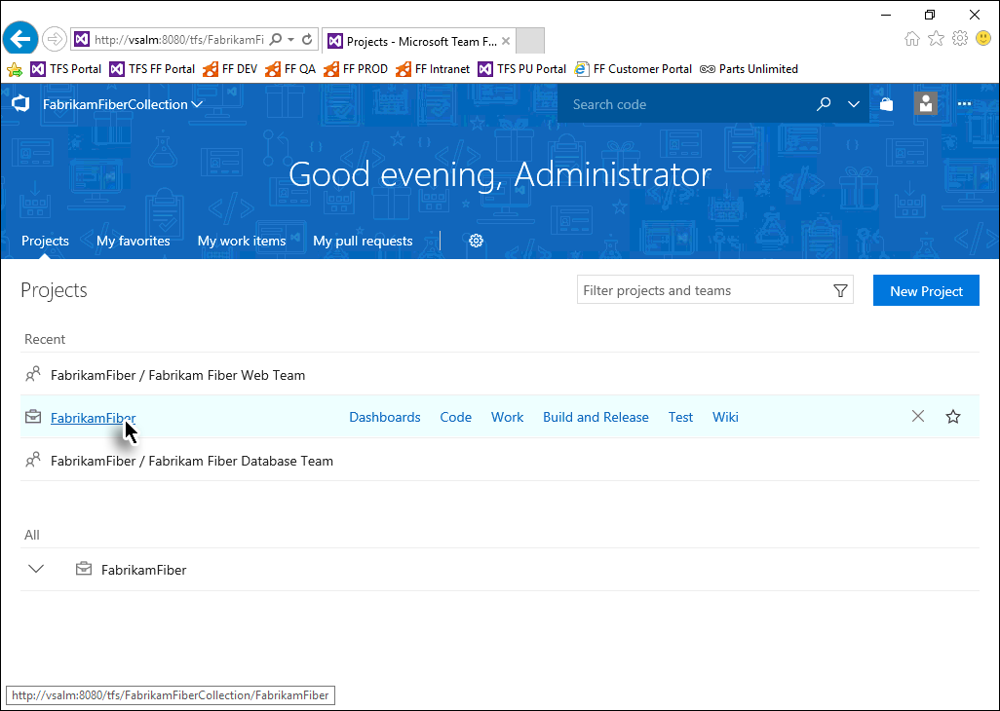

   **Figure 4** Selecting the desired project

1. Select the **Work** option in the toolbar followed by selecting the **Baseline** option from the drop-down menu.

   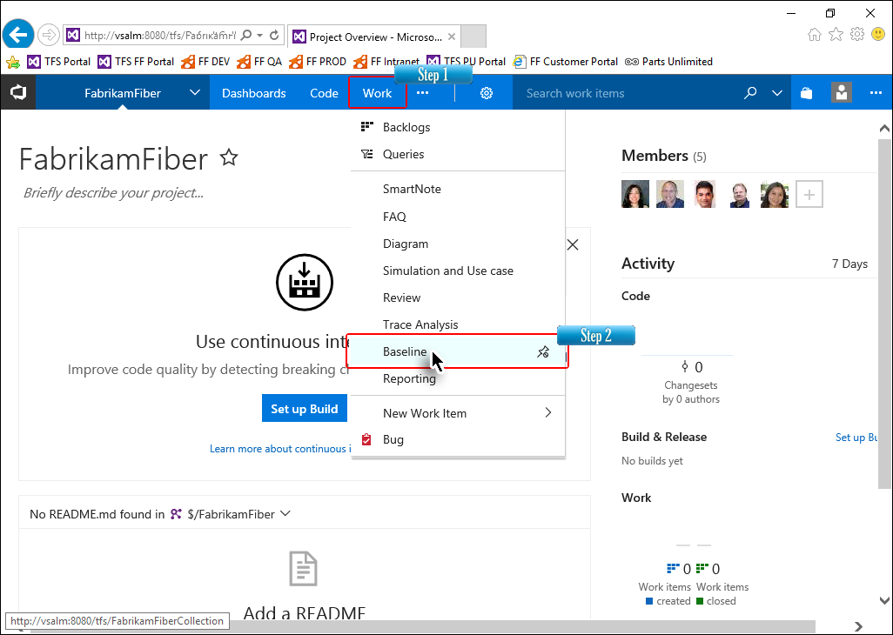

   **Figure 5** Invoking the baseline module

   The landing page of the baselining module is displayed. Initially, the module will be empty since we haven’t created any baselines yet.

5. Select the **New** option followed by the **Baseline** option from the drop-down menu.

    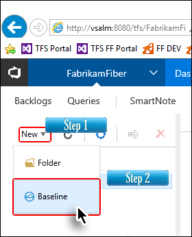

    **Figure 6** Invoking the baseline creation option

6. Enter a suitable name for the baseline; provide a description and click **Next**.

   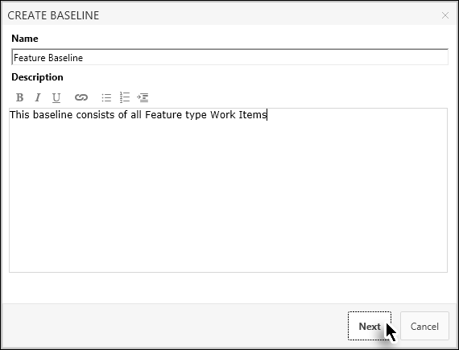

   **Figure 7** Entering the required information for the baseline

   Clicking the **Next** button takes us to the query window where we have to search for the work items that we want to include in the baseline. We can search based on the saved queries, IDs, full names or parts of the names.

5. Select the desired query and click **Find**.

   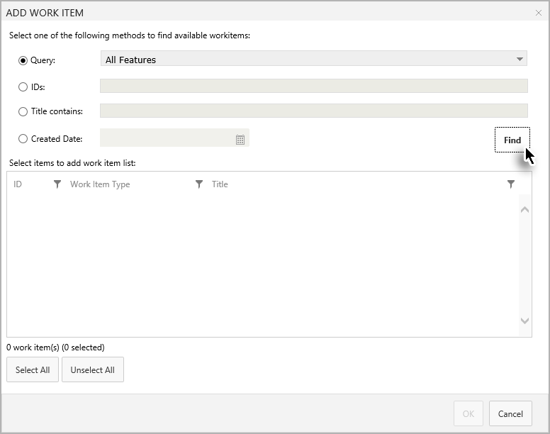

   **Figure 8** Finding the required work items

5. Select the desired work items from the query result and click OK to add the work items.

   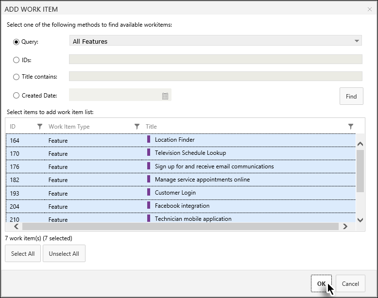
   
   **Figure 9** Adding the desired work items in the baseline

   The work items window is closed and the added work items are listed in a new page. At this moment, we have created a list of work items that are ready to be included in our baseline. However, the baseline itself has not yet been created. This extra step helps users to include additional work items, remove unwanted ones or edit them before finalizing the baseline.

5. Click Save.

   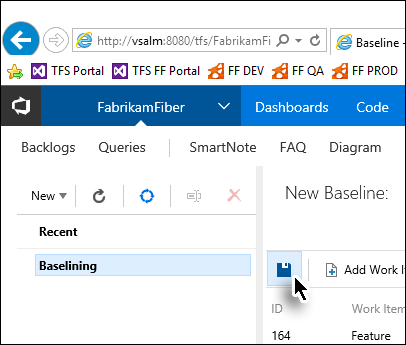

   **Figure 10** Completing the baseline creation process

   The baseline is created.

   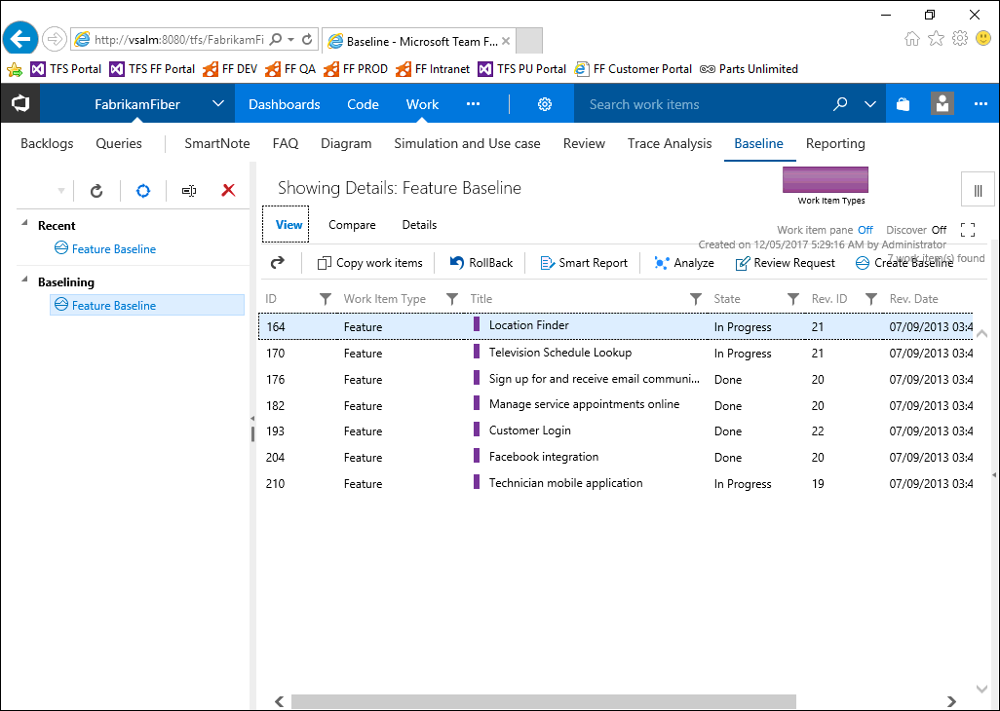

   **Figure 11** Baseline as it appears just after creation.

This brings us to the end of this exercise.

###  Task 2: Comparing baselines

In this exercise you will learn how to compare two baselines and create a difference report.

1. Invoke the **Baselining** module from Dashboard.

2. Open the desired baseline using the Baseline Explorer Panel.

3. Now open the **Compare** tab (below the baseline’s name in the main panel).

   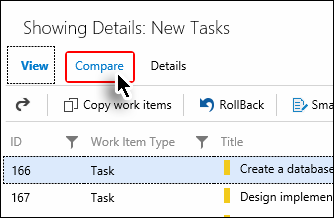

   **Figure 12** Invoking the Compare tab

1. Click the downward arrow in the main toolbar.

   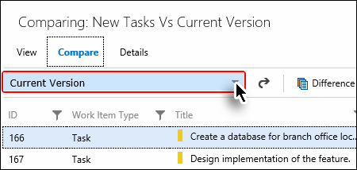

   **Figure 13** Invoking the comparison drop-down

1. Select the desired baseline to compare with the current baseline.

   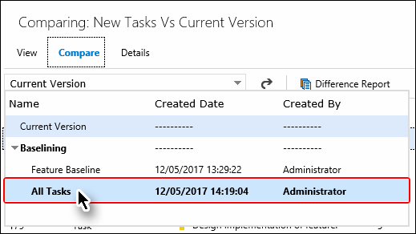

   **Figure 14** Selecting the baseline for comparison

   The comparison between two baselines is shown in the grid. The work items that have been updated have a “Changed” status in the “Comp. Status” column.

   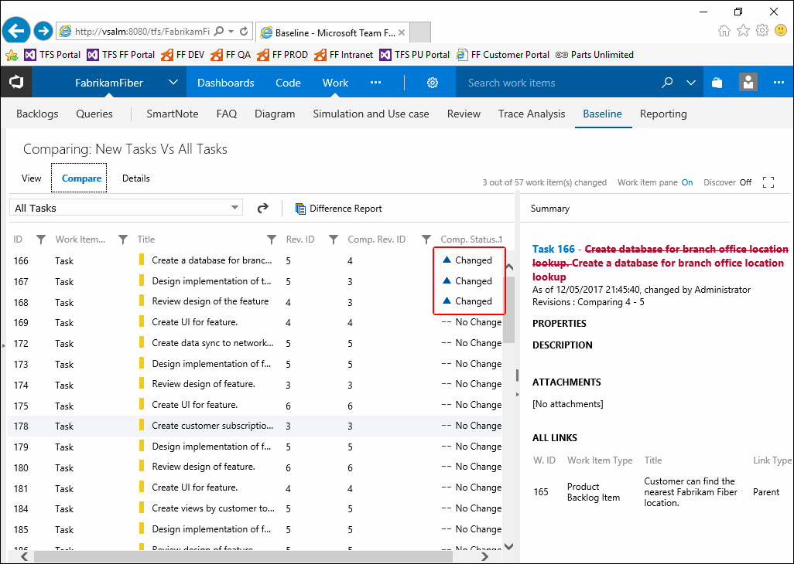

   **Figure 15** Baseline comparison

   The updates in the selected work items are shown in the **Work Item Details Pane** (at the right hand side of the window). If the difference isn’t evident, click **Summary** at the top right of the Work Items Details Pane. The pane will show only the differential values.

1. To switch to Summary mode (for easy viewing of the updates), click **Summary** in the **Work Item Details Pane**. The pane will show only the values that have been updated.

   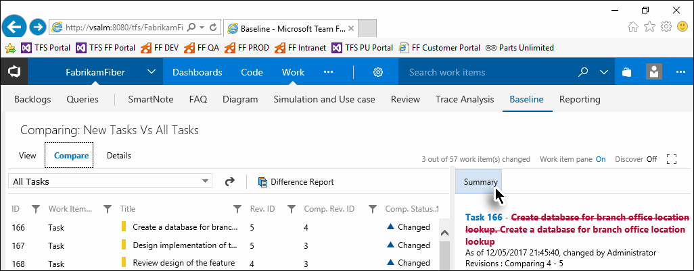

   **Figure 16** Switching to Summary mode

1. Select the **Difference report** option in the main toolbar.

   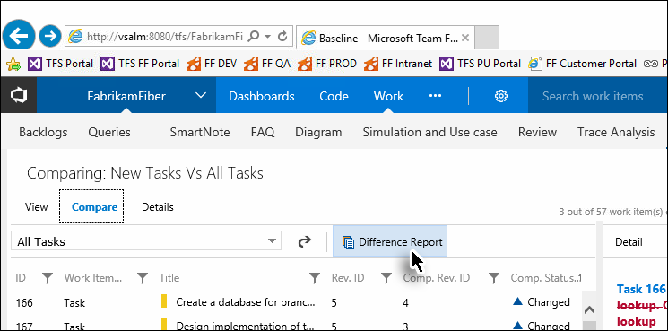

   **Figure 17** Creating the Difference report (Step1)

1. Enter the required information and click **Generate**.

   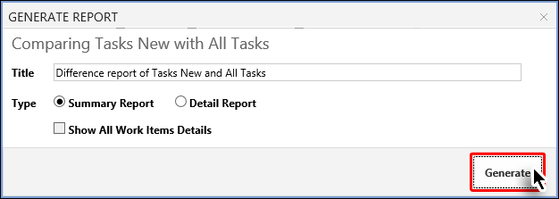

   **Figure 18** Creating the Difference report (Step2)

   The Difference report is created in the MS-Word format.

1. Save or Open the file to complete the process.

   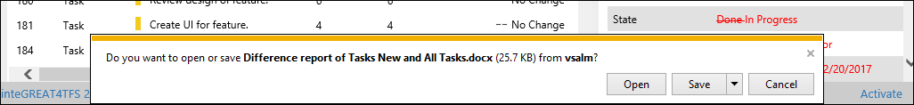

   **Figure 19** Message shown after the creation of the Difference report

   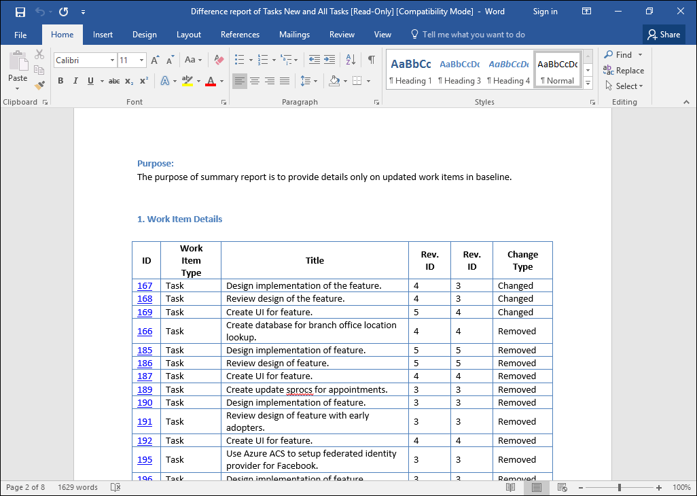

   **Figure 21** The Difference report opened in Microsoft Word

### Task 3: Copying Baselines

In this exercise you will learn how to copy a baseline (or its work items) to create a new baseline. The copied baseline can be pasted into the same team project or into another project. In both cases the process is the same, the only difference being in the target team project option.

1. Open the desired baseline.

2. Select the **Copy Work Items** option in the main toolbar.

   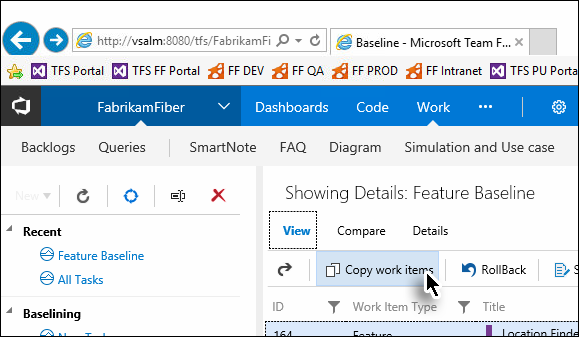

   **Figure 22** Initiating the Copy baseline process

   The Copy Work Item window appears. Its options are divided into three sections as marked in the image.

   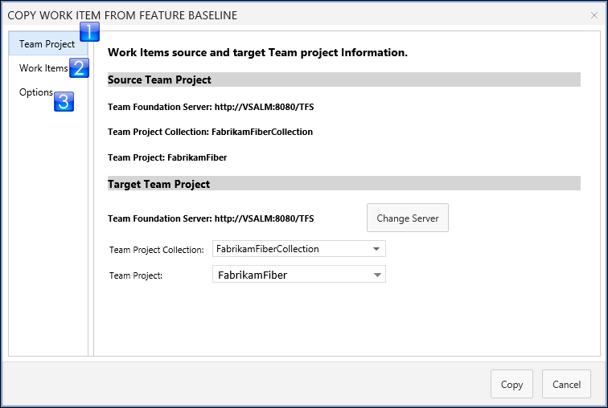

   **Figure 23** The Copy Work Item window

   The **Team Project** option (in the Target Team Project section) tells us where the baseline will be copied to. This may be in the same team project, another project or a re-use library project?

   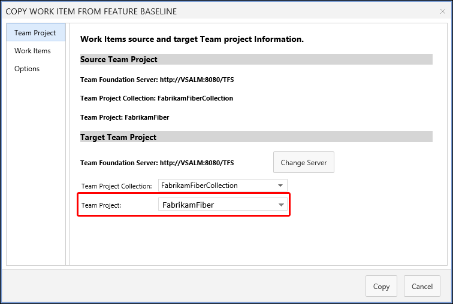

   **Figure 24** The Target Team Project option

3. Set the options in the **Team Project** section and then open the **Work Items** tab in the window.

   

   **Figure 25** Moving towards the Work Items tab

   All work items that are in the selected baseline are shown below. Users can select all work items (using the **Select All** button) or select the desired work items one by one (using **Ctrl + click)**.

   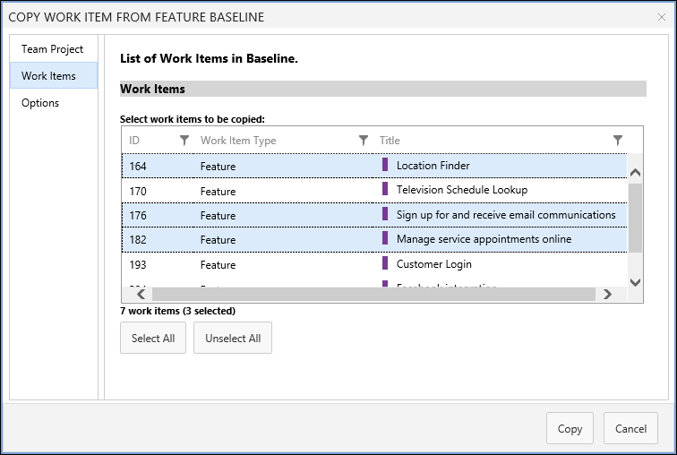

   **Figure 26** Work item options

3. Select the desired work items and then open the **Options** tab.

   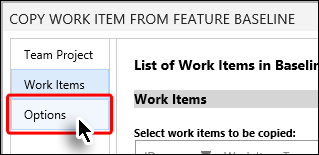

   **Figure 27** Moving towards different options in the Options tab

   If we tick the **Create Baseline of copy work item(s)** checkbox (marked in the image below) then the baseline is copied as well, otherwise only the selected work items are copied.

3. Set the desired options and click **Copy**.

   

   **Figure 28** Completing the baseline copying process

   A copy of the baseline is created and a message is displayed.

   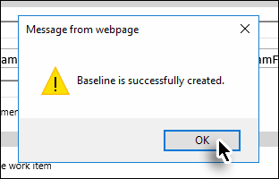

   **Figure 29** Baseline creation message

   The newly created baseline is now accessible through the Baseline Explorer Panel.

   

   **Figure 30** A newly created baseline

This brings us to the end of this exercise.

## Exercise 4: Review Management with Modern Requirements4TFS

In this exercise you will learn how to create a review request using the Review Management module of Modern Requirements4TFS.

Modern Requirements4TFS is an online application that complements Smart
Office4TFS in managing team projects. Modern Requirements4TFS consists of many distinct modules such as: **Trace Analysis**, **SmartOffice Library**, **Simulation, Diagram, Use Case,** **Review** and **Baselining**. In this HOL, we will be using the **Review** module only.

1. Log in as Administrator with the password **P2ssw0rd**.

2. Start Internet Explorer.

3. Access the following URL: **VSALM:8028**

   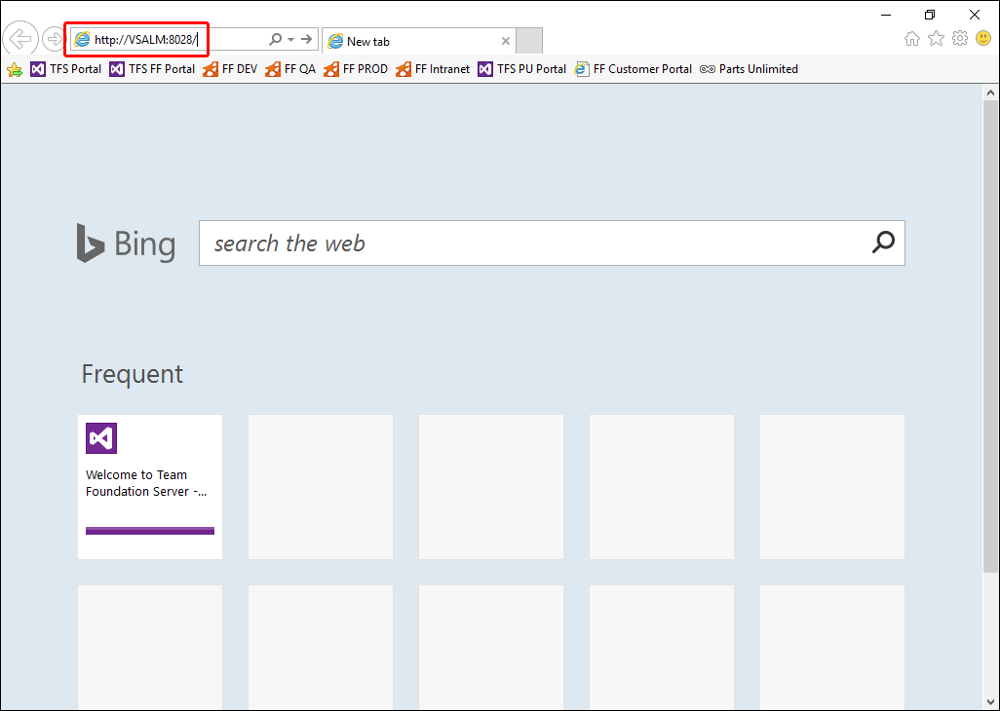

   **Figure 1** Accessing the Modern Requirements4TFS tab

   The Modern Requirements4TFS welcome page is displayed in the browser.

   

   **Figure 2** The Modern Requirements4TFS welcome page.

1. Select the **FabrikamFiberCollection**.

   

   **Figure 3** Selecting the desired collection

1. Select the **FabrikamFiber** project.

   

   **Figure 4** Selecting the desired project

1. Select the **Work** option in the toolbar and then select **Baseline** from the drop-down menu.

   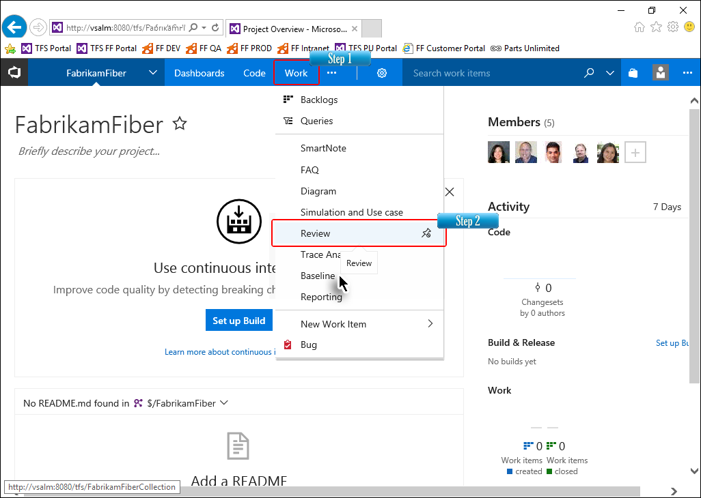

   **Figure 5** Selecting the Review Management link

    The landing page of the Review Management is displayed. The landing page will be empty since we have generated no review requests and no requests have been assigned to us yet.

1. Click **New** and then select the **Review Request** option from the drop-down menu.

   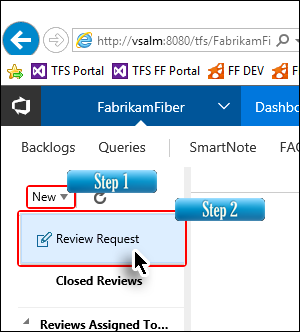
   
   **Figure 6** Invoking the Review Request option

   The Review Request pop-up is displayed. This pop-up is used to configure all the settings for the review requests.

   

   **Figure 7** The Review Request pop-up window

1. Select the reviewers from the drop-down menu.

   

   **Figure 8** Selecting the reviewers

   You can select more than one reviewer.

1. Similarly, select the desired approvers.

   

   **Figure 9** Selecting the approvers

   **Reviewers** only provide comments while **Approvers** can also approve/reject items. A user can be selected as either a reviewer or an approver.

1. Enter an appropriate subject for the review request.

   

   **Figure 10** Entering a subject for the review request

   >The subject of the review request becomes the subject of the email sent by Modern Requirements4TFS to the selected approvers/reviewers

1. Scroll down to get to the other steps in the window.

2. Provide a purpose for the review if desired. Alternatively collapse the section by clicking the downward arrow at far right.

   

1. Figure 11 The Purpose section in the pop-up window

1. Click the Add Work Item button.

   

   **Figure 9** Clicking the Add Work Item button

1. Run the relevant query.

   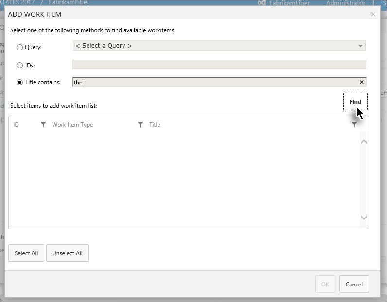

   **Figure 10** Running the query to the Add Desired Work Items list

   A list of work items appears depending on the query we ran. We can now select the desired ones from the list.

1. Select the desired work items (for which the review is desired) and click the **Add Work Item** button.

   

   **Figure 11** Selecting the desired work items

1. Select the desired Area Path.

   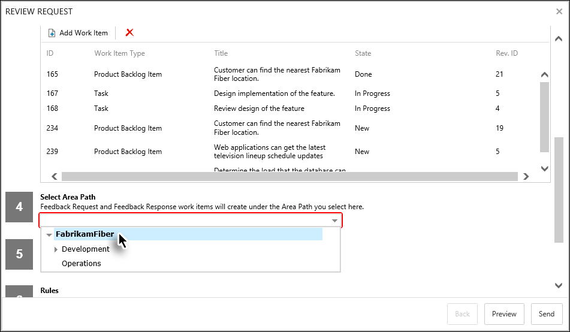

   **Figure 12** Selecting the area path

1. Set the due date.

   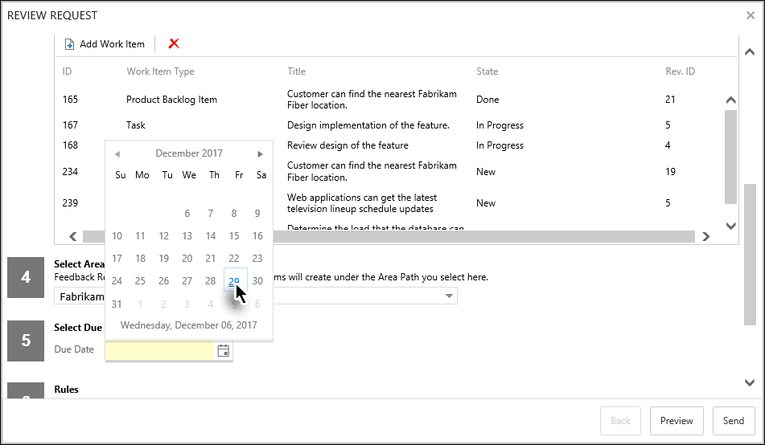

   **Figure 13** Setting the due date

1. Set the desired rules and click **Preview**.

   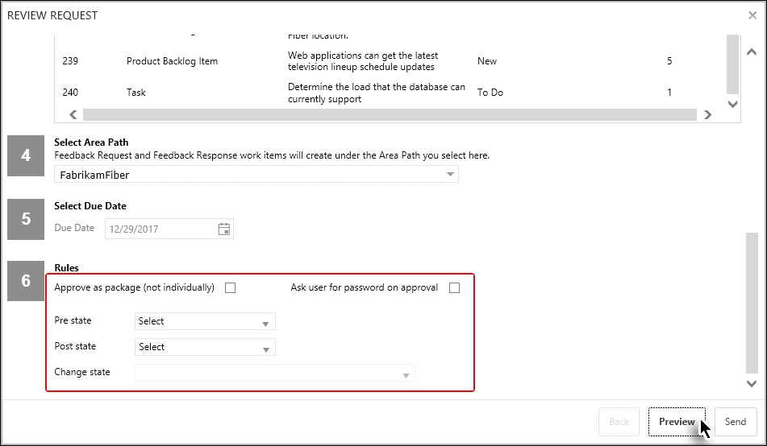

   **Figure 13** Invoking the preview

   The Preview is displayed. In preview, only the text box area is editable. All other information, including recipients, Due Date etc. are shown in the read-only format. If these need to be edited then the user has to go back and alter the relevant options.

1. Make formatting updates (if desired) and click **Send**.

   

   **Figure 14** Completing the review request

   The review request is created and becomes visible at the module's landing page.

   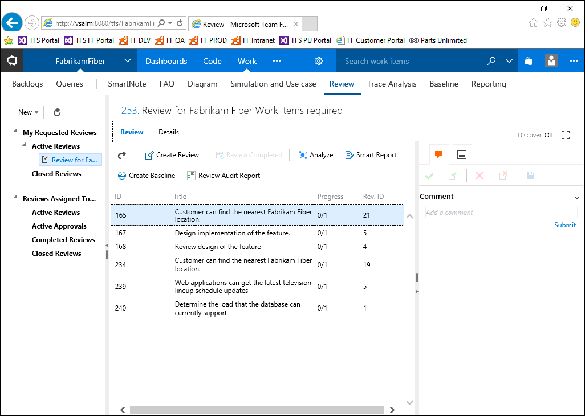

   **Figure 15** The Review Request as it appears just after creation

This brings us to the end of this exercise.

### Task 2: Responding to Review Requests

In this exercise you will learn how to respond to a review request using the Review Management module of Modern Requirements4TFS.

The review requests assigned to a user are arranged under the **Assigned to Me** heading in the Folder Explorer.

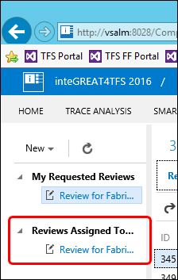

**Figure 16** The Reviews Assigned To Me section in the Folder
Explorer

The process of responding to the review requests is slightly different
for reviewers than for approvers. The following steps describe the process for approvers. Reviewers can only give comments. The
Accept/Reject options doesn’t appear in the UI for reviewers.

1. Click the relevant review request under the **Reviewed** **Assigned To Me** heading in the Folder Explorer.

   

   **Figure 17** Selecting the review request for response

1. Select the work item for which the review is to be given.

   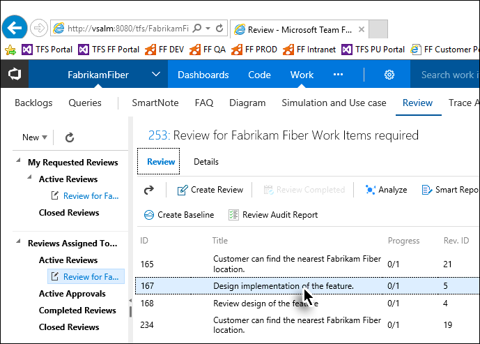

   **Figure 18** Selecting the work item

1. Provide a comment if desired.

   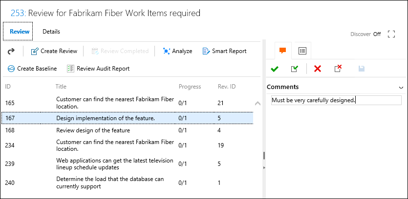

   **Figure 19** Providing a comment for the selected work item

1. Click **Accept** or **Reject**.

   

   **Figure 20** Clicking Accept

   The response for the selected work item is completed.

   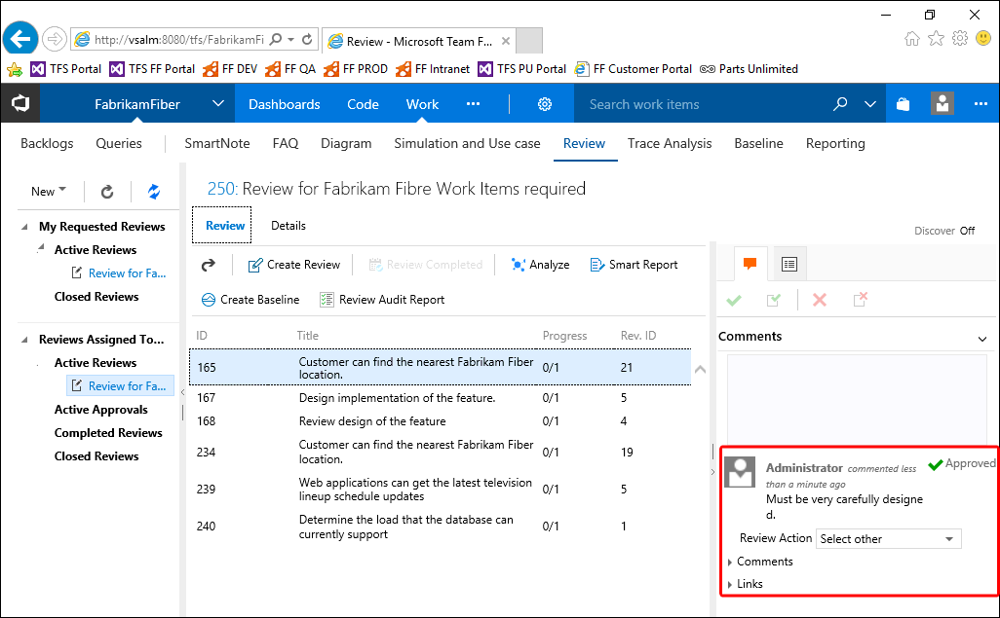

   **Figure 21** The response of the selected work item as it appears after process completion

1. Repeat the process with all other work items of the review request. Giving comments is not mandatory for approvers but it’s mandatory for stakeholders.

   

   **Figure 22** The Accept/Reject options available only to approvers

If the **Accept All** or **Reject All** option is selected instead of the simple **Accept/Reject** option, then the response will be finalized for all work items of the review request. This means that the user won’t have to repeat the whole process for each work item as indicated in the last step.
