<div class="rw-ui-container"></div>

## Overview

Many developers still rely on traditional or live debugging techniques which shows only your applications current state with limited data about past events. You either have to guess what happened based on your current state, or you have to recreate these events by rerunning your app. Developers rely on breakpoints to try capturing some of the errors that might appear because of unknown events, sometimes even a breakpoint won't be able to reach the issue - after all, maybe the breakpoint won't be hit at all.

Diagnosing issues in the cloud is especially time consuming for a few reasons:

- Issues are often caused by different configuration, data, and usage patterns

- You don't have the same debugging tools readily available in the cloud that you have locally

- Your production site is serving live traffic, so you are limited in what you can do

Snapshot Debugger expands this traditional debugging experience by recording specific events and data at these points in time. This lets you see what happened in your application when the exception was thrown with call stack information and variables. Snapshot Debugger enables to you drill down into an application's code at the exact moment that the exception occurred to help pinpoint causes of issues without having to negatively impact the performance of the app while it's in production. Snapshot Debugger will help you find any problem, no matter how hard, especially when logs leave you hanging.

# Prerequisites

In order to complete this lab you will need the Visual Studio 2017 virtual machine provided by Microsoft. For ## Prerequisites

In order to complete this lab you will need the Visual Studio 2017 virtual machine provided by Microsoft. Click the button below to launch the virtual machine on the Microsoft Hands-on-Labs portal.

<a href="https://www.microsoft.com/handsonlabs/SelfPacedLabs/?storyId=external://content-private/content/external/Microsoft-Virtual-Labs/DT00158" class="launch-hol" role="button" target="_blank"><span class="lab-details">Launch the virtual machine</span></a>

Alternatively, you can download the virtual machine from [here](../almvmdownload/) information on acquiring and using this virtual machine, please see [this blog post](http://aka.ms/almvm).

You also need an [Azure account](https://azure.microsoft.com/) ([Get a $25 monthly Azure credit by joining Visual Studio Dev Essentials](https://www.visualstudio.com/dev-essentials/)).

## Exercise 1: Debugging with Snapshot Debugger

### Task 1: Configuring Application Insights for Snapshot Debugging

1. Log in as **Sachin Raj (VSALM\Sachin)**. All user passwords are **P2ssw0rd**.

1. Launch **Visual Studio** from the taskbar.

1. Open the **PartsUnlimited** solution from the **Start Page**.

    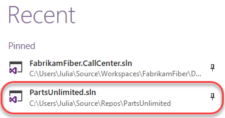

1. From **Solution Explorer**, right-click the **PartsUnlimitedWebsite** project node and select **Manage NuGet Packages**.

    

1. From the **Browse** tab, search for **"snapshot collector"**and select **Microsoft.ApplicationInsights.SnapshotCollector**. Click **Install** and accept any licenses.

    

1. Right-click the project node once again in **Solution Explorer** and select **Application Insights \| Configure Application Insights**.

    

    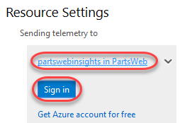

1. For the purposes of this lab, select the option to create a new **Resource** and click **Update resource**.

    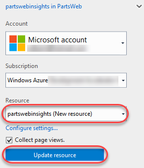

1. Click **Update SDK** to update to the latest Application Insights bits.

    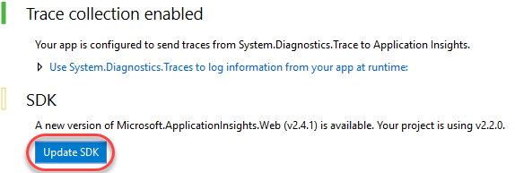

1. Open **ApplicationInsights.config** from the root of the web app folder. You will see the section defining the parameters for the snapshot collector as one of the telemetry processors.

    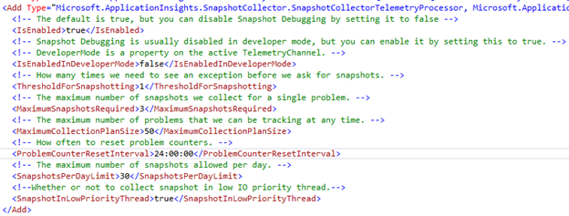

1. In the **TelemetryModules** section, locate the section where the **FirstChanceExceptionStatisticsTelemetryModule** has been commented out. Uncomment this section in order to capture first-chance exceptions and save the file. This will allow you to track exceptions that are handled within the application, which is necessary for this lab scenario.

    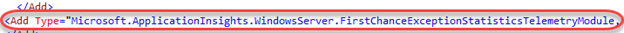

1. For the purposes of this lab you will need to hand-edit the web app's project file. In **Solution Explorer**, right-click **PartsUnlimitedWebsite** and select **Unload Project**. Save files when prompted.

    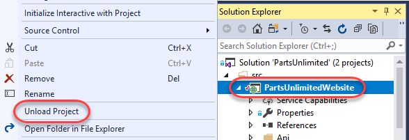

1. Right-click the project file again and select **Edit PartsUnlimitedWebsite.csproj**.

    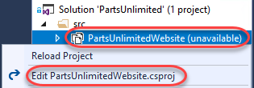

1. Locate the section describing the **Release \| AnyCPU** platform configuration and add the element below. Save and close the file.

    ```cmd
    <DebugSymbols>true</DebugSymbols>
    ```
    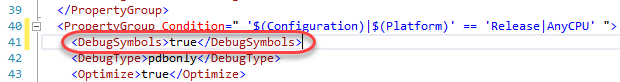

1. Right-click the project node again and select **Reload Project**.

    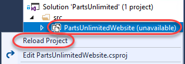

### Task 2: Publishing the application to Azure

1. In **Solution Explorer**, right-click the project node and select **Publish**.

    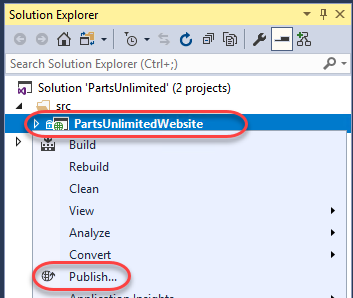

1. Click **Create new profile**.

    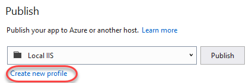

1. Select **Microsoft Azure App Service** and click **OK**.

    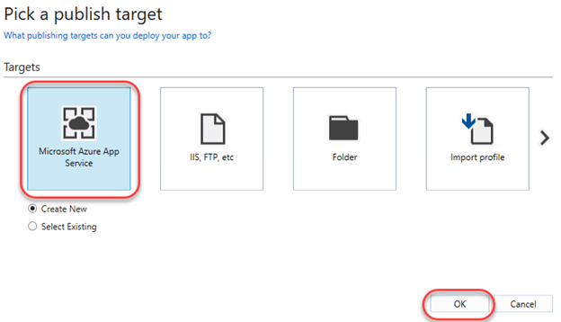

1. Select the **Resource Group** created earlier for the Application Insights instance. If you left it as the default, it should be **PartsWeb**. Note that certain features, such as attaching the snapshot debugger (in a later task) require a paid app service plan. You may confirm that this app service plan's **Size** is not **"Free"** or **"Shared"** using the **New** button next to its field.

    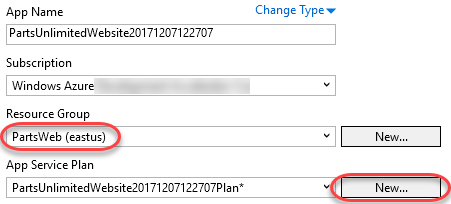

1. Click **Explore additional Azure services**.

    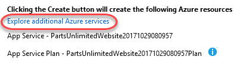

1. Click the **Add** button for **SQL Database**.

    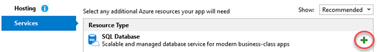

1. Click **New** to create a new Azure SQL Server.

    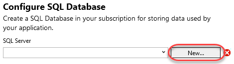

1. Provide credentials for the database. You may select your own or use something like **sysadmin** and **P2ssw0rd**. Click **OK**.

    

1. Update the **Connection String Name** to **"DefaultConnectionString"**. This is the property Visual Studio will look for in your Web.config to replace with the Azure SQL Database connection string during the publish process. Click **OK**.

    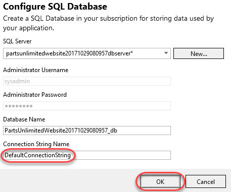

1. Click **Create** to create the app service and publish.

    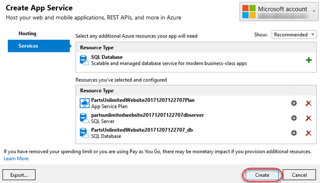

1. The deployment process will take a few moments.

    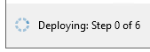

1. Once it completes, your application will be published and a browser will be opened to it in Visual Studio.

### Task 3: Generating and tracing some failures

1. Use the Parts Unlimited site to search for **"jumper lead"**.

    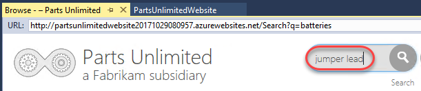

1. There should be a hit since this is a stocked product.

    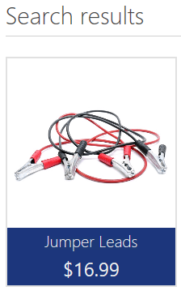

1. Search again for **"jumper leads"** (note the plural).

    

1. This time there are no results. This is clearly a bug since the site search is supposed to support both of these search strings. However, because there is no end-user error, a bug like this could go undetected for a very long time. Search a few more times (at least five) for this same string to confirm that there are no results each time.

    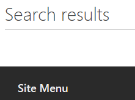

1. Open a new browser window to the Azure portal at [https://portal.azure.com](https://portal.azure.com/) and log in.

1. Search for **"partsweb"** and click the **partswebinsights** result.

    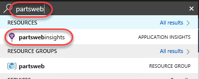

1. Click the **Failures** tab. This section enables you to aggregate and explore all site failures in a single place.

    

1. Select the **Exceptions** tab. In the **Top 10 exception types** table, locate **ArgumentOutOfRange** exception. If there are none, click the **Refresh** button. Otherwise, click the **Count** link to review exceptions of that type.

    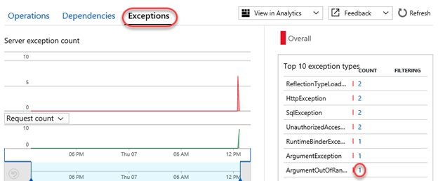

1. Click the **Suggested** exception.

    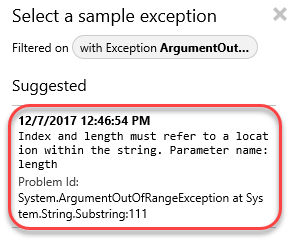

1. The exception blade provides a lot of useful information about the user and the request to help you diagnose the issue. In addition, a debug snapshot was automatically taken at the time of the exception in order to make it even easier to track down where the issue occurred and why. Click **Open debug snapshot**. Note that it may take several minutes for this option to appear for an exception. If the option is not visible, close the blade and wait a minute before reopening it via the option in the previous step.

    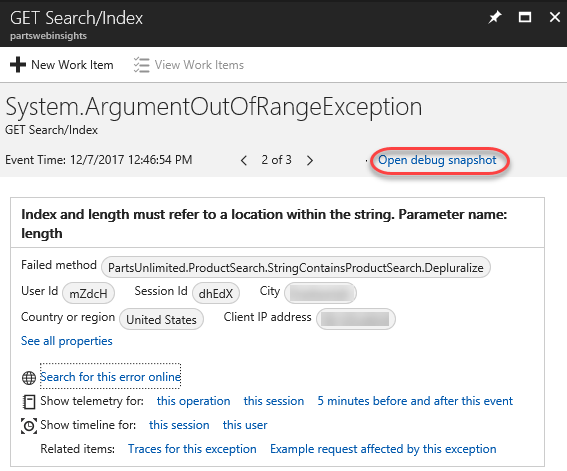

1. The first time you attempt to view a snapshot you will likely see an access error. Click the provided button to add the appropriate permissions.

    

1. Click **Download Snapshot**. It will take a moment to prepare the download.

    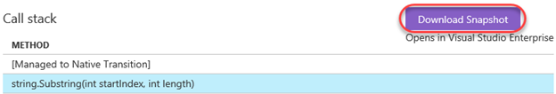

1. Right-click **Download file** and save it somewhere convenient, such as the desktop.

    

1. Return to **Visual Studio**.

1. Select **File \| Open \| File** and open the diagnostic session file downloaded earlier. Approve any warnings about the trustworthiness of the file.

1. This minidump provides a ton of valuable information about the state of the machine and its memory at the time of the exception. However, we're specifically interested in the state of the application. Click **Debug with Managed Only**.

    

1. If presented with a warning regarding **Just My Code**, select the option to **Disable Just My Code and Continue**.

    

1. The snapshot will load the app at the exact moment of the exception. Based on the details provided, it's easy to deduce that the bug is due to indexing past the length of the query when attempting to remove the pluralzation. Click the next item in the call stack to view the calling code.

    

1. We can see here why the error was never being exposed to end users-the exceptions were being swallowed. Unfortunately, they also weren't being tracked. This would probably be another issue to fix while addressing the core bug.

    

1. Now that we know what the error is and why it wasn't getting surfaced, we can generate a code map of this path to see if it might be an unknown problem in other parts of the application. Right-click the reference to **Depluralize** and select **Code Map \| Find All References on Code Map**.

    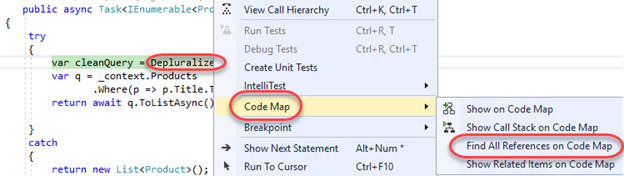

1. Fortunately, we can see here that this **Search** method is the only reference to **Depluralize**. Right-click **Search** and select **Find All References** to see what code calls into this method.

    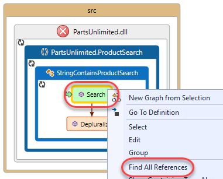

1. Besides a few tests, the only other references to this bug come from the **Index** and **Search** handlers. This kind of information is very useful in deciding how to deal with a bug like this.

    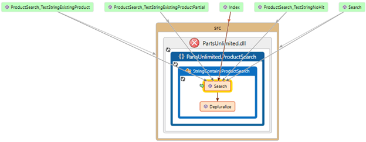

1. Select **Debug \| Stop Debugging** to end the session.

### Task 4: Working with Snappoints and Logpoints

1. In addition to automatic snapshots, Application Insights enables two additional features that make it easy to debug production apps: **Snappoints** and **Logpoints**. Snappoints are like breakpoints in that they allow you to take snapshots of a system when a given line is executed, but without actually noticeably pausing the execution of the application. Logpoints work in the same way, except that they allow you to inject custom logging into production apps on the fly.

1. Select **View \| Cloud Explorer**.

1. Click the **Account** button.

    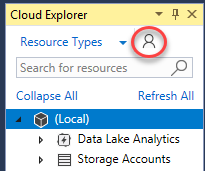

1. Select the subscription containing your deployment and click **Apply**.

    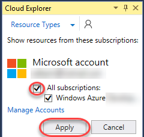

1. Right-click the app service and select **Attach Snapshot Debugger**.

    

1. Visual Studio will deploy a site extension for the app to allow the Snapshot Debugger to attach. Click **OK**.

    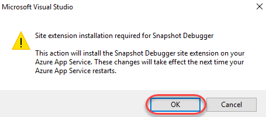

1. Click **OK** after the installation has completed.

    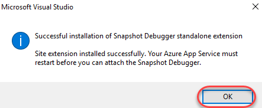

1. Use **Cloud Explorer** to **Stop** the app service.

    

1. After it has stopped, used **Cloud Explorer** to **Start** the app service once again.

    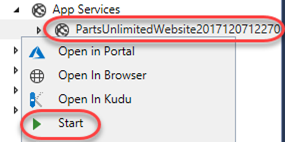

1. Once again, use the **Cloud Explorer** option to **Attach Snapshot Debugger**.

    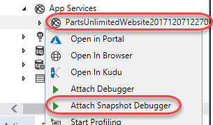

1. After attaching, you will see a yellow message at the top of the editor indicating that you are in a debugging session for an application running in Azure. Click the margin next to the exception handler line in the **Search** method from earlier. Ordinarily this would set a breakpoint, but since you're attached with the Snapshot Debugger, it sets a **Snappoint**.

    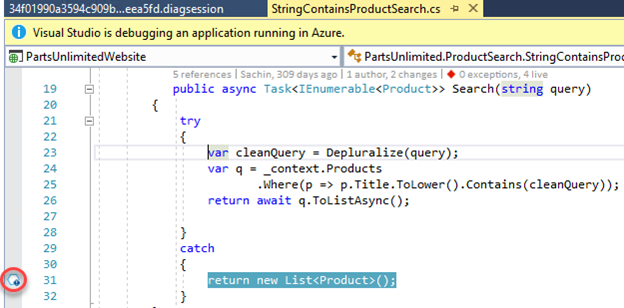

1. Right-click the snappoint and select **Actions**.

    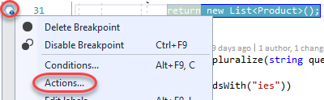

1. By default, a snappoint will capture a snapshot when this line is hit. You can optionally configure it using conditions, just like a breakpoint. You can also insert a logpoint by entering the **Message** "**Search query failed! {query}"**. This will get logged when the production code hits this line. Note that you get IntelliSense support here. Click **Close**.

    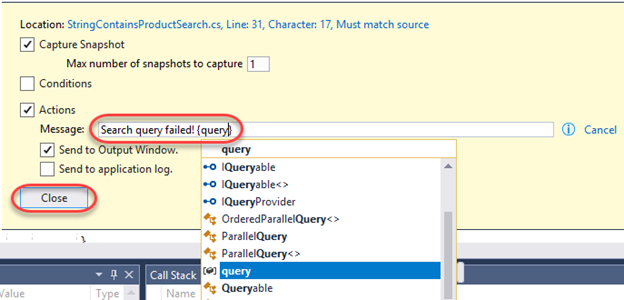

1. Click **Start Collection** to begin collecting snapshots at the snappoint.

    

1. Use the browser to search for **"jumper leads"** once again.

    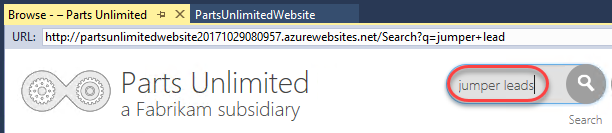

1. This will trigger a flurry of activity in the **Diagnostic Tools** window. Note that the logpoint includes the interpolated string specified earlier, including the search string.

    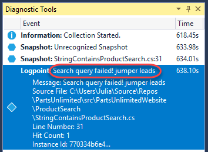

1. You can also expand the snapshot to click on **View Snapshot**.

    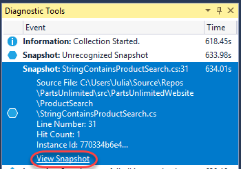

1. This will load the snapshot for debugging, just like if it were running locally. However, keep in mind that this is just a snapshot of the system at the time of the snappoint line being executed.

    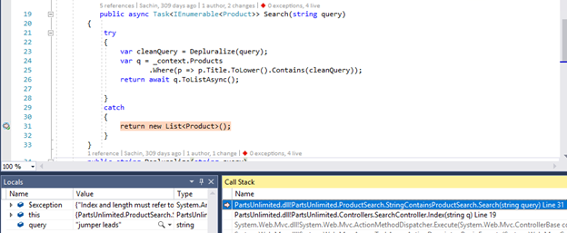

1. Select **Debug \| Stop Debugging** to end the session.
