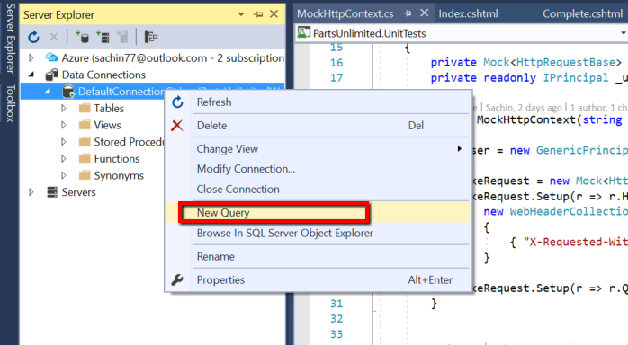
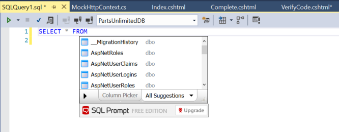
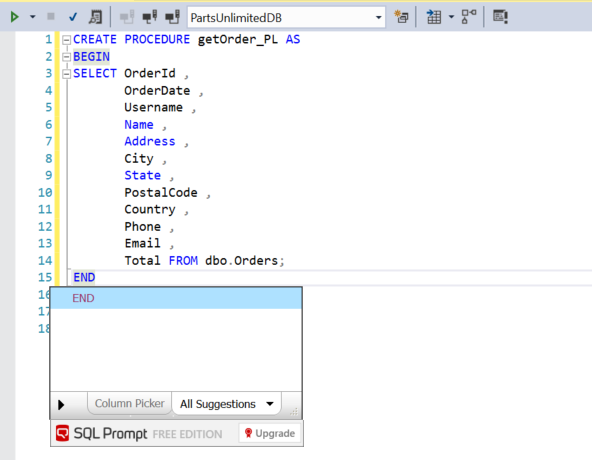
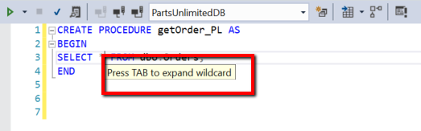
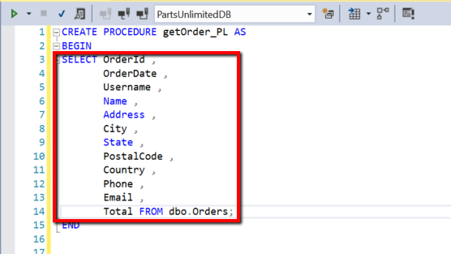
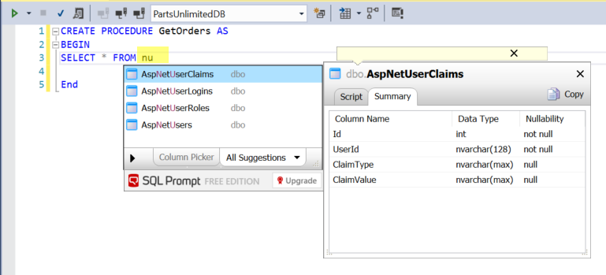
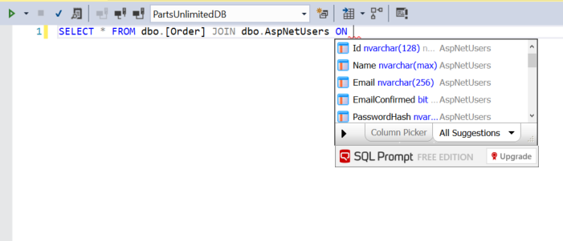
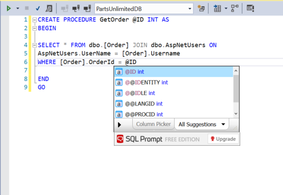
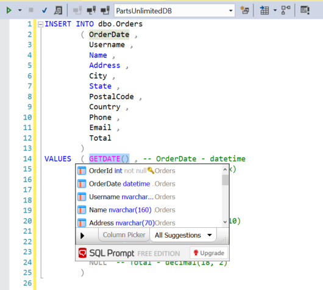

<div class="rw-ui-container"></div>

## Overview

SQL Prompt for Visual Studio Enterprise is an add-in for Visual Studio that extends and enhances the standard IntelliSense-style code
completion. SQL Prompt can make your developers twice as fast at working with SQL, and leaves them free to concentrate on how the code actually
works.

It helps your team work with each other’s code and write consistent queries.

Using SQL Prompt allows you to improve productivity by stripping away the repetition of coding. As well as making the most common queries,
such as SELECTs and INSERTs, quick to write, SQL Prompt completes JOIN conditions for you automatically. You don't have to remember any column
names or aliases.

## Pre-requisites

In order to complete this lab you will need the Visual Studio 2017 virtual machine provided by Microsoft. Click the button below to launch the virtual machine on the Microsoft Hands-on-Labs portal.

<a href="https://labondemand.com/AuthenticatedLaunch/32384?providerId=4" class="launch-hol" role="button" target="_blank"><span class="lab-details">Launch the virtual machine</span></a>

Alternatively, you can download the virtual machine from [here](../almvmdownload/)

**Important Note: Redgate Data Tools (ReadyRoll Core, SQL Prompt Core, and SQL Search) are available now out of the box with Visual Studio 2017 Enterprise but we missed to include these components in the VM. You will need to install these components before you proceed further with the lab. Please see this [page](../redgateinstall/) for step-by-step instructions on installing Redgate Data Tools in Visual Studio and ReadyRoll Extension for Team Foundation Server.**

**Alternatively, you can try this labs on [TechNet Virtual Centre](../technet/) where we have the Redgate Data tools and the TFS extension pre-installed in the VM.**

### Task 1: Writing our first query with SQL Prompt

Let’s connect to a database from the Server Explorer window in Visual Studio* *and take a look at some of the highlights*

|Action       | Screenshot     |
|-------------|----------------|
|1. Open Server Explorer and Connect to the ***PartsUnlimited*** database<br><br> 2. Right click on the database and select **New Query** <br><br> 3. Let's assume we need to write a stored procedure on the ***Orders*** table ||
|Hit the spacebar to invoke SQL Prompt <br><br> Type ‘SE’ complete to *SELECT* <br><br> Type ‘* F’ complete to *FROM* <br><br> Select **Order** from the drop-down||
|  ***As you can see it also qualifies and uses square brackets where necessary*** <br> <br> Go – Execute query||

````SQL
--Code completions for T-SQL Commands 
 SELECT * FROM dbo.[Order] 
````

### Task 2: Create a stored procedure

In addition to this it also works with Keywords, lets create a stored procedure to retrieve all ***Orders***

|Action       | Screenshot     |
|-------------|----------------|
|1. Type ‘CR’ complete to *CREATE* and Type ‘PRO’ complete to *PROCEDURE*<br><br>2. Type ‘GetOrders A’ complete to *AS* <br><br>3. Provide a name for the stored procedure<br><br>4. Type ‘BE’ complete to *BEGIN*<br><br>5. Repeat Section B1-3 to add select statement <br><br>6. Type ‘E’ complete to *END*||
|Go – Execute query| |

````SQL
-Code completion of keywords
CREATE PROCEDURE GetOrders AS
BEGIN
  SELECT  FROM dbo.[Order]
END
GO
````

### Task 3: Expanding Wildcard Characters

It’s easy for us to work with ‘SELECT ’ but really we want to be specific about the columns we are selecting, with SQL Prompt we canexpand wildcard with our completion key.

|Action       | Screenshot     |
|-------------|----------------|
|1. Place cursor to the right of ‘*’ in existing SELECT statement<br><br>2. Press ‘Tab’ to expand||
|<br><br>3. Highlight ‘CREATE’<br><br>4. Type ‘AL’ complete to ALTER<br><br>5. Execute Query||

````SQL
--Expansion of Wildcard
ALTER PROCEDURE GetOrders AS
BEGIN
SELECT [Order].OrderId ,
       [Order].Address ,
       [Order].City ,
       [Order].Country ,
       [Order].Email ,
       [Order].FirstName ,
       [Order].LastName ,
       [Order].OrderDate ,
       [Order].Phone ,
       [Order].PostalCode ,
       [Order].State ,
       [Order].Total ,
       [Order].Username FROM dbo.[Order]
END
GO
````

### Task 4: Finding a table name

What if we wanted to connect this information to our User information? As well as mid-string matching, SQL Prompt also allows CamelCase suggestions

|Action       | Screenshot     |
|-------------|----------------|
|1. Type SELECT * FROM <br><br>2. Type ‘NU’ complete AspNetUsers from CamelCase matches<br><br>3. Go – Execute Query||

````SQL
--CamelCase 'I know I want a User table but what is it called'

SELECT * FROM dbo.AspNetUsers -- Use nu

GO
````

### Task 5: Adding JOIN Conditions

there is no foreign key relationship to Order here but SQL Prompt will still suggest a join condition based upon the matching column names

|Action       | Screenshot     |
|-------------|----------------|
|1. Repeat earlier steps to get *SELECT * FROM dbo.[Order]*<br><br>2. Type ‘JO’ complete *JOIN* <br><br>3. Type ‘NU’ complete *AspNetUsers*<br><br> 4. Type ‘ON ’ complete suggested join on UserName<br><br>5. Go – Execute Query||

````SQL
--Join conditions without foreign keys

SELECT * FROM dbo.[Order] JOIN dbo.AspNetUsers ON AspNetUsers.UserName = [Order].Username

GO
````

### Task 6: Including WHERE Clause

Let’s wrap this up in a stored procure to retrieve details of a specific order and user

|Action       | Screenshot     |
|-------------|----------------|
|1. Type ‘CR’ complete to CREATE<br><br>2. Type ‘PRO’ complete to PROCEDURE<br><br>3. Type ‘GetOrder @ID A’ complete to AS<br><br>4. Type ‘BE’ complete to BEGIN<br><br>5. Repeat Section F1-4 to add select statement<br><br>6. Type ‘WH’ complete to WHERE<br><br>7. Type ‘ ‘ select OrderID<br><br>8. Type ‘@’ complete to @ID<br><br>9. Type ‘E’ complete to END<br><br>10. Optionally expand the wildcard again<br><br>10. Go – Execute query||

````SQL
--Code highlighting 

CREATE PROCEDURE GetOrder @ID INT AS
BEGIN

SELECT * FROM dbo.[Order] JOIN dbo.AspNetUsers ON
AspNetUsers.UserName = [Order].Username
WHERE [Order].OrderId = @ID

END
GO
````

### Task 7: Writing INSERT Statements

Next let’s add a new order record to check we can retrieve it - SQL Prompt autocompletes insert statements with column lists for us
too***

|Action       | Screenshot     |
|-------------|----------------|
|1. Type ‘IN’ complete to *INSERT*<br><br>2. Type ‘INT’ complete to *INTO*<br><br>3. Select Order complete to full column list<br><br>4. Update the VALUES with some made up data (N’Made up data’)<br><br>5. Ensure the UserName value is N’Administrator@test.com’<br><br>6. Go - Execute Query|

````SQL
--Insert statements completing with column list

INSERT INTO dbo.[Order]
        ( Address ,
          City ,
          Country ,
          Email ,
          FirstName ,
          LastName ,
          OrderDate ,
          Phone ,
          PostalCode ,
          State ,
          Total ,
          Username)

VALUES  ( N'123 Some Street' , -- Address - nvarchar(max)
          N'Seattle' , -- City - nvarchar(max)
          N'USA' , -- Country - nvarchar(max)
          N'admin@test.com' , -- Email - nvarchar(max)
          N'Tom' , -- FirstName - nvarchar(max)
          N'Austin' , -- LastName - nvarchar(max)
          SYSDATETIME() , -- OrderDate - datetime2
          N'5551235897' , -- Phone - nvarchar(max)
          N'99999' , -- PostalCode - nvarchar(max)
          N'WA' , -- State - nvarchar(max)
          39.99 , -- Total - decimal
          N'Administrator@test.com'  -- Username - nvarchar(max)
        )
````

Let’s check it is in the Table***

### Task 8: Testing our stored procedure

Lets test our stored procedure, when writing EXEC statements SQL Prompt even include a parameter list for us:

1. Run ***SELECT * FROM dbo.[Order]*** and note the OrderID from the results

1. Type ‘EX’ complete to EXEC

2. Select ‘GetOrder’

3. Edit the value to match the OrderID from I2.

4. Execute Query

````SQL
--Auto-complete EXEC statements with parameter lists

EXEC dbo.GetOrder @ID = 2 -- int
````

## Summary

There’s a quick tour of the highlights of SQL Prompt Free Edition. It’s available in Visual Studio Enterprise 2017 and it improves your productivity by speeding up SQL development tasks and reducing risk of error, so you can get back to the task in hand.