Lab version:15.0.26228.0

Last updated:3/2/2017

## Overview ##

How often have you built the software that your users asked for, but not necessarily what they wanted? In a world of increasingly complex software projects, it is critical that we can accurately capture requirements from users, which can then be translated into working software. In this lab, you'll learn how the capabilities of Visual Studio 2017 make it possible to both rapidly storyboard your requirements, and - as your software evolves - get rich, actionable feedback from users of your software which can help shape what you deliver.

### Prerequisites ###

In order to complete this lab you will need the Visual Studio 2017 virtual machine provided by Microsoft. For more information on acquiring and using this virtual machine, please see [this blog post](http://aka.ms/almvm).

### About the Fabrikam Fiber Scenario ###

This set of hands-on-labs uses a fictional company, Fabrikam Fiber, as a backdrop to the scenarios you are learning about. Fabrikam Fiber provides cable television and related services to the United States. They are growing rapidly and have embraced Windows Azure to scale their customer-facing web site directly to end-users to allow them to self-service tickets and track technicians. They also use an on-premises ASP.NET MVC application for their customer service representatives to administer customer orders.

In this set of hands-on labs, you will take part in a number of scenarios that involve the development and testing team at Fabrikam Fiber. The team, which consists of 8-10 people has decided to use Visual Studio application lifecycle management tools to manage their source code, run their builds, test their web sites, and plan and track the project.

## Exercise 1: Introduction to Storyboarding ##

In this exercise, you will learn how to use the PowerPoint storyboarding add-in to create application storyboards. This will be accomplished by examining an existing storyboard file and by adding in some additional storyboard slides to address an additional user story.

### Task 1: Creating a Storyboard Linked to Work Item ###

1. Log in as **Sachin Raj (VSALM\Sachin)**. All user passwords are **P2ssw0rd**.

1. Launch **Internet Explorer** from the taskbar and select the **TFS FF Portal** button from the favorites bar at the top.

   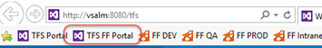

1. Locate the **New work item** tile. Enter the title **"Service rep can view service ticket details from the dashboard"** and select the type as **Product Backlog Item**. Click **Create** to create.

   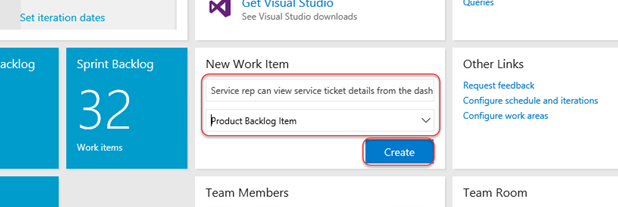

1. When the dialog opens, click **Save** option from the **Save & Close** dropdown. Do not close the item yet.

   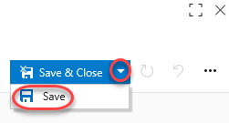

1. From the extended menu dropdown, select **Start storyboarding**.

   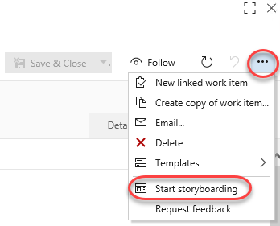

1. Select the **Allow** button when prompted.

   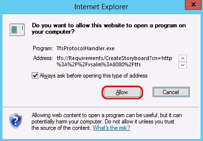

1. At this point, the new storyboard can be created from scratch using the full power of PowerPoint, including the tooling found in the **Storyboarding** tab. For the purposes of this lab, however, we will jump ahead to a storyboard that is already in progress. Close the PowerPoint window without saving any changes.

1. As an aside, you also have the ability to link to an existing storyboard, such as one that might be stored in SharePoint or elsewhere. Select the **Links** tab and then click **Add link | Existing item**.

   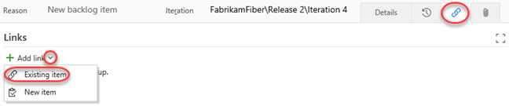

1. This **Location** would be to a location that is accessible to all team members. Click **Cancel**.

<a name="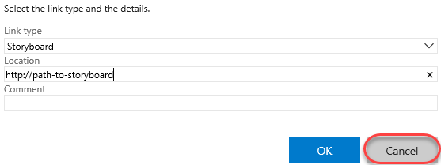"></a>
###  ###

### Task 2: Creating Storyboards in PowerPoint ###

1. Open the PowerPoint file at **C:\Samples\FF Storyboard - Start.pptx**.

   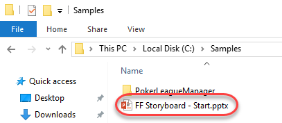

1. Select the **Storyboarding** tab at the top of the PowerPoint window.

    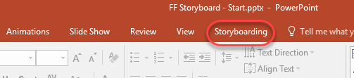

    > **Note:** If you wanted to create a new storyboard from scratch, you would do so simply by loading PowerPoint and selecting the "blank presentation" option. Then use the tools provided in the Storyboarding tab.

1. These storyboard slides show how the PowerPoint storyboarding add-in can be used to mock up UI for web and mobile applications. You can take advantage of slide masters and different layouts to create re-usable templates that are set up for your application. Select the **Layout** button to see some of the layouts that are available in this storyboarding PowerPoint file.

    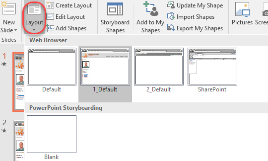

    > **Note:** If you wanted to make modifications to the slide master layouts, you would do so by selecting the **Edit Layout** button from the **Storyboarding** tab.

    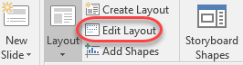

1. Press the **F5** key to view the storyboard in presentation mode. Click through the slides with the mouse or press the right arrow key until the presentation is finished. Note that the storyboard provides the look and feel for certain pieces of a web application and a Windows Phone application. Animations are used to show how the user is interacting with the application.

1. Now let's create some additional storyboards for the Fabrikam Fiber intranet site, where employees interface with customer data and service tickets. When creating storyboards, it can be helpful to document specific scenarios that translate to user stories for the development team to implement and test.

1. Delete all the existing slides so that we can concentrate on the new user story (press **Ctrl-A** followed by **Delete**).

   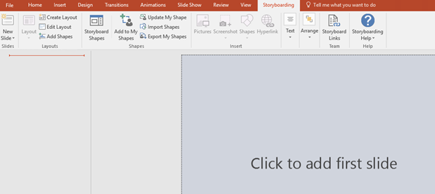

1. Select the **New Slide** drop-down button and choose the "**1_Default**" layout from the "**Web Browser**" slide master.

   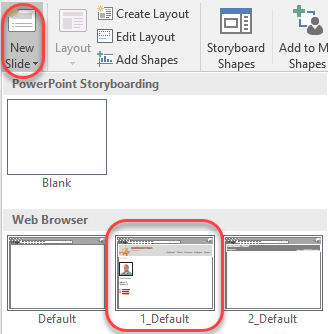

1. Take a look at the new storyboard slide to see everything that is provided by the slide master. The entire chrome for the web application is there, which helps keep our storyboard slides looking consistent.

   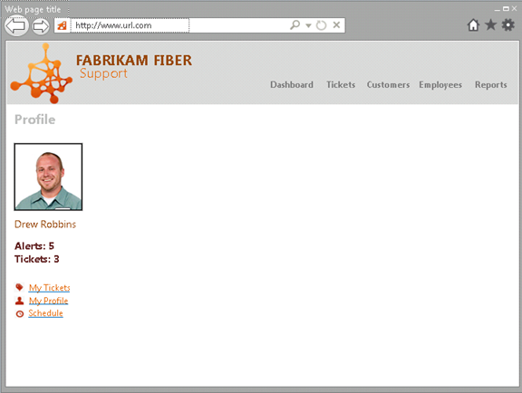

1. Note that the slide master also includes some placeholders for the web page title and address, which are editable. Modify the "**Web page title**" placeholder by entering "**Dashboard**" instead. This slide is going to represent the Dashboard page, which is designed to show a rollup of tickets, alerts & messages, and other company-wide information.

   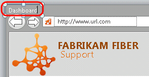

1. As a quick aside, load the Fabrikam Fiber intranet site in Internet Explorer by clicking on the **FF Intranet** button in the favorites bar ([http://intranet.fabrikam.com](http://intranet.fabrikam.com/)). This loads the Dashboard page. Take a glance at the UI shown here so that we can duplicate some of it in the storyboards.

    > **Note:** Although storyboards normally precede implementation, in this lab you will occasionally refer to both storyboards in development and the finished product in order to help speed up the demonstration.

   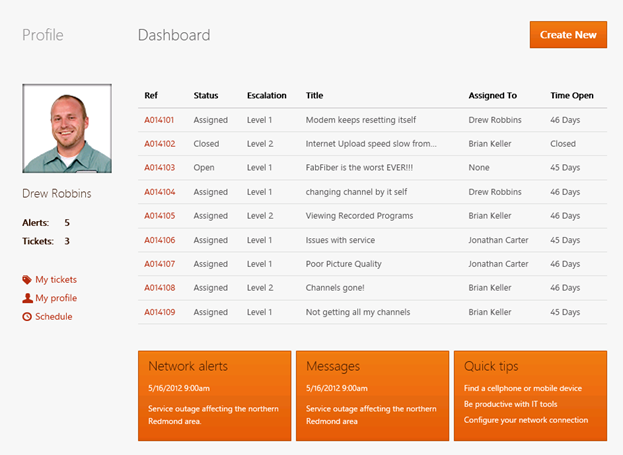

1. Back in PowerPoint, add a new **Text Box** to the first slide.

   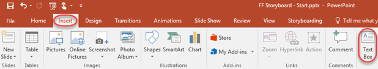

1. Enter the text "**Dashboard**" for the new text box to create the heading for this page and position it as shown in the following screenshot. Make the text **bold**, use font size of **16**, and select a **gray** font color.

   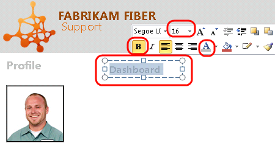

1. Now let's create a button named "**Create New**" below the Dashboard title. Select the **Storyboard Shapes** button from the Storyboarding tab to load the panel.

   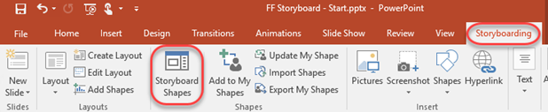

1. In the **Storyboard Shapes** panel on the right-hand side, type "**button**" into the search box to locate the Button shape.

   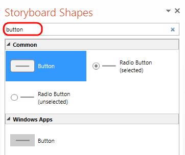

1. Drag and drop an instance of the **Button** shape from the Windows Apps category onto the slide, as it closely matches the shape of the existing buttons on the site

   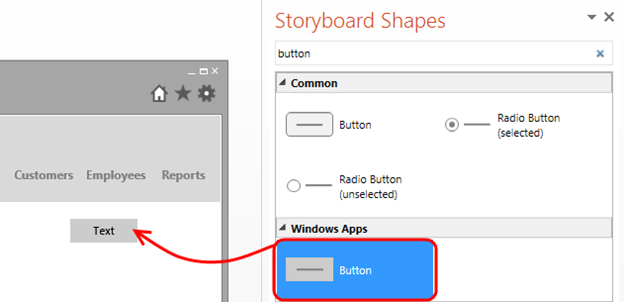

1. Imagine that Fabrikam Fiber has a UI style guideline in place that we must adhere to. Change the text from the default to "**Create New**", choose a **white** font color, and choose an **orange** shape fill color to match the required design.

   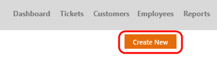

1. As you are storyboarding, you can create your own shapes to reuse later. Select the new button that you just created, select the **Add to My Shapes** button from the **Storyboarding** tab, and name the new shape "**Fabrikam Button**".

    > **Note:** Make sure you select the outer edge of the button shape (not the center part) in order to make the Add to My Shapes button available.

   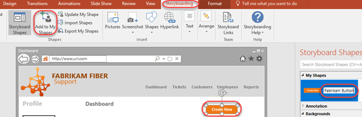

1. You can sometimes speed up the storyboarding process by reusing existing assets. In this case, let's take a screen clipping of the rest of the existing Dashboard page, rather than adding an actual data grid and manually populating it with data. First, ensure that the Internet Explorer window currently showing the Fabrikam Fiber intranet portal is visible and not minimized. Next, in the Storyboarding tab of PowerPoint, select the **Screenshot** drop down button and then select the **Screen Clipping** option.

   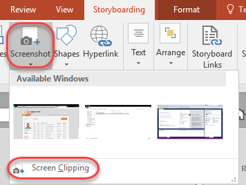

1. After PowerPoint minimizes itself to show the greyed-out Fabrikam Fiber Dashboard page, click and hold the left mouse button on the upper-left corner of the grid, move to the bottom-right to include Network Alerts, Messages, and so on, and then finally let the left mouse button up to select the region to use for the screen clipping.

   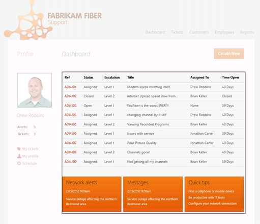

1. Back in PowerPoint, position and re-size the screen clipping so that it fits in nicely right below the Create New button.

   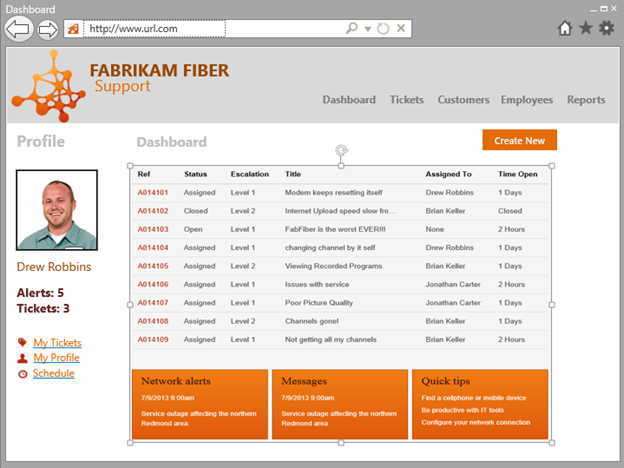

1. Back to the scenario we are storyboarding, imagine that the employee sees this dashboard and is concerned about one of the tickets that has been open for a long time without resolution or escalation, so she decides to view it by clicking on the reference number link. This should then load a view that shows the service ticket details.

   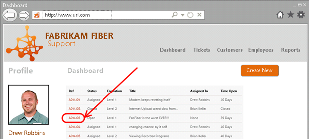

1. Start storyboarding this scenario by creating a **new slide** using the same layout as before. The new slide should go right after the first one that you created.

   

1. Next, add in some fake ticket details (as shown in the screenshot below) using the techniques shown in this lab so far. In addition, make use of the **Street Map** and **Map Marker** storyboarding shapes to help represent the location of the customer residence.

   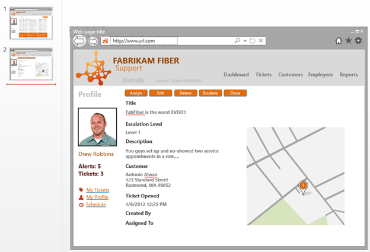

1. When storyboarding in PowerPoint, you can also build in a representation for the flow of an application using hyperlinks from shapes. Select the first slide that shows the Dashboard, then select the image that shows the grid of tickets, and finally click the **Hyperlink** button from the **Storyboarding** tab.

1. > **Note:** If we chose to create this slide using a proper grid from the Storyboard Shapes menu, instead of a screen clipping, we would be able to create a hyperlink from a specific cell instead.

   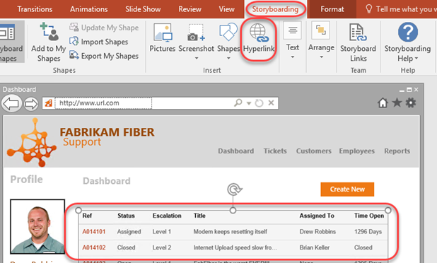

1. In the **Insert Hyperlink** window, select the **Place in This Document** option, choose the **second slide**, and select **OK** to create the link.

   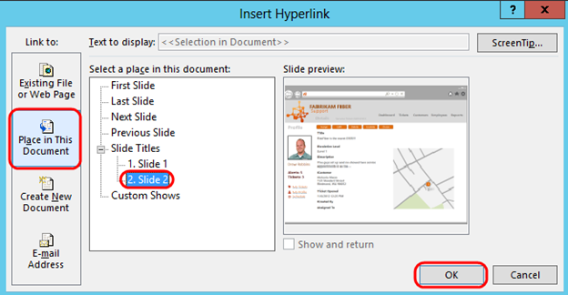

1. We can also take advantage of PowerPoint animations in order to improve the presentation of the storyboards. Return to the first slide (if not already there) and search for the "_**mouse pointer**_" shape in the **Storyboard Shapes** window. Drag and drop an instance of the mouse pointer onto the slide. This shape will be used to represent the user clicking on one of the service tickets on the Dashboard.

   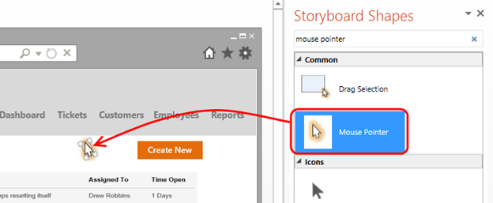

1. Make the mouse pointer shape larger so that it is easier to see.

   

1. In the **Animations** tab, select the **Add Animation** drop-down and select the **Custom Path** option near the bottom (scroll down to find it).

   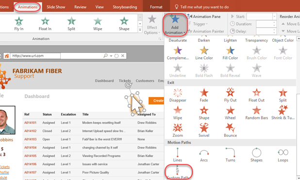

1. Use the mouse to draw a path from the current location of the Mouse Pointer shape to one of the service ticket hyperlinks (the grid is just a picture). To do this, hold the left mouse button down near the Mouse Pointer shape and draw a line to the hyperlink, letting go of the mouse button and pressing the **Escape** key when done.

   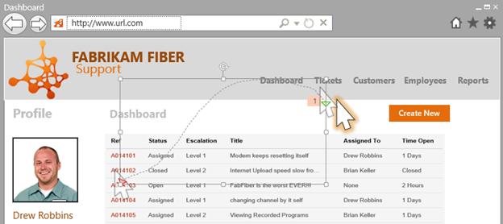

1. Press the **F5** key to view the storyboard in presentation mode. Press the right arrow key to start the mouse cursor animation. When it reaches the hyperlink for the service ticket, press the right arrow key to navigate to the second slide. Press the **Esc** key when finished.

1. Close PowerPoint without saving changes.

