

## Overview

In this lab, you will be introduced to Technical debt, how to configure your Team Build Definitions to use SonarQube, how to understand the analysis results and finally how to configure quality profile to control the rule set used by SonarQube for analyzing your project.

Technical debt is the set of problems in a development effort that make forward progress on customer value inefficient. Technical debt saps productivity by making code hard to understand, fragile, time-consuming to change, difficult to validate, and creates unplanned work that blocks progress. Technical debt saps an org's strength due to high costs in customer support, and, eventually, some combination of these issues creates a larger problem that someone runs into. Technical debt is insidious.  It starts small and grows over time through rushed changes, lack of context and lack of discipline.  It can materialize out of nowhere even for a project regarded as clean at some point in time, due to a change in project circumstances: prototype code may be promoted to serve as the basis for a feature; code produced for the U.S. market may be proposed for international, instantly creating debt related to localizability; technologies evolve, but the app doesn’t keep up.

> SonarQube is an open source platform for understanding and managing technical debt, it provides different ways to analyze and measure technical quality from project portfolio to method.

## Pre-requisites

1- In order to complete this lab you will need the Visual Studio 2017 virtual machine provided by Microsoft. Click the button below to launch the virtual machine on the Microsoft Hands-on-Labs portal.

<a href="https://labondemand.com/AuthenticatedLaunch/32383?providerId=4" class="launch-hol" role="button" target="_blank">Launch the virtual machine</a>

Alternatively, you can download the virtual machine from [here](../almvmdownload/)

2- You will need to manually install SonarQube on the above virtual machine using the recommended installation guide created by the Visual Studio ALM Rangers, please see this installation guide on GitHub. Alternatively, you may follow exercise 1 in this lab to install and configure SoanrQube for demo and evaluation purposes.

3- You will need to download and install SonarQube VSTS extension from [VSTS marketplace](https://marketplace.visualstudio.com/items?itemName=SonarSource.sonarqube)

4- Complete Lab [Team Foundation Build 2018](https://github.com/hkamel/almvm-1/blob/master/labs/tfs/build)

## Exercise 1: Install and Configure SonarQube Server and Extensions

In this exercise, you will learn about the main installation and configuration points required to install and configure SonarQube for demo purposes
> Note: The steps provided below are the main steps needed to install SonarQube and SonarQube Extensions on this VM for demo and evaluation purposes. We recommend following the installation guide created by the Visual Studio ALM Rangers for more detailed instructions, please see this [installation guide on GitHub](https://github.com/SonarSource/sonar-.net-documentation).

### Task 1: Install and Configure SonarQube Server

1. Download **SonarQube** Server from the SonarQube downloads.

   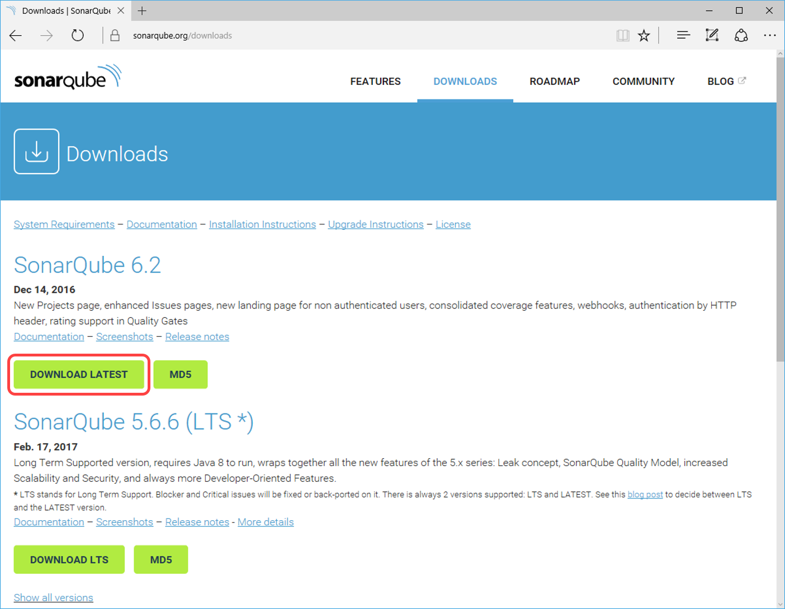

2. Download **Java SE Runtime Environment (JRE)** from the Oracle Jave SE downloads page. Select the Download under JRE.   Select Accept License Agreement and click the Windows x64 that points to exe file.

   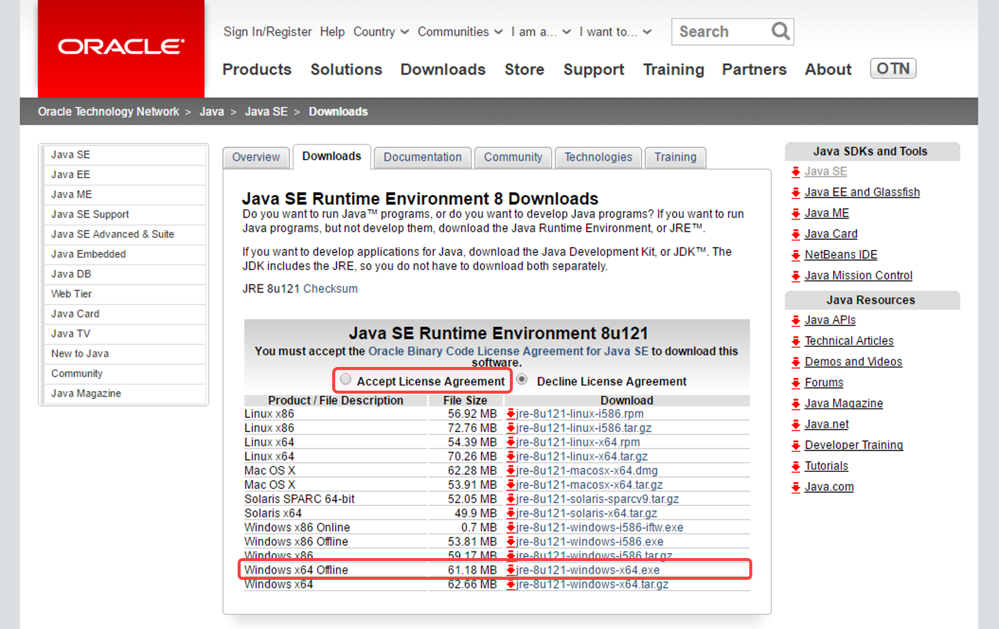

3. Download the latest [**SonarC#** ](https://docs.sonarqube.org/pages/viewpage.action?pageId=1441900)sonar-csharp-plugin-X.Y.jar available from the SonarQube plugin library

   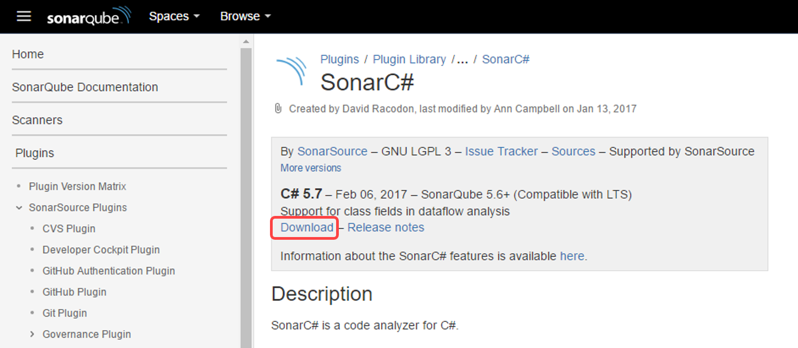

4. Download **SonarQube** extension from [Visual Studio Marketplace](https://marketplace.visualstudio.com/items?itemName=SonarSource.sonarqube).
	
   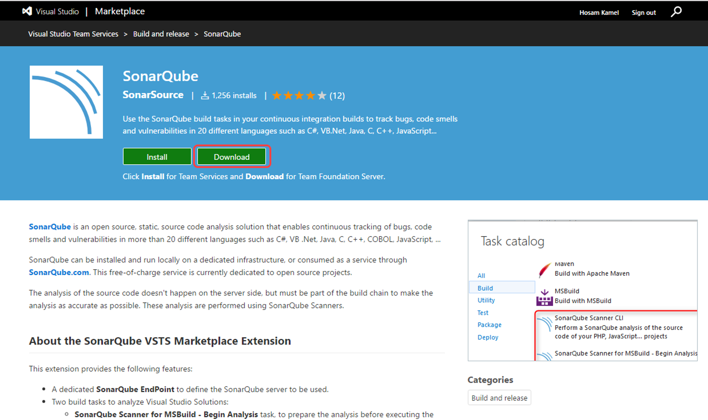

5. Log in as <b>Sachin Raj</b> (VSALM\\Sachin)</b>. All user passwords are <b>P2ssw0rd</b>

6. Copy **sonarqube-x.x.zip**, **jre-XuXXX-windows-x64.exe**, **sonar-csharp-plugin-X.Y.jar** and **SonarSource.sonarqube-X.X.X.vsix** to the virtual machine.

7. Install Java SE Runtime Environment on the VM.

8. Right-click on sonarqube-x.x.x.zip, select Properties and then click on the Unblock button

9. Unzip SonarQube-x.x.zip on to a folder, for example use C:\SonarQube\SonarQube-x.x.x.

10.	In the extracted folder navigate to **Conf** folder, edit **sonar.properties** file to change the default web port for example **9090**.

    `By default, SonarQube uses port **9000** which is currently being used in the virtual machine for FabrikamFiber QA web site (FF QA). For the purpose of this lab you can provide port 9090.`

11. Copy **sonar-csharp-plugin-X.Y.jar** to SonarQube directory (C:\SonarQube\SonarQube-x.x.x\) under **extensions\plugins\** subdirectory.

13. Run SonarQube by opening a **command prompt** and change the directory to SonarQube extracted folder cd C:\SonarQube\SonarQube-x.x.x\bin\windows-x86-64 and Run **StartSonar.bat**. Wait until you get a confirmation on the command prompt that the process is up and running.

    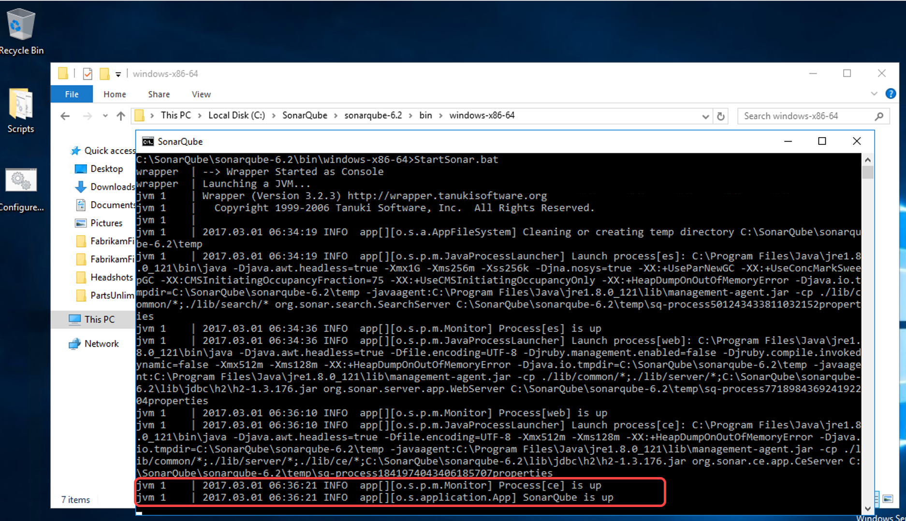

14. Open you browser and navigate to http://vsalm:9090 to access the SonarQube portal

    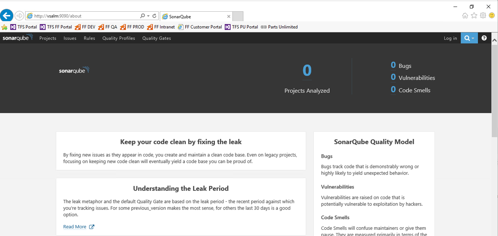

### Task 2: Install and Configure SonarQube Extension

1. Log in as <b>Sachin Raj</b> (VSALM\\Sachin)</b>. All user passwords are <b>P2ssw0rd</b>

2. Browse for your downloaded TFS extensions (https://vsalm:8080/tfs/_gallery) by clicking **Browse TFS extensions**

   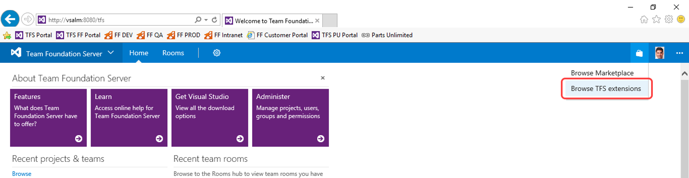

3. Click **Manage your extensions**.

   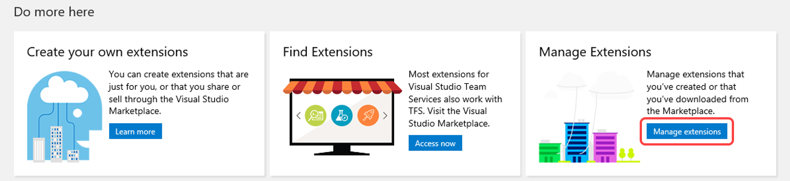

4. Click **Upload new extension** to upload SonarQube extension that you downloaded.

   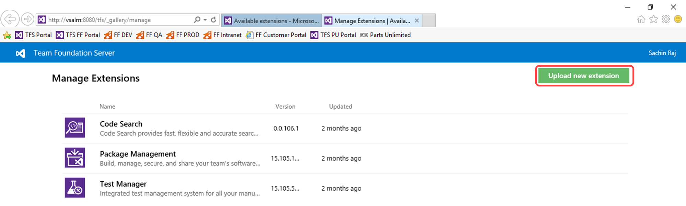

5. Install the SonarQube extension in your team project collection, by click **Install** 

   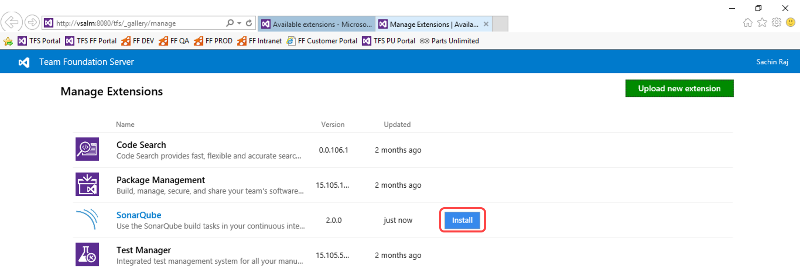

6. Choose the team project collection where you want to install the extension and click **Confirm**

   

## Exercise 2: Analyzing Projects with SonarQube Extension for VSTS/TFS

In this exercise, you will learn about the main configuration points that are needed to integrate Team Foundation Server build with SonarQube, performing code analysis on a sample project, and access the analysis result from build summary and SonarQube project dashboard.

### Task 1: Cloning a Build Definition

1. Log in as **Deniz Ercoskun** (VSALM\\Deniz). All user passwords are
    **P2ssw0rd**.

2. Now let’s create a similar build definition, but this time include a step to perform code analysis. Imagine that this build definition will be part of a continuous integration scenario.

2. Return to the main Build view by selecting the **Builds** tab.

   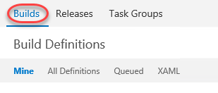

3. Select the **Ellipses** drop-down just to the right of the
    **Fabrikam Development Build** definition to load the associated
    context menu. Note the options that allow us to create a new build
    definition using the current one as a starting point: **Clone** and
    **Save as a Template**. If we wanted to share this build definition
    as a template with the rest of our team, we could do so here and it
    would show up as a Custom template when creating a new definition.
    In this case, click **Clone** to create a copy of the
    current definition.

   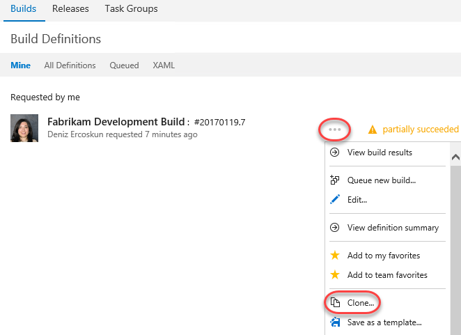

### Task 2: Adding SonarQube Build Steps and Service Endpoint

1. Click **Add build step...**

   

2. Under Build category select **SonarQube Scanner for MSBuild - Begin Analysis (new)** and click **Add**

3. Select **SonarQube Scanner for MSBuild - End Analysis (new)** and click **Add**

   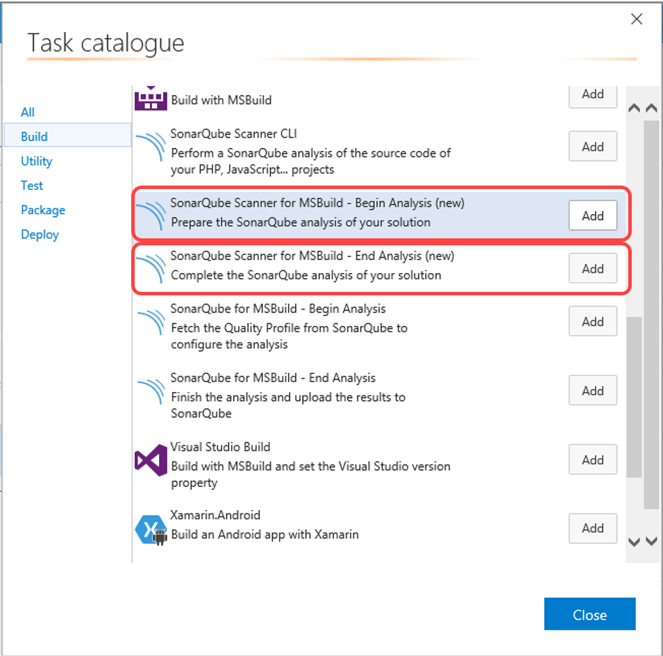

4. Reorder the tasks to respect the following order:
    * **SonarQube Scanner for MSBuild - Begin Analysis (new)** task before any MSBuild or Visual Studio Build task.
    * **SonarQube Scanner for SonarQube Scanner for MSBuild - End Analysis (new)** task after the Visual Studio Test task.

   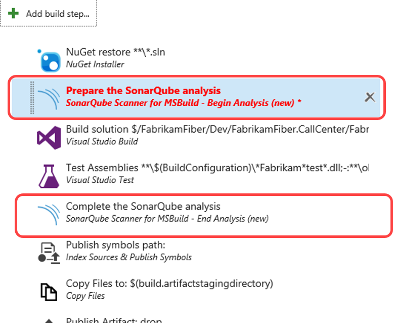

5. Click on the **SonarQube Scanner for MSBuild - End Analysis (new)** step to configure it:

   * Add a new **SonarQube Endpoint** by click **Manage**
   
     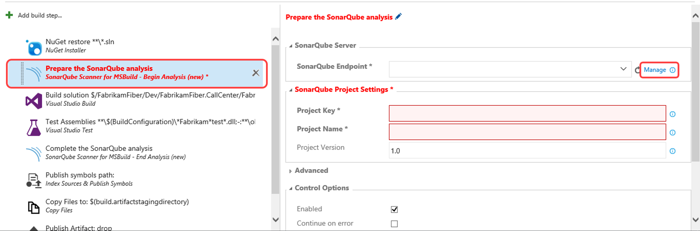

   * In **Services** page click **New Service Endpoint** and select **SonarQube**

     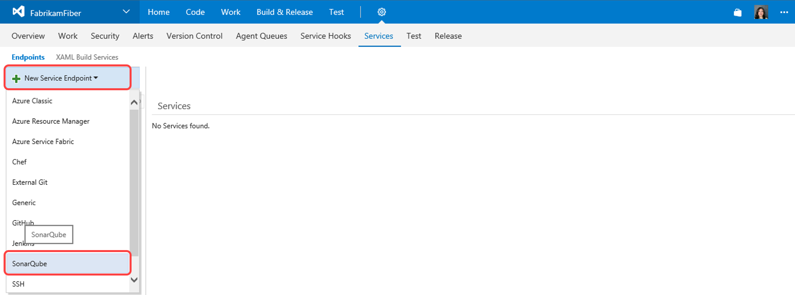

   * In **Add new SonarQube Connection** dialog provide the following details:

     * **Connection Name**: example SonarQube
     * **Server Url**: Url for the SonarQube Server to connect to, this should be the SonarQube Server we setup in the previous exercise: **http://vsalm:9090**
     * **Token**: Authentication token generated by SonarQube.

     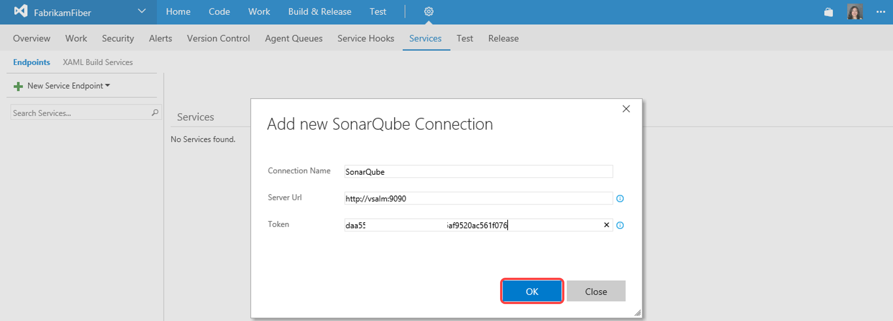

   * In the build definition page, click refresh and select the newly added service endpoint **SonarQube**

     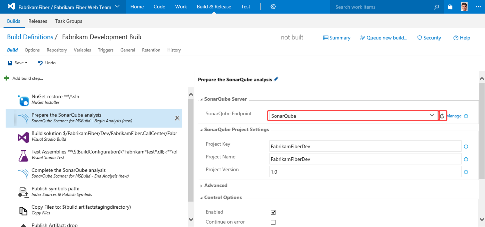

   * While still in  **SonarQube Scanner for MSBuild - Begin Analysis (new)** provide the following information under The **SonarQube Project Settings** section:

     * **Project Key** - the unique project key in SonarQube, example **FFDev**
     * **Project Name** - the name of the project in SonarQube, example **FFDev**
     * **Project Version** - the version of the project in SonarQube, exmaple **1.0**

     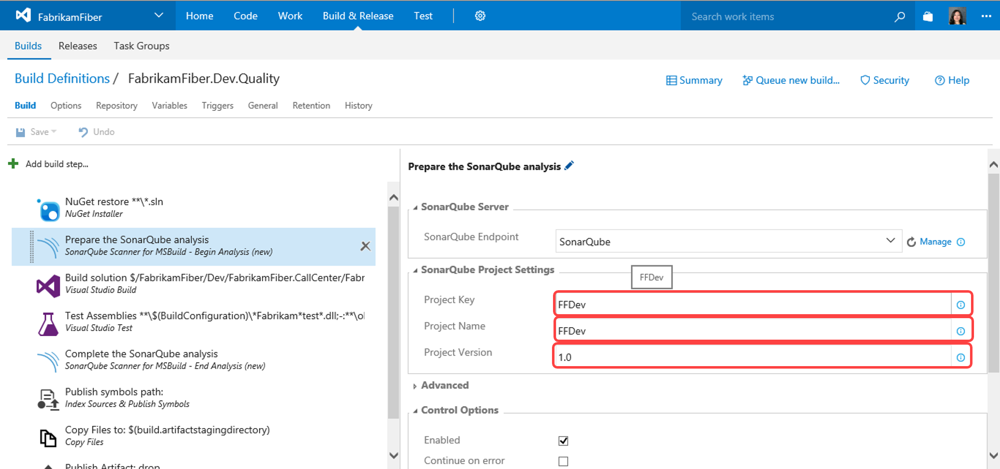

6.  Click **Save**. Name the new build definition "FabrikamFiber.Dev.Quality" and click **OK**.

    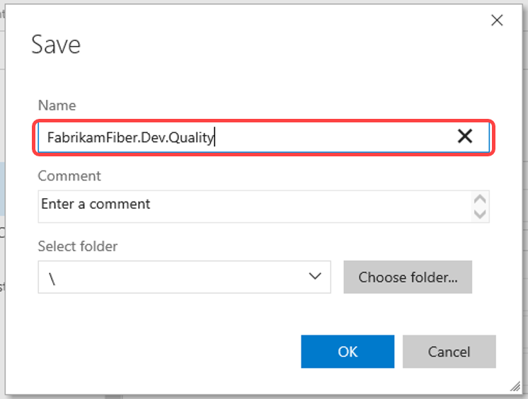

### Task 3: Queuing and Executing a Build

1. Click **Queue new build**.

   

2. Note that the **Queue Build dialog** allows you to configure the queue, optionally select a shelveset, variable values, and demands. Use the defaults presented by clicking **OK**. 

   

3. Note that once the build starts, you can monitor the real-time build status in the live console view. It will take some time for SonarQube analysis to complete, so please expect **SonarQube Scanner for MSBuild - End Analysis (new)** to take sometime.

4. Once the build completed, in the build summary report, you’ll be able see a new summary section entitled **SonarQube Analysis Report**.

   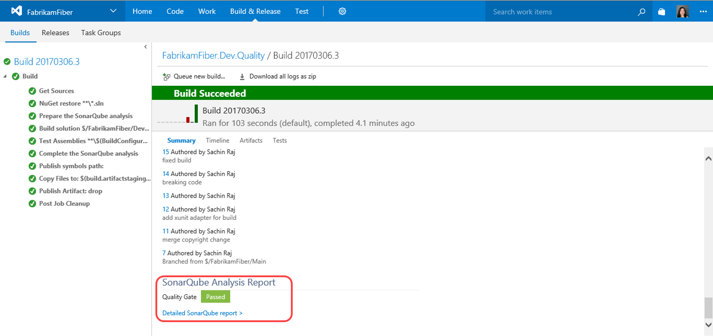

5. Click **Detailed SonarQube report**  hyperlink to navigate to SonarQube dashboard.

   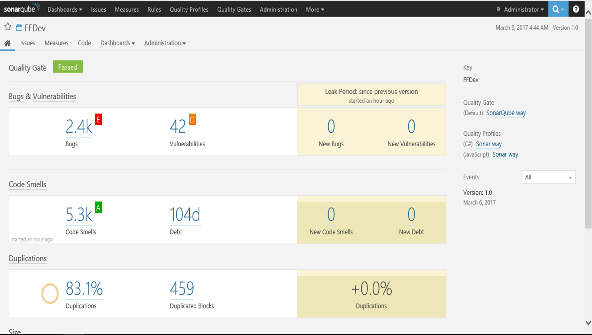
