## Overview

In this lab, you will learn about how the unit testing engine in
    Visual Studio is extensible and opens the door for 3rd
    party unit testing adapters such as NUnit and xUnit.net. In
    addition, you will see some of the improvements made to code
    coverage support. You will also learn about how the code clone
    capability goes hand-in-hand with delivering high quality software
    by helping you identify blocks of semantically similar code which
    may be candidates for common bug fixes or refactoring.

## Prerequisites

In order to complete this lab you will need the Visual Studio 2017
    virtual machine provided by Microsoft. For more information on
    acquiring and using this virtual machine, please see [this blog
    post](http://aka.ms/almvm).
 

## Exercises

This hands-on lab includes the following exercises:

* Unit Testing

* Code Coverage

* Code Clone Analysis

Estimated time to complete this lab: **30 minutes**.

### Exercise 1: Unit Testing

In this exercise, you will learn about the unit testing story in
    Visual Studio 2017.

1.  Log in as **Sachin Raj** (VSALM\\Sachin). All user passwords are **P2ssw0rd**.

2.  Launch **Visual Studio 2017** from the taskbar and open **Team
    Explorer**. You should now be connected to the FabrikamFiber
    team project. If you are not automatically connected to the
    FabrikamFiber project, click the **Connect to Team Projects**
    button ()
    to do so.

3.  In **Team Explorer – Home**, click **Source Control Explorer**.

    

4.  Locate the **Dev** branch and open **FabrikamFiber.CallCenter.sln**.

    

5.  Open the **Test Explorer** window from **Test | Windows | Test
    Explorer**. Note that discovered tests are initially set to the
    Not Run state.

    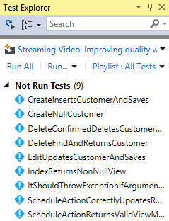

6.  Click **Run All** to execute all discovered unit tests.

    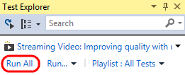

    >**Note:** Visual Studio also provides **Continuous Test Runner**
    > functionality that can be enabled with the **Test | Test Settings
    > | Run Tests After Build** option. With this option selected, tests
    > will always run after builds.

7.  Expand the **Passed Tests** group (if necessary) and
    **double-click** the test with the name
    **CreateInsertsCustomerAndSaves** to open the source code.

    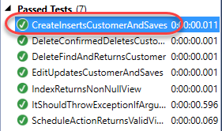

8.  In the *CustomersControllerTest.cs* file that opens, note that the
    test method uses the expected **TestMethod** attribute used by
    **MSTest** to mark unit tests.

    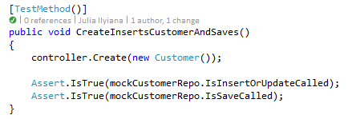

    >**Note:** The test status indicator just above the method definition
    is a CodeLens indicator. It tells us that the last run was
    a success. You can learn more about the CodeLens feature in the
    “*Collaboration Experiences for Development Teams using Team
    Foundation Server 2017*” lab.

9.  In the **Search** box at the top of the Test Explorer window, enter
    “**index**” and note the available search filters.

    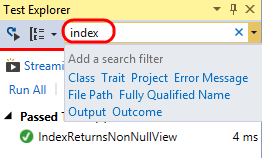

10. In the search results, **double-click** the only test listed with
    the name **IndexReturnsNonNullView** to open the source code.

    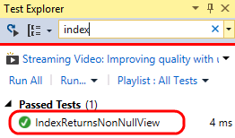

11. In the *HomeControllerTest.cs* file that opens, you can see that the
    **IndexReturnsNonNullView** test actually uses the **XUnit**
    testing framework. Both the xUnit framework and the test runner
    that integrates with **Test Explorer** can be added to a project
    via NuGet.

    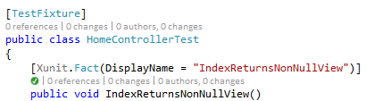

12. Click the **X** button to clear the current search box in
    Test Explorer.

    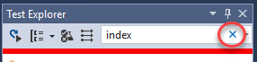

13. Note that results are grouped by test outcome by default, with
    execution times listed.

    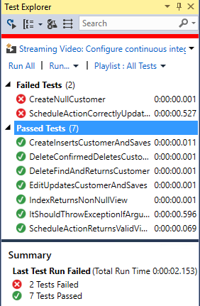

14. Test execution performance has been given some additional attention
    in recent versions. Take note of the execution times and then
    select the **Run…** button followed by the **Repeat Last
    Run** option. Note the difference in execution time.

    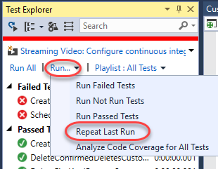

    >**Note:** The execution times that you see will be different from
    > those shown in the screenshots. The first time you run unit tests
    > they will execute more slowly than on subsequent runs as the tests
    > and testing engine are being loaded for the first time.

    

15. **Single-click** the failed test named
    “**ScheduleActionCorrectlyUpdatesRepositories**” to view a summary
    of test results.

    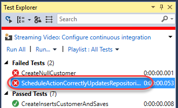

    >**Note:** You can also right-click on test results and use the
    > **Copy** command to copy details to the clipboard. This would be
    > useful when sending an email, for example.

16. The summary view of the failed test run shows that an
    **ArgumentNullException** exception occurred during the test run
    and even provides the stack track at the time of the exception.
    Note that we can follow links to go directly to the source code
    for the test or to points within the stack trace. **Click** the
    **source link** to go to the source code for the test method.

    

    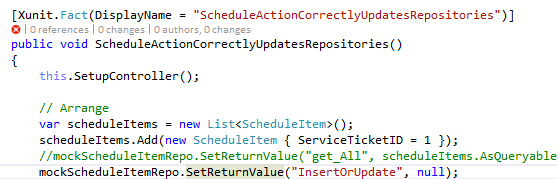

17. Find the line of code that is commented out and un-comment it.
    Assume that this is the root cause for the failed test.

    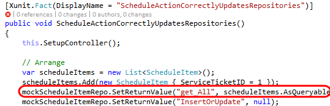

18. Press **Ctrl+S** to save your changes.

19. **Right-click** the failed test in **Test Explorer** and select
    **Run Selected Tests** to make sure that the problem is fixed.

    

20. So far, we have seen how to run all discovered tests, search for
    specific tests, and group by test outcome. Now let’s take at a few
    other ways that you can organize and navigate unit tests to make
    unit testing easier. For some motivational context, remember how
    long you needed to wait for the coded UI test to complete, and
    then imagine that there are many more of those. It would be nice
    if the tests were organized such that you could easily avoid
    kicking off those tests without having to be careful of the tests
    that you select.

21. To start with, there are a number of useful grouping options.
    **Right-click** somewhere within the **Test Explorer** window and
    select **Group By | Class**.

    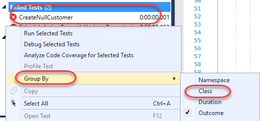

22. Assuming that tests are well organized within descriptive class
    names, this can make it much easier to select and run tests. For
    example, you could select just the tests from the
    CustomersControllerTest class and run them.

    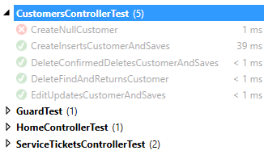

23. **Right-click** somewhere within the Test Explorer window and select
    **Group By | Project**.

    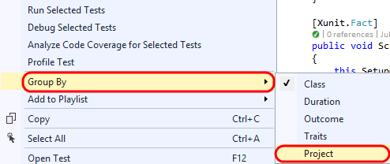

24. Grouping tests by project would obviously be useful for navigating
    and running tests at the project level.

    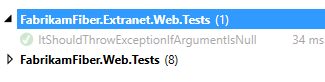

25. You can also use traits in your test code to provide
    custom grouping. Let’s say that we want to group all coded UI
    tests together. Open **CodedUITest1.cs** from the
    **FabrikamFiber.Web.UITests** project.

    

26. Un-comment the **CodedUITest** attribute from the top of the
    CodedUITest1 class definition.

    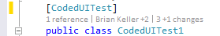

27. Add the **TestCategory** attribute to the CodedUITestMethod1 method
    with a category of “**UI**”.

    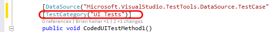

28. Build the solution by pressing **Ctrl+Shift+B**.

29. **Right-click** within **Test Explorer** and select **Group By |
    Traits**.

30. With the coded UI tests categorized appropriately, it is now easy to
    select and run just the UI tests if desired.

    

31. You can also create sets of tests called **playlists**. This
    provides custom grouping without the need to modify your unit
    testing code. **Right-click** the ***CodedUITestMethod1*** test
    and select **Add to Playlist | New Playlist**.

    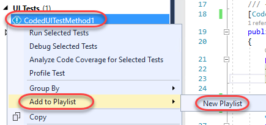

32. Enter “**UI Tests**” for the playlist file name and then click
    **Save**.

    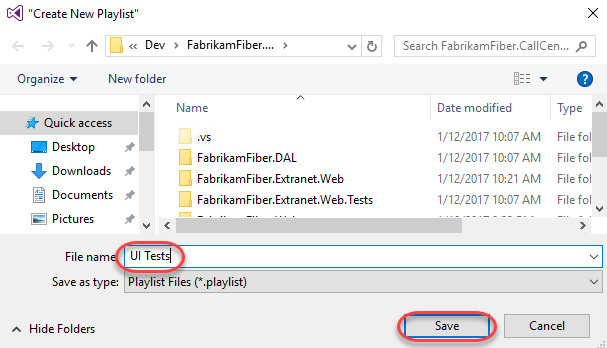

33. Select the **Playlist** drop-down and then select the “**UI
    Tests**” playlist.

    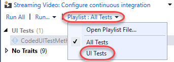

34. With just the “UI Tests” playlist selected, you will only see those
    specific tests shown in Test Explorer, making it much easier to
    focus on a particular selection of tests.

    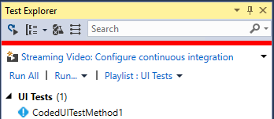

35. Test playlists are simple XML files that define the individual tests
    to include. For example, here is what the “UI Tests” XML looks
    like (loaded in Visual Studio editor).

    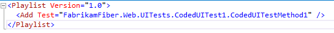

36. Playlists can be shared with team members via a team website,
    emailed, and even added to source control if desired. To load a
    playlist file, you would select the **Playlist** drop-down and
    then select the **Open Playlist File** option. You do not need to
    do this for this lab.

    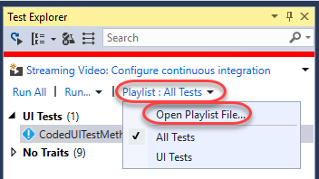

## Exercie 2: Code Coverage

In this exercise, you will learn about code coverage features that
make it easier to use and integrate into the development cycle.

1.  Return to **CodedUITest1.cs** and comment out the **CodedUITest**
    attribute on the class. We won’t be using that test for this part
    of the lab.

    

2.  In **Test Explorer**, Return to the default playlist that includes
    all tests by selecting the **Playlist** drop-down and then
    selecting the **All Tests** option.

    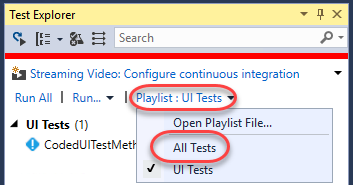

3.  To analyze code coverage for all tests, select the **Run** drop-down
    and then select the **Analyze Code Coverage for All
    Tests** option. This will initiate the process of building,
    testing, and gathering code coverage results.

    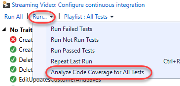

4.  You can view the results in the **Code Coverage Results** windows to
    get an idea of the Covered/Not Covered statistics for all of
    the tests. In the screenshot below, note that coverage is measured
    in blocks of code by default, where a block is code with exactly
    one entry and exit point. There will be two sets of code coverage
    results produced from the last run. If the **Not Covered** is
    100%, use the dropdown to select the other code coverage results.

    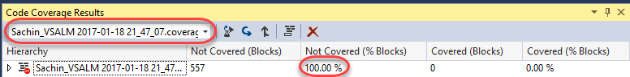

    >**Note**: If you would like to see the results in terms of lines,
    > you can do that by right-clicking in the Code Coverage Results
    > window and selecting the Add/Remove Columns option.

5.  Expand the root node of the code coverage result to view the
    coverage broken down by assembly. By default, we see all
    assemblies that are loaded during the test run (and for which a
    .pdb file is available).

    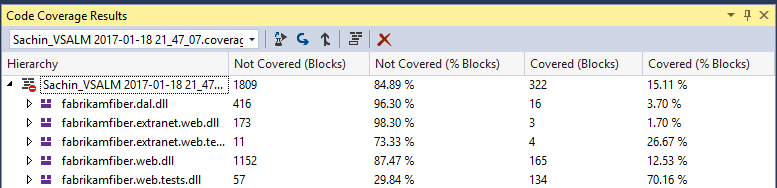

    >**Note:** You can customize control over which assemblies are
    > selected for code coverage analysis by writing a
    > .runsettings file. For more information, see the MSDN article
    > [Customizing Code Coverage
    > Analysis](http://msdn.microsoft.com/en-us/library/jj159530.aspx).

6.  Expand the **fabrikamfiber.web.dll** node to view the coverage
    broken down by namespace. This allows us to see that, although we
    do have some test coverage of the controller classes, the test
    team has a lot of work to do in order to provide coverage to the
    other namespaces.

    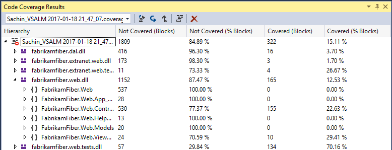

7.  Expand the **FabrikamFiber.Web.Controllers** namespace node to view
    the coverage broken down by class. This shows that the
    **HomeController** class is covered well and that the
    **EmployeesController** currently has no coverage.

    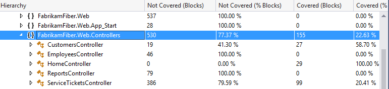

8.  Finally, let’s drill down into the class nodes to see coverage down
    to the method level by expanding the **CustomersController**
    class node.

    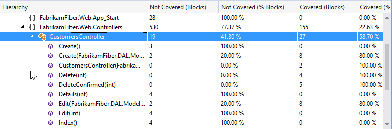

9.  **Double-click** the **Create(FabrikamFiber.DAL.Models.Customer)**
    constructor to navigate to the source code to visualize the
    block coverage.

    

10. In the editor window for SourceController.cs, you can see that the
    code highlighted blue represents the block that was covered by
    tests whereas the red represents the block that was not covered.

    

11. It is also possible to get code coverage for a specific selection
    of tests. In **Test Explorer**, right-click
    **CreateInsertsCustomerAndSaves** and select **Analyze Code
    Coverage for Selected Tests**.

    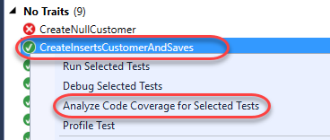

12. Once test execution completes for the selected test, expand the code
    coverage node and note that only the assemblies loaded during test
    execution are shown with statistics.

    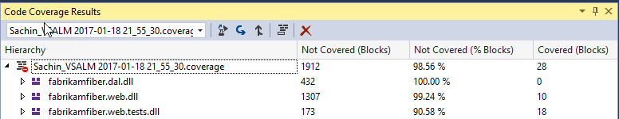

13. It is also easy to navigate between different code coverage results
    by using the drop-down in the **Code Coverage Results** window. Go
    ahead and select the first code coverage results file.

    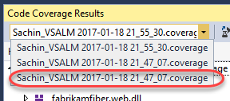

14. Let’s say that we want to use these code coverage results in a
    report or simply share them externally. To do that, click on the
    **Export Results** button.

    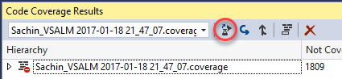

15. In the **Save Coverage Data as XML** window, you could save the code
    coverage data to an XML file, but for the purposes of this lab, go
    ahead and simply **Cancel** out of the dialog and continue on to
    the next exercise.

    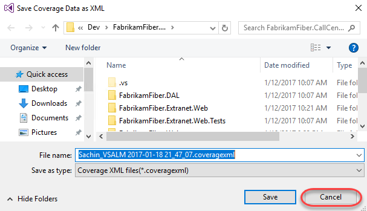

## Exercise 3: Code Clone Analysis

In this exercise, you will learn about the Code Clone analysis
feature that looks for semantically similar code using a heuristic
search technique, rather than simply searching for exact matches.

1.  Select **Analyze | Analyze Solution for Code Clones** from the main
    menu in Visual Studio.

2.  Once the analysis is complete, the **Code Clone Analysis Results**
    window will show clone candidates grouped by match strength.
    Expand the **Strong Match** group to expose the two files that had
    a strong match.

    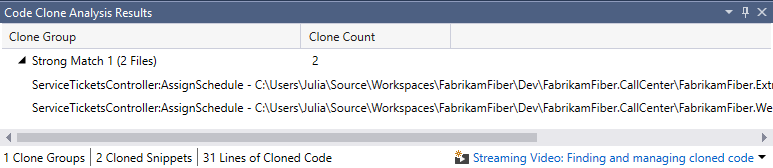

3.  Each line shows the class and method, specific file, and lines that
    were determined to be strong matches. If you **mouse over** each
    match, a snippet of code gives you quick glance at some of the
    matching code.

    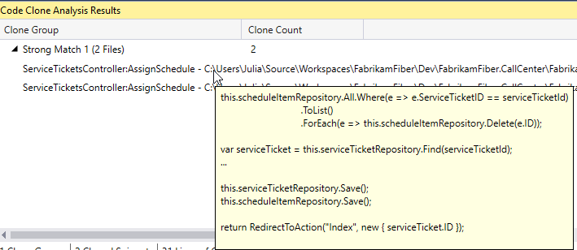

4.  **Double-click** on each match to open them in code editor windows,
    and then **right-click** on the title tab for one of them and
    select **New Horizontal Tab Group** from the context menu.

    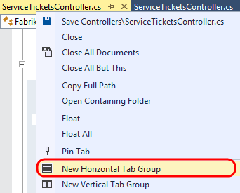

5.  Scroll through the code to locate the **AssignSchedule** method for
    each file and note that it is identical except for the last line
    that calls the **RedirectToAction** method. This indicates that
    this method is a good candidate for refactoring. This kind of
    broad search is particularly useful when looking for code that can
    be refactored for easier maintenance in the future.

    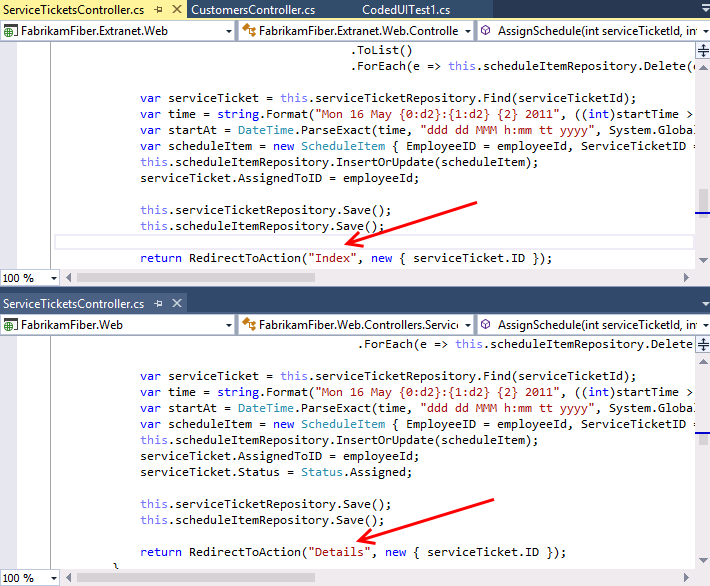

6.  Select **Window | Close All Documents** from the main menu to clear
    up some screen real estate space.

7.  You can also narrow the focus of the search for code clones
    if desired. In **Solution Explorer**, navigate to **Controllers**
    folder of the **FabrikamFiber.Web** project and open
    *CustomersController.cs* in the code editor.

    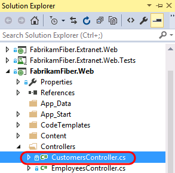

8.  Scroll down to the **Create** method that takes a **Customer**
    parameter and select the three lines of code within the first
    “if” statement.

    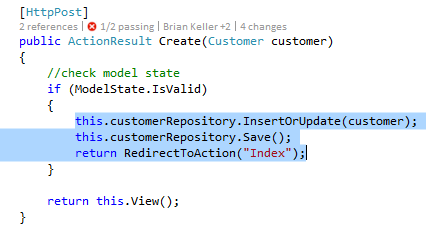

9.  **Right-click** the selected lines of code and then select the
    **Find Matching Clones in Solution** option from the context menu.

    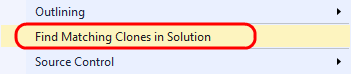

10. After the search is complete, the **Code Clone Search Results**
    window shows snippet matches of varying strength.

    

11. **Expand** all of the clone groups to expose the discovered matches,
    including the original clone group. You may want to increase the
    size of the Code Clone Search Results window so that you can see
    all matches at a glance.

    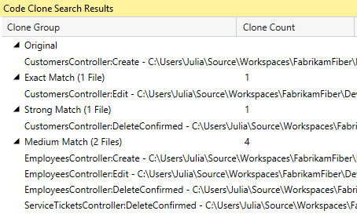

12.  Hold the mouse cursor over the original code snippet to remind
     ourselves what the code clones are being compared to.

     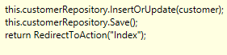

13. Hold the mouse cursor over the **Exact Match** result and note that
    the Edit method uses exactly the same code as the code from the
    Create method.

14. Hold the mouse cursor over the **Strong Match** result and note that
    the only difference is that the first line is a call to a
    Delete method.

    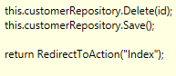

15. Hold the mouse cursor over the first **Medium** **Match** result and
    note that the snippet is similar to the original, but now we are
    working with an entirely different object (now
    **employeeRepository**).

    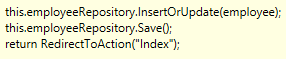

16. In summary, there are three main scenarios where the identification
    of code clones may be useful to developers:

    * Identification of candidates for code refactoring

    * Bug fixes or enhancements are made in code and the developer wants
      to see if there are other similar locations that should be updated

    * As a learning tool for a new developer starting work on a new team
      project, e.g. the developer adds code to update a customer record
      and wants to see if there are practices used by the rest of the
      codebase such as using a Try… Catch block

