Lab version:15.0.26228.0

Last updated:3/3/2017

## Overview ##

This lab is all about those "fit-and-finish" scenarios in Visual Studio Team Foundation Server that will make developers more productive as they write code and collaborate with other team members. You'll learn about integrated code reviews; the "My Work" experience for managing your active tasks; and once you're "in the zone", Visual Studio will now help you stay focused on the task at hand, no matter how much you're randomized, with a suspend/resume experience. You'll also learn how to work offline seamlessly, how the new merging experience works, and how you can more easily find work items.

### Prerequisites ###

In order to complete this lab you will need the Visual Studio 2017 virtual machine provided by Microsoft. For more information on acquiring and using this virtual machine, please see [this blog post](http://aka.ms/almvm).

### About the Fabrikam Fiber Scenario ###

This set of hands-on-labs uses a fictional company, Fabrikam Fiber, as a backdrop to the scenarios you are learning about. Fabrikam Fiber provides cable television and related services to the United States. They are growing rapidly and have embraced Windows Azure to scale their customer-facing web site directly to end-users to allow them to self-service tickets and track technicians. They also use an on-premises ASP.NET MVC application for their customer service representatives to administer customer orders.

In this set of hands-on labs, you will take part in a number of scenarios that involve the development and testing team at Fabrikam Fiber. The team, which consists of 8-10 people has decided to use Visual Studio application lifecycle management tools to manage their source code, run their builds, test their web sites, and plan and track the project.

Estimated time to complete this lab: **60 minutes**.

## Exercise 1: Team Explorer Overview ##

### Task 1: Team Explorer Overview ###

In this exercise, you will see a high-level view of the changes made to Team Explorer in this release and learn how to navigate the functionality that is made available there. If you are new to Team Foundation Server, you can think of Team Explorer as the primary way in which a Visual Studio user accesses Team Foundation Server functionality.

1. Log in as **Sachin Raj (VSALM\Sachin)**. All user passwords are **P2ssw0rd**.

1. Launch **Visual Studio 2017** from the taskbar.

1. The **Team Explorer** window provides a central hub for common tasks that developers undertake when working on a project, including source control, work item tracking, collaboration features such as code review and team rooms, and even quick links to other resources found in the web portal such as task board.

   

1. Navigation within **Team Explorer** operates similarly to a typical web application in that you follow links from the home screen, and can navigate backwards and forwards or return home at any time. We will put this navigation to use in the next exercise, as well as drill into the various hubs and pages exposed within Team Explorer. When this lab refers to the **Back** or **Home** buttons, these are the ones.

   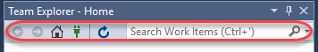

1. Click **Work Items**.

   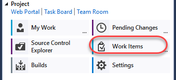

1. The **Work Items** view shows favorite queries for the logged-in user and the team, as well as provides the capability to add new queries and work items.

   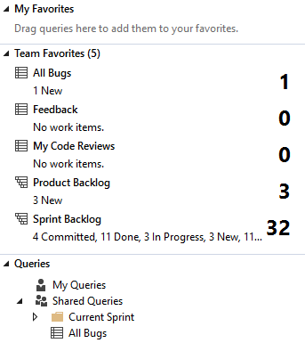

1. Click the **Home** button.

1. Click **Source Control Explorer**. This provides a view into everything stored in source control, as well as its local status.

    

   

1. Click **Settings** to view the team project and team project collection options.

    

   

1. Click the **Home** button.

1. Click **Builds** to manage build definitions and view build history.

    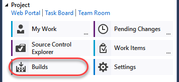

   

1. We will look at the new **My Work** functionality in the remaining exercises.

### Task 2: My Work ###

1. In this exercise, you will learn about the new My Work experience for managing your active tasks.

1. Click the **Home** button.

1. In **Team Explorer - Home**, click **My Work**.

   

1. The **My Work** node shows work items in progress, available work items, and suspended and shelved work for the currently logged in user. This workflow uses a task-based development model to help keep team members in-sync with each other.

   

1. Click the **Open Query** hyperlink that is located in the **Available Work Items** section.

   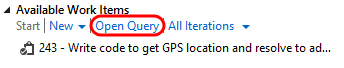

1. Click **Edit Query**.

    

    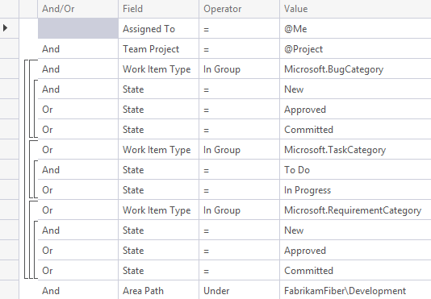

    > **Note:** The types of work items offered and whether or not they fit into the "My Work" concept is dependent upon the process template. In the Scrum process template, this includes tasks.

1. **Close** the query window without saving changes.

1. Let's say that we want to work on one of our available work items. On the **My Work** page in **Team Explorer**, **right-click** on the item that starts with "**Write code to get GPS location...**" and choose the **Add to In Progress** option from the context menu. This communicates the current state of the work item to our team.

    

###  ###

### Task 3: Local Workspaces ###

1. In this exercise, you will learn about local workspaces and how they improve the offline development experience.

1. In **Source Control Explorer**, **double-click** on the **FabrikamFiber.CallCenter.sln** file in the **Dev** branch to open it.

   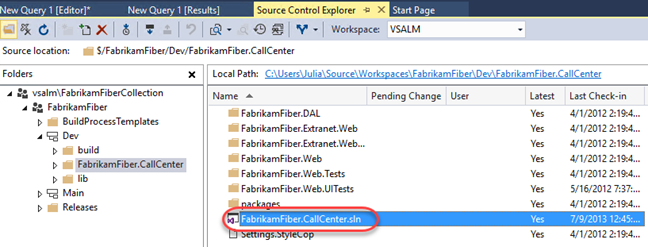

1. Server-based workspaces used to be the only option available in Team Foundation Server (prior to 2012). With server workspaces, source control operations are performed exclusively on the server, so working in a disconnected, offline scenario can be tedious. **Local workspaces**, which are now default, improve the development experience for smaller teams and projects. They provide a more client-centric workflow, a style of version control often described as **Modify-Merge-Commit**.

1. As an aside, server-based workspaces, which are better suited for larger projects, can certainly still be used if desired. Load the Manage Workspaces window by typing '**workspaces'** into the **Quick Launch** search box in the top-right corner of Visual Studio and wait a second or two for the results to load.

    

    > **Note:** The **Quick Launch** search box can be used to find most of the settings, tools, and windows available in Visual Studio, no matter where they are found, saving you precious time clicking through menus. Use the **Ctrl+Q** key combination to avoid the mouse altogether.

1. Select the **Workspaces...** command link.

   

1. In the **Manage Workspaces** window, click **Add...** to start creating a new workspace.

   

1. In the **Add Workspace** window, click **Advanced** to see all available options.

   

1. Locate the **Location** workspace property. By default, new workspaces will use local workspaces, but you can choose to create a server-based workspace if desired.

   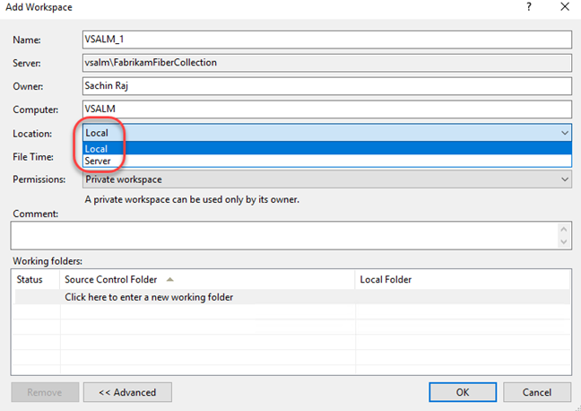

1. Close the workspace windows by pressing the **Esc** key twice.

1. In **Solution Explorer**, expand the **FabrikamFiber.Web\Content** folder.

   

1. **Single-click** the _fullcalendar.css_ file to view its contents. Note that the file is loaded in the CSS Source Editor as expected, but the tab for it is shown on the right-hand side. This new tab type is called a **preview** tab - as you use the arrow keys to navigate between files or single-click on them, the preview tab will be replaced with the most recent selection. Preview tabs help address the problem where you can easily overwhelm your Visual Studio tab real estate with files that you only need temporarily.

    

    > **Note:** There is a button on the preview tab itself that allows you promote it to a regular tab (see the arrow in the screenshot above).

1. Make an arbitrary change to the _**fullcalendar.css**_ file by changing one of the style properties. Visual Studio will indicate that the file has been checked out, but keep in mind that this has only been done in the local workspace. Other team members will not see that you are working on this file.

   

1. Two of the major benefits of the local workspaces are that the disconnected, offline work scenario is greatly improved, and it is much easier to use external tools to work with files in source control. To demonstrate both of these benefits in action, let's proceed by stopping the Team Foundation Server site in IIS. This will simulate a scenario where you are working offline, such as writing code from the beach. In a real-world scenario, you would never write code from the beach - you would be enjoying your vacation.

1. Launch **Internet Information Services (IIS) Manager**.

1. In IIS Manager, expand the **VSALM** server node and the **Sites** node to find and select the **Team Foundation Server** site. In the **Actions** pane, click **Stop**.

   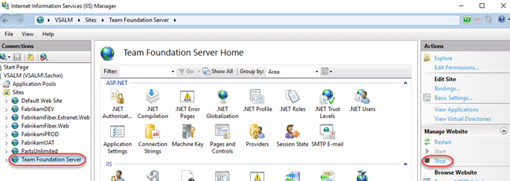

1. Return to Visual Studio, load the **Source Control Explorer** window, and click the **refresh** button. Note that the window is now in a **disconnected** state.

   

1. Even though we are now in a disconnected state with Team Foundation Server, we can continue to do work. **Right-click** the **Content** folder in **Solution Explorer** and select the **Open Folder in File Explorer** option.

   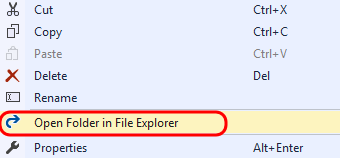

1. Add a new file into the Content folder by right-clicking in a blank area of the view and selecting **New | Text Document** from the context menu. Accept the default name.

    > **Note:** We will use this file in a demonstration a little later - the contents are not important and can be left blank.

   

1. In the **Explorer** window, right-click **Site.css** and select **Open With | Notepad** from the context menu.

1. In Notepad, change the '**body**' style color to '**red**'.

   

1. In **Notepad**, save and close **Site.css** and return to **Solution Explorer**. Note that Visual Studio detected the change to the file and that the file was not read-only as it would have been in the case of a server-based workspace.

<a name="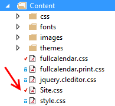"></a>
###  ###

### Task 4: Pending Changes ###

1. Click **Home** in **Team Explorer**, then click **Pending Changes**.

    

    > **Note:** You should see an error message in the Pending Changes window about being unable to connect to the remote server, but you can simply ignore it. We purposefully stopped Team Foundation Server during the previous exercise.

1. In the **Pending Changes** window, we can see that the two changes made to existing files in the previous exercise automatically show up under the **Included Changes** section.

   

1. In the **Excluded Changes** section, there is a detected change that was not automatically marked as an included change. Note that there may be more adds detected due to NuGet references. Click the **Detected** link.

   

1. In the **Promote Candidate Changes** window, you can see the addition of the new text document. Uncheck all items using the header checkbox and then check just **New Text Document.txt**. Click **Promote** to move it to the set of changes that we want to include in the next check-in.

   

1. You should now see three included changes.

   

1. Although we could continue to work on our project while offline, note that we can't perform a check-in at this time as the **Check In** button is currently disabled.

   

1. In the Internet Information Services (IIS) Manager window, select the **Team Foundation Server** site and then click **Start** in the Actions pane.

   

1. Return to **Visual Studio** and then click the **refresh** button in the **Team Explorer - Pending Changes** window. We should now be working in a connected state again with the **Check In** button enabled once again. **Do not check in your changes yet**.

###  ###

### Task 5: Suspend and Resume ###

1. In this exercise, you will learn about the suspend and resume functionality for work items and the integrated code reviews.

1. Another common but unavoidable difficulty faced by developers is context switching between different tasks. In past versions of Team Foundation Server, this was addressed with **Shelvesets** that would preserve your changes on the server even if you weren't ready to check those into source control. In more recent versions, this has been taken one step further with the **Suspend** and **Resume** feature - in addition to creating a shelveset of changes, some other data like breakpoints and tool window positions are also saved locally.

1. We begin this exercise in the state that we ended the previous exercise in - we have a set of pending changes to be made as part of the work that we have in progress. Load the **My Work** window in **Team Explorer** to view the work that is in progress.

   

1. As part of this scenario, imagine that we also have some other debugging tool windows open and a break point set as we debug code that we are writing. Double-click **FabrikamFiber.Web\Controllers**\**HomeController.cs** and add a breakpoint to the first line in the **HomeController constructor**.

   

1. Open the **Immediate** window from **Debug | Windows | Immediate**.

1. Now imagine that your boss asks you to stop working on the current task, and work on a high-priority bug instead. We currently have a lot of time invested in getting Visual Studio debugging tools in place, and we would like to be able to return to this current context after the bug fix is complete.

1. Press **Ctrl+Shift+S** to save all open files.

1. In **Team Explorer**, navigate to the **My Work** screen, select the **Suspend** drop-down, and then click **Suspend**. We could modify the description, but since we are currently working on a work item, it is pre-populated for us.

   

1. Clear out all breakpoints by pressing **Ctrl+Shift+F9**, and then click **Yes** to confirm the action.

   

1. Close all document windows by selecting **Window | Close All Documents** from the main menu.

1. Reset to the default window layout by selecting **Window | Reset Window Layout** from the main menu. Click **Yes** when asked to confirm the action.

   

1. At this point, you should have a very clean looking workspace and the previous task that you were working on should be listed in the **Suspended Work** section of the **My Work** window.

   

1. Note the search box for work items at the top of the Team Explorer window. This will perform a search of all work items in the currently selected team project. Type "**Canadian**" into the search box and press the **Enter** key to locate the high-priority bug that you have been asked to work on.

    

    > **Note:** This quick search functionality searches the team project Title, Description, and Repro Steps fields by default for the keyword provided. You can also click the drop-down arrow to show your search history, and to add search parameters for metadata such as work item type, or whom the work item is assigned to.

1. ****

1. **Double-click** the bug titled "**Customers with Canadian addresses not displaying properly"**.

   

1. In the window displaying the form for the bug, select the **Links** tab to view the linked work items. Note that there are two child tasks.

   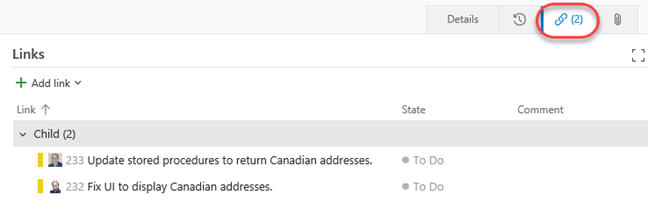

1. Imagine that other team members are tackling these child tasks already, but that we know of another problem related to the parent bug that also needs to be fixed. Select **Add link | New item** to add a new task.

   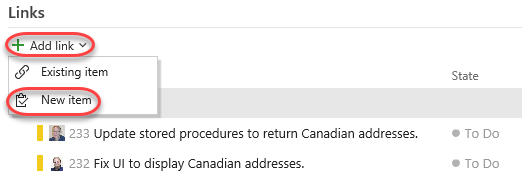

1. For the new linked work item, select a **Work item type** of **Task**, enter a **Title** of **"Fix RegEx for Zip code property"**, and then click **OK**.

   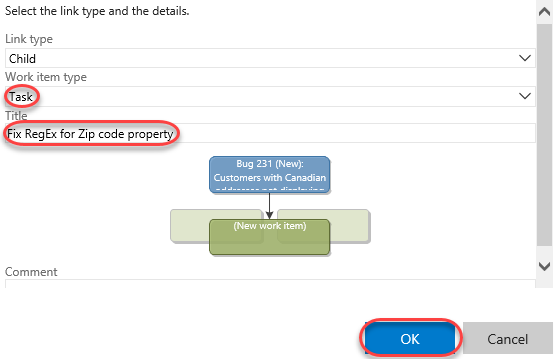

1. Assign the new task to **Sachin Raj** and then click **Save and close**.

   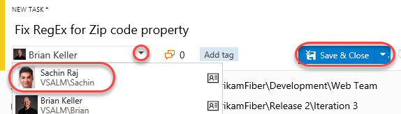

1. Return to the **Team Explorer - My Work** window.

   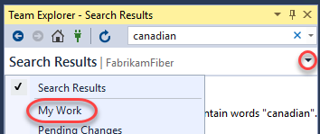

1. You should now see the new task appear in the **Available Work Items** section.

   

1. Right-click the new task entitled "**Fix RegEx for Zip code property**", and then select **Add to In Progress**.

1. In **Solution Explorer**, open **FabrikamFiber.DAL\Models\Address.cs**.

   

1. The **Zip** property is currently using an incorrect regular expression data annotation, with the result being that users of the web application can enter invalid postal codes for Canadian addresses.

   

1. Let's assume that the correct fix is to update the regular expression. Comment out the existing regular expression and then un-comment the other one.

   

1. Press **Ctrl+S** to save the changes to the file.

### Task 6: Code Reviews ###

1. Now that the fix has been made, let's ask Clemri to perform a code review on the changes to make sure things look correct. In **Team Explorer - My Work**, click the **Request Review** link.

   

1. Type **Clemri Steyn** for the name of the reviewer and then press the **Enter** key, type a description of "**please check my regular expression change**",  and then click **Submit Request**. You can dismiss any warnings.

   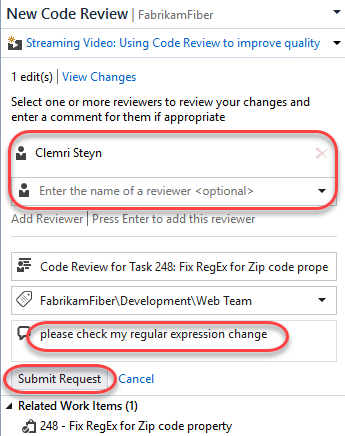

1. Open a remote desktop session to VSALM and log in as **VSALM\Clemri** to perform the code review. The password for all users in this virtual machine is **P2ssw0rd**. Note that you can then minimize and restore the session later on when switching between accounts.

1. Launch **Visual Studio** and open **FabrikamFiber.CallCenter.sln** from the **Start Page**.

   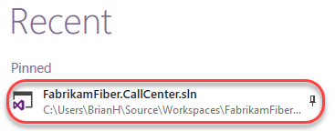

1. Open **Team Explorer**, and navigate to **My Work**. The new code review request is shown under the **Code Reviews** section at the bottom. Filter for **Incoming Requests.**

   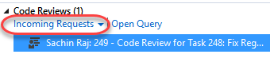

1. Double-click the code review request to open the **Code Review** window. This view allows Clemri Steyn to see a lot of information regarding the request so that he is able to determine whether he will accept or decline the task. He can view the entire shelveset of changes, see the other reviewers or even add someone to the reviewers list, see the related work items, comments related to the code review request, and finally the ability to show a diff view for all of the changed files with a single click.

   

1. In the **Code Review** window, click the **Accept** link to start working on the code review.

   

1. Click **Address.cs** from the comments section to open it with the inline diff tool.

   

1. We are now viewing the changes using the default side-by-side comparison mode. Red background colors represent changes in the old version (left) and green colors represent changes in the new version (right). Note the legend available at the bottom of the comparison view.

   

1. In the Compare Files toolbar, select the **compare mode** drop down button to view the various display modes that the diff viewer can use. Try out a few of the different modes.

    > **Note:** If the Compare Files toolbar is not open, open it from **View | Toolbars | Compare Files** from the main menu in Visual Studio.

   

1. Let's assume that we agree that the changes are correct, so let's ahead and add a review-level comment to that effect. Click the **Reply** link underneath Sachin's message.

   

1. For the comment, enter "**this looks good**" and then click **Save**.

   

1. Note that the new comment has the text "**Unsent**" next to it. The comment will not be sent until Clemri is done with the review.

   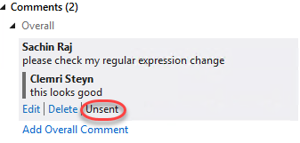

1. You can also annotate individual files and blocks of code with comments. In the diff viewer, use the mouse to highlight the **Zip** property name, **right-click**, and select **Add Comment** from the context menu.

   

1. In the comment box, enter "**Consider renaming to PostalCode**" and then click **Save**.

   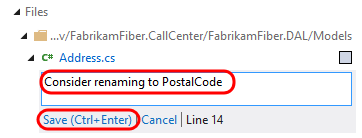

1. Click **Send Comments** near the top of the Code Review window to send the comments that we have batched up so far. Having the ability to send comments back right away can be beneficial for a code review that requires more work than this one. If the reviewer finds an issue, the developer can immediately start fixing the issue rather than waiting for the reviewer to finish.

   

1. Select the **Send &** **Finish** drop down followed by the **Looks Good** option to end the code review.

   

1. Switch users back to **Sachin** once again by minimizing the RDP session.

1. Return to **Team Explorer - My Work** and double-click on the code review item to open it.

   

1. In **Team Explorer - Code Review**, note that Clemri finished his review and had comments.

   

1. For this scenario, let's say that we are done with the code review process. Select **Close Review | Complete**.

   

1. Now that we are confident that we have fixed the high priority bug, we can check-in the changes. Click the **Check In** link to load the **Pending Changes** window and then click the **Check In** button to complete the task. Click **Yes** if asked to conform check-in.

    

   

1. Now we can return to the code that we were originally working on before we were interrupted by the bug fix. In the **My Work** window, **right-click** on the task listed under the **Suspended Work** section, and then select the **Resume** option from the context menu.

   

1. After the shelveset is opened and the task context is restored, you will notice that the document windows and tools windows, as well as their positions, are restored to the state that we left them in when we suspended this task. Although you won't notice this in a virtual machine, had you been using multiple monitors you would have also noticed that all of the tool windows would be opened on their respective monitors. This capability allows you to quickly get in and out of tasks to help you deal with the frequent interruptions that many of us face on a daily basis.

###  ###

### Task 7: Merging ###

1. You should still be logged in as **Sachin** from the previous exercise.

1. In **Team Explorer - Pending Changes**, you should see three changes listed under the **Included Changes** section. Double-click **Site.css** to open it.

   

1. You may recall that that we previously changed the body color property to red. Now we will take a look at what happens if another user makes a different change to the same file and then checks it in.

1. Switch back to the **Clemri Steyn** RDP session.

1. From **Solution Explorer**, open **FabrikamFiber.Web\Content\Site.css**.

   

1. Let's make a different change than Sachin is going to make, so change the body **font-size** property from .9em to **.5em**.

   

1. Press **Ctrl+Shift+S** to save all documents.

1. In **Team Explorer - Pending Changes**, click **Check In**. If you are prompted to confirm the check-in, please do so.

1. Switch users back to **Sachin** once again.

1. In **Solution Explorer**, right-click **Site.css** and select **Get Latest Version** from the context menu.

   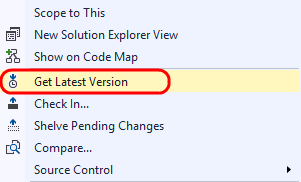

1. In **Site.css** file, note that the body font-size property has been updated with Clemri's change, but that we also still have our current change where we updated the color property to red. This demonstrates that, wherever possible, Team Foundation Server and Visual Studio attempt to auto-merge changes, rather than needing the user to be involved with the merge process. This can save you several steps when compared to previous versions.

   

1. **Switch users** back to **Clemri Steyn**.

1. Let's create a change that will force a manual merge process. In _**Site.css**_, change the body **color** property to **black**.

   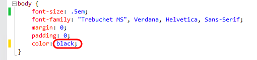

1. Press **Ctrl+Shift+S** to save all documents.

1. **Check in** the pending change.

1. **Switch users** back to **Sachin**.

1. Imagine that Sachin is blissfully unaware that Clemri has changed the body color property to black. In **Solution Explorer**, **right-click** on _**Site.css**_ and select **Get Latest Version** from the context menu. This will load the **Resolve Conflicts** window.

   

1. Click **Merge Changes In Merge Tool** to begin the manual merge process. If you are prompted to save and close Site.css, go ahead and click **Yes** to continue.

   

1. The new merge process also uses the integrated diff viewer. By default, the merge view uses a side-by-side view to show the changes. Note that you can see that the server version (left) has the black color, the local version (right) has the red color, and the result (below) currently shows the original color.

   

1. Let's go with server version. Select the checkbox to the left of the body **color** property choice that uses **black** (in the left pane).

   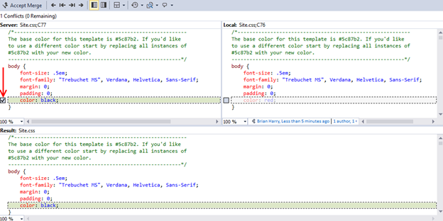

1. In the Merge Toolbar, click the **Accept Merge** button.

    

