## Overview

This lab is all about those “fit-and-finish” scenarios in Visual
    Studio Team Foundation Server that will make developers more
    productive as they write code and collaborate with other
    team members. You’ll learn about integrated code reviews; the “My
    Work” experience for managing your active tasks; and once you’re “in
    the zone”, Visual Studio will now help you stay focused on the task
    at hand, no matter how much you’re randomized, with a
    suspend/resume experience. You’ll also learn how to work offline
    seamlessly, how the new merging experience works, and how you can
    more easily find work items.

### Pre-requisites

In order to complete this lab you will need the Visual Studio 2017
    virtual machine provided by Microsoft. For more information on
    acquiring and using this virtual machine, please see [this blog
    post](http://aka.ms/almvm).

### Exercises

This hands-on lab includes the following exercises:

* Team Explorer Overview

* My Work

* Local Workspaces

* Pending Changes

* Suspend and Resume

* Code Reviews

* Merging  

Estimated time to complete this lab: **60 minutes**.

## Exercise 1: Team Explorer Overview

In this exercise, you will see a high-level view of the changes made
    to Team Explorer in this release and learn how to navigate the
    functionality that is made available there. If you are new to Team
    Foundation Server, you can think of Team Explorer as the primary way
    in which a Visual Studio user accesses Team Foundation
    Server functionality.

1.  Log in as **Sachin Raj** (VSALM\\Sachin). All user passwords are **P2ssw0rd**.

2.  Launch **Visual Studio 2017** from the taskbar.

3.  The **Team Explorer** window provides a central hub for common tasks
    that developers undertake when working on a project, including
    source control, work item tracking, collaboration features such as
    code review and team rooms, and even quick links to other
    resources found in the web portal such as task board.

    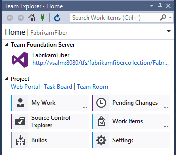

4.  Navigation within **Team Explorer** operates similarly to a typical
    web application in that you follow links from the home screen, and
    can navigate backwards and forwards or return home at any time. We
    will put this navigation to use in the next exercise, as well as
    drill into the various hubs and pages exposed within
    Team Explorer. When this lab refers to the **Back** or **Home**
    buttons, these are the ones.

    

5.  Click **Work Items**.

    

6.  The **Work Items** view shows favorite queries for the logged-in
    user and the team, as well as provides the capability to add new
    queries and work items.

    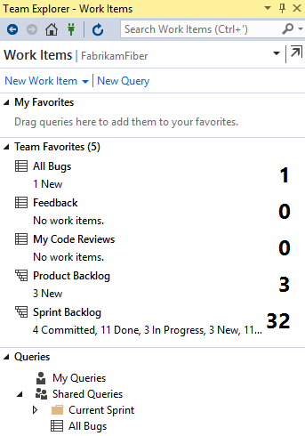

7.  Click the **Home** button.

8.  Click **Source Control Explorer**.

    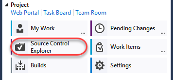

    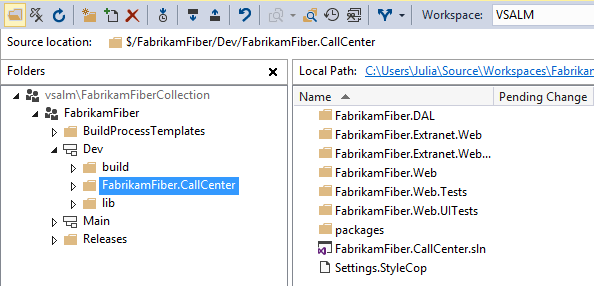

9.  Click **Settings** to view the team project and team project collection options.

    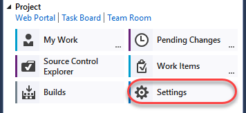

    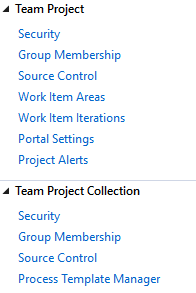

10. Click the **Home** button.

11. Click **Builds** to manage build definitions and view build history.

    

    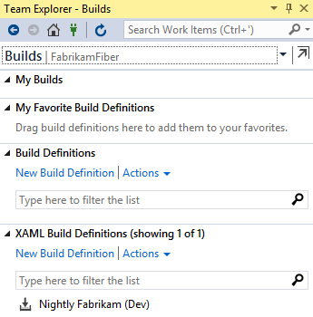

12. We will look at the new **My Work** functionality in the
    remaining exercises.

## Exercise 2: My Work

In this exercise, you will learn about the new My Work experience for managing your active tasks.

1.  Click the **Home** button.

2.  In **Team Explorer - Home**, click **My Work**.

    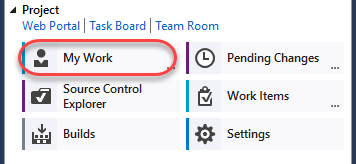

3.  The **My Work** node shows work items in progress, available work
    items, and suspended and shelved work for the currently logged
    in user. This workflow uses a task-based development model to help
    keep team members in-sync with each other.

    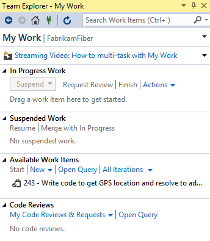

4.  Click the **Open Query** hyperlink that is located in the
    **Available Work Items** section.

    

5.  Click **Edit Query**.

    

    

    >**Note:** The types of work items offered and whether or not they
    fit into the “My Work” concept is dependent upon the
    process template. In the Scrum process template, this
    includes tasks.

6.  **Close** the query window without saving changes.

7.  Let’s say that we want to work on one of our available work items.
    On the **My Work** page in **Team Explorer**, **right-click** on
    the item that starts with “**Write code to get GPS location…**”
    and choose the **Add to In Progress** option from the
    context menu. This communicates the current state of the work item
    to our team.

    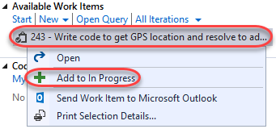

    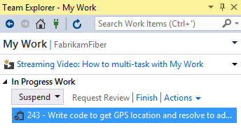

## Exercise 3: Local Workspaces

In this exercise, you will learn about local workspaces and how they
    improve the offline development experience.

1.  In **Source Control Explorer**, **double-click** on the
    **FabrikamFiber.CallCenter.sln** file in the **Dev** branch to
    open it.

    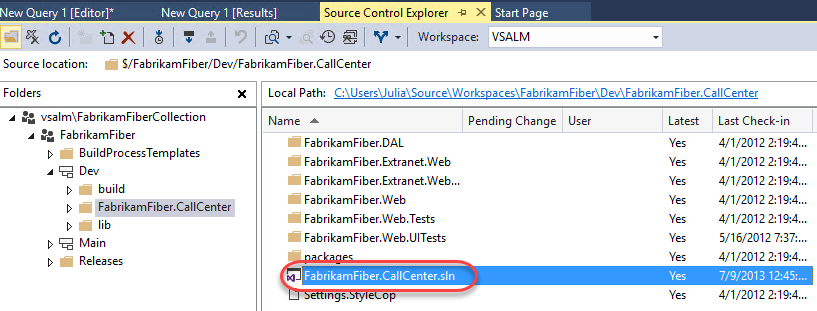

2.  Server-based workspaces used to be the only option available in Team
    Foundation Server (prior to 2012). With server workspaces, source
    control operations are performed exclusively on the server, so
    working in a disconnected, offline scenario can be tedious.
    **Local workspaces**, which are now default, improve the
    development experience for smaller teams and projects. They
    provide a more client-centric workflow, a style of version control
    often described as **Modify-Merge-Commit**.

3.  As an aside, server-based workspaces, which are better suited for
    larger projects, can certainly still be used if desired. Load the
    Manage Workspaces window by typing ‘**workspaces’** into the
    **Quick Launch** search box in the top-right corner of Visual
    Studio and wait a second or two for the results to load.

    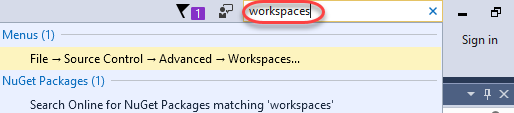

    >**Note:** The **Quick Launch** search box can be used to find most
    of the settings, tools, and windows available in Visual Studio, no
    matter where they are found, saving you precious time clicking
    through menus. Use the **Ctrl+Q** key combination to avoid the
    mouse altogether.

4.  Select the **Workspaces…** command link.

    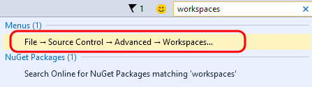

5.  In the **Manage Workspaces** window, click **Add…** to start
    creating a new workspace.

    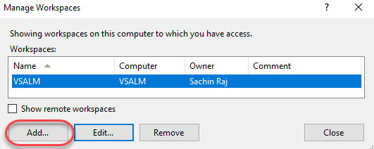

6.  In the **Add Workspace** window, click **Advanced** to see all
    available options.

    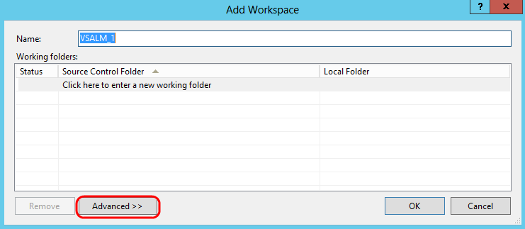

7.  Locate the **Location** workspace property. By default, new
    workspaces will use local workspaces, but you can choose to create
    a server-based workspace if desired.

    

8.  Close the workspace windows by pressing the **Esc** key twice.

9.  In **Solution Explorer**, expand the
    **FabrikamFiber.Web\\Content** folder.

    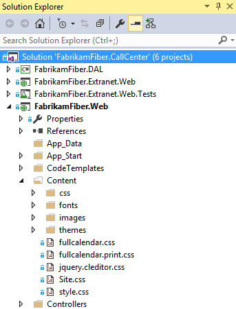

10. **Single-click** the *fullcalendar.css* file to view its contents.
    Note that the file is loaded in the CSS Source Editor as expected,
    but the tab for it is shown on the right-hand side. This new tab
    type is called a **preview** tab – as you use the arrow keys to
    navigate between files or single-click on them, the preview tab
    will be replaced with the most recent selection. Preview tabs help
    address the problem where you can easily overwhelm your Visual
    Studio tab real estate with files that you only need temporarily.

    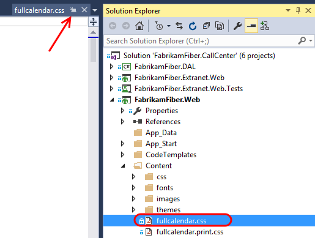

    >**Note:** There is a button on the preview tab itself that allows
    you promote it to a regular tab (see the arrow in the
    screenshot above).

11. Make an arbitrary change to the ***fullcalendar.css*** file by
    changing one of the style properties. Visual Studio will indicate
    that the file has been checked out, but keep in mind that this has
    only been done in the local workspace. Other team members will not
    see that you are working on this file.

    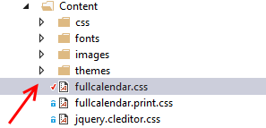

12. Two of the major benefits of the local workspaces are that the
    disconnected, offline work scenario is greatly improved, and it is
    much easier to use external tools to work with files in
    source control. To demonstrate both of these benefits in action,
    let’s proceed by stopping the Team Foundation Server site in IIS.
    This will simulate a scenario where you are working offline, such
    as writing code from the beach. In a real-world scenario, you
    would never write code from the beach - you would be enjoying
    your vacation.

13. Launch **Internet Information Services (IIS) Manager**.

14. In IIS Manager, expand the **VSALM** server node and the **Sites**
    node to find and select the **Team Foundation Server** site. In
    the **Actions** pane, click **Stop**.

    

15. Return to Visual Studio, load the **Source Control Explorer**
    window, and click the **refresh** button. Note that the window is
    now in a **disconnected** state.

    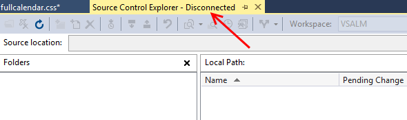

16. Even though we are now in a disconnected state with Team Foundation
    Server, we can continue to do work. **Right-click** the
    **Content** folder in **Solution Explorer** and select the **Open
    Folder in File Explorer** option.

    

17. Add a new file into the Content folder by right-clicking in a blank
    area of the view and selecting **New | Text Document** from the
    context menu. Accept the default name.

    >**Note:** We will use this file in a demonstration a little later –
    the contents are not important and can be left blank.

    

18. In the **Explorer** window, **right-click** the ***Site.css*** file
    and select **Open With | Notepad** from the context menu.

19. In Notepad, change the ‘**body**’ style color to ‘**red**’.

    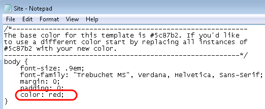

20. In **Notepad**, **save** and **close** the Site.css file and return
    to **Solution Explorer**. Note that Visual Studio detected the
    change to the file and that the file was not read-only as it would
    have been in the case of a server-based workspace.

    

## Exercise 4: Pending Changes

In this exercise, you will learn about the Pending Changes view within Team Explorer.

1.  Click **Home** in **Team Explorer**, then click **Pending Changes**.

    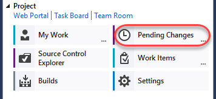

    >**Note:** You should see an error message in the Pending Changes
    window about being unable to connect to the remote server, but you
    can simply ignore it. We purposefully stopped Team Foundation
    Server during the previous exercise.

2.  In the **Pending Changes** window, we can see that the two changes
    made to existing files in the previous exercise automatically show
    up under the **Included Changes** section.

    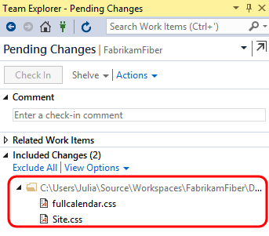

3.  In the **Excluded Changes** section, there is a detected change that
    was not automatically marked as an included change. Click the
    **Detected** link.

    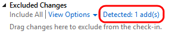

4.  In the **Promote Candidate Changes** window, you can see the
    addition of the new text document. Click **Promote** to move it to
    the set of changes that we want to include in the next check-in.

    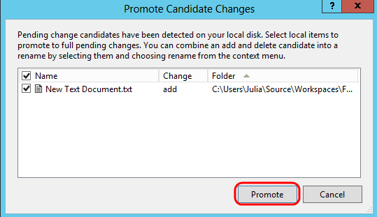

5.  You should now see three included changes.

    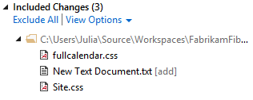

6.  Although we could continue to work on our project while offline,
    note that we can’t perform a check-in at this time as the **Check
    In** button is currently disabled.

    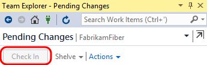

7.  In the Internet Information Services (IIS) Manager window, select
    the **Team Foundation Server** site and then click **Start** in
    the Actions pane.

    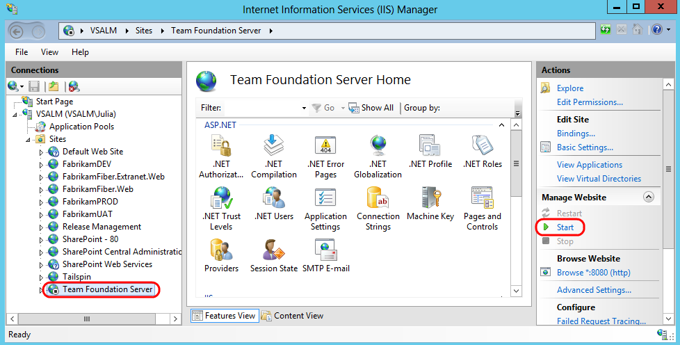

8.  Return to Visual Studio and then click the **refresh** button in the
    **Team Explorer – Pending Changes** window. We should now be
    working in a connected state again with the **Check In** button
    enabled once again. **Do not check in your changes yet**.

    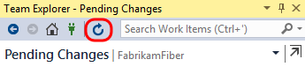

## Exercise 5: Suspend and Resume

In this exercise, you will learn about the suspend and resume
functionality for work items and the integrated code reviews.

1.  Another common but unavoidable difficulty faced by developers is
    context switching between different tasks. In past versions of
    Team Foundation Server, this was addressed with **Shelvesets**
    that would preserve your changes on the server even if you weren’t
    ready to check those into source control. In more recent versions,
    this has been taken one step further with the **Suspend** and
    **Resume** feature – in addition to creating a shelveset of
    changes, some other data like breakpoints and tool window
    positions are also saved locally.

2.  We begin this exercise in the state that we ended the previous
    exercise in - we have a set of pending changes to be made as part
    of the work that we have in progress. Load the **My Work** window
    in **Team Explorer** to view the work that is in progress.

    

3.  As part of this scenario, imagine that we also have some other
    debugging tool windows open and a break point set as we debug code
    that we are writing. Double-click on ***HomeController.cs*** from
    **FabrikamFiber.Web\\Controllers** and add a breakpoint to the
    first line in the HomeController constructor.

    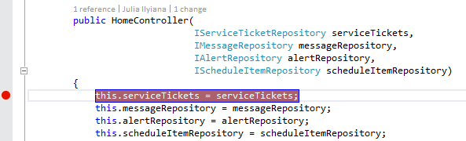

4.  Open the **Immediate** window from **Debug | Windows | Immediate**.

5.  Now imagine that your boss asks you to stop working on the current
    task, and work on a high-priority bug instead. We currently have a
    lot of time invested in getting Visual Studio debugging tools in
    place, and we would like to be able to return to this current
    context after the bug fix is complete.

6.  Press **Ctrl+Shift+S** to save all open files.

7.  In **Team Explorer**, navigate to the **My Work** screen, select the
    **Suspend** drop-down, and then click **Suspend**. We could modify
    the description, but since we are currently working on a work
    item, it is pre-populated for us.

    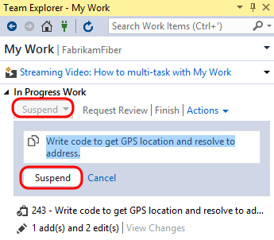

8.  Clear out all breakpoints by pressing **Ctrl+Shift+F9**, and then
    click **Yes** to confirm the action.

    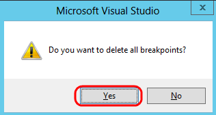

9.  Close all document windows by selecting **Window | Close All
    Documents** from the main menu.

10. Reset to the default window layout by selecting **Window | Reset
    Window Layout** from the main menu. Click **Yes** when asked to
    confirm the action.

    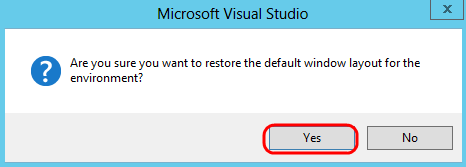

11. At this point, you should have a very clean looking workspace and
    the previous task that you were working on should be listed in the
    **Suspended Work** section of the **My Work** window.

    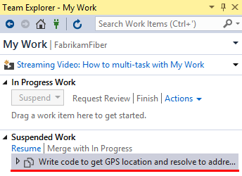

12. Note the search box for work items at the top of the Team
    Explorer window. This will perform a search of all work items in
    the currently selected team project. Type “**Canadian**” into the
    search box and press the **Enter** key to locate the high-priority
    bug that you have been asked to work on.

    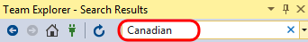

    >**Note:** This quick search functionality searches the team project
    > Title, Description, and Repro Steps fields by default for the
    > keyword provided. You can also click the drop-down arrow to show
    > your search history, and to add search parameters for metadata
    > such as work item type, or whom the work item is assigned to.

    > 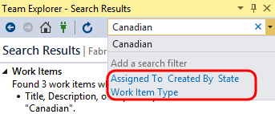

13. **Double-click** the bug titled “**Customers with Canadian addresses
    not displaying properly”**.

    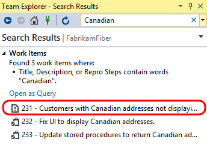

14. In the window displaying the form for the bug, select the **Tasks**
    link to view the linked work items. Note that there are two
    child tasks.

    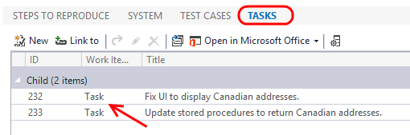

15. Imagine that other team members are tackling these child tasks
    already, but that we know of another problem related to the parent
    bug that also needs to be fixed. Click **New** in the Tasks
    section of the form to create a new child task.

    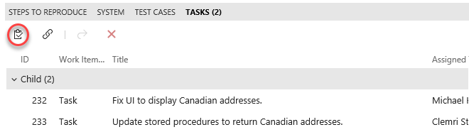

16. For the new linked work item, select **Link Type** of **Child**,
    **Work Item Type** of **Task**, enter a **Title** of “**Fix RegEx
    for Zip code property**”, and then click **OK**.

    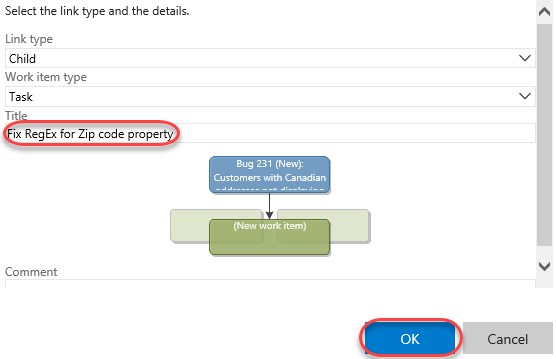

17. Assign the new task to **Sachin Raj** and then click **Save and
    close**.

    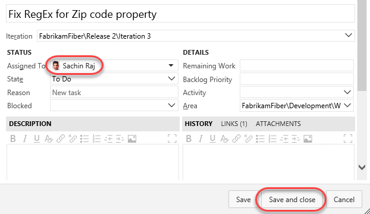

18. Return to the **Team Explorer – My Work** window. You should now see
    the new task appear in the **Available Work Items** section.

    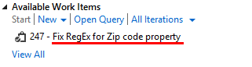

19. **Right-click** on the new task entitled “**Fix RegEx for Zip code
    property**”, and then select the **Add to In Progress** option
    from the context menu.

20. In **Solution Explorer**, open the ***Address.cs*** file from the
    **Models** folder of the **FabrikamFiber.DAL** project. The
    **Address.Zip** property is currently using an incorrect regular
    expression data annotation, with the result being that users of
    the web application can enter invalid postal codes for
    Canadian addresses.

    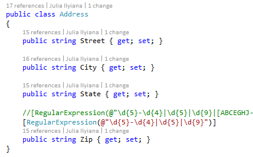

21. Let’s assume that the correct fix is to update the
    regular expression. Comment out the existing regular expression
    and then un-comment the other one.

    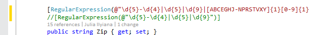

22. Press **Ctrl+S** to save the changes to the file.

## Exercise 6: Code Reviews

1. Now that the fix has been made, let’s ask Clemri to perform a
    code review on the changes to make sure things look correct. In
    **Team Explorer - My Work**, click the **Request Review** link.

    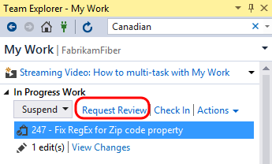

2.  Type **Clemri Steyn** for the name of the reviewer and then press
    the **Enter** key, type a description of “**please check my
    regular expression change**”, and then click **Submit Request**.
    You can dismiss any warnings.

    

3.  Open a remote desktop session to VSALM and log in as **Clemri
    Steyn** to perform the code review. The password for all users in
    this virtual machine is **P2ssw0rd**. Note that you can then
    minimize and restore the session later on when switching
    between accounts.

4.  Launch **Visual Studio**, open **Team Explorer**, and navigate to
    **My Work**. The new code review request is shown under the **Code
    Reviews** section at the bottom. Filter for **Incoming Requests.**

    

5.  **Double-click** the code review request to open the **Code
    Review** window. This view allows Clemri Steyn to see a lot of
    information regarding the request so that he is able to determine
    whether he will accept or decline the task. He can view the entire
    shelveset of changes, see the other reviewers or even add someone
    to the reviewers list, see the related work items, comments
    related to the code review request, and finally the ability to
    show a diff view for all of the changed files with a single click.

    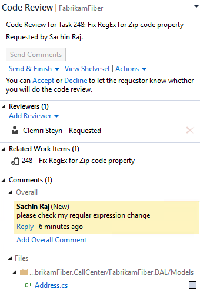

6.  In the **Code Review** window, click the **Accept** link to start
    working on the code review.

    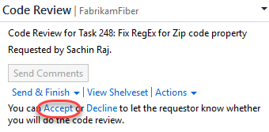

7.  Click **Address.cs** from the comments section to open it with the
    inline diff tool.

    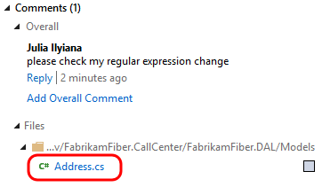

8.  We are now viewing the changes using the default side-by-side
    comparison mode. Red background colors represent changes in the
    old version (left) and green colors represent changes in the new
    version (right). Note the legend available at the bottom of the
    comparison view.

    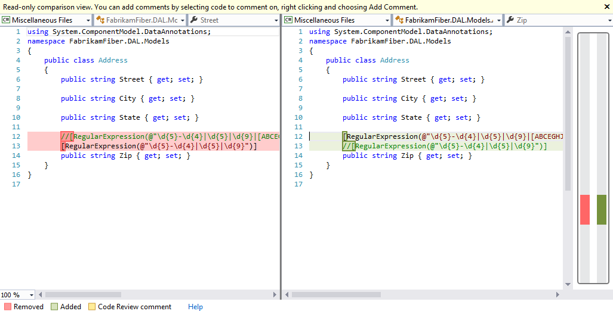

9.  In the Compare Files toolbar, select the **compare mode** drop down
    button to view the various display modes that the diff viewer
    can use. Try out a few of the different modes.

    >**Note:** If the Compare Files toolbar is not open, open it from
    > **View | Toolbars | Compare Files** from the main menu in
    > Visual Studio.

    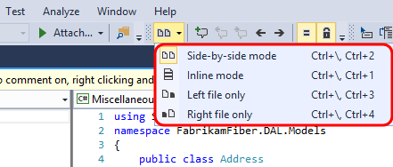

10. Let’s assume that we agree that the changes are correct, so let’s
    ahead and add a review-level comment to that effect. Click the
    **Reply** link underneath Sachin’s message.

    

11. For the comment, enter “**this looks good**” and then click
    **Save**.

    

12. Note that the new comment has the text “**Unsent**” next to it. The
    comment will not be sent until Clemri is done with the review.

    

13. You can also annotate individual files and blocks of code
    with comments. In the diff viewer, use the mouse to highlight the
    **Zip** property name, **right-click**, and select **Add Comment**
    from the context menu.

    

14. In the comment box, enter “**Consider renaming to PostalCode**” and
    then click **Save**.

    

15. Click **Send Comments** near the top of the Code Review window to
    send the comments that we have batched up so far. Having the
    ability to send comments back right away can be beneficial for a
    code review that requires more work than this one. If the reviewer
    finds an issue, the developer can immediately start fixing the
    issue rather than waiting for the reviewer to finish.

    

16. Select the **Send &** **Finish** drop down followed by the **Looks
    Good** option to end the code review.

    

17. Switch users back to **Sachin** once again by minimizing the
    RDP session.

18. Return to **Team Explorer – My Work** and double-click on the code
    review item to open it.

    

19. In **Team Explorer – Code Review**, note that Clemri finished his
    review and had comments.

    

20. For this scenario, let’s say that we are done with the code
    review process. Select **Close Review | Complete**.

    

21. Now that we are confident that we have fixed the high priority bug,
    we can check-in the changes. Click the **Check In** link to load
    the **Pending Changes** window and then click the **Check In**
    button to complete the task. Click **Yes** if asked to
    conform check-in.

    

    

22. Now we can return to the code that we were originally working on
    before we were interrupted by the bug fix. In the **My Work**
    window, **right-click** on the task listed under the **Suspended
    Work** section, and then select the **Resume** option from the
    context menu.

    

23. After the shelveset is opened and the task context is restored, you
    will notice that the document windows and tools windows, as well
    as their positions, are restored to the state that we left them in
    when we suspended this task. Although you won’t notice this in a
    virtual machine, had you been using multiple monitors you would
    have also noticed that all of the tool windows would be opened on
    their respective monitors. This capability allows you to quickly
    get in and out of tasks to help you deal with the frequent
    interruptions that many of us face on a daily basis.

    

## Exercise 7: Merging

In this exercise, you will learn about the merging experience in
Visual Studio 2017.

1.  You should still be logged in as **Sachin** from the
    previous exercise.

2.  In **Team Explorer – Pending Changes**, you should see three changes
    listed under the **Included Changes** section. Double-click on
    ***Site.css*** to open it.

    

3.  You may recall that that we previously changed the body color
    property to red. Now we will take a look at what happens if
    another user makes a different change to the same file and then
    checks it in.

4.  Switch back to the **Clemri Steyn** RDP session.

5.  From **Team Explorer**, open **Source Control Explorer**.

6.  Open the **FabrikamFiber.CallCenter** solution from the **Dev**
    branch of **Source Control Explorer**.

    

7.  From **Solution Explorer**, open ***Site.css*** from the **Content**
    folder of the **FabrikamFiber.Web** project.

    

8.  Let’s make a different change than Sachin is going to make, so
    change the body **font-size** property from .9em to **.5em**.

    

9.  Press **Ctrl+Shift+S** to save all documents.

10. In **Team Explorer – Pending Changes**, click **Check In**. If you
    are prompted to confirm the check-in, please do so.

11. Switch users back to **Sachin** once again.

12. In **Solution Explorer**, **right-click** on ***Site.css*** and
    select **Get Latest Version** from the context menu.

    

13. In the ***Site.css*** file, note that the body font-size property
    has been updated with Clemri’s change, but that we also still have
    our current change where we updated the color property to red.
    This demonstrates that, wherever possible, Team Foundation Server
    and Visual Studio attempt to auto-merge changes, rather than
    needing the user to be involved with the merge process. This can
    save you several steps when compared to previous versions.

    

14. **Switch users** back to **Clemri Steyn**.

15. Let’s create a change that will force a manual merge process. In
    ***Site.css***, change the body **color** property to **black**.

    

16. Press **Ctrl+Shift+S** to save all documents.

17. **Check in** the pending change.

18. **Switch users** back to **Sachin**.

19. Imagine that Sachin is blissfully unaware that Clemri has changed
    the body color property to black. In **Solution Explorer**,
    **right-click** on ***Site.css*** and select **Get Latest
    Version** from the context menu. This will load the **Resolve
    Conflicts** window.

    

20. Click **Merge Changes In Merge Tool** to begin the manual
    merge process. If you are prompted to save and close Site.css, go
    ahead and click **Yes** to continue.

    

21. The new merge process also uses the integrated diff viewer. By
    default, the merge view uses a side-by-side view to show
    the changes. Note that you can see that the server version (left)
    has the black color, the local version (right) has the red color,
    and the result (below) currently shows the original color.

    

22. Let’s go with server version. Select the checkbox to the left of the
    body **color** property choice that uses **black** (in the
    left pane).

    

23. In the Merge Toolbar, click the **Accept Merge** button.

    
