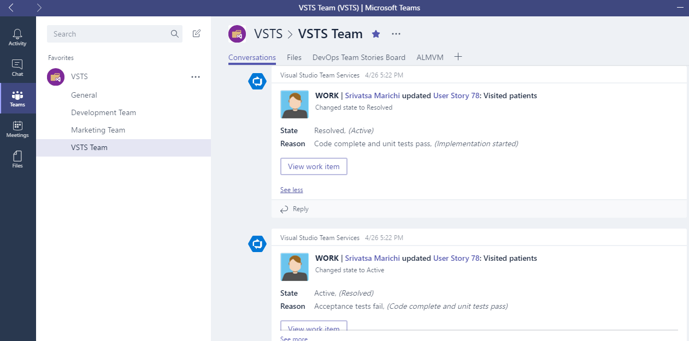

# Microsoft Teams Integration (Collaborate, Communicate and Celebrate)

## Overview

<a href="https://teams.microsoft.com/start">**Microsoft Teams**</a> is your chat-centered workspace in Office 365. Software development teams get instant access to everything they need in a dedicated
hub for teamwork, that brings your teams, conversations, content and tools from across Office 365 and Visual Studio Team Services together into one place.

> Note: This integration is currently available for Visual Studio Team Services (not Team Foundation Server).

## Pre-requisites

1. You should have Office365 account in order to integrate **Microsoft Teams** with **Visual Studio Team Services**.

2. Only VSTS accounts in the same organization (AAD tenant) can be used to integrate with your Microsoft Teams account.

You can start a free trial if you don't have Office365 account from <a href="https://teams.microsoft.com/start" />here.</a>

In this lab, you’ll learn about how Visual Studio Team Services integrates with **Microsoft Teams** to provide a comprehensive chat and collaboration experience, across your Agile and development work.

## Getting started with Microsoft Teams

1. Launch **Microsoft Teams** - you can either open the web app or download the app to your desktop from <a href="http://bit.ly/2ouq6eN">here</a>

   

2. After launching the app, you will see the **General Team**.

   

3. Start adding Teams by clicking on the bottom left on **Add Team** button.

   

4. Hover your mouse to create a new team.

   

5. Give a name for your team and description if needed. Select the privacy settings and click on **Next**.

   

6. You should see the status when creating team.

   

7. Now that you can add members for your team in order to get notify the events that occur and also you could start conversations with your team members.

   

## Integrating Visual Studio Team Services with Microsoft Teams 

VSTS integration with Microsoft Teams provides a comprehensive chat and collaborative experience across the development cycle. Teams can easily stay informed of important activities in your VSTS team projects with notifications and alerts on work items, pull requests, code commits, build and release.

1. Click on ellipsis button for the **VSTS Team** that was created and select **Connectors**.

   

2. Select **Visual Studio Team Services** and add.

   

3. Select the following and click on **save**.

   - VSTS Profile
   - VSTS Account
   - Project
   - Team 
   - Event Type

    

   

4. Since VSTS is configured now all the events will be seen under the  conversations tab. The events can be set accordingly depending upon the needs like **Work Item Updates, Build Summary** etc.

   

## Working with Kanban Boards within the Microsoft Teams

Your Kanban board turns your backlog into an interactive signboard, providing a visual flow of work. As work progresses from idea to completion, you update the items on the board. Each column represents a work stage, and each card represents a user story (blue cards) or a bug (red cards) at that stage of work.

