Last updated : {{ "now" | date: "%b %d, %Y" }}.

## Overview

**[Microsoft Teams](https://teams.microsoft.com/start)** is your chat-centered workspace in Office 365. Software development teams get instant access to everything they need in a dedicated
hub for teamwork, that brings your teams, conversations, content and tools from across Office 365 and Visual Studio Team Services together into one place.



## Prerequisites

1. You should have Office365 account in order to integrate **Visual Studio Team Services** with **Microsoft Teams**.

1. Only VSTS accounts in the same organization (AAD tenant) can be used to integrate with your Microsoft Teams account.

**You can start a free trial if you don't have Office365 account from [here](https://teams.microsoft.com/start){:target="_blank"}**

In this lab, you’ll learn about how **Visual Studio Team Services** integrates with **Microsoft Teams** to provide a comprehensive chat and collaboration experience, across your Agile and development work.

## Getting started with Microsoft Teams

1. Launch **Microsoft Teams** - you can either open the web app or download the app to your desktop from [here](https://teams.microsoft.com/dl/launcher/launcher.html?url=/_%23/l/home/0/0&type=home){:target="_blank"}

   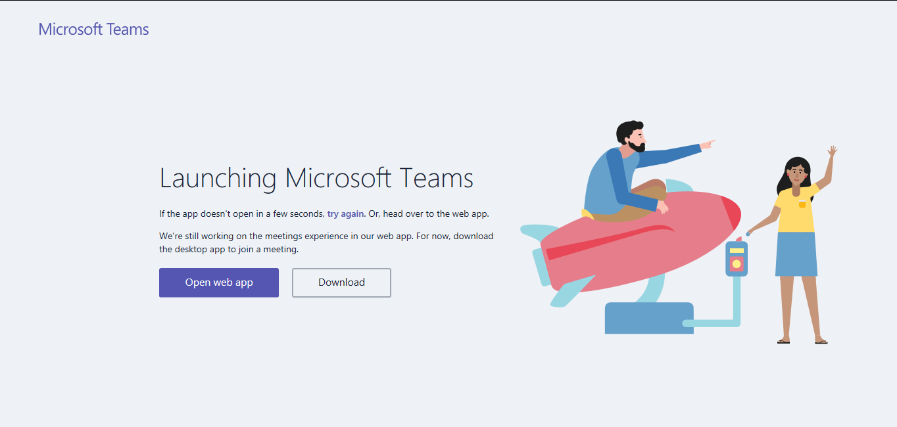

1. After launching the app, you will see the **General Team**.

   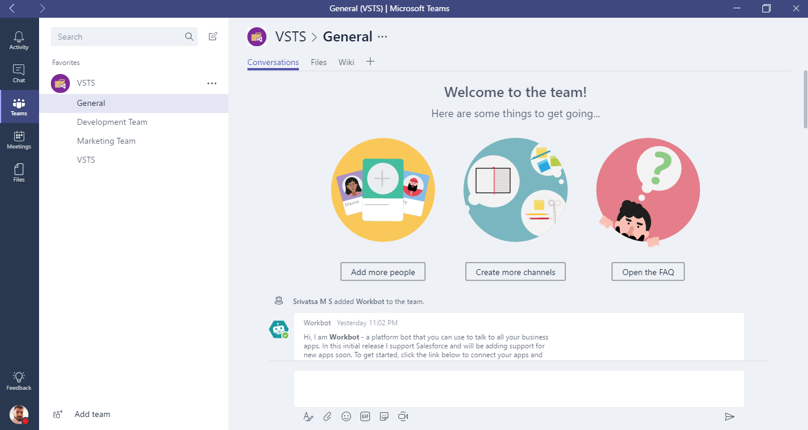

1. Start adding Teams by clicking on the bottom left on **Add Team** button.

   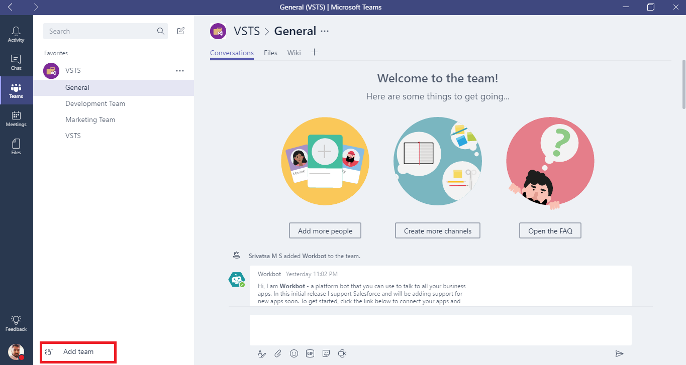

1. Hover your mouse to create a new team.

   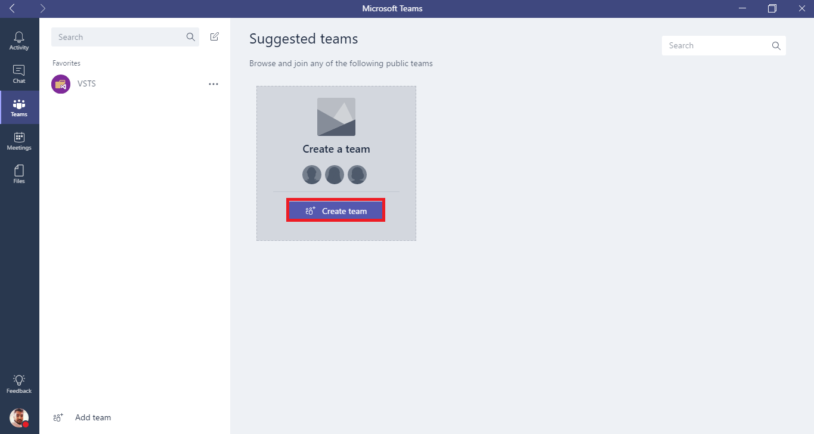

1. Give a name for your team and description if needed. Select the privacy settings and click on **Next**.

   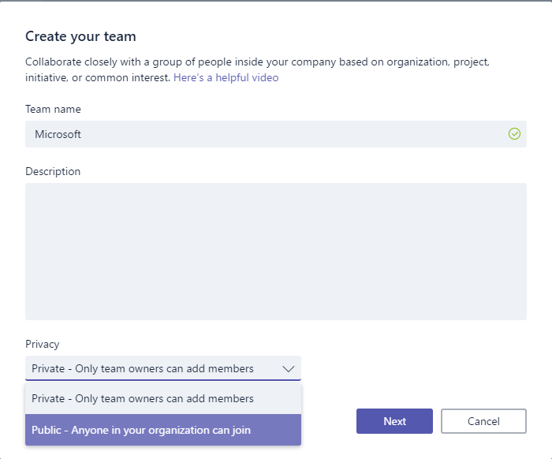

1. You should see the status when creating team.

   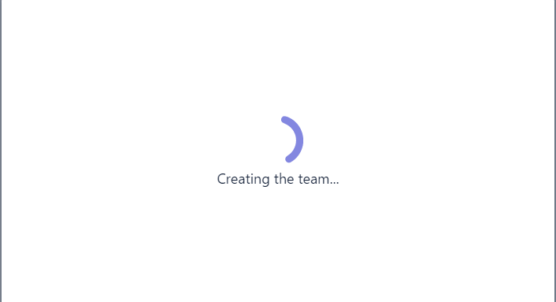

1. Add members for your team in order to get notify the events that occur and also start conversations with your team members.

   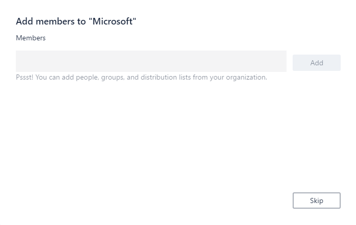

## Integrating Visual Studio Team Services with Microsoft Teams

**VSTS** integration with Microsoft Teams provides a comprehensive chat and collaborative experience across the development cycle. Teams can easily stay informed of important activities in your VSTS team projects with notifications and alerts on work items, pull requests, code commits, build and release.

1. Click on ellipsis button for the **VSTS Team** that was created and select **Connectors**.

   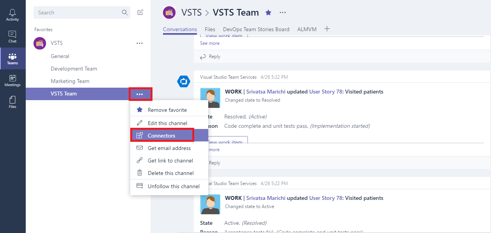

1. Select **Visual Studio Team Services** and add.

   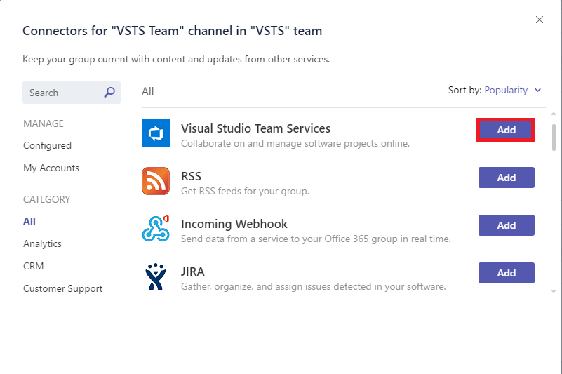

1. Select the following and click on **save**.

   - VSTS Profile
   - VSTS Account
   - Project
   - Team
   - Event Type

   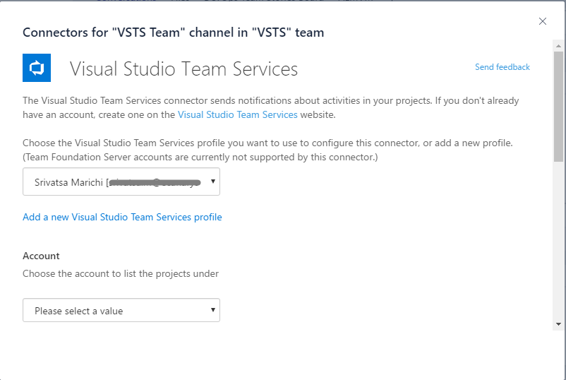

1. You can see the list of connectors that are configured to your team from the configured section.

    

1. Since VSTS is configured now all the events will be seen under the  conversations tab. The events can be set accordingly depending upon the needs like **Work Item Updates, Build Summary** etc.

    

## Working with Kanban Board within the Microsoft Teams

Your Kanban board turns your backlog into an interactive signboard, providing a visual flow of work. As work progresses from idea to completion, you update the items on the board. Each column represents a work stage, and each card represents a user story (blue cards) or a bug (red cards) at that stage of work.

The Kanban board can be added using Tabs. **Tabs** allow team members to access your service on a dedicated canvas, within a channel or in user's personal app space. You can leverage your existing web app to create a great tab experience within Teams.

1. Click on **+** icon to add new tab and select **Visual Studio**

   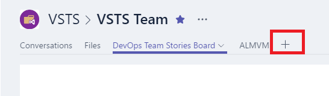

   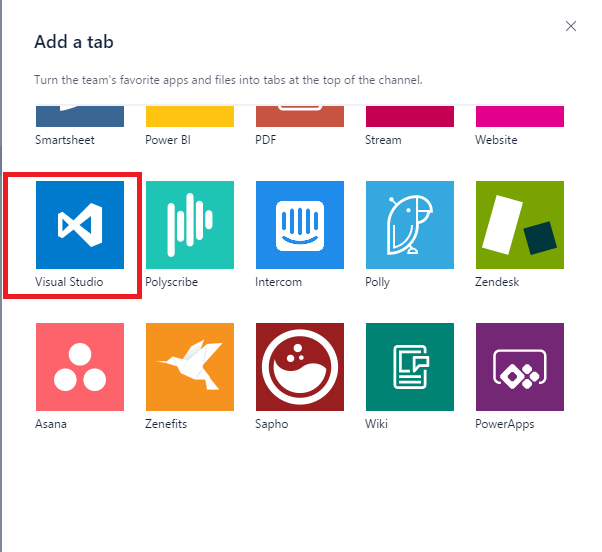

1. Select the account

   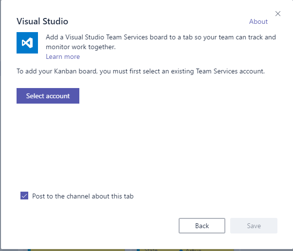

   

1. Select the desired account from the list and click on **continue**

   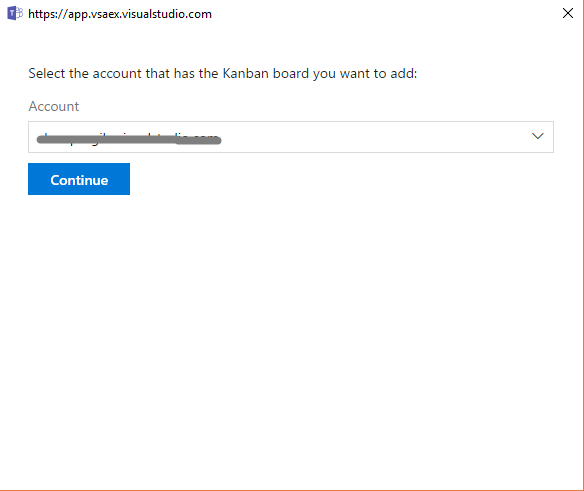

1. You can see the **Kanban Board** appearing in the tab.

   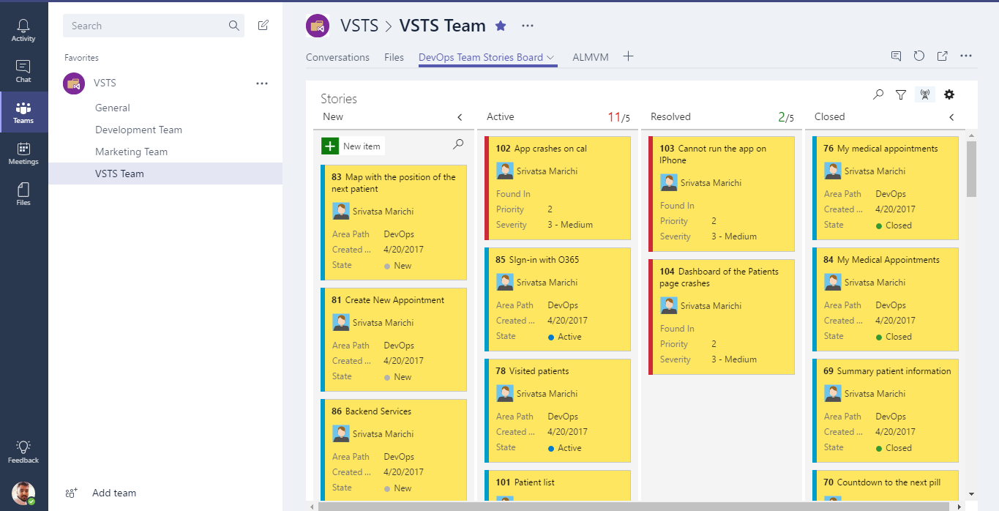

1. All the work can be monitored during the daily standup's and the updates are real when the work items states are changed. It also allows us to customize the Kanban Board from within the Teams and synced.

## Collaboration Experience

Messages are a good way to connect and keep a history of the conversation. It's even better to use emoji, stickers, and GIFs to make a great impression.

1. Start having conversations with your team members by selecting the **Conversations** tab.

   

1. All the conversations could be retrieved at anytime without losing the history which helps the entire team to have a collaborative experience

1. Teams can have a collaborative experience with the latest updates with respect to the **work items, build summary** etc so that it helps in better transparency

## Working with Channels

Channels are key to organizing team collaboration. Name them by discussion topic, project, role, location, or for fun, so conversations and content are easy to find by everyone in the team.

Channels are the biggest “containers” within a Team and contain content & conversations pertaining to some theme. A Team can have many Channels, but a Channel only relates to a single Team.

1. Select the **Team** that was created earlier and click on **elipsis.**

   

1. Give a name and description for your channel and click on **add.**

   

1. Once the channel is created, the conversations can be started amongst the team members.

   

## Sharing the Contents

Sharing the contents with team members is now easy with Microsoft Teams. You can attach any kind of document like **Word, PDF, GIF, Image** etc to make it easy for the teams to make sure that all are under one hood.

1. Click on **Files** and select **Upload** to share a document with the team

   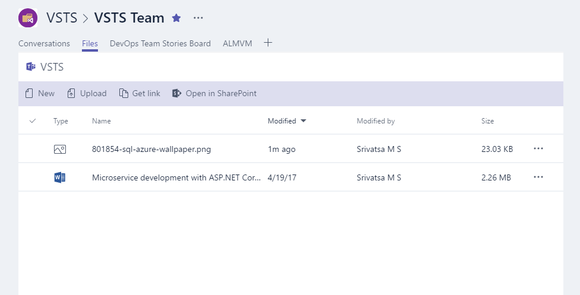

1. Click on the document that was uploaded from the list to start editing and having a live conversation with your team members

   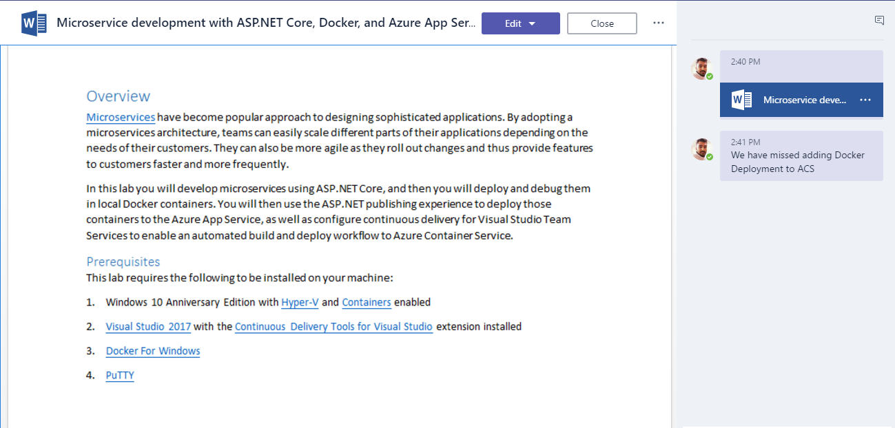

1. Share the related websites within the Teams as Tabs. Click on **+** and select **Website**

   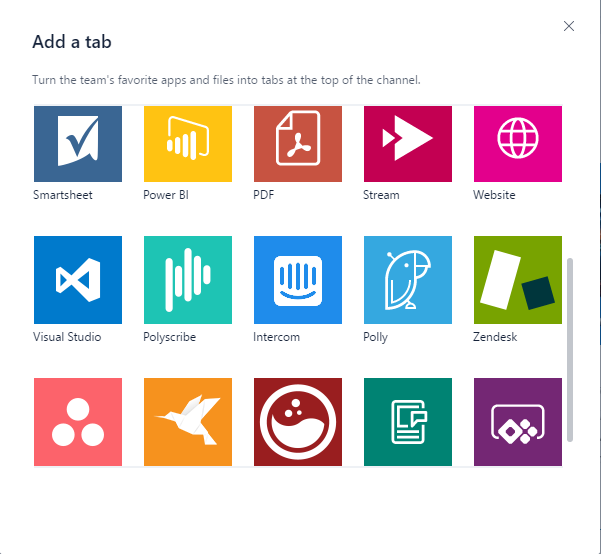

1. Provide a name for the website and click on **save**. It appears on the channel where all of the team members can access to get a quick information if there were any updates done

   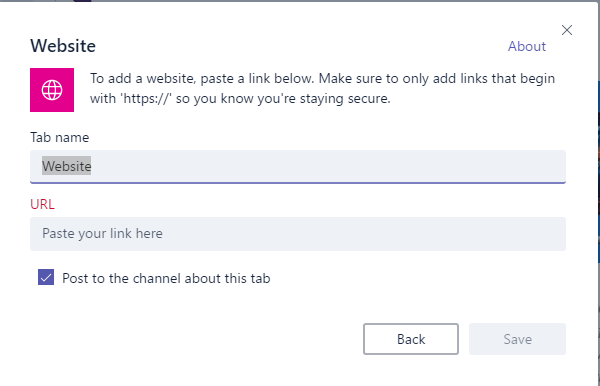

1. This is how the website looks when added to the channel.

   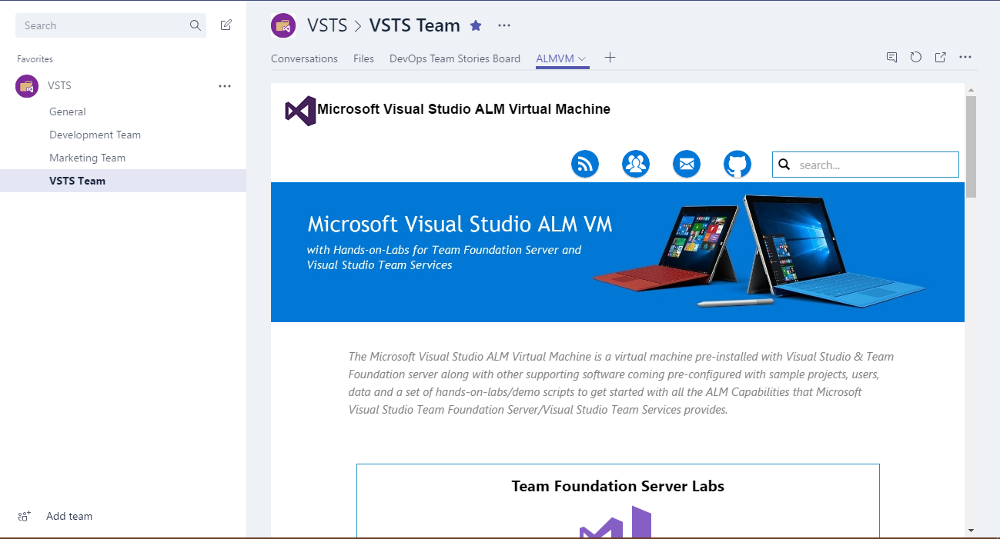