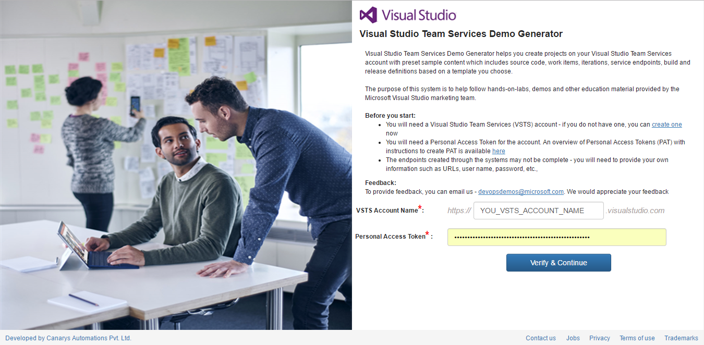

Last updated : {{ "now" | date: "%b %d,%Y" }}.

## Overview

Visual Studio Team Services Demo Generator helps you create projects on your Visual Studio Team Services account with preset sample content which includes source code, work items, service endpoints, build and release definitions based on a template you choose.

The purpose of this system is to help follow hands-on-labs, demos and other education material provided by the Microsoft Visual Studio marketing team.

## How to use?

1. Browse to [VSTS Demo Generator](https://azuredevopsdemogenerator.azurewebsites.net/)

1. Sign In with your VSTS credentials. If you don't have Team Service account, Click on ***Get Started for Free*** to create a VSTS account.

     
   

1. After you sign in, select **Accept** to grant the Demo Generatror permissions to access your VSTS accounts
         

1. Select the account you wanted to create the project, provide a name for your project and select the template you want to provision from the ***'...'*** button
  
   

1. Some templates may require additional extensions to be installed to your VSTS account. The system will check if these extensions are already installed. A green tick before the extension means that the extension is already installed.  If not select ***check boxes*** provided to install the extension(s) to your account and click on ***Create Project*** button.

   >If you want to manually install the extensions, you can click on the extension which will take you to the page on Visual Studio Team Services Marketplace, from where you can install the extension.

   

1. Upon successful creation of a project, you will see a link with the URL to the team project you created.

   

1. Select the link to navigate to the project and confirm the project was successfully provisioned.

   

   >**Note:** You will need to provide your own information such as URLs, user name, password, etc. for the endpoints created. You will need to provide them before you attempt to use them, say in build, release definitions, for example.
