Last updated : {{ "now" | date: "%b %d, %Y" }}.

## Overview

In this lab, you will learn about the agile planning and portfolio management tools and processes provided by Visual Studio Team Services and how they can help you quickly plan, manage, and track work across your entire team. You will explore the product backlog, sprint backlog, and task boards which can be used to track the flow of work during an iteration. We will also look at how the tools have been enhanced in this release to scale for larger teams and organizations.

## Prerequisites

To complete this lab, you will need:

- **Visual Studio Team Services account**. If you don't have one, you can create from [here](https://www.visualstudio.com/team-services){:target="_blank"}

- You can use the **[VSTS Demo Data generator](http://azuredevopsdemogenerator.azurewebsites.net/Environment/Create){:target="_blank"}** to provision a project with pre-defined data on to your Visual Studio Team Services account. Please use the ***My Health Clinic*** template to follow the hands-on-labs.

## Exercise 1: Working with Teams, Areas, and Iterations

1. Go to your VSTS account home page.

1. Click on the VS icon and browse to the MyHealthClinic project.

1. Navigate to the **Administration Overview** page by choosing the gear icon.

    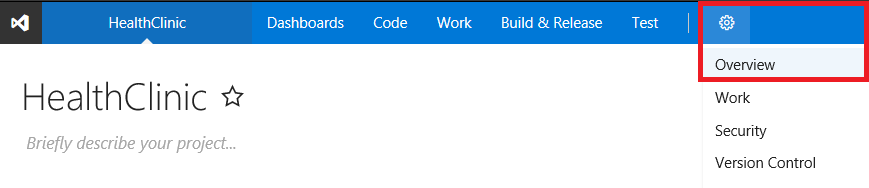

1. Check the existing teams, there are three teams by name **MyHealthClinic Team, Team1, and Team2**.
    The default team has the same name as your VSTS project. You can create new teams if needed from here.

    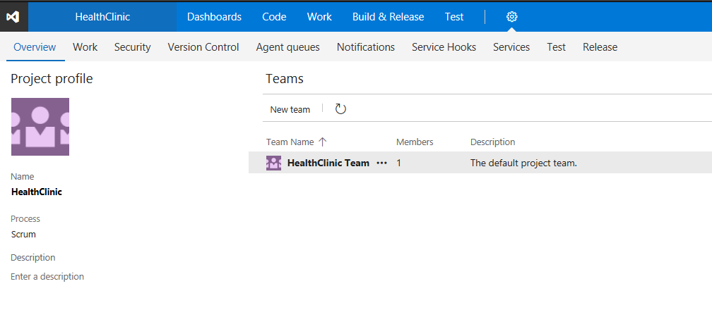

1. Delete both **Team 1** and **Team 2** by clicking the ellipsis next to each team and selecting **Delete**.

    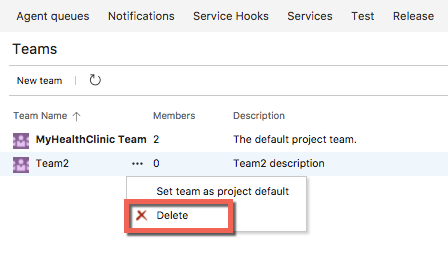

1. Now create a new team by clicking the **New team** link and giving it a name of **Web**. Make sure the **Team area** has a check mark. This option will create a corresponding area for the team, so they can group all their work items and keep them separate from other teams. If you do not select this option, you will have to set the default area path for the team once you create it. Follow the same steps to create a team called **Database**.

    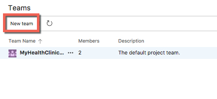

    

1. While on the **Overview** screen, click on the default team to view the members.   We see our user as the only current member.

    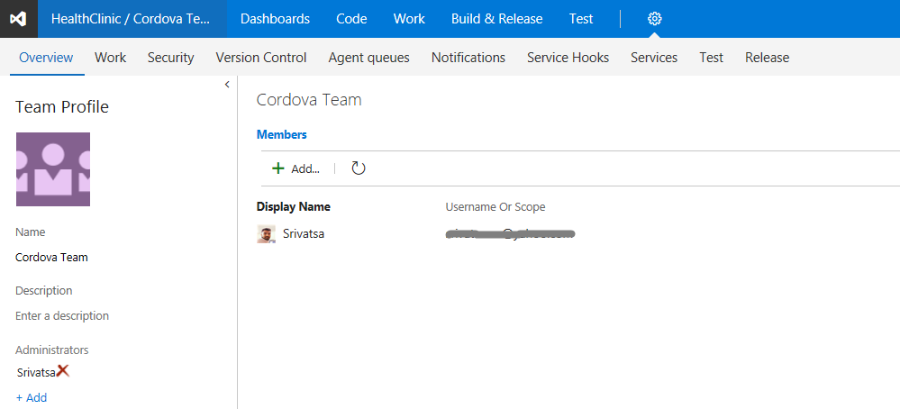

1. Click **Add** button to add new members to the team.

    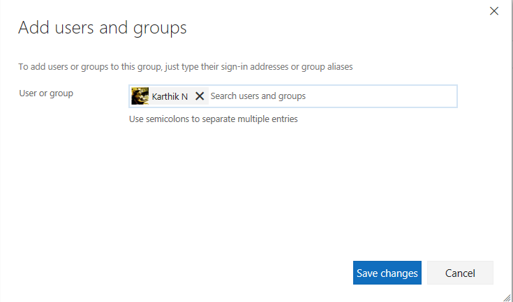

1. Because we are currently in the sub-area for the **Web** team.  We need to navigate back up to the default team, so we can setup management of sub-area paths.

    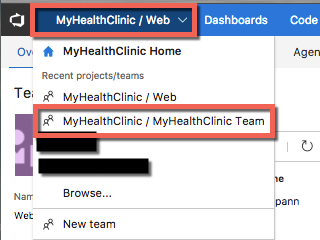

1. Select the **Work** tab at the top then select **Areas** option to view the area path for the team.

    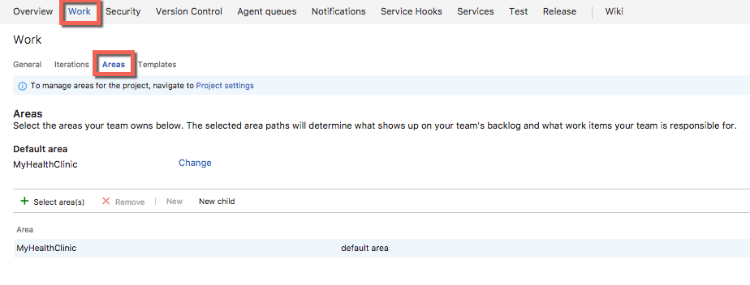

1. Now we want to change the area path setting for management areas to include sub-area paths.  The default setting for all teams is to exclude sub-area paths. We will change it to include sub-areas so that the team gets visibility into all of the work items from all teams. Optionally, the management team could also choose to not include sub-areas. Thereby removing work items from their view as soon as they are assigned to one of the teams. Click on the ellipsis for **MyHealthClinic** and select **Include sub-areas**.

    

1. Go to **Iterations** and click **Select Iteration**. Select **Sprint 1**. Repeat this step to add **Sprint 2**.

    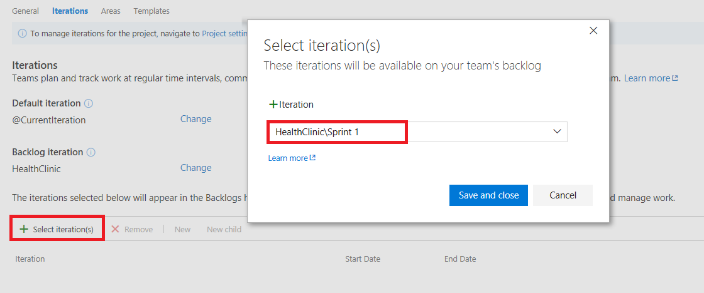

    

1. Click on **Change** for the default iteration. And set **MyHealthClinic** as the default one.

    

    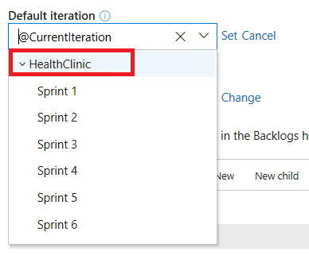

1. Repeat steps 11 and 12 for both the **Web** team as well as the **Database** team. You can switch your team focus to a team project or team you've recently viewed from the team project/team drop-down menu. If you don't see the team or team project you want, click Browse… to browse all team projects and teams.

    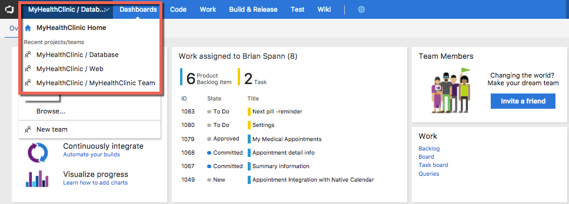

## Exercise 2: Work Items in VSTS

1. Navigate to **Web** team dashboard by selecting **MyHealthClinic\Web** from the project/team drop-down menu. This is the main screen for the Web team.

    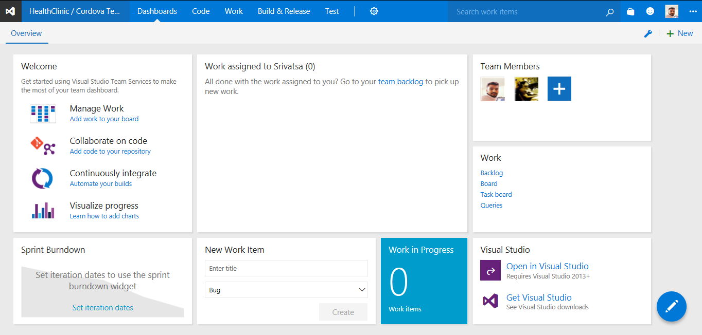

1. Let's create our **first Product Backlog** item. On the **New Work Item** widget, enter the title of **Create appointment** and change the work item type to **Product Backlog**. We can also create Bugs, Tasks, Features and several other Work item types.

    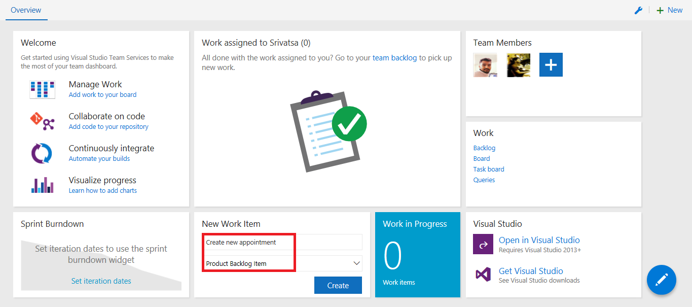

1. You can see that the product backlog would open automatically. Enter the description **As a user, I want to create appointments.** Enter the acceptance criteria as **Any user can create appointments. After creating an appointment, it should appear in the user appointment list.**

    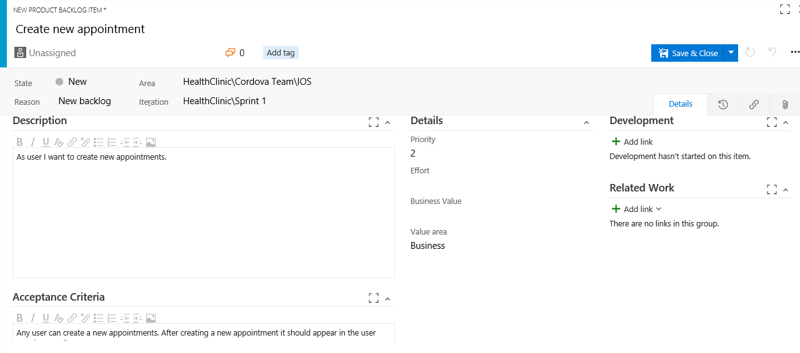

1. Click **Save & close**.

1. Navigate to the default team's backlog by selecting **MyHealthClinic Team** from the project/team drop-down menu. If you are not on the **Work** tab, then click **Work** option from the top menu.

    

1. You can create several backlog items repeating the above steps. If you used the **[VSTS Demo Data generator,](http://azuredevopsdemogenerator.azurewebsites.net/Environment/Create)** then you can see pre-defined work items in the default team's backlog list.

    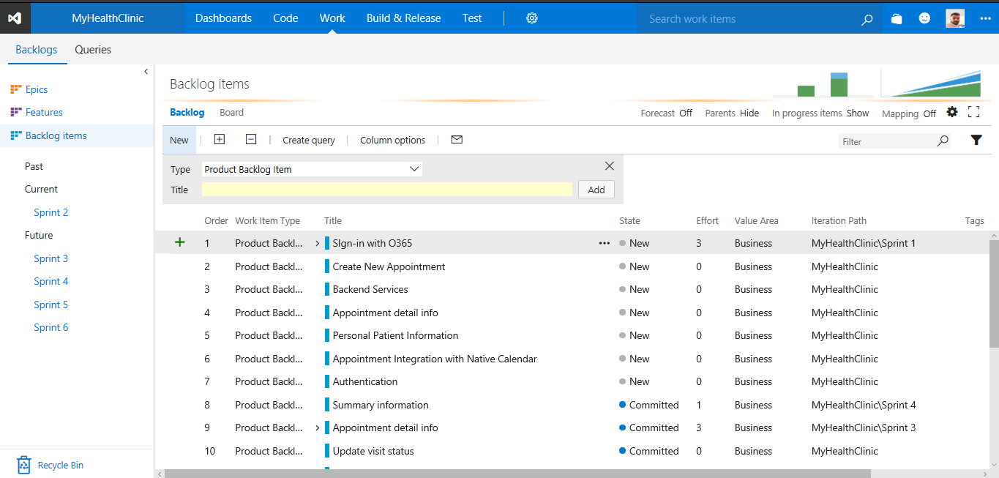

1. Select the desired product backlog items, drag and drop it to the current sprint. In this case, the current sprint happens to be **Sprint 1**.

    

## Exercise 3: Working with Kanban boards

1. To view your Kanban board, click the **Board** link from the **Work>Backlogs** page.

   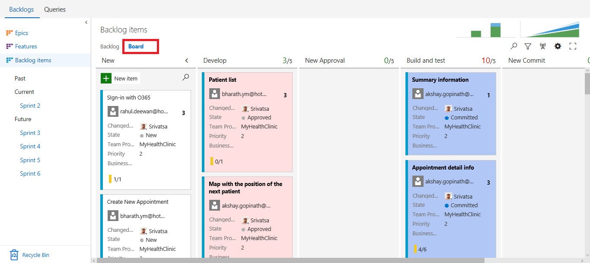

   {% include note.html content= "To maximize a team's ability to consistently deliver high quality software, Kanban emphasize two main practices. The first, visualize the flow of work, requires you to map your team's workflow stages and configure your Kanban board to match. The second, constrain the amount of work in progress, requires you to set work-in-progress (WIP) limits. You're then ready to track progress on your Kanban board and monitor key metrics to reduce lead or cycle time.

   Your Kanban board turns your backlog into an interactive signboard, providing a visual flow of work. As work progresses from idea to completion, you update the items on the board. Each column represents a work stage, and each card represents a user story (blue cards) or a bug (red cards) at that stage of work." %}

1. We are going to modify the **Kanban board** to map the flow of how our team works. Click the gear icon to open the settings dialog.

   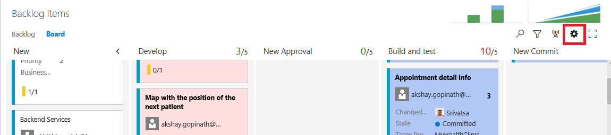

1. You can either increase or simplify the information that displays on your cards. Your best bet is to show fields on cards based on what your team frequently refers to or updates when using the **Kanban** and **Task** boards. Make sure the fields for your cards match the following image.

    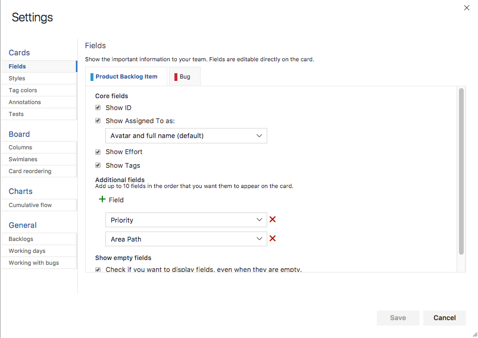

1. To cause a card on the **Kanban** board to change color based on criteria you specify, open **Styles**. Add a styling rule and set the criteria for the rule. Create the **High Effort** styling as follows.

    

1. Prior to setting tag colors, first add tags to backlog items that you want to highlight with color. To add color to **Kanban** cards, open **Tag colors** and select a tag and the color you want it to display. If you used the **[VSTS Demo Data generator](http://azuredevopsdemogenerator.azurewebsites.net/Environment/Create)** then you will already have a **Doctor** tag and set to green.

    

1. With the Kanban board, you gain a rich set of tools and a rich set of customization options. **Annotations** provide visual cues about work items, indicating the number of tasks or tests that have been defined for that work item. Click an annotation to expand the set or gain more information.

    

1. You can control the test plan under which inline tests you add through the Kanban board are created. You can choose to create a new test plan for each new test that you add, or add all new tests to a selected test plan going forward.

    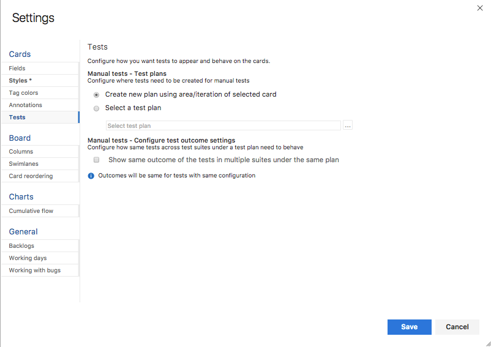

   Kanban's number one practice is to visualize the flow of work. Accordingly, your number one task is to visualize your team's workflow. You do this by identifying the types of work and handoffs that occur regularly as your team moves items off the backlog and into a shippable state.

   After you identify your team's workflow stages, you're ready to configure your Kanban board to map to them. Once configured, you use your Kanban board to update status, reassign work, and reorder items to reflect changing priorities.

   Our team came up with these stages as essential to thier process:

   - **Backlog**: Prioritized list of items which aren't yet ready to work on.
   - **Analyze**: Well understood and shared acceptance criteria identified, and overall work required to develop and test item.
   - **Develop**: Code and run unit tests for the item.
   - **Test**: Perform exploratory, automated, integration, and other tests.
   - **Done**: Item ready to handoff to production.

1. Rename the **New** column to **Backlog**. Click the **+ Column** to create a new column. Name the new column **Analyze** and set the state mapping to **Approved** for both **Bug** and **Product Backlog Item**. Rename the **Build and test** to **Test**.

    

1. The WIP limit is already set for **Test** column. You can also set for other columns as well. To do so, from the settings page go to columns tab. Click the **Develop** column. Set the WIP Limit to **3**.

    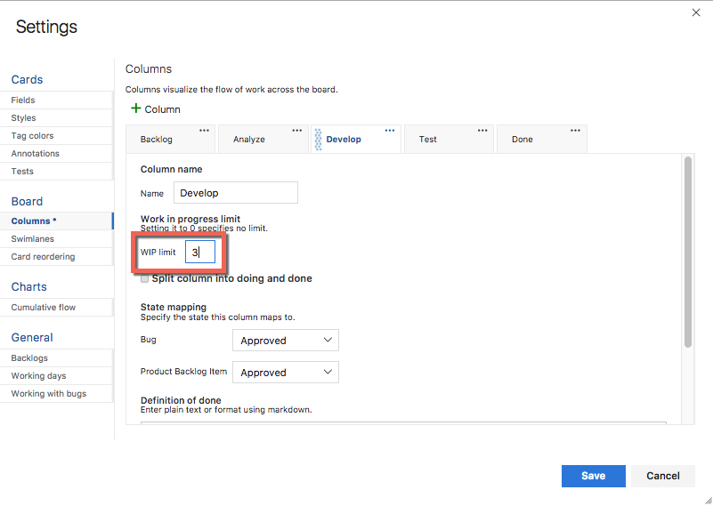

    However, a lag often exists between when work gets moved into a column and when work starts. To counter that lag and reveal the actual state of work in progress, you can turn on split columns.

    When split, each column contains two sub-columns, **Doing** and **Done**.

    Split columns let your team to implement a pull model. Without split columns, teams push work forward, to signal that they've completed their stage of work. However, pushing it to the next stage doesn't necessarily mean that a team member immediately starts work on that item.

1. Now that you understand how your team can use split columns, here's how to turn them on. Select the **Develop** column and click the **Split column into doing and done** checkbox. Do the same thing for the **Test** column.

    

1. As your team updates the status of work as it progresses from one stage to the next, it helps that they agree on what “done” means. By specifying the **Definition of Done** criteria for each Kanban column, you help share the essential tasks to complete before moving an item into a downstream stage. For the **Develop** column, add the following definition:

    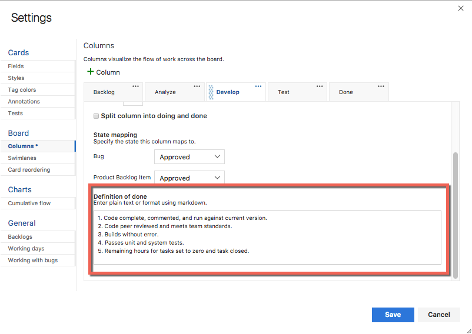

    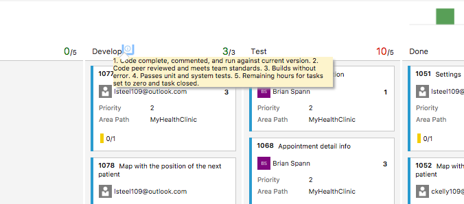

    Your Kanban board supports your ability to visualize the flow of work as it moves from new to done. When you add swimlanes, you can also visualize the status of work that supports different service-level classes. You can create a swimlane to represent any other dimension that supports your tracking needs.

    

1. From your Kanban board, click **Configure board settings** then click Swimlanes. Use the add Swimlane to add **Expedite** swimlane.

    

1. Now rename the default swimlane to **Standard**. Add one more swimlane named **Park**. You can drag the swimlanes to organize them in the order you wish. Drag **Park** below Standard.

    

## Exercise 4: Sprint Planning and Task Board

Your team builds the sprint backlog during the sprint planning meeting, typically held on the first day of the sprint. Each sprint corresponds to a time-boxed interval which supports your team's ability to work using Agile processes and tools. During the planning meeting, your product owner works with your team to identify those stories or backlog items to complete in the sprint.

Planning meetings typically consist of two parts. In the first part, the team and product owner identify the backlog items that the team feels it can commit to completing in the sprint, based on experience with previous sprints. These items get added to the sprint backlog. In the second part, your team determines how it will develop and test each item. They then define and estimate the tasks required to complete each item. Finally, your team commits to implementing some or all the items based on these estimates.

### Sprint Planning

Your sprint backlog should contain all the information your team needs to successfully plan and complete work within the time allotted without having to rush at the end. Before you start planning your sprint, you'll want to have created, prioritized, and estimated your backlog and defined your sprints.

1. You begin your planning efforts from your product backlog. Move items that you expect to work on into the current sprint, one item at a time. Simply drag each item from the product backlog onto the sprint.

   

   

1. Next, check the total level of effort of your sprint items.

   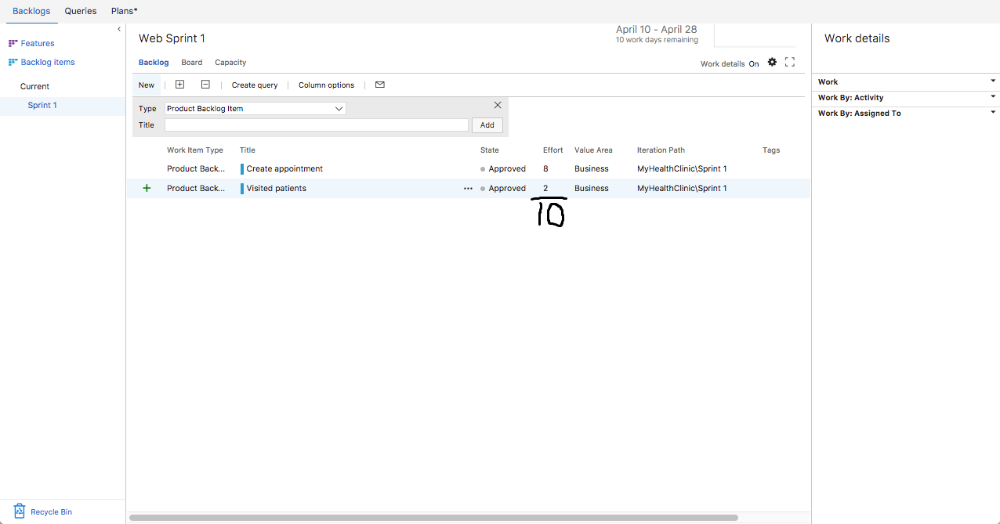

   

1. As a next step, you'll want to determine your team's actual capacity. Whereas velocity correlates to how your team estimates requirements, capacity correlates to actual task time - either hours or days. Capacity takes into account variation in work hours by team members as well as holidays, vacation days, and non-working days.

   Because days off and time available for each team member can vary from sprint to sprint, you set capacity for each sprint. The capacity tool helps you make sure your team isn't over or under committed for the sprint. Also, as you work day-to-day, you'll be able to see if your team is on track.

   From the Capacity page, enter the capacity and days off for each member of your team.

   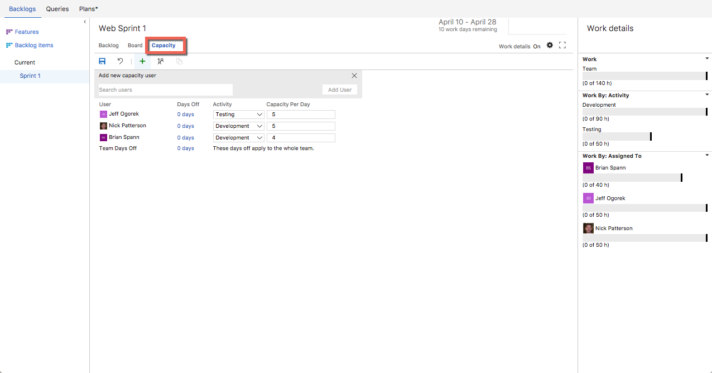

   {% include note.html content= "Most teams specify capacity in terms of hours, however, you can also specify it in days. For example, .5 days would correspond to 4 hours for a typical 8-hour day. Choose the same unit you will use to estimate the time a task will take to complete.

   If you don't see a team member listed, you need to add them to the team. Also, you only have to indicate planned days off. You manage weekend days or other recurring days off under team settings.

   Additional options available from the Capacity page include copying capacity from the previous iteration, adding team members, adding multiple activities." %}

1. Click on the column **Days Off** on any user. Introduce start and end date in an interval inside the dates for the Sprint so he has more work than hours available.

   

   

1. In the sprint backlog, add a task. Creating tasks from the sprint backlog automatically links the task to it parent backlog item.

   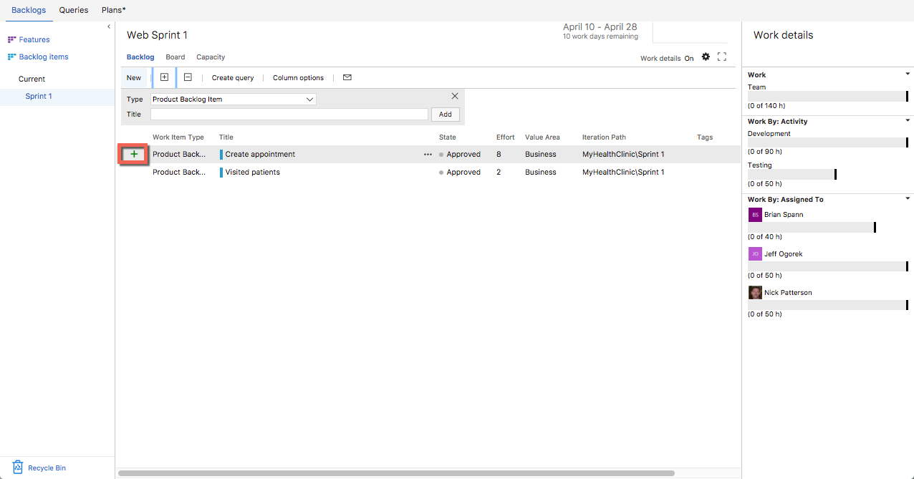

1. Name the task and enter an estimate for Remaining Work. Also, if you know who'll perform the work, go ahead and assign the task to that team member.

   

   {% include note.html content= "At the planning stage, Remaining Work corresponds to an estimate of how long it will take to complete the task.

   A good rule of thumb is to size tasks to take no more than a day to complete. If a task is too large, the team should break it down. In some cases, you may not be able to estimate some tasks effectively until other tasks have been completed. Create the task now, but estimate it when you have enough information.

   During the sprint, team members update remaining work to continually reflect the time required to complete the task. This value can increase after work begins. For example, after working 4 hours on a task that was estimated to take 8 hours, the team member realizes he needs 16 hours over what he estimated. He would update the Remaining Work field with 20 (8-4+16). As you perform a task, you might find that more time is required. Always update the task with your best estimate of remaining work. That way, you help accurately reflect the total amount of work remaining in the sprint." %}

1. As you define tasks and estimate the work, you'll see capacity charts start to fill in for each team member. Capacity bars track the remaining work against the capacity for each team member as well as the entire team.

   You'll also see a roll-up of the remaining work required to complete each requirement or bug.

   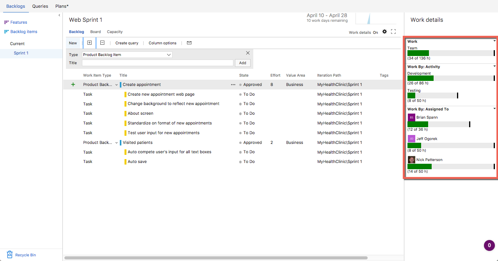

1. Click on the upper right corner where the sprint burndown is shown. Throughout your sprint, you can monitor the sprint burndown chart to determine if your team is on track to complete its sprint plan.

   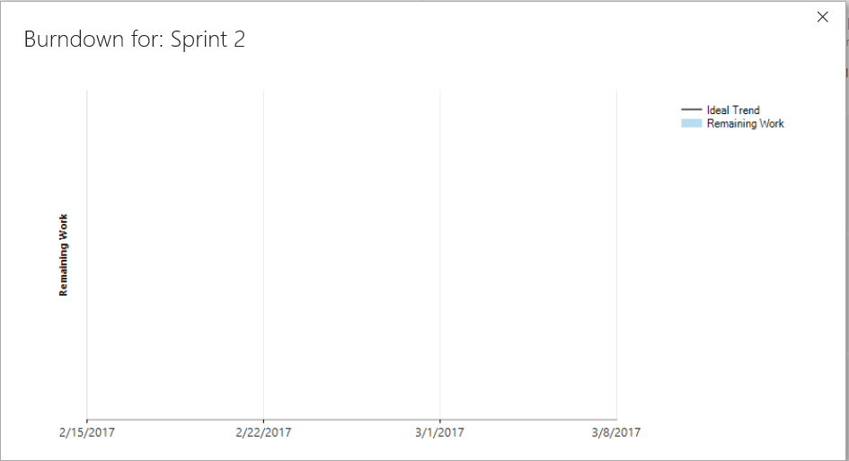

### Task Board

1. Once you have your sprint plan in place, you'll execute that plan for the duration of the sprint. In your daily Scrum meetings, your team can view progress made to backlog items and tasks from the sprint task board.

   

   During your daily Scrum, you can filter your task board to help focus on items of interest.

   - Group by Backlog items or Group by stories to monitor progress of your product backlog items, stories, requirements, or bugs.

     

   - Group by People when you want to monitor progress of individual team members.

     

   - Use the Person filter when you want to focus on work assigned to individual team members.

1. Click on **gear icon** for the settings. Select the **Task** tab.

   

   

1. You can see the Avatar and other information on the cards.

   

1. The task board makes quick work of updating both task status and remaining work. Simply drag tasks to a downstream column to reflect if they are in progress or completed.

   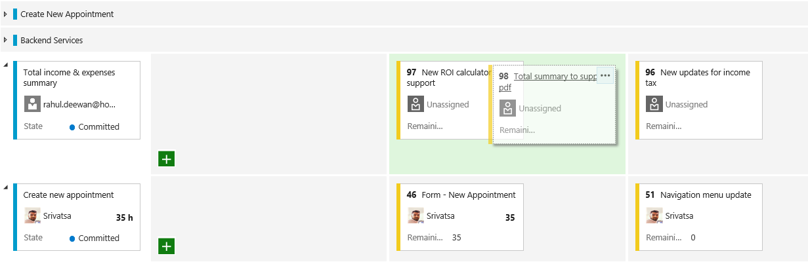

1. Updating Remaining Work, preferably prior to the daily Scrum meeting, helps the team stay informed of the progress being made. It also ensures a smoother burndown chart.

   Each team member can review the tasks they've worked on and estimate the work remaining. If they've discovered that it's taking longer than expected to complete, they should increase the remaining work for the task. Remaining work should always reflect exactly how much work the team member estimates is remaining to complete the task.

   

1. At the end of the sprint, you'll want to perform these final tasks:

   - Zero out remaining work of all completed tasks
   - Update the status of all completed backlog items
   - Move incomplete tasks or backlog items to the next sprint or back to the product backlog.

Dragging an incomplete item to the product backlog or to a future sprint updates the Iteration Path of all uncompleted child tasks to correspond to the product backlog iteration path or future sprint.

## Exercise 5: Portfolio Management

Portfolio backlogs provide product owners insight into the work performed by several agile feature teams. Product owners can define the high-level goals as Epics or Features, and feature teams can break these down into the user stories they'll prioritize and develop.



1. Click on **Features**. You will see list of feature work items available already. If you wish to add few more you can add.

   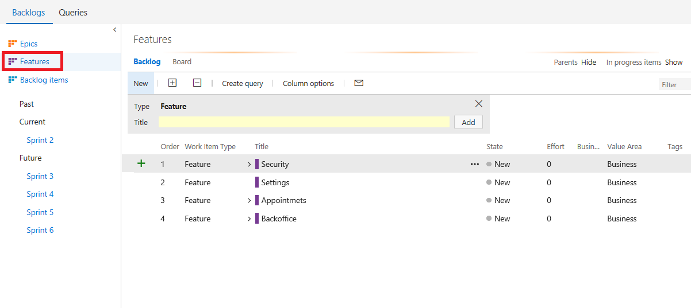

1. If you've already created your backlog, and now you want to organize it, you can do that most easily by mapping them. Go back to **Backlog items**. Click on **Mapping** to enable as shown.

   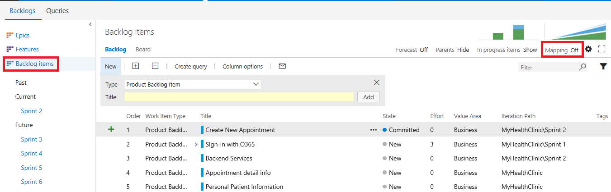

   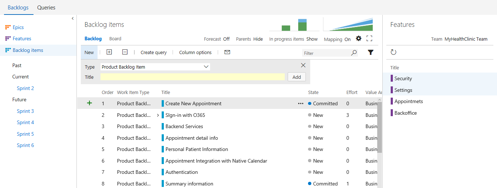

1. With the mapping panel enabled, drag items that are currently unparented to the feature under which they belong. Also, you can drag a backlog item to a different feature to change its parent.

   

1. To have a full view of the work escalation and decomposition to tasks Click on **Features**. Expand all the levels by clicking twice on the + icon.
   Review the full structure from Feature to tasks.

   

   

1. Go to the **Board**. As we have a Kanban board for checking the states of the Product Backlog Items, we also have a Kanban Board to see the transition and check visually the current state of any particular feature. This is also customizable as we saw in our Sprint Backlog view, and the Product Backlog view.

   

1. Click on the first card where the blue badge with the Product Backlog Items. You Check any User Story to mark it as completed.

   

1. You can also Drag and Drop any Feature to other state and check how it changes its current state.

   

## Exercise 6: Working with VSTS Dashboards

Dashboards allow teams to visualize status and monitor progress across the project. At a glance, you can make informed decisions without having to drill down into other parts of your team project site.
The Overview page provides access to a default team dashboard which you can customize by adding, removing, or rearranging the tiles.
Each tile corresponds to a widget that provides access to one or more features or functions.

1. Go to the default **Dashboard** called Overview.

   

   

1. You can also add dashboards. From the dashboards tab, click the plus icon and enter a dashboard name.

   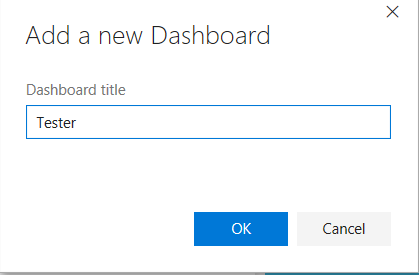

   With the dashboard selected, you can add a widget to the dashboard. Or, you can add a chart to a team dashboard from the Work, Build, or Test hubs.

   

   When finished, click the **Close** button. Then click the checkmark to take the dashboard out of edit mode.

1. Click on **edit** button to modify the dashboard and add your widgets like **Build Summary, Release Summary, Markdowns** etc.

    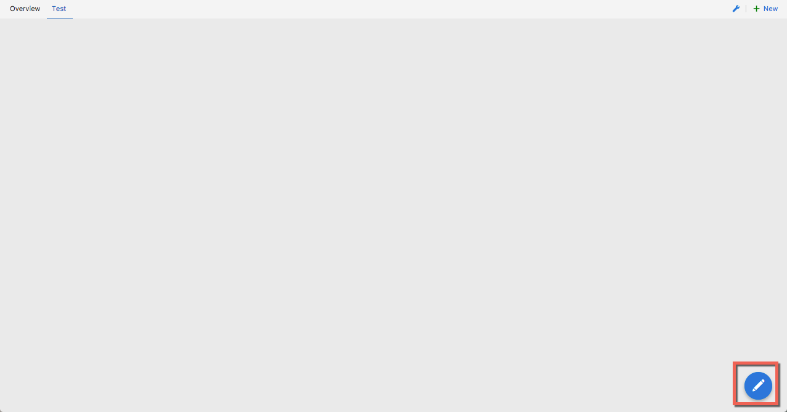

1. Add the **Query Tile** to the Test dashboard.

    

1. After you add the widget, you may need to configure it. For example, to configure the **Query tile** widget, click the Configure widget icon to open the configuration dialog.

    

1. Then select the query and specify any rules you want.

    

    

    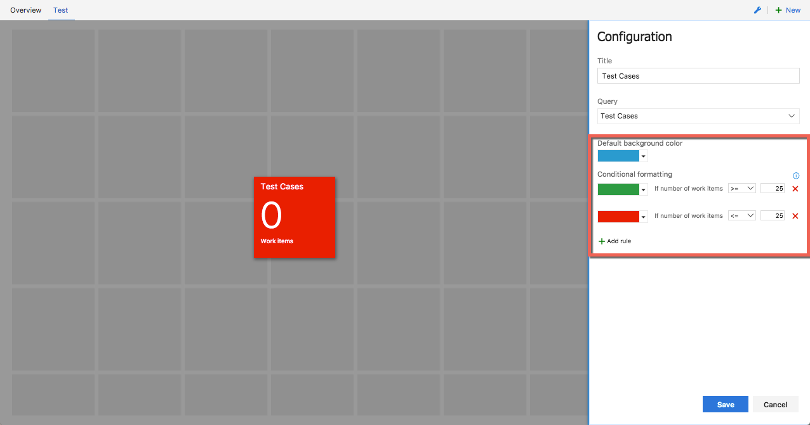

1. In addition to widgets, you can add a chart to your dashboard. You add an item to a dashboard from the code, work, and build pages. First, make sure you have the team context selected from the Queries page to which you want to add a query or chart. Go to the **Work** tab and click **Queries** on the top left.

    

1. Select the query that you want to create the chart from and click the **Charts** option.

    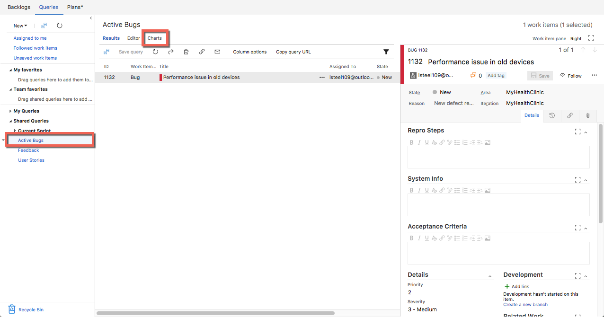

1. Next, click the **New chart** option to bring up the configuration of the chart.

    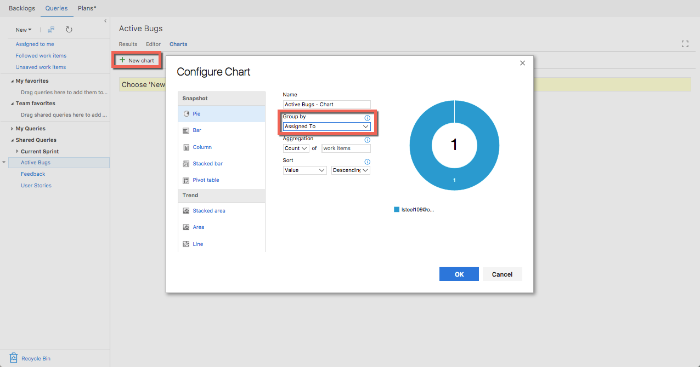

1. And, you can add a chart to a team dashboard by clicking on the ellipsis and choosing **Add to dashboard** > select the dashboard you want to add the chart to in the context menu.

    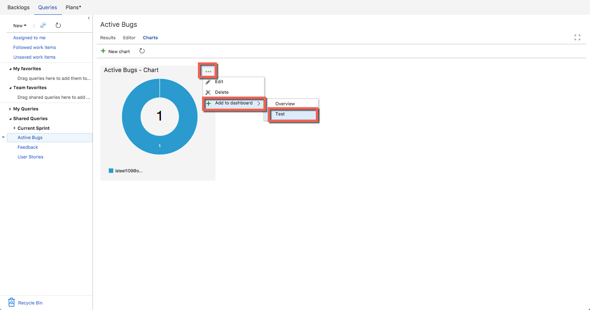

    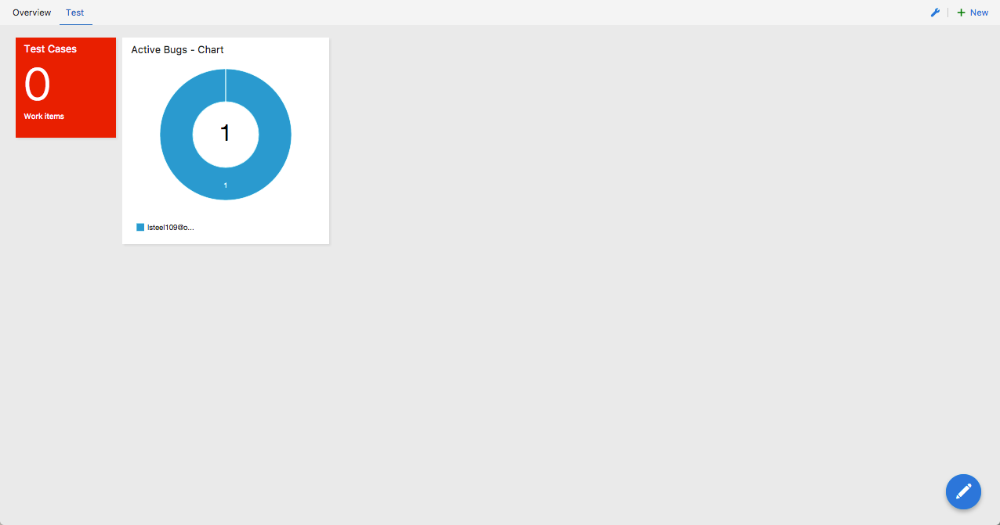

1. You can move or delete a widget from the dashboard by clicking **Edit** dashboard icon to modify your dashboard. You can then drag tiles to reorder their sequence on the dashboard. To remove a widget, click the widget's **Trash** icon or **Delete** icon. When you're finished with your changes, click **Exit edit-dashboard-mode** icon to exit dashboard editing.

    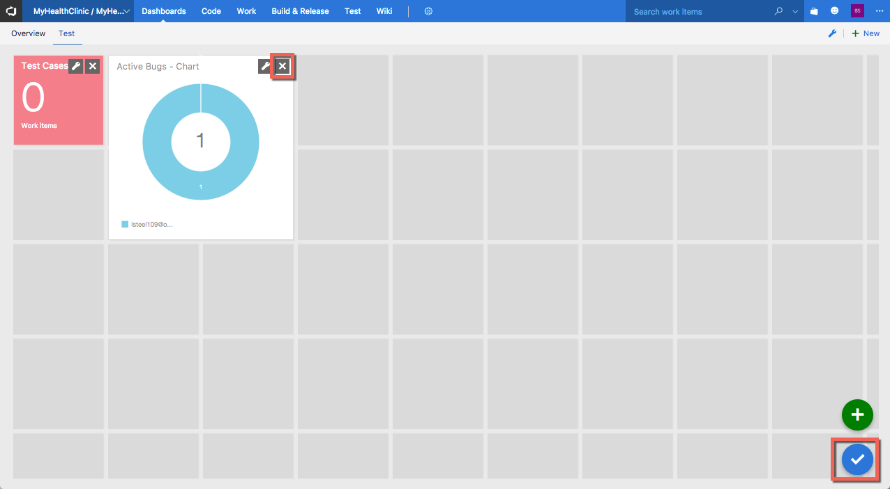

1. You can rename, reorder, or delete a dashboard. Also, you can enable auto-refresh, and the dashboard will automatically update every 5 minutes.

    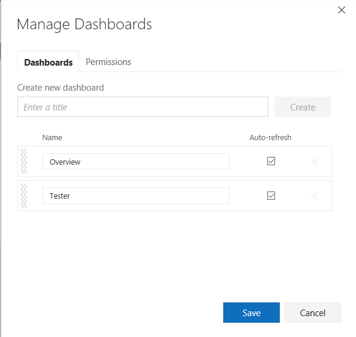

    

## Exercise 7: Process Customization

In Team Services, you customize your work tracking experience through a process. A process defines the building blocks of the work item tracking system as well as other sub-systems you access through Team Services. Whenever you create a team project, you select the process which contains the building blocks you want for your project.

### Manage processes

Team Services supports two process types. The first, the core system processes—Scrum, Agile, and CMMI system processes—are locked. You cannot customize these processes. The second type, inherited processes, you create from a core system process. These processes you can customize.

In addition, all processes are shared. That is, one or more team projects can reference a single process. Instead of customizing a single team project, you customize a process. Changes made to the process automatically update all team projects that reference that process.

Once you've created an inherited process, you can customize it, create team projects based on it, and migrate existing team projects to reference it. The Git team project can't be customized until its migrated to an inherited process.

1. To open the admin context from the user context, click the gear Settings icon and choose **Account settings**.

   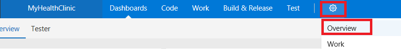

1. Click **Process**.

   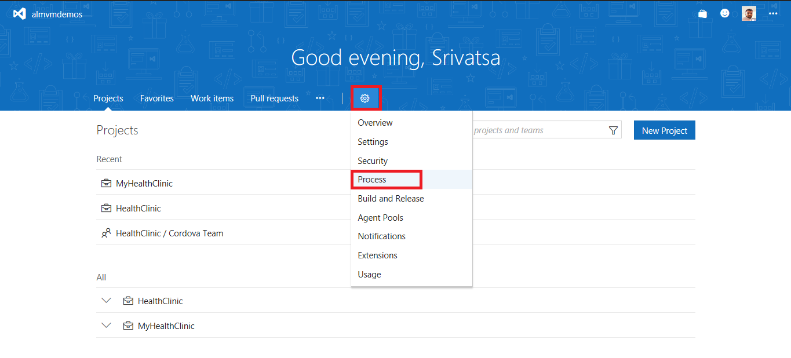

1. You can create an inherited process from any one of the three system processes: Agile, Scrum, or CMMI. From the **Process** page, open the context menu of the process you'll use to create an inherited process. Here, we create an inherited process from the **Scrum** system process. Then click on **Create inherited process**.

   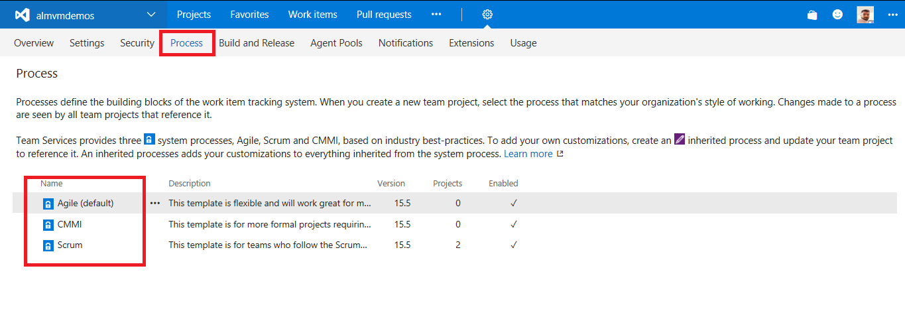

1. Enter a name for your process and optionally a description. Something like **MyHealthClinic Scrum template**.

   

1. You should see the successful message after creating the inherited template.

   

### Customize a field for a process

Each process—Agile, Scrum, or CMMI—contains 100 or more work item fields. You can add a custom field to support tracking additional data requirements or modify select attributes of an inherited field.

1. Select the inherited template that was created.

   

1. Navigate to **Work Item Types** tab. Now we have different options to modify this scrum template.

   

1. We will directly add a new field for the PBI Work Item template. Select **Product Backlog item** \| **Layout** \| **New field**. On the definition screen provide a name **HealthClinicTicketId**.

   

   

1. Click on **Layout**. Provide a name for Label as **Ticket ID**. Until now we have only created the field definition, we must add it to the layout of the Work Item. We will create a new group to show our custom information, so all of our customized fields appear together. Provide a name for the group as **MyHealthClinic** and click **Add field**.

   

### Change the process referenced by a team project

You can change the process a team project references to an inherited process or a system core process. However, you can only change team projects to another process that is derivative of the same core system process. That is, you can change an Agile-based team project to any process you created from the Agile system process as well as to the Agile core process. Whereas, you can't change a Scrum-based team project to an Agile-derived inherited process.

1. At this moment, we have only created the template. We must assign this template to our VSTS Project so that we can use this new field. We can change the process template from a VSTS Project, with their inherited templates or default templates. This is done in the main process screen. Go back to **Process** tab, click on ellipsis button on our new template and select **Change Team Projects to use MyHealthClinic Scrum template**.

    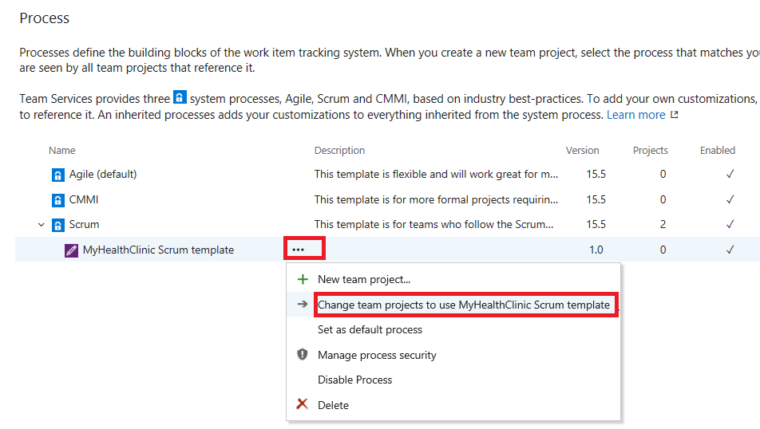

1. Select the **MyHealthClinic** project to change the process and click **>** button.

    

1. Click **Ok** button. You should see a successful message after changing the process.

    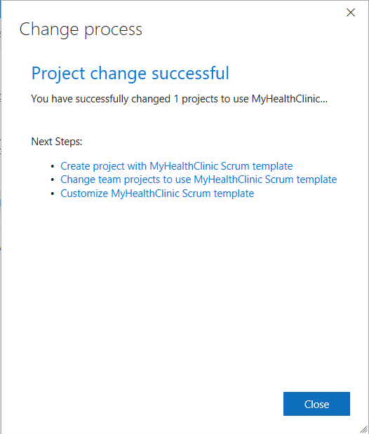

1. Let’s review how the new field appears on our Product Backlog Item Template. Go back to **Work** \| **Backlogs**. Open the first product backlog. Look after **Acceptance Criteria** for the **MyHeathClinic** group. Fill in the information for the **Ticket ID** like **HK89JY13**. Click **Save & close**.

    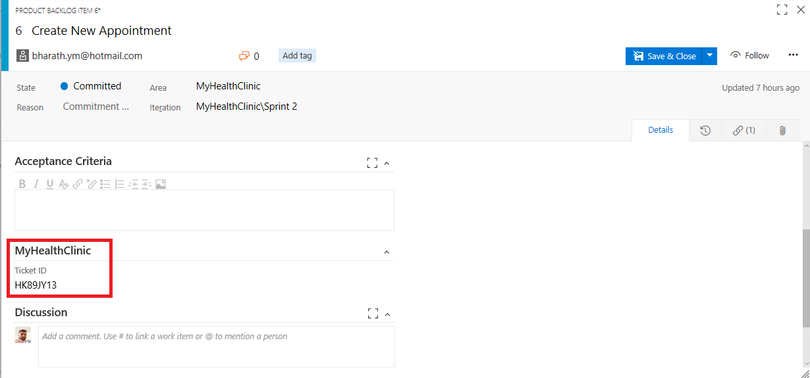

   Once the Work Item is saved, VSTS will also save the new custom information we have added to the PBI and will be available for queries and the rest of the VSTS system.