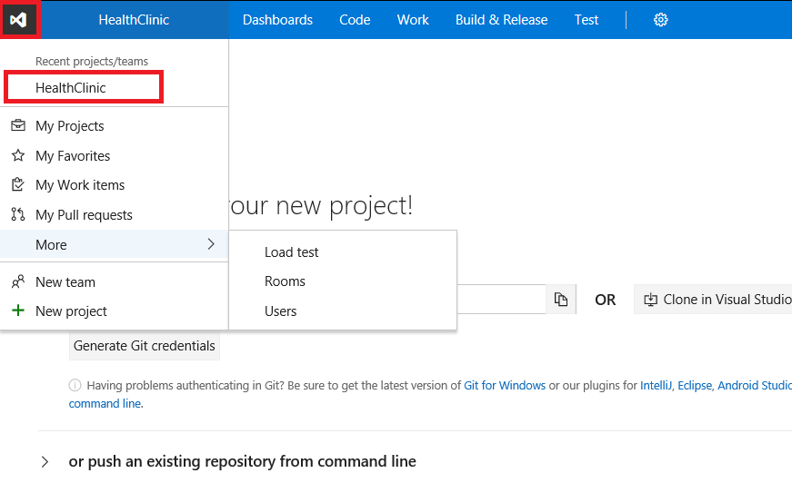
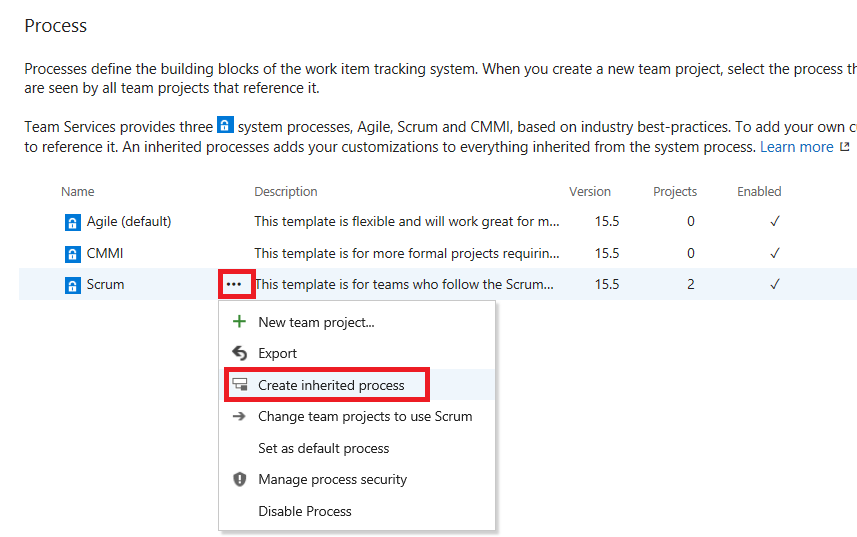

## Overview     

In this lab, you will learn about the agile planning and portfolio management tools and processes provided by Visual Studio Team Services and how they can help you quickly plan, manage, and track work across your entire team. You will explore the product backlog, sprint backlog, and task boards which can be used to track the flow of work during an iteration. We will also look at how the tools have been enhanced in this release to scale for larger teams and organizations.

## Pre-requisites

To complete this lab, you will need: 

- **Visual Studio Team Services account**. If you don't have one, you can create from <a href="https://www.visualstudio.com/">here</a>

- **Visual Studio 2017** or higher version

- You can use the **[VSTS Demo Data generator](http://vstsdemogenerator.azurewebsites.net/Environment/Create)** to provision a project with pre-defined data on to your Visual Studio Team Services account. Please use the ***My Health Clinic*** template to follow the hands-on-labs.

## Connecting to your Project

1.	Go to your VSTS account home page.

2.	Click on the VS icon and brwse to the MyHealthClinic project. At this moment, we have only one project. You could select/create as many projects from here.

    > If you haven't already, browse to your Visual Studio Team Services account you can sign in by going to (https://{youraccount}.visualstudio.com).

    

    
## Exercise 1: Working with Teams, Areas, and Iterations

1.  Connect to the **MyHealthClinic** project.

2.  Navigate to the **Administration Overview** page by choosing the gear icon.

    

3.  Check the existing teams, there are three teams by name **MyHealthClinic Team, Team1, and Team2**.
    The default team has the same name as your VSTS project. You can create new teams if needed from here.

    

4.  Delete both **Team 1** and **Team 2** by clicking the ellipsis next to each team and selecting **Delete**.

    

5.  Now create a new team by clicking the **New team** link and giving it a name of **Web**. Make sure the **Team area** has a check mark. This option will create a corresponding area for the team so they can group all their work items and keep them seperate from other teams. If you do not select this option, you will have to set the default area path for the team once you create it. Follow the same steps to create a team called **Database**.

    
    

6.  While on the **Overview** screen, click on the default team to view the members.   We see our user as the only current member.

    
    

7.  Click **Add** button to add new members to the team.

    

8.  Because we are currently in the sub-area for the **Web** team.  We need to navigate back up to the default team, so we can setup management of sub-area paths.  

    

9.  Select the **Work** tab at the top then select **Areas** option to view the area path for the team.

    

10. Now we want to change the area path setting for management areas to include sub-area paths.  The default setting for all teams is to exclude sub-area paths. We will change it to include sub-areas so that the team gets visisbility into all of the work items from all teams. Optionally, the management team could also choose to not include sub-areas. Thereby removing work items from their view as soon as they are assigned to one of the teams. Click on the ellipsis for **MyHealthClinic** and select **Include sub-areas**.

    

11. Go to **Iterations** and click **Select Iteration**. Select **Sprint 1**. Repeat this step to add **Sprint 2**.

    
    
    >You may need to adjust the dates for the sprints you have selected. Pick dates that correspond to the current calendar dates to make more relevant.

12. Click on **Change** for the default iteration. And set **MyHealthClinic** as the default one.

    

    

13. Repeat steps 11 and 12 for both the **Web** team as well as the **Database** team. You can switch your team focus to a team project or team you've recently viewed from the team project/team drop-down menu. If you don't see the team or team project you want, click Browse… to browse all team projects and teams.

    

## Exercise 2: Work Items in VSTS

1.  Navigate to **Web** team dashboard by selecting **MyHealthClinic\Web** from the project/team drop-down menu. This is the main screen for the Web team.

    

2.  Let's create our **first Product Backlog** item. On the **New Work Item** widget, enter the title of **Create appointment** and change the work item type to **Product Backlog**. We can also create Bugs, Tasks, Features and several other Work item types.

    

3.  You can see that the product backlog would open automatically. Enter the description **As a user, I want to create appointments.**
    Enter the acceptance criteria as **Any user can create appointments. After creating an appointment, it should appear in the user appointment list.**
   
    

4.  Click **Save & close**.

5. Navigate to the default team's backlog by selecting **MyHealthClinic Team** from the project/team drop-down menu. If you are not on the **Work** tab, then click **Work** option from the top menu.

    

6.  You can create several backlog items repeating the above steps. If you used the **[VSTS Demo Data generator](http://vstsdemogenerator.azurewebsites.net/Environment/Create)** then you can see pre-defined work items in the default team's backlog list.
    
    

7. Select the desired product backlog items, drag and drop it to the current sprint. In this case the current sprint happens to be **Sprint 1**.

    

## Exercise 3: Working with Kanban boards 

1. To view your Kanban board, click the **Board** link from the **Work>Backlogs** page.

   

   >To maximize a team's ability to consistently deliver high quality software, Kanban emphasize two main practices. The first, visualize the flow of work, requires you to map your team's workflow stages and configure your Kanban board to match. The second, constrain the amount of work in progress, requires you to set work-in-progress (WIP) limits. You're then ready to track progress on your Kanban board and monitor key metrics to reduce lead or cycle time.

   >Your Kanban board turns your backlog into an interactive signboard, providing a visual flow of work. As work progresses from idea to completion, you update the items on the board. Each column represents a work stage, and each card represents a user story (blue cards) or a bug (red cards) at that stage of work.

2. We are going to modify the **Kanban board** to map the flow of how our team works. Click the gear icon to open the settings dialog.

   

3. You can either increase or simplify the information that displays on your cards. Your best bet is to show fields on cards based on what your team frequently refers to or updates when using the **Kanban** and **Task** boards. Make sure the fields for your cards match the following image.

    

4. To cause a card on the **Kanban** board to change color based on criteria you specify, open **Styles**. Add a styling rule and set the criteria for the rule. Create the **High Effort** styling as follows.

    

5. Prior to setting tag colors, first add tags to backlog items that you want to highlight with color. To add color to **Kanban** cards, open **Tag colors** and select a tag and the color you want it to display. If you used the **[VSTS Demo Data generator](http://vstsdemogenerator.azurewebsites.net/Environment/Create)** then you will already have a **Doctor** tag and set to green.

    

6. With the Kanban board, you gain a rich set of tools and a rich set of customization options. **Annotations** provide visual cues about work items, indicating the number of tasks or tests that have been defined for that work item. Click an annotation to expand the set or gain more information.

    

7. You can control the test plan under which inline tests you add through the Kanban board are created. You can choose to create a new test plan for each new test that you add, or add all new tests to a selected test plan going forward.

    

   Kanban's number one practice is to visualize the flow of work. Accordingly, your number one task is to visualize your team's workflow. You do this by identifying the types of work and handoffs that occur regularly as your team moves items off the backlog and into a shippable state.

   After you identify your team's workflow stages, you're ready to configure your Kanban board to map to them. Once configured, you use your Kanban board to update status, reassign work, and reorder items to reflect changing priorities.

   Our team came up with these stages as essential to thier process:

   >**Backlog**: Prioritized list of items which aren't yet ready to work on.    
   >**Analyze**: Well understood and shared acceptance criteria identified and overall work required to develop and test item.    
   >**Develop**: Code and run unit tests for the item.    
   >**Test**: Perform exploratory, automated, integration, and other tests.    
   >**Done**: Item ready to handoff to production.

8. Rename the **New** column to **Backlog**. Click the **+ Column** to create a new column. Name the new column **Analyze** and set the state mapping to **Approved** for both **Bug** and **Product Backlog Item**. Rename the **Build and test** to **Test**.

    

9. The WIP limit is already set for **Test** column. You can also set for other columns as well. To do so, from the settings page go to columns tab. Click the **Develop** column. Set the WIP Limit to **3**.

    

    However, a lag often exists between when work gets moved into a column and when work actually starts. To counter that lag and reveal the actual state of work in progress, you can turn on split columns.

    When split, each column contains two sub-columns, **Doing** and **Done**.

    Split columns lets your team to implement a pull model. Without split columns, teams push work forward, to signal that they've completed their stage of work. However, pushing it to the next stage doesn't necessarily mean that a team member immediately starts work on that item.

10. Now that you understand how your team can use split columns, here's how to turn them on. Select the **Develop** column and click the **Split column into doing and done** checkbox. Do the same thing for the **Test** column.

    

11. As your team updates the status of work as it progresses from one stage to the next, it helps that they agree on what “done” means. By specifying the **Definition of Done** criteria for each Kanban column, you help share the essential tasks to complete before moving an item into a downstream stage. For the **Develop** column, add the following definition:
    
    

    

    Your Kanban board supports your ability to visualize the flow of work as it moves from new to done. When you add swimlanes, you can also visualize the status of work that supports different service-level classes. You can create a swimlane to represent any other dimension that supports your tracking needs.

    > For example, you can create three swimlanes-**Expedite**, **Standard**, and **Park**-to track high-priority work, standard work, and work that's currently blocked.

12. From your Kanban board, click **Configure board settings** then click Swimlanes. Use the add Swimlane to add **Expedite** swimlane.

    

13. Now rename the default swimlane to **Standard**. Add one more swimlane named **Park**. You can drag the swimlanes to organize them in the order you wish. Drag **Park** below Standard.

    

## Exercise 4: Sprint Planning and Task Board

Your team builds the sprint backlog during the sprint planning meeting, typically held on the first day of the sprint. Each sprint corresponds to a time-boxed interval which supports your team's ability to work using Agile processes and tools. During the planning meeting, your product owner works with your team to identify those stories or backlog items to complete in the sprint.

Planning meetings typically consist of two parts. In the first part, the team and product owner identify the backlog items that the team feels it can commit to completing in the sprint, based on experience with previous sprints. These items get added to the sprint backlog. In the second part, your team determines how it will develop and test each item. They then define and estimate the tasks required to complete each item. Finally, your team commits to implementing some or all of the items based on these estimates.

### Sprint Planning

Your sprint backlog should contain all the information your team needs to successfully plan and complete work within the time allotted without having to rush at the end. Before you start planning your sprint, you'll want to have created, prioritized, and estimated your backlog and defined your sprints.

1. You begin your planning efforts from your product backlog. Move items that you expect to work on into the current sprint, one item at a time. Simply drag each item from the product backlog onto the sprint.

   

   >If you don't see any links listed under Current or Future, you need to configure your team's sprint schedule.

2. Next, check the total level of effort of your sprint items.
   

   >Your initial plan should identify the subset of requirements that's within your team's capacity based on estimated effort and team velocity. Velocity corresponds to the total Effort or Story Points a team can complete within the sprint time period.

3. As a next step, you'll want to determine your team's actual capacity. Whereas velocity correlates to how your team estimates requirements, capacity correlates to actual task time - either hours or days. Capacity takes into account variation in work hours by team members as well as holidays, vacation days, and non-working days.

   Because days off and time available for each team member can vary from sprint to sprint, you set capacity for each sprint. The capacity tool helps you make sure your team isn't over or under committed for the sprint. Also, as you work day-to-day, you'll be able to see if your team is on track.

   From the Capacity page, enter the capacity and days off for each member of your team.

   

   >Most teams specify capacity in terms of hours, however, you can also specify it in days. For example, .5 days would correspond to 4 hours for a typical 8 hour day. Choose the same unit you will use to estimate the time a task will take to complete.

   >If you don't see a team member listed, you need to add them to the team. Also, you only have to indicate planned days off. You manage weekend days or other recurring days off under team settings.
   
   >Additional options available from the Capacity page include copying capacity from the previous iteration, adding team members, adding multiple activities.

4. Click on the column **Days Off** on any user. Introduce start and end date in an interval inside the dates for the Sprint so he has more work than hours available.

   

   >When you add days off to a Team Member the **Work Details** planning graph will adapt itself and show red if there is more work assigned to any team member than the work hours we have available for the sprint.

5. In the sprint backlog, add a task. Creating tasks from the sprint backlog automatically links the task to it parent backlog item.

   

6. Name the task and enter an estimate for Remaining Work. Also, if you know who'll perform the work, go ahead and assign the task to that team member.

   

   >At the planning stage, Remaining Work corresponds to an estimate of how long it will take to complete the task.

   >A good rule of thumb is to size tasks to take no more than a day to complete. If a task is too large, the team should break it down. In some cases, you may not be able to estimate some tasks effectively until other tasks have been completed. Create the task now, but estimate it when you have enough information.

   >During the sprint, team members update remaining work to continually reflect the time required to complete the task. This value can actually increase after work begins. For example, after working 4 hours on a task that was estimated to take 8 hours, the team member realizes he needs 16 hours over what he estimated. He would update the Remaining Work field with 20 (8-4+16). As you perform a task, you might find that more time is required. Always update the task with your best estimate of remaining work. That way, you help accurately reflect the total amount of work remaining in the sprint.

7. As you define tasks and estimate the work, you'll see capacity charts start to fill in for each team member. Capacity bars track the remaining work against the capacity for each team member as well as the entire team.

   You'll also see a roll-up of the remaining work required to complete each requirement or bug.

   

8. Click on the upper right corner where the sprint burndown is shown. Throughout your sprint, you can monitor the sprint burndown chart to determine if your team is on track to complete its sprint plan.

   

### Task Board

1. Once you have your sprint plan in place, you'll execute that plan for the duration of the sprint. In your daily Scrum meetings, your team can view progress made to backlog items and tasks from the sprint task board.

   

   During your daily Scrum, you can filter your task board to help focus on items of interest.

   * Group by Backlog items or Group by stories to monitor progress of your product backlog items, stories, requirements, or bugs.
   
   * Group by People when you want to monitor progress of individual team members.
   
   Use the Person filter when you want to focus on work assigned to individual team members.

2. Click on **gear icon** for the settings. Select the **Task** tab.

   

   >Rich cards not only provide at-a-glance info of interest to you and your team, they also provide a way for you to update a field without opening the work item.
    With style rules, you can highlight those work items with colors, based on the criteria you set. 

3. You can see the Avatar and other information on the cards.

   

4. The task board makes quick work of updating both task status and remaining work. Simply drag tasks to a downstream column to reflect if they are in progress or completed.

   

5. Updating Remaining Work, preferably prior to the daily Scrum meeting, helps the team stay informed of the progress being made. It also ensures a smoother burndown chart.

   Each team member can review the tasks they've worked on and estimate the work remaining. If they've discovered that it's taking longer than expected to complete, they should increase the remaining work for the task. Remaining work should always reflect exactly how much work the team member estimates is remaining to complete the task.

   

At the end of the sprint, you'll want to perform these final tasks:

* Zero out remaining work of all completed tasks
* Update the status of all completed backlog items
* Move incomplete tasks or backlog items to the next sprint or back to the product backlog.

Dragging an incomplete item to the product backlog or to a future sprint updates the Iteration Path of all uncompleted child tasks to correspond to the product backlog iteration path or future sprint.

## Exercise 5: Portfolio Management

Portfolio backlogs provide product owners insight into the work performed by several agile feature teams. Product owners can define the high-level goals as
Epics or Features, and feature teams can break these down into the user stories they'll prioritize and develop.

   

  >As you advance in the product development, stories can go bigger, making them difficult to handle. We will use the Feature Work Item Type for this purpose.
   With Features we will group Product Backlog Items to handle an information unit at a bigger level.

1. Click on **Features**. You will see list of feature work items available already. If you wish to add few more you can add.

   

2. Go back to **Backlog items**. Click on **Mapping** to enable as shown.

   

   

3. With the mapping panel enabled, drag and drop the Product Backlog Items to the Feature you want to link to.

   

4. To have a full view of the work escalation and decomposition to tasks Click on **Features**. Expand all the levels by clicking twice on the + icon.
   Review the full structure from Feature to tasks.
   
   >It is important to keep track of all artifacts involved in
   product development so we are able to plan and keep track of what has been done, and what needs to be done.

   

5. Go to the **Board**. As we have a Kanban board for checking the states of the Product Backlog Items, we also have a Kanban Board to see the transition
   and check visually the current state of any particular feature. This is also customizable as we saw in our Sprint Backlog view, and the Product Backlog view.
  
   

6. Click on the first card where the blue badge with the Product Backlog Items. You Check any User Story to mark it as completed.

   

7. You can also Drag and Drop any Feature to other state and check how it changes its current state.

## Exercise 6: Working with VSTS Dashboards

Dashboards allow teams to visualize status and monitor progress across the project. At a glance, you can make informed decisions without having to drill down into other parts of your team project site.
The Overview page provides access to a default team dashboard which you can customize by adding, removing, or rearranging the tiles.
Each tile corresponds to a widget that provides access to one or more features or functions.

1. Go to **Dashboard**

   

2. Click on **edit** to modify the dashboard and add your widgets like **Build Summary, Release Summary, Markdowns etc**.

3. You can also add role based dashboards by clicking the **New +** button.

   

   

4. You can also manage dashboard settings by adding permissions and auto-refresh functionalities.

   

   

## Exercise 7: Customization

Sometimes you will need to add more fields for a particular Work Item Type definition, to represent information which is important for your team.
We can customize the Process Template for our team project by adding new fields, definitions for any Work Item type.

1. Navigate to the administration page by clicking on the **gear icon**.

   

2. Navigate to your Account and click **gear icon** and select **process**.

   

3. In the process tab you will see all of your Process Templates.

   

4. Click on the **ellipsis** near the Scrum template. Currently we are using the default Scrum template, default templates can’t be modified.
   We need to create an inherited template from the Scrum template, so that we can add new fields. Click on **create inherited process**.

   

5. Provide a name for the inherited process template like **MyHealthClinic Scrum template**.

   

6. You should see the successful message after creating the inherited template.

   

7. Select the inherited template that was created.

   

8. Navigate to **Work Item Types** tab. Now we have different options to modify this scrum template.

   

9. We will directly add a new field for the PBI Work Item template. Select **Product Backlog item** \| **Layout** \| **New field**. On the definition screen provide a name **HealthClinicTicketId**.

   

   > We are creating a text field for an internal id of the ticketing system inside MyHealthClinic.

10. Click on **Layout**. Provide a name for Label as **Ticket ID**. Until now we have only created the field definition, we have to add it to the layout of the Work Item.
    We will create a new group to show our custom information, so all of our customized fields appear together. Provide a name for the group as **MyHealthClinic** and click **add field**.

    

11. At this moment we have only created the template, we must assign this template to our VSTS Project so that we can use this new field. We can change the process template from a VSTS Project,
    with their inherited templates or default templates. This is done in the main process screen. Go back to **Process** tab, click on ellipsis button on our new template
    and select **Change Team Projects to use MyHealthClinic Scrum template**.

    

12. Select the **MyHealthClinic** project to change the process and click **>** button.

    

13. Click **ok** button. You should see a successful message after changing the process.

    

14. Let’s review how the new field appears on our Product Backlog Item Template. Go back to **work** | **backlogs**. Open the first product backlog. Look after **Acceptance Criteria** for the **MyHeathClinic** group.
    Fill in the information for the **Ticket ID** like **HK89JY13**. Click **save & close**.

    

    >Once the Work Item is saved,  VSTS will also save the new custom information we have added to the PBI and will be available for queries and the rest of the VSTS system.
   

   

   

   
