## Overview     

In this lab, you will learn about the agile planning and portfolio management tools and processes provided by Visual Studio Team Services and how they can help you quickly plan, manage, and track work across your entire team. You will explore the product backlog, sprint backlog, and task boards which can be used to track the flow of work during the course of an iteration. We will also take a look at how the tools have been enhanced in this release to scale for larger teams and organizations.

## Exercise 1: Connecting to your Project

1.	Go to your VSTS account home page.

2.	Click on the VS icon and browse to the MyHealthClinic project. At this moment we have only 1 project. You could select/create as many projects from here.

    > If you haven't already, sign in to your Visual Studio Team Services account you can sign in by going to (https://{youraccount}.visualstudio.com />.

    

    
## Exercise 2: Working with Team Areas and Iterations

1.  Connect to the **MyHealthClinic** project.

2.  Navigate to the administration overview page by choosing the gear icon.

    

3.  Check the existing teams, there are 3 teams by name **MyHealthClinic Team, Team 1, Team 2**.
    The default team has the same name that of your VSTS project. Here we will create new teams and assign developers to the teams.

    

4.  Click on **New team** to create. Name the team as **Cordova Team** and leave the rest of the fields with its default values.

    

    Repeat the steps for creating **Xamarin and Web Teams**.
    This is important to keep the work and the views separated from diferent teams allowing each team to be able to access and see only the information relevant
     to them.

5.  In the Overview screen for the newly created team, we see our user as the only current member.

    

6.  Click **Add** button to add new members to the team.

    

7.  Click on the **Work** pane and go to **Areas**.

    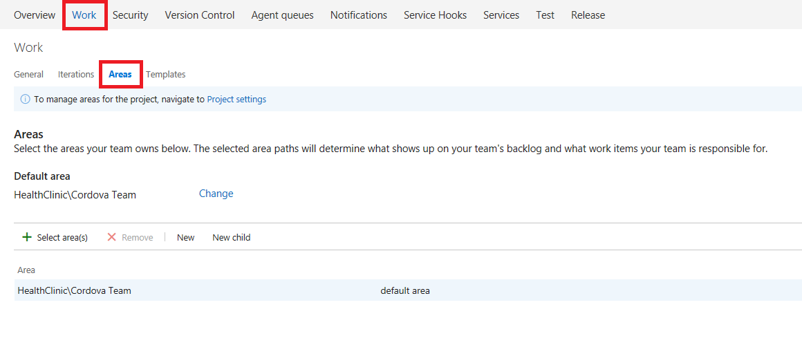

8.  Click on **Select area** and select **Cordova Team**.

    

9.  Select the **Cordova Team** node and click on **New child**. Give a name for the area like **IOS**.

    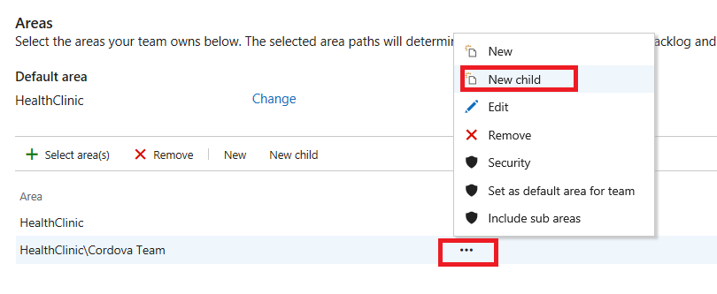

10. You should see the areas listed below for the teams.

    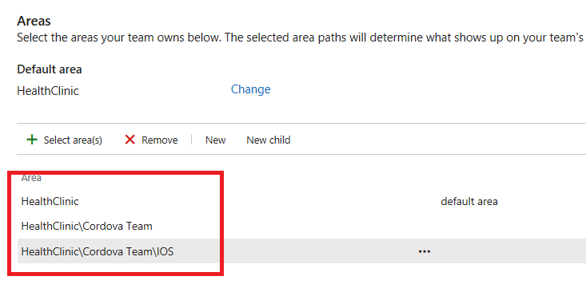

11. Go to **Iterations** and click **Select Iteration**. Select **Sprint 1**.

    

12. Click on **Change** for the default iteration. And set **MyHealthClinic** as the default one.

    

    

13. Go to **Areas**. As with iterations, VSTS have areas which can be used to organize the work fr the teams.
We see the default area is set to **Cordova Team**, if not you can change it to Cordova Team area.

    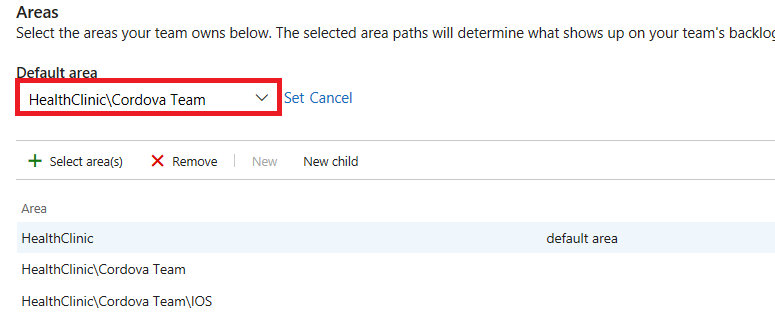

14. Click on the ellipsis button to include sub-areas as shown

    

 

## Exercise 3: Work Items in VSTS

1.  Navigate to **Cordova Team** dashboard. This is the main screen for the Cordova team. 

    

2.  Let's create our **first Product Backlog** item. On the **New Work Item** widget name the title **Create appointment** and change the work item type to **Product Backlog**. We can also create Bugs, Tasks, and several other Work item types.

    

3.  You can see that the product backlog would open automatically. Enter the description **As user I want to create appointments.**
    Enter the acceptance criteria as **Any user can create appointments. After creating an appointment it should appear in the user appointment list.**
   
    

4.  Click **Save & close**.

5.  You can create several backlog items repeating the above steps. Since you would have already opted the template during the creation of project, you can see pre-defined work items in your backlog list.
    
    

6. Select the desired product backlog items, drag and drop it to the current sprint. In this case the current sprint happens to be **Sprint 2**.

    

## Exercise 4: Working with Kanban board 

1. Click on the **Board** from your backlog items.

   

   >Kanban board turns backlog into an interactive signboard, providing a visual workflow. As work progresses from idea to completion, you update the items on the board.
  Each column represents a work stage, and each card represents a product backlog item (blue cards) or a bug (red cards) at that stage of work.
  The Kanban board allows you to set Work in Progress (WIP) limits for each state. One of the primary reasons for using Kanban and limiting work in progress is that it helps
  identify bottlenecks in your development process and minimize lead time for new features. Let’s say that the devices team is not delivering finished work as quickly as desired,
  and it is suspected that the underlying issue may have to do with taking on too many tasks at the beginning of each sprint. If we are more careful about the number of tasks that
  we commit to, perhaps we can better focus our efforts.

2. Drag and drop the items that were selected for the Sprint 2 from **New** to **New Commit**.

   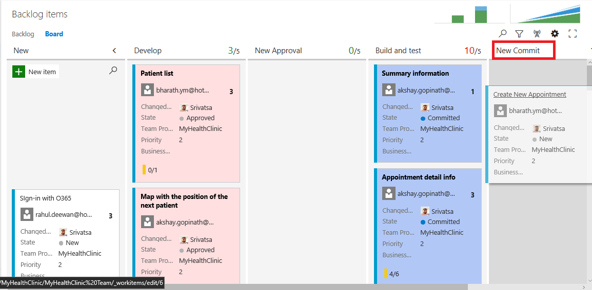

3. Click the gear icon to open the settings dialog.

   

4. The WIP limit is already set for **Build and Test** column. You can also set for other columns as well. To do so, from the settings page go to columns tab. Click the **New Commit** column. Set the WIP Limit to **3**.

   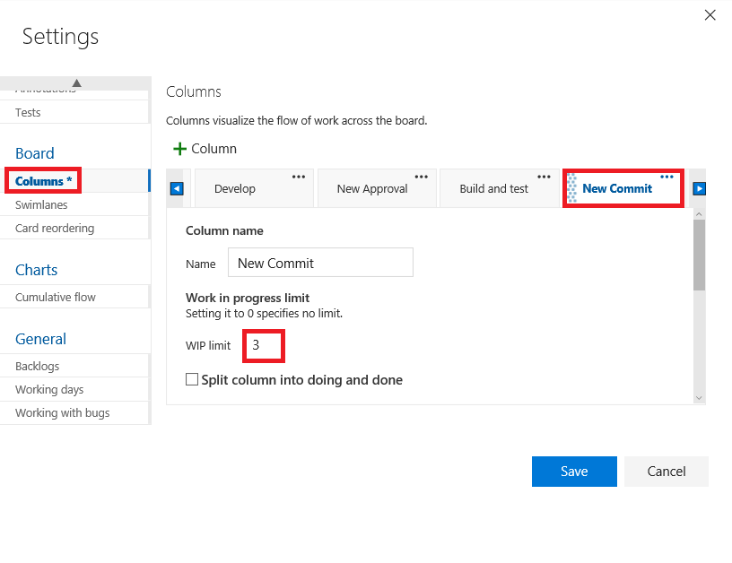
  
5. You can also define Kanban **Definition of Done** as **PBIs has been reviewed by Product Owner and Development team. They are ok to start with** to that column.

   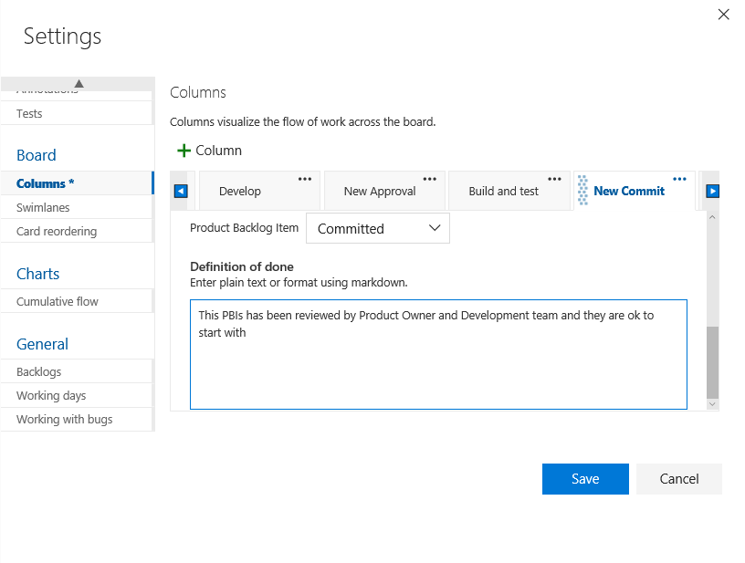

   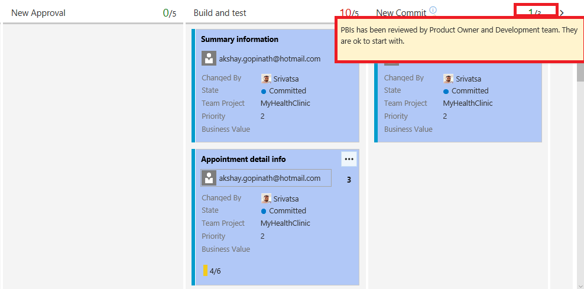

6. We can add style rules to make the cards with information stand out. When a work item mathces more than one rule, the first rule is used.
   Click on **Styles**. 

   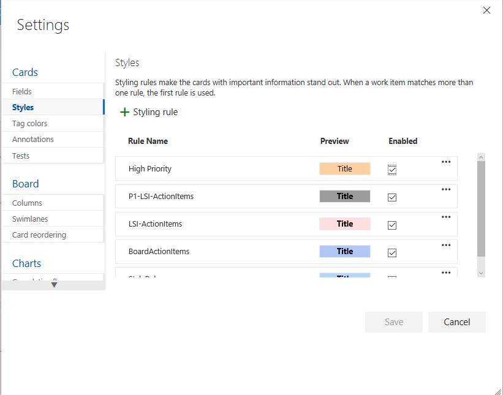

7. Go back to Kanban board, you should see all the styling rules used. In the below picture you see the PBIs distinguished in 2 colors (Pink and Blue).

   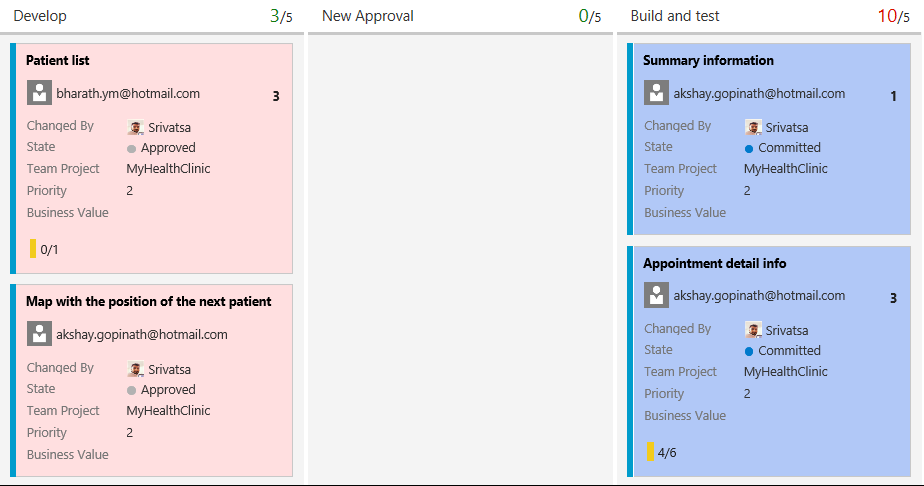

8. Let’s say that the devices team has decided that they want to add in a column that represents work that has been tested on a physical device.
   This is the only team that would desire to keep track of such a state, and they can easily add this to their Kanban board.
   Navigate to the **Settings** tab and go to **columns** tab and add a new column with the name **Devices Tested**.

   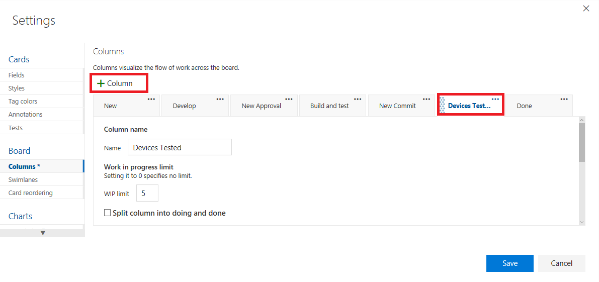

## Exercise 5: Working with Task Board

1. Go to **Sprint 2** and click on **Board**.

   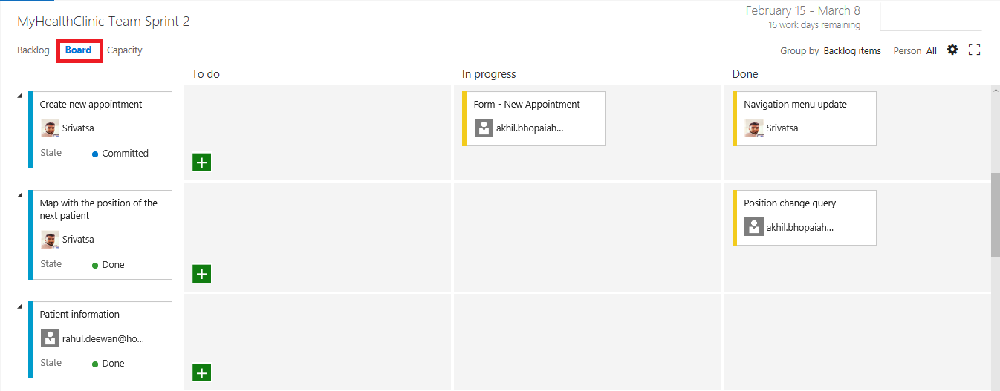

   > Your task board provides a visualization of flow and status of each sprint task. With it, you can focus on the status of backlog items as well as work assigned to each team member.
  It also summarizes the total amount of remaining work to complete for a task or within a column.

2. Click on the upper right corner where the sprint burndown is shown. Throughout your sprint, you can monitor the sprint burndown chart to determine if your team is on track to
   complete its sprint plan.

   

3. When you estimate the tasks, you can also use the **Capacity** tool to check the capacity of the team against the planning. Ensure you have all tasks assigned and with an
   estimation for the **Capacity** tool to work. Click on **Capacity** from your Task board and add users.

   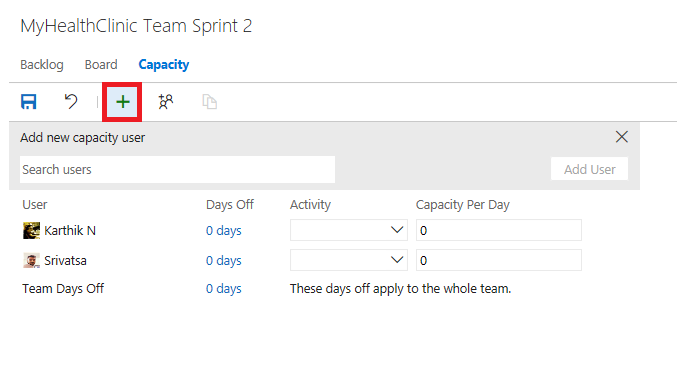

   >The capacity view allows to specify the number of hours per day that each team member will be working on this project, days off per team member, and overall team days off. These capacity settings apply to the current iteration. You can optionally use the activity column to describe the disciplines that each team member specializes in. When tasks are broken down by activity, it can provide another view across your team’s capacity to determine. For example, you have enough people working on documentation to meet the demands for this iteration.

4. imagesduce the capacity per day in hours for the users.

   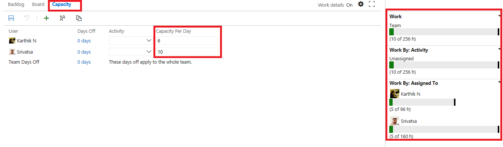

   >When you imagesduce the hours available per day for the team you will see how it changes the **Work Details** pane on the right to adapt to the modifications.

5. Click on the column **Days Off** on any user. imagesduce start and end date in an interval inside the dates for the Sprint so he has more work than hours available.

   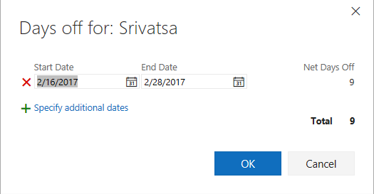

   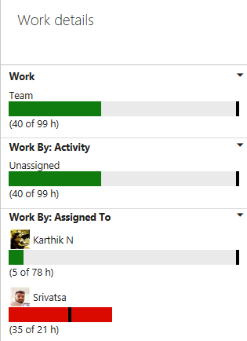

   >When you add days off to a Team Member the **Work Details** planning graph will adapt itself and show red if there is more work assigned to any team member
    than the work hours we have available for the sprint.

6. Click on **gear icon** for the settings. Select the **Task** tab.

   

   >Rich cards not only provide at-a-glance info of interest to you and your team, they also provide a way for you to update a field without opening the work item.
    With style rules, you can highlight those work items with colors, based on the criteria you set. 

7. You can see the Avatar and other information on the cards.

   

8. The tasks can be easily dragged and dropped once the work is started.

   

## Exercise 6: Portfolio Management

Portfolio backlogs provide product owners insight into the work performed by several agile feature teams. Product owners can define the high-level goals as
Epics or Features, and feature teams can break these down into the user stories they'll prioritize and develop.

   

  >As you advance in the product development, stories can go bigger, making them difficult to handle. We will use the Feature Work Item Type for this purpose.
   With Features we will group Product Backlog Items to handle an information unit at a bigger level.

1. Click on **Features**. You will see list of feature work items available already. If you wish to add few more you can add.

   

2. Go back to **Backlog items**. Click on **Mapping** to enable as shown.

   

   

3. With the mapping panel enabled, drag and drop the Product Backlog Items to the Feature you want to link to.

   

4. To have a full view of the work escalation and decomposition to tasks Click on **Features**. Expand all the levels by clicking twice on the + icon.
   Review the full structure from Feature to tasks.
   
   >It is important to keep track of all artifacts involved in
   product development so we are able to plan and keep track of what has been done, and what needs to be done.

   

5. Go to the **Board**. As we have a Kanban board for checking the states of the Product Backlog Items, we also have a Kanban Board to see the transition
   and check visually the current state of any particular feature. This is also customizable as we saw in our Sprint Backlog view, and the Product Backlog view.
  
   

6. Click on the first card where the blue badge with the Product Backlog Items. You Check any User Story to mark it as completed.

   

7. You can also Drag and Drop any Feature to other state and check how it changes its current state.

## Exercise 7: Working with VSTS Dashboards

Dashboards allow teams to visualize status and monitor progress across the project. At a glance, you can make informed decisions without having to drill down into other parts of your team project site.
The Overview page provides access to a default team dashboard which you can customize by adding, removing, or rearranging the tiles.
Each tile corresponds to a widget that provides access to one or more features or functions.

1. Go to **Dashboard**

   

2. Click on **edit** to modify the dashboard and add your widgets like **Build Summary, Release Summary, Markdowns etc**.

3. You can also add role based dashboards by clicking the **New +** button.

   

   

4. You can also manage dashboard settings by adding permissions and auto-refresh functionalities.

   

   

## Exercise 8: Customization

Sometimes you will need to add more fields for a particular Work Item Type definition, to represent information which is important for your team.
We can customize the Process Template for our team project by adding new fields, definitions for any Work Item type.

1. Navigate to the administration page by clicking on the **gear icon**.

   

2. Navigate to your Account and click **gear icon** and select **process**.

   

3. In the process tab you will see all of your Process Templates.

   

4. Click on the **ellipsis** near the Scrum template. Currently we are using the default Scrum template, default templates can’t be modified.
   We need to create an inherited template from the Scrum template, so that we can add new fields. Click on **create inherited process**.

   

5. Provide a name for the inherited process template like **MyHealthClinic Scrum template**.

   

6. You should see the successful message after creating the inherited template.

   

7. Select the inherited template that was created.

   

8. Navigate to **Work Item Types** tab. Now we have different options to modify this scrum template.

   

9. We will directly add a new field for the PBI Work Item template. Select **Product Backlog item** | **Layout** | **New field**. On the definition screen provide a name **HealthClinicTicketId**.

   

   > We are creating a text field for an internal id of the ticketing system inside MyHealthClinic.

10. Click on **Layout**. Provide a name for Label as **Ticket ID**. Until now we have only created the field definition, we have to add it to the layout of the Work Item.
    We will create a new group to show our custom information, so all of our customized fields appear together. Provide a name for the group as **MyHealthClinic** and click **add field**.

    

11. At this moment we have only created the template, we must assign this template to our VSTS Project so that we can use this new field. We can change the process template from a VSTS Project,
    with their inherited templates or default templates. This is done in the main process screen. Go back to **Process** tab, click on ellipsis button on our new template
    and select **Change Team Projects to use MyHealthClinic Scrum template**.

    

12. Select the **MyHealthClinic** project to change the process and click **>** button.

    

13. Click **ok** button. You should see a successful message after changing the process.

    

12. Let’s review how the new field appears on our Product Backlog Item Template. Go back to **work** | **backlogs**. Open the first product backlog. Look after **Acceptance Criteria** for the **MyHeathClinic** group.
    Fill in the information for the **Ticket ID** like **HK89JY13**. Click **save & close**.

    

    >Once the Work Item is saved,  VSTS will also save the new custom information we have added to the PBI and will be available for queries and the rest of the VSTS system.
   

   

   

   
