# Generate CI/CD pipeline automatically from Azure Portal

CD is a great option for projects that require multiple and frequent contributions to be integrated.

CD in Team Services simplifies setting up a robust deployment pipeline for your app to publish the most recent updates to Azure App Service. The pipeline can be configured to build, runs tests, and deploy to a staging slot and then to production.

You must store your app's source code in a Team Services Git, GitHub, or any other Git repository to use Azure Continuous Delivery. Team Foundation Version Control (TFVC) repositories are not supported at present.

## Pre requisites

1. Azure Subscription

2. Visual Studio Team Services account. If you don’t have one, you can create from <a href="https://www.visualstudio.com/">here</a>

3. You can use the <a href="https://vstsdemogenerator.azurewebsites.net/">VSTS Demo Data generator</a> to provison a project with pre-defined data on to your Visual Studio Team Services account. Please use the **My Health Clinic** template to follow the hands-on-labs

**Note:** Currently supported/recommended to use the same account for VSTS and Azure to setup the CD pipeline. Else you would end up with exceptions and won't be able to setup. 

## Configure

1. Go to Azure Portal from <a href="https://portal.azure.com">here</a>

2. Select your web app, If you haven't created a web app, do this now by choosing the "+" icon, selecting **Web App** from the **Web + Mobile** category, and providing a name and a resource group.

   

3. In your app's menu blade, choose **Continuous Delivery (Preview)** and then choose **Configure**

   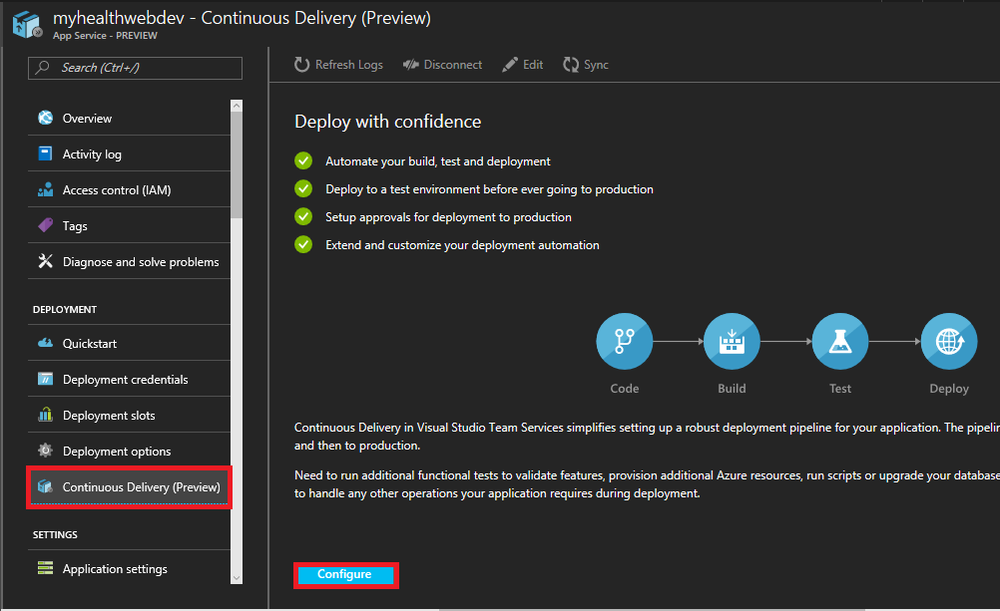

4. Select **Choose repository** and select the type of repository where you stored your app's source code. You have a choice of **Visual Studio Team Services, GitHub** or **External Git** (a Git type repository not hosted in Team Services or GitHub).

   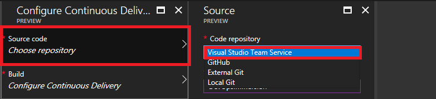

5. Select the **project, repository**, and **branch** to deploy from. When you're done, choose OK.

   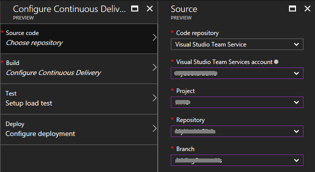

   If you chose to use GitHub complete the authorization steps. If you chose to use an external Git repository, enter the repository name, branch, and (if required) your credentials.

6. Select **Configure Continuous Delivery** and choose the web application framework you used to develop your app. Since we are targeting .NET Core, select **Asp.NET Core**.

   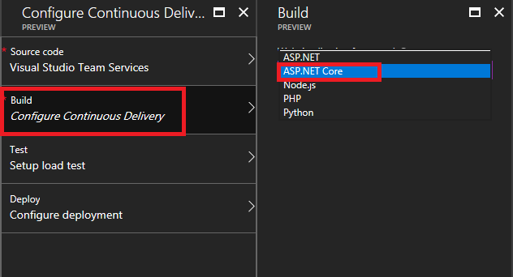

   This choice influences the way that Azure Continuous Delivery builds and packages the app for deployment. At present, ASP.NET, ASP.NET Core, PHP, Python, and Node.js are supported. When you're done, choose **OK**.

7. Select **Set up load test** and decide if you want to run a load test on your app before deploying the latest changes to production. The default is **NO**. If you want to set up a load test (25 virtual users concurrently accessing the app for 60 seconds), choose **YES** then specify whether to use an existing Azure App Service instance, or create a new one in a new App Service plan. When you're done, choose **OK**

   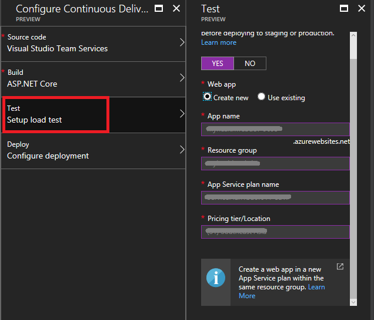

8. Select **Configure deployment** and decide if you want to deploy your latest changes first to staging, and then promote to production. The default is **NO**. If you want to set this up, choose **YES** then specify whether you want to use an existing Azure App Service slot, or create a new one. When you're done, choose **OK**.

   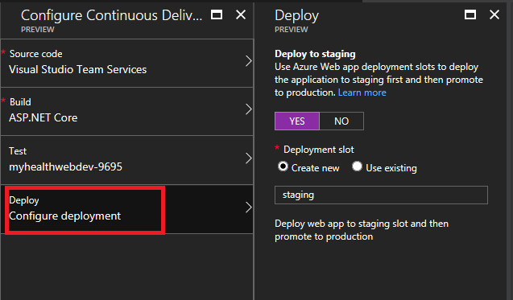

## Build and Deploy

1. Choose **OK** to create and execute the Continuous Delivery workflow.

   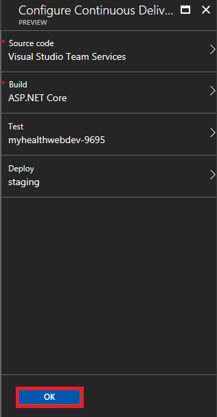

   The following sequence of events occurs:

    - Azure Continuous Delivery creates a build and a release definition in the Team Services account you specified, together with a service endpoint to connect to Azure

    - If you chose to create a new Azure App Service instance for load tests, and/or a new slot for staging, these are created in your Azure subscription

    - After setup has completed successfully, a build is triggered that builds and packages the application for deployment

    - After the build has completed successfully, a new release is created and the deployment triggered

    - If you chose to include a load test, the latest changes are first deployed to the Azure App Service you selected, and then the load test is executed after the deployment succeeds

    - If you chose to use a staging slot, the latest changes are deployed to the staging slot and then a slot swap is performed to complete the continuous delivery workflow

2. After all these actions have completed, the Azure portal shows the results in the Activity Log.

   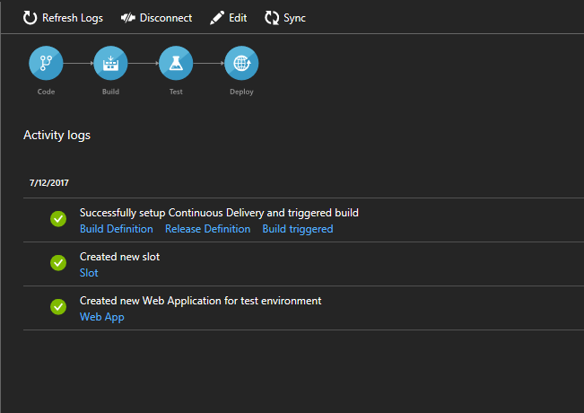

3. In the **Successfully set up Continuous Delivery...** item, choose the Build Definition link to open the project containing your app in Team Services, and see the summary for the build definition. 

   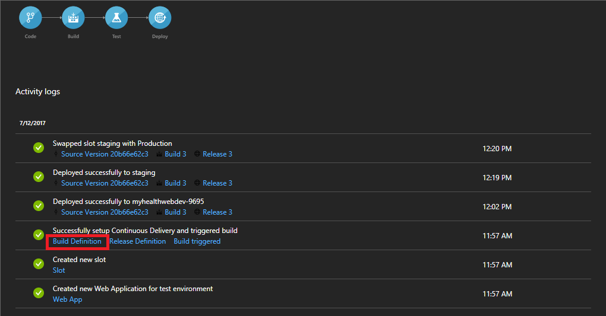

   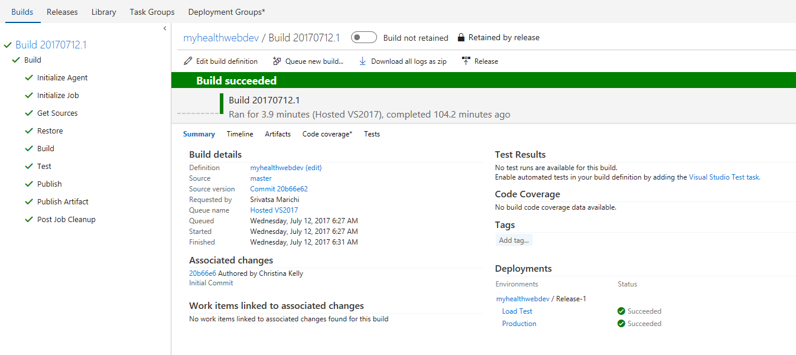

4. Choose Edit to see the tasks that have been added and configured.

   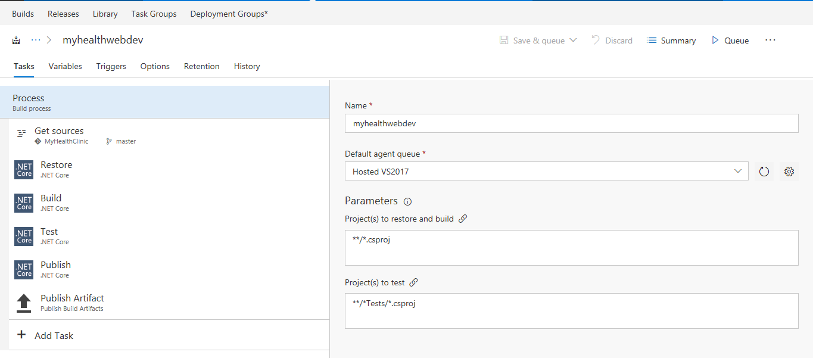

   Different tasks are added to the build definition depending on the app framework you selected. For example, .NET Core task is used for ASP.NET Core apps.

5. In the **Successfully set up Continuous Delivery...** item, choose the Release Definition link to open the project containing your app in Team Services, and see the list of releases for this definition. Choose Edit to see the tasks that have been added and configured.

   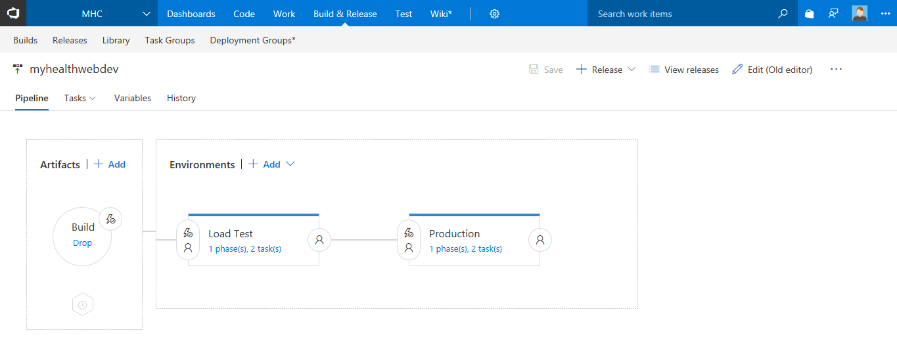

6. The release definition that is created depends on whether you chose to include a load test and/or a staging deployment. If you chose either or both, your release definition will have two environments named **Test** and **Production**. As shown below, the **Test** environment has two tasks: **Azure App Service Deploy** deploys the app to the Azure App Service you selected for load testing, and **Cloud-based Web Performance** task execute the load test.

   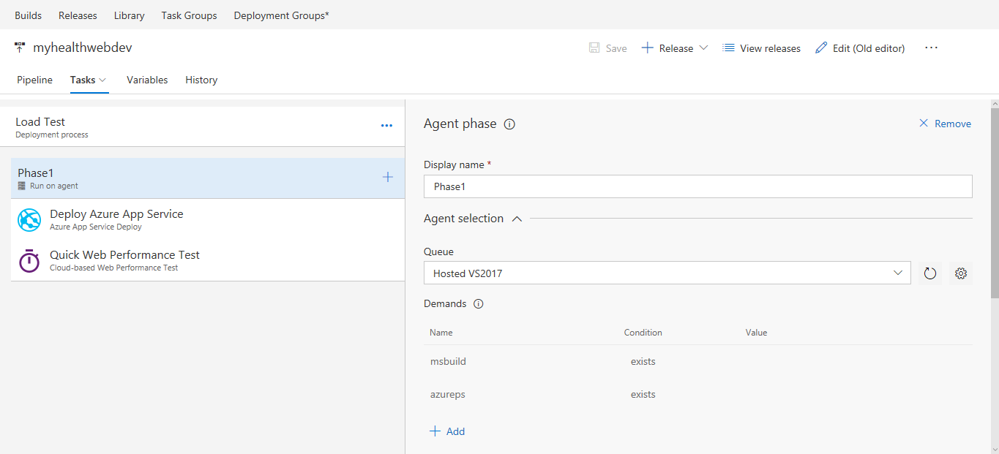

7. The **Production** environment, shown below, has an **Azure App Service Deploy** task. If you chose to use a staging deployment, the latest changes are deployed to the staging slot and then an **Azure App Service Manage** task performs a slot swap between staging and production slots.

   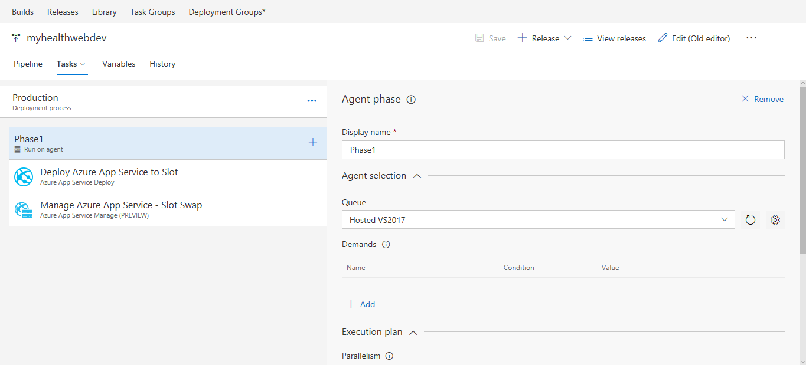

   If you opted out of both load test and a staging deployment, your release definition will have a single environment with just one Azure App Service Deploy task to deploy the latest changes to your Azure App Service.

   There are also links in other items in the Activity Log that open commits, builds, build reports, releases, deployment slots, and the deployed app itself, in relevant windows or apps.

8. Click on Release summary to ensure the deployment was successful. 

   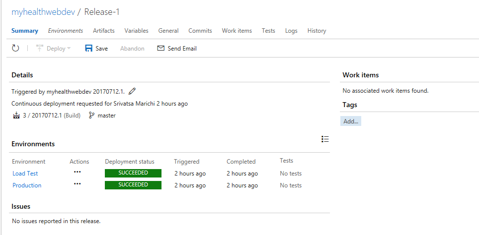

9. Browse to the web app post deployment. You will notice that the app is running, but is missing out all the stylings, images etc. You should see something like this as shown below.

   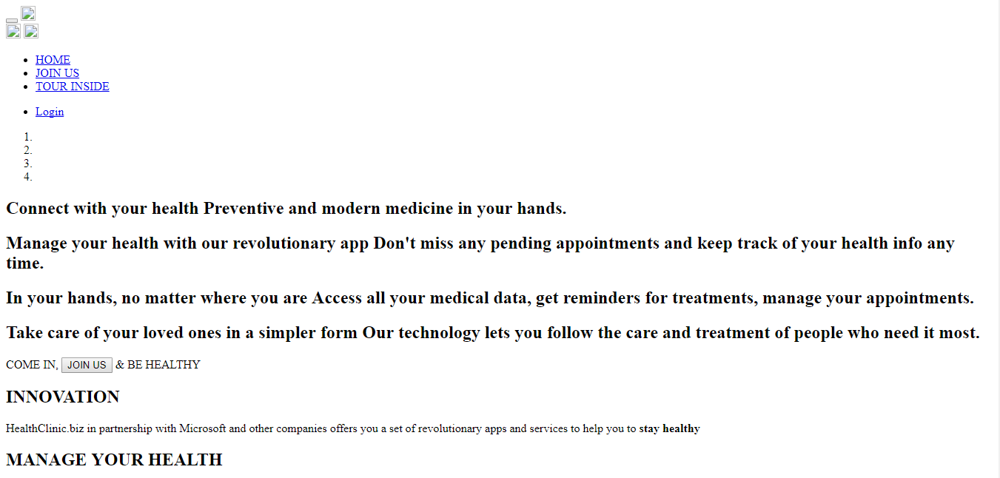

   This is because during the compilation couple of js dependencies are missed out which we would be adding in the build definition in our next exercise.

10. Verify that continuous deployment is occurring from the repository containing your app by pushing a change to the repository. Your app should update to reflect the changes shortly after the push to the repository completes.

11. You can stop a deployment to your Azure App Service by choosing **Disconnect** at the top of the **Continuous Deployment** blade. This deletes the Azure Continuous Delivery configuration in the Azure portal and turns off the build triggers in your Team Services account for this configuration.

    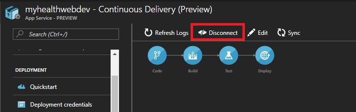

    To ensure the build and release history is preserved, the build and release definitions are not deleted from Team Services when you disconnect.

## Modify Build and Re-deploy

1. Go to your build definition from your VSTS account that was created and edit.

   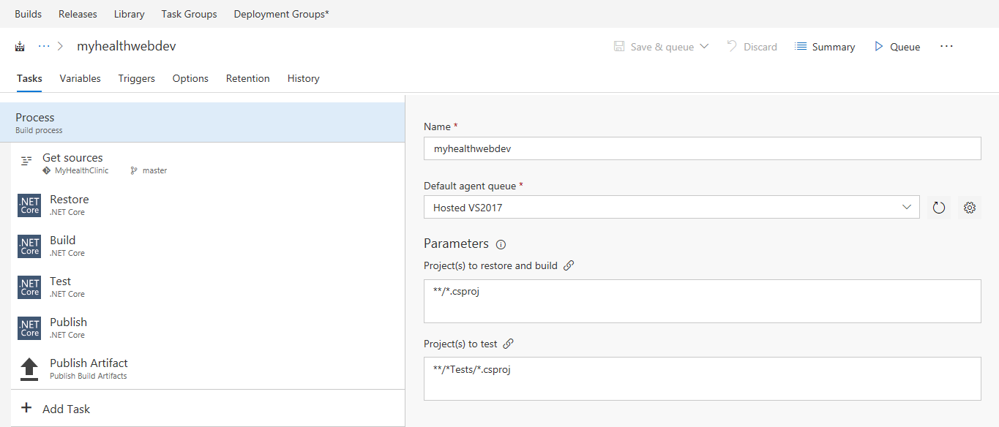

2. Click on **Add Task** and search for **npm install** from the search box.

   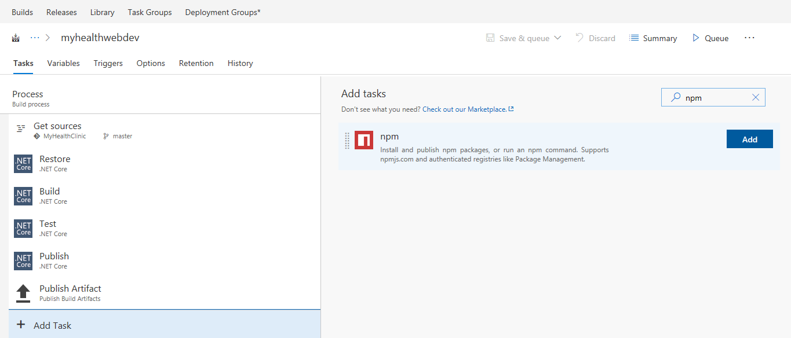

3. Place the task after .NET restore step.

   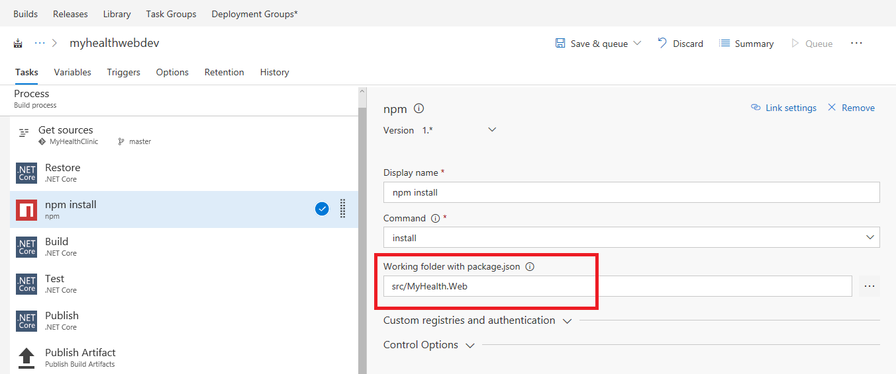

   Parameters to be set

   Set the **Working folder** to **src/MyHealth.Web** and retain the rest as it is.

4. Click on **Add task** and search for **bower** task from the search box.

   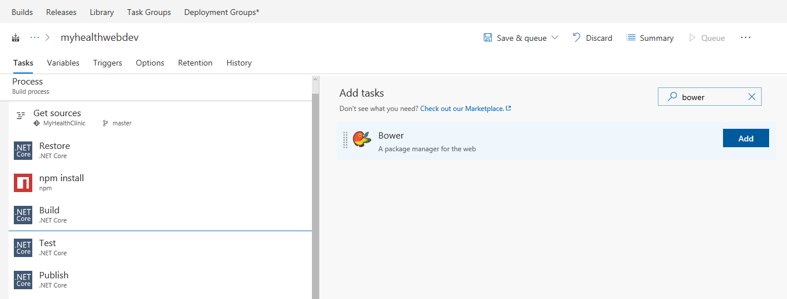

5. Place the task after npm step.

   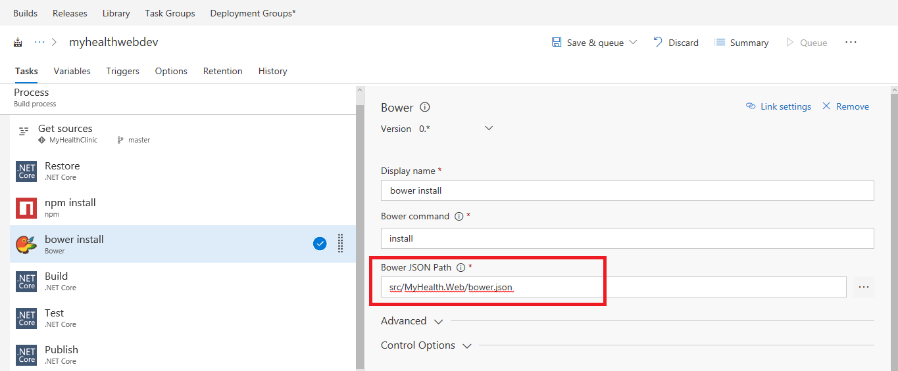

   Parameters to be set

   Set the **Bower JSON Path** to **src/MyHealth.Web/bower.json**

6. Click on **Add task** and search for **gulp** task from the search box.

   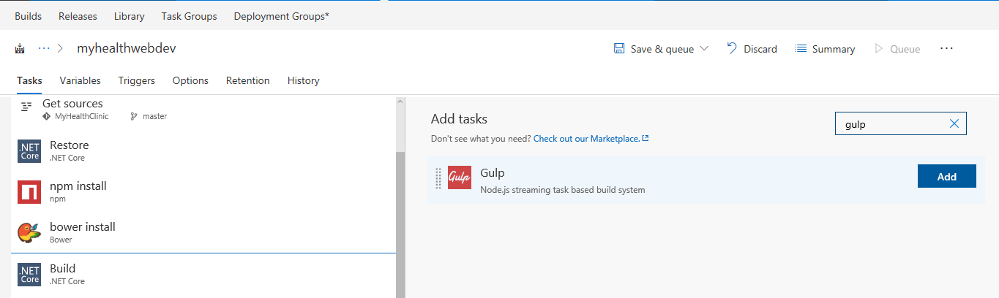

7. Place the task after bower step.

   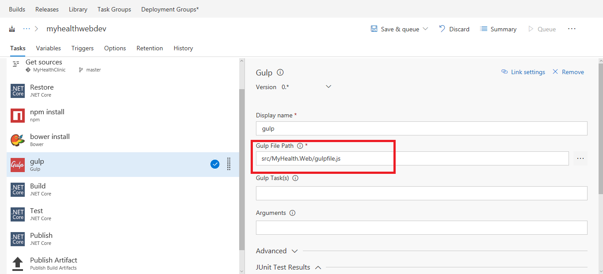

   Parameters to be set

   Set the **Gulp File path** to **src/MyHealth.Web/gulpfile.js**

8. Click on save and Queue the build. 

9. Post build, successful build summary should show up with all the modifications.

10. Go to release and check if the deployment is success, if yes then browse to the website. You should see with all the images, stylings etc as shown below.

    

## Add Tests to build

To Do

 
   

