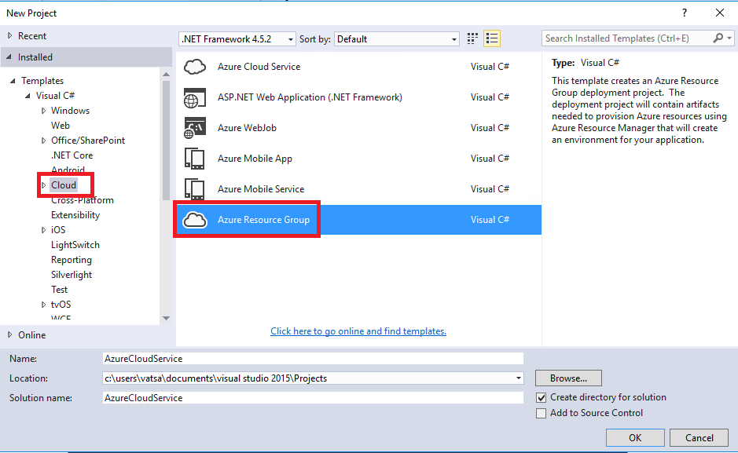
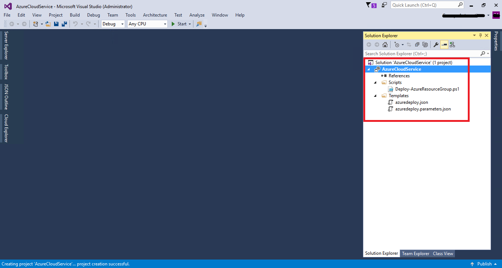
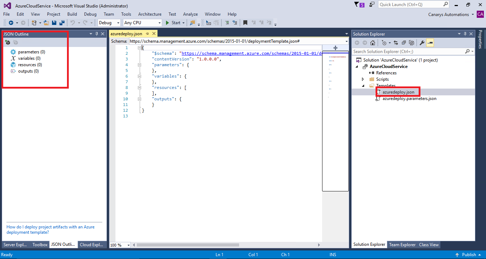
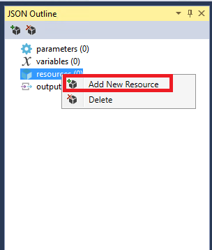
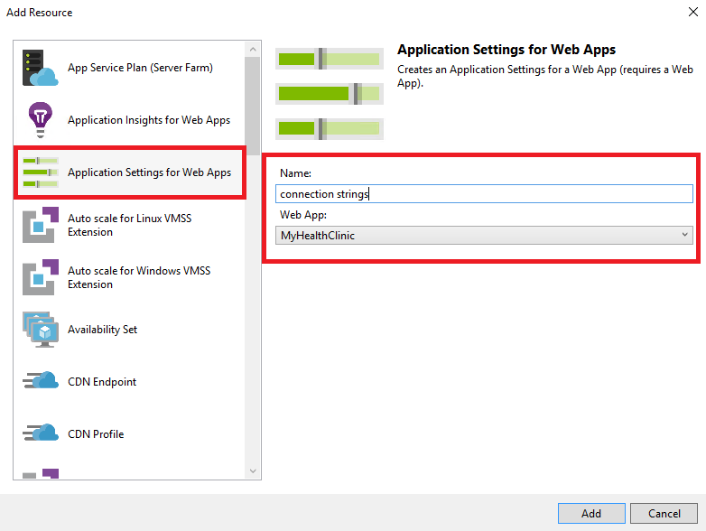
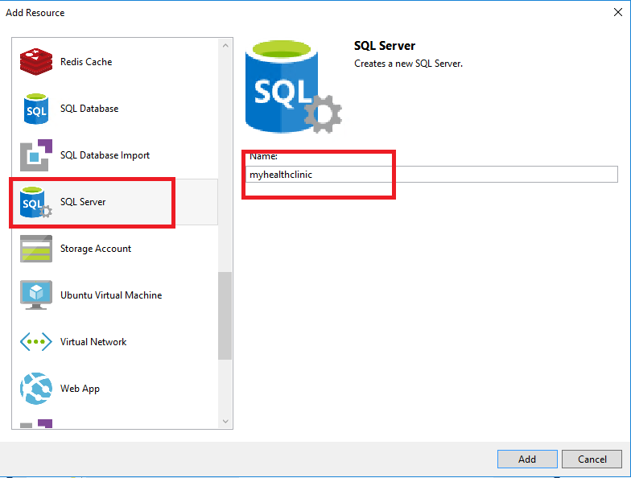
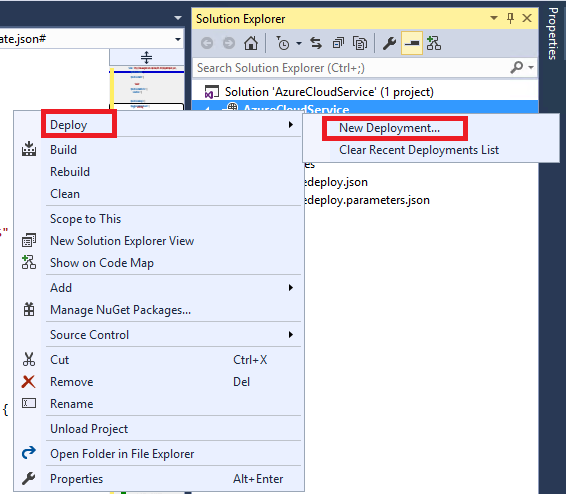
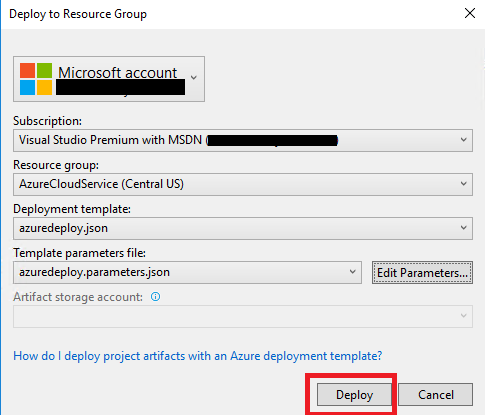
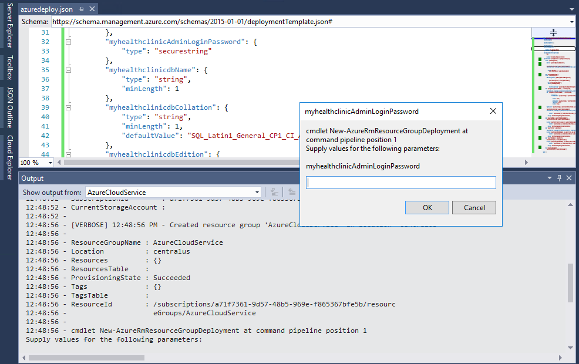
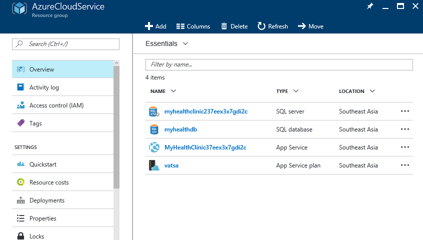

Last updated : {{ "now" | date: "%b %d, %Y" }}.

## Overview

Azure Resource Manager enables you to work with the resources in your solution as a group. You can deploy, update, or delete all the resources for your solution in a single, coordinated operation. You use a template for deployment and that template can work for different environments such as testing, staging, and production. Resource Manager provides security, auditing, and tagging features to help you manage your resources after deployment.

## Prerequisites

In order to complete this lab you will need the Visual Studio 2017 virtual machine provided by Microsoft. Click the button below to launch the virtual machine.

<a href="" class="launch-hol" role="button" target="_blank">Launch the virtual machine</a>

- Visual Studio 2017 (download from [here](https://www.visualstudio.com/downloads/){:target="_blank"})

- Active Azure Account

- Azure SDK for Visual Studio 2017 (download from [here](https://azure.microsoft.com/en-in/downloads/){:target="_blank"})

## Please follow the below steps

1. In Visual Studio, go to **File** \| **New Project** and select **Cloud**. Select **Azure Resource Group** and give a name **Azure Cloud Service**

    

1. A new window would appear with a list of templates like WebApp+SQL, Logic App, Ubuntu Server etc. Because we want to create a custom resource group, we would choose “Blank Template” and click “OK”.

    

1. You can see the files that was created in Solution Explorer

    

    We have so many files created, let’s see what these files are.

    - **Deploy-AzureResourceGroup.ps1:** A PowerShell script that invokes PowerShell commands to deploy to Azure Resource Manager

    - **azuredeploy.json:** This defines the infrastructure that you want to deploy to Azure and the parameters that you can provide during the deployment. It also defines the dependencies between the resources so they are deployed in the correct order.

    - **Azuredeployparameters.json:** A parameters file contains values that the template needs. These are the values that would be passed onto each deployment.

    - **AzCopy.exe:** AzCopy is a Windows command-line utility designed for copying data to and from Microsoft Azure Blob, File, and Table storage using simple commands with optimal performance. You can copy data from one object to another within your storage account, or between storage accounts.

1. Open **azuredeploy.json** file and also open **JSON Outline** window in your Visual Studio. You can notice the summary information of the file at this moment in your JSON Outline. Currently there are no resources added.

   

1. You can add and modify existing resources to the JSON document from the **JSON Outline pane**. Let’s add the following resources to the template as shown below-

   

   

1. Create an App Service Plan with the name **MyHealthClinicDemo**

   

1. Create a WebApp with the name **MyHealthClinic** and map the App Service Plan to “MyHealthClinicDemo” that you created in                    the previous step

   

1. Add **Application Settings for WebApps** with the name “connection strings” that is associated with your WebApp

   

1. Create a SQL Server with the name **myhealthclinic** and add an instance of Azure SQL database with the name **myhealthclinicdb**

   

   

1. Upon adding all these resources, you should be able to see the parameters, variables and resources in your **JSON Outline pane**  as shown below

    

    >Now that we have all our resources ready, let’s deploy to Azure. Before deploying make sure the resource group doesn't exist so that you can verify post deployment that these resources were actually deployed from your Visual Studio.

1. Login to Azure Portal from [here](https://portal.azure.com) and verify.

    

1. Right click on the project from Solution Explorer &gt; click “Deploy” &gt; select “New Deployment”

    

1. A new window appears; select the Subscription you want to deploy with. Click on the Resource group drop down and create “new”. A new popup appears, provide a name for the resource group and choose a location you want this resource group to be deployed and click on create

    

1. Click on edit parameters and fill out the required details as shown

    

1. Click on Deploy

    

1. You will be prompted with a window to enter the db credentials. Remember the password that you had specified while you were editing the parameters in step 14

    

1. Post deployment, you will be seeing the resources in your Azure

    
