Last updated : {{ "now" | date: "%b %d, %Y" }}.

## Overview

Continuous integration (CI) is the process of integrating your code into a shared repository as frequently as possible. During code integration, a build break or a test failure can inform you, in a timely manner, of an error in your code.

When many developers collaborate on complex software projects, it can be a long and unpredictable process to integrate different parts of code together. However, you can make this process more efficient and more reliable if you build and deploy your project continuously.

Visual Studio Team Services simplifies [Continuous Integration](https://www.visualstudio.com/en-us/docs/build/overview/){:target="_blank"} for your applications regardless of what platform you are targeting, or what language you are using. VSTS Team Build allows you to:

- Build on Linux, Mac, and Windows

- Use a private or a hosted (Azure) build agent

- Use multi-platform build agents for Android, iOS, Java, .NET, and other applications

- Seamless integration with work, test, code, build, and release

- Track your builds with real-time build status

## Pre-requisites

In order to complete this lab you will need-

- Visual Studio 2017 virtual machine provided by Microsoft. Click the button below to launch the virtual machine.

  <a href="https://labondemand.com/AuthenticatedLaunch/39008?providerId=4" class="launch-hol" role="button" target="_blank">Launch the virtual machine</a>

- **Visual Studio Team Services account**. If you don't have one, you can create from [here](https://www.visualstudio.com/){:target="_blank"}

- You can use the **[VSTS Demo Data Generator](http://azuredevopsdemogenerator.azurewebsites.net/Environment/Create){:target="_blank"}** to provision a project with pre-defined data on to your Visual Studio Team Services account. Please use the ***My Health Clinic*** template to follow the hands-on-labs.

If you are not using the VSTS Demo Data Generator, you can clone the code from this [GitHub repository](https://github.com/Microsoft/myhealthclinic2017){:target="_blank"}

## Exercise 1: Build ASP.NET Core

ASP.NET Core is a lean and composable framework for building web and cloud applications. Here we'll show you how to automatically build the **HealthClinic ASP.NET Core** application.

If you have provisioned your project using the demo generator, the build definition should have been automatically created for you. You can follow the labs without adding or modifying the tasks to understand how a build pipeline works in VSTS. Otherwise, you can follow the steps to create a new one.

### Task1 : Creating New Build Definition

1. From your VSTS account overview page, select your team project.

1. Click **Build and Release** tab and select **Builds**.

1. Click on **New** to create build definition.

   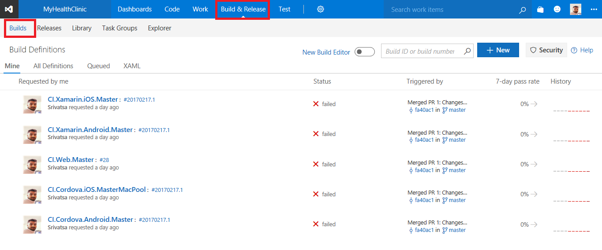

1. You can start by selecting a template that will add a set of tasks and apply typical settings for the kind of app that you are building or start with an empty process and build from scratch. There is a template available for building ASP.NET Core apps. We will use that. Select  **ASP.NET Core**  and click apply to apply the template for the build definition.

   

1. As you can see, the template has applied a set of tasks that are typically involved in building an ASP.NET Core app. In many cases, you might not require to do anything further other than just pointing to the correct repo and branch and you will be good to go. In this case, you will need to make some customizations to the build.

1. Select the **Process** task which states that some settings need attention.  You will need to select the build agent where you want to run this build. You can choose to run the builds on an-premise agent or use the agents hosted on Azure. We will use the **Hosted VS2017** agent as it has the .NET core framework and all other components that are required to build the app.

   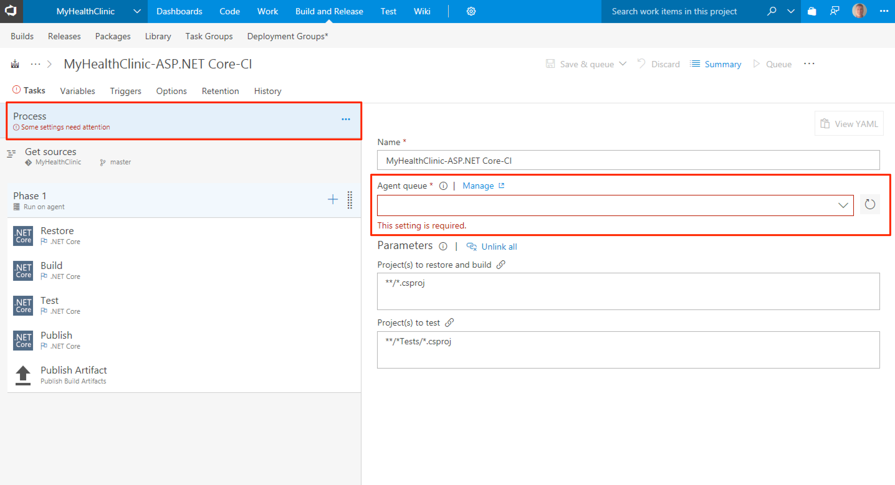

1. Next select the **Get sources** task.  You can fetch your code from various source including ***GitHub, SVN, or any other Git repository*** but since you have our code in the VSTS project itself, select **This Project**. Change the repository and branch if it is not already pointing to the correct ones.

   

1. The next tasks **Restore** needs no change. Leave it as it is.

1. Save the build definition.

1. Rename the build definition by clicking on the name and then changing it to **MHC.Web.CI**. Then save the build definition again.

   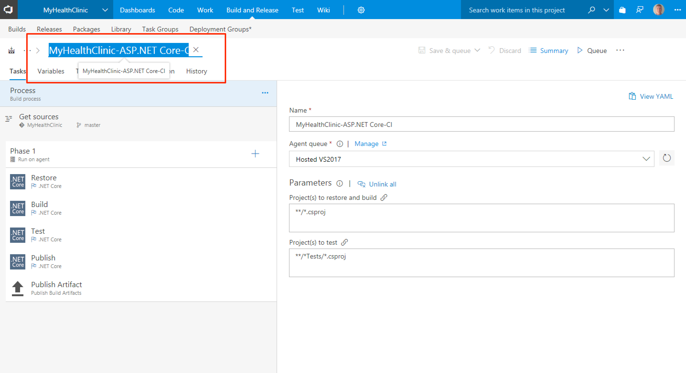

   The My Health Clinic web application depends on node components and additional libraries. You will need to add tasks to download and install these packages before it can be built. We will see how to add tasks to our build definition in the next task.

### Task 2: Adding Build Tasks

1. Select **Add Task** and then select **Package** to find tasks relating to the category. Select **npm** and click **Add**. Place it after the **Build** task. You can drag and drop tasks to reorder them.

    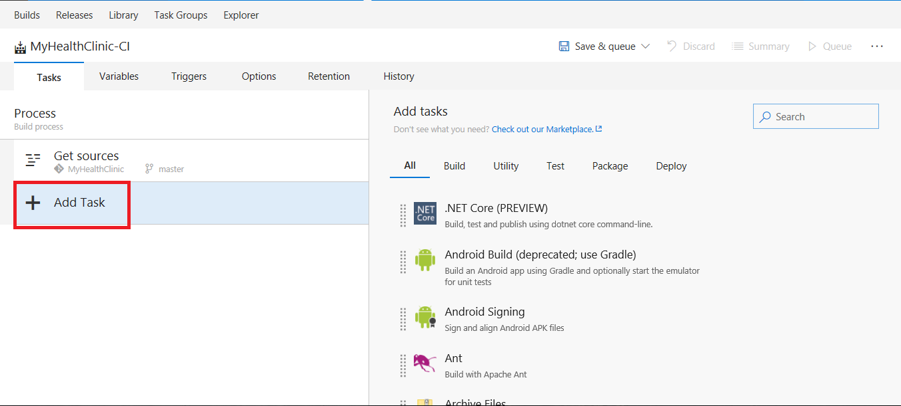

1. Change the *working folder* to ***src/MyHealth.Web***. The project has the json file which the npm install command will require to know what packages needs to be installed.

    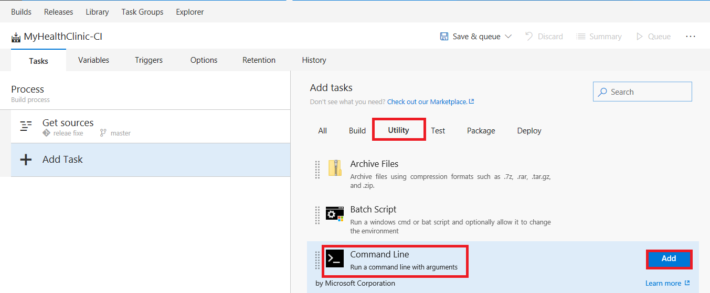

    {% include note.html content= "Next, you will need to run *bower* to install the web packages. You can run bower commands using the **Command Line/Shell Script** utility but a better way to do that would be is to use the **Bower** task. This task is not out-of-the-box and needs to be installed from the Marketplace. 

    If you didn't install Bower when using the VSTS Demo Generator then from an another tab, navigate to the [Bower extension page](https://marketplace.visualstudio.com/items?itemName=touchify.vsts-bower){:target=\"_blank\"} on the Marketplace and install it. Close the tab when you are done to return back to the tab where you are editing the build definition." %}

1. Save the build definition and refresh the page. You should see the **Bower** task under the *Package* tab. Select the task and click **Add**

    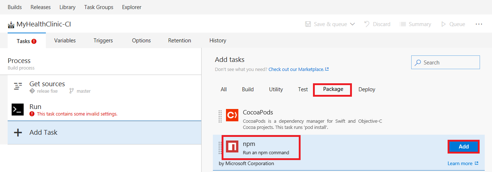

1. Select the **Bower** task and change the *Bower JSON Path* to point to the *bower.json* file under the MyHealth.Web folder

    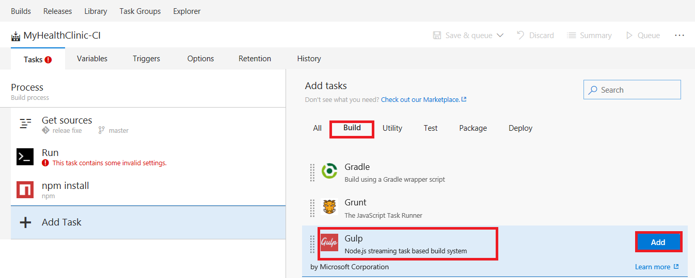

1. Next you will need the **gulp** task. Gulp can carry out tasks such as compressing files. Select **Add Task** and look for the **Gulp from the **Build** section. Add that to the build definition.

    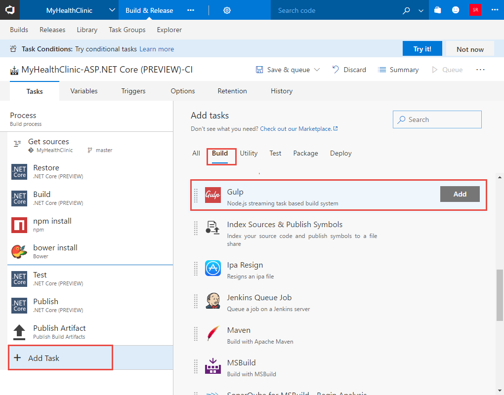

1. Change the *Gulp file path* to point to the gulp file under the MyHealth.Web folder

    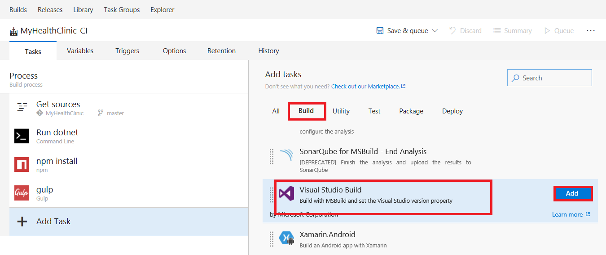

1. The rest of the tasks do not need any change. You are ready to run the build. You can make the builds to run as a *Continuous Integration* build so that it runs upon every check-in on the branch. We will see that later in the lab. For now, we will run it manually.

1. Select **Save & queue** to save the build definition and queue the build immediately. If you have already saved the build definition, select **Queue** from the menu

    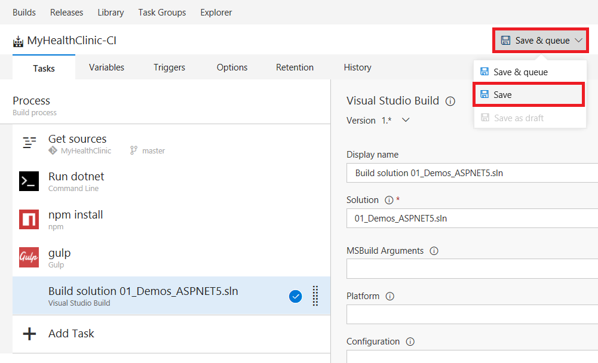

1. You will see the build waiting to find an agent to run. It may take a couple of minutes and it once gets an agent, the build starts executing. You can see the output logs in real-time as the build is running. You can also download the log later should you need to a deeper analysis.

    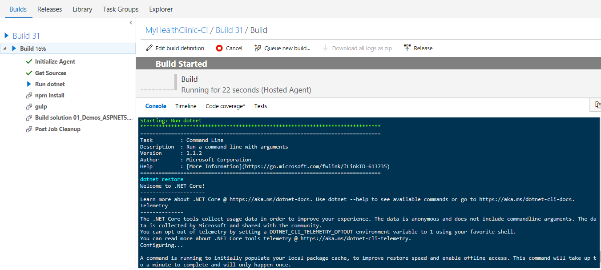

1. Once all the steps are completed, you can select the *Build number* on the top to get the detailed information on the run. The **Summary** tab shows the summary of the run including the who triggered it, at what time, what code and commit was fetched, associated work items, tests, etc.

    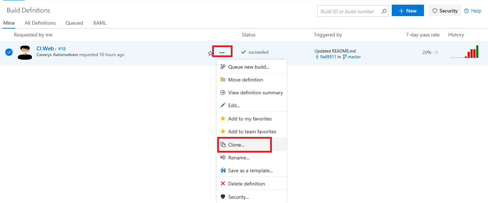

1. The **Timeline** view will help you find out how much time did every task to run. If the build definition included publish task and if any files were published, you can find it from the **Artifacts** tab.

   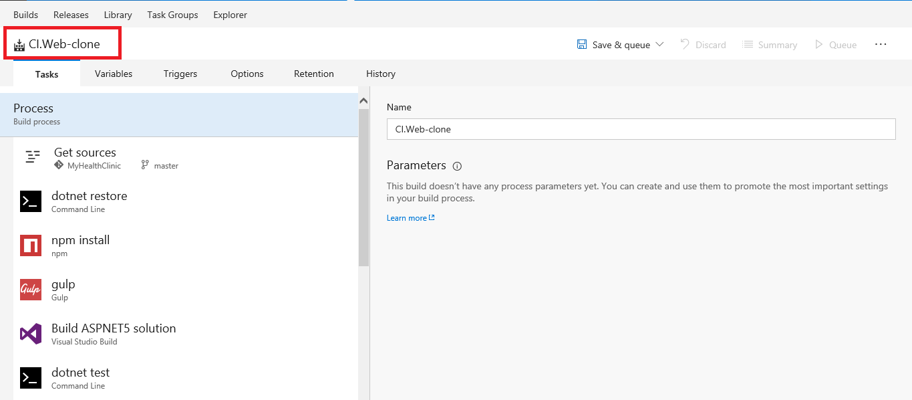

We will now see how you can deal with variables, setup different trigger mechanisms, etc on the build.

## Exercise 2: Defining attributes for the build definition

1. Go to your **Build** from your VSTS account.

1. Edit the build definition and click on **Options**.

   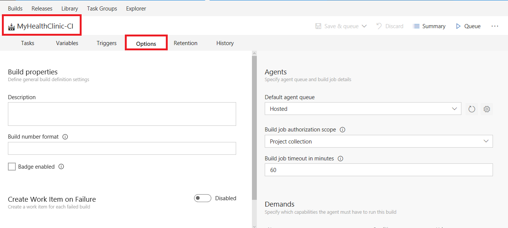

   **Description:** If you specify a description here, it is shown near the name of the build definition when you select it in the Build area of your team project.

   **Build number format:** If you leave it blank, your completed build is given a unique integer as its name. But you can give completed builds much more useful names that are meaningful to your team. You can use a combination of tokens, variables, and underscore characters.

   **Default agent queue:** Select the queue that's attached to the pool that contains the agents you want to run this definition.
   To build your code or deploy your software you need at least one agent, and as you add more code and people, you'll eventually need more.

   **Build job authorization scope:** Specify the authorization scope for a build job. **Project Collection**, if the build needs access to multiple team projects.

   **Demands:** Use demands to make sure that the capabilities your build needs are present on the build agents that run it. Demands are asserted automatically by build steps or manually by you.

1. Click on **Triggers**. On the Triggers tab you specify the events that will trigger the build. You can use the same build definition for both CI and Scheduled builds.

   **Continuous integration (CI):** Select this trigger if you want the build to run whenever someone checks in code.

   **Batch changes:** Select this check box if you have a lot of team members uploading changes often and you want to reduce the number of builds you are running. If you select this option, when a build is running, the system waits until the build is completed and then queues another build of all changes that have not yet been built. If you are using batched changes, you can also specify a maximum number of concurrent builds per branch.

   **Branch filters:** You can specify the branches where you want to trigger builds. You can use wildcard characters.

   **Path filters:** You can also specify path filters to reduce the set of files that you want to trigger a build.

   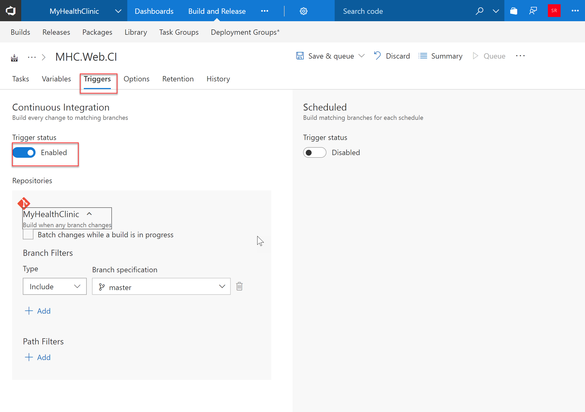

1. Click on **Scheduled**. Select the days and time when you want to run the build and configure accordingly.

   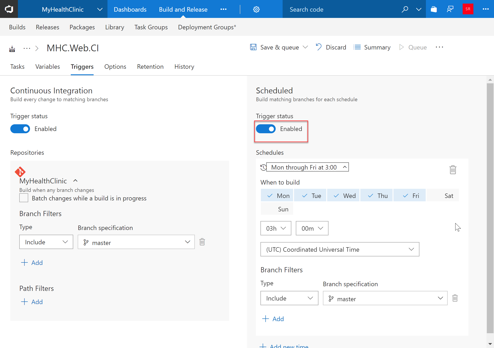

1. Click on the **Retention** tab. In most cases you don't need completed builds longer than a certain number of days. Your retention policies automatically delete old completed builds to minimize clutter. You modify these policies on the Retention tab of your build definition.

1. Click on the **Variables** tab. We can add new user-defined variables.

   - BuildConfiguration: release
   - BuildPlatform: any cpu
   - WebDir: src/MyHealth.Web
   **Secret Variables:** We recommend that you make the variable **Secret** if it contains a password, keys, or some other kind of data that you need to avoid exposing.

   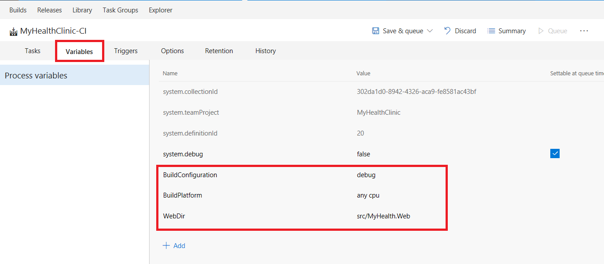

1. Now, modify the build steps to use the new variables. Click on the **npm** task and use the **WebDir** variable in the working directory property.

   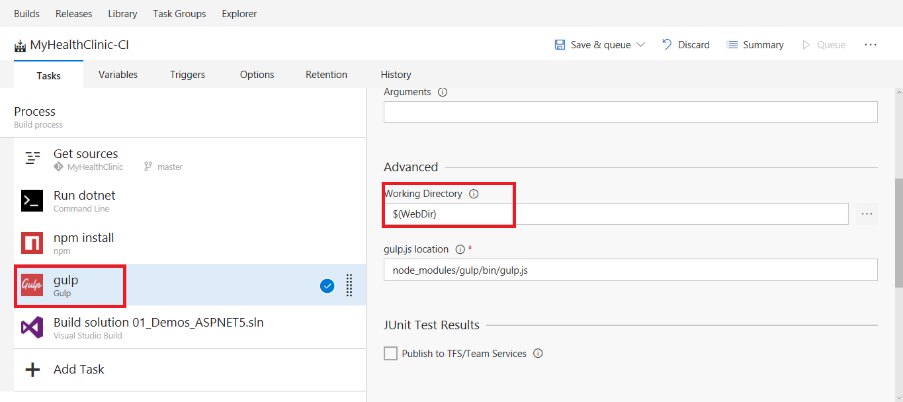

1. Save the build.

## Exercise 3: Working with Artifacts

An artifact is a deployable component of your application. Visual Studio Team Services has the ability to explicitly manage the content of artifacts during a build.

1. Go to the build definition and select the **Publish** task. Note that the task has two properties:

    - **Publish Web Projects** - When selected, the task will try to find the web projects in the repo and run publish command on them. A presence of *wwconfig* file or *wwwroot* folder is used to identify web projects

    - **Zip Published Projects** - When this option is selected, the folder created by the publish command is zipped

    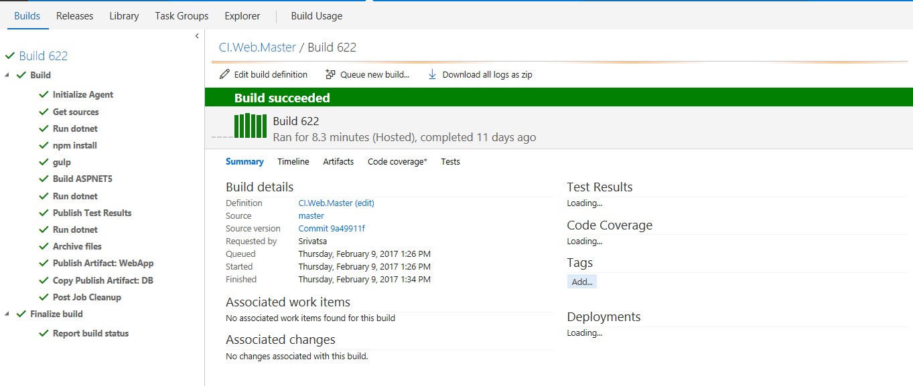

1. Save and queue the  build. Once the build is completed, go to the build summary and select the **Artifacts** tab. Select the **Explore** button to view the published artifacts.

   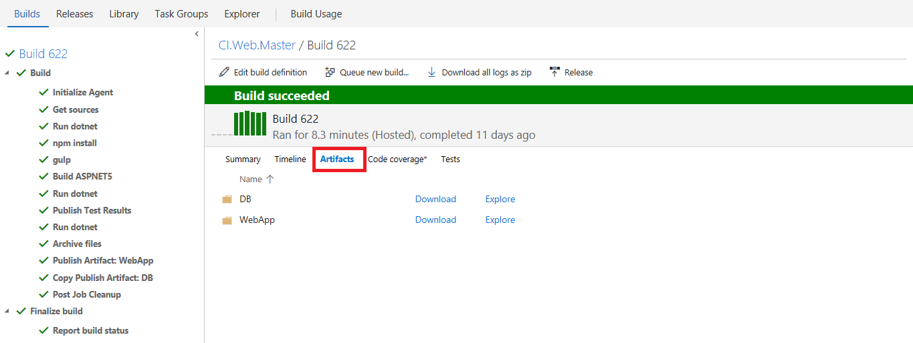

1. Expand the drop folder and you should see **MyHealth.Web.zip** file created in the folder.

   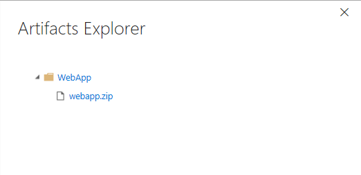

1. We will need the zip file for deployment. We will cover that in the ***Continious Delivery*** lab.

## Exercise 4: Running Tests with Build

It's always a good practice to run tests with your build to verify the integration. The ***MyHealth.API.IntegrationTests*** project contains the unit tests.

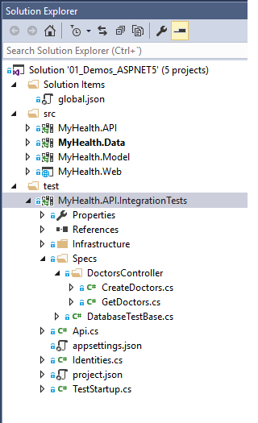

If you open the My Health Clinic solution in Visual Studio, you will see the following test cases in the "Test Explorer" window.

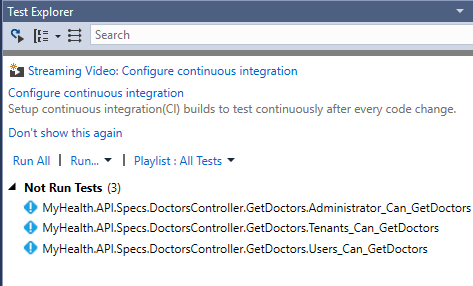

The **Test** task that we have in the build defintion will need to be modified to point to the test projects in the repository.

1. Go to your build definition and select edit.

1. Select the **Process** task. Change the *Project(s) to test* parameter as follows:

   - **Projects to test**: test/MyHealth.API.IntegrationTests/*.csproj

   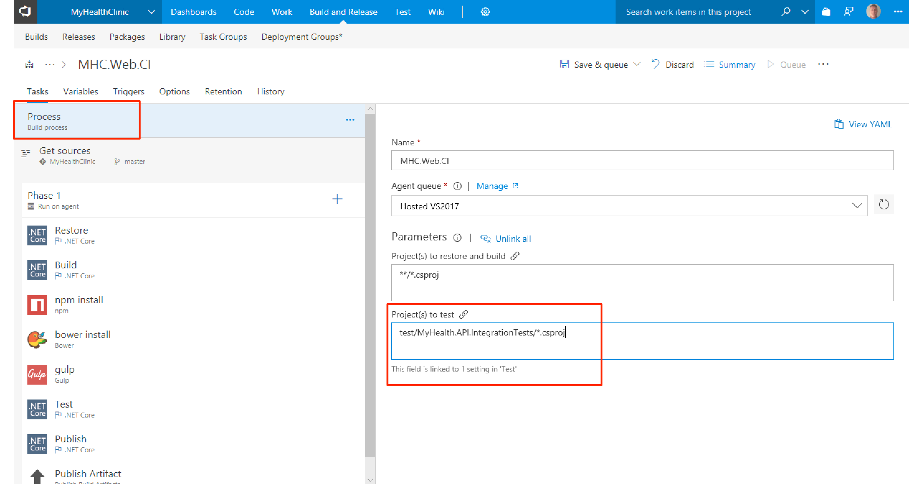

1. Select the **Test** task. Change the *Arguments* parameter as follows:

   - **Arguments**: --configuration $(BuildConfiguration) --logger "trx;LogFileName=TestResults.xml"

   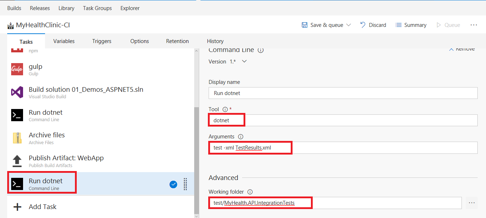

1. We will use the **Publish Test Result** task to publish the results of the tests to the Build summary section. Add the task and change the parameters as follows:
    - Test Result Format: VSTest
    - Test Results Files: **/TestResults.xml
    - Always run: true - to be sure that the results are published when the unit tests fail.

   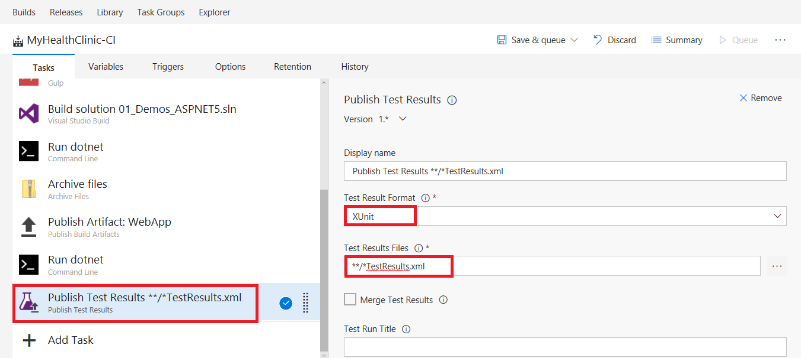

   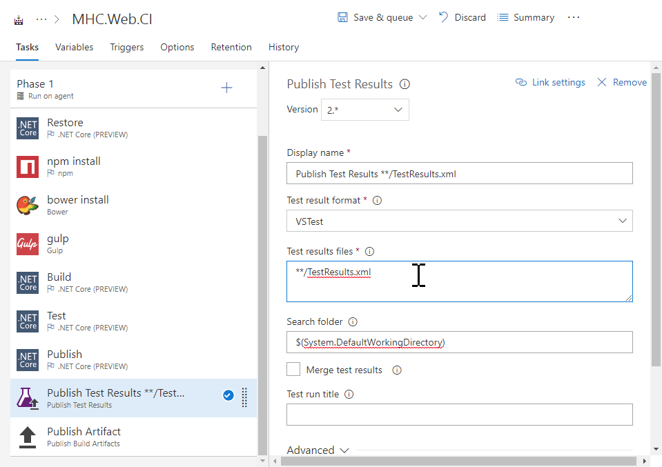

1. Save the build and queue.

1. You should see the build summary showing along with Test results.

   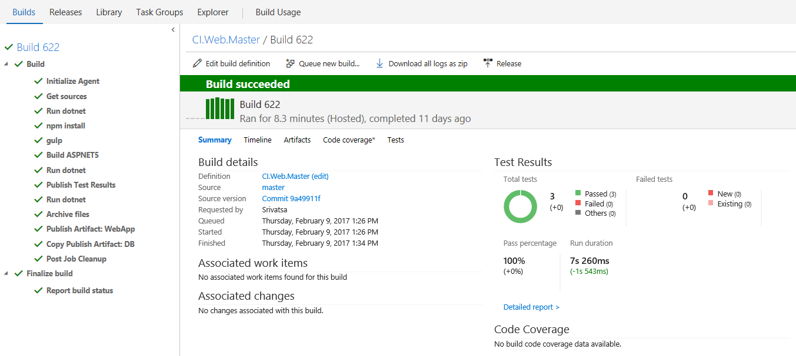

1. Click on **Test** to view detailed summary of Test Results. Make sure that you selected *All* for the **Outcome** filter.

   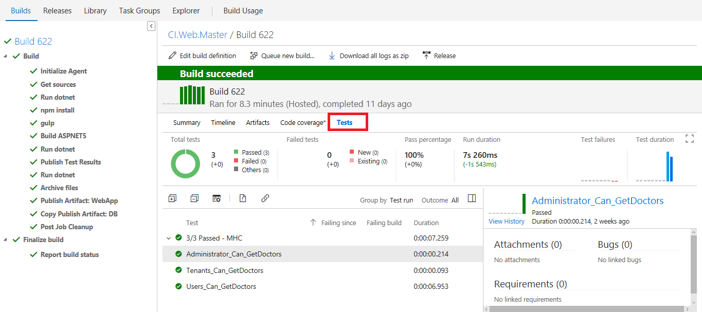

1. We now have an automated CI build with automated tests that wil run every time a change is committed and verify the changes are not breaking the code. The next lab will cover **Continuous Delivery (CD)** - the ability to release frequently and consistently into various environments including dev, staging, production.
