## Overview

Visual Studio Team Services simplifies <a href="https://www.visualstudio.com/en-us/docs/build/overview/">Continuous integration</a> for your applications regardless of what platform you are targeting, or what language you are using.

- Build on Linux, Mac, and Windows.

- Use multi-platform build agents for Android, iOS, Java, .NET, and other applications.

- Seamless integration with work, test, code, build, and release.

- Track your builds with real-time build status.

When many developers collaborate on complex software projects, it can be a long and unpredictable process to integrate different parts of code together. However, you can make this process more efficient and more reliable if you build and deploy your project continuously.

Continuous integration (CI) is the process of integrating your code into a shared repository as frequently as possible. During code integration, a build break or a test failure can inform you, in a timely manner, of an error in your code.

## Pre-requisites

In order to complete this lab you will need- 

- **Visual Studio Team Services account**. If you don't have one, you can create from <a href="https://www.visualstudio.com/">here</a>

- **Visual Studio 2017** or higher version

- You can use the **[Visual Studio team Services Demo Data generator](http://vstsdemogenerator.azurewebsites.net/Environment/Create)** to provision a project with pre-defined data on to your Visual Studio Team Services account. Please use the ***My Health Clinic*** template to follow the hands-on-labs.

If you are not using the VSTS Demo Data Generator, you can clone the code from this [GitHub repository](https://github.com/Microsoft/myhealthclinic2017)

## Exercise 1: Build ASP.NET CORE

ASP.NET Core is a lean and composable framework for building web and cloud applications. Here we'll show you how to automatically build the **HealthClinic ASP.NET Core** application.

If you have provisioned your project using the demo generator, you will notice the build definition already existing in your project. You can follow the labs without adding or modifying the tasks to understand how a build pipeline works in VSTS. Otherwise, you can follow the steps to create a new one. 

### Task1 : Creating New Build Definition

1. From your VSTS account overview page, select your team project. 

2. Click **Build and Release** tab and select **Builds**.

3. Click on **New** to create build definition.

   

4. You can start by selecting a template that will add a set of tasks and apply typical settings for the kind of app that you are building or start with an empty process and build from scratch. There is a template available for building ASP.NET Core apps. We will use that. Select  **ASP.NET Core (PREVIEW)**  and click apply to apply the template for the build definition 

   

5. As you can see, the template has applied a set of tasks that are typically involved in building an ASP.NET Core app. In many cases, you might not require to do anything further other than just pointing to the correct repo and branch and you will be good to go. In this case, you will need to make some customizations to the build. Select the **Get sources** task.  You can fetch your code from various source including ***GitHub, SVN, or any other Git repository*** but since you have our code in the VSTS project itself, select **This Project**. Change the repository and branch if it is not pointing to the correct ones.

   

6. The next tasks **Restore** needs no change. Leave it as it is. 

7. The My Health Clinic web application depends on node components and additional libraries. You will need to add tasks to download and install these packages before it can be built. We will see how to add tasks to our build definition in the next task.

### Task 2: Adding Build Tasks

1. Select **Add Task** and then select **Package** to find tasks relating to the category. Select **npm** and click **Add**

    
2.   Change the *working folder* to ***src/MyHealth.Web***. The project has the json file which the npm install command will require to know what packages needs to be installed.
    
   
3. Next, you will need to run *bower* to install the web packages. Select **Add Task** and select the **Package** tab. You can run bower commands using the **Command Line/Shell Script** utility but a better way to do that would be is to use the **Bower** task. This task is not out-of-the-box and needs to be installed from the Marketplace.

4. From an another tab, navigate to the [Bower extension page](https://marketplace.visualstudio.com/items?itemName=touchify.vsts-bower) on the Marketplace and install it. Close the tab when you are done.

5. Back in tab where you are editing the build definition. Save the build definition and refresh the page. You should see the **Bower** task under the *Package* tab. Select the task and click **Add**

    

6. Select the **Bower** task and change the *Bower JSON Path* to point to the *bower.json* file under the MyHealth.Web folder

    

7. Next you will need the **gulp** task. Select **Add Task** and look for the **Gulp from the **Build** section. Add that to the build definition. 

    

8. Change the *Gulp file path* to point to the gulp file under the MyHealth.Web folder

    

9. The rest of the tasks do not need any change. You are ready to run the build. 11. You can make the builds to run as a *Continuous Integratoion* build so that it runs upon every check-in on the branch. We will see that later in the lab. For now, we will run it manually.

10. Select **Save & queue** to save the build definition and queue the build immediately. If you have already saved the build definition, select **Queue** from the menu

    

11. You will need to select the build agent where you want to run this build. You can choose to run the builds on an-premise agent or use the agents hosted on Azure. We will use the **Hosted VS2017** agent as it has the .NET core framework and all other components that are required to build the app. Select **Queue**

    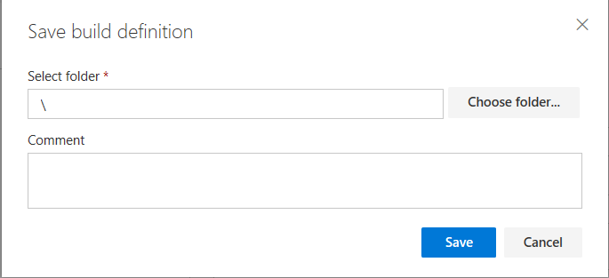
         
12. You will see the build waiting to find an agent to run. It may take a couple of minutes and it once gets an agent, the build starts executing. You can see the output logs in real-time as the build is running. You can also download the log later should you need to a deeper analysis.

    

13. Once all the steps are completed, you can select the *Build number* on the top to get the detailed information on the run. The **Summary** tab shows the summary of the run including the who triggered it, at what time, what code and commit was fetched, associated work items, tests, etc., 

    

14. The **Timeline** view will help you find out how much time did every task to run. If the build definition included publish task and if any files were published, you can find it from the **Artifacts** tab.
   
       

We will now see how you can deal with variables, setup different trigger mechanisms, etc on the build. 

## Exercise 2: Defining attributes for the build definition

1. Go to your **Build** from your VSTS account.

2. Edit the build definition and click on **Options**.

   

   > **Description:** If you specify a description here, it is shown near the name of the build definition when you select it in the Build area of your team project.

   > **Build number format:** If you leave it blank, your completed build is given a unique integer as its name. But you can give completed builds much more useful names that are meaningful to your team. You can use a combination of tokens, variables, and underscore characters.

   > **Default agent queue:** Select the queue that's attached to the pool that contains the agents you want to run this definition.
   To build your code or deploy your software you need at least one agent, and as you add more code and people, you'll eventually need more.

   > **Build job authorization scope:** Specify the authorization scope for a build job.
    **Project Collection**, if the build needs access to multiple team projects.

   > **Demands:** Use demands to make sure that the capabilities your build needs are present on the build agents that run it. Demands are asserted automatically by build steps or manually by you.

3. Click on **Triggers**. On the Triggers tab you specify the events that will trigger the build. You can use the same build definition for both CI and Scheduled builds.

   > **Continuous integration (CI):** Select this trigger if you want the build to run whenever someone checks in code.

   > **Batch changes:** Select this check box if you have a lot of team members uploading changes often and you want to reduce the number of builds you are running. If you select this option, when a build is running, the system waits until the build is completed and then queues another build of all changes that have not yet been built. If you are using batched changes, you can also specify a maximum number of concurrent builds per branch.

   > **Branch filters:** You can specify the branches where you want to trigger builds. You can use wildcard characters.

   > **Path filters:** You can also specify path filters to reduce the set of files that you want to trigger a build.

   

4. Click on **Scheduled**. Select the days and time when you want to run the build and configure accordingly.

   
   
1. Click on the **Retention** tab. In most cases you don't need completed builds longer than a certain number of days. Your retention policies automatically delete old completed builds to minimize clutter.
   You modify these policies on the Retention tab of your build definition.
<!-- 5. Click on the **Variables** tab. We can add new user-defined variables.

   > - BuildConfiguration: debug
   > - BuildPlatform: any cpu
   > - WebDir: src/MyHealth.Web
   > **Secret Variables:** We recommend that you make the variable **Secret** if it contains a password, keys, or some other kind of data that you need to avoid exposing.

   

6. Now, modify the build steps to use the new variables. Click on the **Visual Studio Build** task from your build definition.
   Update the task to use the new variables.

   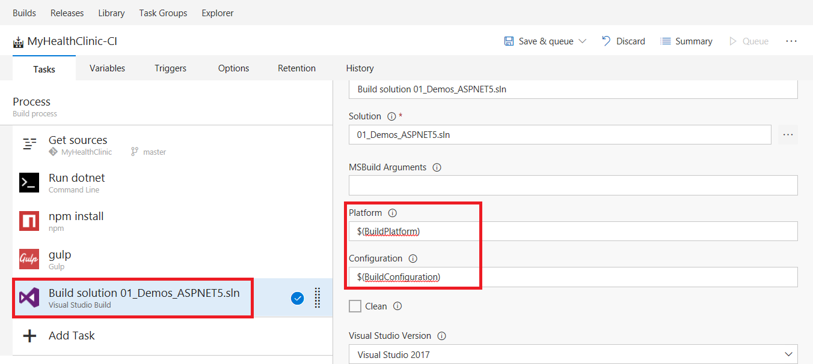

7. Click on the **gulp** task and use the **WebDir** variable in the working directory property.

   

8. At the beginning of the build process, the build agent downloads the files from your remote repository into a local sources directory. After you select the repository, you can specify options for how the files are downloaded.

   > You can build code from different repos: Git, GitHub, Subversion and External Git.
   > - **Repository:** Select a repository in your team project.
   > - **Default branch:** Select the branch that you want to be the default when you manually queue this build.
   
   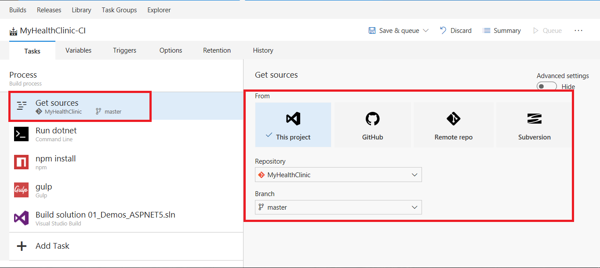

  -->

## Exercise 4: Working with Artifacts

An artifact is a deployable component of your application. Visual Studio Team Services has the ability to explicitly manage the content of artifacts during a build. 

1.  Go to your **Build** Definition and edit. Click on **Add Task** ti add few tasks.

2.  Add **Command Line** task from the **Utility** section and update its properties.
    - Tool: dotnet
    - Arguments: publish -c $(BuildConfiguration) $(WebDir)/project.json

    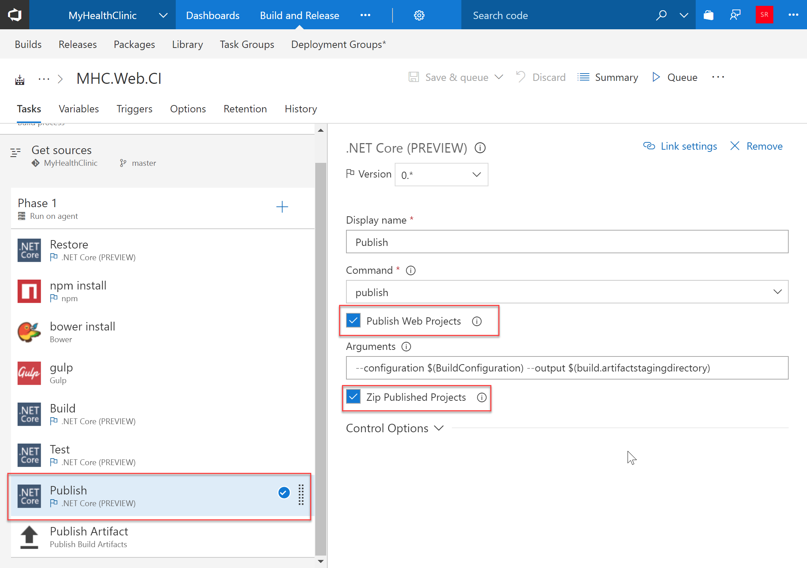

3. Add **Archive Files** task from the **Utility** section and update its properties to zip the project output.
    - Root Folder: $(Build.SourcesDirectory)\$(WebDir)\bin\$(BuildConfiguration)\netcoreapp1.0\publish
    - Prefix root folder name to archive paths: Uncheck this option.
    - Archive File to create: $(Build.SourcesDirectory)\$(WebDir)\bin\webapp.zip

   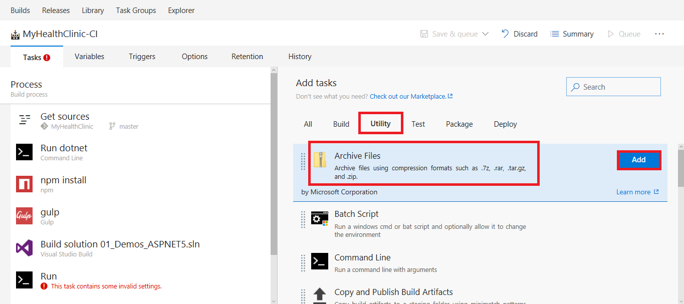

   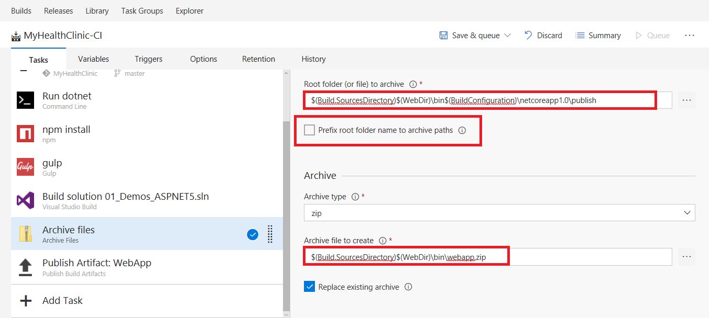

4. Add **Publish Build Artifacts** task from the **Utility** section and update its properties to publish the web project.
    - Path to publish: $(Build.SourcesDirectory)\$(WebDir)\bin\webapp.zip
    - Artifact Name: WebApp
    - Artifact Type: Server
   
   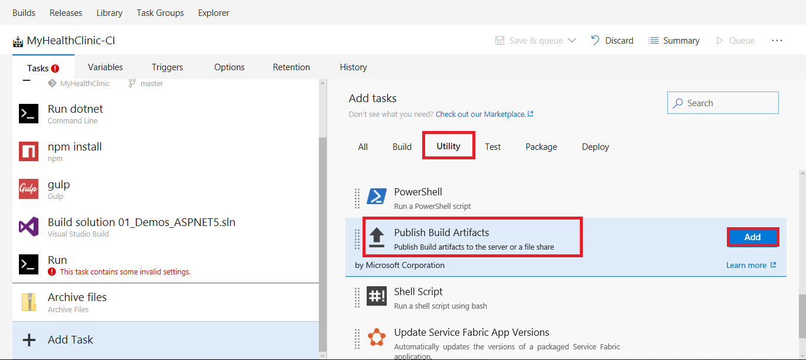

   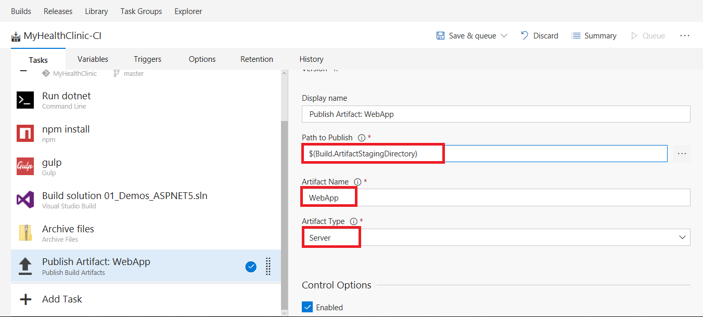

5. Click **Save and Queue** build. 

6. You should see the **Build Summary** once completed.

   

7. Click on **artifacts** to view the packaged content.

   
   
   

8. The webapp artifact contains the application files ready to be deployed.
   

## Exercise 5: Running Tests with Build

Make sure your app still works after every commit and build using VSTS. Find problems earlier by running tests automatically with each build. When your build is done, review your test results to start resolving the problems that you find.

Your build definition includes a test task that runs unit tests. For example, if you're building a Visual Studio solution in Team Services, your build definition includes a Visual Studio Test task. After your build starts, this task automatically runs all the unit tests in your solution on the same build machine.

>**Note**- HealthClinic uses ASP.NET core so you need to use the dotnet tool to run the tests.

1. Go to your build definition and edit. 

2. Add **Command Line** task from the **Utility** section and update its properties.
    - Tool: dotnet
    - Arguments: test -xml TestResults.xml - the test command is defined in the unit test project.
    - Working Folder: 

    > The dotnet test command is used to execute unit tests in a given project. Unit tests are class library projects that have dependencies on the unit test framework (for example, NUnit or xUnit) and the dotnet test runner for that unit testing framework. These are packaged as NuGet packages and    are restored as ordinary dependencies for the project.
        
   

   > Test projects include a test runner property in project.json using the "testRunner" node. This value should contain the name of the unit test framework.

   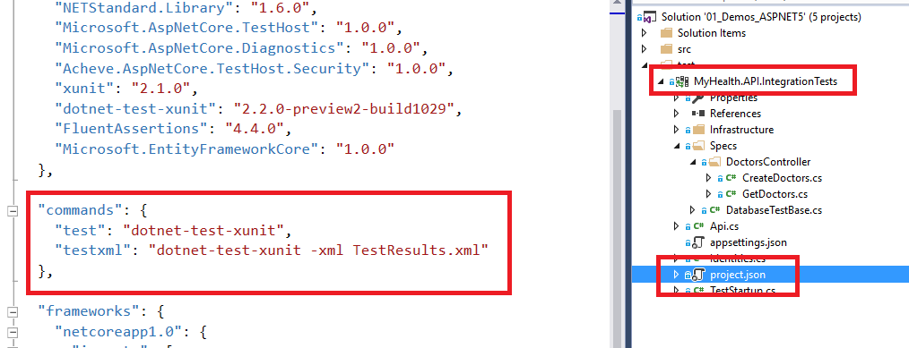

3. Add **Publish Test Result** task from the **Test** section and update its properties.
    - Test Result Format: XUnit
    - Test Results Files: **/*TestResults.xml
    - Always run: true - to be sure that the results are published when the unit tests fail.

   

4. Save the build and queue.

5. You should see the build summary showing along with Test results.

    

6. Click on **Test** to view detailed summary of Test Results.

   

7. You can fail tests by injecting the code into your project as shown below. Go to your Visual Studio. Expand **MyHealth.API.IntegrationTests** project. 

8. Click on **GetDoctors.cs** and modify the assert of the unit test **Administrator_Can_GetDoctors**.

   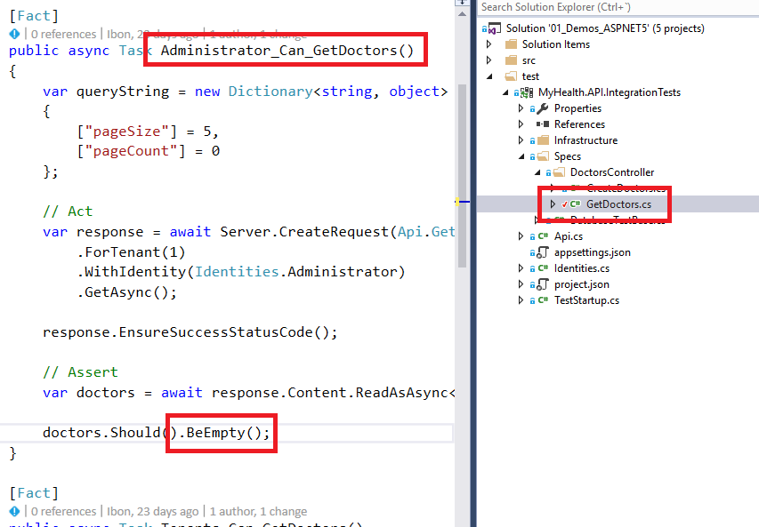

9. Commit and Sync the changes.

   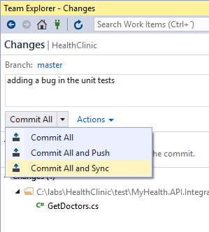

10. Post build, review the summary for your test run results, including a comparison between the current build and the last build.

    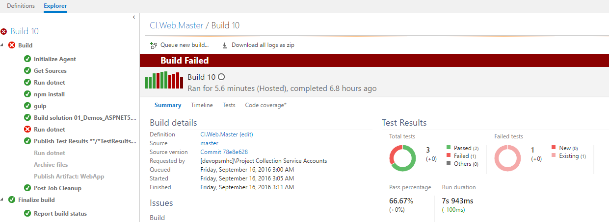

    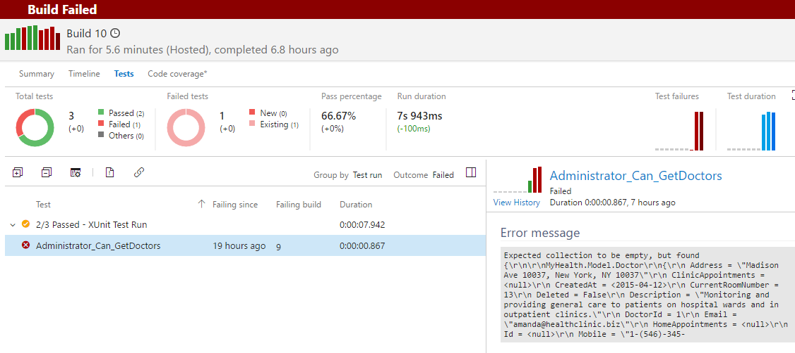

11. The Test duration and failure graphs are also shown.

    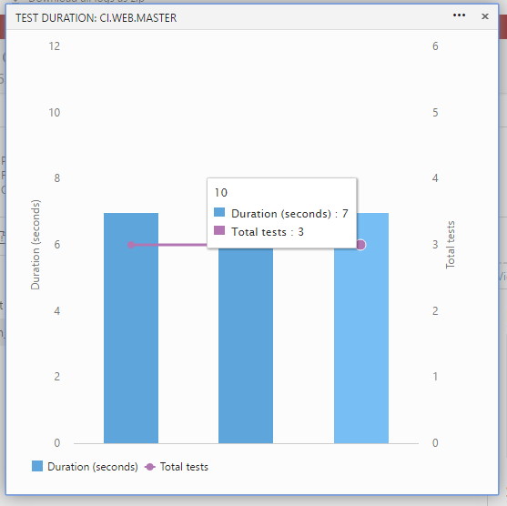

    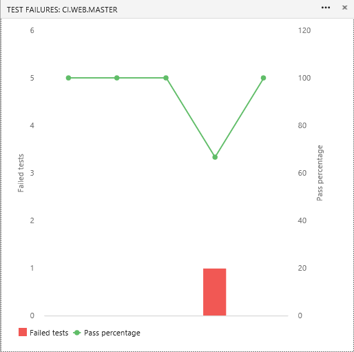

11. You can create a bug from the failed tests so that it gives us the complete Stack Trace to reproduce the issue.

    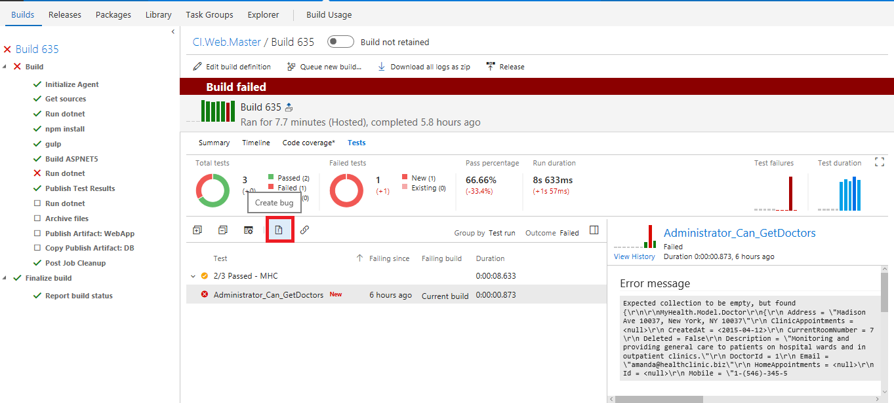

    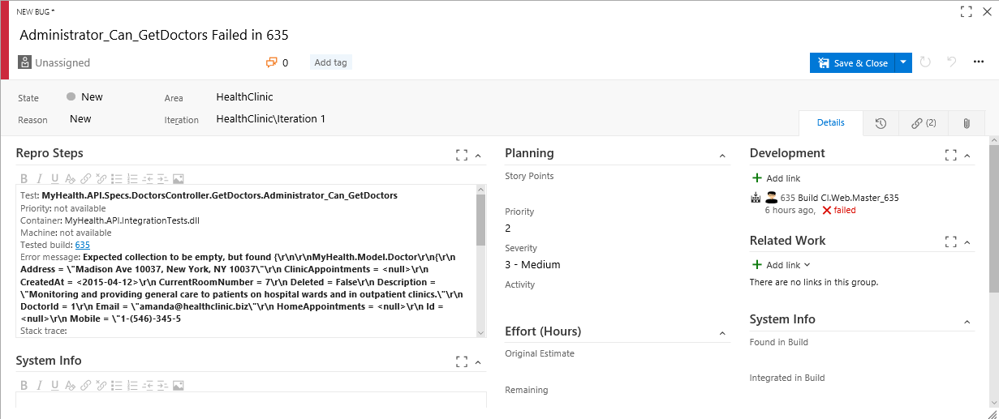

12. You can also organize your test results using the group and outcome lists. You'll find changes in new, failed, and passed tests, how long these tests took to run, how long these tests have been failing, and more.
    
    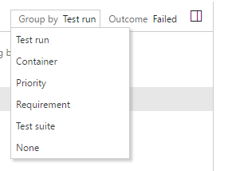

    

13. To start debugging a failed test, open it and review the resulting error and stack trace.

    

14. Revert back the changes done and commit so that you have a clean build summary with all passed tests.
   

   
