## Overview

Delivery Plans help drive alignment by overlaying backlogs from different teams onto a shared sprint schedule. As you assemble a Delivery Plan to meet your needs, add details from your work items (state, tags, additional fields, etc.) along with visual date markers highlighting important events and milestones.

## Pre-requisites

In order to add and configure a plan, you must have the following in place: 

- Delivery Plan Extension

- Be granted Basic access in Team Services (Users with Stakeholder access can't add or view plans)

- Defined iteration paths for the team project

- Configured teams and set team defaults and team sprints

- Teams have defined user stories, features, or other product or portfolio backlogs and assigned them to iterations

## Adding Delivery Plan Extension to the VSTS account

1. Go to <a href="https://marketplace.visualstudio.com">Visual Studio MarketPlace</a>

   

2. Search for **Delivery Plans** in the search box and click on **install**

   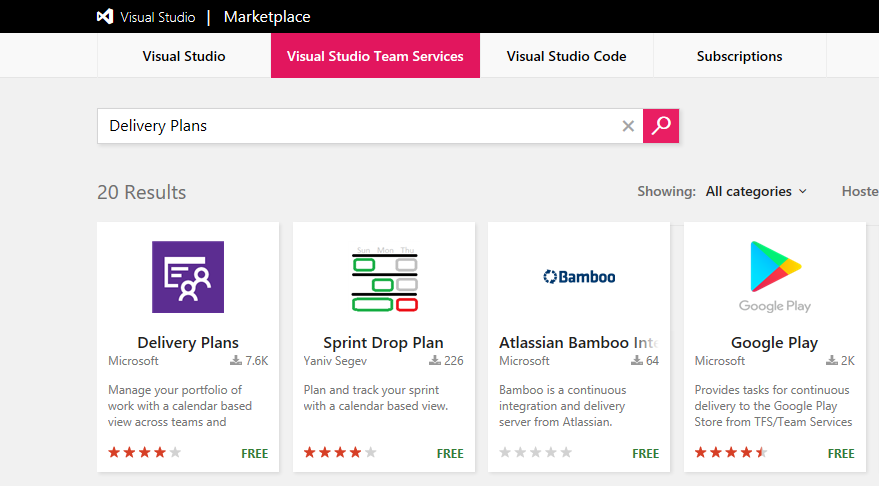

   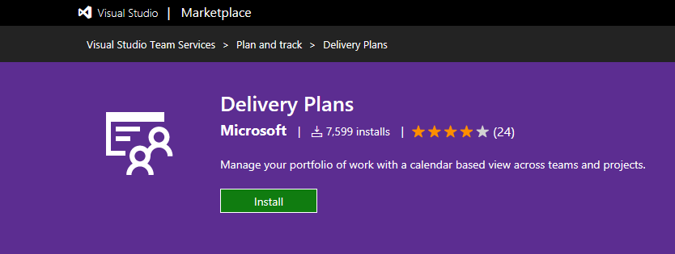

3. Select the desired account to be installed and click continue to proceed with the installation.

   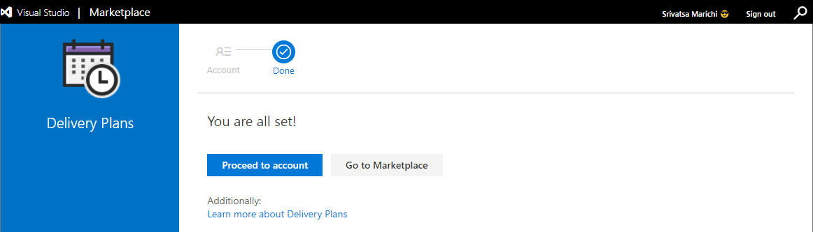

## Add a Plan

1. From your VSTS account, go to **Plans** page that appears under **work hub**

   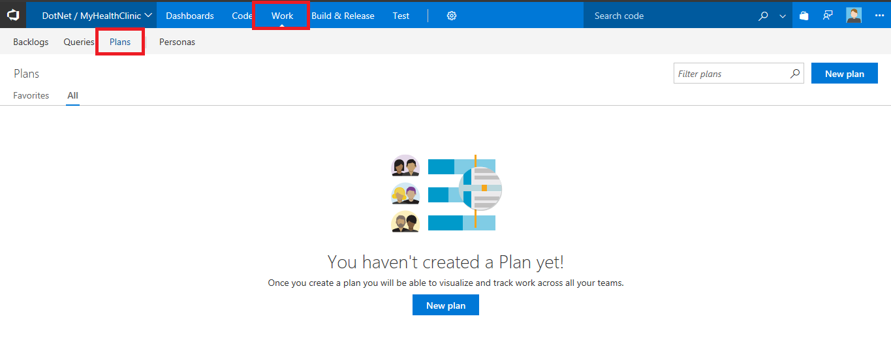

2. To add a plan, click **New Plan** from the Plans page

   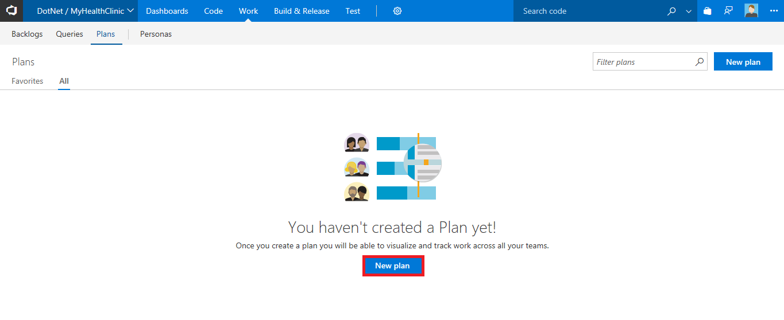

   >All users, except users assigned Stakeholder access, have permissions to create a plan and manage the plans they create. 

3. Fill in the form to name, describe, and specify the team backlogs that you want to appear within your plan.

   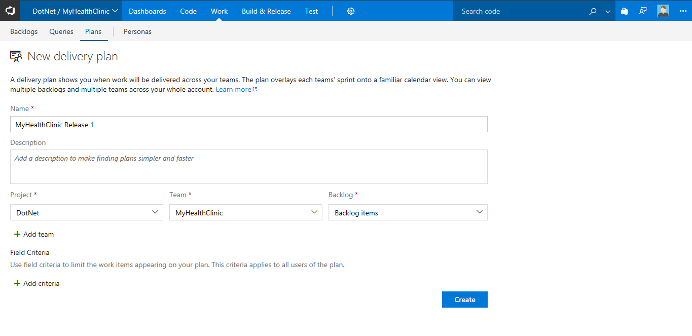

   When defining a plan, note the following: 

   - Use the name and description field to clearly identify your plan within the project

   - You can choose one or more teams from any team project defined in the account or collection 

   - You can choose one or more active backlogs for a team

   - The order in which you enter the teams and team backlogs defines the order in which they'll appear in the plan

   - To limit the number or types of work items, specify the field criteria

4. Click on **create**. You should now see the plan which is created.

   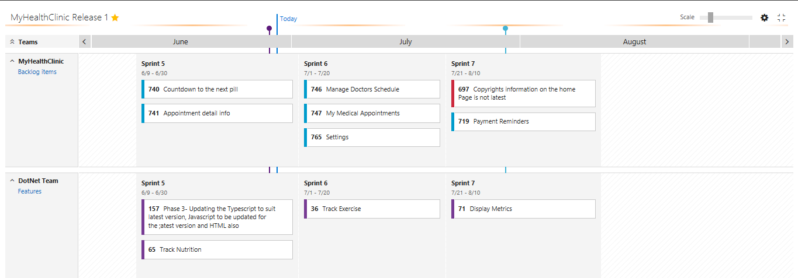

## Edit a plan, add field criteria, customize cards, and add markers

Once you've defined a plan, you can further customize it. 

1. Click the  gear icon to open the Settings dialog.

   

2. Then, click the page you want to edit. You can customize the plan in the following ways:

   - Edit the teams you've selected and their backlog level

   - Set field criteria to further limit the work items that will appear on the plan

   - Add markers to show important upcoming events on your timeline

   - Customize the fields that display on the cards, similar to how you customize them for your Kanban or task board

   Here, we add the **Effort** field criteria. Only work items that contain the effort greater than 5 will appear in the Delivery Plan.

   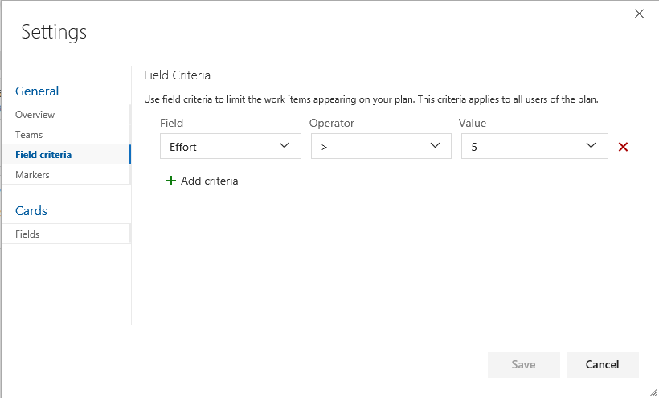

3. To set a marker, open the **Markers page**, specify a date and select a color.

   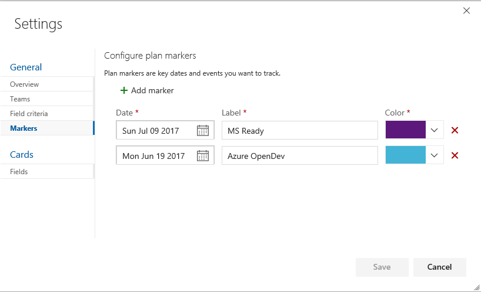

   Markers appear on the plan as shown: 

   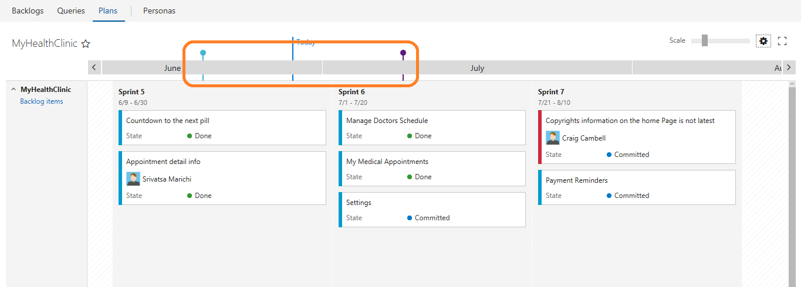

4. To configure the information shown on cards, click on the gear icon and go to **Fields** under the cards section. Add additional fields if required. For example add a field **AreaPath**. The work items show the information related to the areapath that belongs to.

   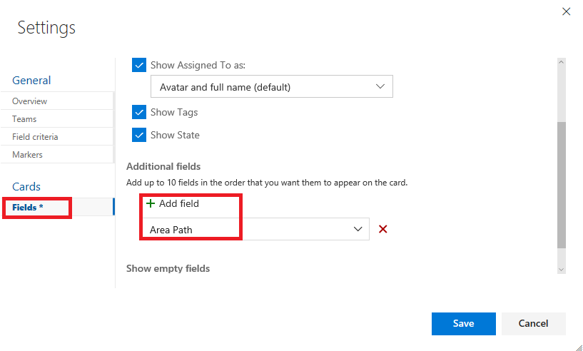

5. To quickly change the cards to only show their Title, enter the keyboard shortcut **t**. This will hide all other fields, as shown in the following image, the Assigned to field no longer appears. To persist this view, edit the plan's settings for card fields.

   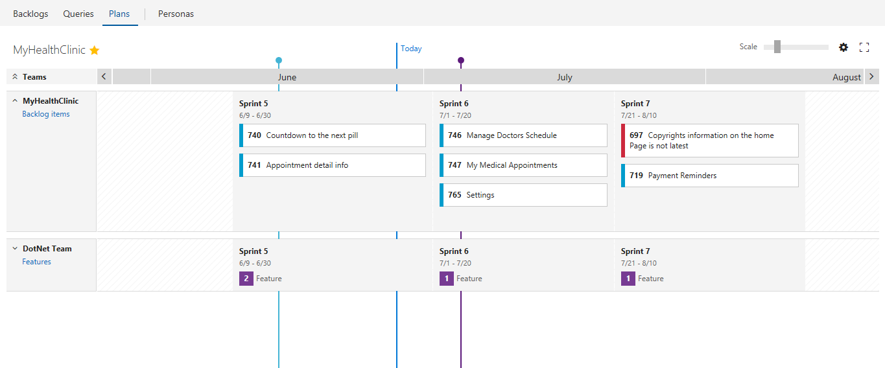

6. As changes occur to the schedule, you you can update the iteration for a backlog item by moving a card to a different iteration. This will help to drive alignment across your organization.

   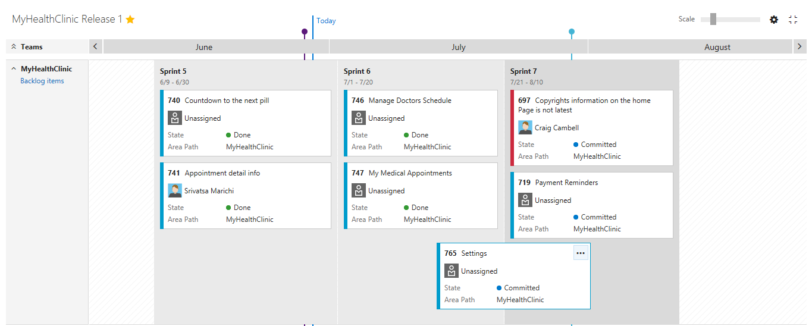

7. To gain a summary view of work that is schedule, collapse all teams. You can then more easily look for gaps in the forward forecast.

   For example, here you can see the count of Backlogs for MyHealthClinic Team for the next 3 sprints. You can collapse/expand team rows by clicking the team name or the sprint name.

   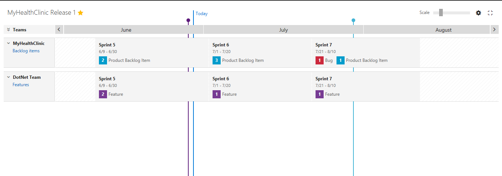

8. Delivery Plans show the scheduled work items by sprint (iteration path) of selected teams against a calendar view to ensure your teams are aligned with your organizational goals.

   For example, here you can see the features and backlogs of multiple teams that are delivered and are in progress states. This gives the teams heads up as to how many features/backlogs are delivered in the current sprint.

   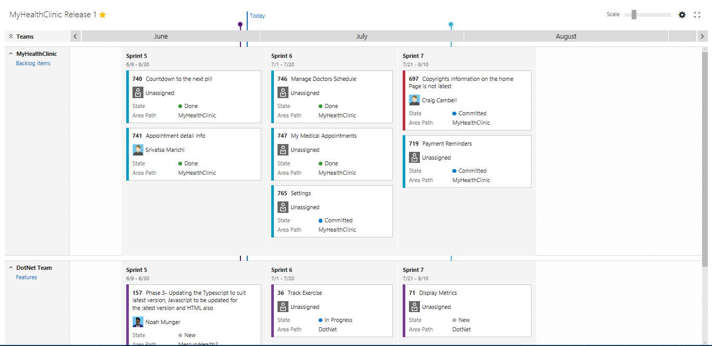 

## Interactive elements of plans

Each team's backlog specified in a Delivery Plan appears as a row within the plan view. When collapsed, a roll-up of the backlog items shows. When expanded, a card for each backlog item appears, organized by their assigned iteration.

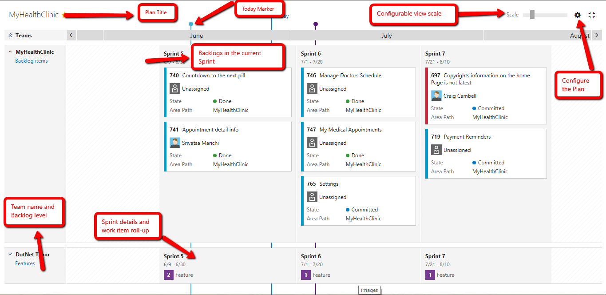

You can interact with the plan in the following ways: 

- Scale the size of the cards (enter + or - to also scale)

- Scroll the view horizontally via the calendar to view previous months or future months (Enter Shift-left or Shift-right to scroll)

- You can also scroll the plan via click and dragging your mouse

- Scroll the view vertically to view teams that appear lower within the plan view

- Click a card to view the details of a backlog item

- Expand or collapse a single team row to view details for that team by clicking the team name or team sprint

- Expand and collapse all team rows (Enter **u** to collapse, **o** to expand all rows)

- Enter **t** to quickly toggle fields shown on cards to just the Title or all other card field settings

- Click the settings gear to edit the plan and change the fields displayed on the cards

In the following example, MyHealthClinic Team backlogs expanded, two items are scheduled for delivery in Sprint 5.

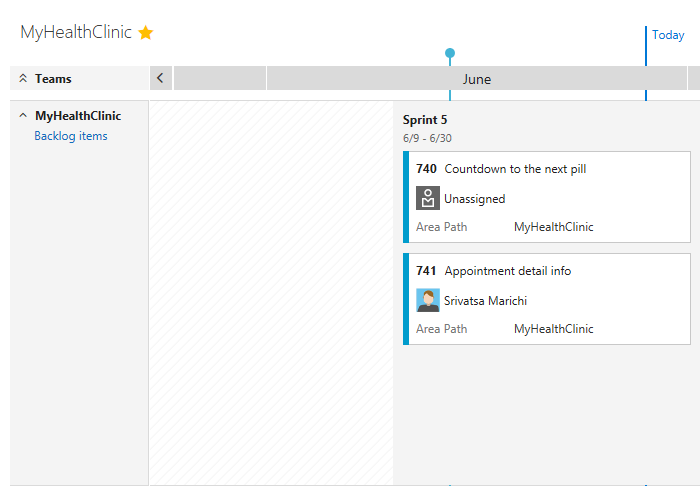

You can also quickly see that: 

- MyHealthClinic Team is currently working on Sprint 5 deliverables

- Sprint 5 began on June 6th and is scheduled to end June 30th

- The team expects to deliver the two backlogs shown by the cards

A benefit of Delivery Plans is to view multiple teams across your projects that you care about. Two main ways to view more teams within the plan view is to collapse all teams to focus on summary data and to minimize the number of fields displayed on cards.

