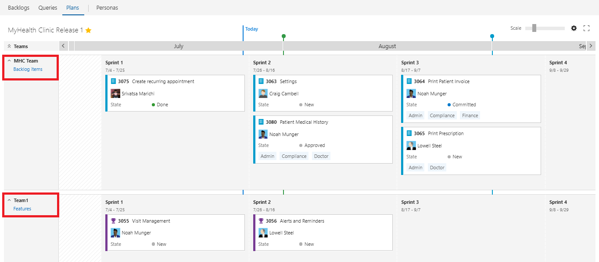
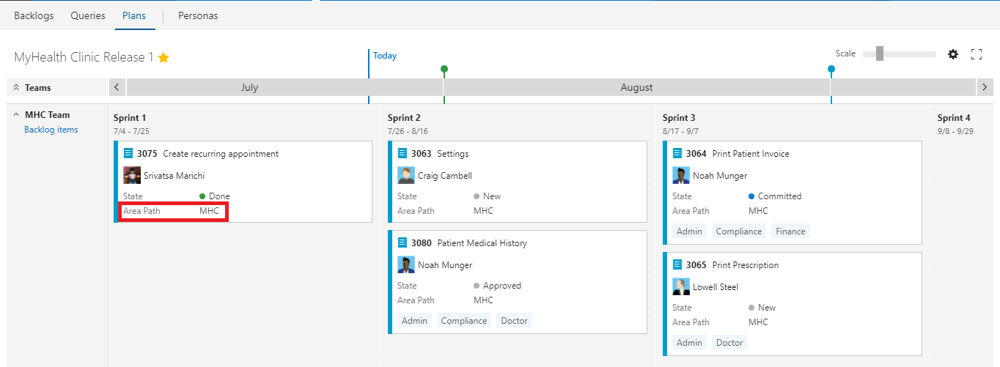

## Overview

It takes several teams to develop large software projects. Very large projects require multiple autonomous teams that can manage their own backlog and priority while contributing to a unified direction for that project. Regular reviews of the project schedule with these teams help ensure that the teams are working toward common goals. Delivery Plans provide the needed multi-team view of your project schedule.

Delivery Plans provides an easier way to see work across teams and projects. Available as an extension, Delivery plan makes it easy for you to review the schedule of stories or features your teams plan to deliver . You can see scheduled work items by sprint (iteration path) of selected teams against a calendar view.

## Pre-requisite

- You will need to install the Delivery Plan extension to your VSTS account in order to continue this lab

## Installing delivery plans extension

1. Go to <a href="https://marketplace.visualstudio.com">Visual Studio MarketPlace</a>

   

2. Search for **Delivery Plans** in the search box and click on **install**

   

   

3. Select the account to which you want to install the extension and click **Install** to proceed with the installation.

   

## Creating a Delivery Plan

1. From your VSTS account, go to **Plans** page that appears under **Work** hub.

   

2. To add a plan, click **New Plan** from the Plans page

   

   >All users, except users assigned Stakeholder access, have permissions to create a plan and manage the plans they create. 

3. Provide a name for the plan **MyHealth Clinic Release 1**. Select the project, team and the backlog to appear in your plan.

   
   
4. Click on **create**. You should now see the plan which is created.

   

## Customizing the plan

Once you've defined a plan, you can further customize it. 

1. Click the  gear icon to open the Settings dialog.

   

2. You can customize the plan by editing the teams, setting field criteria, adding markers etc.

   Here, we add the **Effort** field criteria. Only work items that contain the effort greater than 5 will appear in the Delivery Plan.

   

   Now you will see all backlog items with effort greater than 5.

   

3. You can add multiple teams and view the backlog items. Go to **Teams** tab from the settings page and click on **Add Team** to add new team. Select the project, team and backlog level as shown and click on save.

   

   You will see multiple teams in your plan now.

   

4. Markers help you to track key dates and events. To set a marker, open the **Markers page**, specify a date and select a color.

   

   Markers appear on the plan as shown: 

   

5. To configure the information shown on cards, click on the gear icon and go to **Fields** under the cards section. Add additional fields if required. For example add a field **AreaPath**. The work items show the information related to the areapath that belongs to.

   

   You can now see the work items along with the area path on the cards as shown.

   

6. To quickly change the cards to only show their Title, enter the keyboard shortcut **T**. This will hide all other fields, as shown in the following image, the Assigned to field no longer appears. 

   

7. As changes occur to the schedule, you can update the iteration for a backlog item by moving a card to a different iteration. This will help to drive alignment across your organization.

   

8. To gain a summary view of work that is schedule, collapse all teams. You can then more easily look for gaps in the forward forecast.

   For example, here you can see the count of Backlogs for MHC Team for the next 3 sprints. You can collapse/expand team rows by clicking the team name or the sprint name.

   

9. Delivery Plans show the scheduled work items by sprint (iteration path) of selected teams against a calendar view to ensure your teams are aligned with your organizational goals.

   For example, here you can see the features and backlogs of multiple teams that are delivered and are in progress states. This gives the teams heads up as to how many features/backlogs are delivered in the current sprint.

    

## Interactive elements of plans

Each team's backlog specified in a Delivery Plan appears as a row within the plan view. When collapsed, a roll-up of the backlog items shows. When expanded, a card for each backlog item appears, organized by their assigned iteration.

In the following example, MHC Team backlogs expanded, 1 item was scheduled for delivery in Sprint 1.

You can also quickly see that: 

- MHC Team is currently working on Sprint 1 deliverables

- Sprint 1 began on July 7th and is scheduled to end July 25th

- The team expects to deliver the backlogs shown by the cards

A benefit of Delivery Plans is to view multiple teams across your projects that you care about.

