## Overview 
The Test & Feedback extension helps teams perform exploratory testing and provide feedback. Everyone in the team, such as developers, product owners, managers, UX or UI engineers, marketing teams, early adopters, and other stakeholders can use the extension to submit bugs or provide feedback and contribute to the quality of your product.

## Pre-requisites

In order to complete this lab you will need-

- **Visual Studio Team Services account**. If you don't have one, you can create from <a href="https://www.visualstudio.com/">here</a>

- **Visual Studio 2017** or higher version

- You can use the **[VSTS Demo Data generator](http://vstsdemogenerator.azurewebsites.net/Environment/Create)** to provison a project with pre-defined data on to your Visual Studio Team Services account. Please use the ***My Health Clinic*** template to follow the hands-on-labs.

- If you are not using the VSTS Demo Data Generator, you can clone the code from here

**Using the extension**
Using the extension is a simple, three step process.  

**Capture your findings** quickly and easily using the tools in the extension. Capture notes, screenshots with annotations, and screen recordings to describe your findings and highlight issues. Additionally, in the background the extension automatically captures rich data such as user actions as an image action log, page load data, and system information about the browser, operating system, memory, and more that can serve as a starting point for debugging.

**Create work items** such as bugs, tasks, and test cases directly from the extension. The captured findings automatically become a part of the work item. Users can file a bug to report an issue with the product, or create a task that indicates a new work requirement. The extension can also be used to create test cases for scenarios discovered during exploration.

**Collaborate with your team** by sharing your findings. Export your session report in Standalone mode, or connect to Team Services or Team Foundation Server (2015 or later) for a fully integrated experience including exploring user stories and backlog items, simplified tracking and triaging of bugs and tasks, and managing feedback requests in one place.

As users perform exploratory testing, you can get insights from the sessions in the Test hub of Team Services or TFS. View completed exploratory sessions and derive meaningful insights across all the sessions. Get end-to-end traceability such as a breakdown of the work items created, the work items explored and not explored, session owners, and more.

## Task 1: Installing the Test & Feedback extension

For using the Test & Feedback extension you will need Chrome, as it is the only browser compatible with the extension at this moment, so you need to [download and install Chrome](https://www.google.com/chrome/browser/desktop/).

1. Go to <a href="https://marketplace.visualstudio.com/items?itemName=ms.vss-exploratorytesting-web/">Visual Studio Marketplace > Test & Feedback</a> and install the extension.

    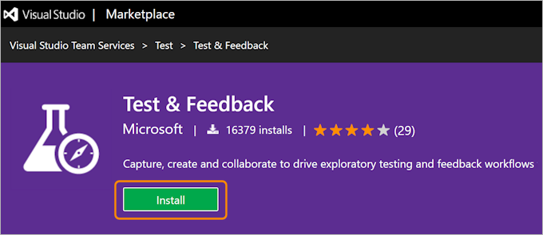

2. Add the Test & Feedback extension to Chrome.

      
    

3. Go to Chrome and open the extension.

    

4. Select to use the extension in Connected mode. And introduce the URL for your Visual Studio Team Services account **https://{youraccount}.visualstudio.com** and click **Next**

    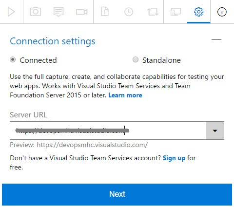

5. Select the desired **Team** and click **Save**

    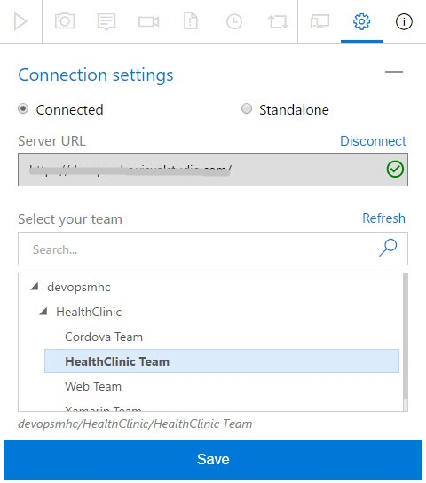

## Task 2: Create Test Case from exploration

1. Start your **Exploratory testing** session.

    

    >When you start the exploration you have different tools to add information to the session, like snapshots, screen video or notes.

    

    > Open the web application: `YOUR_WEBAPP_URI` (Check the web app uri in the existing resource group). and start exploring it.  

    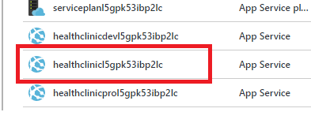  

2. When done exploring click on the **Create Work item** button and then on **Create Test case**

    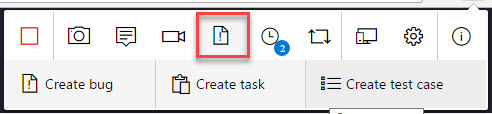  

    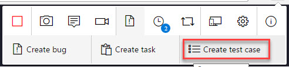

3. Introduce a title for the new **Test Case** and click **Save**.

    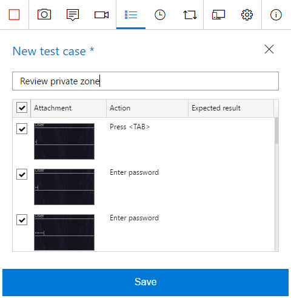

    > You can see in the **Create Test Case** screen all the steps recorded during the exploration. This allows you to quickly create new test cases, based on your navigation, that you can use later to test your application with manual or automated testing.  
    > Let's continue with the next steps to create a new **Bug**

## Task 3: Create bug

1. Click on take snapshot. You will be able to select the region of the screen you want to capture. Once selected the region, you will be able to include shapes and other information to the capture.

   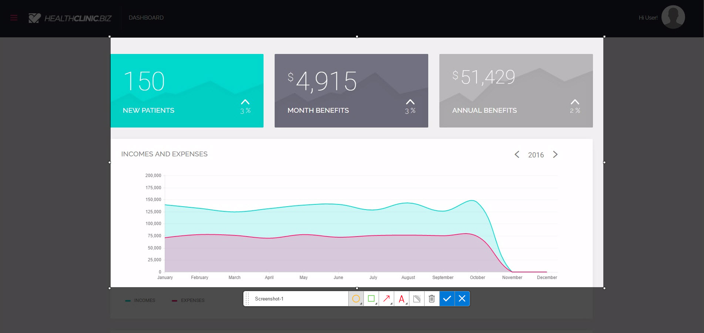

    > Click on the *tick* when done to finish the capture. 

    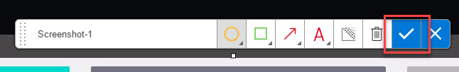

2. Click on add note and add a descriptive note and click on **Save** when done.

    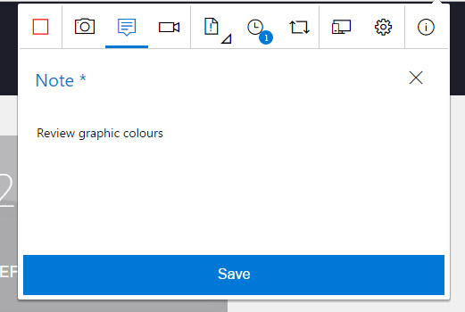

3. When done exploring click on the **Create Work item** button and then on **Create Bug**

      

    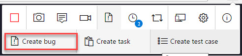

4. Introduce a title for the new **Bug** and click **Save**

    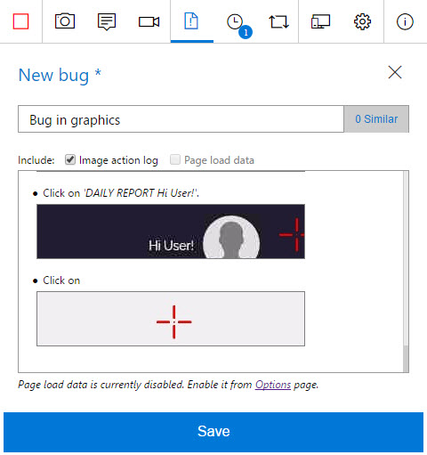

    > As with the **Test Case** creation, you will be able to see all recorded actions, as well as all additional screen shots and information included in the exploratory testing session.  
    > This will allow developers to quickly review and be able to reproduce the bug to solve it.

5. Close the exploratory testing session clicking on the stop button.

    

## Task 4: Review Test Cases and Bugs

1. Open your Visual Studio Team Services account in the browser  **https://{youraccount}.visualstudio.com**.

2. Open your Visual Studio Team Services Project.

3. Click on **Work \| Queries** to open your Work Item Queries.

    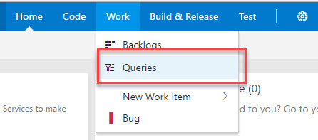

4. Test Cases created within exploratory testing sessions are automatically assigned to you, so you will see them on your assigned items, if you want you can assign them to any other member of the team once you review them and are ready to be used.

    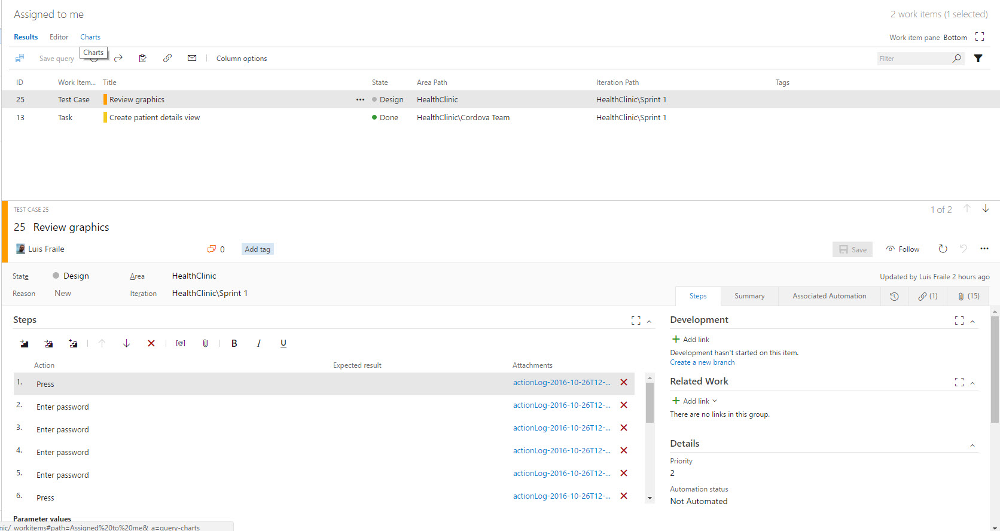

    > Opening the test case work item you will see all the information recorded during the session.

5. Click on **Work \| Backlogs** to open the backlogs.

    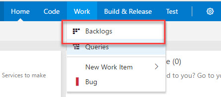

    > Bugs are introduced in the backlogs by default.

6. You should see the created bug in the backlog, if you double click on it, as with the Test Case, you will be able to see all the captured information, which is relevant to the bug, and will help developers to be able to reproduce and solve it.

    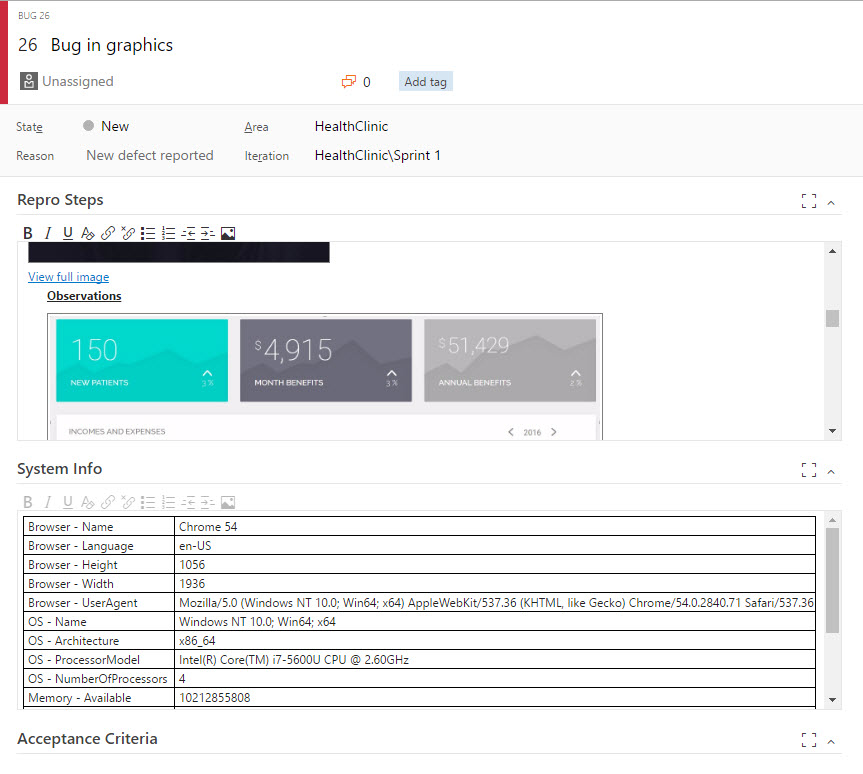

    > It is very important to provide all the information you can within the bugs to developers. This will ease all the process of reproducing and solving bugs during development cycles.
