Last updated : {{ "now" | date: "%b %d, %Y" }}.

## Overview

Team Services supports two types of version control Git and Team Foundation Version Control (TFVC). Here is a quick overview of the two version control systems:

 -**Team Foundation Version Control (TFVC)**: TFVC is a centralized version control system. Typically, team members have only one version of each file on their dev machines. Historical data is maintained only on the server. Branches are path-based and created on the server.

 -**Git**: Git is a distributed version control system. Git repositories can live locally (such as on a developer’s machine). Each developer has a copy of the source repository on their dev machine. Developers can commit each set of changes on their dev machine and perform version control operations such as history and compare without a network connection.

Git is the default version control provider for new projects. You should use Git for version control in your projects unless you have a specific need for centralized version control features in TFVC.

In this lab, you will learn how to establish a local Git repository, which can easily be synchronized with a centralized Git repository in Visual Studio Team Services. In addition, you will learn about Git branching and merging support.

## Prerequisites

In order to complete this lab you will need Visual Studio 2017. Click the button below to deploy a VS 2017 Community VM from the Azure marketplace.

<a href="https://labondemand.com/AuthenticatedLaunch/39008?providerId=4" class="launch-hol" role="button" target="_blank">Launch the virtual machine</a>



## Exercise 1: Cloning an existing repository

1. Sign in to your **Visual Studio Team Services** account and browse to **MyhealthClinic** project.

    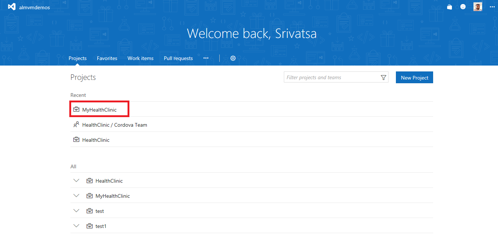

1. Navigate to the **Code** hub. Select **Clone** and select **Clone in Visual Studio**

    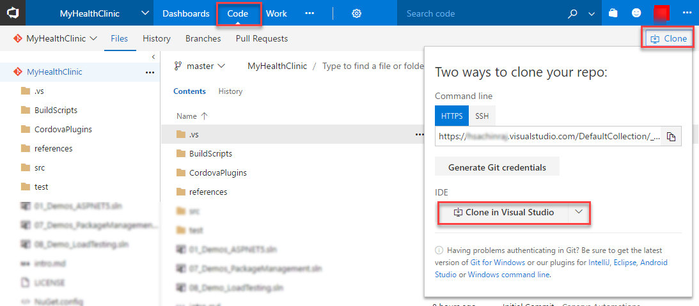

1. Click **Yes**

    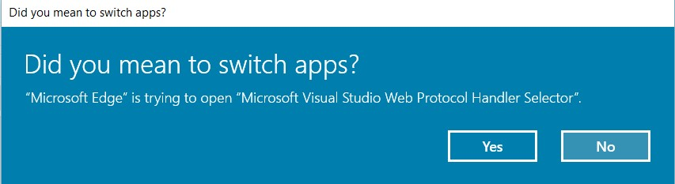

1. You might be prompted to sign into to your account from Visual Studio. Sign in to your account

1. Click on **Clone this repository**

    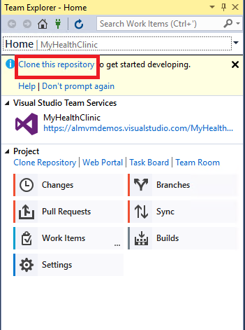

1. Set the local path where you want the local repository to be placed and select **Clone**.

    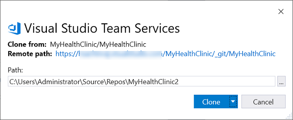

    This will clone the remote repository to the local repository.

1. Select **Show Folder View** under *Solutions* to see all the solutions in the local git folder

    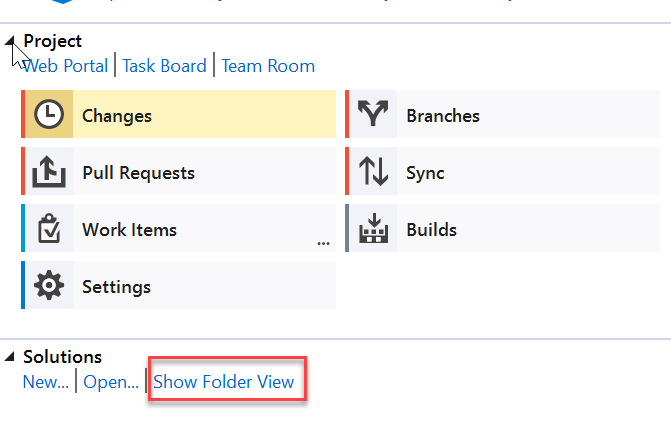

1. Double click the **MHC_ASPNetCore.sln** to open the solution

## Exercise 2: Save work with commits

When you make changes to your files, Git will record the changes in the local repository. You can select the changes that you want to commit by staging the changes. Commits are always made against your local Git repository, so you don't have to worry about the commit being perfect or ready to share with others. You can make more commits as you continue to work, and push the changes to others when they are ready to be shared.

What's in a commit?

Git commits consists of the following-

- The file(s) changed in the commit. Git keeps the contents of all file changes in your repo in the commits. This keeps it fast and allows intelligent merging.

- A reference to the parent commit(s). Git manages your code history using these references.

- A message describing a commit. You give this message to Git when you create the commit. It's a good idea to keep this message descriptive, but to the point.

### Task 1: Committing Changes

1. Open Visual Studio.

1. Go to **Team Explorer** home.

   

1. Open the **01_Demos_ASPNET5** solution.

   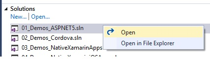

1. Expand the **MyHealthAPI project**. Go to the **controller** folder and modify any one of the controllers.
   As you write your code, changes are automatically tracked by Visual Studio.

   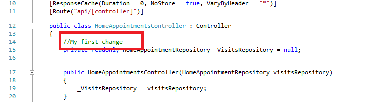

1. Open the **Changes** in **Team Explorer**. Enter a commit message and select **Commit All** to create a new commit with all of your changes.

   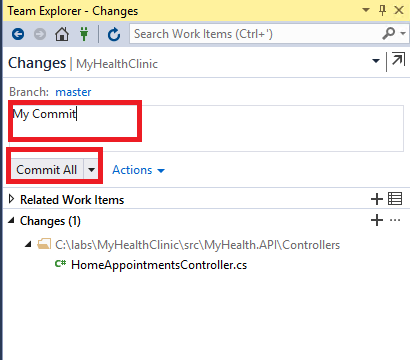

   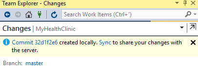

1. As other team members update the code in the repo, you will need to sync their changes with your own code.
   Open the sync view from the team explorer.

   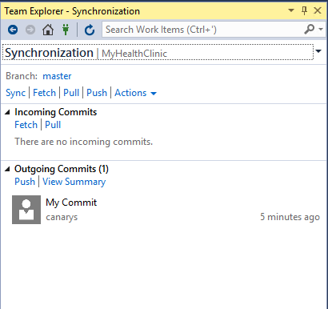

### Task 2: Syncing changes

1. Before syncing, fetch the commits to view changes that your team has made. Fetching changes does not merge the commits into your local repository. You will need to pull the changes to merge them into your local repository.

   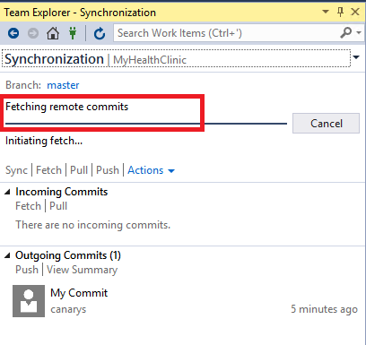

   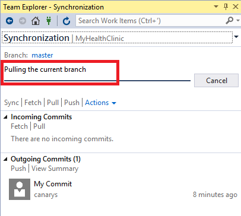

1. Sync the changes to push your commits.

   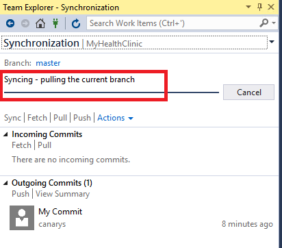

   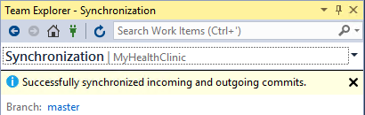

1. Go back to your VSTS project. Click on **Code** \| **History** to see the commits.

   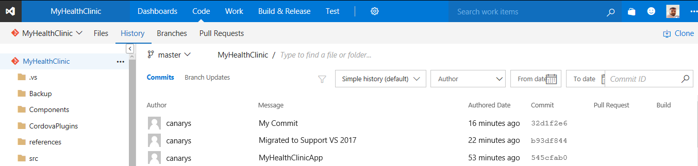

### Task 3: Stage

Staging changes allows you to selectively add certain files to a commit while passing over the changes made in other files. Ignore temp files, logs, and other
files that might change but you do not want to stage in a commit.

1. Switch to **Visual Studio**.

1. Expand the **MyHealth.API** project. Go to **Controllers** folder and modify any of the existing controllers.
   Modify two or more controllers.

1. Go to **Changes** view in team explorer. You can see two files being edited. Create a commit from a individual file. Staging a change creates a section in Team Explorer.
   This adds an entry to the file **.gitignore** in your local repo. If the ignored file was added to your repo in an earlier commit, ignoring the file will not remove it from your repo.

   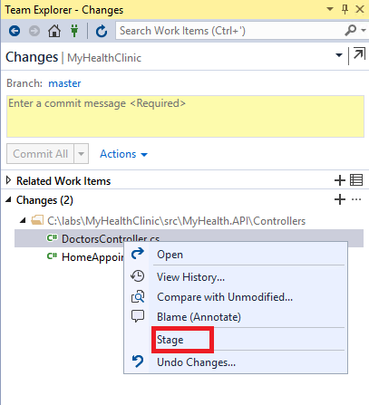

   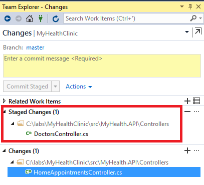

1. Click on **Commit Staged and Sync** to update your remote repository.

   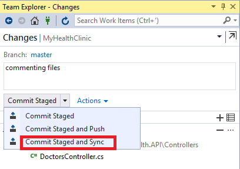

## Exercise 3: Review History

Git uses the parent reference information stored in each commit to manage a full history of your development. Review this commit history to find out when file changes were made and determine differences between versions of your code.

Git’s use of **Branches and Merges** feature works through pull requests, means the commit history of your development doesn’t form a straight, chronological line. When you use history to compare versions, think in terms of file changes between two commits instead of file changes between two points in time. A recent change to a file in the master branch may have come from a commit created two weeks ago in a feature branch but was only merged yesterday.

### Task 1: Compare files

1. Open Visual Studio.

1. Open up the Home view in Team Explorer.

   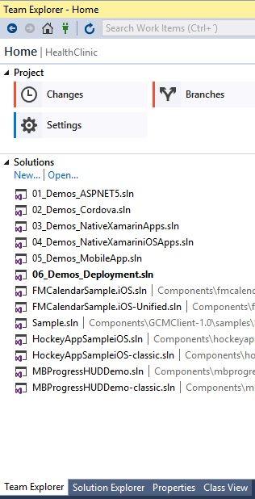

1. Expand the **MyHealth.API** project. Go to **controllers** folder and right click the controller file that you modified before and view history.
   The history window will show the commit ID, author, date, and description of all changes to the file in your local repo across all branches.

   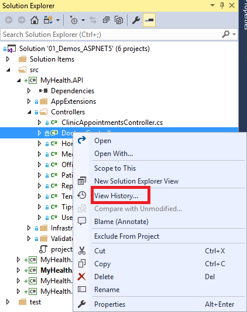

1. Right-click on the latest commit from the history window and choose **Compare with previous**.

   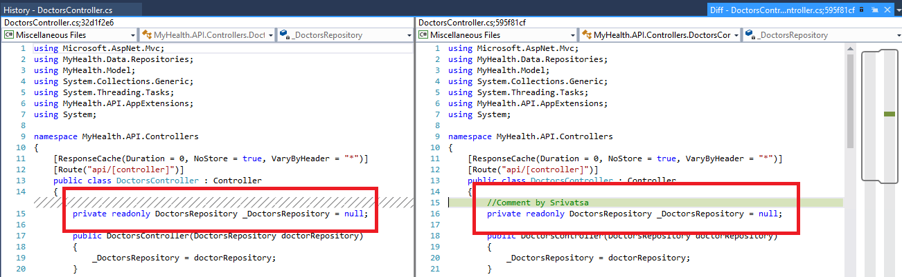

### Task 2: Retrieve files

1. Right-click the controller file that you modified before and select **View History**. You can filter the commits to find the exact commit with the file version you want to restore.

1. Right-click on the commit containing the version of the file you want to restore and select **View commit details**.

   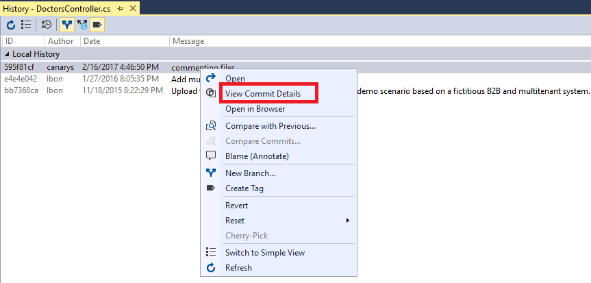

1. You will see the file in your team explorer. Right click the file and select open to restore in the Commit Details in Team Explorer.

   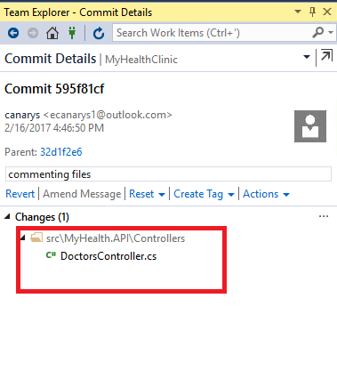

## Exercise 4: Manage Branches from Visual Studio

Manage the work in your Team Services Git repo from the **Branches** view on the web.
Customize the view to track the branches you care most about so you can stay on top of changes made by your team.

### Introduction

Committing changes to a branch will not affect other branches, and you can share branches with others without having to merge the changes into the main project.
Create new branches to isolate changes for a feature or a bug fix from your master branch and other work. Since the branches are lightweight, switching between branches
is quick and easy. Git does not create multiple copies of your source when working with branches, it uses the history information stored in commits to recreate the files
on a branch when you start working on it. Your Git workflow should create and use branches for managing features and bugfixes. The rest of the Git workflow, such as sharing
code and reviewing code with pull requests all work through branches. Isolating work in branches makes it very simple to change what you are working on by simply changing you
current branch.

### Task 1: Create a new branch in your local repositoy

1. Open **Team Explorer** from Visual Studio and go to the **Branches** view.

   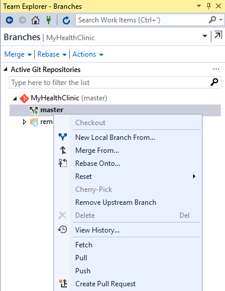

1. Right-click the parent branch (usually master) to base your changes and select **New Local Branch From**.

   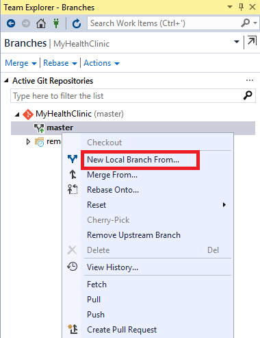

1. Provide a branch name and click **create branch**.

   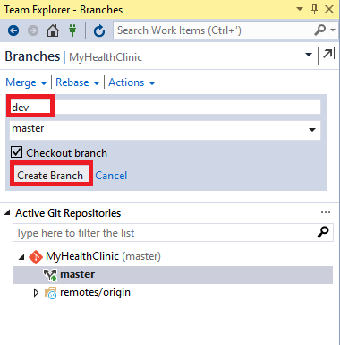

### Task 2: Checkout and Publish branches

Git keeps track of which branch you are working on and makes sure that when you checkout a branch your files match the most recent commit on the branch.
Branches let you work with multiple versions of the source code in the same local Git repository at the same time.

1. Open **Team Explorer** from Visual Studio and go to the **Branches** view. Locate the branch you want to checkout, right-click the branch name and **checkout**.

   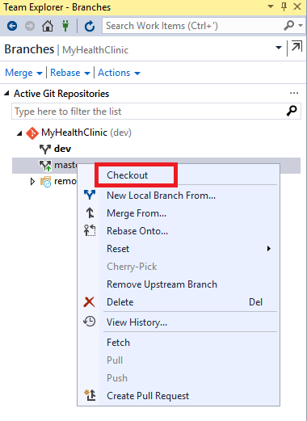

1. You can make sure that you have checked out the branch which indicates at the bottom of your Visual Studio window as shown.

   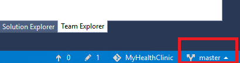

1. Locate the branch you want to publish.

   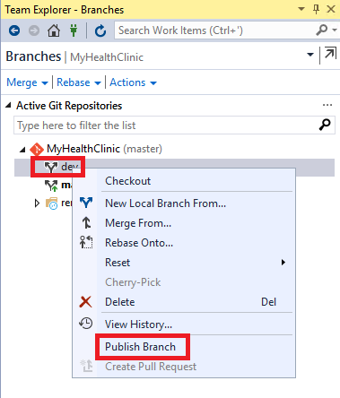

1. Right-click the branch name and select **Publish branch**.

   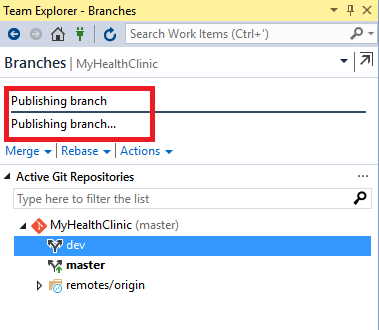

1. Go back to your VSTS account and check under the **Code** \| **Branches**, your branch was successfully published.

   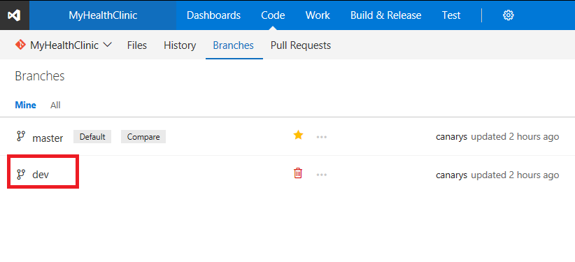

1. You can also see the branches under **remotes origin** section from your Visual Studio.

   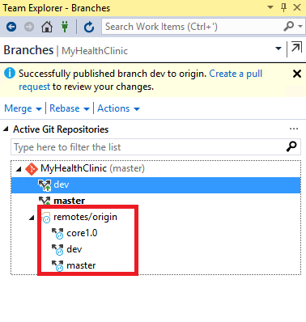

### Task 3: Deleting branches locally and remotely



1. Open **Team Explorer** from Visual Studio and go to the **Branches** view. Locate the branch you want to delete.
   Make sure that you aren't checked out to that branch. You can't delete the branch you are currently working in.

   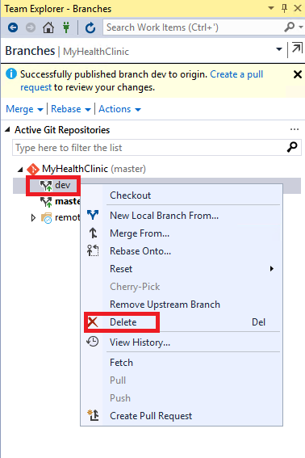

1. Select **delete**. You should see the message after the deletion.

   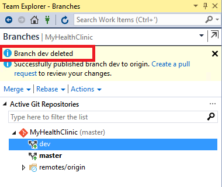

1. Let's try to delete a a remote branch. Locate the tree for the remote branch in Team Explorer such as (remotes/origin).
   Right click on the branch you wish to delete and select **Delete Branch From Remote**.

   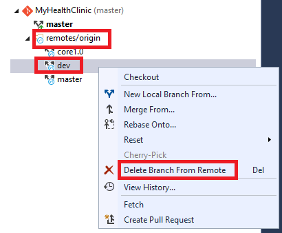

1. You should receive a successful message post deletion.

   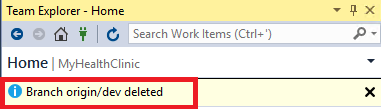

1. Go back to your VSTS project. Click on **Code** \| **Branches** to make sure that you don't see the branch that you deleted.

   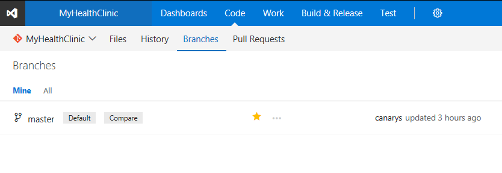

## Exercise 5: Manage branches from the Team Services Portal

### Task 1: Creating New Branch

1. Sign in to your Visual Studio Team Services account.

1. Go to **Code** \| **Branches** and click on **New Branch** to create.

   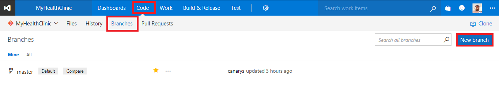

1. In the Create a branch dialog, enter a name for your new branch. Select a branch to base on and associate any work items if necessary and click on **create**.

   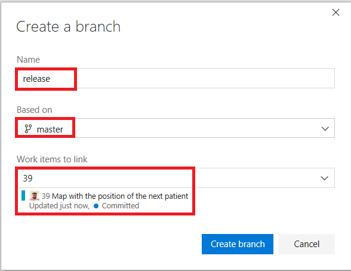

1. Post creation, you should be able to see under your branches.

   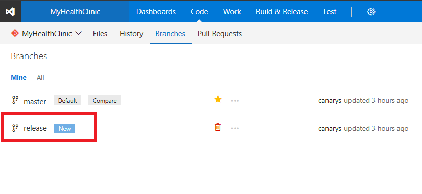

1. Go back to your Visual Studio to see the branch that was created. You will need to **fetch** the branch before you can swap to it in your local repo.

1. Open Team Explorer and go to Sync view and click **fetch**.

   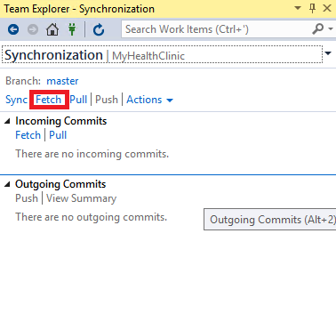

   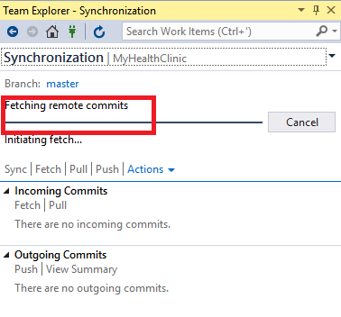

1. Go to the **Branches** view to see if the remote branch is available.

   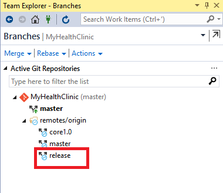

1. Locate the remote branch you want to checkout to your local repository. Right click the branch name and select **New Local Branch From**.

   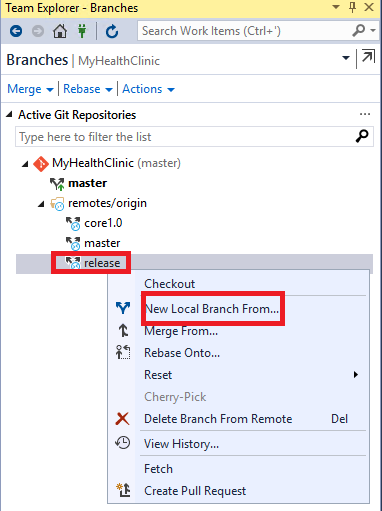

1. Provide a name for the local branch and click on **create**.

   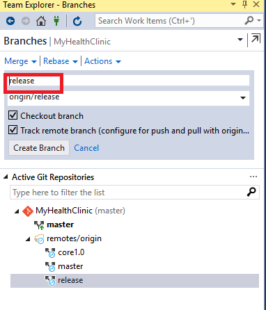

1. You should now see the local branch post creation.

     

### Task 2: Deleting a branch

1. Locate the branches from the web.

   

1. Select the **trashcan** icon next to the branch you want to delete.

   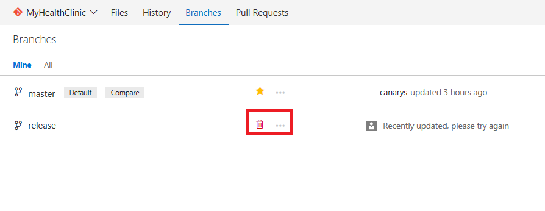

1. Once deleted, you should see something like this.  You can revert back by clicking **undo** if you accidentally delete a branch.

   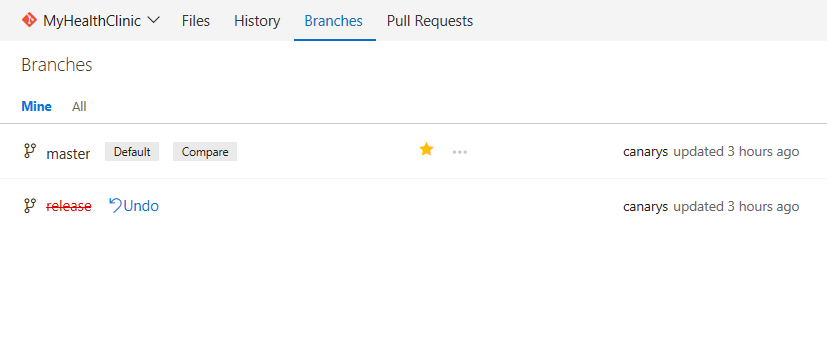

### Task 3: Locking Branch

Locking is ideal for preventing new changes that might conflict with an important merge or to place a branch into a read-only state.
Use branch policies and pull requests instead of locking if you just want to ensure that changes in a branch are reviewed before they are merged.

Locking does not prevent cloning of a repo or fetching updates made in the branch into your local repo.
Share with your team the reason for locking the branch and make sure your team knows what to do to work with the branch after it is unlocked.

1. Locate the branches from the web. Select the branch that you want to lock.

1. Lock the branch by selecting the **...** icon next to the branch name and then select **Lock** from the menu.

   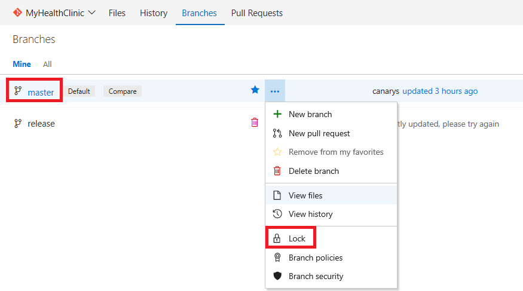

1. You should see the lock symbol after locking the branch.

   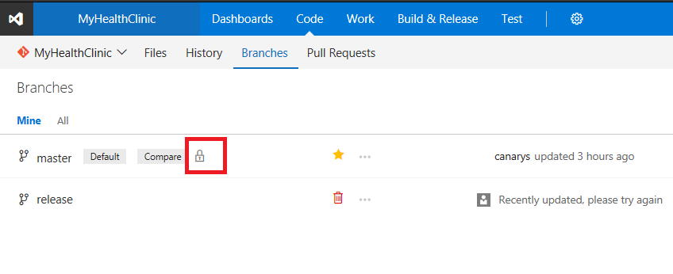

1. You can unlock the branch by selecting the **Unlock** from the menu.

## Exercise 6: Pull requests

Pull requests let your team give feedback on changes in feature branches before merging the code into the master branch.
Reviewers can step through the proposed changes, leave comments, and vote to approve or reject the code.

### Task 1: Create a new pull request from Team Explorer in Visual Studio

1. Open **Team Explorer** from Visual Studio and go to the **Branches** view. Checkout the **dev** branch. If you don't have one, create.

1. Load the **01_Demos_ASPNET5** solution.

1. Expand the **MyHealth.API** project. Go to **Controllers** folder and modify any one of the controller file and sync the changes to push your commits and pull changes from others.

   

1. Now, your changes are updated in remote dev branch.

1. Go to the Team Explorer Home view.

1. Select **Pull requests** from Team Explorer pane. You will promote changes from dev to Master branch.

   

1. Select the **New Pull Request** link to open up a browser window to create a new pull request on the web.

   

1. You can Link work items and describe the changes in the branch to make it easier for others to see what problem you are trying to solve. You can also add reviewers.

   

1. Click on **New Pull Request** to create. You should see the overview. You can approve, add comments and do lot more.

   

### Task 2: Manage Pull requests

Manage your pull requests you own or are assigned to with the Pull Requests tab in the Code view on the web.

1. Open the Pull Request view while viewing your repo on the web. Select **Active** to show all active pull requests for the current repo.
   You can also select Completed or Abandoned to bring up a history of closed pull requests.

   

1. Select any of the existing pull request assigned to you. The Overview tab shows the current state of the pull request at a glance.

   

1. Review the title, description, and discussion to get an understanding of the proposed changes and see issues brought up by other reviewers.

1. Select the **Files** tab to view the differences between the most changes between the source and target branch of the pull request.

   

1. Review previous versions of the code pushed to the source branch of the pull request from the **All changes** drop-down.
   A new version is added to the list in the drop-down and on the Updates tab every time the branch is updated in Team Services.

   

1. Locate the file where you want to add a new comment.

   

1. Add comments to the pull request to make suggestions, reply to previous comments, and point out problems with the proposed changes.

   
1. We can change to Tree view to get the proper structure of the source code or just list files. We can also view all the comments/active comments/hide comments.

   

1. Browse a list of changes by push from the author using the Updates tab.

   

1. You can select and view changes made in commits on the branch in the **Commits** tab.

    

1. Go back to the **Files** Tab. Click on the **comments** to check the details of the files modified and comments given by reviewer.

    > New comments start in Active status and can be updated using the drop-down in the comment to:

    - **Active:** Comment is still under review.
    - **Resolved:** The issue brought up in this comment has been fixed.
    - **Pending:** The issue in this comment will be addressed, but isn't fixed yet.
    - **Won't Fix:** Note the suggestion in the comment, but don't make changes in this pull request to address it.
    - **Closed:** Discussion for this comment is closed.

    

1. Click **Approve** in the upper right of the pull request view.

    > The default option is Approve, but you can select other options from the drop-down:

      - **Approve with suggestions :** Agree with the pull request, but provide optional suggestions to improve the code.
      - **Waiting for the author :** Do not approve the changes, and ask the author to review your comments. The author should let you know when you should re-review the code after they have addressed your concerns.
      - **Rejected :** The changes aren't acceptable. If you are voting this way, you should leave a comment in the pull request detailing why the changes were rejected.

    

1. Click **Complete** in the upper right of the pull request view.

    

1. Enter the message used for the merge commit and update the pull request description as needed in the dialog that follows.
    You can choose to squash merge your pull request and delete the source branch once the merge is complete.

    

    

1. Click Complete merge. You should see a successful message as completed.

    

1. Go back to your **Pull Requests** from the web, you should see completed pull request under **completed** tab.

    

1. Open the file view and select the **master** branch \| **History** to make sure the changes have merged successfully.

    

1. The master branch is updated successfully.

## Exercise 7: Manage Repositories

Create Git repos in team projects to manage your project's source code. Each Git repo has its own set of permissions and branches to isolate itself from other work in your project.

### Task 1: Create a new repo from the web portal

1. Sign in to your **Visual Studio Team Services** account.

1. From your account overview page, select your team project. To find your team project, you can search as well.

   

1. Go to **Code** tab and select the drop-down next to the current repo name.

   

1. Select **New Repository** to create one. In the Create a new repository window, verify that Git is the repo type and enter a name for your new repo.

   

1. Click **Create**. A new empty Git repo is now created in your team project. You can select clone in your favorite IDE to connect the repo to your local
   development environment, or connect to your new repo using the command line instructions provided.

   

1. Open up the Connect view in Team Explorer. Visual Studio will show all the existing repos in the Team Service project so you can choose whatever you want to clone.

   

   

### Task 2: Delete a Git repo from your team project

Remove unused repos from your team project to organize your project's source code.

1. Select the **gear icon** and navigate to **Version Control**.

   

1. Choose the repository that you wish to remove and click on **...** to select **delete repository**.

   

1. Confirm the removal of the repository by clicking on **Delete.**

   

### Task 3: Renaming a Git repository in your team project

1. Select the **gear icon** and navigate to **Version Control**.

   

1. Choose the repository that you wish to rename and click on **...** to select **rename repository**.

   

1. Confirm the rename of the repository by clicking on **Rename.**

   
