## Overview  

Load Testing allow us to stress the application and review how it behaves under diferent load of users so we can take actions on the current infrastructure adding more capacities for the times we think we will need it.    
Load Testing in visual Studio is billed by Virtual User minutes, more info [here](https://www.visualstudio.com/team-services/pricing/)

## Pre-requisites

In order to complete this lab you will need-

- **Visual Studio Team Services account**. If you don't have one, you can create from <a href="https://www.visualstudio.com/">here</a>

- **Visual Studio 2017** or higher version

- You can use the **[VSTS Demo Data generator](http://vstsdemogenerator.azurewebsites.net/Environment/Create)** to provison a project with pre-defined data on to your Visual Studio Team Services account. Please use the ***My Health Clinic*** template to follow the hands-on-labs.

- If you are not using the VSTS Demo Data Generator, you can clone the code from here

## Exercise 1: Create a basic URL Load Testing

1.  Sign in to your Visual Studio Team Services account and click on **Load Test** 

    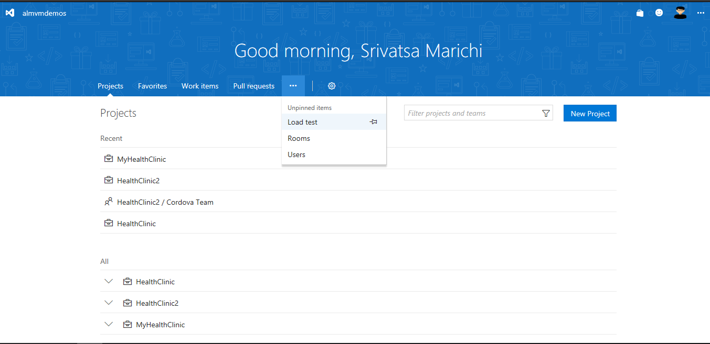
    

2. Click on **Create test** in the **URL** panel.

    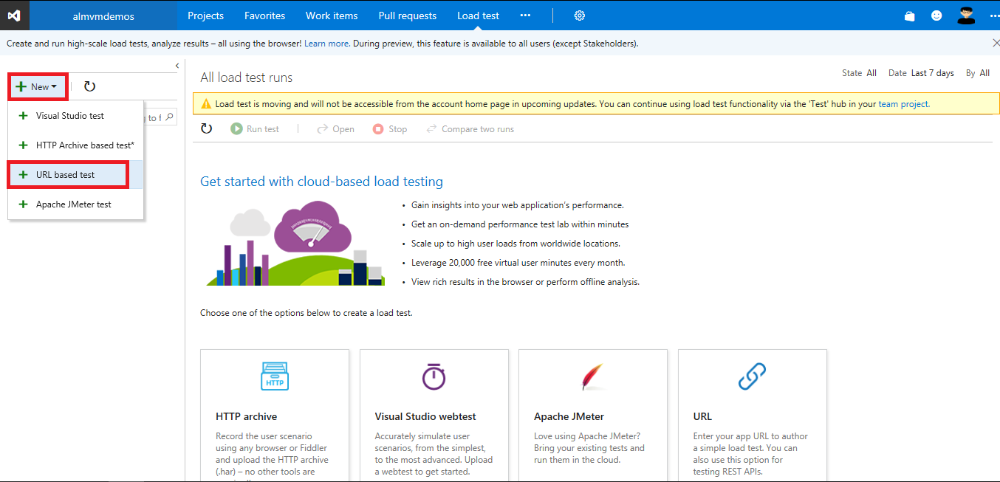

    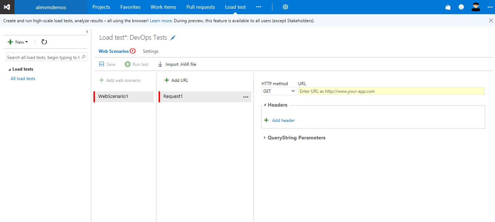

3. Name the test **DevOps Tests**

    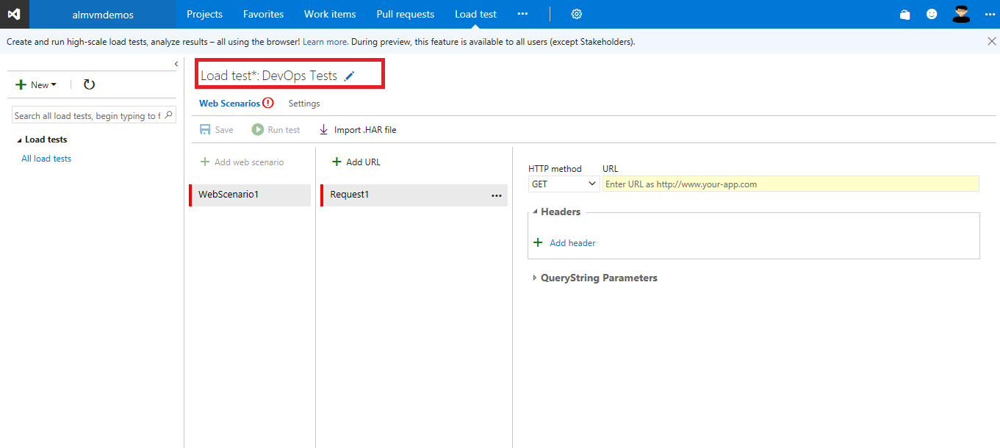

4. On this screen we will start typing the URLs we need to test from the application. Before starting go to your Azure Resource Group to get the URI of the Web App Service.

     

5. Let's start with the homepage of the application:

    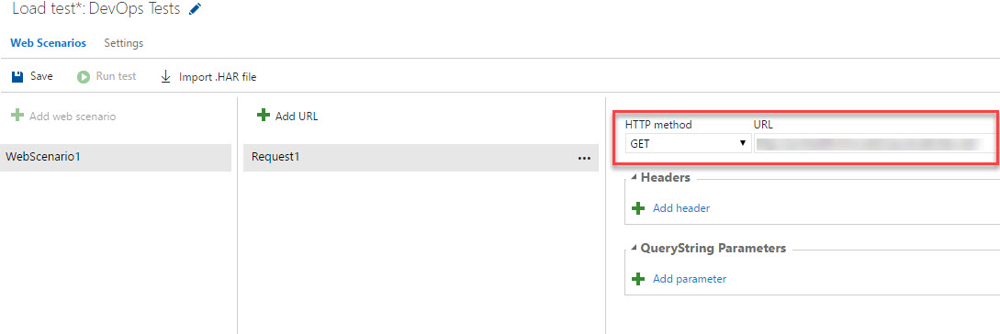

    > Here you can also specify how the **HTTP Method** call will use as well as additional parameters like **Querystring** parameters.

6. You can add addtional **URLs** with the **Add URL** button.

    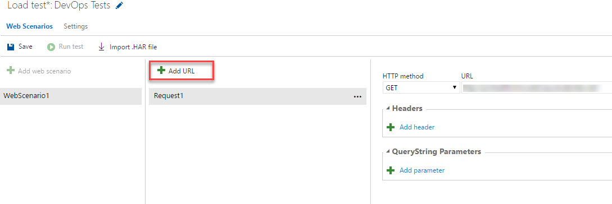

    > A Load Test can be created with several calls to different URLs, Visual Studio Team Services Load Testing will execute all of them sequentially, in the same order as introduced, for each simulated user.

7. Now we will configure the duration, load pattern and other settings we will use for the load tests. Click on **Settings**

    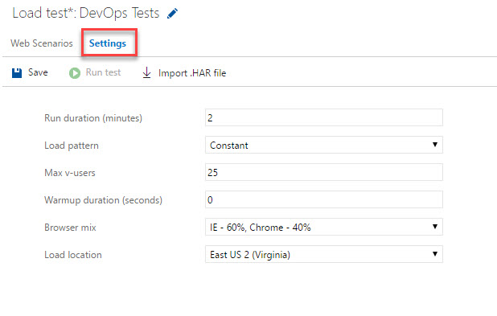

8. On duration we will leave the default value of 2 minutes.

    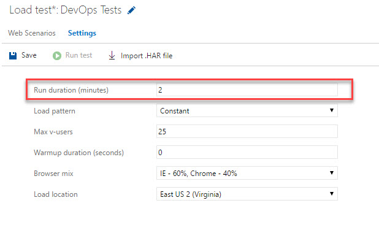

    > When modifiying this value remember Load Tests are priced by <a href="https://www.visualstudio.com/team-services/pricing/" />Virtual User Minutes</a>

9. For load pattern we have two options. We will select **Constant** with 25 users.  

    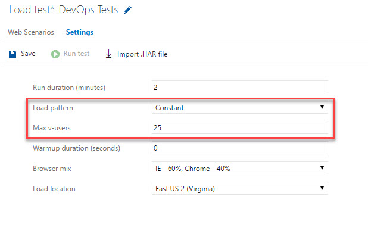

    >**Constant** will simulate the same amount of virtual users during the whole load test, this value is specified in the **Max v-users** field.

    > **Step** load pattern will start with a selected amount of users, and will increase the amount by a selected quantity each selected period of time. In this case it will start with 10 users, and it will increment by 5 every 10 seconds.

    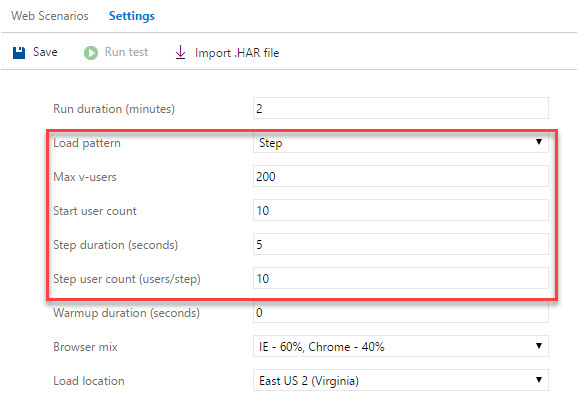

    > We will stick to **Constant** load of **25 users**.

10. **Warm up duration** is the period between the beginning of the test and when the data samples start being recorded. This is frequently used to step load virtual users to reach a certain load level before recording sample values. The sample values that are captured before the warm-up period ends are shown in the results. Leave it to 0 seconds in this case.

    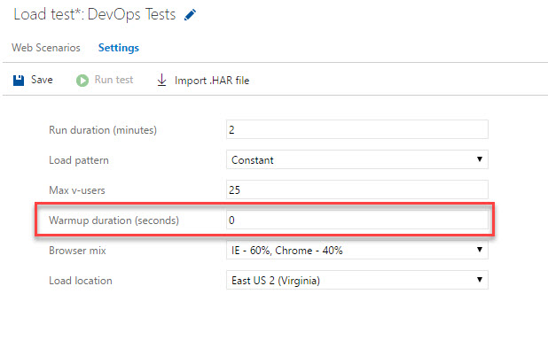

11. As applications sometimes render different content or behave differently depending on the browser user-agent. The **Browser mix** allow us to simulate different kind of browser percentages. Note this will only have influence on the **User-agent** header sent to the application, as load tests only tests HTTP Calls, so it does not render different HTML or interpret HTML responds. You only need to use this if your application behaves differently from a server side point of view. Leave the default value.

    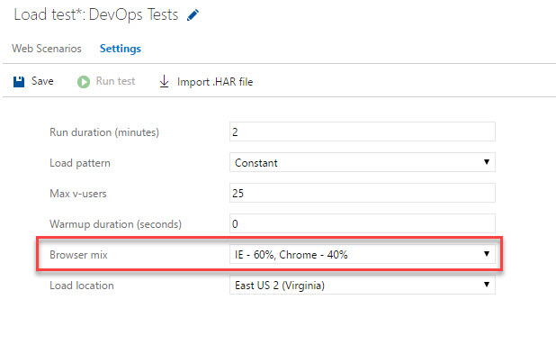

12. **Load location** allow us to select different Azure locations, in the case we need to test our application from different regions. In this case select the region nearest to your application.

    

13. Click **Save**.

    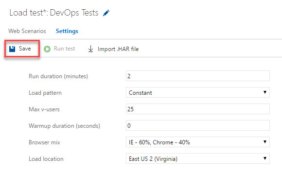

    > Now we have a complete **Load Test** created, let's continue with execution.

## Exercise 2: Load Test execution

1. Click on **Run test** this will queue the load test, we will see the waiting for test agents screen. Visual Studio Team Services will provision the needed agents to run the tests based on the number of users selected for the test run

    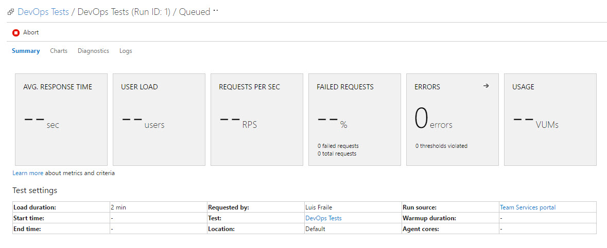

2. Once it starts running we will see live metrics on how the test and application are behaving. Now the Visual Studio Team Services auto-provisioned agents are calling the URLs configured in the load tests, with the number of users configured.

    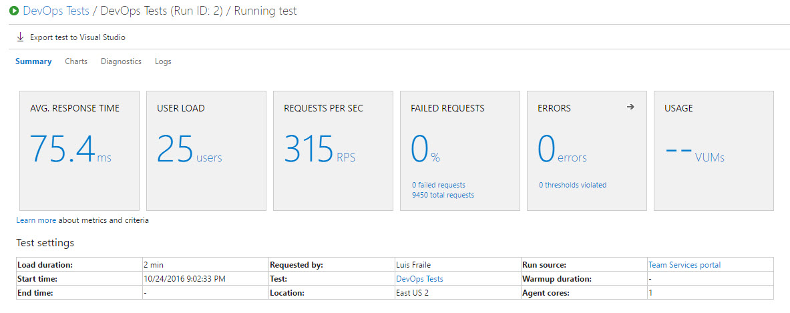

    > In this screen we can see metrics in real time like average response time, current number of virtual users, request per second while running the tests, % of failed requests, errors and Virtual User Minutes used.

3. When the test finishes we will have the final results of the tests, as well as charts, diagnostics information and logs.

    > The first screen shows the results of the tests, the same information we saw during the test run but with final data.

    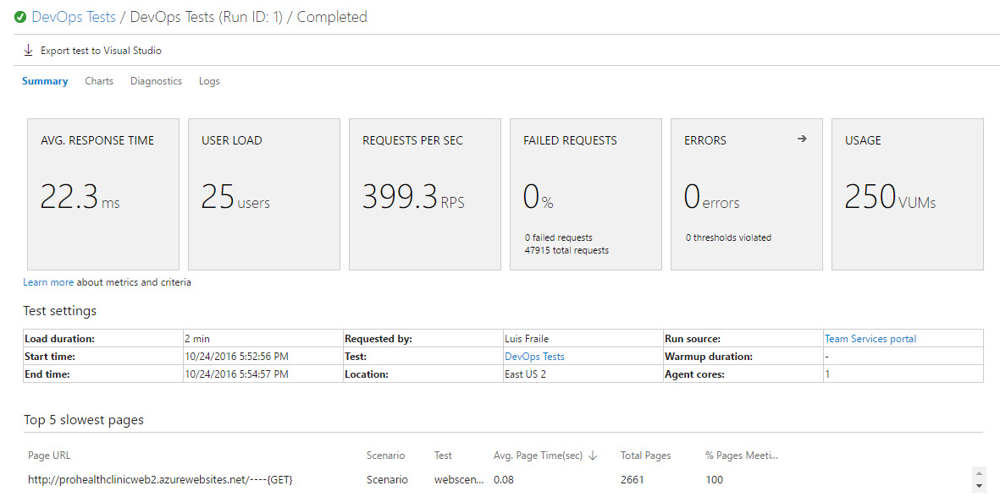
    
    > Clicking on the **charts** shows all the data in graphics so we can see trends and changes of response and user load during the full test execution

    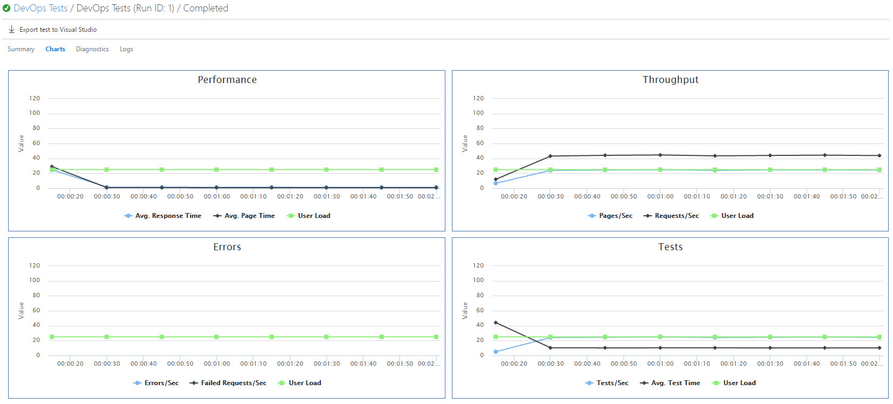

    > **Diagnostics** information shows all important data realted to the test execution itself, like the final number of Virtual Users Minutes

    

    > **Traces** from this screen you will be able to download the log files of the test execution.

    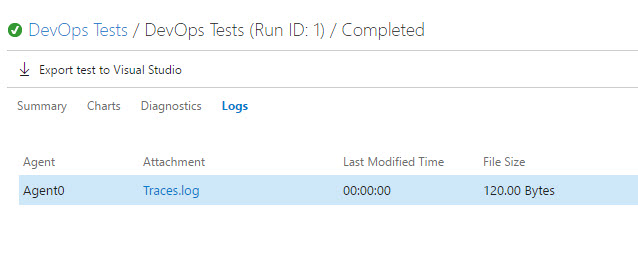

## Exercise 3: Recovering previous results

All results from previous test executions can be reviewed as they are stored in Visual Studio Team Services so we can compare with new results any time we need them.

1. From the same **Load Test** tab, in the left pane, you have all of your load tests, select the recently created **DevOps Tests**.

    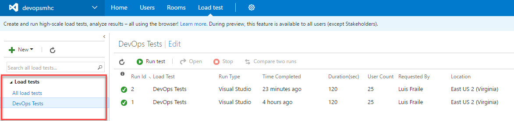

2. On the right pane it shows all executions of your Load Test.

    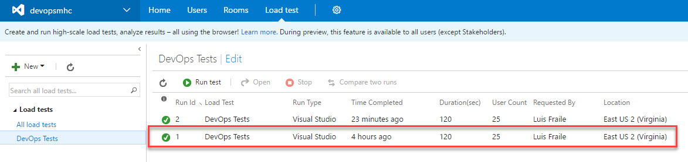

3. Double click on it so you are taken to the results page.

    

    > Here you can review again the whole results from this execution.
