Lab version:15.0.26228.0

Last updated:3/15/2017

<a name="Overview"></a>
## Overview ##

[Microservices](https://docs.microsoft.com/en-us/azure/service-fabric/service-fabric-overview-microservices) have become popular approach to designing sophisticated applications. By adopting a microservices architecture, teams can easily scale different parts of their applications depending on the needs of their customers. They can also be more agile as they roll out changes and thus provide features to customers faster and more frequently.

In this lab you will develop microservices using ASP.NET Core, and then you will deploy and debug them in local Docker containers. You will then use the ASP.NET publishing experience to deploy those containers to the Azure App Service, as well as configure continuous delivery for Visual Studio Team Services to enable an automated build and deploy workflow to Azure Container Service.

<a name="Prerequisites"></a>
### Prerequisites ###

This lab requires the following to be installed on your machine:

1. Windows 10 Anniversary Edition with [Hyper-V](https://docs.microsoft.com/en-us/virtualization/hyper-v-on-windows/quick-start/enable-hyper-v) and [Containers](https://docs.microsoft.com/en-us/virtualization/windowscontainers/quick-start/quick-start-windows-10) enabled

1. [Visual Studio 2017](https://www.visualstudio.com/) with the [Continuous Delivery Tools for Visual Studio](https://marketplace.visualstudio.com/items?itemName=VSIDEDevOpsMSFT.ContinuousDeliveryToolsforVisualStudio) extension installed

1. [Docker For Windows](https://docs.docker.com/docker-for-windows/install)

1. [PuTTY](http://www.chiark.greenend.org.uk/~sgtatham/putty/download.html)

    You also need an [Azure account](https://azure.microsoft.com/) and a [Visual Studio Team Services (VSTS) account](https://www.visualstudio.com/team-services/).

<a name="Exercise1"></a>
## Exercise 1: Creating Microservices with ASP.NET Core ##

<a name="Ex1Task1"></a>
### Task 1: Creating a microservice project using ASP.NET Core and Docker ###

1. Launch **Visual Studio**.

1. From the main menu, select **File | New | Project**.

1. From the **Visual C# | .NET Core** category, select the **ASP.NET Core Web Application** template. Enter the **Name** of **"Web"** and the **Solution Name** of **"AzureMicroservicesLab"**. Click **OK**.

   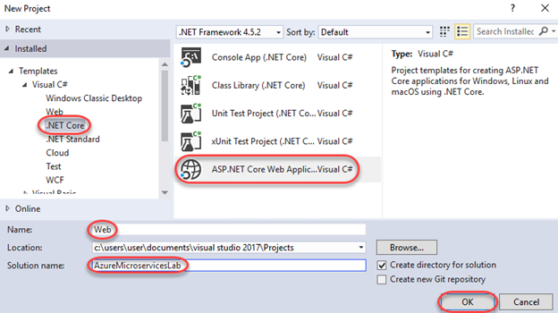

1. The first microservice will provide the web front-end to the application. Select the **Web Application** template and make sure **Enable Docker Support** is not selected. We could enable it here, but we'll add it in the next step to show how seamless the experience is for adding it to existing projects. Click **OK** to create.

   

1. In **Solution Explorer**, right-click the **Web** project node and select **Add | Docker Support**. This is all you need to do to Docker-enable a project in Visual Studio.

   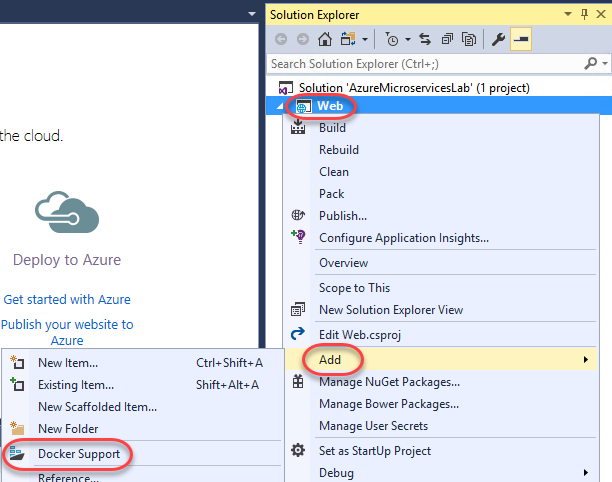

1. Now let's take a look at some of the Docker files added to the solution. Double-click the **Dockerfile** added to the **Web** project to open it.

   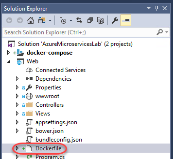

1. **Dockerfile** describes the application, including the base container, the port number to expose the application on, the entry point of the application, and more. You can learn more about this format [here](https://docs.docker.com/engine/reference/builder).

   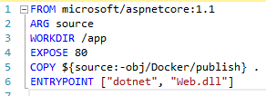

1. You'll also notice that the Docker support added a set of solution files contained in a virtual **docker-compose** folder. Double-click **docker-compose.yml** to open it.

   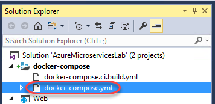

1. **docker-compose.yml** describes how the application should be composed of the required services to set up a given environment. Right now there's just one service for the **Web** project we just created.

   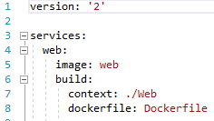

1. Also notice that the traditional **Debug** button has become a **Docker** button. Click it to build the project and deploy it to a container for testing.

   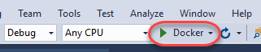

1. The site is just the default project right now. However, it's important to recognize that it's running from a Docker container, not local IIS or a simulated host.

   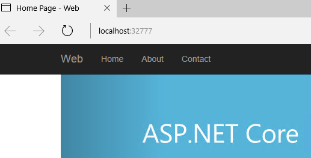

1. Open a new instance of **PowerShell** and enter the following command to view the details of what's currently running in Docker.

    ```
    docker ps
    ```
1. There's a lot of useful information here, including the confirmation that the port from the test URL is being mapped to port 80 of the container as specified in the project **dockerfile**.

   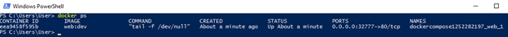

1. Switch back to **Visual Studio** and open **Web\Views\Home\Index.cshtml**.

   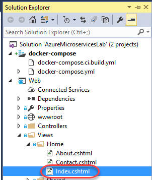

1. Change the first instance of the word **"apps"** to **"microservices"** and press **Ctrl+S** to save the file.

   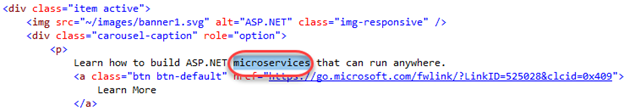

1. Return to the browser and refresh the page. On the first page of the carousel you will see your changes are already applied, just as if it were running locally. Close the browser.

   

1. Return to **Visual Studio** and select **Debug | Stop Debugging**.

<a name="Ex1Task2"></a>
### Task 2: Adding and debugging an API microservice project ###

1. Since microservice applications are designed to be composed of multiple services, we will now add an additional service to provide an API for the web application to use. In **Solution Explorer**, right-click the solution node and select **Add | New Project**.

   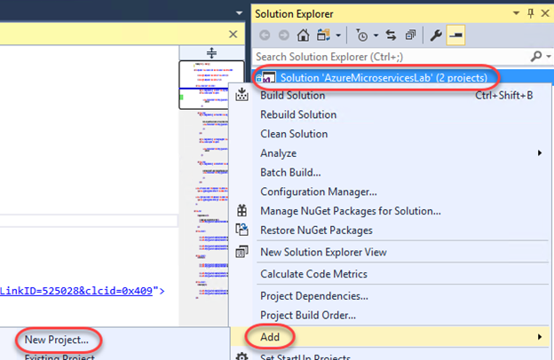

1. From the **Visual C# | .NET Core** category, select the **ASP.NET Core Web Application** template. Set the **Name** to **"Api"** and click **OK**.

   

1. This time, select the **Web API** template and ensure **Enable Docker Support** is checked. This will give us a Docker-enabled project that's immediately integrated with the solution-level Docker support. Click **OK** to create.

   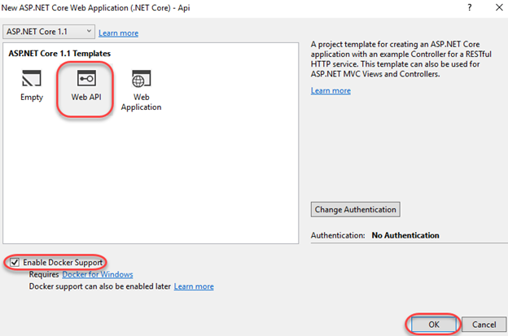

1. You may get a message that **docker-compose.yml** has changed. If so, reload the file. Otherwise, open it from **Solution Explorer**.

   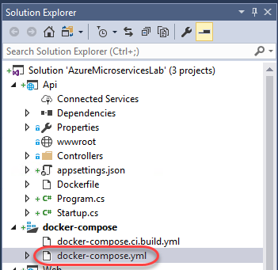

1. Now you will see that the second API project has been added alongside the web application. When built and run, they will be deployed to separate Docker containers and able to access each other as configured.

   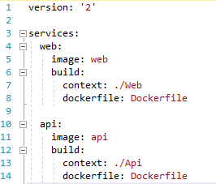

1. Open **Api\Controllers\ValuesController.cs**.

   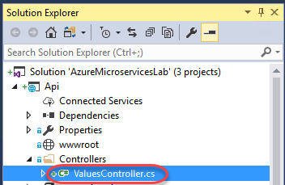

1. Replace the existing **Get** method with the code below. This is just a minor change to make the API easier to consume for our lab purposes. Do not remove the **[HttpGet]** attribute.

    ```c#
    public string Get()
    {
        string message = "API";
        return message;
    }
    ```
1. Set a breakpoint on the **return** line.

   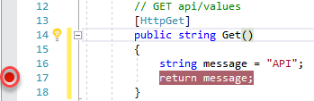

1. Open **Web\Controllers\HomeController.cs**.

   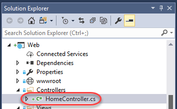

1. In the **About** method, replace the existing **ViewData["Message"]** line with the following code. This is a quick & dirty connection to the API service using the baseline networking available in .NET Core. It will be executed when users visit the **About** page on the site.

    ```c#
    System.Net.Http.HttpClient client = new System.Net.Http.HttpClient();
    var result = client.GetAsync("http://api/api/values").Result;
    string text = result.Content.ReadAsStringAsync().Result;
    ViewData["Message"] = "The value is " + text;
    ```
1. Set a breakpoint on the **return** line.

   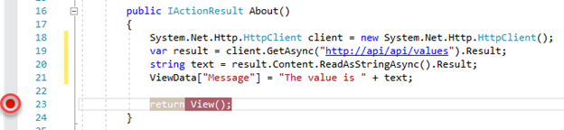

1. Press **F5** to build and run the project.

1. After the build completes and the browser is launched, switch to **PowerShell** and run the **docker ps** command again to see that both services are now running in their own containers.

   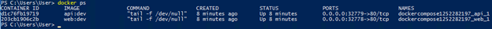

1. Return to the browser and select the **About** tab. This will trigger the breakpoint in the API container.

   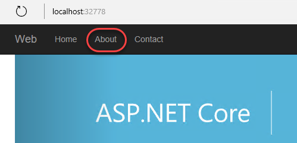

1. Hover over the **message** variable and change its value by editing the tooltip. Even though the service is running in a container, you still get the full power and flexibility of Visual Studio.

   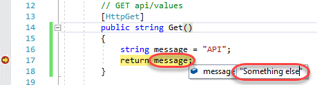

1. Press **F5** to continue running. This will then trigger the breakpoint in the Web container. You can hover over the **text** variable to see the data that was pulled back by the API call. Debugging even the most complex microservice application compositions is just as easy as if all the code were running in the same process.

   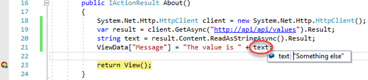

1. Press **F5** one more time to finish the page cycle. You will see the API data included in the page rendering.

   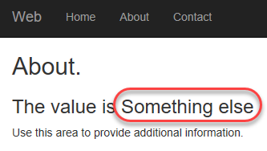

1. Close the browser window.

1. In **Visual Studio**, select **Debug | Stop Debugging**.

<a name="Ex1Task3"></a>
### Task 3: Creating an Azure Container Service ###

1. Launch **PuTTYgen**. We will use it to generate the public key required to set up an Azure Container Service instance. There are other options for generating keys that may be more appropriate for the level of control you need in production. Please see [this article](https://docs.microsoft.com/en-us/azure/virtual-machines/virtual-machines-linux-ssh-from-windows?toc=%2fazure%2fvirtual-machines%2flinux%2ftoc.json) for more details.

1. Click **Generate** to start the key generation.

   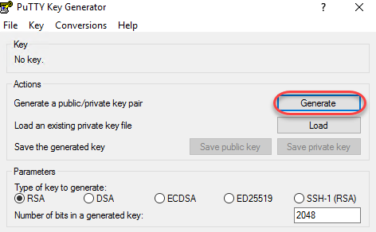

1. You will need to move your mouse around in the area below the progress bar until it completes.

   

1. Open a browser window and log in to [http://portal.azure.com](http://portal.azure.com/).

1. Click **+New** and search for **"container"**. Click **Azure Container Service** as soon as it appears.

   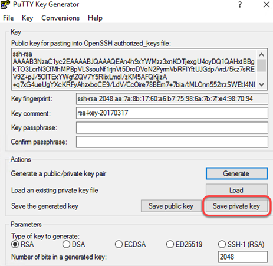

1. Click **Azure Container Service** in the search results.

   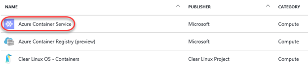

1. Click **Create** to begin the creation process.

   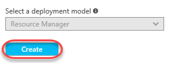

1. Select **DC/OS** as the **Orchestrator** and enter a **Resource group** name of **"azuremicroserviceslab"**. Click **OK** to continue.

   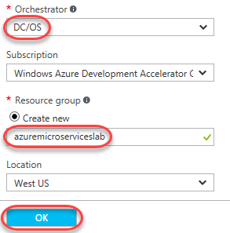

1. Return to the **PuTTY Key Generator** and copy the **Public key** to the clipboard.

   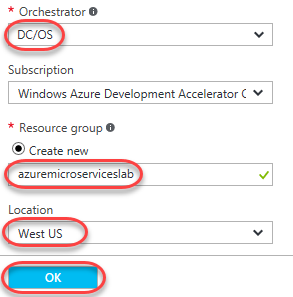

1. Set the **DNS name prefix** to **"azuremicroserviceslab"** and enter a **User name** (such as **"johndoe"**). Paste the **SSH public key** from the clipboard. Click **OK** to continue.

   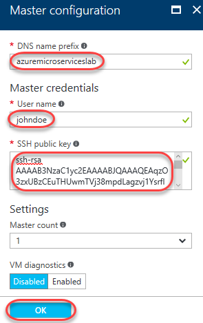

1. Click **OK** for the default **Agent configuration**.

   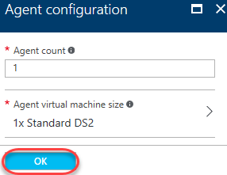

1. Once validated, click **OK** on the summary page to start creation. This may take a while.

   

1. You can wait for deployment to complete by watching the tile added to your Azure dashboard.

<a name="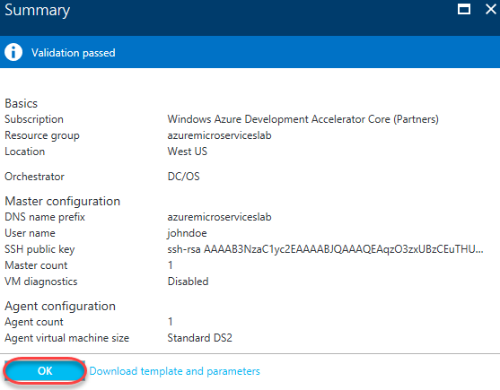"></a>
###  ###

<a name="Ex1Task4"></a>
### Task 4: Deploying from Visual Studio to your Azure Container Service ###

1. Now let's take a look at the process for deploying your containers out to Azure. Return to **Visual Studio** and sign in using the button in the top right corner. Already being signed in will make things easier in this task.

   

1. In **Solution Explorer**, right-click the **Web** project node and select **Publish**.

   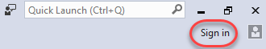

1. Select the **Azure App Service Linux (Preview)** option and click **Publish**.

   

1. Enter a unique **Web App Name**. You might be able to use **"AzureMicroservicesLab"**, or you may need to append some random numbers to find a name all your own. It really doesn't matter what the name is for the purposes of this lab. Review the other options to make sure they're the ones you want to use in this lab. Click **Create**.

   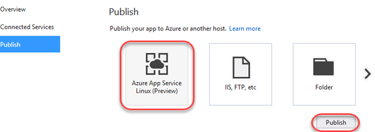

1. As the build and publish process progresses, you'll eventually see the push of the bits specific to this solution. Note that the full container isn't deployed, but rather just the differential changes needed to update the application.

   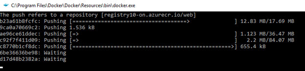

1. After the containers have been deployed, a browser will open to the **Site URL** configured earlier. If not, you can open it manually.

   

1. Close the browser when satisfied.

<a name="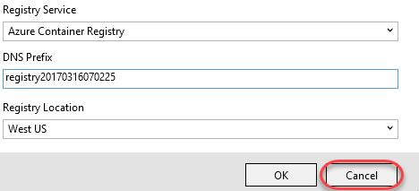"></a>
###  ###

<a name="Ex1Task5"></a>
### Task 5: Setting up Continuous Delivery via Visual Studio Team Services ###

1. While it's great to be able to push a deployment out from Visual Studio, sophisticated teams look for opportunities to leverage automation where possible. With **Visual Studio Team Services**, it's really easy to set up continuous delivery such that project changes are automatically built, tested, and processed through a release workflow if meeting all requirements. To start to take advantage of all of this opportunity, right-click the solution node in **Solution Explorer** and select **Add Solution to Source Control**.

   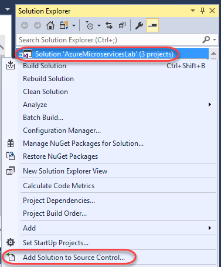

1. From the dropdown in **Team Explorer**, select **Sync**.

   

1. Click **Publish Git Repo**.

   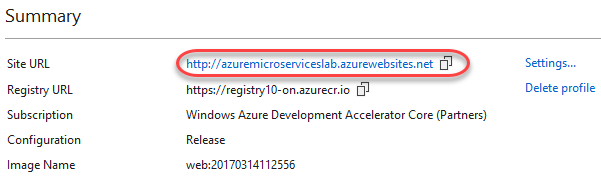

1. Select the VSTS account you want to use. If you haven't associated an account yet, add one now. Then keep the default **Repository name** and click **Publish repository**.

   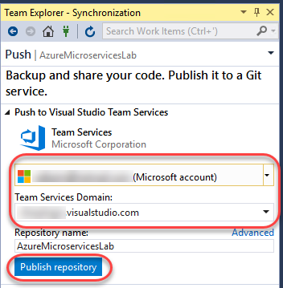

1. In **Solution Explorer**, right-click the **Web** project node and select **Configure Continuous Delivery**.

   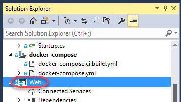

1. The continuous delivery settings are similar to the publish settings we configured earlier. Select the settings you would like to use for this lab (probably the same as earlier) and click **OK**. The process may take a few minutes to complete.

   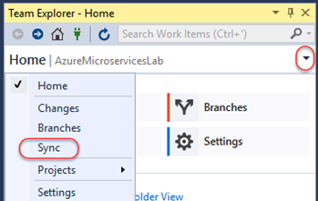

1. After the process has completed, locate the **Build Definition** URL from the **Output** pane. Copy this URL and paste it into a new browser window to view the build definition created by Visual Studio.

   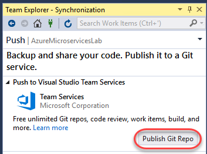

1. The build should complete pretty quickly. However, if you get there quickly enough, you'll see some live build details.

   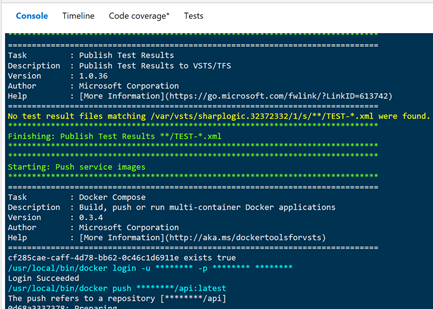

1. Once the build completes, take some time to review the results.

   

1. Click **Edit build definition** to view the details of the build configuration and tasks.

   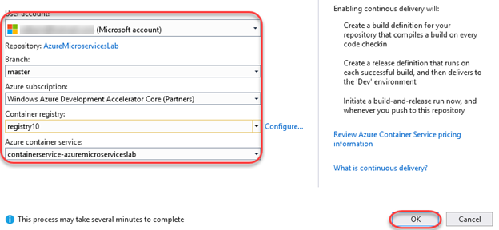

1. There are many tasks available for build definitions, including some specialized for working with Docker. Select the **Build repository** task and notice that the **docker-compose** file is one of the ones managed at the solution level from earlier.

   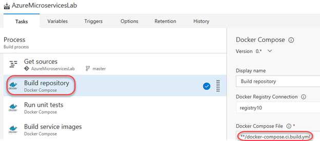

1. Select the **Releases** tab to view release progress.

   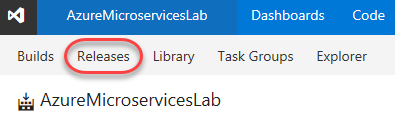

1. In addition to the build, the default configuration for continuous delivery will automatically deploy the containers out to a development environment. Double-click the green bar to view the status of that environment.

   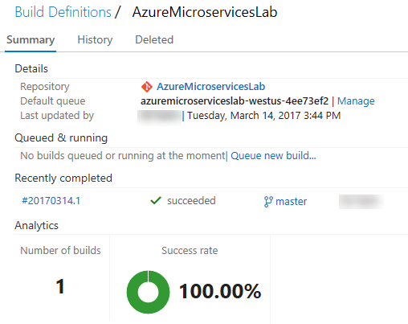

1. Notice that in addition to the **Dev** environment, there are already **Test** and **Production release** environments available for you to work with.

    

